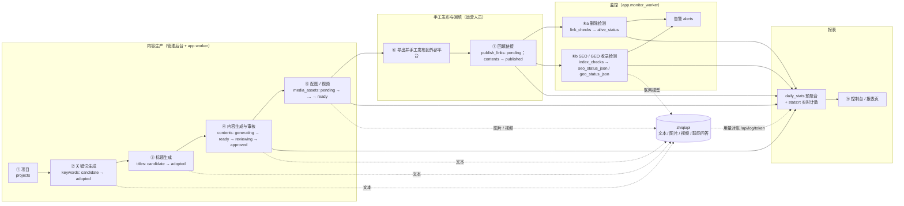

# 00 产品概述

> 本文是 aicreat 全套设计文档的入口：定义产品定位、角色、模块能力、端到端业务流程、非目标，以及全局共享的关键名词与状态枚举取值集合。各模块的字段、接口与状态流转**规则**由对应文档权威定义，本文只引用、不改写；文档索引与引用约定见 [README](./README.md)。

## 1. 产品定位

aicreat 是面向运营 / 内容团队的 **AI 内容生成与效果监控平台**（内部工具，B 端，无 C 端用户）。它把内容运营的完整链路收口到同一个管理后台：

| 主线 | 做什么 | 落到哪里 |
| --- | --- | --- |
| 内容生产 | 以项目为单位，用 AI 批量生成关键词 → 候选标题 → 文章（大纲先行、分段生成、重写 / 扩写 / 缩写 / 改风格、SEO 要素、FAQ、版本历史），并为文章生成配图 / 封面与视频 | `projects`、`prompt_templates`、`generation_batches`、`keywords`、`titles`、`contents`、`content_versions`、`media_assets` |
| 手工发布与回填 | 文章由运营人员**手工**发布到知乎、微信公众号、小红书、CSDN、头条、百家号、企业官网等外部平台，再把发布链接回填到平台（一篇文章可对应多个平台、多条链接） | `publish_platforms`、`publish_links` |
| 效果监控 | 定时检测回填链接是否被删除 / 篡改；是否被百度 / Bing / Google 收录（SEO）；是否被百度 AI 搜索、豆包、Kimi、DeepSeek、Perplexity、ChatGPT 等生成式引擎引用（GEO）；异常产生告警 | `link_checks`、`index_checks`、`alerts` |
| 控制台报表 | 总览 KPI、日 / 周 / 月趋势、按项目 / 平台 / 人员 / 模型 / 能力分解、AI 消耗（tokens / 额度 / 费用）、任务成功率与耗时、链接存活率、收录率、榜单与 CSV 导出 | `daily_stats` + Redis 实时计数 `stats:rt:{date}:{project_id}` |
| 统一 AI 网关 | 全部文本 / 图片 / 视频 / 联网检索能力经 zhiqiapi 调用：模型目录与价格同步、能力 → 模型路由与候选链、重试 / 熔断 / 健康探测、用量对账；无密钥时本地 Mock | `ai_models`、`capability_routes`、`ai_tasks`、`ai_usage_logs` |

**与 zhiqiapi 的关系（一句话）**：aicreat 自身不训练、不托管任何模型，所有 AI 能力（文本、图片、视频，以及 SEO / GEO 检测所需的联网问答）统一通过 zhiqiapi（志奇引擎，new-api 系统一 AI 网关，`ZHIQI_BASE_URL=https://zhiqiapi.com/v1`，`Authorization: Bearer <ZHIQI_API_KEY>`）调用；`ZHIQI_API_KEY` 留空时整套能力切换为本地 Mock，无密钥也能跑通全流程。详见 [08-zhiqiapi-integration](./08-zhiqiapi-integration.md)。

**技术栈一句话**：完全沿用 navigation 工程——Python 3.11 + FastAPI + Pydantic v2 + SQLAlchemy 2.x + Alembic + MySQL 8 + Redis 7 + httpx 的后端，两个轮询式 worker 进程（`python -m app.worker`、`python -m app.monitor_worker`），唯一前端为 Vue 3 + Vite + TypeScript + Element Plus + Pinia + vue-i18n 的管理后台 `apps/admin`（`base: /admin/`，端口 5174），pnpm@9 workspace + docker-compose + Nginx 编排。详见 [01-architecture](./01-architecture.md) 与 [02-project-structure](./02-project-structure.md)。

## 2. 目标用户与角色

平台只有「管理员」这一类用户（表 `admins`），通过用户组（`admin_groups`）获得权限码（`admin_permissions`，格式 `module.resource.action`，`menu` 型 `*.view` 与 `action` 型两级）。所有业务接口都在 `/api/v1/admin/*` 之下，需要管理员 JWT（`aud=admin`，`token_version` 失效机制）+ 权限码；只有 `POST /api/v1/admin/auth/login`、`GET /api/v1/admin/auth/site-info`、`GET /api/v1/health` 与媒体文件 `GET /media/{key}` 公开。

| 角色 | 系统用户组 `admin_groups.code` | 典型工作 | 默认权限范围（摘要；完整规则见 [07-admin-rbac](./07-admin-rbac.md)） |
| --- | --- | --- | --- |
| 超级管理员 | `super_admin` | 系统配置、「AI 网关 → 能力路由」与「AI 网关 → 模型目录」、管理员与用户组、发布平台规则、Prompt 模板发布、项目删除、重算统计 | 全部权限码（`PERMISSION_CODES` 全集） |
| 运营人员 | `operator` | 建项目、生成 / 采用关键词与标题、生成 / 编辑 / 提审内容、生成配图与视频、手工发布后回填链接、手动检测、处理告警、看报表 | `dashboard.view`；`content.*`（不含 `content.contents.review`、`content.projects.delete`、`content.prompt_templates.publish`、`content.prompt_templates.delete`）；`media.*`；`publish.links.*` 与 `publish.platforms.view`；`monitoring.*`；`ai.*.view` + `ai.tasks.retry` / `ai.tasks.cancel`；`stats.reports.view` / `stats.reports.export`；`system.upload.view` / `system.upload.create` |
| 审核人员 | `reviewer` | 审核内容（通过 / 驳回），必要时直接修改正文；查看生产数据与监控结果 | `dashboard.view`；`content.*.view` + `content.contents.review` / `content.contents.update` / `content.contents.export`；`media.*.view`；`publish.*.view`；`monitoring.*.view`；`stats.reports.view` |
| 只读 | `read_only` | 查看控制台与报表、导出报表、查看非敏感数据 | 除 `security.*` 与 `system.settings.view` 外的全部 `*.view`，加 `stats.reports.export` |

- 四个系统用户组由迁移 `0002_seed_permissions.py` 写入，不可删除 / 停用 / 清空权限；自定义用户组由超级管理员创建，`code` 由服务端生成 `custom_{uuid4().hex[:12]}`。
- 首次 seed 的超级管理员为 `admin` / `admin123`（环境变量 `SEED_ADMIN_USERNAME` / `SEED_ADMIN_PASSWORD`，启动日志提示修改）。
- 所有写接口成功后记入 `admin_operation_logs`（审计中间件按「方法 + 路径」映射 `action`），密码 / 密钥 / 令牌不记录。
- 界面语言 zh-CN / en-US 由 vue-i18n 切换；**生成内容的语言**由 `projects.language` 决定（默认 `zh-CN`），与界面语言无关。

## 3. 核心能力（按模块）

下表按需求总纲的模块逐一说明；「权威」列是该模块字段、接口与状态流转的唯一定义处，本节各小节只给出概览与关键约束（摘要表不超过 5 行，请求 / 响应字段以 [04-api-spec](./04-api-spec.md) 为准）。

| 模块 | 能力说明 | 核心表 | 接口前缀（`/api/v1`） | 权限码资源 | 后台页面（`apps/admin/src/views/`） | 权威 |
| --- | --- | --- | --- | --- | --- | --- |
| 项目 / 专题（Project） | 内容生产的组织单位：行业、受众、品牌信息、默认语言 / 风格 / 格式、默认 Prompt 模板、常用平台、项目级默认模型；所有关键词 / 标题 / 内容 / 素材 / 链接归属项目 | `projects`、`capability_routes`（`project_id>0` 覆盖行） | `/admin/projects` | `content.projects.*` | `projects/Index.vue`、`projects/Detail.vue` | [09](./09-generation-pipeline.md)、[03](./03-data-model.md) |
| Prompt 模板体系 | 系统模板（seed，`sys_*`）与项目专属模板，`{{variable}}` 占位、变量声明、输出格式（`json` / `markdown` / `text`）、版本与发布 | `prompt_templates` | `/admin/prompt-templates` | `content.prompt_templates.*` | `prompt-templates/Index.vue`、`prompt-templates/Editor.vue` | [09](./09-generation-pipeline.md) |
| 关键词生成 | 种子词 / 行业 / 竞品 / 受众 → LLM 批量生成候选词（搜索意图、词型、难度 / 热度 / 综合分、推荐理由为可选字段）；手工新增、JSON / CSV 导入、CSV 导出；项目内去重；候选 / 采用 / 弃用 | `keywords`、`generation_batches` | `/admin/keywords`、`/admin/generation-batches` | `content.keywords.*`、`content.batches.*` | `keywords/Index.vue`、`generation-batches/Index.vue` | [09](./09-generation-pipeline.md) |
| 标题生成 | 对未弃用（`candidate` / `adopted`）的关键词生成 N 个候选标题，可配风格（资讯 / 教程 / 测评 / 问答 / 种草 / 清单 / 故事）；手工新增、人工编辑、打分、采用（采用标题要求其关键词已 `adopted`） | `titles`、`generation_batches` | `/admin/titles` | `content.titles.*` | `titles/Index.vue` | [09](./09-generation-pipeline.md) |
| 内容生成 | 标题 + 关键词 + 大纲 + 模板 → 文章（Markdown / HTML）：大纲先行、分段生成、重写 / 扩写 / 缩写 / 改风格、SEO 要素（`seo_title` / `seo_description` / `seo_keywords` / `summary`）与 FAQ、质量规则（`banned_word` / `too_short` 阻断提审）、版本历史、手工新建、审核流与归档 | `contents`、`content_versions`、`generation_batches` | `/admin/contents` | `content.contents.*` | `contents/Index.vue`、`contents/Editor.vue` | [09](./09-generation-pipeline.md) |
| 图片生成 | 文生图、图生图（参考图为公网 URL，≤ 9 张）；用于封面 / 配图 / 独立素材；可由文章自动生成配图提示词；异步任务 + 轮询 + 转存；支持重试 / 取消 / 删除 | `media_assets`、`ai_tasks` | `/admin/media`、`/admin/uploads` | `media.images.*`、`media.assets.*`、`system.upload.*` | `media/ImageGenerate.vue`、`media/Assets.vue` | [10](./10-media-generation.md) |
| 视频生成 | 文生视频、图生视频（参考图 / 首尾帧）、可选生成音频；长任务（预算 20 分钟）轮询 + 下载保存（无同步回退）；支持重试 / 取消 / 删除 | `media_assets`、`ai_tasks` | `/admin/media` | `media.videos.*`、`media.assets.*` | `media/VideoGenerate.vue`、`media/Assets.vue` | [10](./10-media-generation.md) |
| 用户操作 + 回填链接 | 运营人员在外部平台手工发布后，在平台回填链接（平台、URL、发布账号、发布时间、回填人）；一篇文章多条链接；URL 规范化与去重；平台自动识别；链接编辑（URL 不可改）/ 删除 | `publish_platforms`、`publish_links` | `/admin/platforms`、`/admin/links` | `publish.platforms.*`、`publish.links.*` | `platforms/Index.vue`、`links/Index.vue`、`links/Detail.vue` | [11](./11-link-backfill-and-monitoring.md) |
| 链接监控：删除检测 | SSRF 安全抓取器定时探测链接：HTTP 状态、跳转、平台特征文案、标题 / 正文指纹变化 → 存活状态流转与告警；平台特征规则存表、后台可维护 | `link_checks`、`publish_links`、`publish_platforms` | `/admin/links/{id}/check`、`/admin/monitoring/link-checks` | `publish.links.check`、`monitoring.link_checks.*` | `monitoring/LinkChecks.vue` | [11](./11-link-backfill-and-monitoring.md) |
| 链接监控：SEO / GEO 收录检测 | SEO：按引擎（百度 / Bing / Google）经「收录检测提供器」判断是否收录；GEO：按引擎（百度 AI 搜索 / 豆包 / Kimi / DeepSeek / Perplexity / ChatGPT）经 zhiqiapi 联网模型提问并解析引用；记录证据，形成收录率 / 引用率与首次收录耗时 | `index_checks`、`publish_links` | `/admin/links/{id}/index-check`、`/admin/links/{id}/mark-index`、`/admin/monitoring/index-checks` | `publish.links.check` / `publish.links.mark`、`monitoring.index_checks.*` | `monitoring/IndexChecks.vue`、`links/Detail.vue` | [11](./11-link-backfill-and-monitoring.md) |
| 告警 | 链接被删除 / 恢复 / 被改、收录长期未达、AI 任务连续失败、熔断、额度不足、鉴权失败、上游不可用、媒体任务失败、worker 心跳丢失；站内告警中心，webhook / 邮件通道预留 | `alerts` | `/admin/alerts` | `monitoring.alerts.*` | `alerts/Index.vue`、顶栏 `AlertBadge.vue` | [11](./11-link-backfill-and-monitoring.md) |
| 控制台报表 | 总览 KPI（含环比与迷你趋势）、趋势、分解、榜单、CSV 导出、重算；按日 × 项目 × 维度预聚合 + 今日实时计数兜底 | `daily_stats` | `/admin/stats` | `dashboard.view`、`stats.reports.*` | `Dashboard.vue`、`stats/Reports.vue` | [12](./12-dashboard-reports.md) |
| 统一 AI 网关接入 | zhiqiapi 适配层：三协议文本、异步 / 同步图片、视频任务；模型目录与价格同步；能力路由（主模型 + 备选链）；重试 / 熔断 / 超时预算；错误分类；额度估算与 `/api/log/token` 对账；健康探测（一键测试）；Mock | `ai_models`、`capability_routes`、`ai_tasks`、`ai_usage_logs` | `/admin/ai/models`、`/admin/ai/routes`、`/admin/ai/tasks`、`/admin/ai/usage`、`/admin/ai/health` | `ai.models.*`、`ai.routes.*`、`ai.tasks.*`、`ai.usage.*` | `ai/Models.vue`、`ai/Routes.vue`、`ai/Tasks.vue`、`ai/Usage.vue` | [08](./08-zhiqiapi-integration.md) |
| 管理员与权限、系统配置 | 管理员、用户组、权限码、操作日志（沿用 navigation RBAC）；`settings` 表存各模块运行配置 JSON | `admins`、`admin_groups`、`admin_permissions`、`admin_group_permissions`、`admin_operation_logs`、`settings` | `/admin/auth`、`/admin/admins`、`/admin/admin-groups`、`/admin/admin-permissions`、`/admin/admin-operation-logs`、`/admin/settings` | `security.*`、`system.settings.*` | `admins/Index.vue`、`admin-groups/Index.vue`、`admin-operation-logs/Index.vue`、`settings/Index.vue` | [07](./07-admin-rbac.md)、[04](./04-api-spec.md) |

### 3.1 项目 / 专题

- 项目是所有业务对象的归属单位：`keywords` / `titles` / `contents` / `media_assets` / `publish_links` / `generation_batches` / `ai_tasks` 都带 `project_id`；后台顶栏有全局项目选择器（`store/project.ts`），列表页默认按当前项目过滤。
- 项目携带生成上下文：`industry`、`audience`、`brand_name`、`brand_info`（注入 Prompt 变量 `brand_info`）、`language`、`default_style`（`content_style`）、`default_format`（`markdown` / `html`）、`default_templates_json`（以 `prompt_kind` 为键指定已发布模板 ID）、`default_platform_ids_json`（API 字段去掉 `_json` 后缀）。
- 项目级默认模型不在 `projects` 表存储，而是 `capability_routes` 的项目覆盖行（`project_id = 项目 ID`），由运营侧 `PUT /admin/projects/{id}/routes` 维护，管理员侧 `/admin/ai/routes` 可设全部列。
- 状态 `active` / `archived`；仅已归档且无任何下游对象时可物理删除（`DELETE /admin/projects/{id}`，否则 409）。

### 3.2 关键词生成

| 项 | 说明 |
| --- | --- |
| 输入 | `POST /admin/keywords/generate`（`project_id`、`seeds[]`、`count`、可选 `competitors[]` / `audience` / `template_id` / `model`）；默认模板 `sys_keyword`，默认 `generation_config.keyword.default_count=20`、上限 `max_count=50` |
| 执行 | 创建 `generation_batches(kind=keyword)` + 1 个根任务 `ai_tasks(operation=keyword_generate)` 入队 `queue:ai_tasks`，由 `app.worker` 调用 zhiqiapi 文本能力（`capability=keyword`），输出 JSON 数组逐条插入；前端轮询 `GET /admin/generation-batches/{id}` |
| 去重、新增与导入导出 | `normalized_keyword`（NFKC、去空白、小写、全角转半角）项目内唯一，冲突项跳过并计入批次 `error_summary`；手工新增 `POST /admin/keywords`（`source=manual`、`status=candidate`，`normalized_keyword` 冲突返回 409）；导入 `POST /admin/keywords/import`（JSON）与 `POST /admin/keywords/import-file`（CSV 列 `keyword,intent,keyword_type`），`source=imported`；导出 `GET /admin/keywords/export`（UTF-8 BOM CSV，与列表同筛选，权限沿用 `content.keywords.view`） |
| 字段 | `intent`（搜索意图）、`keyword_type`（词型）、`difficulty` / `heat`（1~100，可空）、`score`（0~100 综合分）、`reason`、`tags` |
| 状态 | `candidate` → `adopted` / `discarded`，`adopted` → `discarded`，`discarded` → `candidate`（`adopt` / `discard` / `restore` / `batch-status`）；弃用关键词时其 `candidate` 标题同事务一并置 `discarded`，已 `adopted` 的标题与内容不动；物理删除（`DELETE /admin/keywords/{id}`）仅限无标题 / 内容关联 |

### 3.3 标题生成

- `POST /admin/titles/generate`（`project_id`、`keyword_ids[]`（1~50 个，须属于该项目且 `status != discarded`，否则 400）、`count`、`style`、可选 `template_id` / `model`）→ 批次 `kind=title`，**每个关键词一个根任务**（`operation=title_generate`，`target_type=keyword`）；默认模板 `sys_title`，默认 `generation_config.title.default_count=5`、上限 `max_count=10`。
- 标题保留 `original_title`（生成原文）与 `is_edited`，支持模型自评 `ai_score` 与人工打分 `manual_score`（`POST /admin/titles/{id}/score`）；`style` 取 `content_style`。
- 状态与关键词相同三态；**采用标题要求其关键词已 `adopted`**（否则 409）。同一关键词下的标题去重：AI 生成时按归一化标题（去空白、标点、小写）跳过与该关键词已有标题重复的条目（计入批次 `error_summary`）；人工编辑 / 手工新增时服务端不拦截（不建唯一索引），由标题页提交前比对同关键词已有标题，重复时弹窗确认，确认后允许保留重复标题。
- 手工新增 `POST /admin/titles`（指定所属 `keyword_id`、`title`、`style`，`source=manual`，权限 `content.titles.create`）。

### 3.4 内容生成

| 项 | 说明 |
| --- | --- |
| 生成接口 | 批量 `POST /admin/contents/generate`（按 `title_ids[]` 每篇创建 `contents(status=generating)` + 一个根任务 `operation=content_generate`：大纲 → 正文 → SEO 要素；返回 `{batch_id, content_ids[]}`，批次进度轮询 `GET /admin/generation-batches/{id}`）；单步 `generate-outline` / `generate-body`（分段生成，每段一行尝试行）/ `generate-seo` / `rewrite`（`mode` ∈ `rewrite` / `expand` / `shorten` / `restyle`，`scope` ∈ `full` / `section`）均返回 `{task_id}`，前端轮询 `GET /admin/contents/{id}/task`；同一内容已有同 `operation` 的非终态根任务时返回 409 |
| 模板 | `sys_outline` / `sys_content` / `sys_section` / `sys_seo_meta` / `sys_faq` / `sys_rewrite` / `sys_expand` / `sys_shorten` / `sys_restyle`；解析顺序 `projects.default_templates[kind]` → `generation_config` 中的 code → 同语言已发布版本，找不到回退 `zh-CN` |
| 版本与质量 | 版本化字段（`title` / `body` / `outline_json` / `summary` / `seo_title` / `seo_description` / `seo_keywords_json` / `faq_json`）任何变更（AI 或人工）同事务写入不可变 `content_versions`（`version_no = version_count + 1`；`content_hash` 相同不建版本；上限 `generation_config.rewrite.max_versions=50`，达到上限时同事务自动裁剪最旧的非当前、`source != manual` 版本），可对比、恢复（`versions/{version_id}/restore`，`source=restore`）、删除历史版本（不可删当前版本，409）；质量规则 `generation_config.quality` 产出 `quality_score`（0~100）与 `risk_flags_json`（`too_short` / `missing_h2` / `banned_word` …） |
| 新建、审核与发布 | 手工新建 `POST /admin/contents`（初始 `draft`，带 `body` 时建版本 `source=manual`）；`ready` → `submit-review` → `reviewing` → `approve` / `reject`（`reject` 的 `note` 必填）；提审质量闸门：`risk_flags` 含 `banned_word` / `too_short` 时 `submit-review` 返回 409（`reason=quality_blocked`）；`generation_config.review_required=false` 时提审即 `approved`（`review_note='auto'`）；`approved` / `published` 才允许回填链接；`GET /admin/contents/{id}/export?format=md\|html\|json`（权限 `content.contents.export`）供手工发布；`archive`（`generating` / `reviewing` 下返回 409）/ `unarchive`（按 `prev_status` 恢复） |
| 配图与限额 | 素材面板调用图片生成（`from_content_prompt=true` 时 worker 先按 `sys_image_prompt` 生成英文提示词）并经 `assets/{asset_id}/attach` 绑定 `cover` / `inline`；频控 `rate:generate:{admin_id}`（`generation_config.rate_limits.generate_per_admin=60/hour`，seed 自 `GENERATE_RATE_LIMIT`，超限业务码 429）；日 / 项目月额度上限 `generation_config.quota.daily_limit` / `project_monthly_limit`（seed 自 `AI_DAILY_QUOTA_LIMIT` / `AI_PROJECT_MONTHLY_QUOTA_LIMIT`，0 不限；按根任务创建时预占的估算额度计数）超限返回业务码 4291 |

### 3.5 图片生成与视频生成

| 项 | 图片 | 视频 |
| --- | --- | --- |
| 接口与参数 | `POST /admin/media/images/generate`：`prompt`（或 `from_content_prompt=true` 由文章生成）、`count`（1~4，逐张独立任务，上游 `n` 固定 1）、`resolution` ∈ `1080p` / `2k` / `4k`、`aspect_ratio` ∈ `1:1` / `4:3` / `3:4` / `16:9` / `9:16`、`reference_image_urls[]`（≤ 9，图生图）、`usage_type`、`model?` | `POST /admin/media/videos/generate`：`prompt`、`duration`（默认 5s，上限 `media_config.video.max_duration=15`，上游范围以 zhiqiapi 官方文档为准）、`resolution` ∈ `480p` / `720p` / `1080p` / `4k`、`aspect_ratio` / `size`、参考素材 `input_reference` / `reference_image_urls[]` / `reference_video_urls[]` / `reference_audio_urls[]` / `first_frame_image_url` / `last_frame_image_url`、`negative_prompt`、`generate_audio`、`model?` |
| 生命周期 | `media_assets`：`pending` → `submitted` → `generating` → `downloading` → `ready`；上游返回 `route_missing` / `model_unrouted` 且 `media_config.image.sync_fallback=true` 时在同一候选内回退同步 / 图生图编辑接口直接得到 URL（其它失败不回退同步，避免重复计费）；轮询间隔 `media_config.image.poll_intervals_seconds=[5,10,15,30]`（之后固定 30s）、预算 `media_config.image.poll_budget_seconds=600`（seed 自 `ZHIQI_IMAGE_POLL_BUDGET_SECONDS`），超预算 → `expired`；提交读超时（`timeout`）固定不回退、不切换备选，交人工 `retry` | `pending` → `submitted` → `generating` → `downloading` → `ready`；**无同步回退**（`pending` 不会直接到 `downloading`），`route_missing` / `model_unrouted` 直接按 `fallback_on` 切换备选；超预算 → `expired`；提交读超时（`timeout`）固定不回退、不切换备选，交人工 `retry`；轮询间隔 `media_config.video.poll_intervals_seconds=[15,30,60]`（之后固定 60s）、预算 `media_config.video.poll_budget_seconds=1200`（seed 自 `ZHIQI_VIDEO_POLL_BUDGET_SECONDS`）；上游长时间停在 `in_progress` 99% 不特殊处理，只受预算约束 |
| 转存与参考素材 | zhiqiapi 返回的临时 URL **必须转存**到本地 `server/storage/`（`STORAGE_MODE=local`，经 `/media/{key}` 暴露）或 S3 兼容对象存储（`oss`），成功后才写 `media_assets.url` 与 `ready_at`；转存失败保持 `downloading` 并按 `media_config.transfer.retry_seconds` 退避重试，默认共 `transfer.max_attempts=3` 次尝试：首次失败后间隔 30s、120s 重试，第 3 次失败置 `failed(transfer_failed)`（`retry_seconds=[30,120,600]` 的第 3 项仅在调大 `max_attempts` 时使用）；下载上限图片 `transfer.max_download_mb=50`；参考图经 `POST /admin/uploads/image` 上传（`usage_type=reference`），真实模式要求所有参考 URL 公网可达（否则业务码 4222） | 同左；下载上限 `video.max_download_mb=500`；`upstream_url` 为空或下载失败时同一次尝试内回退 `GET /v1/videos/{id}/content` 字节流下载；参考视频经 `POST /admin/uploads/video` |
| 限额 | 日上限 `media_config.daily_limits.images=200`（计数键 `limit:images:{date}`，超限业务码 4291、`scope=daily_images`，备选回退复用资产不重复计数）；频控 `rate:media:{admin_id}`（`generation_config.rate_limits.media_per_admin=20/hour`，seed 自 `MEDIA_RATE_LIMIT`，超限业务码 429）；日 / 项目月额度上限与文本生成共用（4291，`scope=daily` / `project_monthly`） | `daily_limits.videos=20`（`limit:videos:{date}`，`scope=daily_videos`）；频控与额度同左 |
| 失败、取消与删除 | `POST /admin/media/assets/{id}/retry`（先复查旧上游任务，避免重复计费）、`/transfer`（仅重新转存）；进度轮询 `GET /admin/media/assets/{id}/task`；取消 `POST /admin/ai/tasks/{id}/cancel`（仅根任务 `queued` / `polling`；`polling` 时只本地放弃、不调用上游取消、费用不退；资产置 `failed(cancelled)`，不告警）；删除 `DELETE /admin/media/assets/{id}`（仅 `ready` / `failed` / `expired`，其它状态 409；同事务解绑内容并删除存储文件） | 同左 |

素材库 `media/Assets.vue` 统一管理图片 / 视频；素材与文章的绑定通过 `media_assets.content_id` / `usage_type` 与 `contents.cover_asset_id` 表达。详见 [10-media-generation](./10-media-generation.md)。

### 3.6 手工发布与回填链接

- 平台**不做**自动发布：运营人员导出文章后在外部平台手工发布，再回填链接。
- 发布平台 `publish_platforms` seed 八个系统平台 `zhihu` / `wechat_mp` / `xiaohongshu` / `csdn` / `toutiao` / `baijiahao` / `website` / `other`（`is_system=1`，不可删除），每个平台维护 URL 识别正则 `url_patterns_json`、删除特征文案 `deleted_markers_json`、跳转特征 `redirect_markers_json`、抓取配置 `fetch_config_json`（API 字段去掉 `_json` 后缀；seed 的特征文案为示例初值，以实际平台页面为准，`platforms/Index.vue` 维护，`POST /admin/platforms/{id}/test` 实时抓取一次并返回判定结果、不写库）。
- 回填 `POST /admin/links`（`content_id`、`url`、可选 `platform_id` / `publish_account` / `published_at` / `note`；批量 `POST /admin/links/batch`）：内容须为 `approved` / `published`；URL 经 `safe_fetch.normalize_public_url` 预校验（只允许 http / https、禁止用户名密码、端口只允许 80 / 443 / 缺省，失败 400；DNS / 内网 IP 校验留在基线检测）；平台缺省按 `url_patterns` 自动识别（`POST /admin/platforms/detect`）；`url_hash` 全局唯一，重复返回 409；首条链接使内容 `approved → published`；提交后立即入队基线检测（`check_type=baseline`）。
- 编辑 `PUT /admin/links/{id}`（`publish.links.update`）：可改 `platform_id` / `publish_account` / `published_at` / `note`，**URL 不可改**（改 URL 须删除后重填），改 `published_at` 时同事务重算 `next_index_check_at` 与 `contents.first_published_at`；删除 `DELETE /admin/links/{id}`（`publish.links.delete`）：级联删除 `link_checks` / `index_checks`，同事务 `contents.link_count -= 1` 并重算 `first_published_at`，`link_count` 归零时内容 `published → approved`，该链接未关闭的告警同事务解决。
- 链接上的监控快照：`alive_status`、`seo_status_json` / `geo_status_json`（按引擎）、`seo_indexed_any` / `geo_cited_any`、`first_indexed_at` / `first_cited_at`、`next_check_at` / `next_index_check_at`、`is_monitoring`（可 `pause` / `resume`）。
- 列表 / 详情 / 历史：`GET /admin/links`（CSV `GET /admin/links/export`）、`GET /admin/links/{id}`、`GET /admin/links/{id}/checks`、`GET /admin/links/{id}/index-checks`。

### 3.7 删除检测

- 执行者：`app.monitor_worker` 的 `schedule_link_checks`（扫描 `next_check_at` 到期链接入队 `queue:link_checks`）与 `run_link_checks`（消费并调用 `link_check_service.check_link`）；手动触发 `POST /admin/links/{id}/check`、`POST /admin/links/{id}/rebaseline`、批量 `POST /admin/monitoring/link-checks/run`。
- 抓取器 `app/core/safe_fetch.py`（参考 navigation `seo_fetch.py`）：只允许 http / https（`monitoring_config.link_check.allow_http=false` 时仅 https）、端口 80 / 443、公网 IP（DNS 解析后校验，重定向逐跳校验）、最多 3 跳、响应体 ≤ 2 MB、只解析 `text/html`、固定 UA（`MONITOR_USER_AGENT`）、不执行 JS、不带 Cookie、同域名间隔 2s（`domain:last_fetch:{domain}`）、全局并发 4（进程内信号量）；日上限 `link_check.daily_limit=5000`（计数键 `limit:link_checks:{date}`，含手动检测与平台规则测试）。
- 判定要点（按序首个命中；完整规则表见 [11-link-backfill-and-monitoring](./11-link-backfill-and-monitoring.md)）：SSRF 拒绝 / robots 禁止 → `unknown`（`ssrf_blocked` / `blocked_by_robots`）；网络错误 / 超时 / 5xx / 响应超限，以及 401 / 403 / 429 等未列出的 4xx → `unknown`（`network_error`，视为访问受阻而非删除）；HTTP 404 / 410 / 451 → `deleted`（基线检测时为 `suspected_deleted`，等待确认）；发生过重定向且（最终 URL 命中 `redirect_markers_json`，或最终 URL 的 path 为 `/` 且原 URL path 非 `/`）→ `suspected_deleted`（`redirect_login` / `redirect_home`）；200 且 `<title>` 或正文前 2000 字符命中 `deleted_markers_json` → `deleted`；200 且已有基线、标题归一化后不同或正文 SimHash 海明距离 ≥ `changed_simhash_distance=20` → `changed`；200 且无基线 → `alive` 并写入基线；其它 2xx/3xx → `alive`（`ok`）。文案匹配、指纹比对与基线写入仅对 HTML 页面执行，非 HTML 的 200 按「其它 2xx/3xx」判 `alive`。确认阈值：`unknown` 连续 `unknown_confirm_count=3` 次才写入链接状态（未达阈值时状态不变）；`suspected_deleted` 首次即写入（检测前已为 `deleted` 时保持 `deleted`，不回退为 `suspected_deleted`），连续 `suspected_confirm_count=2` 次升级为 `deleted`；`deleted` / `changed` 立即写入。
- 频率（`monitoring_config.link_check`，`link_service.compute_next_check_at`）：新链接前 `initial_days=7` 天每 `initial_interval_hours=24` 小时 1 次，之后每 `regular_interval_days=7` 天 1 次；结果为 `suspected_deleted` / `unknown` 时按 `abnormal_backoff_hours=[6,12,24]` 加密复检（`check_type=retry`）；首次进入 `changed` 6 小时后复核一次，持续 `changed` 按正常频率等待 `rebaseline`；已删除链接每 `deleted_recheck_days=7` 天复查，`deleted_recheck_until_days=30` 天后 `next_check_at=NULL` 停止；手动检测不改变排程（仅状态变化时重算）；`is_monitoring=0` 时 `next_check_at=NULL`。
- 每次检测写入不可变记录 `link_checks`（`check_type` / `result_status` / `previous_status` / `applied_status` / `matched_rule` / `http_status` / `final_url` / `hamming_distance` / `evidence_json`），与 `publish_links` 状态写回同事务；状态进入 `deleted` 产生 `link_deleted`；从 `deleted` 回到 `alive` / `changed` 产生 `link_restored`（创建即 `resolved`，并同事务解决该链接的 `link_deleted`）；`deleted → unknown`（连续 3 次网络错误）不产生恢复告警，`link_deleted` 保持未解决；进入 `changed` 产生 `link_changed`，回到 `alive` 或 `rebaseline` 时自动解决。

### 3.8 SEO / GEO 收录检测

| 项 | SEO 收录 | GEO 引用 |
| --- | --- | --- |
| 引擎 | `baidu` / `bing` / `google` | `baidu_ai` / `doubao` / `kimi` / `deepseek` / `perplexity` / `chatgpt`（`geo_engines` 配置可扩展） |
| 实现 | `seo_providers` 配置：默认提供器 `zhiqi_web_search`（zhiqiapi 联网模型按 URL / 标题检索，模板 `sys_seo_query`）；可选 `baidu_ai_search`（百度 AI 搜索官方 API，需 `SEO_BAIDU_AI_SEARCH_API_KEY`）、`bing_webmaster` / `google_search_console`（仅自有已验证站点）、`manual`（人工标记）。**不抓取搜索引擎结果页 HTML** | 每个引擎 = 模型 + 协议 + 提示模板（`sys_geo_query`）+ 解析规则（`parse.citation_source` / `parse.match_mode` / `parse.title_fuzzy_threshold`），以引擎自身模型经 zhiqiapi 提问并解析回答中的引用（提供器 `zhiqi_model`；人工标记 `manual`）：默认 `parse.match_mode=url_or_domain`，只按引用 URL / 域名判定 `cited` / `not_cited`，无命中即 `not_cited`、不做标题近似兜底，回答无任何引用记 `unknown`；标题近似判定（`match_mode=title`，阈值 `title_fuzzy_threshold`）须在引擎配置中显式开启 |
| 结果与记录 | `indexed` / `not_indexed` / `unknown` → `index_checks`（`kind` / `engine` / `provider` / `result_status` / `match_mode` / `query_text` / `evidence_*` / `confidence` / `request_id` / `model`），回写 `publish_links.seo_status_json` 与 `first_indexed_at` | `cited` / `not_cited` / `unknown` → `index_checks`，回写 `geo_status_json` 与 `first_cited_at` |
| 调度 | 发布后第 1、3、7、14、30 天（`schedule_days`），之后每 `monthly_interval_days=30` 天一次；引擎已收录 / 已引用后降频为每 `indexed_recheck_days=90` 天复核一次；每引擎最多 24 次；`alive_status=deleted` 或暂停监控时停止；日上限 `monitoring_config.index_check.daily_limit=2000`（按引擎调用计数，入队时预扣）；手动 `POST /admin/links/{id}/index-check`、批量 `POST /admin/monitoring/index-checks/run`、人工标记 `POST /admin/links/{id}/mark-index` | 同左 |
| 报表指标 | `seo_index_rate`（分母为已完成 ≥ 1 轮 `scheduled` 检测的链接）、`seo_index_rate_by_engine`（分母为日终链接总数快照，二者口径不可互比）、`time_to_index_hours_avg` / `time_to_index_hours_p50`（发布 → 首次收录）；补录延迟 `publish_links.created_at − published_at` > 72 小时（常量 `stats_service.MAX_BACKFILL_DELAY_HOURS`）的历史补录链接首次收录时间不可观测，不计入这两项、`daily_stats.index_hours_sum` 与榜单 `fastest_indexed`，仍计入收录率等其它指标（定义见 [12-dashboard-reports](./12-dashboard-reports.md)） | `geo_cite_rate`、`geo_cite_rate_by_engine`（口径同左） |

每次 zhiqiapi 调用都记入 `ai_tasks`（`capability=seo_check` / `geo_check`，`operation=seo_check` / `geo_check`，`target_type=publish_link`），检测成本同样进入报表与对账。Mock 模式下检测经 `mock_chat` 以 70% / 30% 概率返回收录 / 未收录，保证无密钥可验收。

### 3.9 告警

- 11 种 `alert_type`，触发条件、默认严重级别与阈值在 `alert_config.rules` 配置（完整触发点与自动解决规则见 [11-link-backfill-and-monitoring](./11-link-backfill-and-monitoring.md)）：

| `alert_type` | 触发条件（默认阈值） | `target_type` | 默认 `severity` |
| --- | --- | --- | --- |
| `link_deleted` / `link_restored` / `link_changed` | `alive_status` 进入 `deleted` / 从 `deleted` 回到 `alive` 或 `changed` / 进入 `changed` | `publish_link` | `warning` / `info` / `info` |
| `index_overdue` | 发布满 `days=30` 天、`seo_indexed_any=0`、已完成 `index_checks_done >= min_checks=3` 轮且链接存活 | `publish_link` | `warning` |
| `ai_task_failures` | 同「能力 + 模型」`window_minutes=30` 分钟内连续失败尝试行 ≥ `consecutive=5` | `ai_model` | `critical` |
| `ai_breaker_open` | 熔断器进入 `open` | `ai_model` | `warning` |
| `ai_quota_exceeded` / `ai_auth_failed` | 上游返回 `quota_exceeded` / `auth_failed`，同时写全局暂停键 | `system` | `critical` |
| `ai_upstream_unavailable` | 同模型连续 `consecutive_probes=2` 次健康探测失败 | `ai_model` | `critical` |
| `media_task_failed` | 素材进入 `failed` / `expired`（`error_category=cancelled` 除外） | `media_asset` | `info` |
| `worker_stale` | 某副本心跳落后超过 `minutes=5` 分钟（副本级）或进程名下无存活副本（进程级） | `worker` | `warning` |

- 去重键 `dedupe_key = {alert_type}:{target_type}:{target_key}`：同键且未关闭（`open` / `acknowledged`）的告警只累加 `trigger_count`；状态 `open` → `acknowledged`；`open` / `acknowledged` → `resolved`（人工 `resolve` / `batch-resolve`，或条件消失自动解决：`resolved_by=NULL`、`resolution_note='auto'`）；`open` / `acknowledged` → `ignored`；`resolved` / `ignored` 为终态，同 `dedupe_key` 再次触发时新建一行。多数告警在条件消失时自动解决，可直接从 `open` 解决，无需先 `acknowledge`。
- 首版只做站内通道（`in_app`）：顶栏铃铛 `AlertBadge.vue` 60s 轮询 `GET /admin/alerts/summary`，告警中心 `alerts/Index.vue` 处理（`acknowledge` / `resolve` / `ignore` / `batch-resolve`）；`webhook`（`ALERT_WEBHOOK_URL`，签名头 `X-Aicreat-Signature`）与 `email`（`SMTP_*`）通道预留、默认关闭。
- `ai_quota_exceeded` / `ai_auth_failed` 同时写全局暂停键 `ai:paused:{reason}`（TTL `ai_routing_config.pause_seconds=600`），暂停期间不领取新 AI 任务、生成类接口返回业务码 5031，但不影响媒体轮询与转存。

### 3.10 控制台报表

- 页面：`Dashboard.vue`（权限 `dashboard.view`，只调用 `GET /admin/stats/overview`，含 `series` 迷你趋势；告警摘要块仅在持有 `monitoring.alerts.view` 时渲染）；`stats/Reports.vue`（`GET /admin/stats/trends` / `breakdown` / `rankings` 需 `stats.reports.view`，`GET /admin/stats/export` 需 `stats.reports.export`，`POST /admin/stats/recompute` 需 `stats.reports.recompute`、跨度 ≤ 31 天）；项目概览 `GET /admin/projects/{id}/overview` 等价于 `overview?project_id=`。
- 总览 KPI：关键词数、标题数、文章数（按状态的分布在 `breakdowns.contents_by_status`）、已回填链接数、存活 / 删除数与 `link_alive_rate`、`seo_index_rate`、`geo_cite_rate`、`ai_calls` / `ai_success_rate` / `ai_avg_duration_ms`、任务成功率 `task_success_rate`（按根任务行统计，定义见 [12-dashboard-reports](./12-dashboard-reports.md)）、`quota_estimated` / `quota_actual` / `cost_cny` 合计（按能力 / 模型的拆分在 `breakdowns.cost_by_capability` / `cost_by_model`）、`images_generated` / `videos_generated`、告警新增 / 解决数 `alerts_opened` / `alerts_resolved`；当前未处理告警（`open` / `acknowledged`）按 `severity` 的计数是分布类指标，不在 `kpis` 中，位于总览响应的 `breakdowns.alerts_open`；`range` ∈ `today` / `7d` / `30d` 并带环比。
- 维度 `total` / `platform` / `capability` / `model` / `admin` / `seo_engine` / `geo_engine`（`project` 由 `total` 行按 `project_id` 分组）；粒度 `day` / `week` / `month`；榜单 `fastest_indexed`、`most_deleted_platforms`、`top_cost_models` / `top_cost_projects`、`top_failed_models`。
- 聚合实现：`daily_stats` 按「日 × 项目 × 维度」预聚合，由 `monitor_worker` 每日 `stats_config.daily_at=00:30` 聚合昨天并重算前天、今日每 `stats_config.intraday_refresh_seconds=600` 秒增量重算、启动时补算最近 3 天；今日未聚合部分用 Redis `stats:rt:{date}:{project_id}` 兜底；AI 调用 / tokens / 额度 / 成本一律按 `ai_tasks` **尝试行**计数，金额只对 `ai_tasks.cost_cny` 求和（历史可复现）。指标公式见 [12-dashboard-reports](./12-dashboard-reports.md)。

### 3.11 统一 AI 网关（zhiqiapi 接入）

| 项 | 说明 |
| --- | --- |
| 能力与路由 | 能力枚举 `keyword` / `title` / `content` / `rewrite` / `image` / `video` / `geo_check` / `seo_check`（`app.core.zhiqi.types.Capability`；文本类映射模态 `text`）；`capability_routes` 每个能力一条全局路由（`project_id=0`，启动时 `ensure_default_routes` 保证存在）+ 可选项目覆盖行（`UNIQUE(capability, project_id)`）：`protocol`、`primary_model`、`fallback_models_json`（有序备选链）、`params_json`、`timeout_seconds`、`max_attempts`（默认 3）、`is_enabled`；真实模式初值取 `ZHIQI_TEXT_DEFAULT_MODEL` / `ZHIQI_IMAGE_DEFAULT_MODEL` / `ZHIQI_VIDEO_DEFAULT_MODEL` / `ZHIQI_GEO_DEFAULT_MODEL` / `ZHIQI_SEO_DEFAULT_MODEL`，Mock 模式固定 `mock-text` / `mock-image` / `mock-video` |
| 协议 | 文本：`openai_chat`（`POST /v1/chat/completions`）、`openai_responses`（`POST /v1/responses`）、`anthropic_messages`（`POST /v1/messages`，基址去掉尾部 `/v1`）三协议互转，按模型 `supported_endpoint_types` 自动预选；图片：`image_async`（`POST /v1/images/generations/async` + 轮询 `GET /v1/images/generations/{task_id}`，默认）、`image_sync` / `image_edit`（仅异步路由不存在 / 模型未路由时回退）；视频：`video`（`POST /v1/videos` JSON + `GET /v1/videos/{id}` + `GET /v1/videos/{id}/content`） |
| 任务记录与可靠性 | `ai_tasks` 同时承载**根任务行**（业务单元生命周期，`root_task_id IS NULL`，队列元素）与**尝试行**（一次真实 HTTP 调用：`request_id`、tokens、额度、成本、错误分类），每次调用必记响应头 `x-oneapi-request-id`；三层重试（客户端幂等 HTTP 重试 → 网关同模型再尝试 → 候选链切换）、按能力 / 模型熔断（Redis `ai:breaker:{capability}:{model}`）、健康探测（`ai/Routes.vue` 一键测试 + 周期探测）、超时预算、15 类 `error_category`、全局暂停 `ai:paused:*` |
| 目录与对账 | `sync_models` 周期拉取 `GET /v1/models` 与 `GET /api/pricing_new` 写入 `ai_models`（模态、价格快照、健康状态），后台 `ai/Models.vue` 可手动同步；本地按额度公式 `quota = (prompt_tokens + completion_tokens × completion_ratio) × model_ratio × group_ratio`（按次模型用 `model_price`）估算 `quota_estimated` 并预占（`quota:daily:{date}` / `quota:project:{project_id}:{yyyy-mm}`），`reconcile_usage` 周期拉取 `GET /api/log/token`（最近 1000 条）写 `ai_usage_logs`，按 `request_id` / `upstream_task_id` 回填 `quota_actual` 与 `cost_cny`（页面 `ai/Usage.vue`） |
| 安全与契约边界 | 密钥只在环境变量 `ZHIQI_API_KEY`，不入库、不入日志、不入响应；只有相对路径请求携带 Bearer，第三方 CDN 下载不带密钥；本套文档只写需求总纲已核实的 zhiqiapi 契约，其它上游细节（如轮询响应的 `expires_at`、失败体字段名、Responses 的 `instructions` / `input` 形态等）一律标注「以 zhiqiapi 官方文档为准」 |

## 4. 端到端业务流程

### 4.1 总流程

### 4.2 分步说明

| 步骤 | 操作者 | 触发接口（`/api/v1`） | 执行位置 | 产出对象与状态 | 权威 |
| --- | --- | --- | --- | --- | --- |
| ① 建项目 | 运营人员 | `POST /admin/projects`（可选 `PUT /admin/projects/{id}/routes` 设项目默认模型） | API | `projects(status=active)` | [09](./09-generation-pipeline.md) |
| ② 关键词生成与采用 | 运营人员 | `POST /admin/keywords/generate` → 轮询 `GET /admin/generation-batches/{id}`；`POST /admin/keywords/{id}/adopt` 或 `batch-status` | API 建批次与根任务 → `queue:ai_tasks` → `app.worker` → zhiqiapi | `generation_batches(kind=keyword)`、`ai_tasks(operation=keyword_generate)`、`keywords(candidate → adopted)` | [09](./09-generation-pipeline.md) |
| ③ 标题生成与采用 | 运营人员 | `POST /admin/titles/generate`（`keyword_ids` 须 `status != discarded`）；`POST /admin/titles/{id}/adopt`（要求关键词已 `adopted`，否则 409） | 同上 | `generation_batches(kind=title)`、`ai_tasks(operation=title_generate)`、`titles(candidate → adopted)` | [09](./09-generation-pipeline.md) |
| ④ 内容生成、编辑与审核 | 运营人员 → 审核人员 | `POST /admin/contents/generate` → 轮询 `GET /admin/contents/{id}/task`；`PUT /admin/contents/{id}` / `rewrite` / `generate-seo`；`submit-review` → `approve` / `reject` | 生成在 `app.worker`，编辑与审核在 API | `contents(generating → ready → reviewing → approved)`，每次变更写 `content_versions` | [09](./09-generation-pipeline.md) |
| ⑤ 配图 / 视频 | 运营人员 | `POST /admin/media/images/generate`（`content_id` + `usage_type=cover\|inline`）、`POST /admin/media/videos/generate` → 轮询 `GET /admin/media/assets/{id}/task`；`POST /admin/contents/{id}/assets/{asset_id}/attach` | API 建资产与根任务 → `app.worker` 提交 / 轮询 / 转存 | `media_assets(pending → submitted → generating → downloading → ready)`、`contents.cover_asset_id` | [10](./10-media-generation.md) |
| ⑥ 手工发布 | 运营人员 | `GET /admin/contents/{id}/export?format=md\|html` 后在外部平台发布 | 平台外（人工） | 外部平台文章 URL | — |
| ⑦ 回填链接 | 运营人员 | `POST /admin/links`（或 `POST /admin/links/batch`） | API；提交后 `link_service.enqueue_check(link, "baseline", admin_id)` → `queue:link_checks` | `publish_links(alive_status=pending)`；首条链接使 `contents: approved → published`，重算 `first_published_at` | [11](./11-link-backfill-and-monitoring.md) |
| ⑧a 删除检测 | `app.monitor_worker`（手动：运营人员） | 自动：`schedule_link_checks` 按 `next_check_at`；手动：`POST /admin/links/{id}/check`、`/rebaseline`、`POST /admin/monitoring/link-checks/run` | `run_link_checks` → `safe_fetch` → 平台规则判定 | `link_checks` 记录；`publish_links.alive_status`（`pending → alive → changed / suspected_deleted → deleted / unknown`）；`link_deleted` / `link_restored` / `link_changed` 告警 | [11](./11-link-backfill-and-monitoring.md) |
| ⑧b 收录检测 | `app.monitor_worker`（手动：运营人员） | 自动：`schedule_index_checks` 按 `next_index_check_at`；手动：`POST /admin/links/{id}/index-check`、`POST /admin/monitoring/index-checks/run`、人工标记 `mark-index` | `run_index_checks` → SEO 提供器 / GEO 引擎（经 `ai_gateway_service` 调 zhiqiapi） | `index_checks` 记录；`seo_status_json` / `geo_status_json`、`first_indexed_at` / `first_cited_at`；`index_overdue` 告警 | [11](./11-link-backfill-and-monitoring.md) |
| ⑨ 报表 | 全部角色 | `GET /admin/stats/overview` / `trends` / `breakdown` / `rankings` / `export` | `aggregate_daily_stats` 每日聚合 + 实时计数 | `daily_stats`；控制台与报表页 | [12](./12-dashboard-reports.md) |
| 贯穿：AI 调用与对账 | `app.worker` | 自动：`sync_models`、`health_probe`、`reconcile_usage`、`recover_stale_tasks`；手动：`POST /admin/ai/models/sync`、`POST /admin/ai/routes/{id}/test`、`POST /admin/ai/usage/reconcile` | `app.worker` 周期任务 | `ai_models`、`ai_tasks`、`ai_usage_logs`；`ai_*` 告警 | [08](./08-zhiqiapi-integration.md) |

### 4.3 进程与队列视角

| 进程 | 启动方式 | 职责 | 队列 / 关键 Redis 键 |
| --- | --- | --- | --- |
| `server` | gunicorn + uvicorn workers（开发 `pnpm dev:server`，端口 8100） | 全部 `/api/v1/*` 接口、`/media/{key}`、审计，启动时 `ensure_rbac_seed` / `ensure_default_settings` / `ensure_default_routes` | 生产 `queue:ai_tasks`、`queue:link_checks`、`queue:index_checks`、`queue:stats_recompute`；`rate:*`、`quota:*`、`cache:*` |
| `worker` | `python -m app.worker`（`pnpm dev:worker`） | 消费 AI 任务（文本生成、图片 / 视频提交）、媒体轮询与转存、用量对账、模型目录同步、健康探测、僵死任务回收、素材清理 | 消费 `queue:ai_tasks`；`ai:breaker:*`、`ai:health:*`、`ai:paused:*`、`worker:heartbeat:worker:*` |
| `monitor-worker` | `python -m app.monitor_worker`（`pnpm dev:monitor`） | 链接删除检测、SEO / GEO 收录检测的调度与执行、每日统计聚合、告警规则评估 | 消费 `queue:link_checks`、`queue:index_checks`、`queue:stats_recompute`；`queued:link_check:*`、`queued:index_check:*`、`domain:last_fetch:*`、`worker:heartbeat:monitor_worker:*` |

前端 `admin`（Vite 5174 / 生产由 Nginx 托管 `apps/admin/dist`）、`nginx`（`/api/` → server:8000、`/admin/` → admin dist、`/media/` → server）、`mysql`、`redis` 由 docker-compose 编排。MySQL 的任务表（`ai_tasks.status`、`publish_links.next_check_at` 等）是权威状态，Redis List 只是加速队列：队列元素丢失由 worker 的补扫（`recover_stale_tasks`、`schedule_*`）按数据库重新入队。拓扑、时序图与 Redis 键全表见 [01-architecture](./01-architecture.md)。

## 5. 运行形态、Mock 模式与国际化

| 项 | 说明 |
| --- | --- |
| 真实模式 | 配置 `ZHIQI_API_KEY`；`PUBLIC_BASE_URL` 必须是浏览器与 zhiqiapi 都能访问的公网地址（或配置 `OSS_*` 对象存储），否则图生图 / 图生视频的参考 URL 不可用（业务码 4222）；`/api/v1/health` 与启动日志对非公网地址给出 warning |
| Mock 模式 | `ZHIQI_API_KEY` 留空 → `MockZhiqiClient`：文本返回模板化假文、图片返回占位图 `placeholder.png`、视频返回占位视频 `placeholder.mp4`、模型目录为 `mock-text` / `mock-image` / `mock-video`、SEO / GEO 检测经 `mock_chat` 按 70% / 30% 返回收录 / 未收录（首次写入 `geo_engines` 时把 6 个引擎 seed 为 `enabled=true`；非 zhiqi 提供器返回 `unknown` + `error_category=auth_failed`）、用量对账走伪日志 `mock:usage_logs`（流程与真实模式相同）；`GET /admin/auth/me` 与 `/api/v1/health` 返回 `zhiqi_mode=mock`；冒烟脚本 `server/scripts/integration_smoke.py`（`pnpm smoke:api`）在无密钥下跑通「登录 → 关键词 → 标题 → 内容 → 图片 → 回填 → 检测 → 报表」（检测步骤另回填一条返回 404 的公网 URL，覆盖删除检测与 `link_deleted` 告警分支；报表步骤断言 `seo_index_rate` / `geo_cite_rate` 非 `null` 且 > 0；`link_restored` 恢复分支由后端测试覆盖） |
| 存储 | `STORAGE_MODE=local`：文件落 `server/storage/`（compose 共享卷 `media_data:/app/storage`），经 `/media/{key}` 暴露；`oss`：S3 兼容对象存储（boto3），`OSS_PUBLIC_BASE_URL` 为公网基址 |
| 配置 | 运行参数存 `settings` 表（键 `generation_config`、`media_config`、`monitoring_config`、`geo_engines`、`seo_providers`、`alert_config`、`ai_routing_config`、`stats_config`、`system_info`），环境变量只作首次 seed；密钥永不入 `settings`，后台只显示 `configured: true/false`；页面 `settings/Index.vue` 按 Tab 维护 |
| 国际化与时间 | 界面词条 `apps/admin/src/i18n/locales/{zh-CN,en-US}.ts`；`system_info` 按 `zh-CN` / `en-US` 各存一行，其余 `settings.locale='*'`；生成内容语言由 `projects.language` 决定，系统 Prompt 模板首版仅 `zh-CN`；数据库存 UTC、API 为 ISO 8601 UTC，报表切日按 `stats_config.timezone`（默认 `Asia/Shanghai`） |

启动步骤、常用命令与排错见 [06-getting-started](./06-getting-started.md)；环境变量全表与部署见 [05-deployment](./05-deployment.md)。

## 6. 非目标（首版不做）

产品层面：

- 站内直接发布 / 托管文章页面（不做自己的内容站，`contents.format` 只决定导出格式）。
- 自动登录外部平台代发（不做自动化发布；只做手工发布后回填链接）。
- C 端用户社区、会员 / 支付（平台只有管理员，沿用 navigation 的 RBAC，不含用户 / 帖子 / 评论 / 订单体系）。
- 多语言内容生成（界面保留 zh-CN / en-US 切换，生成内容语言由项目配置，默认中文；系统模板首版仅 `zh-CN`）。
- 抓取搜索引擎结果页 HTML 判断收录（只走官方 API、联网模型或人工标记）。

技术层面的首版约束（架构预留、后续可开）：

- 不引入 Celery / RQ：沿用轮询式 worker + Redis List + MySQL 权威状态。
- 不引入 Pillow / ffmpeg：图片宽高只解析文件头；视频 `width` / `height` / `duration_seconds` 留空，不抽帧、不转码。
- 文本生成不做流式输出（`stream` 固定 `false`）；上游图片 `n` 固定 1，多图逐张任务。
- 告警只做站内通道，`webhook` / `email` 通道配置预留、默认关闭。
- 不做通用软删除：用状态（`archived` / `discarded` / `deleted`）表达，物理删除仅限草稿类对象。
- 不做多租户：所有项目共享一套 zhiqiapi 密钥、路由与额度限制。

## 7. 关键名词

- **项目（Project）**：内容生产的组织单位（表 `projects`），承载行业 / 受众 / 品牌信息 / 语言 / 默认风格与模板，所有业务对象按 `project_id` 归属。
- **Prompt 模板（Prompt Template）**：表 `prompt_templates`，按 `kind`（`prompt_kind`）区分用途，同一 `code` 多版本、同时只有一个 `published`；系统模板以 `sys_` 开头（`sys_keyword`、`sys_title`、`sys_outline`、`sys_content`、`sys_section`、`sys_rewrite` / `sys_expand` / `sys_shorten` / `sys_restyle`、`sys_seo_meta`、`sys_faq`、`sys_image_prompt`、`sys_geo_query`、`sys_seo_query`）。
- **生成批次（Generation Batch）**：表 `generation_batches`，一次关键词 / 标题 / 内容批量生成的用户级任务，统计根任务总数 / 成功 / 失败并收敛为 `succeeded` / `partial` / `failed`。
- **关键词（Keyword）**：表 `keywords`，项目内以 `normalized_keyword` 唯一；带搜索意图 `intent`、词型 `keyword_type`、难度 / 热度 / 综合分。
- **标题（Title）**：表 `titles`，归属一个关键词，可人工编辑与打分。
- **内容（Content）**：表 `contents`，一篇文章（Markdown / HTML），含大纲、正文缓存、SEO 要素、FAQ、质量分、审核信息与回填链接计数。
- **内容版本（Content Version）**：表 `content_versions`，不可变的版本化字段快照，`source` 标明来源（AI 生成 / 重写 / 人工 / 恢复）。
- **素材（Media Asset）**：表 `media_assets`，图片或视频，`source` 区分 AI 生成与上传，`usage_type` 区分封面 / 内嵌 / 独立 / 参考素材；只有转存成功后才有稳定 `url`。
- **能力（Capability）**：AI 调用的业务类别，取值 `keyword` / `title` / `content` / `rewrite` / `image` / `video` / `geo_check` / `seo_check`；与模态（`text` / `image` / `video`）不同义。
- **能力路由（Capability Route）**：表 `capability_routes`，每个能力的协议、主模型与有序备选链、默认参数、超时与尝试上限；全局行 `project_id=0`，项目覆盖行 `project_id>0`。
- **模型目录（Model Catalog）**：表 `ai_models`，从 zhiqiapi `GET /v1/models` 与 `GET /api/pricing_new` 同步的模型、模态、价格快照与健康状态。
- **协议（Protocol）**：与 zhiqiapi 通信的端点形态（`protocol` 枚举），文本三协议 + 图片三形态 + 视频。
- **AI 任务（AI Task）**：表 `ai_tasks`。**根任务行**（`root_task_id IS NULL`）是一个业务单元的生命周期与队列元素；**尝试行**（`root_task_id` 非空）是一次真实上游 HTTP 调用的记录。报表与对账按尝试行，批次计数与队列按根任务。
- **请求号（request_id）**：zhiqiapi 响应头 `x-oneapi-request-id`，每次调用必记，用于对账与排障。
- **额度（quota）与成本（cost_cny）**：额度为 zhiqiapi 原始整数额度（`BIGINT`），换算单位 `ai_routing_config.pricing.quota_per_unit` 默认 `500000` 额度 = 1 USD（seed 自 `ZHIQI_QUOTA_PER_UNIT`，以 zhiqiapi 官方文档为准）；成本 `cost_cny = quota / quota_per_unit × usd_cny_rate`（`usd_cny_rate` 默认 `7.2`）按**当时**参数折算为人民币元写入 `ai_tasks.cost_cny`（终态按 `quota_estimated`、对账后按 `quota_actual` 重写），报表只求和、不重算。
- **用量对账（Usage Reconcile）**：周期拉取 `GET /api/log/token` 写 `ai_usage_logs`，按 `request_id` / `upstream_task_id` 把实扣额度回填为 `quota_actual`。
- **熔断（Breaker）**：按「能力 + 模型」的 Redis 熔断器（`ai:breaker:{capability}:{model}`，`closed` / `open` / `half_open`），`window_seconds=300` 内失败达到 `failure_threshold=5` 即打开，`open_seconds=120` 后半开放行 1 次试探；`sync_models` 发现模型下架时强制打开（`reason=model_unavailable`，不自动半开）；可经 `POST /admin/ai/routes/{id}/reset-breaker` 重置。
- **全局暂停（`ai:paused`）**：额度不足或鉴权失败时的全局停领标记，期间生成类接口返回 5031。
- **发布平台（Publish Platform）**：表 `publish_platforms`，外部平台定义 + URL 识别正则 + 删除 / 跳转特征规则 + 抓取配置。
- **回填链接（Publish Link）**：表 `publish_links`，文章在某平台的一条发布 URL，携带存活状态与按引擎的收录 / 引用快照；`url_hash` 全局唯一。
- **基线（Baseline）**：回填后首次成功抓取得到的页面标题、正文 SimHash 与摘录（`baseline_*`），后续检测以此判断「被修改」；`rebaseline` 可重建。
- **删除检测（Link Check）**：表 `link_checks`，一次对链接的抓取与判定记录（不可变）；`check_type` 区分基线 / 定时 / 手动 / 异常复检。
- **收录检测（Index Check）**：表 `index_checks`，一次对链接在某引擎的 SEO 收录或 GEO 引用判定记录（不可变），含证据与置信度。
- **SEO 引擎 / GEO 引擎**：被检测的目标——搜索引擎 `baidu` / `bing` / `google`；生成式引擎 `baidu_ai` / `doubao` / `kimi` / `deepseek` / `perplexity` / `chatgpt`。
- **收录检测提供器（Provider）**：完成检测的实现方式——SEO：`zhiqi_web_search` / `baidu_ai_search` / `bing_webmaster` / `google_search_console` / `manual`；GEO：`zhiqi_model` / `manual`。
- **告警（Alert）**：表 `alerts`，按 `dedupe_key` 去重的事件 / 规则告警，带处理状态与通道投递记录。
- **每日预聚合（Daily Stats）**：表 `daily_stats`，按「统计日 × 项目 × 维度 × 维度键」预计算的报表行；快照列从检测历史派生，可复现。
- **Mock 模式**：`ZHIQI_API_KEY` 为空时的本地假上游，保证无密钥可开发、测试与验收。
- **管理员 / 用户组 / 权限码 / 操作日志**：沿用 navigation 的 RBAC 四表 + 审计表，权限码 `module.resource.action`。

## 8. 状态枚举总表

所有枚举值为小写 `snake_case` 字符串（`VARCHAR` 存储，不用 MySQL ENUM），在 `packages/shared/src/enums.ts` 以 `as const` 导出，后端在 `server/app/models.py` 顶部以 `Literal` 常量声明同名集合；前端 `StatusTag.vue` 统一映射颜色与文案。本表只给出**取值集合与默认值**，流转规则由各小节标题所注的权威文档定义。

### 8.1 内容生产（权威：[09-generation-pipeline](./09-generation-pipeline.md)）

| 枚举 | 所在位置 | 取值集合 | 默认 |
| --- | --- | --- | --- |
| `project_status` | `projects.status` | `active` / `archived` | `active` |
| `content_style` | `projects.default_style`、`titles.style`、`contents.style` | `news`（资讯）/ `tutorial`（教程）/ `review`（测评）/ `qa`（问答）/ `recommend`（种草）/ `listicle`（清单）/ `story`（故事） | `news` |
| 内容格式 | `projects.default_format`、`contents.format` | `markdown` / `html` | `markdown` |
| `prompt_kind` | `prompt_templates.kind` | `keyword` / `title` / `outline` / `content` / `section` / `rewrite` / `expand` / `shorten` / `restyle` / `seo_meta` / `faq` / `image_prompt` / `geo_query` / `seo_query` | — |
| `prompt_status` | `prompt_templates.status` | `draft` / `published` / `archived` | `draft` |
| 模板输出格式 | `prompt_templates.output_format` | `json` / `markdown` / `text` | `json` |
| 批次类型 | `generation_batches.kind` | `keyword` / `title` / `content` | — |
| `batch_status` | `generation_batches.status` | `queued` / `running` / `succeeded` / `partial` / `failed` / `cancelled` | `queued` |
| `keyword_status` | `keywords.status` | `candidate` / `adopted` / `discarded` | `candidate` |
| `keyword_intent` | `keywords.intent` | `informational` / `navigational` / `transactional` / `commercial` / `unknown` | `unknown` |
| `keyword_type` | `keywords.keyword_type` | `core` / `long_tail` / `question` / `brand` / `competitor` | `core` |
| `keyword_source` / `title_source` | `keywords.source` / `titles.source` | `generated` / `imported` / `manual`（标题无 `imported`） | `generated` |
| `title_status` | `titles.status` | `candidate` / `adopted` / `discarded` | `candidate` |
| `content_status` | `contents.status` | `draft` / `generating` / `ready` / `reviewing` / `approved` / `rejected` / `published` / `archived` | `draft` |
| 审核结果 | `contents.review_result` | `approved` / `rejected`（可空） | NULL |
| `version_source` | `content_versions.source` | `generate` / `rewrite` / `expand` / `shorten` / `restyle` / `manual` / `restore` | — |
| `rewrite_mode` / `rewrite_scope` | `POST /admin/contents/{id}/rewrite` 入参 | `rewrite` / `expand` / `shorten` / `restyle`；`full` / `section` | — |
| 风险标记 | `contents.risk_flags_json` 元素 | `too_short` / `missing_h2` / `banned_word` …（质量规则定义） | — |

### 8.2 媒体（权威：[10-media-generation](./10-media-generation.md)；上游任务状态由 [08](./08-zhiqiapi-integration.md) 定义）

| 枚举 | 所在位置 | 取值集合 | 默认 |
| --- | --- | --- | --- |
| `media_kind` | `media_assets.kind` | `image` / `video` | — |
| `media_usage_type` | `media_assets.usage_type` | `cover` / `inline` / `standalone` / `reference` | `standalone` |
| `media_source` | `media_assets.source` | `generated` / `uploaded` | `generated` |
| `media_status` | `media_assets.status` | `pending` / `submitted` / `generating` / `downloading` / `ready` / `failed` / `expired` / `deleted` | `pending` |
| `image_resolution` / `image_aspect_ratio` | `media_assets.params_json`、生成接口入参 | `1080p` / `2k` / `4k`；`1:1` / `4:3` / `3:4` / `16:9` / `9:16` | `1080p`；`16:9`（`media_config.image`） |
| `video_resolution` | `media_assets.params_json`、生成接口入参 | `480p` / `720p` / `1080p` / `4k` | `720p`（`media_config.video`） |
| 上游任务状态 | zhiqiapi 图片 / 视频轮询响应 `status` | `queued` / `in_progress` / `succeeded` / `failed` / `expired` | — |

### 8.3 AI 网关（权威：[08-zhiqiapi-integration](./08-zhiqiapi-integration.md)）

| 枚举 | 所在位置 | 取值集合 | 默认 |
| --- | --- | --- | --- |
| `capability` | `ai_tasks.capability`、`capability_routes.capability`、`prompt_templates.capability` | `keyword` / `title` / `content` / `rewrite` / `image` / `video` / `geo_check` / `seo_check` | — |
| `modality` | `ai_models.modalities_json`、`GET /admin/ai/models?modality=` | `text` / `image` / `video` | — |
| `protocol` | `capability_routes.protocol`、`ai_tasks.protocol` | `openai_chat` / `openai_responses` / `anthropic_messages` / `image_async` / `image_sync` / `image_edit` / `video` | 文本 `openai_chat`（`ZHIQI_TEXT_DEFAULT_PROTOCOL`）；图片 `image_async`；视频 `video` |
| `ai_task_status` | `ai_tasks.status` | `queued` / `running` / `polling` / `succeeded` / `failed` / `cancelled` / `expired`（尝试行只用 `running` / `succeeded` / `failed`） | `queued` |
| `ai_task_operation` | `ai_tasks.operation` | `keyword_generate` / `title_generate` / `content_generate` / `content_outline` / `content_body` / `content_seo` / `content_rewrite` / `image_prompt` / `image_generate` / `video_generate` / `seo_check` / `geo_check` / `route_probe` | — |
| `ai_task_trigger_type` | `ai_tasks.trigger_type` | `user` / `worker` / `health_probe` / `system` | `user` |
| `ai_task_target_type` | `ai_tasks.target_type` | `generation_batch` / `keyword` / `content` / `media_asset` / `publish_link` / `route_probe` | — |
| `error_category` | `ai_tasks.error_category`、`media_assets.error_category`、`index_checks.error_category` | `unsupported_parameter` / `route_missing` / `model_unrouted` / `upstream_unavailable` / `rate_limited` / `timeout` / `quota_exceeded` / `auth_failed` / `content_blocked` / `media_storage` / `transfer_failed` / `invalid_response` / `breaker_open` / `cancelled` / `unknown` | — |
| `health_status` | `ai_models.last_health_status`、Redis `ai:health:*` | `healthy` / `degraded` / `down` / `unknown` | `unknown` |
| `breaker_state` | Redis `ai:breaker:{capability}:{model}` | `closed` / `open` / `half_open`（`reason` ∈ `failures` / `model_unavailable` / `probe_down` / `manual`） | `closed` |
| 全局暂停原因 | Redis `ai:paused:{reason}`、业务码 5031 的 `paused_reason` | `quota_exceeded` / `auth_failed` | — |
| `zhiqi_mode` | `GET /admin/auth/me`、`GET /api/v1/health` | `mock` / `live` | — |
| 用量日志类型 | `ai_usage_logs.log_type` | `2`（消费）/ `5`（失败，quota=0）/ `6`（异步任务退款） | — |
| `quota_type` | `ai_models.quota_type` | `0`（按量）/ `1`（按次） | `0` |

### 8.4 发布与监控（权威：[11-link-backfill-and-monitoring](./11-link-backfill-and-monitoring.md)）

| 枚举 | 所在位置 | 取值集合 | 默认 |
| --- | --- | --- | --- |
| 平台代码（seed） | `publish_platforms.code` | `zhihu` / `wechat_mp` / `xiaohongshu` / `csdn` / `toutiao` / `baijiahao` / `website` / `other`（可新增） | — |
| `link_alive_status` | `publish_links.alive_status` | `pending` / `alive` / `changed` / `suspected_deleted` / `deleted` / `unknown` | `pending` |
| `check_type` | `link_checks.check_type`；`index_checks.check_type` | `baseline` / `scheduled` / `manual` / `retry`；`scheduled` / `manual` | — |
| 删除检测结果 | `link_checks.result_status` | `alive` / `changed` / `suspected_deleted` / `deleted` / `unknown`（`applied_status` / `previous_status` 为 `link_alive_status` 全集） | — |
| `link_check_rule` | `link_checks.matched_rule` | `http_404` / `http_410` / `http_451` / `redirect_home` / `redirect_login` / `marker:<文案>` / `title_changed` / `body_changed` / `network_error` / `blocked_by_robots` / `ssrf_blocked` / `ok` | — |
| `index_kind` | `index_checks.kind` | `seo` / `geo` | — |
| `seo_engine` / `geo_engine` | `index_checks.engine`、`seo_status_json` / `geo_status_json` 的键 | `baidu` / `bing` / `google`；`baidu_ai` / `doubao` / `kimi` / `deepseek` / `perplexity` / `chatgpt` | — |
| `seo_provider` / `geo_provider` | `index_checks.provider`、`seo_providers` / `geo_engines` 配置 | `zhiqi_web_search` / `baidu_ai_search` / `bing_webmaster` / `google_search_console` / `manual`；`zhiqi_model` / `manual` | SEO 默认 `zhiqi_web_search` |
| `seo_index_status` / `geo_cite_status` | `index_checks.result_status`、`seo_status_json` / `geo_status_json.<engine>.status` | `indexed` / `not_indexed` / `unknown`；`cited` / `not_cited` / `unknown` | `unknown` |
| `index_match_mode` | `index_checks.match_mode` | `url` / `domain` / `title` / `none` / `manual` | — |
| `alert_type` | `alerts.alert_type` | `link_deleted` / `link_restored` / `link_changed` / `index_overdue` / `ai_task_failures` / `ai_breaker_open` / `ai_quota_exceeded` / `ai_auth_failed` / `ai_upstream_unavailable` / `media_task_failed` / `worker_stale` | — |
| `alert_severity` | `alerts.severity` | `info` / `warning` / `critical` | 按 `alert_config.rules` |
| `alert_status` | `alerts.status` | `open` / `acknowledged` / `resolved` / `ignored` | `open` |
| `alert_target_type` | `alerts.target_type` | `publish_link` / `content` / `ai_task` / `ai_model` / `capability_route` / `media_asset` / `worker` / `system` | — |
| 告警通道 | `alerts.notified_channels_json`、`alert_config.channels` | `in_app` / `webhook` / `email` | `in_app` |

### 8.5 报表、系统与安全

| 枚举 | 所在位置 | 取值集合 | 默认 | 权威 |
| --- | --- | --- | --- | --- |
| `stats_dimension` | `daily_stats.dimension`、`GET /admin/stats/breakdown?dimension=`（接口另支持 `project`） | `total` / `platform` / `capability` / `model` / `admin` / `seo_engine` / `geo_engine` | `total` | [12](./12-dashboard-reports.md) |
| `stats_granularity` | `GET /admin/stats/trends?granularity=` | `day` / `week` / `month` | `day` | [12](./12-dashboard-reports.md) |
| 总览区间 | `GET /admin/stats/overview?range=` | `today` / `7d` / `30d` | `7d` | [12](./12-dashboard-reports.md) |
| 榜单类型 | `GET /admin/stats/rankings?type=` | `fastest_indexed` / `most_deleted_platforms` / `top_cost_models` / `top_cost_projects` / `top_failed_models` | — | [12](./12-dashboard-reports.md) |
| `admin_group_code`（系统组） | `admin_groups.code` | `super_admin` / `operator` / `reviewer` / `read_only`（自定义组为 `custom_*`） | — | [07](./07-admin-rbac.md) |
| 权限类型 | `admin_permissions.type` | `menu`（`*.view`）/ `action` | — | [07](./07-admin-rbac.md) |
| `operation_action` | `admin_operation_logs.action` | `create` / `update` / `update_status` / `delete` / `execute` / `login` / `logout` / `reset_password` | — | [07](./07-admin-rbac.md) |
| `locale` | `settings.locale`、界面语言、`projects.language` | `zh-CN` / `en-US`；`settings.locale` 另有 `*`（语言无关） | `zh-CN` | [04](./04-api-spec.md) |
| `STORAGE_MODE` | 环境变量 | `local` / `oss` | `local` | [05](./05-deployment.md) |
| 健康接口状态 | `GET /api/v1/health` 的 `status` | `ok` / `degraded`（db / redis 不可用时 HTTP 503） | — | [04](./04-api-spec.md) |

### 8.6 主线对象的流转速览

| 对象 | 主线流转（简） | 完整规则 |
| --- | --- | --- |
| 关键词 / 标题 | `candidate` → `adopted`；任一 → `discarded` → `restore` 回 `candidate` | [09](./09-generation-pipeline.md) |
| 内容 | `draft` / `ready` / `rejected` → `generating` → `ready` → `reviewing` → `approved` → `published`（首条链接）；链接归零回 `approved`；`draft` / `ready` / `rejected` / `approved` / `published` 可 `archive`（`generating` / `reviewing` 不可），`unarchive` 按 `prev_status` 恢复（`prev_status=published` 且 `link_count=0` 时回 `approved`） | [09](./09-generation-pipeline.md) |
| 生成批次 | `queued` → `running` → `succeeded` / `partial` / `failed`；可 `cancelled`；`retry` 回 `running` | [09](./09-generation-pipeline.md) |
| AI 根任务 | `queued` → `running` →（媒体）`polling` → `succeeded` / `failed` / `expired`；同步执行的根任务（`seo_check` / `geo_check` / `image_prompt` / `route_probe`）直接以 `running` 创建、不经过 `queued`，不可取消 / 重试；媒体 `retry` 继承仍在进行中的旧上游任务时直接以 `polling` 创建；`queued` / `polling` 可直接 `cancelled`，`running` 根任务在所属批次被取消后、完成时置 `cancelled`（不写业务对象，计入 `task_failed`）；`running` 遇 `quota_exceeded` / `auth_failed` 回滚 `queued`（最多 3 次）；重试新建根任务并以 `parent_task_id` 关联 | [08](./08-zhiqiapi-integration.md) |
| 素材 | `pending` → `submitted` → `generating` → `downloading` → `ready`（图片同步回退 `pending` → `downloading`）；`pending` / `submitted` / `generating` / `downloading` → `failed`；`submitted` / `generating` → `expired`；轮询阶段 `media_storage` 备选回退 `submitted` / `generating` → `pending`（复用资产行）；`ready` / `failed` / `expired` 可 `deleted`；`failed` 经 `retry` / `transfer`、`expired` 经 `retry` 重入 | [10](./10-media-generation.md) |
| 回填链接存活 | `pending` → `alive` →（`changed` \| `suspected_deleted` → `deleted` \| `unknown`）；`deleted` 回 `alive` / `changed` 视为恢复 | [11](./11-link-backfill-and-monitoring.md) |
| 收录 / 引用 | `unknown` → `indexed` / `not_indexed`（GEO：`cited` / `not_cited`），可双向复核 | [11](./11-link-backfill-and-monitoring.md) |
| 告警 | `open` → `acknowledged`；`open` / `acknowledged` → `resolved`（人工 `resolve` / `batch-resolve`，或条件消失自动解决）；`open` / `acknowledged` → `ignored`；`resolved` / `ignored` 为终态，同 `dedupe_key` 再次触发时新建一行 | [11](./11-link-backfill-and-monitoring.md) |

各文档的权威范围与实施顺序见 [README](./README.md)。
