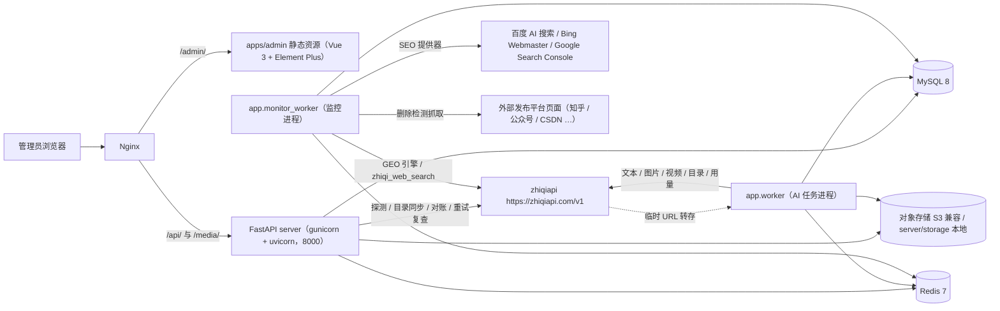
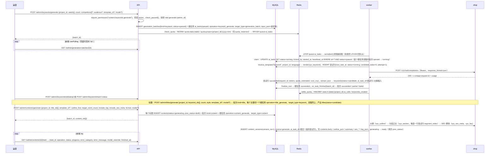
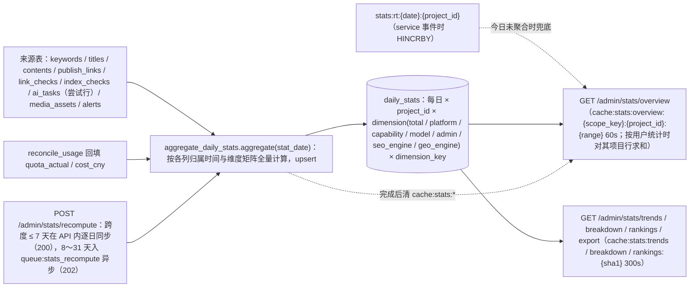
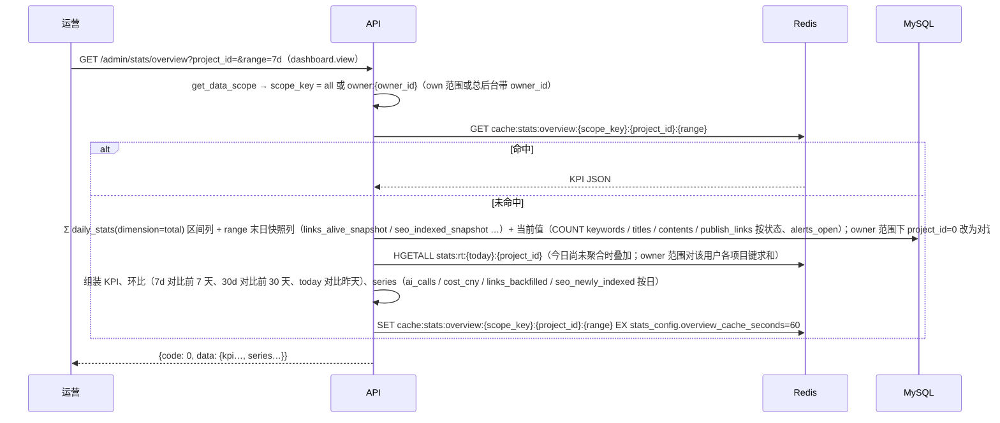
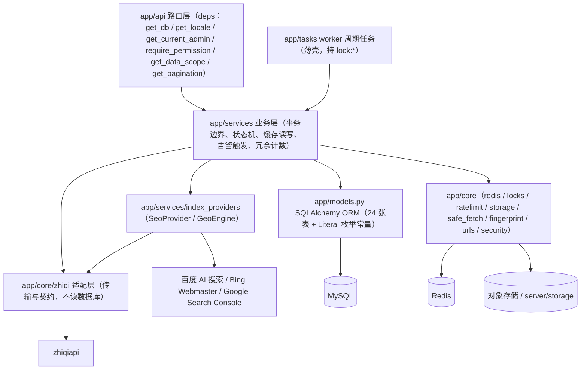
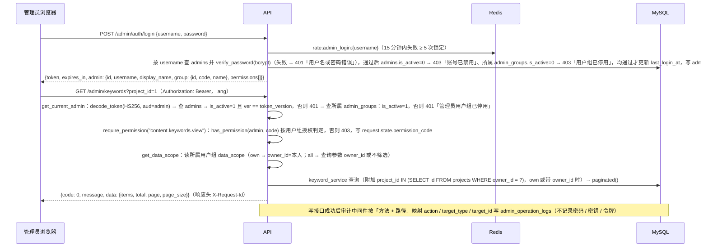

# 01 架构与技术栈

> 本文是 aicreat 的架构权威文档：技术栈、服务拓扑、关键数据流时序、后端分层约定、**Redis 键 / 队列 / 锁清单**、**worker 进程与任务总表**、鉴权总览。表结构与一致性规则见 [03-data-model](./03-data-model.md)，接口与业务码见 [04-api-spec](./04-api-spec.md)，环境变量与部署见 [05-deployment](./05-deployment.md)，zhiqiapi 适配层见 [08-zhiqiapi-integration](./08-zhiqiapi-integration.md)。本文出现的表名、字段、枚举值、接口路径、权限码、Redis 键、文件名均为最终值，其它文档只引用不改写。

## 1. 技术栈

| 层 | 技术 | 说明 |
| --- | --- | --- |
| 管理后台（唯一前端） | Vue 3 + Vite + TypeScript + Element Plus + Pinia + Vue Router + vue-i18n + axios + echarts | `apps/admin`，`base: /admin/`，开发端口 5174；Vite 代理 `/api`、`/media` → `http://127.0.0.1:8100` |
| 共享包 | TypeScript（`@aicreat/shared`） | `packages/shared/src`：`types.ts`（API 字段类型）、`enums.ts`（全部状态枚举，`as const`）、`constants.ts`（`API_PREFIX`、`DEFAULT_PAGE_SIZE`、`MAX_PAGE_SIZE`、`SUPPORTED_LOCALES`、`UPLOAD_LIMITS`、`IMAGE_RESOLUTIONS`、`ASPECT_RATIOS`、`VIDEO_RESOLUTIONS`、`CAPABILITIES`、`BUSINESS_CODES`） |
| 国际化 | vue-i18n（zh-CN / en-US 界面词条） | 生成内容语言由 `projects.language` 决定（默认 `zh-CN`）；`settings.locale='*'` 表示语言无关（第 4.7 节） |
| 后端 | Python 3.11 + FastAPI + Pydantic v2 + pydantic-settings | `server/app`，`create_app()`；开发 `uvicorn --reload` 端口 8100；容器内 gunicorn + uvicorn workers 端口 8000 |
| ORM / 迁移 | SQLAlchemy 2.x + Alembic | `app/models.py` 24 张表；迁移 `0001_initial`（建表）、`0002_seed_permissions`（权限码与系统用户组） |
| 数据库 | MySQL 8（utf8mb4_unicode_ci，InnoDB） | 时间存 UTC `DATETIME`；枚举用 `VARCHAR` 存小写 `snake_case`；JSON 列以 `_json` 结尾（`TEXT`/`MEDIUMTEXT`） |
| 缓存 / 队列 / 锁 | Redis 7 | 任务队列（List）、分布式锁（`SET NX EX`）、熔断状态、频控与配额、实时计数、配置与报表缓存（第 6、7 节） |
| HTTP 客户端 | httpx | `app/core/zhiqi/client.py` 调 zhiqiapi；`app/core/safe_fetch.py` SSRF 安全抓取；SEO 第三方提供器 |
| 鉴权 | pyjwt + bcrypt | 管理员 JWT（HS256，`aud=admin`，`token_version` 失效机制，第 8 节） |
| 对象存储 | S3 兼容（boto3，`OSS_*`） | `STORAGE_MODE=oss` 且 `OSS_ENDPOINT` 非空走 `S3Storage`；`STORAGE_MODE=local`（默认）或 `OSS_ENDPOINT` 为空走 `LocalStorage`（`server/storage/`）并经 `GET /media/{key}` 暴露 |
| 异步进程 | 轮询式 worker（无 Celery/RQ） | `python -m app.worker`、`python -m app.monitor_worker`；Redis List 队列 + MySQL 任务表权威状态 + 心跳 / 过期回收（第 5 节） |
| AI 能力 | zhiqiapi（`https://zhiqiapi.com/v1`，new-api 系统一网关） | 文本三协议、图片、视频、模型目录、价格、用量日志；`ZHIQI_API_KEY` 留空自动进入 Mock 模式 |
| 收录检测 | zhiqiapi 联网模型（默认提供器 `zhiqi_web_search`、GEO 提供器 `zhiqi_model`）+ 可选第三方 | `baidu_ai_search`（百度 AI 搜索官方 API）、`bing_webmaster`、`google_search_console`（`google-auth` 取令牌后 httpx 调 REST）、`manual`；**不抓取搜索引擎结果页 HTML** |
| 反向代理 / 编排 | Nginx + Docker Compose | compose 服务 `mysql / redis / server / worker / monitor-worker / nginx` |
| 包管理 | pnpm@9 workspace（`apps/*`、`packages/*`）；后端 venv + pip（`server/pyproject.toml`，包名 `aicreat-server`） | 根 `package.json` 脚本 `dev:server / dev:worker / dev:monitor / dev:admin / dev:restart / build / build:admin / build:shared / smoke:api`（`dev:restart` 调用 `scripts/dev-restart.ps1`，`smoke:api` 调用 `server/scripts/integration_smoke.py`） |
| 测试 | pytest | `server/tests`（SQLite/MySQL 测试会话、Mock 客户端、管理员 token 夹具）；`server/scripts/integration_smoke.py` Mock 全流程冒烟 |

后端依赖版本清单见 [02-project-structure](./02-project-structure.md)。**刻意不引入**：Celery/RQ（用轮询 worker + Redis List）、Pillow（图片宽高由 `storage.probe_image_size` 解析 PNG/JPEG/WebP 文件头）、ffmpeg（视频首版不抽帧、不解析时长，`media_assets.width/height/duration_seconds` 留空）。

## 2. 服务拓扑

### 2.1 拓扑图



### 2.2 运行组件

| 组件 | compose 服务 | 启动方式 | 端口 | 职责 |
| --- | --- | --- | --- | --- |
| API | `server` | 容器：gunicorn（uvicorn workers，`GUNICORN_WORKERS=2`）；开发：`pnpm dev:server` → `uvicorn app.main:app --reload --host 127.0.0.1 --port 8100` | 容器 8000 / 开发 8100 | 全部 `/api/v1/admin/*`、`GET /api/v1/health`、`GET /media/{key}`；启动时在 `lock:bootstrap` 内执行 `ensure_rbac_seed` + `ensure_default_settings` + `ensure_default_routes`（第 4.6 节） |
| AI 任务进程 | `worker` | `python -m app.worker`（`pnpm dev:worker`） | — | 消费 `queue:ai_tasks`、轮询媒体任务、转存、用量对账、模型目录同步、健康探测、过期回收、素材清理（第 5.1 节） |
| 监控进程 | `monitor-worker` | `python -m app.monitor_worker`（`pnpm dev:monitor`） | — | 链接删除检测、SEO/GEO 收录检测、每日统计聚合、告警评估（第 5.2 节） |
| 管理后台 | 由 `nginx` 挂载 `apps/admin/dist` | 开发 `pnpm dev:admin`（Vite）；生产 `pnpm build:admin` | 开发 5174 | 唯一前端 |
| 反向代理 | `nginx` | `nginx/nginx.conf` | `NGINX_HTTP_PORT=80` | `/api/` → `server:8000`；`/media/` → `server:8000`；`/admin/` → admin dist；`/` → 302 `/admin/` |
| 数据库 | `mysql` | MySQL 8 | 3306 | 24 张表（[03-data-model](./03-data-model.md)） |
| 缓存 | `redis` | Redis 7 | 6379 | 第 6、7 节全部键 |

`server` / `worker` / `monitor-worker` 共用 `build: ./server` 镜像、不同 `command`，共享卷 `media_data:/app/storage`；compose 以 `environment:` 覆盖 `DATABASE_URL`、`REDIS_URL`、`LOCAL_STORAGE_DIR` 为容器内地址。三者都 `depends_on` mysql/redis 健康检查，`server` 自身健康检查为 `curl -f http://127.0.0.1:8000/api/v1/health`。完整 compose、Nginx 配置与发布流程见 [05-deployment](./05-deployment.md)。

### 2.3 外部依赖与 Mock

| 依赖 | 真实模式 | Mock / 缺省行为 |
| --- | --- | --- |
| zhiqiapi | `ZHIQI_API_KEY` 非空 → `ZhiqiClient`（`get_client()` 单例） | 为空 → `app.core.zhiqi.mock.MockZhiqiClient`：文本返回模板化假文、图片/视频返回占位文件（`app/core/zhiqi/mock_assets/placeholder.png`、`placeholder.mp4`，启动时复制到 `LOCAL_STORAGE_DIR/mock/`）、伪用量日志 `mock:usage_logs`；默认路由 seed 为 `mock-text` / `mock-image` / `mock-video` |
| 对象存储 | `STORAGE_MODE=oss` 且 `OSS_ENDPOINT` 非空 → `S3Storage` | 否则 `LocalStorage`（`server/storage/`），`GET /media/{key}` 由 server 直接读文件 |
| 第三方 SEO 提供器 | `SEO_BAIDU_AI_SEARCH_API_KEY` / `SEO_BING_WEBMASTER_API_KEY` + `SEO_BING_SITE_URL` / `SEO_GSC_CREDENTIALS_FILE` + `SEO_GSC_SITE_URL` | 凭据为空或 Mock 模式 → 结果 `unknown` + `error_category=auth_failed`、`error_message=credential_missing` |
| 外部发布平台页面 | `safe_fetch.fetch_page` 真实抓取 | 无 Mock：本地回填 `127.0.0.1` / 内网 URL 时基线检测经 `assert_public_url` 判为 `ssrf_blocked` → 结果 `unknown`（链接状态保持 `pending`，连续 3 次后写 `unknown`），因此冒烟一律回填公网 URL（`monitor_worker` 须能访问公网）；`integration_smoke.py` 断言收录检测结果非 `unknown`、报表 `seo_index_rate` / `geo_cite_rate` 非 null 且 > 0，并另回填一条返回 404 的公网 URL 覆盖删除检测 / 告警分支（基线 `suspected_deleted` → 手动检测后 `deleted` → 出现 `link_deleted` 告警且可确认、解决）；恢复分支（`link_restored`）由后端集成测试覆盖（[11-link-backfill-and-monitoring](./11-link-backfill-and-monitoring.md) §16.2） |
| 告警通道 | `in_app` 固定；`webhook`（`ALERT_WEBHOOK_URL` / `ALERT_WEBHOOK_SECRET`）与 `email`（`SMTP_*`）预留 | `alert_config.channels.webhook/email.enabled=false` |

无密钥跑通全流程的验证步骤见 [06-getting-started](./06-getting-started.md)。

## 3. 关键数据流

参与者约定：`运营` = 管理员浏览器（`apps/admin`），`API` = FastAPI server，`worker` = `app.worker`，`monitor` = `app.monitor_worker`，`zhiqi` = zhiqiapi。图中接口路径省略前缀 `/api/v1`。

### 3.1 关键词 → 标题 → 内容生成



- 三类生成共用同一骨架：API 校验 → 写 `generation_batches` 与**根任务** → `RPUSH queue:ai_tasks`（只放根任务 ID）→ worker 领取、按 `operation + input_json` 分派（`ai_task_service.dispatch`）→ 写业务对象 → 根任务终态触发一次批次收敛。单内容任务 `generate-outline` / `generate-body` / `rewrite` / `generate-seo` 不建批次（`batch_id=NULL`），前端轮询 `GET /admin/contents/{id}/task`。
- `ai_tasks` 同表两类行：根任务行（`root_task_id IS NULL`，承载生命周期、队列、批次计数）与尝试行（`root_task_id` = 根任务 ID，一行 = 一次实际 HTTP 调用，记录 `request_id`、tokens、额度、错误分类）。报表与对账只看尝试行，队列与批次只看根任务行。
- 内容状态：`draft` / `ready` / `rejected` 发起正文生成时进入 `generating` 并写 `prev_status`，成功 → `ready`，失败或取消 → 恢复 `prev_status`；`approved` / `published` 下的重写、大纲、SEO 要素不改状态，只追加版本。状态机、模板体系、质量规则见 [09-generation-pipeline](./09-generation-pipeline.md)。
- 取消：`queued` 根任务直接 `cancelled` 并释放预占额度；`running` 根任务不打断，`ai_task_service` 在每次上游调用前只复查自身 `status='running' AND locked_by=self`（不检查批次状态）；根任务完成后（无论成败）再复查所属批次，已 `cancelled` → 不写业务对象、根任务置 `cancelled`（`error_category=cancelled`，照常 `finalize_root` + `settle_quota`，内容任务恢复 `prev_status`），提交后 `on_task_finished` 计入 `task_failed`（[09-generation-pipeline](./09-generation-pipeline.md) §9.4）。

### 3.2 图片 / 视频异步任务

```mermaid
sequenceDiagram
    participant U as 运营
    participant A as API
    participant D as MySQL
    participant R as Redis
    participant K as worker
    participant Z as zhiqi
    participant S as 对象存储

    U->>A: POST /admin/media/images/generate {project_id, content_id?, usage_type, prompt?, count, resolution, aspect_ratio, reference_image_urls[]?, model?, from_content_prompt?}
    A->>A: require_permission("media.images.generate") → 项目 active → check_paused()（暂停则 5031，data.paused_reason）→ rate:media:{admin_id}（429）→ INCRBY limit:images:{date} count ≤ 200（超限 DECRBY 回滚，4291 scope=daily_images）→ 参考 URL 公网校验（否则 4222）→ resolve_route（路由停用或候选全部不可用 → 5031）
    A->>D: 每张 INSERT media_assets(status=pending) + 根任务 ai_tasks(queued, capability=image, operation=image_generate, target_type=media_asset, input_json)
    A->>R: check_quota 预占 quota:daily:{date} / quota:project:{project_id}:{yyyy-mm}（每个根任务独立预占，任一超限 → 4291，整请求回滚并回退 limit:images）→ RPUSH queue:ai_tasks（每张一个根任务，受进程内 sems[image] 并行）
    A-->>U: {asset_ids[], task_ids[]}
    K->>R: LPOP → sems[image] → claim
    opt input_json.from_content_prompt = true
        K->>Z: 内嵌根任务 operation=image_prompt（capability=content，模板 sys_image_prompt）→ 单行英文提示词写入 media_assets.prompt
    end
    K->>Z: POST /v1/images/generations/async {model, prompt, n:1, resolution, aspect_ratio, response_format: url, reference_image_urls?}
    alt 202 受理
        Z-->>K: {id: task_…, status: queued} + x-oneapi-request-id
        K->>D: 根任务 polling(upstream_task_id, next_poll_at, deadline_at = now + poll_budget_seconds 600)，资产 submitted
        loop poll_media_tasks 按 next_poll_at（间隔 [5,10,15,30]s，轮询不记尝试行）
            K->>Z: GET /v1/images/generations/{task_id}
            Z-->>K: in_progress(progress) / succeeded(data[0].url) / failed
            K->>D: in_progress → 资产 generating(progress)；succeeded → 根任务 succeeded（finalize_root + settle_quota）、资产 downloading(upstream_url) 并提交转存；failed → classify_task_failure；超过 deadline_at → 根任务与资产 expired
        end
    else 提交返回 route_missing（404）/ model_unrouted 且 media_config.image.sync_fallback = true
        K->>Z: 同一候选新尝试行（fallback_from 指向异步尝试行）POST /v1/images/generations，有参考图且目录含 image-edit 或目录缺失该模型时改走 POST /v1/images/edits（multipart，image 字段为公网 URL 字符串）
        Z-->>K: 200 {data: [{url}]}
        K->>D: 根任务 succeeded（finalize_root + settle_quota），资产 downloading(upstream_url) 并提交转存
    end
    K->>Z: transfer_media：下载临时 URL（上游 origin 经 client.stream_download 带 Bearer，第三方 CDN 经 safe_fetch.stream_public_bytes 不带密钥、≤ 3 跳逐跳公网校验）→ Content-Type 白名单 + 魔数校验
    K->>S: storage.save() → storage_key 如 media/images/2026/10/xxx.png
    K->>D: 同一事务：资产 ready(url = public_url_for(storage_key), ready_at, size_bytes, mime_type, file_hash, width/height) + 根任务 response_meta_json.download = {source, request_id, http_status, request_ids[]}（下载函数返回的 DownloadResult，根任务已在上游 succeeded 时终态，转存不改其状态）
    K->>R: HINCRBY stats:rt:{date}:{project_id} images_generated（按 ready_at 归属）
    loop 前端 3s
        U->>A: GET /admin/media/assets/{id}/task → {task_id, operation, status, progress, error_category, error_message, model_override, finished_at}
    end
    Note over K,Z: 视频差异：POST /admin/media/videos/generate → 日上限 limit:videos:{date} ≤ 20（超限 4291，scope=daily_videos）、sems[video]（AI_MAX_CONCURRENCY_VIDEO=1）；POST /v1/videos（必须 JSON，multipart 返回 415）→ {id: vidtask_…, status: queued}，轮询 GET /v1/videos/{id} 间隔 [15,30,60]s、预算 1200s，upstream_url 为空或下载失败时同次回退 GET /v1/videos/{id}/content，上限 500 MB
```



- 协议选择以 [08-zhiqiapi-integration](./08-zhiqiapi-integration.md) §2.2「异步优先」与 §6.5 为准：图片**一律先走异步** `POST /v1/images/generations/async`，不按模型目录预选同步——`catalog.protocol_for` 对有任一图片端点（`image-generation-async` / `image-generation` / `image-edit`）的模型一律返回 `image_async`，目录未列 `image-generation-async` 也先发异步；目录中有该模型但无任何图片端点 → 尝试行 `failed(model_unrouted, request_id=NULL)` 不发 HTTP，切换下一候选；目录缺失该条目（`ai_catalog_service.catalog_entry` 在 `cache:ai:models:catalog` 键缺失时先由 `ai_models` 回填，回填后仍无该模型，如尚未完成首次 `sync_models`）→ 按 `preferred`（`image_async`）处理，交由上游判定。**仅当**异步提交返回 `route_missing` / `model_unrouted` 且 `media_config.image.sync_fallback=true` 时，在**同一候选**内新增尝试行回退同步（`response_meta_json.fallback_from` 指向上一尝试行；无参考图 → `image_sync`，有参考图且目录含 `image-edit` 或目录缺失 → `image_edit`，否则 `image_sync` 携带 `reference_image_urls`），触发回退的异步错误不计入熔断、同步尝试也失败时才计一次；`sync_fallback=false` 时这两类错误按普通失败处理（计入熔断，按 `fallback_on` 决定是否切换备选）；其它提交失败一律不回退同步（避免重复计费）。图片 / 视频的 `unsupported_parameter` 不做参数降级，直接按 `fallback_on` 切换备选。
- 上游返回的 `data[].url` 是**会过期的临时 URL**，`media_assets.url` 只在转存成功后写入；转存失败保持 `downloading`，默认共 3 次尝试：首次失败后按 `media_config.transfer.retry_seconds=[30,120,600]` 的前两项（30s、120s）重试，第 3 次失败（`transfer_attempts` 达到 `max_attempts=3`）才 `failed(transfer_failed)` 并保留 `upstream_url` 供 `POST /admin/media/assets/{id}/transfer` 人工重试（第 3 项 600s 仅在调大 `max_attempts` 时使用）。`client.stream_download` / `videos.download_content` / `safe_fetch.stream_public_bytes` 均返回 `DownloadResult(source, request_id, http_status, request_ids[])`，每次转存尝试结束（成功或失败，失败时取异常携带的值；第三方 CDN 无上游请求号，`request_id` 为 `null`）都与资产行同一事务写回根任务 `response_meta_json.download = {source, request_id, http_status, request_ids[]}`，根任务状态不变。
- 提交阶段读超时（`timeout`）**固定不回退、不切换备选**（上游可能已受理计费）：根任务 `failed(timeout)`、资产 `failed` + `media_task_failed` 告警，交人工 `POST /admin/media/assets/{id}/retry`（会先复查旧上游任务，已 `succeeded` 则直接转存、不重复计费）。
- 轮询阶段只对 `media_storage` 失败回退备选模型（复用同一资产行，新根任务 `trigger_type=system`）；`content_blocked` / `unknown` 等直接 `failed`。所有参考 URL 在真实模式必须公网可达（本地 Mock 存储不可用，需 `PUBLIC_BASE_URL` 或对象存储公网地址）。
- 轮询与转存**不受**全局暂停 `ai:paused:*` 影响（轮询 GET 不计费）。参数映射、生命周期与成本控制见 [10-media-generation](./10-media-generation.md)。

### 3.3 回填链接 → 删除检测 → 告警

```mermaid
sequenceDiagram
    participant U as 运营
    participant A as API
    participant D as MySQL
    participant R as Redis
    participant M as monitor
    participant P as 外部平台页面

    U->>A: POST /admin/links {content_id, platform_id?, url, publish_account?, published_at?, note?}
    A->>A: require_permission("publish.links.create") → 内容存在且 approved / published（404 / 409 data.current_status）→ 内容所属项目 active（409）→ safe_fetch.normalize_public_url(url, allow_http=monitoring_config.link_check.allow_http)（非 http/https、含 userinfo、非 80/443 端口 → 400）→ 平台：缺省按 url_patterns_json 识别，给定时须存在且 is_active=1（404 / 409）→ url_hash 唯一（409 data.existing_id）→ published_at 缺省 now，不晚于 now + 5min、不早于 now − 3650 天（防年份笔误，允许早于内容 created_at 以补录历史文章）（400）→ publish_account ≤ 100、note ≤ 500 字符（400）
    A->>D: 同事务：INSERT publish_links(alive_status=pending, normalized_url, url_hash 唯一，冲突 409)、contents.link_count + 1、approved → published、重算 first_published_at
    A->>R: link_service.enqueue_check(link, baseline, admin_id) -> bool：① SET queued:link_check:{link_id} 1 NX EX 3600（失败返回 False，接口层映射为 queued=false、reason=already_queued）→ ② RPUSH queue:link_checks（manual 用 LPUSH）→ ③ 仅 baseline / scheduled / retry 把 next_check_at 推后 1h（manual 不触碰）。日上限不在 enqueue_check 内判定，回填基线只在抓取时计数、不受日上限拦截、不返回 daily_limit
    A-->>U: {link, queued}
    M->>R: run_link_checks.drain：LPOP queue:link_checks → acquire lock:monitor:link_check:{link_id}（300s）→ 提交线程池
    M->>R: sems[link_check]（global_concurrency=4）→ domain:last_fetch:{domain} 同域名间隔 2s → INCR limit:link_checks:{date}（EXPIRE 172800，只计数不拦截）
    M->>P: safe_fetch.fetch_page(url)：仅 http/https、DNS 解析后公网 IP 校验且重定向逐跳校验、≤ 3 跳、≤ 2 MB、只解析 text/html、固定 UA、不带 Cookie、不执行 JS
    P-->>M: HTTP 状态 / 最终 URL / HTML
    M->>M: link_check_service.judge(fetch_result, link, platform) → (result_status, matched_rule)，首次 200 写 baseline_title / baseline_simhash / baseline_excerpt / baseline_captured_at
    M->>D: 同事务：INSERT link_checks(check_type, result_status, previous_status, applied_status, matched_rule, http_status, final_url, simhash, hamming_distance, evidence_json) + UPDATE publish_links(alive_status, alive_changed_at, consecutive_unknown / consecutive_suspected, check_count, last_checked_at, last_http_status, next_check_at = compute_next_check_at)
    alt applied_status 进入 deleted
        M->>D: alert_service.raise_alert(link_deleted, target_type=publish_link, target_id=link_id)（dedupe_key 去重，同 key open / acknowledged 时只累加 trigger_count）
        M->>R: alert:cooldown:{dedupe_key}（通道投递冷却 60 分钟）
    else deleted → alive / changed
        M->>D: raise_alert(link_restored，创建即 resolved) + resolve_alert(link_deleted)
    end
    opt applied_status 进入 changed（previous_status ≠ changed）
        M->>D: raise_alert(link_changed, severity=info)；之后回到 alive 或 rebaseline 时同事务 resolve_alert(link_changed)
    end
    M->>R: DEL queued:link_check:{link_id}，HINCRBY stats:rt:{date}:{project_id} links_checked / links_deleted / links_changed / links_restored
    Note over M,D: schedule_link_checks 每 60s：GET limit:link_checks:{date}（已达 daily_limit=5000 则本轮不入队、next_check_at 不变，未达时本轮入队数不超过剩余额度）→ SELECT publish_links WHERE is_monitoring=1 AND next_check_at ≤ now → enqueue_check(check_count=0 的链接以 baseline 入队补做基线，否则 scheduled / retry)。频率：前 7 天每日一次，之后每周一次，suspected / unknown 后 6h → 12h → 24h 退避，首次 changed 后 6h 复核一次，deleted 后每 7 天复查至 alive_changed_at + 30 天后 next_check_at=NULL
    U->>A: GET /admin/alerts/summary（铃铛 60s 轮询，仅有 monitoring.alerts.view 时启动）→ POST /admin/alerts/{id}/acknowledge / resolve / ignore
    U->>A: POST /admin/links/{id}/check（manual，LPUSH 插队，不触碰 next_check_at，只计数、不受日上限拦截）/ rebaseline / pause / resume
```



- 判定顺序（`link_check_service.judge`，首个命中即返回，括号内为写入 `link_checks.matched_rule` 的值）：`FetchBlocked`（SSRF 拒绝或 robots 禁止）→ `unknown`（`ssrf_blocked` / `blocked_by_robots`）；`FetchError`（DNS 失败、连接 / 读取超时、重定向过多、响应超限）或 HTTP 5xx，以及 401 / 403 / 429 等未在下文列出的 4xx（视为访问受阻而非删除）→ `unknown`（`network_error`）；404 / 410 / 451 → `deleted`（基线检测时为 `suspected_deleted` 等待确认，含调度器对 `check_count=0` 链接补做的基线；`http_404` / `http_410` / `http_451`）；发生过重定向且（最终 URL 命中平台 `redirect_markers_json`，或最终 URL 的 path 为 `/` 且原 URL path 非 `/`）→ `suspected_deleted`（`redirect_login` / `redirect_home`）；200 且 `<title>` 或正文前 2000 字符命中 `deleted_markers_json` 任一文案 → `deleted`（基线检测同样立即 `deleted`；`marker:<文案>`）；200 且已有基线且（`title_compare` 下 `normalize_title` 不同或 `hamming_distance(simhash, baseline_simhash) ≥ changed_simhash_distance=20`）→ `changed`（`title_changed` / `body_changed`）；200 且无基线 → `alive` 并写入 `baseline_*`（`ok`）；其它 2xx/3xx → `alive`（`ok`）。删除文案匹配与指纹比对仅在 `is_html=true` 时执行，非 HTML 的 200 走「其它 2xx/3xx → `alive`」（不做文案匹配、不写基线、不做变更检测）。
- 确认阈值：计数器 `consecutive_unknown` / `consecutive_suspected` 只看最近连续同类结果（结果 `unknown` → `consecutive_unknown += 1` 且 `consecutive_suspected = 0`；`suspected_deleted` 反之；`alive` / `changed` / `deleted` 两者清零）；`unknown` 连续 `unknown_confirm_count=3` 次才写入（之前 `applied_status = previous_status`，状态不变，`deleted` 状态下同样适用）；`suspected_deleted` 首次即写，连续 `suspected_confirm_count=2` 次 → `deleted`；检测前为 `deleted` 时结果 `suspected_deleted` 保持 `deleted`（`consecutive_suspected` 照常累加、不回退为 `suspected_deleted`，不会重复产生 `link_deleted`）；`alive_status` 取值 `pending` / `alive` / `changed` / `suspected_deleted` / `deleted` / `unknown`。
- 事件型告警（`link_deleted` / `link_restored` / `link_changed` / `media_task_failed` / `ai_quota_exceeded` / `ai_auth_failed`）在产生事件的 service 内同事务触发；`ai_breaker_open` 由 `ai_gateway_service.record_failure` / `sync_models` / `health_probe` 在观察到熔断器非 open → open 时触发，`ai_upstream_unavailable` 由 `health_probe` 在同模型连续 2 次探测失败时触发；周期型告警（`index_overdue` / `ai_task_failures` 及 `ai_breaker_open` 兜底）由 `evaluate_alerts` 每 300s 评估；`worker_stale` 为两进程交叉检查：`evaluate_alerts` ④ 在 monitor_worker 内扫描 `worker:heartbeat:worker:*`，`recover_stale_tasks` ⑤ 在 worker 内每 60s 扫描 `worker:heartbeat:monitor_worker:*`（副本键 `at` 落后超过 `alert_config.rules.worker_stale.minutes=5` → 副本级，无存活副本 → 进程级，第 6.3 节）。平台规则、阈值、告警规则与通道见 [11-link-backfill-and-monitoring](./11-link-backfill-and-monitoring.md)。

### 3.4 SEO / GEO 收录检测

```mermaid
sequenceDiagram
    participant M as monitor
    participant D as MySQL
    participant R as Redis
    participant Z as zhiqi
    participant X as 第三方 SEO 提供器

    Note over M,D: schedule_index_checks 每 300s（lock:monitor:schedule:index_checks）
    M->>D: SELECT publish_links WHERE is_monitoring=1 AND next_index_check_at ≤ now AND alive_status ≠ deleted LIMIT 100
    M->>M: 逐引擎 due(engine)：published_at + [1,3,7,14,30] 天，之后每 30 天一次，已 indexed / cited 的引擎按 checked_at + 90 天（indexed_recheck_days）复核，该引擎 check_count ≥ 24 不再到期，只取已到期引擎
    M->>R: INCRBY limit:index_checks:{date} len(engines)（超 2000 → 不入队，next_index_check_at = 次日 00:00）→ SET NX queued:index_check:{link_id}:{kind} → RPUSH queue:index_checks {link_id, kinds, engines, check_type: scheduled}
    M->>D: next_index_check_at 推后 1h（防重复入队）
    M->>R: run_index_checks.drain：LPOP → acquire lock:monitor:index_check:{link_id}（900s，失败则 DEL 标记并把 next_index_check_at 延后 300s，不重入队）→ sems[index_check]
    loop 每个到期引擎（独立事务）
        alt SEO 引擎（seo_providers.engines.{engine}.provider = zhiqi_web_search）
            M->>D: 同步根任务 ai_tasks(status=running, capability=seo_check, operation=seo_check, target_type=publish_link, target_id=link_id, project_id, trigger_type=worker，手动触发为 user) + 尝试行
            M->>Z: complete_text(capability=seo_check，模板 sys_seo_query：url / title / domain / engine_name，model_override = engines.{engine}.model 或 None，protocol_override = providers.zhiqi_web_search.protocol，extra = providers.zhiqi_web_search.extra)
            Z-->>M: JSON {indexed, evidence: [{url, title, snippet}]} + request_id → 按 match_mode 复核证据 URL
        else SEO 引擎（provider = baidu_ai_search / bing_webmaster / google_search_console）
            Note over M,X: 第三方提供器不创建 ai_tasks（无根任务、无尝试行），index_checks 的 ai_task_id / model / request_id 为 NULL
            M->>X: 官方 API（凭据来自 credential_env；bing / gsc 仅对 SEO_*_SITE_URL 域名下链接生效）
            X-->>M: 检索结果 / URL 检查结果（凭据缺失或 Mock → unknown + auth_failed / credential_missing；非自有站点链接 → unknown + not_own_site）
        else GEO 引擎（geo_engines.engines[] 中 enabled = true，provider = zhiqi_model）
            M->>D: 同步根任务 ai_tasks(status=running, capability=geo_check, operation=geo_check, target_type=publish_link, target_id=link_id, project_id, trigger_type=worker，手动触发为 user) + 尝试行
            M->>Z: complete_text(capability=geo_check，模板 sys_geo_query：keyword / title / url / domain，model_override = 引擎 model，protocol_override = 引擎 protocol，extra 如 tools web_search)
            Z-->>M: 回答 + 引用 → extract_citations → 按引擎 parse.match_mode 判定：默认 url_or_domain 只按引用 URL / 域名，命中 cited、未命中 not_cited（不做标题兜底），回答无任何引用 → unknown（no_search_evidence）。title 模式（标题近似 ≥ 0.8）须在 geo_engines 引擎配置中显式开启
        end
        M->>D: 同一事务：SELECT publish_links … FOR UPDATE → INSERT index_checks(kind, engine, provider, check_type, result_status, previous_status, match_mode, query_text, ai_task_id, request_id, model, evidence_title / evidence_snippet / evidence_url / evidence_json, confidence) + UPDATE seo_status_json / geo_status_json、seo_indexed_any / geo_cited_any、first_indexed_at / first_cited_at、last_index_checked_at = now
        M->>R: 该引擎提交后 EXPIRE lock:monitor:index_check:{link_id} 900，HINCRBY stats:rt:{date}:{project_id} seo_checks / geo_checks（首次收录即 publish_links.first_indexed_at 首次写入时另加 seo_newly_indexed，且仅当补录延迟 created_at − published_at ≤ 72 小时（stats_service.MAX_BACKFILL_DELAY_HOURS）时再加 index_hours_sum += TIMESTAMPDIFF(HOUR, published_at, first_indexed_at)，并同步 HINCRBY stats:rt:{date}:{project_id} index_hours_links 1（收录耗时趋势分母），超过视为历史补录、index_hours_sum 与 index_hours_links 均不累计（seo_newly_indexed 照常累加），首次引用即 first_cited_at 首次写入时另加 geo_newly_cited）
    end
    M->>D: 全部引擎完成：scheduled 时 index_check_count += 1、index_checks_done += 1，按引擎到期最小值重算 next_index_check_at（manual 排程不变）
    M->>R: DEL queued:index_check:{link_id}:{kind}，释放 lock:monitor:index_check:{link_id}
    Note over M,D: evaluate_alerts 每 300s：published_at ≤ now − 30 天 且 seo_indexed_any = 0 且 index_checks_done ≥ 3 且链接存活 → index_overdue 告警，seo_indexed_any = 1 时自动解决
```



- SEO 按引擎 `baidu` / `bing` / `google` 记 `indexed` / `not_indexed` / `unknown`，GEO 按引擎 `baidu_ai` / `doubao` / `kimi` / `deepseek` / `perplexity` / `chatgpt` 记 `cited` / `not_cited` / `unknown`；每次检测一行不可变的 `index_checks`，`publish_links.seo_status_json` / `geo_status_json` 为按引擎的当前状态快照；已 `indexed` / `cited` 的引擎每 `monitoring_config.index_check.indexed_recheck_days=90` 天复核一次（`checked_at + 90` 天）。
- GEO 引擎各自以配置的 `model` / `protocol` / `extra` 提问（经 `ai_gateway_service.complete_text` 的 `model_override` / `protocol_override`），**不回退**到 `capability_routes(geo_check)` 主模型；该路由只作健康探测对象与默认 `params` 来源。回答中的引用先取响应 `annotations` / `citations` 字段、无则解析 Markdown 链接与裸 URL（上游引用字段结构以 zhiqiapi 官方文档为准）。引用判定只按 URL / 域名（`geo_engines.engines[].parse.match_mode` 默认 `url_or_domain`；知乎 / CSDN 等共享域名平台的域名命中忽略），未命中即 `not_cited`、不做标题近似兜底，回答中没有任何引用 → `unknown`（`error_message=no_search_evidence`）；`match_mode=title`（标题近似 ≥ `title_fuzzy_threshold=0.8`）须在 `geo_engines` 引擎配置中显式开启。
- 手动检测 `POST /admin/links/{id}/index-check` 与人工标记 `POST /admin/links/{id}/mark-index` 不推进 `index_check_count` / `index_checks_done`、不改排程；日上限统一在入队时预扣，消费端不再判定。任一引擎调用失败 → 该引擎 `unknown` + `error_category`，不影响其它引擎；熔断器 `open` 时跳过并记 `unknown(breaker_open)`；`ai:paused:*` 存在时整条链接延后（`next_index_check_at = now + pause_seconds`）；检测根任务失败不自动重试、不可 `retry` / `cancel`，等下次调度。调度规则、提供器契约与证据格式见 [11-link-backfill-and-monitoring](./11-link-backfill-and-monitoring.md)。

### 3.5 zhiqiapi 调用与用量对账

```mermaid
sequenceDiagram
    participant S as 调用方 service
    participant G as ai_gateway_service
    participant C as core/zhiqi ZhiqiClient
    participant R as Redis
    participant D as MySQL
    participant Z as zhiqi
    participant W as worker reconcile_usage

    S->>G: complete_text(root_task, messages, params, response_format, extra?, segment_index?, model_override?, protocol_override?)
    G->>R: check_paused()：ai:paused:* 存在 → 根任务回滚 queued 并抛 ZhiqiError(BREAKER_OPEN)，调用方放弃本轮
    G->>R: resolve_route：cache:routes:{capability}:{project_id}（项目覆盖优先，剔除 ai_models.is_available=0）→ candidates [primary, *fallbacks]，is_enabled=0 → 5031
    loop 候选链（candidate_index 0..n，有 model_override 时固定单候选且不切换）
        G->>R: protocol_for(catalog_entry(model), preferred)：读 cache:ai:models:catalog 的 supported_endpoint_types（键缺失时由 ai_models 回填，目录仍无该模型 → 返回 preferred）→ 协议，无可用端点 → 尝试行 failed(model_unrouted, request_id=NULL) 不发 HTTP
        G->>R: breaker.allow(capability, model) → ai:breaker:{capability}:{model}（open → 尝试行 failed(breaker_open)，下一候选）
        G->>D: INSERT 尝试行 ai_tasks(root_task_id, status=running, candidate_index, attempt, segment_index, protocol, model, 复制根任务冗余列)
        G->>C: text.complete(req, timeout=路由 timeout_seconds, retry=RetryPolicy(ai_routing_config.retry), passthrough=ai_routing_config.passthrough)
        C->>Z: POST /v1/chat/completions 或 /v1/responses 或 /v1/messages（Authorization: Bearer，User-Agent）
        alt 2xx
            Z-->>C: body + x-oneapi-request-id
            C-->>G: TextResult(text, request_id, prompt / completion / cache tokens, usage_missing, finish_reason, citations, latency_ms)
            G->>D: 尝试行 succeeded(request_id, tokens, quota_estimated = estimate_quota(), cost_cny 按当时 pricing, request_payload_json 脱敏, response_meta_json)
            G->>R: breaker.record_success（half_open → closed 时自动解决 ai_breaker_open）
        else 非 2xx 或网络错误
            Z-->>C: 4xx / 5xx + request_id
            C->>C: classify_error → ZhiqiError(category, retryable, pre_submit)，幂等 GET 与提交前错误按 RetryPolicy 指数退避（客户端重试不新建尝试行，request_id 记最后一次）
            C-->>G: ZhiqiError
            G->>D: record_failure：尝试行 failed(error_category, error_message 脱敏, http_status, request_id)
            G->>R: breaker.record_failure（仅 upstream_unavailable / timeout / rate_limited / model_unrouted / route_missing / media_storage 计入，窗口内 ≥ 5 → open + ai_breaker_open 告警），quota_exceeded / auth_failed → SET ai:paused:{reason} EX 600 + 告警 + 根任务回滚 queued（pause_count += 1；pause_count ≥ 3 或同步执行的根任务则按常规 failed）
            G->>G: unsupported_parameter → 同模型参数降级重试 1 次，invalid_response → 同模型重新生成 1 次，rate_limited / pre_submit → 同模型再试至 max_attempts，is_fallbackable 且无 model_override → 下一候选，否则抛 5021（content_blocked 附 hint=prompt_blocked，model_override 附 hint=model_override，两者同时成立取 prompt_blocked），全部候选失败 → 5031
        end
    end
    G->>D: finalize_root：根任务汇总尝试行 tokens / quota_estimated / cost_cny，model / protocol / request_id 取最终成功行，写 status / finished_at / duration_ms
    G->>R: settle_quota：INCRBY quota:daily / quota:project（Σ 尝试行 quota_estimated − quota_reserved，失败时 −quota_reserved）
    G-->>S: (TextResult, 产出结果的尝试行)
    Note over W,Z: 用量对账：每 ai_routing_config.usage.reconcile_interval_seconds=300（lock:worker:reconcile），POST /admin/ai/usage/reconcile 可手动触发
    W->>C: usage.fetch_token_logs()
    C->>Z: GET /api/log/token（Bearer = 同一 Key）
    Z-->>C: 该 Key 最近 1000 条（新在前，无分页 / 时间过滤）
    W->>D: 逐条 entry_hash 后 upsert ai_usage_logs（UNIQUE(entry_hash) 幂等）→ request_id ↔ 尝试行 ai_tasks.request_id，失败则 task_id ↔ ai_tasks.upstream_task_id
    W->>D: quota_actual = max(0, Σ type2.quota − Σ|type6.quota|)，写 reconciled_at / usage_log_type / cost_cny（按当时 pricing 重写），同事务重算根任务合计列
    W->>D: 本轮匹配任务涉及的 stat_date：今日 / 昨日交常规聚合，其它日期直接调用 aggregate_daily_stats.aggregate(stat_date)（lock:monitor:daily_stats:{date}），不回写 stats:rt
    W->>R: SET ai:usage:last_pull {pulled_at, pulled, new, matched, unmatched, window_overflow, request_ids[]}，窗口溢出（拉到 1000 条且全部为新，或最旧一条仍新于上次最新条）→ warning、window_overflow=true 并把下次间隔临时降到 usage.min_interval_seconds=60（不立即再拉）
```



- 重试分三层、分工固定：① 客户端 HTTP 幂等重试（`ZhiqiClient`，`ai_routing_config.retry.*`，不产生新 `ai_tasks` 行，非幂等 POST 仅在提交前错误或 `rate_limited` 时重试）；② 网关同模型再尝试（受 `capability_routes.max_attempts` 约束，每次新建尝试行）；③ 候选链切换（`ai_routing_config.fallback.fallback_on`，`never_fallback_on` 优先）。错误分类 `unsupported_parameter` / `route_missing` / `model_unrouted` / `upstream_unavailable` / `rate_limited` / `timeout` / `quota_exceeded` / `auth_failed` / `content_blocked` / `media_storage` / `transfer_failed` / `invalid_response` / `breaker_open` / `cancelled` / `unknown` 的判定与各层行为见 [08-zhiqiapi-integration](./08-zhiqiapi-integration.md)。
- 超时取值固定规则：文本 / 提交读超时 = `capability_routes.timeout_seconds`（项目行为 NULL 时取全局行）> `ai_routing_config.timeouts.text_seconds` / `submit_seconds` > 环境变量（仅 seed）；轮询读超时只取 `timeouts.poll_seconds`；GEO 引擎 / SEO 提供器自带的 `timeout_seconds` 覆盖以上全部（仅限该引擎的调用）。请求级 `model?` 覆盖在 API 侧校验：模型须存在于 `ai_models` 且 `is_available=1` 且 `modalities_json ∋ MODALITY_OF[capability]`，否则 400 `data={"model": …}`；覆盖后 `candidates=[model_override]`、不切换备选，仍受 `breaker.allow` / `is_available` / `ai:paused:*` 约束：覆盖模型熔断打开 → 5031 且 `data.hint="model_override"`，覆盖模型上游调用失败 → 5021 且 `data.hint="model_override"`（`content_blocked` 时取 `prompt_blocked`；异步任务体现为根任务 `failed`，`error_message` 不附 hint，前端以任务摘要 `model_override` 非空识别，同步路径由调用方捕获），`route_id` 仍取解析到的路由（只用其 `params` / `timeout_seconds` / `max_attempts`）。
- 密钥只从 `settings.zhiqi_api_key` 读取；**只有相对路径**（`/v1/*`、`/api/*`）请求携带 `Authorization: Bearer`，绝对 URL 下载（第三方 CDN）只带 User-Agent。每次 HTTP 调用都记录响应头 `x-oneapi-request-id`（目录 / 价格 / 用量调用也不例外），这是对账与排障的唯一关联键。
- 额度口径：`quota` 为 zhiqiapi 原始整数额度；换算参数 `quota_per_unit`（默认 500000 额度 = 1 USD，该比例不在 BRIEF 核实范围内，以 zhiqiapi 官方文档为准）与 `usd_cny_rate`（默认 7.2）来自 `ai_routing_config.pricing`，`cost_cny = quota / quota_per_unit × usd_cny_rate`；单任务成本在终态（按 `quota_estimated`）与对账（按 `quota_actual`）时按**当时**参数写入 `ai_tasks.cost_cny`，报表只对该列求和。上游日志只保留最近 1000 条，窗口溢出的调用永久无法对账，体现在报表 `quota_reconciled_rate` < 100%。
- 全局暂停 `ai:paused:{reason}`（`quota_exceeded` / `auth_failed`）阻止 worker 领取新根任务、API 新建任务（生成类接口返回 5031，`data.paused_reason`），以及 `monitor_worker` 发起收录检测（跳过全部引擎，整条链接 `next_index_check_at` 延后 `pause_seconds`，第 3.4 节）；不影响轮询与转存（轮询 GET 遇 `auth_failed` / `quota_exceeded` 只续写暂停键，任务保持 `polling`）；`POST /admin/ai/routes/{id}/reset-breaker` 或健康探测成功时删除。

### 3.6 报表聚合流程





- `daily_stats` 由 `monitor_worker` 每日 `stats_config.daily_at=00:30`（`stats_config.timezone`，默认 `Asia/Shanghai`）聚合昨天并重算前天，今日每 `intraday_refresh_seconds=600` 增量重算，启动时 `catch_up(days=3)`；快照列从检测历史按日终派生：`links_alive_snapshot` 取每链接日终最后一条 `link_checks.applied_status`，`seo_indexed_snapshot` / `geo_cited_snapshot` 取每链接每引擎日终最后一条**非 `unknown`** 的 `index_checks.result_status`，因此重算结果与当日计算一致、可复现。
- AI 调用数 / 成功率 / tokens / 额度 / 成本一律按 `ai_tasks` **尝试行**统计（`trigger_type != health_probe`），根任务行不计；`total` 行以外的维度行只填各自矩阵规定的列。指标公式、两种收录率口径、页面布局与导出见 [12-dashboard-reports](./12-dashboard-reports.md)。

## 4. 后端分层约定

### 4.1 分层图



### 4.2 各层职责

| 层 / 目录 | 职责 | 硬性规则 |
| --- | --- | --- |
| `app/main.py` | `create_app()`：挂载 `api_router`、CORS（`ALLOWED_ORIGINS`）、`register_exception_handlers(app)`、`X-Request-Id` 与审计中间件、`/media` 静态、启动引导（第 4.6 节） | 只做装配，不含业务逻辑 |
| `app/api`（路由层） | 解析请求 → `require_permission`（功能权限）→ `get_data_scope`（数据范围，受约束的路由）→ 调用 service（传入 `DataScope`）→ 返回 schema；`app/api/__init__.py` 把 `/health` 与 `admin/*` 子路由挂到 `/api/v1`，前缀为 kebab-case 资源名（`/admin/prompt-templates`、`/admin/generation-batches`、`/admin/admin-groups`…），`ai_models.py` / `ai_tasks.py` / `ai_usage.py` / `ai_routes.py` 分别挂到 `/ai/models`、`/ai/tasks`、`/ai/usage`、`/ai` | 不直接写 SQL / Redis；**静态子路径**（`summary` / `export` / `generate` / `import` / `import-file` / `batch-*` / `sync` / `options` / `owner-options` / `health` / `probe` / `logs` / `reconcile` / `detect` / `overview` / `runtime` / `tree` / `site-info` / `link-checks` / `index-checks`）必须在同方法 `/{id}` 路由之前注册（Starlette 把 `{id}` 匹配为 `[^/]+`，否则返回 422）；对象级动作 `POST /{resource}/{id}/{action}`，集合级动作 `POST /{resource}/{action}` |
| `app/schemas` | Pydantic v2 请求 / 响应模型，一资源一文件；`common.py` 提供 `PageParams`、`IdList`、`StatusBody`、`ExportParams`（`format=csv` + 筛选参数） | API 字段名 = 列名去掉 `_json` 后缀，值为解码后的 JSON（`default_templates`、`fallback_models`、`params`、`seo_status`、`evidence`…） |
| `app/services`（业务层） | 数据范围谓词（`data_scope_service`：`DataScope`、按 `projects.owner_id` 过滤的查询条件、`get_visible`，[13-user-data-scope](./13-user-data-scope.md) §9；读写受约束表的函数以 `scope` 为必填参数，worker 传 `SYSTEM_SCOPE`）、事务边界、状态机（`content_service.transition`、`link_check_service.judge`、`media_service` 提交 / 轮询 / 转存状态机）、缓存读写与失效、`alert_service.raise_alert` / `resolve_alert`、冗余计数（`keywords.title_count`、`contents.link_count`、`contents.first_published_at`…）、`stats:rt` 实时计数 | 跨表一致性规则在此实现且**同一事务**完成（权威清单见 [03-data-model](./03-data-model.md) 一致性与事务规则）；JSON 列由 service 编解码 |
| `app/services/ai_gateway_service.py` | 能力路由解析与候选链、熔断器构造、额度预占 / 结算（`check_quota` / `settle_quota`）、尝试行记录、`record_failure` / `finalize_root`、全局暂停、`ensure_default_routes` | 唯一允许调用 `core/zhiqi` 发起生成类计费请求的 service；`ai_catalog_service` / `ai_usage_service` 只调非计费读接口（`/v1/models`、`/api/pricing_new`、`/api/log/token`），健康探测经 `core/zhiqi/health.probe` 发最小文本请求（`max_tokens=8`，记 `trigger_type=health_probe` 的 `ai_tasks`；对账匹配不区分 `trigger_type`，但报表指标与 `quota_reconciled_rate` 的分子分母均排除 `trigger_type=health_probe` 的尝试行） |
| `app/services/index_providers` | `base.py` 的 `SeoProvider` / `GeoEngine` Protocol 与 `CheckResult`；`zhiqi_web_search` / `baidu_ai_search` / `bing_webmaster` / `google_search_console` / `manual` / `geo_engine` | zhiqi 类提供器经 `ai_gateway_service.complete_text` 调用（同步根任务 + 尝试行），第三方提供器用 httpx 直连 |
| `app/models.py` | 24 张表 ORM，顶部以 `Literal` 常量声明全部状态枚举（与 `packages/shared/src/enums.ts` 同名同值） | 逻辑外键 + 索引为主；InnoDB 真实外键仅 RBAC 四表与 `content_versions.content_id`、`link_checks.link_id`、`index_checks.link_id`（级联删除），避免跨进程删除死锁 |
| `app/core` | `config.py`（`Settings`）、`database.py`（engine / `SessionLocal` / `Base` / `get_db`）、`redis.py`（`redis_client`、`cache_get_json` / `cache_set_json` / `cache_delete` / `cache_delete_prefix`）、`locks.py`、`security.py`、`storage.py`、`ratelimit.py`、`response.py`、`exceptions.py`、`admin_permissions.py`、`safe_fetch.py`、`fingerprint.py`、`urls.py` | 无业务语义；可被任何层引用 |
| `app/core/zhiqi` | `types.py` / `errors.py` / `client.py` / `text.py` / `images.py` / `videos.py` / `catalog.py` / `usage.py` / `health.py` / `breaker.py` / `mock.py`：请求体映射、响应解析、错误分类、按注入 `RetryPolicy` 的幂等重试、熔断状态 | **不读数据库**；密钥只从 `settings.zhiqi_api_key` 读取，不入库、不入日志、不入响应；`get_client()` 单例只持有 `base_url` / `api_key` / `timeouts` / `user_agent`，重试与熔断参数由 `ai_gateway_service` 按当前 `ai_routing_config` 构造并按调用注入 |
| `app/tasks` | 14 个周期任务文件（第 5 节） | 只做领取 / 调度 / 持锁，业务规则在 service |
| `app/worker.py` / `app/monitor_worker.py` | 主循环：心跳、`LPOP`、`claim`、线程池提交、周期任务调度 | 主循环线程**禁止任何网络 I/O**，单轮阻塞 ≤ 2s |

### 4.3 请求生命周期

| 阶段 | 实现 |
| --- | --- |
| 入口 | Nginx `/api/` → gunicorn / uvicorn → FastAPI `api_router`（`/api/v1`） |
| 中间件 | CORS（`ALLOWED_ORIGINS`，`DEV_MODE=true` 放宽）；`X-Request-Id`（透传或生成，写入响应头与 `admin_operation_logs.request_id`）；审计中间件：写接口成功后按「方法 + 路径」映射 `action`（集合级 `POST` → `create`、`PUT` → `update`、`PATCH` 与状态类动作 → `update_status`、`DELETE` → `delete`、其余动作 → `execute`、`reset-password` / `change-password` → `reset_password`；`login` / `logout` 由处理函数自行写入；无副作用的 `POST …/preview` 与 `POST /admin/platforms/detect` 设置 `request.state.audit_written=True` 跳过）与 `target_type`（常量 `AUDIT_TARGET_TYPES`：路由前缀 → 类型，最长前缀优先）写 `admin_operation_logs` |
| 依赖（`app/api/deps.py`） | `get_db`（`SessionLocal`，请求结束关闭）、`get_locale`（`lang` 参数 > `Accept-Language` > `zh-CN`，经 `services/i18n.normalize_locale`）、`get_current_admin`、`require_permission("module.resource.action")`、`get_data_scope`（读所属用户组 `data_scope` 与查询参数 `owner_id`，返回 `DataScope`；`super_admin` 短路为 `all`，`own` 忽略 `owner_id`）、`get_pagination`（`page` ≥ 1，`page_size` 默认 20、最大 100） |
| 响应 | `app.core.response.ok(data)` / `fail(code, message, data)` / `paginated(items, total, page, page_size)` → `{code, message, data}`，`code=0` 成功；分页 `data={items, total, page, page_size}` |
| 异常 | `BusinessError(message, code=400, http_status=400, data=None)`；`register_exception_handlers` 把 `BusinessError`、请求校验错误（400 + 错误列表）、未捕获异常（500，`DEV_MODE` 带堆栈）统一为响应结构；业务码 `400 / 401 / 403 / 404 / 409 / 429 / 4221 / 4222 / 4291 / 5021 / 5031 / 500` 的含义与 `data` 结构见 [04-api-spec](./04-api-spec.md) |
| CSV 导出 | `GET …/export` 输出 UTF-8 BOM CSV，最多 50,000 行，超出返回 400；列表导出沿用资源 `view` 权限，内容全文导出与报表导出使用独立权限 |

### 4.4 统一约定

| 项 | 约定 |
| --- | --- |
| 命名 | 表 / 字段 / 枚举值 / 配置键 / Redis 键段 `snake_case`；URL 资源 `kebab-case`；权限码 `module.resource.action`；Python 模块 `snake_case.py`；Vue 页面目录 `kebab-case/Index.vue` |
| 主键 | 全部 `BIGINT PK AUTO_INCREMENT`；例外 `settings(key, locale)`、`admin_group_permissions(group_id, permission_id)` 复合主键 |
| 时间 | 库内 UTC `DATETIME`，API 输入 / 输出 ISO 8601 UTC（`2026-10-06T08:00:00Z`）；`daily_stats.stat_date` 按 `stats_config.timezone` 切日；所有表含 `created_at` / `updated_at` |
| 布尔 / 枚举 / JSON | 布尔 `TINYINT(1)`；枚举 `VARCHAR` 小写字符串（不用 MySQL ENUM）；JSON 列 `*_json`，API 去后缀 |
| 软删除 | 不做通用软删除，用状态（`archived` / `discarded` / `deleted`）表达；物理删除仅限草稿类对象 |
| 额度 / 金额 | 额度 `BIGINT`（zhiqiapi 原始额度）；金额人民币元 `DECIMAL(14,6)`；tokens `INT`；耗时 `duration_ms INT` |
| 存储键 | `media/images/2026/10/xxx.png` 形式；`media_assets.url` 由 `storage.public_url_for(storage_key)` 按当时 `PUBLIC_BASE_URL` / `OSS_PUBLIC_BASE_URL` 生成并落库 |

### 4.5 配置分层

| 层 | 载体 | 读取方式 | 变更生效 |
| --- | --- | --- | --- |
| 环境变量 | `app/core/config.py` `Settings(BaseSettings)`；本机 `server/.env`，compose 读仓库根 `.env`（同源 `.env.example`） | `settings.<变量名小写>`；派生属性 `cors_origins`、`use_local_storage`、`zhiqi_mock_mode`（`not zhiqi_api_key`）、`zhiqi_origin`（去掉 `/v1`）、`media_public_base` | 重启进程；完整清单见 [05-deployment](./05-deployment.md) |
| 系统配置 | `settings` 表 9 个键：`generation_config`、`media_config`、`monitoring_config`、`geo_engines`、`seo_providers`、`alert_config`、`ai_routing_config`、`stats_config`（均 `locale='*'`）、`system_info`（`zh-CN` / `en-US`） | `settings_service.get_config(db, key)`：`DEFAULT_SETTINGS[key]` 深合并数据库值，Redis `cache:settings:{key}:{locale}` 60s；首次由 `ensure_default_settings` 以环境变量派生值（`ENV_SEED_PATHS`，如 `ZHIQI_TIMEOUT_TEXT_SECONDS` → `ai_routing_config.timeouts.text_seconds`）seed，之后以数据库为准 | `PUT /admin/settings/{key}` 保存后清 `cache:settings:*`；worker 每轮重读 `ai_routing_config`，下一轮生效 |
| 能力路由 | `capability_routes`：8 条全局行（`project_id=0`，能力 `keyword` / `title` / `content` / `rewrite` / `image` / `video` / `geo_check` / `seo_check`）+ 项目覆盖行 | `ai_gateway_service.resolve_route`，缓存 `cache:routes:{capability}:{project_id}` 60s | 保存后 `cache_delete_prefix("cache:routes:")` |
| 平台规则 | `publish_platforms` | `cache:platforms:all` 300s | 保存后 `cache_delete("cache:platforms:all")` |

密钥类变量（`ZHIQI_API_KEY`、`OSS_SECRET_KEY`、`SEO_*_API_KEY`…）永不入 `settings` 表，后台只显示 `configured: true/false`。

### 4.6 启动流程

1. `main.py` 与两个 worker 启动时在 `lock:bootstrap`（60s，获取失败最多等待 30s 后直接重读）内依次执行 `admin_rbac_service.ensure_rbac_seed`（权限码、系统用户组）、`settings_service.ensure_default_settings`（配置键不存在则插入）、`ai_gateway_service.ensure_default_routes`（8 条全局路由不存在则按当前模式 seed：真实模式取 `ZHIQI_*_DEFAULT_MODEL`，Mock 固定 `mock-text` / `mock-image` / `mock-video`；非 Mock 且主模型仍以 `mock-` 开头时用环境变量替换，环境变量为空则 `is_enabled=0` + 启动告警日志）。ensure_* 一律 `INSERT … ON DUPLICATE KEY UPDATE id=id` 或逐条 `try/except IntegrityError`，保证幂等。
2. `main.py` 把 `app/core/zhiqi/mock_assets/` 复制到 `LOCAL_STORAGE_DIR/mock/`；真实模式下 `PUBLIC_BASE_URL` 主机解析为非公网地址时记 warning（并出现在 `GET /api/v1/health` 的 `warnings[]`）。
3. 默认超管 `admin/admin123`、示例项目、系统 Prompt 模板、默认平台由 `server/seeds/seed.py` 幂等 upsert（在 `server/` 目录执行 `python seeds/seed.py`，依赖 `pip install -e .` 使 `app` 可导入；发布流程 `alembic upgrade head && python seeds/seed.py`，容器内同样执行 `python seeds/seed.py`），不在启动引导内。
4. worker 启动后立即执行一次 `recover_stale_tasks.recover`（`monitor_worker` 为 `aggregate_daily_stats.catch_up(days=3)`）与 `sync_models`。

### 4.7 国际化

| 类别 | 处理方式 |
| --- | --- |
| 界面文案 | `apps/admin/src/i18n/locales/zh-CN.ts`、`en-US.ts`，vue-i18n 渲染；`LangSwitch.vue` 切换并持久化，axios 请求带 `lang` |
| 语言判定（后端） | `get_locale`：`lang` 参数 > `Accept-Language` > `zh-CN`；只影响 `settings` 的 `system_info` 等按 `locale` 存储的配置与错误文案 |
| 生成内容语言 | `projects.language`（默认 `zh-CN`）决定 Prompt 变量 `language` 与模板选择（`resolve_template(kind, project_id, language)` 找不到同语言已发布模板时回退 `zh-CN`） |
| 数据库 | 业务表不做双语字段；`settings.locale='*'` 表示语言无关 |

## 5. worker 进程与任务总表

两个进程均为「轮询循环」：主循环只做领取 / 到期查询 / 周期任务提交与心跳，**长耗时工作在进程内线程池执行**；每轮写心跳 `worker:heartbeat:{name}:{hostname}:{pid}`（值 `{hostname, pid, at}`，TTL 900s，每副本一键）；`ai_tasks.locked_by = f"{hostname}:{pid}"`。并发限流用进程内 `threading.BoundedSemaphore`，不走 Redis；多副本部署时每副本独立限流，任务互斥依赖 DB `claim` 与 `lock:*`。

### 5.1 `app.worker`（`python -m app.worker`，循环休眠 `WORKER_POLL_INTERVAL_SECONDS=2`）

| 序 | 文件 / 函数 | 频率 | 职责 | 互斥 / 幂等 |
| --- | --- | --- | --- | --- |
| 1 | `tasks/run_ai_tasks.py` `drain(pool, sems, limit=10) -> int` → 线程池 `process_one(task_id) -> bool` | 每轮 | `ai:paused:*` 存在或线程池已满时不 `LPOP`；`LPOP queue:ai_tasks` → 按根任务 `capability` 取模态 `MODALITY_OF`（文本能力 → `text`）→ `sems[text / image / video]` 非阻塞获取，失败则 `LPUSH` 回队头并结束本轮 → `ai_task_service.claim`（`UPDATE ai_tasks SET status='running', locked_by, started_at, heartbeat_at WHERE id=? AND status='queued'`，rowcount=0 则释放信号量跳过）→ `ai_task_service.dispatch` 按 `operation + input_json` 分派：`keyword_generate` / `title_generate` / `content_*` 调 `ai_gateway_service.complete_text` 并写回业务对象；`image_generate`（`from_content_prompt` 时先同步执行内嵌 `image_prompt` 根任务）/ `video_generate` 调 `submit_image` / `submit_video`，提交成功后根任务 `polling`、资产 `submitted`；**每次上游调用前**重读 `status='running' AND locked_by=self`；终态 `finalize_root` + `settle_quota` + `generation_service.on_task_finished(batch_id)`；`quota_exceeded` / `auth_failed` 把根任务回滚为 `queued` | `lock:ai_task:{task_id}`（1800s，随心跳续期）；执行线程每 30s 更新 `heartbeat_at`；信号量在线程 `finally` 释放 |
| 2 | `tasks/poll_media_tasks.py` `poll_due(pool, limit=20) -> int` | 每轮，按 `next_poll_at` | 不受 `ai:paused:*` 影响；`UPDATE … SET next_poll_at = now + 60s WHERE status='polling' AND next_poll_at <= now` 抢占 → `ai_gateway_service.poll_task`（不记尝试行，`request_id` / `http_status` / 错误写入根任务 `response_meta_json.poll`，保留最近 20 个 `request_id`）→ `in_progress` 更新 `progress` / `poll_count` / `next_poll_at`，资产 `generating`；`succeeded` → 根任务 `succeeded`、资产 `downloading` 并提交转存；上游 `failed` → `classify_task_failure`：仅 `media_storage` 且 `fallback.enabled` 且有备选时同一资产回到 `pending` 以新根任务（`trigger_type=system`、`parent_task_id`）从下一候选重提，其它 `failed` + `media_task_failed`；超 `deadline_at` → `expired`；轮询 GET 抛 `auth_failed` / `quota_exceeded` → `record_failure` 但任务保持 `polling`，404 连续 3 次 → `failed(route_missing)` | 单任务由抢占 `UPDATE` 互斥 |
| 3 | `tasks/transfer_media.py` `transfer_asset(asset_id) -> bool` / `retry_due(pool, limit=10) -> int` | 成功即刻提交；重试扫描每 60s | 不受 `ai:paused:*` 影响；下载 `upstream_url`（origin 等于 `ZHIQI_BASE_URL` origin 时走 `client.stream_download` 带 Bearer，否则 `safe_fetch.stream_public_bytes` 不带密钥、`follow_redirects=False` 逐跳 `assert_public_url`、≤ 3 跳）；视频在 `upstream_url` 为空或下载失败时同次回退 `videos.download_content`（`GET /v1/videos/{id}/content`）；Content-Type 允许 `image/*` / `video/*` / `application/octet-stream` / `binary/octet-stream` 且经 `storage.sniff_media_type` 魔数校验；上限 `transfer.max_download_mb=50`、视频 `video.max_download_mb=500` → `storage.save()` → 写 `storage_key` / `url` / `size_bytes` / `mime_type` / `file_hash` / `width` / `height` → `ready(ready_at)`；三个下载函数均返回 `DownloadResult(source, request_id, http_status, request_ids[])`，每次尝试结束（成功或失败，失败时取异常携带的值）与资产行同一事务写回根任务 `response_meta_json.download`，根任务状态不变；失败保持 `downloading`、`transfer_attempts += 1`、`next_transfer_at = now + retry_seconds[transfer_attempts-1]`，默认共 3 次尝试（首次失败后 30s、120s 重试），第 3 次失败（达 `max_attempts=3`）→ `failed(transfer_failed)` + 告警 | `lock:media:transfer:{asset_id}`（600s，每 10 MB 或 60s 续期） |
| 4 | `tasks/reconcile_usage.py` `reconcile() -> dict` | `ai_routing_config.usage.reconcile_interval_seconds=300`（每轮读 DB，0 关闭） | 第 3.5 节：`GET /api/log/token` → upsert `ai_usage_logs` → 匹配近 7 天未对账尝试行 → 回填 `quota_actual` / `cost_cny` / `reconciled_at` / `usage_log_type` → 涉及日期重聚合；返回 `{pulled, new, matched, unmatched, window_overflow, request_ids[]}` 并写 `ai:usage:last_pull`；Mock 模式经 `mock_token_logs()` 走完全相同流程 | `lock:worker:reconcile`（300s） |
| 5 | `tasks/sync_models.py` `sync_models() -> dict` | `ai_routing_config.catalog.sync_interval_seconds=3600`；启动即一次 | `catalog.list_models()`（`GET /v1/models`）+ `catalog.list_pricing()`（`GET /api/pricing_new`）→ upsert `ai_models`（`modalities_json` 由 `derive_modalities(supported_endpoint_types)` 推导），未出现者 `is_available=0`；刷新 `cache:ai:models:catalog`、清 `cache:ai:models:options:*`；路由主 / 备模型与 GEO / SEO 引擎覆盖模型不在目录 → `breaker.force_open(reason="model_unavailable")` + `ai_breaker_open`，重新出现 → `breaker.reset()` 自动解决；返回 `{total, added, updated, unavailable, synced_at, request_ids}` | `lock:ai:models_sync`（300s） |
| 6 | `tasks/health_probe.py` `probe_routes(pool) -> list[HealthResult]` | `ai_routing_config.health.probe_interval_seconds=600`（0 关闭） | 探测对象 = 每条 `is_enabled=1` 路由的主 / 备模型 + 启用 GEO 引擎模型（`capability=geo_check`）+ `seo_providers.engines.<e>.model` 非空的覆盖模型（`capability=seo_check`），按 `(capability, model)` 去重；文本最小探测 `health.probe`（`probe_text_prompt="ping"`、`probe_max_tokens=8`、单次 timeout 30s，并行）；`image` / `video` 仅 `health.probe_media=true` 时真实提交；写 `ai:health:{capability}:{model}`、`ai_models.last_health_status / last_health_at / last_health_latency_ms`，记 `ai_tasks(trigger_type=health_probe, operation=route_probe, target_type=route_probe)`；同模型连续 2 次失败 → `force_open(reason="probe_down")` + `ai_upstream_unavailable`；恢复 `healthy` → 解决告警、`DEL ai:paused:*` | `lock:ai:health_probe`（由线程池内汇总任务持有，全部探测完成后释放） |
| 7 | `tasks/recover_stale_tasks.py` `recover() -> dict` | 每 60s；启动即一次 | ① `running` 根任务 `COALESCE(heartbeat_at, started_at) < now − WORKER_STALE_TASK_MINUTES(10)`：同步执行类（`trigger_type ∈ worker / health_probe`、`capability ∈ seo_check / geo_check`、`operation ∈ route_probe / image_prompt`）只置 `failed(timeout)`；`upstream_task_id` 非空 → 改 `polling`（`next_poll_at=now`，补 `deadline_at`）继续轮询；`request_id` 为空的文本任务 → `failed(timeout)` + 自动重试根任务（`trigger_type=system`、`parent_task_id`）；`request_id` 为空的媒体任务 → `failed` + 资产 `failed` + 告警，交人工 `retry`；任一尝试行 `request_id` 非空且无结果 → `failed(timeout)`，同一事务写根任务 `response_meta_json.stale_after_submit = true`，不自动重试（可能已计费）；所属批次经 `on_task_finished` 按 [09-generation-pipeline](./09-generation-pipeline.md) 批次状态机正常收敛（计入 `task_failed`：部分失败 → `partial`，全部失败 / 取消 → `failed`），`error_summary` 汇总时带该标记的失败根任务计为 `stale_after_submit`（不再计入 `timeout`）；② `polling` 超 `deadline_at` → `expired`，资产 `expired`；③ `queued` 超 10 分钟且 `LPOS` 不在队列 → 重新 `RPUSH`（`ai:paused:*` 存在时不入队，暂停解除后由此补扫回滚任务）；④ 批次收敛兜底（全部根任务终态仍 `running` → 收敛；`heartbeat_at` 超 30 分钟无活动 → `partial`）；⑤ `SCAN worker:heartbeat:monitor_worker:*` → `worker_stale`；⑥ `downloading` 且 `updated_at` 超 15 分钟且 `lock:media:transfer:{id}` 不存在 → 视为一次转存失败重排 | `lock:worker:recover`（120s） |
| 8 | `tasks/cleanup_media.py` `cleanup() -> dict` | 每日 03:00（`stats_config.timezone`） | 删除 `failed` / `expired` 超过 `media_config.retention.failed_days=30` 的资产对应本地缓存文件；`source=uploaded` 且 `usage_type=reference`、未被任何 `media_assets.reference_asset_ids_json` 引用、超过 `orphan_reference_days=7` 的素材置 `deleted` 并删文件 | 按 DB 查询幂等 |

### 5.2 `app.monitor_worker`（`python -m app.monitor_worker`，循环休眠 `MONITOR_POLL_INTERVAL_SECONDS=5`）

| 序 | 文件 / 函数 | 频率 | 职责 | 互斥 / 幂等 |
| --- | --- | --- | --- | --- |
| 1 | `tasks/schedule_link_checks.py` `enqueue_due(limit=200) -> int` | `monitoring_config.link_check.scan_interval_seconds=60` | `SELECT … FROM publish_links WHERE is_monitoring=1 AND next_check_at <= now ORDER BY next_check_at LIMIT 200`；逐条 `link_service.enqueue_check(link, check_type, None)`，`check_type`：`check_count=0` → `baseline`（回填后基线入队失败或队列元素丢失时由调度器补做基线，享受基线 404 宽限，随本轮调度同样受日上限约束），否则 `consecutive_unknown > 0 or consecutive_suspected > 0` → `retry`，其余 `scheduled`；入队前 `GET limit:link_checks:{date}`：已达 `daily_limit=5000` 时本轮不入队、`next_check_at` 不变（链接留在当前游标等下轮扫描，次日计数键切换后自然恢复入队），未达时本轮入队数不超过剩余额度（`daily_limit − 已用`） | `lock:monitor:schedule:link_checks`（60s）；`enqueue_check(link, check_type, triggered_by) -> bool` 内：① `SET queued:link_check:{link_id} 1 NX EX 3600`，失败返回 `False`（接口层映射为 `queued=false, reason=already_queued`）→ ② `RPUSH`（`manual` 用 `LPUSH`）→ ③ 仅 `baseline` / `scheduled` / `retry` 把 `next_check_at` 推后 1h，`manual` 不触碰；日上限不在 `enqueue_check` 内判定 |
| 2 | `tasks/run_link_checks.py` `drain(pool, limit=20) -> int` → 线程池 `process_one(payload) -> bool` | 每轮 | 先获取 `lock:monitor:link_check:{link_id}`，失败 → 丢弃该元素、**不** `DEL queued:link_check`（由持锁者完成时 DEL）、记 INFO；`link_check_service.check_link(db, link, check_type, triggered_by)`：`sems[link_check]`（`global_concurrency=4`）+ `domain:last_fetch:{domain}` 间隔 → `INCR limit:link_checks:{date}`（`EXPIRE 172800`，只计数不拦截）→ `safe_fetch.fetch_page` → `judge` → 同事务 `link_checks` 插入 + `publish_links` 更新 + 告警 + `stats:rt`；完成（含异常分支）`DEL queued:link_check:{link_id}` | `lock:monitor:link_check:{link_id}`（300s） |
| 3 | `tasks/schedule_index_checks.py` `enqueue_due(limit=100) -> int` | `monitoring_config.index_check.scan_interval_seconds=300` | `WHERE is_monitoring=1 AND next_index_check_at <= now AND alive_status NOT IN ('deleted')`；按引擎计算到期，只把已到期引擎写入 payload `engines`（`kinds` 由引擎推导）；入队前 `INCRBY limit:index_checks:{date} len(engines)`，超 `daily_limit=2000` 则不入队并把 `next_index_check_at` 设为次日 00:00；`SET NX queued:index_check:{link_id}:{kind}` 成功者 `RPUSH queue:index_checks`；入队后 `next_index_check_at` 推后 1h | `lock:monitor:schedule:index_checks`（300s） |
| 4 | `tasks/run_index_checks.py` `drain(pool, limit=10) -> int` → 线程池 `process_one(payload) -> bool` | 每轮 | 先获取 `lock:monitor:index_check:{link_id}`，失败则**不重入队**：`DEL` 本 payload 涉及的 `queued:index_check:{link_id}:{kind}`、`next_index_check_at = now + 300s`、记 INFO；`index_check_service.run(db, link, kinds, engines, check_type, triggered_by)`：`sems[index_check]`（`index_check.concurrency=2`）；`check_paused()` 非空 → 全部引擎跳过、`next_index_check_at = now + pause_seconds`；SEO 逐引擎调提供器、GEO 逐引擎调 `geo_engine`：zhiqi 类提供器（`zhiqi_web_search`、GEO `zhiqi_model`）的引擎调用同步记根任务 + 尝试行（`trigger_type=worker`，手动触发为 `user` 且 `created_by`=触发人），`baidu_ai_search` / `bing_webmaster` / `google_search_console` / `manual` 不建根任务（`index_checks.ai_task_id` / `model` / `request_id` 为 NULL）；每引擎独立事务 `SELECT … FOR UPDATE` 重读 JSON 列后写 `index_checks` + 回写（含 `last_index_checked_at=now`）；每引擎完成后 `EXPIRE lock 900` 并 `HINCRBY stats:rt:{date}:{project_id}`（`seo_checks` / `geo_checks`；首次收录（`publish_links.first_indexed_at` 首次写入）另加 `seo_newly_indexed`，补录延迟 `created_at − published_at` ≤ 72 小时（`stats_service.MAX_BACKFILL_DELAY_HOURS`）时再加 `index_hours_sum`（+= `TIMESTAMPDIFF(HOUR, published_at, first_indexed_at)`）并同步 `HINCRBY stats:rt:{date}:{project_id} index_hours_links 1`（收录耗时趋势 `time_to_index_hours_avg` 的分母），超过视为历史补录、`index_hours_sum` 与 `index_hours_links` 均不累计（`seo_newly_indexed` 照常累加），首次引用（`publish_links.first_cited_at` 首次写入）另加 `geo_newly_cited`）；全部完成后 `scheduled` 时 `index_check_count += 1`、`index_checks_done += 1` 并重算 `next_index_check_at`（`manual` 排程不变）；完成 `DEL` 标记并释放锁 | `lock:monitor:index_check:{link_id}`（900s，续期）；失败引擎记 `unknown` 不阻塞其它引擎；检测根任务失败不自动重试、不可 `retry` / `cancel` |
| 5 | `tasks/aggregate_daily_stats.py` `aggregate(stat_date) -> int` / `aggregate_today() -> int` / `catch_up(days=3) -> int` / `drain_recompute() -> int` | 每日 `stats_config.daily_at=00:30` 聚合昨天并重算前天；今日每 `intraday_refresh_seconds=600`；启动 `catch_up(days=3)`；每轮 `LPOP queue:stats_recompute` 一条并逐日 `aggregate` | 从 `keywords` / `titles` / `contents` / `publish_links` / `link_checks` / `index_checks` / `ai_tasks` / `media_assets` / `alerts` 按归属时间与维度矩阵全量计算，按 `(stat_date, project_id, dimension, dimension_key)` upsert `daily_stats`（`total` + `platform` / `capability` / `model` / `admin` / `seo_engine` / `geo_engine` 行）；快照列从检测历史派生；完成后清 `cache:stats:*` | `lock:monitor:daily_stats:{date}`（3600s，线程池内回调获取、`finally` 释放）；`UNIQUE` 兜底 |
| 6 | `tasks/evaluate_alerts.py` `evaluate() -> dict` | 每 300s | ① `index_overdue`；② `ai_task_failures`（同 `capability+model` 最近 `window_minutes=30` 内连续失败尝试行 ≥ `consecutive=5`，不含 `cancelled`、`trigger_type != health_probe`）；③ `ai_breaker_open` 兜底：扫描 `ai:breaker:*` 为 `open` 且无 `open` / `acknowledged` 告警的键补发；④ `SCAN worker:heartbeat:worker:*` → 副本级 / 进程级 `worker_stale`；⑤ 自动解决 `link_deleted`（链接已 `alive` / `changed`）、`index_overdue`（`seo_indexed_any=1`）、`ai_task_failures`（同模型出现成功尝试行）、`worker_stale`（心跳恢复或副本键过期） | `lock:monitor:evaluate_alerts`（300s）；`alert_service.raise_alert` 以 `dedupe_key` 幂等 |

### 5.3 进程循环骨架与并发模型

```python
def main() -> None:
    logger.info("Worker 启动")
    with with_lock("lock:bootstrap", ttl=60, wait_seconds=30):      # 多进程同时启动互斥，获取失败则等待后重读（第 4.6 节，与 main.py 相同）
        admin_rbac_service.ensure_rbac_seed(db)                      # 权限码 / 系统用户组，幂等
        settings_service.ensure_default_settings(db)                 # 配置键不存在则插入
        ai_gateway_service.ensure_default_routes(db)                 # INSERT … ON DUPLICATE KEY UPDATE 幂等
    pool = TrackedThreadPool(max_workers=settings.ai_max_concurrency_text
                             + settings.ai_max_concurrency_image + settings.ai_max_concurrency_video + 2)   # +2 维护任务余量
    # TrackedThreadPool：ThreadPoolExecutor 子类，自维护 in_flight 计数（submit +1、add_done_callback −1）
    # 与 named_submit(name, fn)（同名任务同时最多一个在飞）；「线程池已满」= in_flight >= max_workers
    sems = {"text": BoundedSemaphore(settings.ai_max_concurrency_text),      # AI_MAX_CONCURRENCY_TEXT=4
            "image": BoundedSemaphore(settings.ai_max_concurrency_image),    # AI_MAX_CONCURRENCY_IMAGE=2
            "video": BoundedSemaphore(settings.ai_max_concurrency_video)}    # AI_MAX_CONCURRENCY_VIDEO=1
    # monitor_worker：pool = TrackedThreadPool(link_check.global_concurrency + index_check.concurrency + 2)
    #                 sems = {"link_check": BoundedSemaphore(global_concurrency), "index_check": BoundedSemaphore(index_check.concurrency)}
    pool.named_submit("recover", recover_stale_tasks.recover)       # monitor_worker：aggregate_daily_stats.catch_up(days=3)
    timers = PeriodicTimers(pool)                                    # 记录各周期任务上次执行时间（monotonic），回调一律 pool.named_submit
    while True:
        try:
            heartbeat("worker")                                      # SET worker:heartbeat:worker:{hostname}:{pid} {hostname,pid,at=now} EX 900
            cfg = settings_service.get_config(db, "ai_routing_config")   # 每轮读取（Redis 缓存 60s），修改配置下一轮生效
            submitted = run_ai_tasks.drain(pool, sems, limit=10) + poll_media_tasks.poll_due(pool, limit=20)
            timers.run_due("reconcile", cfg["usage"]["reconcile_interval_seconds"], reconcile_usage.reconcile)   # 0 表示关闭
            timers.run_due("sync_models", cfg["catalog"]["sync_interval_seconds"], sync_models.sync_models)
            timers.run_due("health", cfg["health"]["probe_interval_seconds"], lambda: health_probe.probe_routes(pool))
            timers.run_due("recover", 60, recover_stale_tasks.recover)
            timers.run_due("transfer_retry", 60, lambda: transfer_media.retry_due(pool))
            timers.run_daily("cleanup", "03:00", cleanup_media.cleanup, tz=stats_config["timezone"])
            if submitted:
                continue                                             # 有任务时不休眠
        except Exception as exc:  # noqa: BLE001
            logger.exception("Worker 循环异常: %s", exc)
        time.sleep(settings.worker_poll_interval_seconds)
```

- 主循环线程只做 `LPOP` + 非阻塞取信号量 + `claim` + 提交线程池、到期查询（短 SQL）与周期任务的**提交**；任何网络 I/O（上游 HTTP、下载、探测、对账、目录同步）与长事务都在线程池线程执行，因此单轮阻塞 ≤ 2s，心跳 `at` 持续刷新。`drain` 在 `in_flight >= max_workers` 或信号量获取失败时停止 `LPOP`（任务留在队列）。
- 周期任务对应的 `lock:*` 由回调函数内部获取并在 `finally` 释放；`health_probe`、`aggregate_daily_stats`、`evaluate_alerts` 的子任务再分别提交线程池并行。`PeriodicTimers.run_due(name, interval_seconds, fn)` 中 `interval_seconds <= 0` 表示关闭；`run_daily(name, hh_mm, fn, tz)` 按 `stats_config.timezone` 判定当日是否已执行。
- 执行线程每 30s 更新 `ai_tasks.heartbeat_at`（文本调用期间由计时线程完成）并续期 `lock:ai_task:{id}`；`monitor_worker` 的 `run_link_checks.drain` / `run_index_checks.drain` 同样提交线程池，`schedule_*` 为短 SQL + Redis 写入，在主循环线程按各自周期执行。
- 任务权威状态在 MySQL：`ai_tasks.status=queued` / `publish_links.next_check_at` / `next_index_check_at` 为真相，Redis 队列只是触发器；队列元素丢失由 `recover_stale_tasks` ③ 与 `schedule_*` 的到期扫描兜底，队列重复由 `queued:*` 去重标记与 DB `claim` 兜底。

## 6. 队列与锁

所有键经 `app.core.redis.redis_client`（`decode_responses=True`），无前缀命名空间；`{date}` = `YYYY-MM-DD`（按 `stats_config.timezone`）。**TTL 统一规则**：计数 / 列表 / Hash 类键（`HINCRBY` / `INCRBY` / `LPUSH` 写入）在每次写入后执行 `EXPIRE key ttl`；`SET … EX` 类键由写入语句自带 TTL。

### 6.1 队列（List，`RPUSH` 入队 / `LPOP` 出队；手动触发用 `LPUSH` 插队）

| 键名 | 元素 | 生产者 | 消费者 | 规则 |
| --- | --- | --- | --- | --- |
| `queue:ai_tasks` | `ai_tasks.id`（**仅根任务**） | API（`generate` / `generate-outline` / `generate-body` / `rewrite` / `generate-seo` / 媒体生成 / `retry`）、`poll_media_tasks`（备选回退新根任务）、`recover_stale_tasks`（自动重试与补扫） | `app.worker` `run_ai_tasks.drain` | 文本任务与媒体提交任务统一队列；`ai_tasks.status=queued` 为权威，队列丢失由 `recover_stale_tasks` 按 DB 补扫；`ai:paused:*` 存在时不领取；`drain` 先按模态非阻塞取信号量再 `claim`，失败 `LPUSH` 回队头 |
| `queue:link_checks` | JSON `{"link_id": 1, "check_type": "<baseline / scheduled / manual / retry>", "triggered_by": null}` | 统一经 `link_service.enqueue_check(link, check_type, triggered_by)`：`schedule_link_checks`（`check_count=0` → `baseline` 补做基线，否则 `scheduled` / `retry`）、`POST /admin/links`（`baseline`）、`POST /admin/links/{id}/check`、`/rebaseline`、`POST /admin/monitoring/link-checks/run`（`manual`） | `app.monitor_worker` `run_link_checks.drain` | `enqueue_check(link, check_type, triggered_by) -> bool` 顺序：① `SET queued:link_check:{link_id} 1 NX EX 3600`，失败返回 `False`（接口层映射为 `queued=false, reason=already_queued`）→ ② `RPUSH`（`manual` 用 `LPUSH`）→ ③ 仅 `baseline` / `scheduled` / `retry` 把 `next_check_at` 推后 1h，`manual` 不触碰。日上限不在 `enqueue_check` 内判定：`limit:link_checks:{date}` 记当日实际抓取次数，由 `run_link_checks.process_one`（抓取前）与平台规则测试各 `INCR` 一次（写入后 `EXPIRE 172800`）；日上限只由 `schedule_link_checks` 与 `POST /admin/monitoring/link-checks/run` 在入队前读取判定（调度器超限时本轮不入队、`next_check_at` 不变，批量入口超限计入 `skipped`）；回填基线、单链接手动检测、`rebaseline` 与规则测试只计数不拦截，不返回 `daily_limit` |
| `queue:index_checks` | JSON `{"link_id": 1, "kinds": ["seo","geo"], "engines": ["baidu","doubao"], "check_type": "<scheduled / manual>", "triggered_by": null}` | `schedule_index_checks`（只放已到期引擎）、`POST /admin/links/{id}/index-check`、`POST /admin/monitoring/index-checks/run`（三者入队前按 `len(engines)` 预扣 `limit:index_checks:{date}`） | `run_index_checks.drain` | 去重标记 `queued:index_check:{link_id}:{kind}`（`SET NX EX 3600`）；消费端取锁失败不重入队：`DEL` 标记、`next_index_check_at = now + 300s`、记 INFO |
| `queue:stats_recompute` | JSON `{"start_date": "…", "end_date": "…", "requested_by": admin_id}` | `POST /admin/stats/recompute`（跨度 > 7 天，返回 202） | `aggregate_daily_stats.drain_recompute`（每轮 `LPOP` 一条，逐日 `aggregate`，提交线程池） | 每日仍持 `lock:monitor:daily_stats:{date}`，获取失败的日期跳过并记日志 |

### 6.2 锁（`SET key value NX EX ttl`，`app.core.locks`）

`locks.py` 提供 `acquire_lock(key, ttl)` / `release_lock` / `extend_lock(key, ttl)`（`EXPIRE` 续期）与上下文 `with_lock(key, ttl, wait_seconds=0)`（`wait_seconds > 0` 时轮询等待，超时抛 `LockTimeout`）。

| 键名 | 用途 | TTL |
| --- | --- | --- |
| `lock:bootstrap` | `main.py` 与两个 worker 启动引导互斥（第 4.6 节） | 60s（获取失败最多等待 30s 后直接重读） |
| `lock:ai_task:{task_id}` | worker 执行单个根任务（配合 DB `UPDATE … WHERE status='queued'` 双保险） | 1800s，执行线程每 30s 更新 `heartbeat_at` 时同步 `EXPIRE` 续期 |
| `lock:generation_batch:{batch_id}` | 批次收敛（`task_done` / `task_failed` 计数更新） | 60s |
| `lock:worker:reconcile` | 用量对账单例（周期 + `POST /admin/ai/usage/reconcile` 互斥） | 300s |
| `lock:ai:models_sync` | 模型目录同步单例（周期 + `POST /admin/ai/models/sync` 互斥） | 300s |
| `lock:ai:health_probe` | 自动健康探测单例：线程池内汇总任务持有，所有探测完成后在 `finally` 释放 | `= ai_routing_config.health.probe_interval_seconds`（最小 120s） |
| `lock:worker:recover` | 过期回收单例 | 120s |
| `lock:monitor:schedule:link_checks` | 删除检测到期扫描单例 | 60s |
| `lock:monitor:schedule:index_checks` | 收录检测到期扫描单例 | 300s |
| `lock:monitor:link_check:{link_id}` | 单链接删除检测互斥（手动 + 定时） | 300s |
| `lock:monitor:index_check:{link_id}` | 单链接收录检测互斥（保护 JSON 列读-改-写）；每个引擎完成后 `EXPIRE … 900` 续期 | 900s（续期） |
| `lock:monitor:daily_stats:{date}` | 每日聚合 / 重算单例（API 同步重算与 worker 聚合互斥） | 3600s |
| `lock:monitor:evaluate_alerts` | 告警评估单例 | 300s |
| `lock:media:transfer:{asset_id}` | 转存互斥；流式下载中每 10 MB 或每 60s `EXPIRE … 600` 续锁 | 600s（`recover_stale_tasks` ⑥ 以「锁不存在且 `updated_at` 超过 TTL + 5 分钟 = 15 分钟」判定僵死） |

### 6.3 熔断 / 健康 / 暂停 / 心跳

| 键名 | 类型 | 用途 | TTL |
| --- | --- | --- | --- |
| `ai:breaker:{capability}:{model}` | Hash `{state, failures, opened_at, half_open_calls, reason}` | 熔断器状态 `closed` / `open` / `half_open`；`reason` ∈ `failures` / `model_unavailable` / `probe_down` / `manual`；`reason=model_unavailable` 的 `open` 不自动转 `half_open`，只由 `reset()`（`sync_models` 发现模型恢复、`POST /admin/ai/routes/{id}/reset-breaker`）解除 | 常规 `window_seconds + open_seconds`（默认 420s），每次写入续期；`model_unavailable` 为 `max(open_seconds, catalog.sync_interval_seconds) + 60` |
| `ai:breaker:failures:{capability}:{model}` | List（时间戳） | 滑动窗口失败记录，窗口内 ≥ `failure_threshold=5` → `open` | `window_seconds`（300s） |
| `ai:health:{capability}:{model}` | JSON `{status, latency_ms, checked_at, request_id, error_category, consecutive_failures}` | 最近探测快照（`healthy` / `degraded` / `down` / `unknown`） | 86400s |
| `ai:paused:{reason}` | 字符串（触发时间 ISO） | 全局暂停，`reason` ∈ `quota_exceeded` / `auth_failed`；由 `ai_gateway_service.record_failure` 写入并触发告警。提交阶段 `running` 的根任务回滚为 `queued`（`pause_count += 1`；`pause_count ≥ 3` 或同步执行的根任务按常规 `failed`），轮询阶段（`poll_media_tasks` 的 GET 遇 `auth_failed` / `quota_exceeded`）只续写暂停键，任务保持 `polling`。暂停期间阻止 worker 领取新根任务、API 新建生成任务（5031，`data.paused_reason`），以及 `monitor_worker` 发起收录检测（跳过全部引擎，链接 `next_index_check_at` 延后 `pause_seconds`）；不影响轮询 / 转存 / 健康探测；键消失后由 `recover_stale_tasks` ③ 补扫回滚的 `queued` 任务；`reset-breaker` 或探测成功时 `DEL` | `ai_routing_config.pause_seconds`（600s） |
| `domain:last_fetch:{domain}` | 字符串（时间戳） | 删除检测同域名最小间隔 | `per_domain_interval_seconds`（2s） |
| `robots:{domain}` | JSON `{allowed, fetched_at}` | robots 缓存（`respect_robots=true` 时，`safe_fetch.robots_allowed` 写入）；robots.txt 返回 404 / 410 视为允许 | 86400s；robots.txt 获取失败（非 404 / 410）按「不允许」缓存 900s |
| `worker:heartbeat:{name}:{hostname}:{pid}`（`name` ∈ `worker` / `monitor_worker`） | JSON `{hostname, pid, at}` | 进程存活，每副本一键，主循环每轮写入；读取方 `SCAN worker:heartbeat:{name}:*` 汇总，`alive(name)` = 任一副本 `now − at < 90s`（`GET /api/v1/health`、`GET /admin/ai/health`、`GET /admin/monitoring/overview`）；键不存在视为 `at = 1970-01-01`；副本 `at` 落后超过 `alert_config.rules.worker_stale.minutes=5` → 副本级 `worker_stale`（`target_key={name}:{hostname}:{pid}`），无存活副本 → 进程级（`target_key={name}`） | 900s |

## 7. 缓存与计数键表

### 7.1 频控 / 配额（`app.core.ratelimit`：`check_rate_limit` 滑动窗口、`enforce_interval` 同域名间隔）

| 键名 | 用途 | TTL |
| --- | --- | --- |
| `rate:admin_login:{username}` | 登录失败计数，15 分钟内 ≥ `ADMIN_LOGIN_MAX_FAILURES=5` 锁定 | 900s |
| `rate:generate:{admin_id}` | 文本生成请求频控（`generation_config.rate_limits.generate_per_admin=60/hour`），超限 429 `data={"retry_after": 秒}` | 窗口长度 |
| `rate:media:{admin_id}` | 媒体生成请求频控（`media_per_admin=20/hour`） | 窗口长度 |
| `rate:index_check_manual:{admin_id}` | 手动收录检测频控（固定 `30/hour`） | 3600s |
| `quota:daily:{date}` | 当日估算额度累计（`generation_config.quota.daily_limit`，0 不限）：`check_quota` 预占 + `settle_quota` 结算，超限 4291 `scope=daily` | 172800s |
| `quota:project:{project_id}:{yyyy-mm}` | 项目当月估算额度累计（`project_monthly_limit`），超限 4291 `scope=project_monthly` | 40 天 |
| `limit:link_checks:{date}` / `limit:index_checks:{date}` / `limit:images:{date}` / `limit:videos:{date}` | 日上限计数：删除检测 5000（抓取前 `INCR`，含基线、手动检测与 `POST /admin/platforms/{id}/test`；只由调度器与批量入口在入队前判定，其余只计数不拦截）、收录检测 2000（入队时按引擎数预扣）、图片 200、视频 20（超限 4291，`scope` 为 `daily_images` / `daily_videos`；备选回退复用资产不重复计数） | 172800s |

### 7.2 实时计数 / 缓存 / 标记

| 键名 | 类型 | 用途 | TTL |
| --- | --- | --- | --- |
| `stats:rt:{date}:{project_id}` | Hash（字段 = `daily_stats` 列名：`ai_calls`、`ai_succeeded`、`quota_estimated`、`links_backfilled`…） | 今日实时计数（service 事件时 `HINCRBY`，`project_id=0` 行同时累加）；总览「今日」在 `daily_stats` 未聚合时兜底；对账不回写此键 | 259200s |
| `cache:settings:{key}:{locale}` | JSON | `settings_service.get_config` 合并后缓存 | 60s |
| `cache:settings:runtime` | JSON | `GET /admin/settings/runtime` 的非敏感子集 | 60s |
| `cache:platforms:all` | JSON | 平台与规则列表 | 300s |
| `cache:routes:{capability}:{project_id}` | JSON | `resolve_route` 结果（主 / 备 / 参数 / 超时） | 60s |
| `cache:stats:overview:{scope_key}:{project_id}:{range}` | JSON | 总览 KPI；`scope_key` = `all`（总后台未按用户筛选）或 `owner:{owner_id}`（普通用户本人或总后台的用户视角，[13-user-data-scope](./13-user-data-scope.md) §10.4） | `stats_config.overview_cache_seconds`（60s） |
| `cache:stats:trends:{sha1(query)}` / `cache:stats:breakdown:{sha1}` / `cache:stats:rankings:{sha1}` | JSON | 报表查询缓存（规范化查询串含 `scope_key`） | 300s |
| `cache:ai:models:catalog` | JSON | 模型目录（`model_id` → `owned_by` / `supported_endpoint_types`），供 `catalog.protocol_for` 协议预选：由 `ai_catalog_service` 维护，`sync_models` 步骤 ④ 以 `GET /v1/models` 结果覆盖写；读取统一经 `ai_catalog_service.catalog_entry(db, model_id)`，键缺失（Redis 重启、清缓存、关闭定时同步后过期）时从 `ai_models` 的 `is_available=1` 行重建并以同 TTL 回填，回填后仍无该模型返回 `None`（`protocol_for` 按「目录缺失」返回 `preferred`） | `max(ai_routing_config.catalog.sync_interval_seconds, 3600) + 600`（默认 4200s，始终长于同步间隔，两次同步之间不会过期） |
| `cache:ai:models:options:{modality}:{is_available}` | JSON | `GET /admin/ai/models/options` 结果（`sync_models` 后清除） | 60s |
| `ai:usage:last_pull` | JSON `{pulled_at, pulled, new, matched, unmatched, window_overflow, request_ids[]}` | 最近一次对账拉取摘要（用量页展示） | 86400s |
| `alert:cooldown:{dedupe_key}` | 字符串 | 同 `dedupe_key`（`{alert_type}:{target_type}:{target_key}`）告警通道投递冷却 | `alert_config.dedupe_cooldown_minutes × 60`（3600s） |
| `queued:link_check:{link_id}` / `queued:index_check:{link_id}:{kind}` | 字符串 | 队列去重标记（`SET NX EX 3600`，成功才入队）；消费完成（含异常分支）`DEL` | 3600s（自过期，消费者崩溃不会永久阻塞再次入队） |
| `mock:task:{task_id}` | Hash `{kind, status, polls, urls}` | Mock 图片 / 视频任务状态机（图片三次轮询、视频五次轮询后 `succeeded`） | 3600s |
| `mock:usage_logs` | List（`LPUSH` + `LTRIM 0 999`） | Mock 伪用量日志，`mock_token_logs()` 返回最近 1000 条 | 86400s（最后一次写入后） |

### 7.3 失效规则

| 触发 | 动作 |
| --- | --- |
| `PUT /admin/settings` / `PUT /admin/settings/{key}` | `cache_delete_prefix("cache:settings:")`（含 `cache:settings:runtime`）；`ai_routing_config` 变更下一轮 worker 循环生效 |
| `POST/PUT/DELETE /admin/ai/routes*`、`PUT /admin/projects/{id}/routes` | `cache_delete_prefix("cache:routes:")` |
| `POST/PUT/DELETE /admin/platforms*` | `cache_delete("cache:platforms:all")` |
| `sync_models` 完成 | `cache_delete_prefix("cache:ai:models:")` 后重建 `cache:ai:models:catalog` |
| `aggregate_daily_stats` 完成 | 清 `cache:stats:*` |
| 项目创建、删除、转移负责人（`PUT /admin/projects/{id}` 改 `owner_id`） | 提交后清 `cache:stats:*`（可见项目集变化） |
| 写入 `queued:*` / `limit:*` / `quota:*` / `stats:rt:*` / `mock:usage_logs` | 每次写入后 `EXPIRE`（第 6 节 TTL 统一规则） |

## 8. 鉴权与权限

### 8.1 管理员 JWT

| 项 | 规则 |
| --- | --- |
| 签发 | `POST /admin/auth/login`：先按 `username` 查找并校验 bcrypt 密码哈希（`app.core.security.verify_password`，账号不存在或密码错误统一 401「用户名或密码错误」），通过后再判状态：`admins.is_active=0` → 403「账号已禁用」，所属 `admin_groups.is_active=0` → 403「用户组已停用」（顺序以 [07-admin-rbac](./07-admin-rbac.md) §6.1 为准）；全部通过后 `create_token` 签发 HS256 JWT（密钥 `ADMIN_JWT_SECRET`，有效期 `ADMIN_JWT_EXPIRE_SECONDS=7200`） |
| claims | `sub` = admin id 字符串、`aud="admin"`、`ver` = `admins.token_version`、`iat`、`exp` |
| 失效 | 登出、本人改密、重置他人密码、启用 / 禁用、更换用户组（`PUT /admin/admins/{id}` 的 `group_id` 变化）时，在业务更新的同一事务内 `admins.token_version += 1`，旧令牌 `ver` 不匹配即 401（无需黑名单）；仅改显示名或修改用户组权限不递增（事件表以 [07-admin-rbac](./07-admin-rbac.md) §7.4 为准） |
| 失败锁定 | `rate:admin_login:{username}` 15 分钟内失败 ≥ 5 次拒绝登录 |
| 前端 | `store/auth.ts` 持久化 token 与权限码，刷新时调 `GET /admin/auth/me`；`api/client.ts` 统一加 `Authorization: Bearer`，401 清登录态跳转登录（登录请求本身的 401 交给登录页展示），403 时 `data.permission` 存在 → 提示「无权执行此操作」并刷新权限，`data` 为 null（安全规则拒绝）→ 直接展示后端 `message`、不刷新权限（[07-admin-rbac](./07-admin-rbac.md) §9.6） |
| 公开接口 | 仅 `POST /admin/auth/login`、`GET /admin/auth/site-info`、`GET /api/v1/health`、`GET /media/{key}`；「已登录即可」接口：`GET /admin/auth/me`、`POST /admin/auth/logout`、`POST /admin/auth/change-password`、`GET /admin/settings/runtime` |
| 数据范围 | 登录与 `GET /admin/auth/me` 返回 `data_scope`（取所属用户组）；受约束的接口在 `require_permission` 之后经 `get_data_scope` 按项目负责人过滤：`own` 只见本人项目及其下数据，`all`（总后台）见全部、可用 `owner_id` 收窄；范围外对象一律 404（[13-user-data-scope](./13-user-data-scope.md)） |

### 8.2 请求鉴权流程



### 8.3 权限码与用户组

- 权限码格式 `module.resource.action`，两级：`menu` 型 `*.view`（菜单与页面）与 `action` 型（`parent_code` 指向同资源 `view`）；共 90 个，模块 `dashboard` / `content` / `media` / `ai` / `publish` / `monitoring` / `stats` / `system` / `security`，定义在 `app/core/admin_permissions.py`（`PERMISSIONS` / `PERMISSION_CODES` / `PERMISSION_DEPENDENCIES` / `SYSTEM_GROUPS` / `OPERATOR_EXCLUDED` / `DEFAULT_GROUP_PERMISSIONS`），由迁移 `0002_seed_permissions` 与 `ensure_rbac_seed` 写入 `admin_permissions`，后台不可新增。
- 授权以数据库用户组为准：`admins.group_id` → `admin_groups` → `admin_group_permissions`；拥有任一 action 必须同时拥有同资源 `view`，跨资源依赖（如 `content.keywords.generate` 隐含 `content.batches.view`，`media.images.generate` 隐含 `media.assets.view`）在 `PUT /admin/admin-groups/{id}/permissions` 保存时自动补齐。
- 系统用户组 `super_admin`（全部权限，数据范围固定 `all`）/ `operator`（生成、编辑、回填、监控处理，默认 `own`）/ `reviewer`（审核 + 查看，默认 `all`）/ `read_only`（`*.view` + `stats.reports.export`，不含 `security.*` 与 `system.settings.view`，默认 `all`）；自定义组 `code` 为服务端生成的 `custom_{uuid4().hex[:12]}`，数据范围缺省 `own`。
- 数据范围 `admin_groups.data_scope` 与权限码正交：权限码决定能做什么，数据范围决定能看到谁的数据（[13-user-data-scope](./13-user-data-scope.md)）。
- 每个接口绑定**单一静态权限码**（`require_permission` 参数），列表 CSV 导出沿用资源 `view`，仅 `content.contents.export` 与 `stats.reports.export` 为独立导出权限。前端：路由 `meta.permission` 守卫、`Layout.vue` 菜单按 `*.view` 过滤、`v-permission` 指令与 `usePermission()` 控制按钮。完整权限码表、默认授权与安全规则见 [07-admin-rbac](./07-admin-rbac.md)。

### 8.4 审计与安全规则

| 项 | 规则 |
| --- | --- |
| 审计日志 | `admin_operation_logs` 只读、不提供删除接口；记录 `admin_id`、`permission_code`、`action`、`target_type`、`target_id`、`summary`、`request_id`、脱敏 `ip`、`user_agent`；无副作用的 `POST …/preview` 与 `POST /admin/platforms/detect` 跳过 |
| 密钥 | 只存在于环境变量；`GET /admin/settings` 对密钥类字段只返回 `configured: true/false`；日志、响应、`ai_tasks.request_payload_json` 均不含密钥；Bearer 只随相对路径请求发送（第 3.5 节） |
| SSRF | 回填 URL 先经 `safe_fetch.normalize_public_url`（只允许 http/https、禁止 userinfo、端口 80/443/缺省）；抓取与转存经 `assert_public_url`（DNS 解析后公网 IP、重定向逐跳校验）、`fetch_page` / `stream_public_bytes`（≤ 3 跳、响应体上限、固定 UA、不带 Cookie / Authorization）；平台 `fetch_config_json.headers` 拒绝 `cookie` / `authorization` / `proxy-authorization`，只允许 `Accept-Language` / `Referer` / `X-*` |
| 参考素材 | 真实模式要求 `reference_image_urls` 等全部公网可达（否则 4222）；`DEV_MODE=true` 允许 http 参考 URL |
| RBAC 安全 | 不可禁用自己、不可禁用 / 移除最后一个有效超管、系统组不可删除 / 停用 / 清空权限、有成员的组不可删除、仍有启用中管理员的自定义组不可停用、不可修改自己的用户组、`super_admin` 组权限不可修改（以上均 403，完整清单见 [07-admin-rbac](./07-admin-rbac.md) §6.5）、管理员不物理删除、密码 ≥ 8 位且含字母与数字 |
| 生产加固 | 修改 `ADMIN_JWT_SECRET` / `SEED_ADMIN_PASSWORD`、`DEV_MODE=false`、`MONITOR_ALLOW_HTTP=false`、`ALLOWED_ORIGINS` 收敛为实际域名、`PUBLIC_BASE_URL` 为公网地址（见 [05-deployment](./05-deployment.md)） |

## 9. 相关文档

| 主题 | 文档 |
| --- | --- |
| 目录树、模块职责、命名约定 | [02-project-structure](./02-project-structure.md) |
| 24 张表、ER 图、一致性与事务规则 | [03-data-model](./03-data-model.md) |
| 全部接口、业务码、请求 / 响应示例 | [04-api-spec](./04-api-spec.md) |
| 环境变量、docker-compose、Nginx、发布与备份 | [05-deployment](./05-deployment.md) |
| 本地启动与 Mock 验证 | [06-getting-started](./06-getting-started.md) |
| 权限码全表与用户组 | [07-admin-rbac](./07-admin-rbac.md) |
| 用户系统、数据范围与数据隔离 | [13-user-data-scope](./13-user-data-scope.md) |
| zhiqiapi 适配层、错误分类、`ai_tasks` 状态机、对账 | [08-zhiqiapi-integration](./08-zhiqiapi-integration.md) |
| 关键词 / 标题 / 内容生成、Prompt 模板、内容状态机 | [09-generation-pipeline](./09-generation-pipeline.md) |
| 图片 / 视频任务生命周期与转存 | [10-media-generation](./10-media-generation.md) |
| 回填、删除检测、收录检测、告警 | [11-link-backfill-and-monitoring](./11-link-backfill-and-monitoring.md) |
| 指标定义、`daily_stats` 计算、报表接口与页面 | [12-dashboard-reports](./12-dashboard-reports.md) |
