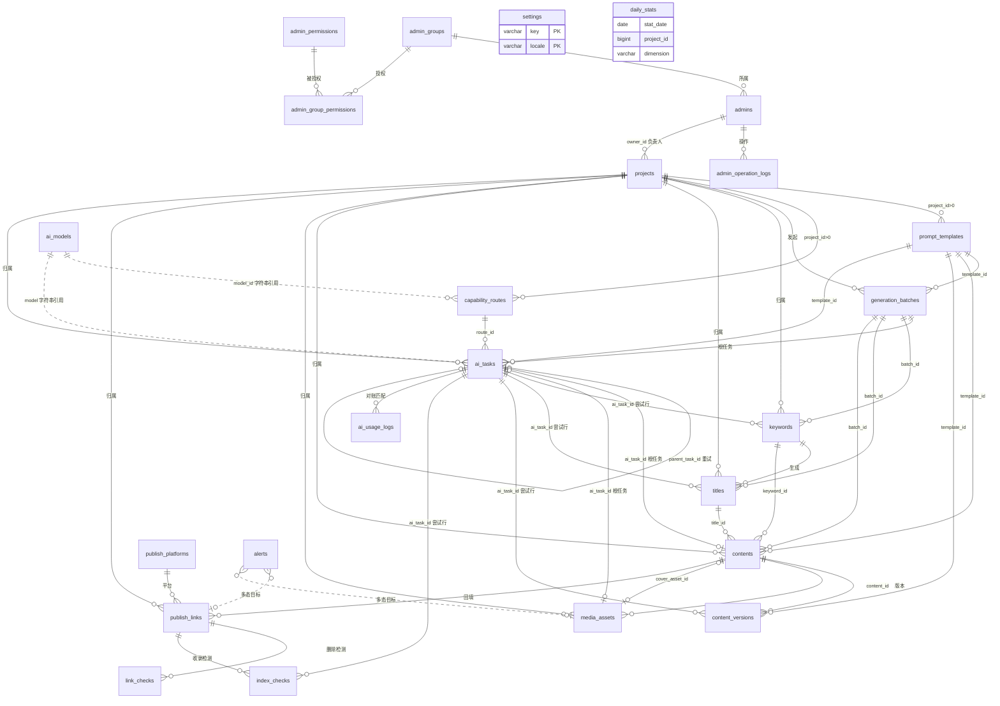
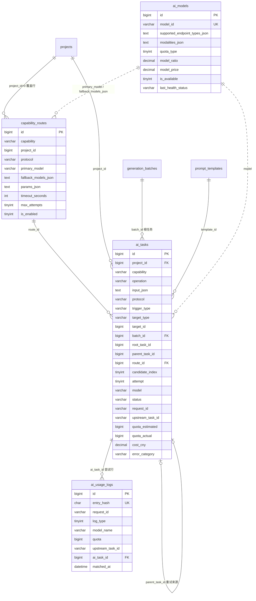
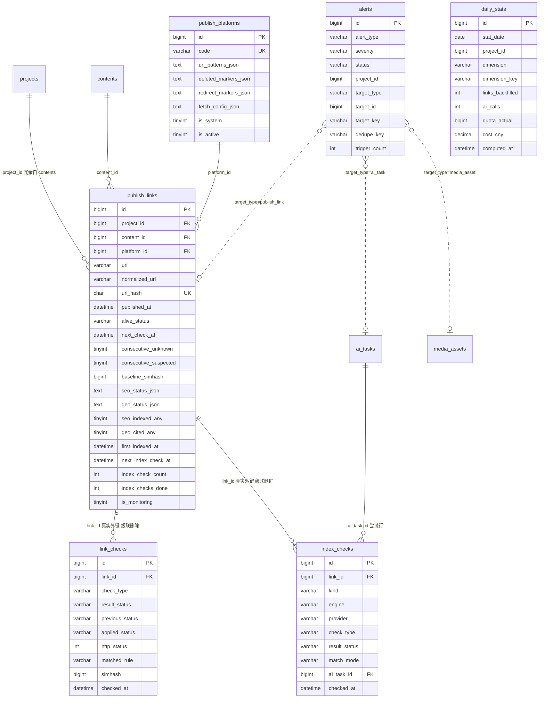

# 03 数据模型

本文档是 aicreat 全部 **24 张数据表**的权威定义：数据库约定、ER 图、每张表的字段/索引/约束与说明、`settings` 配置键清单、一致性与事务规则。其它文档只引用本文档中的表名与字段名（如「字段定义见 [03-data-model](./03-data-model.md) `publish_links`」），不再复制表格。

| 项 | 位置 |
| --- | --- |
| ORM 模型 | `server/app/models.py`（全部 24 张表；文件顶部以 `Literal` 常量声明各状态枚举集合，与 `packages/shared/src/enums.ts` 同名同值） |
| 建表迁移 | `server/migrations/versions/0001_initial.py`（全部 24 张表、索引、真实外键） |
| 权限 seed 迁移 | `server/migrations/versions/0002_seed_permissions.py`（只写 `admin_permissions` 与系统用户组（含各组默认 `data_scope`）；权限码表见 [07-admin-rbac](./07-admin-rbac.md)） |
| 启动时写入 | `admin_rbac_service.ensure_rbac_seed`、`settings_service.ensure_default_settings`（`settings` 键不存在则插入默认 JSON 深合并环境变量派生值）、`ai_gateway_service.ensure_default_routes`（8 条全局 `capability_routes`）；三者由 `main.py` 与两个 worker 在 `lock:bootstrap` 内执行，全部幂等 |
| 数据 seed | `server/seeds/seed.py`：幂等 upsert 默认超级管理员 `admin/admin123`、示例项目（`owner_id` = 默认超管）、系统 Prompt 模板（`zh-CN`）、默认发布平台 |

数据归属与可见性（`admin_groups.data_scope`、`projects.owner_id` 的隔离语义）见 [13-user-data-scope](./13-user-data-scope.md)；状态枚举的取值集合汇总见 [00-overview](./00-overview.md)；各状态机的流转规则以功能文档为准：关键词/标题/内容/批次 → [09-generation-pipeline](./09-generation-pipeline.md)，AI 任务与错误分类 → [08-zhiqiapi-integration](./08-zhiqiapi-integration.md)，媒体 → [10-media-generation](./10-media-generation.md)，链接存活/收录/告警 → [11-link-backfill-and-monitoring](./11-link-backfill-and-monitoring.md)，报表指标 → [12-dashboard-reports](./12-dashboard-reports.md)。接口字段命名规则见 [04-api-spec](./04-api-spec.md)；Redis 键、队列与锁的完整清单见 [01-architecture](./01-architecture.md)。

## 数据库约定

| 项 | 约定 |
| --- | --- |
| 数据库 | MySQL 8.x，字符集 `utf8mb4`、排序规则 `utf8mb4_unicode_ci`，引擎 InnoDB；连接串 `DATABASE_URL`（见 [05-deployment](./05-deployment.md)） |
| 通用列 | 所有表含 `created_at DATETIME NOT NULL DEFAULT CURRENT_TIMESTAMP` 与 `updated_at DATETIME NOT NULL DEFAULT CURRENT_TIMESTAMP ON UPDATE CURRENT_TIMESTAMP`，由数据库维护；**不可变表**（`content_versions`、`link_checks`、`index_checks`、`ai_usage_logs`、`admin_operation_logs`）同样保留两列。下文字段表不再重复列出 |
| 主键 | 一律 `BIGINT PK AUTO_INCREMENT`（下文写作 `BIGINT PK AI`）；例外：`settings` 复合主键 `(key, locale)`、`admin_group_permissions` 复合主键 `(group_id, permission_id)` |
| 外键 | 字段表中的 `FK→表` 为**逻辑外键**：只建索引，由 service 层校验存在性，避免跨进程（API / worker / monitor-worker）删除时的外键死锁。**真实外键**仅 6 处：`admins.group_id → admin_groups.id`、`admin_group_permissions.group_id → admin_groups.id`、`admin_group_permissions.permission_id → admin_permissions.id`（三者 `ON DELETE RESTRICT`：删除用户组时 service 在同一事务内**先删除**该组的 `admin_group_permissions` 行再删除组行，不依赖级联），`content_versions.content_id → contents.id`、`link_checks.link_id → publish_links.id`、`index_checks.link_id → publish_links.id`（三者 `ON DELETE CASCADE`） |
| 可空与默认 | 字段表「说明」未标「可空」的列为 `NOT NULL`；「类型」列中的「默认 x」为数据库默认值；JSON 列一律可空，service 读取时 `NULL` 视为 `{}` 或 `[]` |
| 时间 | `DATETIME`，**一律存 UTC**；API 输入/输出 ISO 8601 UTC（`2026-10-06T08:00:00Z`）；`daily_stats.stat_date` 为 `DATE`，按 `stats_config.timezone`（默认 `Asia/Shanghai`）切日 |
| 布尔 / 枚举 | 布尔 `TINYINT(1)` 0/1；枚举用 `VARCHAR` 存小写 `snake_case` 字符串，**不用 MySQL ENUM**（取值集合在 `models.py` 顶部以 `Literal` 声明，前端在 `packages/shared/src/enums.ts` 以 `as const` 导出） |
| JSON 列 | 列名以 `_json` 结尾，类型 `TEXT`/`MEDIUMTEXT`（UTF-8 JSON 字符串），由 service 层编解码；API 字段名 = 列名去掉 `_json`，值为解码后的对象/数组（如 `fallback_models_json` → `fallback_models`，`seo_status_json` → `seo_status`） |
| 额度 / 金额 / 计量 | 额度列 `quota_*` 为 zhiqiapi 原始整数额度 `BIGINT`（`quota_per_unit=500000` 额度 = 1 USD）；金额 `cost_cny DECIMAL(14,6)` 人民币元，`cost_cny = quota / quota_per_unit × usd_cny_rate`，按写入**当时**的 `ai_routing_config.pricing` 折算并落库，报表只求和、不再按当前参数折算；tokens `INT`；耗时 `duration_ms INT`（毫秒） |
| 哈希 | `CHAR(64)` 存 SHA-256 十六进制小写（`url_hash`、`content_hash`、`file_hash`、`entry_hash`）；SimHash 存**有符号** `BIGINT`（见 `publish_links.baseline_simhash`） |
| 软删除 | 不做通用软删除：用状态值（`archived`/`discarded`/`deleted`）表达；物理删除仅限草稿类对象（规则见「一致性与事务规则」） |
| 保留字 | `settings.key` 为 MySQL 8 保留字（沿用 navigation 不改名），建表、查询与运维 SQL 中一律写作 `` `key` ``；`media_assets.usage_type`、`ai_tasks.trigger_type` 因 `usage`/`trigger` 为保留字而改名 |
| 命名 | 表名复数 `snake_case`；列名 `snake_case`；索引命名（本文档补充约定）：普通索引 `ix_<表>_<列1>_<列2>`、唯一索引 `uq_<表>_<列…>`、真实外键 `fk_<表>_<列>`，Alembic 迁移按此命名以便 `downgrade` |
| 前缀索引 | 只有 `alerts.dedupe_key(191)` 使用前缀索引（utf8mb4 下控制索引长度）；其余 `VARCHAR(1000)` 的 URL 列不建索引，链接的精确查找一律经 `url_hash`（唯一索引）；`domain` 列只用于展示与列表筛选，不建索引 |
| 测试会话 | `server/tests/conftest.py` 提供 SQLite 与 MySQL 两种会话：ORM 不使用 MySQL 专有列类型；`SELECT … FOR UPDATE` 在 SQLite 下为空操作；本文档中的 `INSERT … ON DUPLICATE KEY UPDATE` 示例均为 MySQL 语义示意，service 中统一封装为与方言无关的「`INSERT` → `except IntegrityError: rollback` → 按唯一键重读 → 需要时 `UPDATE`」（`ensure_*` 与各 upsert 使用同一封装），两种会话下行为一致 |

### 表总览

| # | 表 | 域 | 用途 | 特性 | 语义/流转权威 |
| --- | --- | --- | --- | --- | --- |
| B.1 | `admins` | RBAC | 管理员账号 | | [07](./07-admin-rbac.md) |
| B.2 | `admin_groups` | RBAC | 用户组（`super_admin`/`operator`/`reviewer`/`read_only`），带数据范围 `data_scope` | | 07、[13](./13-user-data-scope.md) |
| B.3 | `admin_permissions` | RBAC | 权限码定义（迁移 seed，后台不可新增） | | 07 |
| B.4 | `admin_group_permissions` | RBAC | 用户组 × 权限 | 复合主键 | 07 |
| B.5 | `admin_operation_logs` | RBAC | 操作审计 | 不可变 | 07 |
| B.6 | `settings` | 配置 | 配置 JSON（`key` + `locale`） | 复合主键 | 各键权威见 B.6 清单 |
| B.7 | `projects` | 生成 | 项目/专题；`owner_id` 为数据归属键 | | [09](./09-generation-pipeline.md)、[13](./13-user-data-scope.md) |
| B.8 | `prompt_templates` | 生成 | Prompt 模板（`code` + `version`） | | 09 |
| B.9 | `generation_batches` | 生成 | 关键词/标题/内容生成批次 | | 09 |
| B.10 | `keywords` | 生成 | 关键词 | | 09 |
| B.11 | `titles` | 生成 | 标题 | | 09 |
| B.12 | `contents` | 生成 | 内容（文章） | | 09 |
| B.13 | `content_versions` | 生成 | 内容版本快照 | 不可变、级联删除 | 09 |
| B.14 | `media_assets` | 媒体 | 图片/视频素材 | | [10](./10-media-generation.md) |
| B.15 | `ai_tasks` | AI 网关 | 根任务 + 尝试行 | 自引用 | [08](./08-zhiqiapi-integration.md) |
| B.16 | `ai_models` | AI 网关 | zhiqiapi 模型目录与价格快照 | | 08 |
| B.17 | `capability_routes` | AI 网关 | 能力 → 主模型 + 备选链 | | 08 |
| B.18 | `ai_usage_logs` | AI 网关 | `/api/log/token` 对账日志 | 不可变 | 08 |
| B.19 | `publish_platforms` | 监控 | 发布平台与删除特征规则 | | [11](./11-link-backfill-and-monitoring.md) |
| B.20 | `publish_links` | 监控 | 回填发布链接（存活 / 收录状态） | | 11 |
| B.21 | `link_checks` | 监控 | 删除检测记录 | 不可变、级联删除 | 11 |
| B.22 | `index_checks` | 监控 | SEO/GEO 收录检测记录 | 不可变、级联删除 | 11 |
| B.23 | `alerts` | 监控 | 告警 | 多态目标 | 11 |
| B.24 | `daily_stats` | 报表 | 每日预聚合 | 全量 upsert | [12](./12-dashboard-reports.md) |

## 实体关系

### 总览（24 张表，仅关系）

实线为逻辑/真实外键引用，虚线为按字符串值引用（模型 ID）或多态引用（`target_type/target_id`）；`settings` 与 `daily_stats` 为独立表。



### 生成域

```mermaid
erDiagram
    projects ||--o{ prompt_templates : "project_id>0 专属模板"
    projects ||--o{ generation_batches : "发起批次"
    projects ||--o{ keywords : "归属"
    keywords ||--o{ titles : "keyword_id"
    titles ||--o{ contents : "title_id"
    keywords ||--o{ contents : "keyword_id"
    contents ||--o{ content_versions : "content_id 真实外键 级联删除"
    contents |o--o| content_versions : "current_version_id"
    contents ||--o{ media_assets : "content_id 配图"
    contents |o--o| media_assets : "cover_asset_id"
    generation_batches ||--o{ keywords : "batch_id"
    generation_batches ||--o{ titles : "batch_id"
    generation_batches ||--o{ contents : "batch_id"
    prompt_templates ||--o{ generation_batches : "template_id"

    projects {
        bigint id PK
        bigint owner_id FK
        varchar name
        varchar slug
        varchar language
        varchar default_style
        varchar default_format
        text default_templates_json
        varchar status
    }
    prompt_templates {
        bigint id PK
        varchar code
        int version
        varchar kind
        varchar capability
        bigint project_id
        varchar status
        tinyint is_system
    }
    generation_batches {
        bigint id PK
        bigint project_id FK
        varchar kind
        varchar status
        bigint template_id
        int task_total
        int task_done
        int task_failed
    }
    keywords {
        bigint id PK
        bigint project_id FK
        varchar keyword
        varchar normalized_keyword
        varchar intent
        varchar status
        bigint batch_id FK
        bigint ai_task_id FK
        int title_count
        int content_count
    }
    titles {
        bigint id PK
        bigint project_id FK
        bigint keyword_id FK
        varchar title
        varchar style
        varchar status
        bigint batch_id FK
        bigint ai_task_id FK
        int content_count
    }
    contents {
        bigint id PK
        bigint project_id FK
        bigint title_id FK
        bigint keyword_id FK
        varchar title
        varchar status
        varchar prev_status
        bigint current_version_id FK
        int version_count
        bigint cover_asset_id FK
        bigint ai_task_id FK
        int link_count
        datetime first_published_at
    }
    content_versions {
        bigint id PK
        bigint content_id FK
        int version_no
        varchar source
        char content_hash
        bigint ai_task_id FK
        bigint restored_from_version_id
    }
    media_assets {
        bigint id PK
        bigint project_id FK
        bigint content_id FK
        varchar kind
        varchar usage_type
        varchar source
        varchar status
        bigint ai_task_id FK
        varchar upstream_task_id
        varchar storage_key
        varchar url
        datetime ready_at
        datetime failed_at
    }
```



### AI 网关域

`ai_tasks` 同一张表承载「根任务行」（`root_task_id IS NULL`）与「尝试行」（`root_task_id` = 根任务 ID），详见 B.15。



### 发布监控与报表域



## 表设计

表标题形如 `B.N 表名`，章节锚点为 `#bN-表名`（如 `./03-data-model.md#b20-publish_links`）。每表给出字段表、索引/约束与说明；枚举取值仅列集合，流转规则见对应权威文档。

### B.1 admins

**管理员账号**（界面称「用户」）。登录、JWT 校验（claims `sub`/`aud="admin"`/`ver`）与权限判定流程见 [07-admin-rbac](./07-admin-rbac.md)；账号的数据范围取自所属用户组的 `data_scope`（B.2），作为 `projects.owner_id` 的项目负责人时拥有该项目下的全部数据（[13-user-data-scope](./13-user-data-scope.md)）。

| 字段 | 类型 | 说明 |
| --- | --- | --- |
| id | BIGINT PK AI | 主键 |
| username | VARCHAR(50) | 登录名，唯一 |
| password_hash | VARCHAR(255) | bcrypt 哈希（`security.hash_password`），接口永不返回 |
| display_name | VARCHAR(50) | 显示名，可空 |
| group_id | BIGINT FK→admin_groups | 所属用户组（真实外键 `fk_admins_group_id`，`ON DELETE RESTRICT`） |
| is_active | TINYINT 默认 1 | 1 正常 / 0 禁用；启用、禁用时都在同一事务内递增 `token_version` |
| token_version | INT 默认 1 | 以下事件在业务更新的同一事务内递增：登出（`POST /admin/auth/logout`）、本人修改密码（`POST /admin/auth/change-password`）、重置他人密码（`POST /admin/admins/{id}/reset-password`）、启用/禁用（`PATCH /admin/admins/{id}/status`）、更换用户组（`PUT /admin/admins/{id}` 且 `group_id` 变化）；仅修改显示名、修改用户组权限不递增。事件全表见 [07-admin-rbac](./07-admin-rbac.md) §7.4；JWT claim `ver` 必须与之相等，否则 401 |
| last_login_at | DATETIME | 最近登录，可空 |
| created_by | BIGINT | 创建人管理员 ID，可空 |

- 索引：`UNIQUE(username)`、`INDEX(group_id)`、`INDEX(is_active)`。
- 登录失败计数不落库，走 Redis `rate:admin_login:{username}`（`ADMIN_LOGIN_MAX_FAILURES=5` 次后锁定 15 分钟）。
- 默认超级管理员由 `seeds/seed.py` 按 `SEED_ADMIN_USERNAME`/`SEED_ADMIN_PASSWORD`（`admin/admin123`）幂等写入，归属 `super_admin` 组。
- 管理员不物理删除（只禁用）；不可禁用自己、不可禁用/移出最后一个有效超级管理员（安全规则，service 校验返回业务码 403 `CODE_FORBIDDEN`，见 [04-api-spec](./04-api-spec.md) 错误码表）。

### B.2 admin_groups

**管理员用户组**。系统组及其默认权限由 `app/core/admin_permissions.py` 的 `SYSTEM_GROUPS`/`DEFAULT_GROUP_PERMISSIONS` 定义（见 [07-admin-rbac](./07-admin-rbac.md)）。

| 字段 | 类型 | 说明 |
| --- | --- | --- |
| id | BIGINT PK AI | 主键 |
| code | VARCHAR(40) | 组代码，唯一；系统组固定 `super_admin`/`operator`/`reviewer`/`read_only` |
| name | VARCHAR(50) | 中文名，唯一 |
| name_en | VARCHAR(80) | 英文名（系统自动生成） |
| description | VARCHAR(255) | 说明，可空 |
| is_system | TINYINT 默认 0 | 系统内置组不可删除/停用 |
| is_active | TINYINT 默认 1 | 是否可用 |
| data_scope | VARCHAR(16) 默认 `own` | `data_scope`：`all`（全部数据，总后台）/ `own`（仅本人负责的项目及其下数据）；系统组默认 `super_admin`/`reviewer`/`read_only` 为 `all`、`operator` 为 `own`，`super_admin` 固定 `all` 不可修改；自定义组创建时缺省 `own`。语义与可见性规则见 [13-user-data-scope](./13-user-data-scope.md) |
| created_by | BIGINT | 创建人，可空 |

- 索引：`UNIQUE(code)`、`UNIQUE(name)`。
- `data_scope` 每次请求实时读取，修改立即生效，不递增成员的 `token_version`；修改写审计（[13-user-data-scope](./13-user-data-scope.md) §3.3）。
- 非系统组的 `code` 由服务端生成 `custom_{uuid4().hex[:12]}`，创建后不可修改；`name_en` 由 `name` 自动生成。
- 系统组（`is_system=1`）不可删除、不可停用、不可清空权限；仍有启用中管理员（`admins.is_active=1`）的自定义组不可停用；有成员（含已禁用管理员）的组不可删除（以上均为安全规则，service 校验返回业务码 403 `CODE_FORBIDDEN`；删除另由真实外键 `admins.group_id` 的 `RESTRICT` 兜底）。删除非系统空组时同一事务先删除其 `admin_group_permissions` 行再删除组行（该表外键为 `RESTRICT`，不级联）。

### B.3 admin_permissions

**权限定义**。权限码共 90 个，只由 `app/core/admin_permissions.py` + 迁移 `0002_seed_permissions.py` 维护，后台不可新增；完整权限码表见 [07-admin-rbac](./07-admin-rbac.md)。

| 字段 | 类型 | 说明 |
| --- | --- | --- |
| id | BIGINT PK AI | 主键 |
| code | VARCHAR(100) | 权限码 `module.resource.action`，唯一 |
| module | VARCHAR(50) | 模块 |
| name | VARCHAR(80) | 中文名 |
| type | VARCHAR(16) | `menu`（`*.view`）/ `action` |
| parent_code | VARCHAR(100) | 上级权限码（`action` 指向同资源的 `view`），可空 |
| sort | INT 默认 0 | 展示顺序 |

- 索引：`UNIQUE(code)`、`INDEX(module, sort)`。
- 启动时 `ensure_rbac_seed` 以 `code` 为键幂等补齐缺失权限（新增权限码只需改常量并发布）。

### B.4 admin_group_permissions

**用户组权限关联**。

| 字段 | 类型 | 说明 |
| --- | --- | --- |
| group_id | BIGINT FK→admin_groups | 用户组（真实外键 `fk_admin_group_permissions_group_id`） |
| permission_id | BIGINT FK→admin_permissions | 权限（真实外键 `fk_admin_group_permissions_permission_id`） |

- 约束：`PRIMARY KEY(group_id, permission_id)`、`INDEX(permission_id)`。
- `PUT /admin/admin-groups/{id}/permissions` 为全量覆盖保存：同一事务内按差集删除/插入，并自动补齐同资源 `view` 与跨资源依赖（`PERMISSION_DEPENDENCIES`，见 07）；`super_admin` 组 seed 时写入全部权限码，系统组不可清空权限。

### B.5 admin_operation_logs

**管理员操作日志**（不可变、只读）。由 `main.py` 的审计中间件按路由前缀 → `target_type` 映射（常量 `AUDIT_TARGET_TYPES`）调用 `admin_rbac_service.write_audit` 写入；不记录密码/密钥/令牌。

| 字段 | 类型 | 说明 |
| --- | --- | --- |
| id | BIGINT PK AI | 主键 |
| admin_id | BIGINT | 操作管理员（逻辑外键 → `admins`） |
| permission_code | VARCHAR(100) | 使用的权限码 |
| action | VARCHAR(50) | `create`/`update`/`update_status`/`delete`/`execute`/`login`/`logout`/`reset_password` |
| target_type | VARCHAR(50) | 目标类型（表名单数：`project`/`prompt_template`/`keyword`/`title`/`content`/`content_version`/`generation_batch`/`media_asset`/`capability_route`/`ai_task`/`ai_model`/`ai_usage_log`/`publish_platform`/`publish_link`/`alert`/`daily_stats`/`setting`/`admin`/`admin_group`；路由前缀 → 取值的完整映射表 `AUDIT_TARGET_TYPES` 见 [07-admin-rbac](./07-admin-rbac.md) §7.6 审计中间件） |
| target_id | VARCHAR(64) | 目标 ID（路径中最后一个 `{id}` 类参数；`setting` 为 `{key}`），可空 |
| summary | VARCHAR(255) | 中文摘要 |
| request_id | VARCHAR(64) | 本服务请求追踪 ID（响应头 `X-Request-Id`；与 zhiqiapi 的 `x-oneapi-request-id` 无关） |
| ip | VARCHAR(64) | 脱敏来源 IP |
| user_agent | VARCHAR(255) | UA，可空 |

- 索引：`INDEX(admin_id, created_at)`、`INDEX(permission_code)`、`INDEX(target_type, target_id)`、`INDEX(created_at)`。
- 不提供删除接口；归档由运维按 `created_at` 分区/导出（见 [05-deployment](./05-deployment.md)）。

### B.6 settings

**系统配置**。每个配置键一个 JSON 文档；读写经 `settings_service.get_config(db, key)` / `set_value`：读取时与 `settings_service.DEFAULT_SETTINGS[key]` **深合并**（数据库值覆盖默认值）并缓存到 Redis `cache:settings:{key}:{locale}`（60s）；写入时按 `app/schemas/settings.py` 中同名 Pydantic 模型校验，写后 `cache_delete_prefix("cache:settings:")`。密钥永不入本表（只在环境变量），后台仅显示 `configured: true/false`。

| 字段 | 类型 | 说明 |
| --- | --- | --- |
| `key` | VARCHAR(80) | 配置键（见下方清单） |
| locale | VARCHAR(10) | `zh-CN`/`en-US`/`*`（语言无关） |
| value | MEDIUMTEXT | JSON 字符串 |

- 约束：`PRIMARY KEY(key, locale)`。
- `key` 为 MySQL 8 保留字，SQL 中必须加反引号：

```sql
SELECT `key`, locale, value FROM settings WHERE `key` = 'monitoring_config' AND locale = '*';
INSERT INTO settings (`key`, locale, value) VALUES ('stats_config', '*', '{"version":1,"timezone":"Asia/Shanghai"}')
ON DUPLICATE KEY UPDATE value = VALUES(value);
```

- 启动时 `ensure_default_settings(db)` 对下列每个键执行「键不存在则插入」：插入值 = `DEFAULT_SETTINGS[key]` 深合并环境变量派生值（映射表 `settings_service.ENV_SEED_PATHS`，变量清单见 [05-deployment](./05-deployment.md)）；已存在的键不再改写，运行期以数据库值为准。Mock 模式（`ZHIQI_API_KEY` 为空）首次写入 `geo_engines` 时把全部引擎 seed 为 `enabled=true`（真实模式初值全部 `enabled=false`），之后运行期一律只看数据库中的 `enabled`。

#### settings 配置键清单

| `key` | locale | 用途 | JSON 结构权威 |
| --- | --- | --- | --- |
| `generation_config` | `*` | 关键词/标题/内容生成规则、质量规则、频控与额度 | [09-generation-pipeline](./09-generation-pipeline.md) |
| `media_config` | `*` | 图片/视频参数默认值、轮询、转存、保留与日上限 | [10-media-generation](./10-media-generation.md) |
| `monitoring_config` | `*` | 删除检测与收录检测的调度/判定参数 | [11-link-backfill-and-monitoring](./11-link-backfill-and-monitoring.md) |
| `geo_engines` | `*` | GEO 引擎列表（模型 + 协议 + 提示模板 + 解析规则） | 11 |
| `seo_providers` | `*` | 各 SEO 引擎使用的收录检测提供器 | 11 |
| `alert_config` | `*` | 告警规则、去重冷却、通道 | 11 |
| `ai_routing_config` | `*` | 重试/熔断/回退/超时/计价/探测/目录同步/对账 | [08-zhiqiapi-integration](./08-zhiqiapi-integration.md) |
| `stats_config` | `*` | 统计时区、每日聚合时间、刷新间隔、保留期 | [12-dashboard-reports](./12-dashboard-reports.md) |
| `system_info` | `zh-CN` / `en-US` | 后台名称、Logo、页脚、联系方式（各语言一行） | [04-api-spec](./04-api-spec.md) |

本文档中引用的配置项（如 `generation_config.rewrite.max_versions`、`media_config.transfer.retry_seconds`、`monitoring_config.link_check.unknown_confirm_count`、`ai_routing_config.pricing`、`stats_config.timezone`）均以上述权威文档的结构为准。

### B.7 projects

**项目/专题**：内容生产的组织单位，所有关键词/标题/内容/素材/链接/批次/AI 任务归属项目；项目负责人 `owner_id` 是这些数据的归属用户，也是数据隔离的唯一依据（[13-user-data-scope](./13-user-data-scope.md)）。

| 字段 | 类型 | 说明 |
| --- | --- | --- |
| id | BIGINT PK AI | 主键 |
| name | VARCHAR(100) | 项目名，同一负责人下唯一 |
| slug | VARCHAR(80) | URL 友好标识，同一负责人下唯一 |
| industry | VARCHAR(80) | 行业，可空 |
| audience | VARCHAR(255) | 目标受众描述，可空 |
| brand_name | VARCHAR(100) | 品牌名，可空 |
| brand_info | TEXT | 品牌信息/语气/禁忌（注入 Prompt 变量 `brand_info`），可空 |
| description | VARCHAR(500) | 项目说明，可空 |
| language | VARCHAR(10) 默认 `zh-CN` | 生成内容语言（`prompt_templates.language` 匹配基准） |
| default_style | VARCHAR(32) 默认 `news` | 默认标题/内容风格（`content_style`：`news`/`tutorial`/`review`/`qa`/`recommend`/`listicle`/`story`） |
| default_format | VARCHAR(10) 默认 `markdown` | `markdown`/`html` |
| default_templates_json | TEXT | 以 `prompt_kind` 为键的字典 `{"<kind>": template_id}`，可空；键 ∈ 14 种 `prompt_kind`，值须为该 kind 的可见 `published` 模板 ID，且模板 `project_id ∈ {0, 该项目 id}`（service 校验，否则 400，`type` ∈ `not_published`/`kind_mismatch`/`project_mismatch`，见 [04-api-spec](./04-api-spec.md) §7.3、[13-user-data-scope](./13-user-data-scope.md) §7.1） |
| default_platform_ids_json | TEXT | 常用发布平台 ID 数组，可空 |
| status | VARCHAR(16) 默认 `active` | `project_status`：`active`/`archived` |
| owner_id | BIGINT FK→admins | 项目负责人（用户 ID，逻辑外键）：项目及其下全部数据归属此用户；创建时缺省为创建人，总后台（`data_scope=all`）可指定或转移，普通用户只能是本人（[13-user-data-scope](./13-user-data-scope.md) §7.2） |
| created_by | BIGINT | 创建人 |

- 索引：`UNIQUE(owner_id, name)`、`UNIQUE(owner_id, slug)`、`INDEX(status)`（`owner_id` 的查询走 `uq_projects_owner_id_name` 的最左前缀，不再单建 `INDEX(owner_id)`）。名称与 slug 按负责人唯一，避免 409 冲突暴露其他用户的项目名。
- 转移负责人只改本行 `owner_id`（子表经 `project_id` 归属，无需迁移），提交后清 `cache:stats:*`（见「一致性与事务规则 · 数据归属与负责人转移」）。
- `default_templates_json` 示例：`{"keyword": 12, "title": 15, "content": 21, "image_prompt": 30}`。模板解析 `prompt_template_service.resolve_template(kind, project_id, language)` 固定三步：① 取 `projects.default_templates_json[kind]`——该 ID 对应版本仍为 `published` 则直接使用；若因同 `code` 发布了新版本而已变为 `archived`，改取该 `code` 当前的 `published` 版本；② 未配置、或该 `code` 已无 `published` 版本时，按 `kind` 取下表配置项给出的 code，再取该 code 的 `project_id=0` `published` 版本（配置项只能指向全局模板，项目模板不会被其他项目解析）；③ 两步均先匹配 `language`（= `projects.language`），找不到同语言的 `published` 模板时回退 `zh-CN`；仍找不到（系统模板缺失）则抛业务码 404 `CODE_NOT_FOUND`，`data={"kind":…}`。

| kind | 缺省 code 来源 |
| --- | --- |
| `keyword` / `title` | `generation_config.keyword.default_template_code` / `generation_config.title.default_template_code` |
| `outline` / `content` / `section` / `seo_meta` / `faq` | `generation_config.content.template_codes.<kind>` |
| `rewrite` / `expand` / `shorten` / `restyle` | `generation_config.rewrite.template_codes.<kind>` |
| `image_prompt` | `media_config.image.image_prompt_template_code` |
| `geo_query` / `seo_query` | 固定 `sys_geo_query` / `sys_seo_query`（GEO 引擎按 `geo_engines.engines[].prompt_template_code`、SEO 提供器按 `seo_providers.providers.zhiqi_web_search.prompt_template_code` 指定 code，缺省即为上述二者） |

- **项目级默认模型不在本表**：由 `capability_routes.project_id = 项目 ID` 的覆盖行表达（`PUT /admin/projects/{id}/routes` 维护，见 B.17）。
- `archived` 项目拒绝新的生成/回填请求（409）；物理删除规则见「一致性与事务规则 · 删除规则」。

### B.8 prompt_templates

**Prompt 模板**：同一 `code` 多版本，`published` 版本不可编辑（编辑即复制为新 `draft` 版本）。模板体系、变量与系统模板清单见 [09-generation-pipeline](./09-generation-pipeline.md)。

| 字段 | 类型 | 说明 |
| --- | --- | --- |
| id | BIGINT PK AI | 主键 |
| code | VARCHAR(80) | 模板代码（同一代码多版本），系统模板如 `sys_keyword`/`sys_title`/`sys_outline`/`sys_content`/`sys_section`/`sys_rewrite`/`sys_expand`/`sys_shorten`/`sys_restyle`/`sys_seo_meta`/`sys_faq`/`sys_image_prompt`/`sys_geo_query`/`sys_seo_query` |
| version | INT 默认 1 | 版本号，同 `code` 内递增 |
| kind | VARCHAR(32) | `prompt_kind`：`keyword`/`title`/`outline`/`content`/`section`/`rewrite`/`expand`/`shorten`/`restyle`/`seo_meta`/`faq`/`image_prompt`/`geo_query`/`seo_query` |
| capability | VARCHAR(20) | 路由能力，由 `kind` 推导（见下表），写入时由 service 计算 |
| name | VARCHAR(100) | 模板名 |
| description | VARCHAR(500) | 说明，可空 |
| language | VARCHAR(10) 默认 `zh-CN` | 适用语言；系统模板首版仅 `zh-CN` |
| project_id | BIGINT 默认 0 | 0 = 全局模板；>0 = 项目专属（逻辑外键 → `projects`） |
| system_prompt | TEXT | system 提示词，可空 |
| user_prompt | TEXT | user 提示词，使用 `{{variable}}` 占位 |
| variables_json | TEXT | 变量声明数组，如 `[{"name":"keyword","label":"关键词","required":true,"default":""}]` |
| output_format | VARCHAR(16) 默认 `json` | `json`/`markdown`/`text` |
| output_schema_json | TEXT | `json` 输出的字段约定（供 `extract_json` 解析与校验），可空 |
| model_params_json | TEXT | 如 `{"temperature":0.7,"max_tokens":2048}`，覆盖路由 `params_json` 默认值，可空 |
| status | VARCHAR(16) 默认 `draft` | `prompt_status`：`draft`/`published`/`archived` |
| is_system | TINYINT 默认 0 | 系统模板（seed），不可删除，可复制 |
| published_at | DATETIME | 发布时间，可空 |
| created_by | BIGINT | 创建人 |
| updated_by | BIGINT | 最近修改人 |

- 索引：`UNIQUE(code, version)`、`INDEX(kind, status, project_id)`、`INDEX(project_id)`。
- 同一 `code` 同时只能有一个 `published` 版本（service 在发布事务内把旧 `published` 版本置 `archived`）。
- 可见性（[13-user-data-scope](./13-user-data-scope.md) §4.2、§7.3）：项目模板随项目负责人可见；全局模板（`project_id=0`）的 `published`/`archived` 版本对所有用户只读可见，`draft` 版本只对创建人与总后台可见；`code` 全局唯一，新建时命中不可见模板返回 409 `data={"existing_id":null,"reason":"owned_by_other"}`。
- `kind` → `capability` 推导（固定映射，用于路由解析与报表归类）：

| kind | capability |
| --- | --- |
| `keyword` | `keyword` |
| `title` | `title` |
| `outline`、`content`、`section`、`seo_meta`、`faq`、`image_prompt` | `content` |
| `rewrite`、`expand`、`shorten`、`restyle` | `rewrite` |
| `geo_query` | `geo_check` |
| `seo_query` | `seo_check` |

- 物理删除仅限 `draft` 且非系统模板；`published → archived` 有保护：同 `code` 无其它 `published` 版本且（`is_system=1` 或被任一 `projects.default_templates_json` 引用）时返回 409 `data={"current_status":"published","reason":"last_published"}`，保证 `resolve_template` 回退链不为空。删除项目时其 `project_id = 项目 ID` 的模板同事务删除。

### B.9 generation_batches

**生成批次**：关键词/标题/内容生成的用户级任务，聚合其下子任务的进度。子任务 = `ai_tasks` 中 `batch_id` 指向本表、`root_task_id IS NULL` 的**根任务行**（B.15）。批次状态机与编排见 [09-generation-pipeline](./09-generation-pipeline.md)。

| 字段 | 类型 | 说明 |
| --- | --- | --- |
| id | BIGINT PK AI | 主键 |
| project_id | BIGINT FK→projects | 项目 |
| kind | VARCHAR(16) | `keyword`/`title`/`content` |
| status | VARCHAR(16) 默认 `queued` | `batch_status`：`queued`/`running`/`succeeded`/`partial`/`failed`/`cancelled` |
| input_json | TEXT | 原始输入（种子词、数量、风格、`keyword_ids`、`title_ids`、参数），如 `{"seeds":["内容营销"],"count":20,"competitors":[],"audience":"","model":null}` |
| template_id | BIGINT | 使用的模板 ID（逻辑外键 → `prompt_templates`） |
| template_version | INT | 模板版本快照 |
| requested_count | INT 默认 0 | 期望产出数量 |
| produced_count | INT 默认 0 | 实际产出数量：本批次 `succeeded` 根任务写出的业务行数，一律按数据库统计、不用 `apply_generated` 的内存返回值（口径见下方说明） |
| task_total | INT 默认 0 | 子任务总数：只统计 `ai_tasks.root_task_id IS NULL` 的根任务行（候选切换、分段、service 级重试产生的尝试行不计） |
| task_done | INT 默认 0 | 已成功根任务数 |
| task_failed | INT 默认 0 | 失败根任务数（含 `cancelled`/`expired`） |
| error_summary | VARCHAR(1000) | 脱敏错误摘要，可空：由 `generation_service.on_task_finished` 与 `recover_stale_tasks` ④ 在 `lock:generation_batch:{batch_id}` 内按数据库汇总后覆盖写入，不依赖 `apply_generated` 的内存返回值，业务 service 不直接写。汇总口径：分项计数只汇总本批次各根任务（含重试根任务）实际写入的 `ai_tasks.response_meta_json.apply_counts`（B.15）；失败根任务按 `error_category` 计数，排除已有重试子任务（存在 `parent_task_id` 指向它的行）的失败根任务，与 `task_failed` 的口径一致，其中带 `response_meta_json.stale_after_submit = true` 标记的（`recover_stale_tasks` ① 写入，B.15）计为 `stale_after_submit`、不计入 `timeout`。格式 `<项>=<n>` 以 `;` 连接（如 `duplicates=3;content_blocked=1`），为 0 的项省略，全部为 0 时为 NULL |
| started_at | DATETIME | 首个子任务开始时间，可空 |
| finished_at | DATETIME | 收敛时间，可空 |
| heartbeat_at | DATETIME | 最近子任务心跳，可空 |
| created_by | BIGINT | 发起管理员 |

- 索引：`INDEX(project_id, kind, status)`、`INDEX(status, created_at)`、`INDEX(created_by, created_at)`。
- 收敛由根任务终态触发，批次状态机以 [09-generation-pipeline](./09-generation-pipeline.md) §9.3 为准：`generation_service.on_task_finished(batch_id)` 在 `lock:generation_batch:{batch_id}` 内更新 `task_done`/`task_failed`、重算 `produced_count` 并按库覆盖写入 `error_summary`，`task_done + task_failed == task_total` 时置 `succeeded`（`task_failed=0`）/`partial`（部分根任务失败或取消）/`failed`（全部根任务失败或取消）并写 `finished_at`；进程在根任务终态提交后、`on_task_finished` 之前退出时，由 `recover_stale_tasks` ④ 按数据库重算计数与 `produced_count`、同时按库汇总覆盖写入 `error_summary`（口径同上表）后兜底收敛（「一致性与事务规则 · 任务幂等与状态收敛」第 8 条）。因 `quota_exceeded`/`auth_failed` 回滚为 `queued` 的根任务不是终态，不触发收敛。
- `produced_count` 的统计口径（`on_task_finished` 与 ④ 共用，不依赖 `apply_generated` 的内存返回值）：对批次内每个 `succeeded` 根任务按数据库统计它写出的业务行，求和后覆盖写入（幂等：重复调用结果相同，提交与收敛之间进程崩溃也不丢计数）。`keyword`/`title` 批次统计 `keywords`/`titles` 中 `ai_task_id` 属于该根任务尝试行的行（`ai_task_id IN (SELECT id FROM ai_tasks WHERE root_task_id = :root_id)`，两表的 `ai_task_id` 指向尝试行；走两表的 `INDEX(ai_task_id)` 与 `ai_tasks` 的 `INDEX(root_task_id)`），统计的是收敛时仍存在的行，期间被人工物理删除的不再计入。`content` 批次每个 `succeeded` 根任务写出 `target_id` 所指的 1 篇内容，计 1（即批次内 `succeeded` 根任务数，走 `ai_tasks` 的 `INDEX(batch_id)`）；`contents.ai_task_id` 虽在创建根任务时指向它，但之后的重写会改指新根任务，因此不用它回溯。所需列与索引均已存在，无需新增。
- `retry` 只重跑**尚无重试子任务**的 `failed` 根任务（不存在 `parent_task_id = 该根任务` 的行；新建根任务并以 `parent_task_id` 关联），批次回到 `running`，`task_total` 不变、每新建一个重试根任务同一事务 `task_failed −1`；批次不处于 `partial`/`failed` 或无可重试根任务时返回 409 `data={"current_status": 批次状态}`。单任务重试（`POST /admin/ai/tasks/{id}/retry`）的根任务有 `batch_id` 时，同样在新建重试根任务的同一事务内 `task_failed −1` 并把批次置回 `running`（`task_total` 不变，见「一致性与事务规则 · 冗余计数回写」）。`recover_stale_tasks` ① 自动重试（文本根任务所有尝试行 `request_id` 为空）新建的重试根任务同样继承 `batch_id`，创建时同一事务 `task_failed −1`，批次保持 `running`；旧根任务提交后照常经 `on_task_finished` 计入 `task_failed`，两者抵消，因此增量计数与 ④ 的重算口径（不计已有重试子任务的失败根任务）一致；所属批次已 `cancelled` 时 ① 不自动重试（不新建重试根任务、不做 `task_failed −1`），只置 `failed(timeout)` 并按常规计入 `task_failed`。

### B.10 keywords

**关键词**。生成/导入/手工三种来源，项目内按 `normalized_keyword` 唯一去重。

| 字段 | 类型 | 说明 |
| --- | --- | --- |
| id | BIGINT PK AI | 主键 |
| project_id | BIGINT FK→projects | 项目 |
| keyword | VARCHAR(120) | 展示关键词 |
| normalized_keyword | VARCHAR(160) | 归一化值（NFKC → 去首尾/折叠空白 → 小写 → 全角转半角；`keyword_service` 计算），用于去重 |
| language | VARCHAR(10) | 语言 |
| intent | VARCHAR(16) 默认 `unknown` | `keyword_intent`：`informational`/`navigational`/`transactional`/`commercial`/`unknown` |
| keyword_type | VARCHAR(16) 默认 `core` | `keyword_type`：`core`/`long_tail`/`question`/`brand`/`competitor` |
| difficulty | TINYINT | 难度估计 1~100，可空 |
| heat | TINYINT | 热度估计 1~100，可空 |
| score | DECIMAL(5,2) | 综合优先级分 0~100，可空 |
| seed | VARCHAR(120) | 来源种子词，可空 |
| source | VARCHAR(16) 默认 `generated` | `keyword_source`：`generated`/`imported`/`manual` |
| batch_id | BIGINT FK→generation_batches | 生成批次，可空 |
| ai_task_id | BIGINT FK→ai_tasks | 产出该词的 `ai_tasks` **尝试行**，可空 |
| reason | VARCHAR(500) | 模型给出的推荐理由，可空 |
| tags_json | TEXT | 标签字符串数组，可空 |
| status | VARCHAR(16) 默认 `candidate` | `keyword_status`：`candidate`/`adopted`/`discarded` |
| adopted_by | BIGINT | 采用人，可空 |
| adopted_at | DATETIME | 采用时间，可空 |
| title_count | INT 默认 0 | 冗余：关联标题数（service 维护） |
| content_count | INT 默认 0 | 冗余：关联内容数（按 `contents.keyword_id`） |
| created_by | BIGINT | 创建人 |

- 索引：`UNIQUE(project_id, normalized_keyword)`、`INDEX(project_id, status, score)`、`INDEX(batch_id)`、`INDEX(ai_task_id)`。
- 去重以唯一索引为准：生成时冲突项跳过并计入批次 `error_summary`（`duplicates=n`），`produced_count` 只计实际插入数；导入（不建批次）时冲突项跳过并计入导入响应 `skipped`；手工创建冲突返回 409（`data.existing_id`）。
- 弃用关键词时其 `candidate` 标题同事务置 `discarded`；已 `adopted` 的标题与内容不动。

### B.11 titles

**标题**。对关键词生成 N 个候选，可人工编辑、打分、采用。

| 字段 | 类型 | 说明 |
| --- | --- | --- |
| id | BIGINT PK AI | 主键 |
| project_id | BIGINT FK→projects | 项目（冗余自 `keywords`） |
| keyword_id | BIGINT FK→keywords | 所属关键词 |
| title | VARCHAR(200) | 当前标题（可人工编辑） |
| original_title | VARCHAR(200) | 生成原文；人工编辑后保留，可空 |
| style | VARCHAR(32) | `content_style` |
| ai_score | DECIMAL(4,2) | 模型自评 0~10，可空 |
| manual_score | DECIMAL(4,2) | 人工打分 0~10，可空 |
| is_edited | TINYINT 默认 0 | 是否被人工修改（首次编辑时把原值写入 `original_title`） |
| source | VARCHAR(16) 默认 `generated` | `title_source`：`generated`/`manual` |
| batch_id | BIGINT FK→generation_batches | 生成批次，可空 |
| ai_task_id | BIGINT FK→ai_tasks | 产出该标题的 `ai_tasks` **尝试行**，可空 |
| status | VARCHAR(16) 默认 `candidate` | `title_status`：`candidate`/`adopted`/`discarded` |
| adopted_by | BIGINT | 采用人，可空 |
| adopted_at | DATETIME | 采用时间，可空 |
| content_count | INT 默认 0 | 冗余：由该标题生成的内容数（按 `contents.title_id`） |
| created_by | BIGINT | 创建人 |

- 索引：`INDEX(keyword_id, status)`、`INDEX(project_id, status, created_at)`、`INDEX(batch_id)`、`INDEX(ai_task_id)`。
- 同一关键词下的标题**不建唯一索引**：AI 生成写入时由 `title_service.apply_generated` 按标题去重键（NFKC → 去标点和空白 → 小写，**不**剥离站点后缀；由 `title_service` 自行计算，不复用 `fingerprint.normalize_title`，后者另做站点后缀剥离，见 11 §6.2）去重，与已有标题重复的跳过并计入批次 `error_summary` 的 `duplicates`（09 §7.3）；人工编辑与手工新增时服务端不拦截重复，由标题页在提交前对该关键词已有标题按同一去重键比对，重复时弹窗确认、确认后照常提交（09 §7.4）。
- 采用标题要求其关键词为 `adopted`（否则 409）。

### B.12 contents

**内容（文章）**。正文与版本化字段的当前值缓存在本表，每次变更在 `content_versions` 留快照（B.13）；状态机（`draft`/`generating`/`ready`/`reviewing`/`approved`/`rejected`/`published`/`archived`）见 [09-generation-pipeline](./09-generation-pipeline.md)。

| 字段 | 类型 | 说明 |
| --- | --- | --- |
| id | BIGINT PK AI | 主键 |
| project_id | BIGINT FK→projects | 项目 |
| title_id | BIGINT FK→titles | 来源标题，可空（手工创建时） |
| keyword_id | BIGINT FK→keywords | 主关键词，可空 |
| title | VARCHAR(200) | 文章标题（可与 `titles.title` 不同，编辑后以此为准） |
| format | VARCHAR(10) 默认 `markdown` | `markdown`/`html` |
| language | VARCHAR(10) | 语言 |
| style | VARCHAR(32) | `content_style` |
| status | VARCHAR(16) 默认 `draft` | `content_status`：`draft`/`generating`/`ready`/`reviewing`/`approved`/`rejected`/`published`/`archived` |
| prev_status | VARCHAR(16) | 进入 `generating` 或 `archived` 前的状态，可空：进入 `generating` 时为 `draft`/`ready`/`rejected`（任务失败/取消据此恢复，成功进入 `ready` 后置 NULL）；进入 `archived` 时为 `draft`/`ready`/`rejected`/`approved`/`published`（`unarchive` 据此恢复，`published` 且 `link_count=0` 时恢复为 `approved`，恢复后置 NULL） |
| review_result | VARCHAR(10) | 最近一次审核结果 `approved`/`rejected`，可空；状态后续变化不覆盖；`review_required=false` 的自动通过同样写 `approved`（供 `daily_stats.contents_approved` 推导） |
| current_version_id | BIGINT FK→content_versions | 当前版本，可空（尚无正文） |
| version_count | INT 默认 0 | 版本数（= 已分配的最大 `version_no`，裁剪不回退） |
| outline_json | TEXT | 大纲 `[{"heading":"...","level":2,"points":["..."]}]`，可空 |
| body | MEDIUMTEXT | 当前正文缓存（= 当前版本 `body`），可空 |
| summary | VARCHAR(500) | 摘要，可空：由 `generate-seo` 按 `sys_seo_meta` 输出的 `summary` 写入，`PUT /admin/contents/{id}` 可编辑；`sys_image_prompt` 变量 `summary` 取此列，为空取 `seo_description`，再为空取正文前 200 字符 |
| seo_title | VARCHAR(200) | SEO 标题，可空 |
| seo_description | VARCHAR(500) | SEO 描述，可空 |
| seo_keywords_json | TEXT | SEO 关键词字符串数组，可空 |
| faq_json | TEXT | `[{"q":"...","a":"..."}]`，可空 |
| word_count | INT 默认 0 | 正文字数（中文按字符） |
| cover_asset_id | BIGINT FK→media_assets | 封面素材，可空 |
| template_id | BIGINT | 正文生成使用的模板，可空 |
| generation_params_json | TEXT | 生成参数快照（`target_word_count`、`sections`、`include_faq`…），可空 |
| batch_id | BIGINT FK→generation_batches | 所属批次，可空 |
| ai_task_id | BIGINT FK→ai_tasks | 最近一次正文生成的**根任务**（`operation ∈ content_generate/content_body/content_rewrite`；供前端 `GET /admin/contents/{id}/task` 轮询；重试新建根任务时更新为新根任务），可空 |
| quality_score | TINYINT | 质量规则得分 0~100，可空 |
| risk_flags_json | TEXT | 质量/风险标记数组（`too_short`/`missing_h2`/`banned_word`…），可空 |
| reviewed_by | BIGINT | 审核人，可空 |
| reviewed_at | DATETIME | 审核时间，可空 |
| review_note | VARCHAR(500) | 审核意见（自动通过写 `auto`），可空 |
| link_count | INT 默认 0 | 冗余：回填链接数 |
| first_published_at | DATETIME | `= MIN(publish_links.published_at WHERE content_id = id)`，无链接时 NULL，可空；任何 `publish_links` 插入/删除/修改 `published_at` 后同事务重算 |
| created_by | BIGINT | 创建人 |
| updated_by | BIGINT | 最近修改人 |

- 索引：`INDEX(project_id, status, updated_at)`、`INDEX(title_id)`、`INDEX(keyword_id)`、`INDEX(status, created_at)`、`INDEX(batch_id)`、`INDEX(created_by)`。
- **版本化字段**固定为 8 个：`title`、`body`、`outline_json`、`summary`、`seo_title`、`seo_description`、`seo_keywords_json`、`faq_json`；它们的任何变更（AI 或人工）都必须经 `content_service` 走「写版本 + 更新本表」的同一事务（规则见「一致性与事务规则 · 内容版本」）。
- 状态只能经 `content_service.transition(content, action, actor)` 变更；非法流转抛业务码 409（`data.current_status`）。
- 素材绑定经 `POST /admin/contents/{id}/assets/{asset_id}/attach`（`{usage_type: cover|inline, sort}`）：`cover` 同时写 `cover_asset_id`（service 校验素材 `kind='image'` 且 `status='ready'`），`inline` 只写 `media_assets.content_id/usage_type/sort`；`detach` 反向清空。

### B.13 content_versions

**内容版本**（不可变；`content_id` 为真实外键，删除内容时级联删除）。每个版本是 8 个版本化字段的**全量快照**。

| 字段 | 类型 | 说明 |
| --- | --- | --- |
| id | BIGINT PK AI | 主键 |
| content_id | BIGINT FK→contents | 所属内容（真实外键 `fk_content_versions_content_id`，`ON DELETE CASCADE`） |
| version_no | INT | 版本号，从 1 递增 |
| source | VARCHAR(16) | `version_source`：`generate`/`rewrite`/`expand`/`shorten`/`restyle`/`manual`/`restore`（手工创建带 `body` 记为 `manual`，无 `import`） |
| title | VARCHAR(200) | 版本标题 |
| body | MEDIUMTEXT | 版本正文 |
| content_hash | CHAR(64) | 版本化字段去重键（计算方式见下） |
| outline_json | TEXT | 版本大纲，可空 |
| summary | VARCHAR(500) | 版本摘要，可空 |
| seo_title | VARCHAR(200) | 可空 |
| seo_description | VARCHAR(500) | 可空 |
| seo_keywords_json | TEXT | 版本 SEO 关键词数组，可空 |
| faq_json | TEXT | 可空 |
| word_count | INT 默认 0 | 字数 |
| ai_task_id | BIGINT FK→ai_tasks | 实际产出该版本正文的 `ai_tasks` **尝试行**（分段生成时为最后一段的尝试行），可空（`manual`/`restore` 为空） |
| template_id | BIGINT | 使用模板，可空 |
| model | VARCHAR(120) | 实际模型，可空 |
| change_summary | VARCHAR(300) | 变更说明（重写模式/范围/人工备注；自动裁剪时追加 `auto_pruned=<version_no>`），可空 |
| restored_from_version_id | BIGINT | `restore` 时的来源版本，可空 |
| created_by | BIGINT | 操作人 |

- 索引：`UNIQUE(content_id, version_no)`、`INDEX(ai_task_id)`。
- `content_hash = SHA-256(title + "\n" + body + "\n" + outline_json + "\n" + summary + "\n" + seo_title + "\n" + seo_description + "\n" + seo_keywords_json + "\n" + faq_json)`，其中 JSON 列取「按键排序、无空白」的规范化串，`NULL` 视为空串；新快照 `content_hash` 与当前版本相同时**不新建版本**（接口仍返回 200，`data.version_created=false`）。
- 版本上限 `generation_config.rewrite.max_versions`（默认 50）：新建版本前若该内容版本数已达上限，`content_service` 在同一事务**自动裁剪**——物理删除最旧的、非当前、`source != 'manual'` 的版本（若全部为 `manual`/当前版本，则删除最旧的非当前版本），并在新版本 `change_summary` 追加 `auto_pruned=<被删 version_no>`。另有 `DELETE /admin/contents/{id}/versions/{version_id}` 人工删除历史版本（不可删除当前版本）。
- `version_no` 只增不减、不回收：`version_no = contents.version_count + 1`，裁剪后 `version_count` 不回退。

### B.14 media_assets

**媒体素材（图片/视频）**：AI 生成（`generated`）或上传（`uploaded`）；生成任务生命周期见 [10-media-generation](./10-media-generation.md)。zhiqiapi 返回的临时 URL 必须转存后才写入 `url`。

| 字段 | 类型 | 说明 |
| --- | --- | --- |
| id | BIGINT PK AI | 主键 |
| project_id | BIGINT FK→projects | 项目，可空（独立素材） |
| content_id | BIGINT FK→contents | 绑定内容，可空 |
| kind | VARCHAR(10) | `media_kind`：`image`/`video` |
| usage_type | VARCHAR(16) 默认 `standalone` | `media_usage_type`：`cover`/`inline`/`standalone`/`reference`（上传的参考图/参考视频）；原名 `usage` 为保留字，故改名 |
| source | VARCHAR(16) 默认 `generated` | `media_source`：`generated`/`uploaded` |
| status | VARCHAR(16) 默认 `pending` | `media_status`：`pending`/`submitted`/`generating`/`downloading`/`ready`/`failed`/`expired`/`deleted` |
| ai_task_id | BIGINT FK→ai_tasks | 当前生成**根任务**（轮询阶段备选回退时更新为新根任务，失败历史保留在 `ai_tasks`），可空（`uploaded` 为空） |
| prompt | TEXT | 提示词，可空；`from_content_prompt=true` 的图片在 API 创建时为 NULL，由 worker 执行内嵌 `image_prompt` 根任务后写入 |
| negative_prompt | TEXT | 负向提示词（仅视频），可空 |
| model | VARCHAR(120) | 实际模型，可空 |
| params_json | TEXT | 请求参数快照：`resolution`/`aspect_ratio`/`reference_image_urls`/`duration`/`size`/`input_reference`/`reference_video_urls`/`reference_audio_urls`/`first_frame_image_url`/`last_frame_image_url`/`generate_audio`… |
| reference_asset_ids_json | TEXT | 参考素材中本系统上传素材的 ID 数组，可空：API 创建资产（`generate` 请求校验通过）时把各参考 URL 反解为上传素材 ID 写入（URL 以 `PUBLIC_BASE_URL` + `/media/` 或 `OSS_PUBLIC_BASE_URL` 为前缀时取其后的 `storage_key` 查 `source='uploaded'` 的素材；查不到或外部 URL 不记）；备选回退与 `retry` 新建根任务时原样保留；供 `cleanup_media` 判断孤儿参考素材，也是 `DELETE /admin/media/assets/{id}` 删除保护的依据（见「一致性与事务规则 · 删除规则」） |
| upstream_task_id | VARCHAR(80) | 上游任务 ID（`task_…`/`vidtask_…`），可空 |
| upstream_url | VARCHAR(1000) | 上游临时 URL（会过期，仅供转存与审计），可空 |
| storage_key | VARCHAR(255) | 转存后对象键（如 `media/images/2026/10/xxx.png`），可空 |
| url | VARCHAR(1000) | 转存后稳定公网 URL，可空：转存成功时由 `storage.public_url_for(storage_key)` 按**当时**的 `PUBLIC_BASE_URL`/`OSS_PUBLIC_BASE_URL` 生成并落库；之后修改这两个变量不自动改写历史行（需运维 SQL 批量替换前缀） |
| thumbnail_key | VARCHAR(255) | 缩略图/封面帧对象键，可空（首版视频不抽帧，图片同 `storage_key`） |
| thumbnail_url | VARCHAR(1000) | 可空 |
| mime_type | VARCHAR(80) | 可空 |
| size_bytes | BIGINT | 文件大小，可空 |
| width | INT | 图片宽：转存/上传时由 `storage.probe_image_size(data)` 解析 PNG IHDR / JPEG SOF / WebP VP8 头得到；视频首版留空，可空 |
| height | INT | 图片高，同上，可空 |
| duration_seconds | INT | 视频时长；首版不解析（留空，不引入 ffmpeg），可空 |
| file_hash | CHAR(64) | SHA-256，可空 |
| progress | TINYINT 默认 0 | 0~100（随根任务 `progress` 更新） |
| error_category | VARCHAR(32) | `error_category`（见 08），可空 |
| error_message | VARCHAR(500) | 脱敏错误，可空 |
| transfer_attempts | TINYINT 默认 0 | 转存尝试次数（每次失败 +1） |
| next_transfer_at | DATETIME | 下次转存重试时间：失败且未达 `transfer.max_attempts` 时 `now + media_config.transfer.retry_seconds[transfer_attempts-1]`；成功、或达到上限置 `failed(transfer_failed)` 时置 NULL，可空 |
| ready_at | DATETIME | 转存成功进入 `ready` 的时刻（`uploaded` 素材 = 上传时刻），可空；`retry`/`transfer` 不清空、`deleted` 不清空；报表 `images_generated`/`videos_generated` 按此列归属 |
| failed_at | DATETIME | 进入 `failed`/`expired` 的时刻，可空；回到 `pending`/`submitted`/`generating`/`downloading`（`retry` 复查续跑或重新提交、`transfer`、备选回退）时清空；报表 `media_failed` 按此列归属 |
| sort | INT 默认 0 | 内容内排序 |
| created_by | BIGINT | 创建人 |

- 索引：`INDEX(project_id, kind, status, created_at)`、`INDEX(content_id, sort)`、`INDEX(ai_task_id)`、`INDEX(status, updated_at)`、`INDEX(status, next_transfer_at)`、`INDEX(upstream_task_id)`、`INDEX(kind, ready_at)`、`INDEX(kind, failed_at)`、`INDEX(created_by, created_at)`。
- 归属：有 `project_id` 的素材随项目负责人；`project_id` 为空的素材（上传的参考素材，绑定到内容前）按上传人 `created_by` 归属，只对上传人与总后台可见（`INDEX(created_by, created_at)` 供此过滤，[13-user-data-scope](./13-user-data-scope.md) §4.2、§7.4）。
- `params_json` 示例（图片）：`{"resolution":"1080p","aspect_ratio":"16:9","reference_image_urls":[]}`；（视频）：`{"resolution":"720p","duration":5,"aspect_ratio":"16:9","generate_audio":false,"input_reference":"https://…"}`。字段取值集合：`image_resolution` `1080p`/`2k`/`4k`，`image_aspect_ratio` `1:1`/`4:3`/`3:4`/`16:9`/`9:16`，`video_resolution` `480p`/`720p`/`1080p`/`4k`；上游取值范围以 zhiqiapi 官方文档为准。
- `deleted`（`DELETE /admin/media/assets/{id}`，删除存储文件）保留 `ready_at`/`failed_at`，报表按发生时刻统计、不看当前状态。
- `uploaded` 素材创建即 `ready`（`ready_at` = 上传时刻），`ai_task_id` 为 NULL。
- 转存失败在 `media_config.transfer.max_attempts`（3）内保持 `downloading` 并按 `next_transfer_at` 重试，默认**共 3 次尝试**（首次失败后间隔 30s、120s 各重试一次，`retry_seconds` 第 3 项 600s 仅在调大 `max_attempts` 时使用），第 3 次失败才置 `failed(transfer_failed)` 并保留 `upstream_url` 供 `POST /admin/media/assets/{id}/transfer` 人工重试；每次下载调用的结果记入根任务 `response_meta_json.download`（B.15）。

### B.15 ai_tasks

**统一 AI 调用/任务记录**：所有经 zhiqiapi 的文本、图片、视频、收录检测与健康探测调用都记录在本表。本表同时承载两类行，以 `root_task_id` 区分；状态机、错误分类与网关执行细节见 [08-zhiqiapi-integration](./08-zhiqiapi-integration.md)。

| 行类型 | 判定 | 含义 | 创建者 |
| --- | --- | --- | --- |
| **根任务行** | `root_task_id IS NULL` | 一个业务单元（1 次关键词批量生成、1 个关键词的标题生成、1 篇内容的大纲/正文/SEO 要素/重写、1 个媒体资产的一次生成、1 次健康探测、1 次 SEO/GEO 引擎检测）的生命周期：排队、领取、轮询、终态。是 `queue:ai_tasks` 的元素、批次计数（B.9）、取消/重试以及 `contents.ai_task_id`/`media_assets.ai_task_id` 的对象；由 `operation` 判别做什么、`input_json` 承载业务参数 | API、`poll_media_tasks`（备选回退）、`recover_stale_tasks`（自动重试）、`health_probe`、`index_check_service`、`run_ai_tasks`（图片任务内嵌的 `image_prompt`），均经 `ai_gateway_service` |
| **尝试行** | `root_task_id` = 根任务 ID | 一次对 zhiqiapi 的实际 HTTP 调用：首次调用、候选切换、参数降级重试、`invalid_response` 重试、分段生成的每段各一行；`request_id`、`http_status`、tokens、额度、成本、错误分类均记在此。轮询 `GET` 不记行（计入根任务 `poll_count`）；转存下载同样不记行（`request_id` 记入根任务 `response_meta_json.download`） | `ai_gateway_service` 在执行根任务时插入 |

- 根任务行**不自行发起 HTTP**：其 `model`/`protocol`/`request_id`/`candidate_index` 冗余为最终成功尝试行的值（全部失败时为最后一次尝试；创建时 `model` 先写请求级覆盖模型或路由主模型），`prompt_tokens`/`completion_tokens`/`cache_tokens`/`quota_estimated`/`quota_actual`/`cost_cny` 为所属尝试行之和，`status` 为单元最终结果（候选失败的尝试行各自保持 `failed` 供排障）。
- **尝试行插入时复制根任务的** `project_id`、`capability`、`operation`、`trigger_type`、`target_type`、`target_id`、`batch_id`、`route_id`、`template_id`、`created_by`（报表、`/admin/ai/usage/summary`、`/admin/ai/tasks` 的尝试行筛选均依赖这些冗余列）。
- 报表的调用数/成功率/tokens/额度/成本与用量对账一律按**尝试行**计算；批次计数与队列只看**根任务行**。
- 手动重试（`POST /admin/ai/tasks/{id}/retry`、批次 `retry`）与 `recover_stale_tasks` 自动重试都**新建根任务**并以 `parent_task_id` 关联旧根任务（复制 `project_id`/`capability`/`operation`/`target_type`/`target_id`/`batch_id`/`input_json`，归属见 [13-user-data-scope](./13-user-data-scope.md) §9.4）。
- 业务对象的 `ai_task_id` 指向：`keywords`/`titles`/`content_versions`/`index_checks` → **实际产出结果的尝试行**；`contents`/`media_assets` → **根任务**（供前端轮询生命周期）。

| 字段 | 类型 | 说明 |
| --- | --- | --- |
| id | BIGINT PK AI | 主键 |
| project_id | BIGINT FK→projects | 项目，可空（探测/对账无项目） |
| capability | VARCHAR(20) | 能力：`keyword`/`title`/`content`/`rewrite`/`image`/`video`/`geo_check`/`seo_check` |
| operation | VARCHAR(32) | `ai_task_operation`：`keyword_generate`/`title_generate`/`content_generate`/`content_outline`/`content_body`/`content_seo`/`content_rewrite`/`image_prompt`/`image_generate`/`video_generate`/`seo_check`/`geo_check`/`route_probe`；尝试行复制根任务的值 |
| input_json | TEXT | 根任务行：完整业务参数 JSON（按 `operation` 不同含 `template_id`、`model`（请求级覆盖）、`segmented`、`include_faq`、`include_seo_meta`、`outline_first`、`target_word_count`、`format`、`mode`/`scope`/`section_index`/`instruction`/`style`、`count`/`seeds`/`competitors`/`audience`、`keyword_ids`、`engine`/`kind`/`query_by`、`from_content_prompt`、`usage_type` 等），是重试「同参数重建」的唯一来源；尝试行为 NULL，可空 |
| protocol | VARCHAR(24) | `protocol`：`openai_chat`/`openai_responses`/`anthropic_messages`/`image_async`/`image_sync`/`image_edit`/`video`；尝试行写按候选模型解析后的实际协议，可空（根任务创建时） |
| trigger_type | VARCHAR(16) 默认 `user` | `ai_task_trigger_type`：`user`/`worker`/`health_probe`/`system`；原名 `trigger` 为保留字，故改名；尝试行继承根任务的值 |
| target_type | VARCHAR(32) | `ai_task_target_type`：`generation_batch`（关键词批次，`target_id=batch_id`）/`keyword`（标题生成）/`content`（大纲、正文、分段、重写、SEO 要素、`image_prompt`）/`media_asset`/`publish_link`（`seo_check`/`geo_check`）/`route_probe`（`target_id=route_id`），可空 |
| target_id | BIGINT | 目标 ID，可空 |
| batch_id | BIGINT FK→generation_batches | 所属批次，可空 |
| root_task_id | BIGINT | 尝试行所属根任务 ID（自引用）；根任务行为 NULL，可空 |
| parent_task_id | BIGINT | 重试来源根任务（仅根任务行，自引用），可空 |
| route_id | BIGINT FK→capability_routes | 使用的路由，可空 |
| candidate_index | TINYINT 默认 0 | 候选链位置：0 主模型，1..n 备选（尝试行）；根任务行冗余最终值 |
| attempt | TINYINT 默认 1 | 同一单元同一模型的第几行（1 起），仅由 service 级重试递增：参数降级重试、`invalid_response` 重试 1 次、`rate_limited`/提交前错误的同模型再尝试、图片异步提交返回 `route_missing`/`model_unrouted` 且 `media_config.image.sync_fallback=true` 时的同步/编辑回退（同一候选新尝试行 `attempt+1`，`response_meta_json.fallback_from` 指向异步尝试行）；候选切换从 1 重新计数；手动 `retry` 与 `recover` 自动重试新建根任务，新根任务的尝试行同样从 1 起；客户端内部 HTTP 幂等重试**不计数**，`request_id` 记最后一次 HTTP 的值 |
| segment_index | TINYINT | 分段生成时该尝试行对应的段序号（1 起）；非分段调用为 NULL，可空 |
| model | VARCHAR(120) | 请求模型 ID |
| template_id | BIGINT | 使用的模板，可空 |
| status | VARCHAR(16) 默认 `queued` | `ai_task_status`：`queued`/`running`/`polling`/`succeeded`/`failed`/`cancelled`/`expired`（尝试行只用 `running`/`succeeded`/`failed`） |
| pause_count | TINYINT 默认 0 | 根任务行：因 `quota_exceeded`/`auth_failed` 被回滚到 `queued` 的次数；≥ 3 时不再回滚而按常规置 `failed` |
| request_id | VARCHAR(64) | 上游响应头 `x-oneapi-request-id`，可空（**未收到响应头**时为空：连接失败或读/写超时，后者不代表请求未到达上游） |
| upstream_task_id | VARCHAR(80) | 异步任务 ID（根任务行用于轮询；提交成功的尝试行同样记录；`retry` 继承旧任务时亦复制），可空 |
| request_payload_json | MEDIUMTEXT | 尝试行：脱敏后的**实际发送**请求体（含按 `ai_routing_config.passthrough` 白名单透传的 `extra`；无密钥；prompt 截断至 20000 字符）；根任务行为 NULL，可空 |
| response_meta_json | TEXT | 响应元数据，可空：尝试行记 `finish_reason`、`usage`、citations 数量、`http_status`、`usage_missing`、`degraded_params`、`fallback_from`、`retry_request_ids[]`（客户端 HTTP 幂等重试历次 `request_id`）；媒体根任务行另记 `poll:{last_request_id,last_http_status,error_code,error_message,consecutive_404,request_ids[]（最近 ≤ 20 次轮询）}`，每次轮询更新；以及 `download:{source,request_id,http_status,request_ids[]}`（转存下载记录，由 `transfer_media` 依据下载函数返回的 `DownloadResult` 或抛出的 `ZhiqiError(TRANSFER_FAILED)` 写入：`source` ∈ `origin`（上游 origin 的 `upstream_url`）/`content`（`GET /v1/videos/{id}/content`）/`cdn`（第三方 CDN，无上游请求号，`request_id` 为 null）/`mock`；每次下载调用——含失败、同一次转存内回退 `/content` 与按 `transfer.retry_seconds` 的转存重试——覆盖最近一次的 `source`/`request_id`/`http_status`，非空 `request_id` 追加到 `request_ids[]`（最近 ≤ 10 个）；规则见 08 §7.4 第 4 条）；执行 `apply_generated` 的根任务行（关键词/标题生成）另记 `apply_counts:{duplicates,invalid,intent_missing,empty_output,too_long}`（本根任务的分项计数，由 `apply_generated` 在根任务终态同一事务写入，供 `on_task_finished` 与 `recover_stale_tasks` ④ 按库汇总批次 `error_summary`，B.9）；`recover_stale_tasks` ① 因「任一尝试行 `request_id` 非空且无结果」置 `failed(timeout)` 的根任务行另记 `stale_after_submit:true`（与置 `failed` 同一事务写入；批次 `error_summary` 汇总时该根任务计为 `stale_after_submit`、不计入 `timeout`，B.9） |
| output_excerpt | VARCHAR(2000) | 输出摘录（文本前 2000 字符 / 媒体 URL），可空 |
| prompt_tokens | INT 默认 0 | 输入 tokens |
| completion_tokens | INT 默认 0 | 输出 tokens |
| cache_tokens | INT 默认 0 | 缓存 tokens |
| quota_reserved | BIGINT 默认 0 | 根任务行：创建时 `check_quota` 预占的估算额度，终态由 `settle_quota` 结算 |
| quota_estimated | BIGINT 默认 0 | 本地估算额度（`usage.estimate` 公式，见 08） |
| quota_actual | BIGINT | 对账回填的实扣额度，可空（未对账） |
| cost_cny | DECIMAL(14,6) | 成本（人民币元），可空：尝试行终态时按**当时** `ai_routing_config.pricing` 以 `quota_estimated` 写入，对账回填后以 `quota_actual` 重写；根任务行为所属尝试行之和 |
| reconciled_at | DATETIME | 对账时间，可空 |
| usage_log_type | TINYINT | 对账命中的日志 `type`（2/5/6，取最近命中），可空 |
| error_category | VARCHAR(32) | `error_category`：`unsupported_parameter`/`route_missing`/`model_unrouted`/`upstream_unavailable`/`rate_limited`/`timeout`/`quota_exceeded`/`auth_failed`/`content_blocked`/`media_storage`/`transfer_failed`/`invalid_response`/`breaker_open`/`cancelled`/`unknown`，可空 |
| error_message | VARCHAR(500) | 脱敏错误，可空 |
| http_status | INT | 上游 HTTP 状态，可空 |
| duration_ms | INT | 尝试行：单次调用耗时；根任务行：提交→完成总耗时（含轮询），可空 |
| upstream_latency_ms | INT | 单次 HTTP 往返耗时，可空 |
| progress | TINYINT 默认 0 | 0~100（异步任务，根任务行） |
| poll_count | INT 默认 0 | 轮询次数（根任务行） |
| next_poll_at | DATETIME | 下次轮询时间，可空 |
| deadline_at | DATETIME | 轮询/执行截止，可空 |
| locked_by | VARCHAR(64) | 执行 worker 标识 `{hostname}:{pid}`，可空 |
| heartbeat_at | DATETIME | worker 心跳（执行线程每 30s 更新），可空 |
| started_at | DATETIME | 开始时间，可空 |
| finished_at | DATETIME | 结束时间，可空 |
| created_by | BIGINT | 发起管理员，可空（系统/探测任务为 NULL） |

- 索引：`INDEX(status, next_poll_at)`、`INDEX(status, heartbeat_at)`、`INDEX(root_task_id)`、`INDEX(request_id)`、`INDEX(upstream_task_id)`、`INDEX(batch_id)`、`INDEX(target_type, target_id, operation, status)`、`INDEX(project_id, capability, created_at)`、`INDEX(capability, model, created_at)`、`INDEX(created_at)`。
- **领取（claim）**以数据库为权威，Redis 队列只是触发：

```sql
UPDATE ai_tasks SET status = 'running', locked_by = :worker, started_at = NOW(), heartbeat_at = NOW()
WHERE id = :task_id AND status = 'queued';   -- rowcount = 0 表示已被其它副本领取或已取消，跳过
```

- **同步执行的根任务**（`capability ∈ seo_check/geo_check` 的收录检测、`trigger_type=health_probe` 的探测、图片任务内嵌的 `operation=image_prompt`）不经 `queue:ai_tasks`、不经 `queued`：直接以 `running` 创建（`locked_by` = 执行进程、`heartbeat_at = started_at`）并在同一调用内写终态；不可 `cancel`/`retry`，僵死回收只置 `failed(timeout)`。
- `input_json` 示例：关键词生成 `{"template_id":12,"model":null,"count":20,"seeds":["内容营销"],"competitors":[],"audience":"B 端运营"}`；正文生成 `{"template_id":21,"segmented":true,"outline_first":true,"target_word_count":1500,"format":"markdown","include_faq":true,"include_seo_meta":true}`；图片生成 `{"template_id":null,"model":null,"from_content_prompt":true,"usage_type":"cover"}`；收录检测 `{"engine":"baidu","kind":"seo","query_by":["url","title"]}`。
- 轮询不计费也不记尝试行：`poll_media_tasks` 以 `UPDATE … SET next_poll_at = NOW() + INTERVAL 60 SECOND WHERE status = 'polling' AND next_poll_at <= NOW()` 抢占，再调用 `ai_gateway_service.poll_task`。
- 行保留：不做自动清理；`GET /admin/ai/tasks` 以 `row_kind`（`root` 默认 / `attempt` / `all`）切换行类型（`GET /admin/ai/tasks/export` 默认 `row_kind=attempt`），根任务详情展开 `attempts[]`。

### B.16 ai_models

**zhiqiapi 模型目录与价格快照**：由 `sync_models`（`catalog.list_models()` = `GET /v1/models`，`catalog.list_pricing()` = `GET /api/pricing_new`）定时 upsert，`model_id` 唯一。BRIEF 之外的上游字段含义以 zhiqiapi 官方文档为准。

| 字段 | 类型 | 说明 |
| --- | --- | --- |
| id | BIGINT PK AI | 主键 |
| model_id | VARCHAR(120) | 上游模型 `id`/`model_name`，唯一 |
| owned_by | VARCHAR(80) | `/v1/models` 的 `owned_by`，可空 |
| vendor_id | INT | `pricing_new.vendor_id`，可空 |
| vendor_name | VARCHAR(80) | 由顶层 `vendors[]` 映射，可空 |
| description | TEXT | 可空 |
| tags_json | TEXT | `tags` 数组，可空 |
| icon | VARCHAR(500) | 可空 |
| cover_url | VARCHAR(500) | 可空 |
| supported_endpoint_types_json | TEXT | 如 `["openai","anthropic"]`、`["image-generation","image-edit","image-generation-async"]`、`["openai-video"]` |
| modalities_json | TEXT | 推导模态集合 `text`/`image`/`video`（`catalog.derive_modalities`；与能力枚举不同义：`keyword/title/content/rewrite/geo_check/seo_check → text`，`image → image`，`video → video`） |
| quota_type | TINYINT 默认 0 | 0 按量 / 1 按次 |
| model_ratio | DECIMAL(12,6) | 可空 |
| model_price | DECIMAL(12,6) | 按次价格（额度单位换算前原值），可空 |
| completion_ratio | DECIMAL(12,6) | 可空 |
| cache_ratio | DECIMAL(12,6) | 可空 |
| create_cache_ratio | DECIMAL(12,6) | 可空 |
| enable_groups_json | TEXT | 可用分组数组，可空 |
| billing_mode | VARCHAR(32) | 可空 |
| billing_expr | VARCHAR(255) | 可空 |
| model_price_type | VARCHAR(32) | 可空 |
| sort_order | INT 默认 0 | 上游排序 |
| is_available | TINYINT 默认 1 | 最近一次 `/v1/models` 同步是否出现；`resolve_route` 直接跳过 `is_available=0` 的候选 |
| last_seen_at | DATETIME | 最近出现于目录的时间，可空 |
| last_health_status | VARCHAR(16) 默认 `unknown` | `health_status`：`healthy`/`degraded`/`down`/`unknown`（未探测过的模型保持 `unknown`） |
| last_health_at | DATETIME | 可空 |
| last_health_latency_ms | INT | 可空 |
| raw_pricing_json | TEXT | 价格条目原文快照，可空 |
| synced_at | DATETIME | 最近同步时间 |

- 索引：`UNIQUE(model_id)`、`INDEX(is_available, sort_order)`、`INDEX(vendor_id)`。
- 同步规则：目录中未出现的模型置 `is_available=0`（不删除行，历史任务仍可关联）；`GET /admin/ai/models` 默认隐藏 `is_available=0 AND last_seen_at < now − catalog.hide_unavailable_after_days` 的模型。Mock 模式写入 `mock-text`/`mock-image`/`mock-video` 三行。
- 价格快照用于 `ai_gateway_service.estimate_for(db, model, prompt_tokens, completion_tokens)` 本地估算：`quota_type=0` 按 `(prompt_tokens + completion_tokens × completion_ratio) × model_ratio × group_ratio`，`quota_type=1` 按 `model_price`；对账后以 `ai_usage_logs` 实扣为准。

### B.17 capability_routes

**能力路由**：每个能力一条全局行（`project_id=0`）+ 可选的项目覆盖行（`project_id>0`），定义主模型、备选链、默认参数与超时。路由解析（`ai_gateway_service.resolve_route`）与候选链规则见 [08-zhiqiapi-integration](./08-zhiqiapi-integration.md)。

| 字段 | 类型 | 说明 |
| --- | --- | --- |
| id | BIGINT PK AI | 主键 |
| capability | VARCHAR(20) | 能力枚举（8 种） |
| project_id | BIGINT 默认 0 | 0 = 全局；>0 = 项目覆盖（逻辑外键 → `projects`） |
| protocol | VARCHAR(24) | `protocol`：文本能力三选一（`openai_chat`/`openai_responses`/`anthropic_messages`）；`image` → `image_async`；`video` → `video` |
| primary_model | VARCHAR(120) | 主模型 ID（引用 `ai_models.model_id`，字符串引用） |
| fallback_models_json | TEXT | 备选模型 ID 数组（有序），默认 `[]` |
| params_json | TEXT | 默认调用参数：文本 `{"temperature":0.7,"max_tokens":2048}`；图片 `{"resolution":"1080p","aspect_ratio":"16:9"}`；视频 `{"resolution":"720p","duration":5,"aspect_ratio":"16:9","generate_audio":false}` |
| timeout_seconds | INT | 单次调用读超时，可空：NULL 时取同能力全局路由的值，全局路由也为 NULL 时取 `ai_routing_config.timeouts.text_seconds`（文本）/ `submit_seconds`（图片/视频提交） |
| max_attempts | TINYINT 默认 3 | 网关层单模型最大**尝试行**数（含首次）；客户端 HTTP 幂等重试由 `ai_routing_config.retry.*` 管 |
| is_enabled | TINYINT 默认 1 | 禁用后该能力拒绝执行（业务码 5031） |
| note | VARCHAR(255) | 备注，可空 |
| updated_by | BIGINT | 最近修改人，可空 |

- 索引：`UNIQUE(capability, project_id)`。
- 8 条全局路由由 `ai_gateway_service.ensure_default_routes(db)` 在 `main.py` 与两个 worker 启动时保证存在（`INSERT … ON DUPLICATE KEY UPDATE id=id`）：真实模式取 `ZHIQI_TEXT_DEFAULT_MODEL`（`keyword`/`title`/`content`/`rewrite`）、`ZHIQI_IMAGE_DEFAULT_MODEL`、`ZHIQI_VIDEO_DEFAULT_MODEL`、`ZHIQI_GEO_DEFAULT_MODEL`、`ZHIQI_SEO_DEFAULT_MODEL` 与 `ZHIQI_TEXT_DEFAULT_PROTOCOL`；Mock 模式固定 `mock-text`（6 个文本类能力）、`mock-image`、`mock-video`；非 Mock 且 `primary_model` 以 `mock-` 开头时用环境变量替换并记日志，环境变量仍为空则 `is_enabled=0` + 启动告警日志。
- 项目覆盖行有两个写入口：运营侧 `PUT /admin/projects/{id}/routes`（权限 `content.projects.update`，实现 `project_service.save_project_routes`：只写 `protocol`/`primary_model`/`fallback_models_json`/`params_json`/`updated_by`；更新既有行时 `timeout_seconds`/`max_attempts`/`is_enabled`/`note` 原样保留，插入新行时 `timeout_seconds`/`max_attempts`/`is_enabled` 从同能力全局行复制；列表中未出现的能力删除其覆盖行——**含**管理员经 `/admin/ai/routes` 创建的行，传空数组删除该项目全部覆盖行）与管理员侧 `POST/PUT/DELETE /admin/ai/routes`（权限 `ai.routes.create`/`ai.routes.update`/`ai.routes.delete`，可设全部列；`capability`/`project_id` 创建后不可改）。全局行（`project_id=0`）只可编辑、不可删除（DELETE 返回 409）。
- `geo_check` 路由只作为健康探测对象与 GEO 引擎默认 `params` 的来源；各 GEO 引擎实际使用 `settings.geo_engines.engines[].model`（不回退到本路由）。
- 写入后 `cache_delete_prefix("cache:routes:")`。主/备模型须存在于 `ai_models` 且 `modalities_json` 含对应模态，否则 400（`data` 为 [04-api-spec](./04-api-spec.md) §5.1 的校验错误列表）。`is_available` 按写入口区分（以 [08](./08-zhiqiapi-integration.md) §11.4 为准）：运营侧 `PUT /admin/projects/{id}/routes` 要求主/备模型 `is_available=1`，否则同样 400；管理员侧 `POST /admin/ai/routes`、`PUT /admin/ai/routes/{id}` 允许保存 `is_available=0` 的模型（上游模型可能临时下架又恢复），响应附 `warnings[]` 提示（字段见 04 §6.15）。运行期 `resolve_route` 跳过 `is_available=0` 的候选，全部被跳过时返回 5031（`data.unavailable_models`）。

### B.18 ai_usage_logs

**用量对账日志**（不可变）：`reconcile_usage` 定时拉取 `GET /api/log/token`（该 Key 最近 1000 条，新在前，无分页/时间过滤）并以 `entry_hash` 幂等入库，再按 `request_id`/`upstream_task_id` 匹配 `ai_tasks` 尝试行回填 `quota_actual`。额度公式与对账流程见 [08-zhiqiapi-integration](./08-zhiqiapi-integration.md)。

| 字段 | 类型 | 说明 |
| --- | --- | --- |
| id | BIGINT PK AI | 主键 |
| entry_hash | CHAR(64) | 幂等键：`SHA-256(按键排序、无空白的规范化 raw_json)`，唯一 |
| upstream_log_id | BIGINT | 上游条目 `id`，可空（字段名以 zhiqiapi 官方文档为准；缺失时为 NULL） |
| request_id | VARCHAR(64) | 上游 `request_id`，可空（`type=6` 退款条目可能为空） |
| log_type | TINYINT | `type`：2 消费 / 5 失败（quota=0）/ 6 异步任务退款 |
| model_name | VARCHAR(120) | 模型，可空（上游字段名以 zhiqiapi 官方文档为准；条目缺失时以匹配到的尝试行 `ai_tasks.model` 回填） |
| group_name | VARCHAR(50) | `group`，可空 |
| quota | BIGINT 默认 0 | 实扣额度，本表一律存**非负值**：`type=6` 退款条目若上游以负数记录则取绝对值，并以 `log_type=6` 标识其为退款（退款条目 `quota` 的符号以 zhiqiapi 官方文档为准，解析时按 `abs()` 处理即可兼容两种写法） |
| prompt_tokens | INT 默认 0 | |
| completion_tokens | INT 默认 0 | |
| cache_tokens | INT 默认 0 | `other.cache_tokens` |
| group_ratio | DECIMAL(12,6) | `other.group_ratio`，可空 |
| model_ratio | DECIMAL(12,6) | `other.model_ratio`，可空 |
| completion_ratio | DECIMAL(12,6) | `other.completion_ratio`，可空 |
| request_path | VARCHAR(255) | `other.request_path`，可空 |
| upstream_task_id | VARCHAR(80) | `task_id`（`type=6`），可空 |
| upstream_created_at | DATETIME | 上游日志时间，可空（字段名以 zhiqiapi 官方文档为准） |
| ai_task_id | BIGINT FK→ai_tasks | 匹配到的本地**尝试行**，可空 |
| matched_at | DATETIME | 匹配时间，可空 |
| pulled_at | DATETIME | 拉取时间 |
| raw_json | TEXT | 原始条目 |

- 索引：`UNIQUE(entry_hash)`、`INDEX(request_id, log_type)`、`INDEX(upstream_task_id)`、`INDEX(ai_task_id)`、`INDEX(model_name, pulled_at)`、`INDEX(matched_at)`。
- 同一 `request_id` 可有多条 `type=6` 记录（部分退款），`quota_actual` 按 `request_id`（或 `upstream_task_id`）累加（见「一致性与事务规则 · 用量对账回填」）。
- 未匹配条目保留 `ai_task_id=NULL` 至 `ai_routing_config.usage.unmatched_retention_days`（30 天）后由 `reconcile_usage.reconcile()` 自动清理（已匹配条目不自动清理）；Mock 模式经 `mock_token_logs()` 走完全相同的流程。

### B.19 publish_platforms

**发布平台与删除特征规则**：回填链接所属的外部平台，以及删除检测中「已删除 / 跳转」判定所用的平台规则（后台可维护）。判定规则见 [11-link-backfill-and-monitoring](./11-link-backfill-and-monitoring.md)。

| 字段 | 类型 | 说明 |
| --- | --- | --- |
| id | BIGINT PK AI | 主键 |
| code | VARCHAR(32) | 平台代码，唯一；seed `zhihu`/`wechat_mp`/`xiaohongshu`/`csdn`/`toutiao`/`baijiahao`/`website`/`other` |
| name | VARCHAR(50) | 中文名 |
| name_en | VARCHAR(80) | 英文名 |
| icon | VARCHAR(500) | 可空 |
| home_url | VARCHAR(255) | 平台首页，可空 |
| url_patterns_json | TEXT | 识别该平台 URL 的正则数组（如 `["^https?://(www\\.)?zhihu\\.com/"]`）；`website`/`other` 为空数组 |
| deleted_markers_json | TEXT | 200 响应中判定「已删除」的特征文案数组（如 `["内容不存在","该内容已被删除","404 Not Found"]`）：纯文本（非正则），单条 4~100 字符、≤ 50 条（保存时校验，不合规返回 400），忽略大小写匹配 `<title>` 与正文前 2000 字符（校验见 [11](./11-link-backfill-and-monitoring.md) §5.2） |
| redirect_markers_json | TEXT | 判定「跳转到首页/登录页」的 URL 前缀或正则数组 |
| fetch_config_json | TEXT | `{"user_agent":"","headers":{},"timeout_seconds":15,"respect_robots":false,"allow_http":true}`，空对象取 `monitoring_config.link_check` 默认；`headers` 由 `schemas/platform.py` 校验：拒绝 `cookie`/`authorization`/`proxy-authorization`（忽略大小写），只允许 `Accept-Language`/`Referer`/`X-*` 白名单 |
| is_system | TINYINT 默认 0 | seed 平台不可删除 |
| is_active | TINYINT 默认 1 | 停用后不可回填到该平台 |
| sort | INT 默认 0 | 排序 |

- 索引：`UNIQUE(code)`、`INDEX(is_active, sort)`。
- seed 的 markers 为示例初值，**以实际平台页面为准，后台可维护**；`POST /admin/platforms/{id}/test` 可用真实 URL 验证规则（不写库）。
- 回填时平台缺省由 `urls.match_url_patterns` 按 `url_patterns_json` 自动识别，未命中归 `website`。
- 删除：非系统且无 `publish_links` 引用时才可物理删除（否则 409）；写入后 `cache_delete("cache:platforms:all")`。

### B.20 publish_links

**回填发布链接**：文章手工发布到外部平台后的回填记录，一篇文章可有多条；同时承载存活状态（删除检测）与按引擎的 SEO/GEO 收录状态。状态机、调度频率与判定见 [11-link-backfill-and-monitoring](./11-link-backfill-and-monitoring.md)。

| 字段 | 类型 | 说明 |
| --- | --- | --- |
| id | BIGINT PK AI | 主键 |
| project_id | BIGINT FK→projects | 项目（冗余自 `contents`） |
| content_id | BIGINT FK→contents | 文章 |
| platform_id | BIGINT FK→publish_platforms | 平台 |
| url | VARCHAR(1000) | 原始回填 URL（创建后不可改，改 URL 需删后重填） |
| normalized_url | VARCHAR(1000) | 规范化 URL（`urls.normalize_url`：小写 scheme/host、去 fragment、去 `utm_*`/`spm` 等跟踪参数、去尾斜杠） |
| url_hash | CHAR(64) | `SHA-256(normalized_url)`，唯一 |
| domain | VARCHAR(255) | 域名（`urls.extract_domain`） |
| publish_account | VARCHAR(100) | 发布账号/昵称，可空 |
| published_at | DATETIME | 发布时间（运营填写，默认回填时间）；收录检测排程与报表「收录耗时」的基准 |
| backfilled_by | BIGINT | 回填人 |
| title_snapshot | VARCHAR(300) | 回填时文章标题 |
| alive_status | VARCHAR(20) 默认 `pending` | `link_alive_status`：`pending`/`alive`/`changed`/`suspected_deleted`/`deleted`/`unknown` |
| alive_changed_at | DATETIME | 存活状态最近变更时间，可空 |
| last_checked_at | DATETIME | 最近删除检测时间，可空 |
| next_check_at | DATETIME | 下次删除检测时间，可空（NULL = 不再检测：`is_monitoring=0`，或 `deleted` 超过 `deleted_recheck_until_days`） |
| check_count | INT 默认 0 | 删除检测次数 |
| consecutive_unknown | TINYINT 默认 0 | 连续 `unknown` 结果次数（阈值 `monitoring_config.link_check.unknown_confirm_count`，默认 3）；出现其它任何结果时清零 |
| consecutive_suspected | TINYINT 默认 0 | 连续 `suspected_deleted` 结果次数（阈值 `monitoring_config.link_check.suspected_confirm_count`，默认 2）；出现其它任何结果时清零 |
| last_http_status | INT | 最近 HTTP 状态，可空 |
| baseline_title | VARCHAR(300) | 首次成功抓取的页面标题，可空 |
| baseline_simhash | BIGINT | 首次成功抓取正文 SimHash64，**有符号** 64 位（`fingerprint.simhash64` 以补码映射：`v - (1 << 64) if v >= 1 << 63 else v`；`hamming_distance` 先转回无符号再异或），可空 |
| baseline_excerpt | VARCHAR(1000) | 首次正文摘录，可空 |
| baseline_captured_at | DATETIME | 基线采集时间，可空 |
| seo_status_json | TEXT | 按引擎：`{"baidu":{"status":"indexed","checked_at":"…","first_indexed_at":"…","check_count":3},"bing":{…},"google":{…}}`，可空 |
| geo_status_json | TEXT | 按引擎：`{"doubao":{"status":"cited","checked_at":"…","first_cited_at":"…","check_count":2},…}`，可空 |
| seo_indexed_any | TINYINT 默认 0 | 任一 SEO 引擎 `indexed` |
| geo_cited_any | TINYINT 默认 0 | 任一 GEO 引擎 `cited` |
| first_indexed_at | DATETIME | 任一 SEO 引擎首次收录时间，可空 |
| first_cited_at | DATETIME | 任一 GEO 引擎首次引用时间，可空 |
| last_index_checked_at | DATETIME | 最近收录检测时间，可空 |
| next_index_check_at | DATETIME | 下次收录检测时间 = 各启用引擎到期时间的最小值，可空：`deleted` 或 `is_monitoring=0` 时 NULL；无启用引擎、或全部启用引擎都不再到期（该引擎 `check_count` 达到 `max_checks_per_link_per_engine`）时同样为 NULL，保存 `seo_providers`/`geo_engines` 后对 `is_monitoring=1 AND alive_status != 'deleted' AND next_index_check_at IS NULL` 的链接按 `compute_next_index_check_at` 重算（[11](./11-link-backfill-and-monitoring.md) §7.5/§7.6） |
| index_check_count | INT 默认 0 | 排程用的主计划轮次数（晚回填时初始化为已跳过的轮次数；`scheduled` 完成时 +1；手动检测不计）；**只用于排程** |
| index_checks_done | INT 默认 0 | 实际完成的 `scheduled` 收录检测轮次数（与 `index_check_count` 同时 +1，但不做晚回填初始化；手动不计）；告警 `index_overdue` 与收录率分母使用此列 |
| is_monitoring | TINYINT 默认 1 | 0 = 暂停全部检测 |
| note | VARCHAR(500) | 备注，可空 |

- 索引：`UNIQUE(url_hash)`、`INDEX(content_id)`、`INDEX(project_id, platform_id, published_at)`、`INDEX(platform_id, alive_status)`、`INDEX(is_monitoring, next_check_at)`、`INDEX(is_monitoring, next_index_check_at)`、`INDEX(alive_status)`、`INDEX(published_at)`。
- 两个调度游标分别对应两个扫描器：`schedule_link_checks`（`WHERE is_monitoring=1 AND next_check_at <= now ORDER BY next_check_at LIMIT 200`，`check_count=0`（从未完成删除检测，如回填后基线入队失败、或进程在回填提交与入队之间退出）时以 `check_type=baseline` 入队，照常享受基线 404 宽限；计数器 `consecutive_unknown > 0` 或 `consecutive_suspected > 0` 时以 `check_type=retry` 入队；否则 `scheduled`）与 `schedule_index_checks`（`WHERE is_monitoring=1 AND next_index_check_at <= now AND alive_status NOT IN ('deleted') ORDER BY next_index_check_at LIMIT 100`，只把已到期的引擎写入队列元素 `engines`），入队成功后把对应游标推后 1 小时防重复（`manual` 检测不触碰 `next_check_at`）。收录检测的日上限 `monitoring_config.index_check.daily_limit`（2000，按引擎调用计数）**统一在入队时预扣** `limit:index_checks:{date}`（`INCRBY len(engines)`），超限则不入队并把该链接 `next_index_check_at` 设为次日 00:00（`stats_config.timezone`）；删除检测受 `link_check.daily_limit`（5000）约束，超限的链接留在当前游标等下轮扫描。队列去重标记 `queued:link_check:{link_id}` / `queued:index_check:{link_id}:{kind}`（`SET NX EX 3600`）存在时不重复入队。
- `seo_status_json`/`geo_status_json` 的每引擎 `status` 取值：SEO `indexed`/`not_indexed`/`unknown`，GEO `cited`/`not_cited`/`unknown`；`check_count` 为该引擎的 `scheduled` 次数（上限 `max_checks_per_link_per_engine`），人工标记不计；检测结果为 `unknown` 时不覆盖原 `status`（只更新 `checked_at` 与计数，从未成功检测过的引擎才写 `unknown`），人工标记按所选值写入（见「一致性与事务规则 · 检测写回」第 3 条）。
- 引擎 code 集合：SEO `baidu`/`bing`/`google`，GEO `baidu_ai`/`doubao`/`kimi`/`deepseek`/`perplexity`/`chatgpt`（可在 `settings.geo_engines` 扩展）。
- 删除链接级联删除 `link_checks`/`index_checks`（真实外键），其它同事务动作见「一致性与事务规则 · 删除规则」。

### B.21 link_checks

**删除检测记录**（不可变；`link_id` 真实外键，级联删除）。每次抓取一行，含判定、与基线的比较结果与证据。

| 字段 | 类型 | 说明 |
| --- | --- | --- |
| id | BIGINT PK AI | 主键 |
| link_id | BIGINT FK→publish_links | 链接（真实外键 `fk_link_checks_link_id`，`ON DELETE CASCADE`） |
| check_type | VARCHAR(16) | `check_type`：`baseline`（回填后的首次抓取；基线入队失败时由调度器对 `check_count=0` 的链接补发，见 B.20）/`scheduled`（调度器按 `next_check_at`）/`manual`（`POST /admin/links/{id}/check`、`/rebaseline`、`/admin/monitoring/link-checks/run`）/`retry`（异常退避后的复检：入队时 `consecutive_unknown > 0` 或 `consecutive_suspected > 0`） |
| result_status | VARCHAR(20) | 本次判定 = `link_alive_status` 去掉 `pending`：`alive`/`changed`/`suspected_deleted`/`deleted`/`unknown` |
| previous_status | VARCHAR(20) | 检测前 `alive_status`（全集） |
| applied_status | VARCHAR(20) | 应用确认阈值后写回链接的状态（全集，含 `pending`）：结果 `unknown` 且 `consecutive_unknown` 未达 `unknown_confirm_count`（默认 3）时状态不变（`applied_status = previous_status`，可保持 `pending`），达到时写 `unknown`；结果 `suspected_deleted`：检测前已为 `deleted` 时保持 `deleted`（`consecutive_suspected` 照常累加，不回退），否则首次即写 `suspected_deleted`，`consecutive_suspected` 达到 `suspected_confirm_count`（默认 2）时写 `deleted`；其它结果（`alive`/`changed`/`deleted`）立即写入（见 [11](./11-link-backfill-and-monitoring.md) §6.4） |
| http_status | INT | 可空（网络错误） |
| final_url | VARCHAR(1000) | 重定向后最终 URL，可空 |
| redirect_count | TINYINT 默认 0 | |
| matched_rule | VARCHAR(100) | `link_check_rule`：`http_404`/`http_410`/`http_451`/`redirect_home`/`redirect_login`/`marker:<文案>`（固定前缀 `marker:`）/`title_changed`/`body_changed`/`network_error`/`blocked_by_robots`/`ssrf_blocked`/`ok` |
| title | VARCHAR(300) | 本次页面标题，可空 |
| simhash | BIGINT | 本次正文 SimHash64（有符号，同 `baseline_simhash`），可空 |
| hamming_distance | TINYINT | 与基线的海明距离，可空 |
| response_bytes | INT | 可空 |
| duration_ms | INT | |
| error_message | VARCHAR(500) | 脱敏错误，可空 |
| evidence_json | TEXT | 证据，可空：`marker`（命中文案）、`context`（命中处上下文）、`redirects`（重定向经过的 URL 数组）、`headers`（响应头摘要，排除 `Set-Cookie`）四个键，另有补充键 `title`（本次页面标题）、`text_excerpt`（正文前 300 字符）、`short_text`（正文不足 80 字符、未计算 `simhash` 时为 `true`）；平台规则测试返回的 `evidence` 与此同构（[11](./11-link-backfill-and-monitoring.md) §6.9） |
| checked_at | DATETIME | 检测时间 |
| triggered_by | BIGINT | 手动触发管理员（来自队列 payload `triggered_by`），可空 |

- 索引：`INDEX(link_id, checked_at)`、`INDEX(checked_at)`、`INDEX(result_status, checked_at)`。
- `evidence_json` 示例：`{"marker":"内容不存在","context":"…该内容不存在或已被删除…","redirects":["https://a/x","https://a/login?from=x"],"headers":{"content-type":"text/html; charset=utf-8","server":"nginx"},"title":"内容不存在","text_excerpt":"…该内容不存在或已被删除…（正文前 300 字符）","short_text":false}`。
- 报表的 `links_deleted`/`links_changed`/`links_restored` 与日终 `links_alive_snapshot` 都从本表按 `applied_status`/`previous_status` 派生（B.24），因此本表不可删除、不可修改。

### B.22 index_checks

**SEO/GEO 收录检测记录**（不可变；`link_id` 真实外键，级联删除）。每链接 × 每引擎 × 每次检测一行；人工标记（`mark-index`）同样写一行。

| 字段 | 类型 | 说明 |
| --- | --- | --- |
| id | BIGINT PK AI | 主键 |
| link_id | BIGINT FK→publish_links | 链接（真实外键 `fk_index_checks_link_id`，`ON DELETE CASCADE`） |
| kind | VARCHAR(8) | `index_kind`：`seo`/`geo` |
| engine | VARCHAR(32) | SEO：`baidu`/`bing`/`google`；GEO：`baidu_ai`/`doubao`/`kimi`/`deepseek`/`perplexity`/`chatgpt`（可在 `geo_engines` 扩展） |
| provider | VARCHAR(32) | = `seo_provider` ∪ `geo_provider`：SEO `zhiqi_web_search`/`baidu_ai_search`/`bing_webmaster`/`google_search_console`/`manual`；GEO `zhiqi_model`/`manual` |
| check_type | VARCHAR(16) | `scheduled`/`manual`（无 `retry`） |
| result_status | VARCHAR(16) | SEO：`indexed`/`not_indexed`/`unknown`；GEO：`cited`/`not_cited`/`unknown` |
| previous_status | VARCHAR(16) | 检测前该引擎状态 |
| match_mode | VARCHAR(16) | `index_match_mode`：`url`/`domain`/`title`/`none`/`manual`（仅人工标记）；SEO 与默认配置的 GEO 引擎（`parse.match_mode=url_or_domain`）只按 URL/域名判定，`title` 只出现在 `geo_engines` 中显式配置 `parse.match_mode=title` 的 GEO 引擎（[11](./11-link-backfill-and-monitoring.md) §8.1/§8.4） |
| query_text | VARCHAR(500) | 实际检索/提问文本，可空（人工标记与 `bing_webmaster`/`google_search_console` 为 NULL） |
| ai_task_id | BIGINT FK→ai_tasks | 走 zhiqiapi 时实际产出结果的 `ai_tasks` **尝试行**，可空 |
| request_id | VARCHAR(64) | 上游请求号（冗余），可空（非 zhiqi 提供器与人工标记为 NULL） |
| model | VARCHAR(120) | 使用模型，可空（同上） |
| evidence_title | VARCHAR(300) | 检索到的标题，可空 |
| evidence_snippet | VARCHAR(1000) | 摘要/引用片段，可空 |
| evidence_url | VARCHAR(1000) | 命中的 URL，可空 |
| evidence_json | TEXT | 完整证据（引用列表、原始回答截断 4000 字符；`indexed → not_indexed` 复核时写 `dropped=true`；Mock 写 `source="mock"`），可空 |
| confidence | DECIMAL(4,3) | 0~1，可空（人工标记写 1） |
| duration_ms | INT 默认 0 | 人工标记为 0 |
| error_category | VARCHAR(32) | `error_category`（非 zhiqi 提供器凭据缺失时为 `auth_failed` + `error_message=credential_missing`），可空 |
| error_message | VARCHAR(500) | 可空 |
| checked_at | DATETIME | 检测时间 |
| triggered_by | BIGINT | 手动触发/人工标记管理员，可空 |

- 索引：`INDEX(link_id, kind, engine, checked_at)`、`INDEX(checked_at)`、`INDEX(kind, result_status, checked_at)`、`INDEX(ai_task_id)`。
- 人工标记行固定写法：`provider='manual'`、`check_type='manual'`、`match_mode='manual'`、`query_text=NULL`、`model=NULL`、`request_id=NULL`、`confidence=1`、`duration_ms=0`、`evidence_url=入参`、`evidence_json={"note":…,"source":"manual"}`。
- 每引擎检测在**独立事务**内写入本表并回写 `publish_links` 的 JSON 列（见「一致性与事务规则 · 检测写回」）；某引擎失败记 `unknown` 不阻塞其它引擎。
- 非 zhiqi 提供器（`baidu_ai_search`/`bing_webmaster`/`google_search_console`）的固定写法：`model`/`request_id`/`ai_task_id` 为 NULL；Mock 模式或对应 `credential_env` 为空 → `result_status='unknown'`、`error_category='auth_failed'`、`error_message='credential_missing'`；`bing_webmaster`/`google_search_console` 对非自有站点链接（域名不在 `SEO_BING_SITE_URL`/`SEO_GSC_SITE_URL` 下）→ `unknown` + `error_message='not_own_site'`，且二者 `query_text` 为 NULL（`baidu_ai_search` 记实际检索词）。

### B.23 alerts

**告警**：事件型（链接删除/恢复/变化、媒体失败、额度/鉴权）在产生事件的 service 内同事务触发，周期型（收录超期、连续失败、熔断兜底、worker 失活）由 `evaluate_alerts` 评估；触发条件与自动解决见 [11-link-backfill-and-monitoring](./11-link-backfill-and-monitoring.md)。

| 字段 | 类型 | 说明 |
| --- | --- | --- |
| id | BIGINT PK AI | 主键 |
| alert_type | VARCHAR(40) | `alert_type`：`link_deleted`/`link_restored`/`link_changed`/`index_overdue`/`ai_task_failures`/`ai_breaker_open`/`ai_quota_exceeded`/`ai_auth_failed`/`ai_upstream_unavailable`/`media_task_failed`/`worker_stale` |
| severity | VARCHAR(10) | `alert_severity`：`info`/`warning`/`critical` |
| status | VARCHAR(16) 默认 `open` | `alert_status`：`open`/`acknowledged`/`resolved`/`ignored` |
| project_id | BIGINT | 项目，可空：业务告警（`link_*`/`index_overdue` 取链接的 `project_id`，`media_task_failed` 取资产的 `project_id`）必须写入，决定告警对哪位用户可见；系统告警（`ai_*`/`worker_stale`）为 NULL，只对总后台可见（[13-user-data-scope](./13-user-data-scope.md) §11） |
| target_type | VARCHAR(32) | `alert_target_type`：`publish_link`/`content`/`ai_task`/`ai_model`/`capability_route`/`media_asset`/`worker`/`system`，可空 |
| target_id | BIGINT | 数值目标 ID（`ai_model`/`worker`/`system` 为 NULL），可空 |
| target_key | VARCHAR(160) 默认 `''` | 去重用目标键：数值目标写 `str(target_id)`；`ai_model` 写 `{capability}:{model}`；`worker` 写进程级 `{name}`（`worker`/`monitor_worker`）或副本级 `{name}:{hostname}:{pid}`；`system` 写空串 |
| dedupe_key | VARCHAR(255) | `{alert_type}:{target_type}:{target_key}`（最长 40 + 32 + 160 + 2 = 234）；同 key 且 `status in (open, acknowledged)` 时只累加 `trigger_count` |
| title | VARCHAR(200) | 标题 |
| message | VARCHAR(1000) | 详情 |
| payload_json | TEXT | 上下文（链接 URL、错误分类、`request_id`、模型…），可空 |
| first_triggered_at | DATETIME | 首次触发 |
| last_triggered_at | DATETIME | 最近触发 |
| trigger_count | INT 默认 1 | 触发次数 |
| acknowledged_by | BIGINT | 可空 |
| acknowledged_at | DATETIME | 可空 |
| resolved_by | BIGINT | 可空（自动解决为 NULL 且 `resolution_note='auto'`） |
| resolved_at | DATETIME | 可空 |
| resolution_note | VARCHAR(500) | 可空 |
| notified_channels_json | TEXT | 已投递通道数组（`in_app`/`webhook`/`email`），可空 |

- 索引：`INDEX(status, severity, last_triggered_at)`、`INDEX(dedupe_key(191), status)`（utf8mb4 下前缀 191 字符；`dedupe_key` 全为 ASCII，前缀即全值）、`INDEX(project_id, status)`、`INDEX(alert_type, created_at)`、`INDEX(target_type, target_key)`。
- 写入口只有 `alert_service.raise_alert(db, alert_type, *, target_type, target_id=None, target_key="", project_id=None, title, message, payload)` 与 `resolve_alert(db, alert_type, target_type, target_key, note="auto")`（签名省略 `scope`：两者都以 `scope` 为紧随 `db` 的必填参数，worker 与 monitor-worker 传 `SYSTEM_SCOPE`，路由传本请求的 `scope`，[13-user-data-scope](./13-user-data-scope.md) §9.3、§9.4）；`resolved`/`ignored` 为终态，同 `dedupe_key` 再次触发则**新建一行**。
- 通道投递冷却在 Redis `alert:cooldown:{dedupe_key}`（`alert_config.dedupe_cooldown_minutes`），不落库。

### B.24 daily_stats

**每日预聚合**：由 `aggregate_daily_stats.aggregate(stat_date)` 从 `keywords`/`titles`/`contents`/`publish_links`/`link_checks`/`index_checks`/`ai_tasks`/`media_assets`/`alerts` 按「归属时间」全量计算并 upsert；每个 `(stat_date, project_id, dimension, dimension_key)` 一行。指标公式与接口语义见 [12-dashboard-reports](./12-dashboard-reports.md)。下表「说明」中的「归属 `列`」= 该指标按哪一列落在哪一天。

| 字段 | 类型 | 说明 |
| --- | --- | --- |
| id | BIGINT PK AI | 主键 |
| stat_date | DATE | 统计日（`stats_config.timezone` 切日） |
| project_id | BIGINT 默认 0 | 0 = 全部项目（总后台汇总行）；按用户统计时不读 0 行，而对该用户负责的项目行求和（[13-user-data-scope](./13-user-data-scope.md) §10） |
| dimension | VARCHAR(16) | `stats_dimension`：`total`/`platform`/`capability`/`model`/`admin`/`seo_engine`/`geo_engine` |
| dimension_key | VARCHAR(120) 默认 `''` | `total` → `''`；`platform` → 平台 `code`；`capability` → 能力；`model` → 模型 ID；`admin` → 管理员 ID 字符串；`seo_engine`/`geo_engine` → 引擎 code |
| keywords_created | INT 默认 0 | 归属 `keywords.created_at`；当日新增关键词 |
| keywords_adopted | INT 默认 0 | 归属 `keywords.adopted_at`；当日采用关键词 |
| titles_created | INT 默认 0 | 归属 `titles.created_at` |
| titles_adopted | INT 默认 0 | 归属 `titles.adopted_at` |
| contents_created | INT 默认 0 | 归属 `contents.created_at` |
| contents_approved | INT 默认 0 | 归属 `contents.reviewed_at`；当日审核通过（`review_result='approved'`，含 `review_required=false` 的自动通过） |
| contents_published | INT 默认 0 | 归属 `contents.first_published_at`；首次发布时间落在当日的内容数（`first_published_at` = 该内容全部链接 `published_at` 的最小值，见 B.12；`published_at` 由运营填写、缺省为回填时间，回填历史发布时间的链接计入该历史日而非回填日；链接删除或修改 `published_at` 导致的历史变化在下次重算时体现） |
| links_backfilled | INT 默认 0 | 归属 `publish_links.created_at`；当日回填链接数 |
| links_checked | INT 默认 0 | 归属 `link_checks.checked_at`；当日删除检测次数 |
| links_deleted | INT 默认 0 | 归属 `link_checks.checked_at`；当日 `applied_status='deleted' AND previous_status != 'deleted'` 的次数 |
| links_changed | INT 默认 0 | 归属 `link_checks.checked_at`；当日 `applied_status='changed' AND previous_status != 'changed'` 的次数 |
| links_restored | INT 默认 0 | 归属 `link_checks.checked_at`；当日 `deleted → alive/changed` 的次数 |
| links_alive_snapshot | INT 默认 0 | 快照（日终）；日终存活链接数（派生状态 ∈ `alive`/`changed`），口径见下文 |
| links_total_snapshot | INT 默认 0 | 快照（日终）；日终链接总数（`publish_links.created_at <= 日终`） |
| seo_checks | INT 默认 0 | 归属 `index_checks.checked_at`；当日 SEO 检测次数（引擎行：该引擎次数） |
| seo_newly_indexed | INT 默认 0 | 归属 `publish_links.first_indexed_at`（引擎行：`seo_status_json.<engine>.first_indexed_at`）；当日首次被任一引擎（引擎行：该引擎）收录的链接数 |
| seo_indexed_snapshot | INT 默认 0 | 快照（日终）；日终已收录链接数（`total`：任一引擎；引擎行：该引擎） |
| geo_checks | INT 默认 0 | 归属 `index_checks.checked_at` |
| geo_newly_cited | INT 默认 0 | 归属 `publish_links.first_cited_at`（引擎行：`geo_status_json.<engine>.first_cited_at`） |
| geo_cited_snapshot | INT 默认 0 | 快照（日终） |
| index_hours_sum | BIGINT 默认 0 | 归属同 `seo_newly_indexed`；当日新收录链接的 `(first_indexed_at − published_at)` 小时数之和，仅计补录延迟（`publish_links.created_at − published_at`）≤ 72 小时的链接（`stats_service.MAX_BACKFILL_DELAY_HOURS`，定义见 12；超过者视为历史补录，首次收录时间不可观测，不计入本列）；趋势 `time_to_index_hours_avg = Σ index_hours_sum / Σ index_hours_links`（分母为 0 时为 null） |
| index_hours_links | INT 默认 0 | 归属同 `seo_newly_indexed`；当日计入 `index_hours_sum` 的新收录链接数（与 `index_hours_sum` 同一集合：补录延迟 ≤ 72 小时的链接，口径见 12 §3.2；引擎行：该引擎），作为趋势 `time_to_index_hours_avg` 的分母；`seo_newly_indexed` 仍含历史补录链接，只用于新收录数量。实时计数在累加 `index_hours_sum` 时同步 `HINCRBY stats:rt:{date}:{project_id} index_hours_links 1` |
| ai_calls | INT 默认 0 | 归属 `ai_tasks.finished_at`；终态**尝试行**数（`status IN (succeeded, failed)` 且 `trigger_type != 'health_probe'`；**含**未发起 HTTP 的 `model_unrouted`/`breaker_open` 尝试行；根任务行一律不计，根任务 `expired`/`cancelled` 不计入 `ai_*` 列；根任务结果另由 `tasks_succeeded`/`tasks_failed` 统计） |
| ai_succeeded | INT 默认 0 | 归属 `ai_tasks.finished_at`；`status='succeeded'` 的尝试行数 |
| ai_failed | INT 默认 0 | 归属 `ai_tasks.finished_at`；`status='failed'` 的尝试行数（媒体过期由 `media_failed` 体现） |
| ai_duration_ms_sum | BIGINT 默认 0 | 归属 `ai_tasks.finished_at`；成功尝试行耗时和 |
| tasks_succeeded | INT 默认 0 | 归属 `ai_tasks.finished_at`；根任务行 `root_task_id IS NULL` 且 `trigger_type != 'health_probe'`；`status='succeeded'` 的根任务数（任务成功率与平均耗时的公式见 12） |
| tasks_failed | INT 默认 0 | 归属 `ai_tasks.finished_at`；根任务行 `root_task_id IS NULL` 且 `trigger_type != 'health_probe'`；`status IN ('failed','expired')` 的根任务数（含 `expired`，不含 `cancelled`） |
| task_duration_ms_sum | BIGINT 默认 0 | 归属 `ai_tasks.finished_at`；根任务行 `root_task_id IS NULL` 且 `trigger_type != 'health_probe'`；`status='succeeded'` 的根任务 `duration_ms` 之和（提交→完成的端到端耗时，媒体任务含轮询） |
| prompt_tokens | BIGINT 默认 0 | 归属 `ai_tasks.finished_at`；尝试行之和 |
| completion_tokens | BIGINT 默认 0 | 同上 |
| quota_estimated | BIGINT 默认 0 | 同上 |
| quota_actual | BIGINT 默认 0 | 归属 `ai_tasks.finished_at`（对账回填后重算该日）；已对账部分之和 |
| quota_reconciled_calls | INT 默认 0 | 归属 `ai_tasks.finished_at`；已对账（`reconciled_at` 非空）尝试行数，口径同 `ai_calls` |
| cost_cny | DECIMAL(14,6) 默认 0 | 归属 `ai_tasks.finished_at`；`Σ ai_tasks.cost_cny`（尝试行；不再按当前汇率折算） |
| images_generated | INT 默认 0 | 归属 `media_assets.ready_at`；当日转存成功的图片数（`kind='image'`、`source='generated'`；**不看当前 status**） |
| videos_generated | INT 默认 0 | 归属 `media_assets.ready_at`；同上 `kind='video'` |
| media_failed | INT 默认 0 | 归属 `media_assets.failed_at`；当日进入 `failed` **或 `expired`** 的资产数，**排除** `error_category='cancelled'`；不看当前 status |
| alerts_opened | INT 默认 0 | 归属 `alerts.first_triggered_at` |
| alerts_resolved | INT 默认 0 | 归属 `alerts.resolved_at` |
| extra_json | TEXT | 扩展指标 JSON，可空；当前唯一键 `quota_estimated_reconciled`（已对账尝试行的 `quota_estimated` 之和，与 `quota_actual` 同一集合，供 `quota_diff`/`quota_diff_rate` 计算），只在 `total`/`capability`/`model`/`admin` 行写入，其余维度行为 NULL（见 12 §4.1、§7.3） |
| computed_at | DATETIME | 本行计算时间 |

- 索引：`UNIQUE(stat_date, project_id, dimension, dimension_key)`、`INDEX(stat_date, dimension)`、`INDEX(project_id, stat_date)`。

**维度 × 列矩阵**（维度行只填下列列，其余数值列为 0、`extra_json` 为 NULL）：

| dimension | 填写的列 |
| --- | --- |
| `total` | 全部列 |
| `platform` | `links_backfilled`、`links_checked`、`links_deleted`、`links_changed`、`links_restored`、`links_alive_snapshot`、`links_total_snapshot`、`seo_checks`、`seo_newly_indexed`、`seo_indexed_snapshot`、`geo_checks`、`geo_newly_cited`、`geo_cited_snapshot`、`index_hours_sum`、`index_hours_links` |
| `capability` / `model` | `ai_calls`、`ai_succeeded`、`ai_failed`、`ai_duration_ms_sum`、`prompt_tokens`、`completion_tokens`、`quota_estimated`、`quota_actual`、`quota_reconciled_calls`、`cost_cny`（按尝试行的 `capability`/`model`）、`images_generated`、`videos_generated`、`media_failed`（`capability` 行按 `media_assets.kind` → `image`/`video` 归属；`model` 行按 `media_assets.model`）、`tasks_succeeded`、`tasks_failed`、`task_duration_ms_sum`（按根任务行的 `capability`/`model`）；`extra_json.quota_estimated_reconciled` |
| `admin` | `keywords_created`（`keywords.created_by`）、`keywords_adopted`（`keywords.adopted_by`）、`titles_created`（`titles.created_by`）、`titles_adopted`（`titles.adopted_by`）、`contents_created`（`contents.created_by`）、`contents_approved`（`contents.reviewed_by`，排除 `review_note='auto'` 的自动通过）、`links_backfilled`（`publish_links.backfilled_by`）、`ai_calls`、`ai_succeeded`、`ai_failed`、`prompt_tokens`、`completion_tokens`、`quota_estimated`、`quota_actual`、`cost_cny`（AI 列按尝试行冗余的 `created_by` = 根任务发起人；`created_by IS NULL` 的系统/探测任务不进 admin 行）、`tasks_succeeded`、`tasks_failed`、`task_duration_ms_sum`（按根任务行的 `created_by`，`NULL` 同样不进 admin 行）、`images_generated`、`videos_generated`、`media_failed`（`media_assets.created_by`）；`extra_json.quota_estimated_reconciled` |
| `seo_engine` | `seo_checks`、`seo_newly_indexed`、`seo_indexed_snapshot`、`index_hours_sum`、`index_hours_links`（引擎集合 = `index_check_service.enabled_engines("seo")`，每引擎一行；当日 `index_checks` 出现但已停用的引擎同样生成一行） |
| `geo_engine` | `geo_checks`、`geo_newly_cited`、`geo_cited_snapshot`（引擎集合 = `enabled_engines("geo")`，每引擎一行；当日 `index_checks` 出现但已停用的引擎同样生成一行） |

引擎行的生成规则：`project_id=0` 下每个启用引擎每日必写一行（即使全零，保证引擎分解表与维度键候选完整）；项目级（`project_id>0`）引擎行与其它维度行一样，只在至少一列非零时写入（见 12 §4.1 行生成规则 2）。

**快照列的计算口径（当日与重算一致，可复现）**：`links_total_snapshot` = `publish_links.created_at <= 当日 23:59:59`（`stats_config.timezone`）的链接数；`links_alive_snapshot` = 其中「派生状态」∈ `alive`/`changed` 的链接数，派生状态 = 该链接在 `link_checks` 中 `checked_at <= 日终` 的最后一条 `applied_status`（无记录按 `pending`）；`seo_indexed_snapshot`/`geo_cited_snapshot` 取 `index_checks` 中每链接每引擎 `checked_at <= 日终` 的**最后一条非 `unknown`** 的 `result_status`（与引擎状态投影一致：`unknown` 结果不覆盖此前的确定结论，见「检测写回」第 3 条；该引擎无非 `unknown` 记录时不计入；人工标记同样是 `index_checks` 记录，参与回放；`total`/`platform` 行任一引擎 `indexed`/`cited` 即计入该链接一次，引擎行只看该引擎）。已物理删除的链接连同其检测记录级联删除，不再出现在历史快照中。快照列重算需扫描检测历史、成本较高，因此 `POST /admin/stats/recompute` 限制跨度 ≤ 31 天。

- 已删除项目的行保留（报表按 `project_id` 显示）；保留期 `stats_config.retention_days`（730 天）之外的行由 `monitor_worker` 在每日聚合（`stats_config.daily_at`）完成后自动删除：条件 `stat_date < today − retention_days`（`today` 按 `stats_config.timezone` 取），每批 1000 行直到无行可删（见 [12-dashboard-reports](./12-dashboard-reports.md) §4.4），不由运维手工清理。
- 「今日」尚未聚合时，总览用 Redis `stats:rt:{date}:{project_id}`（Hash，字段 = 本表列名）兜底，归属时间口径与本表相同。

## 一致性与事务规则

本节是跨表一致性的权威清单；各功能文档只引用，不改写。所有规则的实现位置都在 `server/app/services/*`，API 路由与 worker 任务不直接写表。

### 事务边界总则

- **一个业务单元 = 一个事务**：API 请求与 worker 线程各自 `SessionLocal()`，在 service 方法内 `commit`；同一规则中标注「同事务」的多表写入必须在同一次 `commit` 内完成，任一失败整体回滚。
- **Redis 写入在事务提交之后**：入队（`RPUSH`/`LPUSH`）、实时计数（`stats:rt`）、缓存失效（`cache_delete*`）都在 `commit` 成功后执行。队列元素丢失不影响正确性：`ai_tasks.status='queued'`、`publish_links.next_check_at`/`next_index_check_at` 等数据库列是权威状态，由 `recover_stale_tasks` ③ 与 `schedule_*` 扫描补入队。
- **互斥 = Redis 锁 + 数据库条件更新双保险**：跨进程/多副本的任务执行先取 `lock:*`（见 [01-architecture](./01-architecture.md)），再以 `UPDATE … WHERE status = …` 的 rowcount 判定是否真正领取（B.15 claim 语句）；`rowcount = 0` 一律放弃、不写业务对象。
- **行锁**只用于 `publish_links` 的 JSON 列读-改-写（收录检测：`SELECT … FOR UPDATE`）；其余并发以逻辑锁与唯一索引兜底。
- **真实外键**只有 6 处（数据库约定），其余关系的删除顺序由本节「删除规则」给定，service 必须按顺序执行而不是依赖级联。
- **Redis 与数据库的权威关系**：

| 数据 | 权威 | Redis 角色 |
| --- | --- | --- |
| 任务状态、批次计数、链接状态、收录状态 | MySQL | 队列与锁只是触发与互斥，丢失可由 DB 补扫 |
| 冗余计数（`title_count`、`content_count`、`link_count`、`version_count`、`task_*`） | MySQL（同事务维护） | 不经 Redis |
| 今日报表 | `daily_stats`（聚合后） | `stats:rt:{date}:{project_id}` 仅作未聚合时的兜底，对账不回写 |
| 额度上限计数 | `quota:daily:{date}` / `quota:project:{project_id}:{yyyy-mm}` | 权威在 Redis（预占/结算），`ai_tasks.quota_reserved`/`quota_estimated` 为审计依据，可据此重建 |
| 熔断、全局暂停、心跳 | Redis（`ai:breaker:*`、`ai:paused:*`、`worker:heartbeat:*`） | 带 TTL 的运行态，不落库；`ai_models.last_health_*` 只是快照 |
| settings / 路由 / 平台 | MySQL | `cache:*` 60~600s 缓存，写后失效 |

### 冗余计数回写

| 冗余列 | 维护时机（同事务） | 规则 |
| --- | --- | --- |
| `keywords.title_count` | `titles` 插入 / 物理删除 | 按 `keyword_id` ±1；标题状态变更（`discarded`）不影响计数 |
| `keywords.content_count` | `contents` 插入 / 物理删除 | 按 `contents.keyword_id` ±1 |
| `titles.content_count` | `contents` 插入 / 物理删除 | 按 `contents.title_id` ±1 |
| `contents.link_count` | `publish_links` 插入 / 物理删除 | ±1；归零且内容为 `published` 时同事务回到 `approved` |
| `contents.first_published_at` | `publish_links` 插入 / 删除 / `PUT /admin/links/{id}` 修改 `published_at` | 同事务重算 `= MIN(publish_links.published_at WHERE content_id = …)`，无链接时置 NULL |
| `contents.version_count` / `current_version_id` / `word_count` / `body` 等版本化字段 | `content_versions` 插入 | `version_count = version_count + 1`（裁剪与人工删除版本不回退），`current_version_id` 指向新版本，`contents` 对应列同步为新快照 |
| `generation_batches.task_total` | 创建批次时一次性写入 | 只计根任务行；`retry` 不改 |
| `generation_batches.task_done` / `task_failed` / `produced_count` / `status` / `finished_at` | 根任务终态（`generation_service.on_task_finished(batch_id)`，持 `lock:generation_batch:{batch_id}`）；`recover_stale_tasks` ④ 兜底；为有批次的根任务新建重试根任务时（批次 `retry`、单任务 `retry`、`recover_stale_tasks` ① 自动重试） | `cancelled`/`expired` 计入 `task_failed`；`task_done + task_failed == task_total` 时按 09 §9.3 收敛；回滚为 `queued` 的根任务不计；`produced_count` 每次收敛都按数据库重新统计后覆盖写入（口径见 B.9，不用 `apply_generated` 的内存返回值）；批次 `retry` 与单任务 `POST /admin/ai/tasks/{id}/retry`（根任务有 `batch_id`）相同：每新建一个重试根任务，同一事务 `task_failed −1` 并把批次置回 `running`（`task_total` 不变，新根任务终态后再按常规计数）；`recover_stale_tasks` ① 自动重试的新根任务继承 `batch_id`，创建时同一事务 `task_failed −1`，批次保持 `running`（旧根任务提交后照常经 `on_task_finished` 计入 `task_failed`，两者抵消）；所属批次已 `cancelled` 时 ① 不自动重试，只置 `failed(timeout)` 并按常规计入 `task_failed`。增量计数的净效果因此与 ④ 的重算口径一致：`task_failed` 不计已有重试子任务的失败根任务 |
| `publish_links.check_count` / `consecutive_*` / `last_checked_at` / `alive_changed_at` | `link_checks` 插入 | 见「检测写回」 |
| `publish_links.index_check_count` / `index_checks_done` / `*_any` / `first_*_at` / `last_index_checked_at` | `index_checks` 插入 | 见「检测写回」 |
| `ai_tasks` 根任务行的 tokens/额度/成本/`model`/`protocol`/`request_id`/`candidate_index` | 单元终态 `ai_gateway_service.finalize_root` 与对账回填 | 尝试行求和 / 取最终成功行 |
| `alerts.trigger_count` / `last_triggered_at` | `raise_alert` 命中同 `dedupe_key` 的 `open`/`acknowledged` 行 | 只累加，不新建 |
| `stats:rt:{date}:{project_id}`（Redis） | 事件发生的 service 内，事务提交后 `HINCRBY`（`project_id=0` 行同时累加） | 字段 = `daily_stats` 列名，归属时间口径与 B.24 相同；对账不回写 |

### 任务幂等与状态收敛（`ai_tasks` / `generation_batches`）

1. **创建去重**：同一批次同一单元不会重复创建根任务——service 以 `(batch_id, target_type, target_id, operation, root_task_id IS NULL, parent_task_id IS NULL)` 查重；单内容任务（`generate-outline`/`generate-body`/`rewrite`/`generate-seo`）以 `(target_type, target_id, operation, status 非终态)` 查重，命中返回 409 `data={"existing_id":…}`。
2. **领取幂等**：`claim` 用 `UPDATE ai_tasks SET status='running', locked_by, started_at, heartbeat_at WHERE id=? AND status='queued'`，`rowcount=0` 则跳过；`process_one` 在**每次上游调用前**重读 `status='running' AND locked_by=self`，不满足立即放弃（不写业务对象、不结算），由回收/取消路径收尾；同时调用 `ai_gateway_service.check_paused()`，返回非空（`ai:paused:*` 存在）时不发起调用，按第 5 条把根任务回滚为 `queued`（`pause_count += 1`）并放弃本轮。
3. **尝试行记录**：每次实际调用先 `INSERT ai_tasks(root_task_id=根任务, status='running', 复制 B.15 列出的冗余列, candidate_index, attempt, segment_index, protocol)` 再调用上游；拿到 `request_id` 后**立即 `UPDATE`**，无论成败；失败的尝试行保留 `error_category`/`error_message`/`http_status`。客户端内部 HTTP 幂等重试不新建尝试行，历次 `request_id` 记入 `response_meta_json.retry_request_ids[]`。
4. **终态收敛**：根任务进入 `succeeded`/`failed`/`cancelled`/`expired` 时，在同一事务内 `finalize_root`（汇总冗余列、写 `status/finished_at/duration_ms`）→ `settle_quota` → 写业务对象（关键词/标题插入、内容版本与状态、资产状态）→ 提交后调用**一次** `on_task_finished(batch_id)`（仅 `batch_id` 非空）。尝试行终态不触发收敛。
5. **额度预占与结算**：创建根任务时 `check_quota` 预占 `quota_reserved` 并 `INCRBY quota:daily:{date}` / `quota:project:{project_id}:{yyyy-mm}`；终态 `settle_quota` 以 `Σ 尝试行 quota_estimated − quota_reserved` 修正两键（失败/取消/熔断时为 `−quota_reserved`）。因 `quota_exceeded`/`auth_failed` 回滚为 `queued` 的根任务（`pause_count += 1`、清空 `locked_by/heartbeat_at/started_at`）**不是终态**：不结算、不收敛、不写业务对象、不 `RPUSH`，由 `recover_stale_tasks` ③ 在暂停解除后补扫入队；`pause_count >= 3` 才按常规 `failed`。
6. **重试 = 新根任务**：手动重试（`POST /admin/ai/tasks/{id}/retry`、批次 `retry`、`POST /admin/media/assets/{id}/retry`）与自动重试（`recover_stale_tasks` ①、轮询阶段 `media_storage` 备选回退）都新建根任务，`parent_task_id` = 旧根任务，复制 `project_id`/`capability`/`operation`/`target_type`/`target_id`/`batch_id`/`input_json`（归属见 [13-user-data-scope](./13-user-data-scope.md) §9.4；媒体继承 `upstream_task_id` 时可以 `polling`/`succeeded` 创建）；旧根任务及其尝试行保持终态不改写。`contents.ai_task_id`/`media_assets.ai_task_id` 更新为新根任务。可重试范围固定：`POST /admin/ai/tasks/{id}/retry` 只接受 `failed`/`expired` 的根任务，且 `capability ∈ TEXT_CAPABILITIES`（`keyword`/`title`/`content`/`rewrite`/`geo_check`/`seo_check`）、`target_type ∈ generation_batch/keyword/content`、`trigger_type != health_probe`、`operation ∉ seo_check/geo_check/route_probe/image_prompt`；媒体根任务返回 409 `data={"hint":"POST /admin/media/assets/{asset_id}/retry"}`，收录检测根任务返回 409 `data={"hint":"POST /admin/links/{link_id}/index-check"}`，探测任务 409。**重试去重**：同一旧根任务只能有一个重试根任务——已存在 `parent_task_id = 旧根任务` 的行时，手动 `retry` 返回 409 `data={"existing_id": 该重试根任务 ID}`，批次 `retry` 与自动重试跳过该根任务。**批次计数**：重试根任务继承旧根任务的 `batch_id`；有批次的根任务经批次 `retry` 或单任务 `retry` 新建重试根任务时，同一事务 `task_failed −1` 并把批次置回 `running`；`recover_stale_tasks` ① 自动重试新建重试根任务时同样同一事务 `task_failed −1`，批次保持 `running`（旧根任务提交后照常经 `on_task_finished` 计入 `task_failed`，两者抵消），但所属批次已 `cancelled` 时 ① 不自动重试，只置 `failed(timeout)` 并按常规计入 `task_failed`；净效果与 ④ 的重算口径一致，`task_failed` 不计已有重试子任务的失败根任务（「冗余计数回写」）。
7. **取消**：`queued`/`polling` 根任务直接置 `cancelled`（`error_category=cancelled`，`settle_quota` 释放预占）；`running` 不打断，完成后由 `ai_task_service` 复查批次状态——批次已取消则根任务置 `cancelled`、不写业务对象、计入 `task_failed`，其尝试行按实际结果保留 `succeeded`/`failed` 与成本。媒体根任务取消时同事务把资产置 `failed(cancelled, failed_at=now)`（不告警、不计 `media_failed`）；内容任务取消/失败恢复 `prev_status`。
8. **僵死回收**（`recover_stale_tasks.recover()`，每 60s 且 `app.worker` 启动时一次，持 `lock:worker:recover`）固定六步，本文档其它处以 ①~⑥ 引用：
   - ① `running` 根任务且 `COALESCE(heartbeat_at, started_at) < now − WORKER_STALE_TASK_MINUTES`（默认 10 分钟）：同步执行的根任务（`trigger_type ∈ worker/health_probe`，或 `capability ∈ seo_check/geo_check`，或 `operation ∈ route_probe/image_prompt`）→ 只置 `failed(timeout)`，不重试、不入队；`upstream_task_id` 非空（媒体已受理）→ 改置 `polling` 继续轮询（同事务写 `next_poll_at = now`，`poll_count` 不变，`deadline_at` 为 NULL 时补 `now + media_config.<image|video>.poll_budget_seconds`，资产仍为 `pending` 时置 `submitted`），不判失败；所有尝试行 `request_id IS NULL` 且文本能力 → `failed(timeout)` + 自动新建重试根任务（`trigger_type=system`、`parent_task_id`，复制 `project_id`/`capability`/`operation`/`target_type`/`target_id`/`batch_id`/`input_json`（同第 6 条），`RPUSH queue:ai_tasks`；有批次时同一事务 `task_failed −1`、批次保持 `running`，旧根任务提交后照常经 `on_task_finished` 计入 `task_failed`，两者抵消，净效果与 ④ 的重算口径一致，见「冗余计数回写」），但所属批次已 `cancelled` 时不自动重试，只置 `failed(timeout)` 并按常规计入 `task_failed`；`request_id IS NULL` 且 `image`/`video` → `failed(timeout)`、资产 `failed(timeout)`（写 `failed_at`）+ `media_task_failed` 告警，交人工 `POST /admin/media/assets/{id}/retry`；任一尝试行 `request_id` 非空且无结果 → `failed(timeout)`，同一事务写根任务 `response_meta_json.stale_after_submit = true`，**不自动重试**（可能已计费）；所属批次的 `error_summary` 按库汇总时把该根任务计为 `stale_after_submit`（不计入 `timeout`，见 B.9）；该根任务与其它终态根任务一样在提交后调用 `on_task_finished` 计入 `task_failed`，批次按 [09](./09-generation-pipeline.md) §9.3 的批次状态机收敛（计数齐全时：有成功根任务 → `partial`，全部失败/取消 → `failed`）。以上各分支都在同一事务 `settle_quota`。
   - ② `polling` 且 `deadline_at < now` → `expired`，资产 `expired`（写 `failed_at`）+ `media_task_failed` 告警。
   - ③ `queued` 且 `updated_at` 超过 10 分钟且不在 `queue:ai_tasks` 中（`LPOS` 不存在）→ 重新 `RPUSH`；`ai:paused:*` 存在时不入队，暂停解除后由本步补扫（含第 5 条回滚为 `queued` 的根任务）。
   - ④ 批次兜底：全部根任务终态但批次仍 `running`（如进程在根任务终态提交后、`on_task_finished` 之前退出）→ 在 `lock:generation_batch:{batch_id}` 内按数据库重算 `task_done`（`succeeded` 根任务数）、`task_failed`（`failed`/`cancelled`/`expired` 且不存在 `parent_task_id` = 其 ID 的重试根任务的根任务数）与 `produced_count`（口径见 B.9），并同时按库汇总覆盖写入 `error_summary`（口径见 B.9，与 `on_task_finished` 相同），随后按 09 §9.3 立即收敛；`running` 批次 `heartbeat_at` 超 30 分钟且无活动根任务（无 `queued`/`running`/`polling` 根任务）→ `partial` 并写 `finished_at`。
   - ⑤ `SCAN worker:heartbeat:monitor_worker:*`：副本键 `at` 落后超过 `alert_config.rules.worker_stale.minutes`（5）→ 副本级 `worker_stale`（`target_key=monitor_worker:{hostname}:{pid}`）；无存活副本 → 进程级 `worker_stale`（`target_key=monitor_worker`）；`at` 恢复或副本键过期时自动解决（`app.worker` 自身由 `evaluate_alerts` ④ 对称检查）。
   - ⑥ 资产 `downloading` 且 `updated_at < now − 15 分钟`（= `lock:media:transfer` TTL 600s + 5 分钟）且 `lock:media:transfer:{asset_id}` 不存在 → 视为一次转存失败，按「媒体转存与素材引用」第 2 条重排。

### 链接哈希去重与回填

1. `link_service.backfill` 顺序：`safe_fetch.normalize_public_url(url)`（scheme 只允许 http/https、禁止 userinfo、端口只允许 80/443/缺省、拒绝 `javascript:`/`file:` 等；失败 400）→ `urls.normalize_url`（小写 scheme/host、去 fragment、去 `utm_*`/`spm` 等跟踪参数、去尾斜杠）→ `url_hash = SHA-256(normalized_url)`、`domain = extract_domain(normalized_url)` → 平台缺省按 `url_patterns_json` 识别。DNS/内网 IP 校验留在基线检测（命中 → `unknown` + `ssrf_blocked`）。
2. 同一事务：插入 `publish_links`（`project_id` 冗余自内容、`title_snapshot` = 当前标题、`published_at` 缺省 = 回填时间、`alive_status='pending'`、`next_check_at = now`、`next_index_check_at` 与 `index_check_count` 按 [11](./11-link-backfill-and-monitoring.md) 调度规则初始化）→ `contents.link_count += 1` → 内容 `approved → published`（已 `published` 不变；内容须为 `approved`/`published`，否则 409）→ 重算 `contents.first_published_at`。
3. **去重以 `UNIQUE(url_hash)`（全局，跨用户）为准**：已存在链接对请求者可见时返回 409 `data={"existing_id": <已存在链接 ID>}`；不可见（属于其他用户的项目）时返回 409 `data={"existing_id":null,"reason":"owned_by_other"}`、`message`「该链接已由其他用户回填」，不暴露对方链接 ID（[13-user-data-scope](./13-user-data-scope.md) §8，本文「数据归属与负责人转移」第 4 条）；批量回填（`POST /admin/links/batch`）逐条返回结果，不整体回滚。
4. 提交后调用 `link_service.enqueue_check(link, "baseline", admin_id)`：`SET NX queued:link_check:{link_id}` 成功才 `RPUSH queue:link_checks`（否则返回 `queued=false, reason=already_queued`），并把 `next_check_at` 推后 1 小时兜底。入队抛错（如 Redis 不可用）或进程在提交与入队之间退出时，`next_check_at` 仍为回填时刻，由 `schedule_link_checks` 按到期补发：此时 `check_count=0`，以 `check_type=baseline` 入队（B.20），基线 404 宽限照常生效。
5. `url` 创建后不可修改（改 URL = 删除后重填，历史检测记录随之删除）；`PUT /admin/links/{id}` 修改 `published_at` 时同事务重算 `next_index_check_at` 与 `contents.first_published_at`。

### 内容版本保留

1. **版本化字段**（8 个：`title`/`body`/`outline_json`/`summary`/`seo_title`/`seo_description`/`seo_keywords_json`/`faq_json`）的任何变更——AI 产出（`generate`/`rewrite`/`expand`/`shorten`/`restyle`）、人工编辑（`manual`）、恢复（`restore`）——都在同一事务内：计算新快照 `content_hash` → 与 `current_version_id` 的 `content_hash` 相同则**不新建版本**（接口返回 200，`data.version_created=false`）→ 否则 `INSERT content_versions(version_no = contents.version_count + 1, 全量快照, source, ai_task_id, template_id, model, change_summary)` → 更新 `contents` 的 8 列与 `current_version_id`/`version_count`/`word_count`。
2. **自动裁剪**：新建前若该内容版本数已达 `generation_config.rewrite.max_versions`（50），物理删除最旧的、非当前、`source != 'manual'` 的版本（若全部为 `manual`/当前版本则删除最旧的非当前版本），并在新版本 `change_summary` 追加 `auto_pruned=<version_no>`；`version_no` 只增不减、不回收。
3. `restore` 以来源版本的全部版本化字段新建版本（`source='restore'`、`restored_from_version_id`），同样受 `content_hash` 去重约束。
4. 人工删除历史版本（`DELETE /admin/contents/{id}/versions/{version_id}`）不可删当前版本（409），`version_count` 不回退；审计 `target_type=content_version`。
5. 分段生成（`segmented=true`）在根任务内串行多段，只在**全部段完成后**合并为一个版本（`content_versions.ai_task_id` = 最后一段的尝试行）；中途失败不留半成品版本。

### 内容状态流转

- 状态只能经 `content_service.transition(content, action, actor)` 变更，非法流转抛业务码 409（`data.current_status`）；取值与流转表见 [09-generation-pipeline](./09-generation-pipeline.md)。
- 进入 `generating` 时写 `prev_status`（`draft`/`ready`/`rejected`），成功 → `ready` 并清空；失败/取消 → 恢复 `prev_status` 并清空。进入 `archived` 时写 `prev_status`（`draft`/`ready`/`rejected`/`approved`/`published`），`unarchive` 恢复（`published` 且 `link_count=0` 时恢复为 `approved`）后清空。
- `approved`/`published` 下的 `rewrite`/`generate-outline`/`generate-seo` 不改状态，只追加版本或写字段。
- 审核（`approve`/`reject`、`review_required=false` 的自动通过）同事务写 `review_result`/`reviewed_by`/`reviewed_at`/`review_note`；`review_result` 之后不被状态变化覆盖，供 `daily_stats.contents_approved` 推导。

### 关键词与标题

1. 关键词去重以 `UNIQUE(project_id, normalized_keyword)` 为准：生成时冲突项跳过并计入批次 `error_summary`（`duplicates=n`），`produced_count` 只计实际插入数；导入（不建批次）时冲突项跳过并计入导入响应 `skipped`；手工创建冲突返回 409（`data.existing_id`）。
2. 采用关键词/标题不影响已有下游对象；弃用关键词时其 `candidate` 标题同事务置 `discarded`，已 `adopted` 标题与内容不动；采用标题要求关键词为 `adopted`（409）。
3. 生成写入时 `keywords.ai_task_id`/`titles.ai_task_id` 指向实际产出结果的**尝试行**（`invalid_response` 重试后指向重试行），`batch_id` 指向批次。
4. 标题人工编辑：首次编辑把原值写入 `original_title` 并置 `is_edited=1`。同一关键词下的重复标题服务端不拦截（无唯一索引）：人工编辑或手工新增时，由标题页在提交前对该关键词已有标题按与生成去重相同的去重键比对（NFKC → 去标点和空白 → 小写，不剥离站点后缀，不复用 `fingerprint.normalize_title`，见 B.11），重复时弹窗确认，确认后照常保存；AI 生成写入的重复由 `apply_generated` 跳过并计入 `duplicates`（B.11）。

### 媒体转存与素材引用

1. `media_assets.url` **只在转存成功后写入**（`storage.save()` → 写 `storage_key/url/size_bytes/mime_type/file_hash`，图片 `width/height`）并置 `ready`、`ready_at=now`、清空 `failed_at`；上游临时 URL 只存 `upstream_url` 供转存与审计。
2. 转存失败（每次下载调用的 `source`/`request_id`/`http_status` 按 B.15 写入根任务 `response_meta_json.download`）：`transfer_attempts += 1`；未达 `transfer.max_attempts`（默认 3）时保持 `downloading`、`next_transfer_at = now + media_config.transfer.retry_seconds[transfer_attempts-1]`（默认 `[30, 120, 600]` 秒，默认配置只用到前两项）；达到上限时置 `failed(transfer_failed)`（写 `failed_at`、`next_transfer_at=NULL`）+ `media_task_failed` 告警，即默认**共 3 次尝试**（首次 + 30s、120s 后两次重试），并保留 `upstream_url` 供 `POST /admin/media/assets/{id}/transfer` 人工重试（`transfer_attempts` 清零、`failed_at` 清空、回到 `downloading`）。转存互斥 `lock:media:transfer:{asset_id}`；`recover_stale_tasks` ⑥ 以「锁不存在且 `updated_at` 超过 15 分钟」判定僵死转存并按失败重排。
3. 轮询阶段 `media_storage` 备选回退**复用同一资产行**：`status='pending'`、`ai_task_id` = 新根任务、`progress=0`、`transfer_attempts=0`、`error_*` 清空，不新建资产、不重复计入 `limit:images/videos`。
4. 素材与内容：`attach`（`cover` 写 `contents.cover_asset_id` + 资产 `content_id/usage_type/sort`；`inline` 只写资产侧）、`detach` 反向清空；`DELETE /admin/media/assets/{id}` 置 `deleted`、删除存储文件、解绑内容（资产 `content_id=NULL`，若为封面则 `contents.cover_asset_id=NULL`），`ready_at`/`failed_at` 保留。
5. API 创建媒体资产（`generate` 请求校验通过）时把能反解为本系统上传素材的参考 URL 记入 `reference_asset_ids_json`，备选回退与 `retry` 新建根任务时原样保留；`usage_type='reference'` 的上传素材被任一 `status ∈ pending/submitted` 资产的 `reference_asset_ids_json` 引用时不可删除（409，见「删除规则」）；`cleanup_media` 只清理「`source='uploaded'` 且 `usage_type='reference'` 且 `status='ready'` 且未出现在任何 `reference_asset_ids_json` 中且超过 `retention.orphan_reference_days`」的素材（置 `deleted` + 删文件），以及 `failed`/`expired` 超过 `retention.failed_days` 的本地缓存文件。

### 检测写回（删除检测 / 收录检测）

1. **删除检测**（`link_check_service.check_link`，持 `lock:monitor:link_check:{link_id}`）同一事务：`INSERT link_checks(check_type, result_status, previous_status, applied_status, …)` → `UPDATE publish_links`（`alive_status = applied_status`、状态变化时 `alive_changed_at`、`last_checked_at`、`last_http_status`、`check_count += 1`、`consecutive_unknown`/`consecutive_suspected` 按结果递增或清零、HTTP 200 且当前无基线（首次抓取或 `rebaseline` 清空后，即 [11](./11-link-backfill-and-monitoring.md) 判定规则 7）时写 `baseline_title/baseline_simhash/baseline_excerpt/baseline_captured_at`）→ `next_check_at`：非 `manual` 一律 `link_service.compute_next_check_at(link, result)`；`manual` 仅在 `applied_status != previous_status` 时重算，否则写回原值 → 状态进入/离开 `deleted` 时同事务 `alert_service.raise_alert`/`resolve_alert`（`link_deleted`/`link_restored`/`link_changed`）。提交后 `DEL queued:link_check:{link_id}`、`HINCRBY stats:rt`。
2. `rebaseline` 在同一事务清空 `baseline_title/baseline_simhash/baseline_excerpt/baseline_captured_at`（`alive_status` 暂不变）并 `enqueue_check(link, "manual", admin_id)`。
3. **收录检测**（`index_check_service.run`，持 `lock:monitor:index_check:{link_id}`，每引擎完成后 `EXPIRE … 900` 续期）：**每引擎独立事务**，事务内 `SELECT … FOR UPDATE` 重新读取 `publish_links` 的 `seo_status_json`/`geo_status_json` 后再：`INSERT index_checks` → 回写该引擎的 `{status, checked_at, first_indexed_at|first_cited_at, check_count}`（结果 `unknown` 时只更新 `checked_at` 与计数、**保留原 `status`**，从未成功检测过的引擎才写 `unknown`；人工标记按所选值写入；见 [11](./11-link-backfill-and-monitoring.md) §7.4）→ 重算 `seo_indexed_any`/`geo_cited_any`、首次命中时写 `first_indexed_at`/`first_cited_at`（任一引擎）→ `last_index_checked_at`。全部引擎完成后再开一个事务：重算 `next_index_check_at`；`check_type='scheduled'` 时 `index_check_count += 1` 且 `index_checks_done += 1`（手动与人工标记不计、不改排程）。
4. 人工标记 `POST /admin/links/{id}/mark-index` 写一行 `index_checks`（B.22 固定写法）并按第 3 条回写 JSON 列与 `*_any`/`first_*_at`，**不改** `index_check_count`/`index_checks_done`/`next_index_check_at`。
5. 某引擎调用失败只影响该引擎（记 `unknown` + `error_category`）；`breaker_open` 时跳过并记 `unknown`；`ai:paused:*` 存在时整条链接延后（`next_index_check_at = now + ai_routing_config.pause_seconds`，默认 600s）。

### 用量对账回填

1. `reconcile_usage.reconcile()`（持 `lock:worker:reconcile`）拉取 `GET /api/log/token`（最近 1000 条）→ 逐条计算 `entry_hash = SHA-256(按键排序、无空白的规范化 raw_json)` → `INSERT ai_usage_logs`，命中 `UNIQUE(entry_hash)` 即跳过（同一条目重复拉取不重复插入；同一 `request_id` 允许多条）。
2. **匹配顺序**（只匹配尝试行，范围为未对账的近 7 天）：`ai_usage_logs.request_id ↔ ai_tasks.request_id` → 失败则 `ai_usage_logs.upstream_task_id ↔ ai_tasks.upstream_task_id`；命中写 `ai_usage_logs.ai_task_id`/`matched_at`。
3. **回填公式**：同一 `request_id`（或 `upstream_task_id`）下按 `log_type` 分别累加，`quota_actual = max(0, Σ type2.quota − Σ |type6.quota|)`（支持多次部分退款）；`usage_log_type` 记最近命中的类型；`cost_cny` 按**当时** `ai_routing_config.pricing` 以 `quota_actual` 重写；`reconciled_at = now`；条目缺失 `model_name` 时以尝试行 `ai_tasks.model` 回填。同一事务内重算所属根任务行的合计列（`quota_actual`/`cost_cny` 求和）。`type=6` 的 `request_id` 语义以 zhiqiapi 官方文档为准。
4. 未匹配的条目（含 `type=6` 退款）保留 `ai_task_id=NULL` 至 `ai_routing_config.usage.unmatched_retention_days`（30 天）后由 `reconcile_usage.reconcile()` 自动清理；已匹配条目不自动清理。
5. 对账不回写 `stats:rt`；本轮匹配任务涉及的 `stat_date` 中，今日/昨日交常规聚合，其它日期直接调用 `aggregate_daily_stats.aggregate(stat_date)`（同一 `lock:monitor:daily_stats:{date}`）。
6. **窗口溢出**：拉取到 1000 条且全部为新记录（或最旧一条仍新于上次拉取的最新条）→ `window_overflow=true`、记 warning、下一次间隔临时降到 `usage.min_interval_seconds`；溢出期间的调用**永久**无法对账（上游无分页），体现在 `quota_reconciled_rate < 100%`。拉取摘要写 Redis `ai:usage:last_pull`。

### 统计重算

1. `daily_stats` 以 `UNIQUE(stat_date, project_id, dimension, dimension_key)` 为键**全量 upsert**（`aggregate(stat_date)` 计算 `total` 行 + 各维度行，含 `seo_engine`/`geo_engine` 行），持 `lock:monitor:daily_stats:{date}`；多副本/手动重算与定时聚合互斥，获取失败的日期跳过并记日志（API 重算计入 `skipped[]`）。

```sql
INSERT INTO daily_stats (stat_date, project_id, dimension, dimension_key, keywords_created, …, computed_at)
VALUES (:stat_date, :project_id, :dimension, :dimension_key, :keywords_created, …, NOW())
ON DUPLICATE KEY UPDATE keywords_created = VALUES(keywords_created), …, computed_at = VALUES(computed_at);
```

2. 调度：每日 `stats_config.daily_at`（00:30，`stats_config.timezone`）聚合昨天并重算前天；今日每 `intraday_refresh_seconds`（600s）增量重算；monitor-worker 启动时 `catch_up(days=3)`；`POST /admin/stats/recompute`（≤ 31 天）跨度 ≤ 7 天在 API 进程内逐日执行，> 7 天入 `queue:stats_recompute` 异步执行。
3. 所有列按 B.24 的「归属时间」从源表计算，快照列从 `link_checks`/`index_checks` 的历史派生（**不取当前状态**），因此任何时刻重算结果与当日计算一致；对账回填、链接删除、`first_published_at` 重算导致的历史变化在下次重算时自然体现。
4. 聚合完成后清 `cache:stats:*`；`stats:rt:{date}:{project_id}` 只用于「今日」未聚合时的兜底，口径相同，不参与重算。
5. 已删除项目的行保留，报表按 `project_id` 显示；`retention_days`（730）之外的行由每日聚合任务自动分批删除：`monitor_worker` 每日聚合（昨天 + 前天）完成后删除 `stat_date < today − stats_config.retention_days` 的行，每批 1000 行（12 §4.4）。

### 数据归属与负责人转移

1. **归属唯一依据**：业务数据只经 `project_id` 归属到 `projects.owner_id`（`project_id` 为空的上传素材按 `media_assets.created_by`，`admin_operation_logs` 按 `admin_id`）；`created_by` 等操作人列不参与可见性判断。完整矩阵见 [13-user-data-scope](./13-user-data-scope.md) §4.2。
2. **写全 `project_id`**：凡能确定项目的写入点都必须写 `project_id`——告警（B.23）、`ai_tasks` 根任务与尝试行（B.15）、收录检测根任务（`= publish_links.project_id`）、内嵌 `image_prompt` 根任务（= 宿主资产 `project_id`），否则数据会落入只有总后台可见的「无项目」部分。
3. **转移负责人**（`PUT /admin/projects/{id}` 改 `owner_id`，仅总后台）：同一事务只更新 `projects.owner_id`（目标用户须 `is_active=1`，目标用户下 `name`/`slug` 冲突返回 409）；子表、`daily_stats` 项目行、告警都随 `project_id` 自动转移，无需改写；提交后 `cache_delete_prefix("cache:stats:")`。项目创建、删除同样在提交后清 `cache:stats:*`（可见项目集变化，统计缓存键含范围段，见 [12-dashboard-reports](./12-dashboard-reports.md) §10.3）。
4. **全局唯一键**：`publish_links.url_hash`、`prompt_templates.code` 跨用户全局唯一；冲突对象对请求者不可见时 409 返回 `{"existing_id":null,"reason":"owned_by_other"}`，不暴露对象 ID（`projects` 已改为按负责人唯一，不会跨用户冲突）。

### 删除规则

| 对象 | 允许条件 | 同事务动作 | 否则 |
| --- | --- | --- | --- |
| `projects` | `status='archived'` 且无任何 `keywords`/`titles`/`contents`/`publish_links`/`media_assets`/`generation_batches` | 删除该项目专属 `prompt_templates(project_id=id)` 与 `capability_routes(project_id=id)`；`ai_tasks.project_id`/`alerts.project_id` 置 NULL；`daily_stats` 项目行保留；清 `cache:routes:`；提交后清 `cache:stats:*` | 409 |
| `contents` | `status ∈ draft/archived` 且 `link_count=0` | 级联删除 `content_versions`（真实外键）；解绑素材（`media_assets.content_id=NULL`，`usage_type` 保留）；`keywords.content_count`/`titles.content_count` −1 | 409 |
| `content_versions` | 非当前版本（`id != contents.current_version_id`） | 物理删除；`version_count` 不回退 | 409 |
| `keywords` | 无标题/内容关联（`title_count=0 AND content_count=0`，不限状态） | 物理删除 | 409 |
| `titles` | 无内容关联（`content_count=0`，不限状态） | 物理删除；`keywords.title_count` −1 | 409 |
| `publish_links` | 允许 | 级联删除 `link_checks`/`index_checks`（真实外键）；`contents.link_count` −1；重算 `contents.first_published_at`；内容 `published` 且 `link_count` 归零 → `approved`；自动解决该链接的 `open`/`acknowledged` 告警（`resolution_note='auto'`） | — |
| `publish_platforms` | `is_system=0` 且无 `publish_links` 引用 | 物理删除；清 `cache:platforms:all` | 409 |
| `prompt_templates` | 仅 `status='draft'` 且 `is_system=0` | 物理删除该版本（`draft` 不会被 `projects.default_templates_json` 引用，无需清理） | 409 |
| `capability_routes` | `project_id > 0`（全局行只可编辑） | 物理删除；清 `cache:routes:` | 409 |
| `media_assets` | `status ∈ ready/failed/expired`；`usage_type='reference'` 的上传素材还须未被任一 `status ∈ pending/submitted` 资产的 `reference_asset_ids_json` 引用（上游可能尚未抓取该 URL） | 置 `deleted`（不物理删行），删除存储文件，解绑内容/封面 | 409 |
| `admin_groups` | `is_system=0` 且无 `admins` | 同一事务内先 `DELETE FROM admin_group_permissions WHERE group_id = id`，再删除组行（该表外键为 `ON DELETE RESTRICT`，不级联）；`admins.group_id` 的 `RESTRICT` 兜底「无成员」校验 | 403（安全规则，`CODE_FORBIDDEN`） |
| `admins` | 不物理删除 | 只能禁用（`is_active=0`，`token_version += 1`）；禁用自己或最后一个有效超级管理员返回 403 | — |
| `alerts`、`admin_operation_logs`、`ai_tasks`、`link_checks`、`index_checks` | 不提供删除接口 | 只随父对象级联或由运维按保留期清理 | — |
| `ai_usage_logs` | 不提供删除接口 | 未匹配条目（`ai_task_id IS NULL`）保留至 `ai_routing_config.usage.unmatched_retention_days`（30 天）后由 `reconcile_usage.reconcile()` 自动清理（B.18、「用量对账回填」第 4 条）；已匹配条目不自动清理 | — |
| `daily_stats` | 不提供删除接口 | 由聚合任务按保留期自动清理：每日聚合后删除 `stat_date < today − stats_config.retention_days` 的行（每批 1000 行）；重算时同一 `stat_date` 下不再出现的维度行在同一事务内删除（12 §4.1/§4.4） | — |

### 告警去重

- `dedupe_key = {alert_type}:{target_type}:{target_key}`；`raise_alert` 命中 `status in (open, acknowledged)` 的同 key 行时只 `trigger_count += 1`、`last_triggered_at = now`、`payload_json` 更新为最新上下文；无命中则新建 `open` 行并写 `first_triggered_at = last_triggered_at = now`。`resolved`/`ignored` 为终态，再次触发新建一行。
- `resolve_alert(db, alert_type, target_type, target_key, note="auto")` 只解决 `open`/`acknowledged` 行（`resolved_by=NULL`、`resolution_note='auto'`）；`link_restored` 创建即 `resolved`。
- 事件型告警与业务写入同事务：`link_deleted`/`link_restored`/`link_changed`（`link_check_service`/`rebaseline`）、`media_task_failed`（媒体进入 `failed`/`expired`，`error_category=cancelled` 除外）、`ai_quota_exceeded`/`ai_auth_failed`/`ai_breaker_open`（`ai_gateway_service.record_failure`）；周期型由 `evaluate_alerts` 在 `lock:monitor:evaluate_alerts` 内评估并以 `dedupe_key` 幂等。
- 通道投递冷却 `alert:cooldown:{dedupe_key}`（TTL `alert_config.dedupe_cooldown_minutes × 60`）只影响投递，不影响落库。
