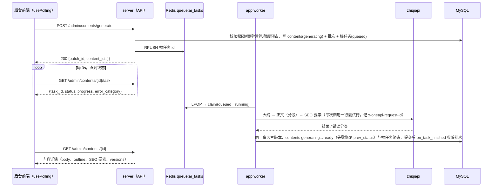

# 04 API 约定

本文档定义 aicreat 后端对外的 HTTP 契约：基址、统一响应、分页、鉴权与权限码、业务码表、全部 `/api/v1/admin/*` 接口表以及关键接口的请求/响应示例，是前后端与 `packages/shared` 类型声明的编码依据。表与字段定义见 [03-data-model](./03-data-model.md)，权限码全表与用户组默认权限见 [07-admin-rbac](./07-admin-rbac.md)，zhiqiapi 错误分类、重试与熔断语义见 [08-zhiqiapi-integration](./08-zhiqiapi-integration.md)，各功能的状态机与调度规则见 [09-generation-pipeline](./09-generation-pipeline.md)、[10-media-generation](./10-media-generation.md)、[11-link-backfill-and-monitoring](./11-link-backfill-and-monitoring.md)、[12-dashboard-reports](./12-dashboard-reports.md)。本文只引用这些定义，不复制。

## 1. 基址与通用约定

| 项 | 约定 |
| --- | --- |
| 基址 | `/api/v1`；全部业务接口在 `/api/v1/admin/*`；另有公开的 `GET /api/v1/health` 与媒体文件 `GET /media/{key}`（非 `/api` 前缀） |
| 开发环境 | API `http://127.0.0.1:8100`；后台 `http://127.0.0.1:5174/admin/`，Vite 代理 `/api`、`/media` → `http://127.0.0.1:8100`；生产由 Nginx 转发 `/api/` → server:8000、`/media/` → server（见 [05-deployment](./05-deployment.md)） |
| 内容类型 | 请求/响应 `application/json; charset=utf-8`；仅 `POST /admin/uploads/image`、`POST /admin/uploads/video`、`POST /admin/keywords/import-file` 为 `multipart/form-data`；CSV 导出为 `text/csv; charset=utf-8`（UTF-8 BOM）；`GET /admin/contents/{id}/export` 按 `format` 返回 `text/markdown` / `text/html` / `application/json` |
| 鉴权头 | `Authorization: Bearer <admin-jwt>`（§4） |
| 请求追踪 | 服务端为每个请求生成 `X-Request-Id`（uuid4 hex）并在响应头回传；写接口的审计日志 `admin_operation_logs.request_id` 记录同一值；前端在错误提示中附带该值用于排障 |
| 上游请求号 | 涉及 zhiqiapi 的对象（`ai_tasks`、`index_checks`、探测结果、对账日志）均携带 `request_id` = 上游响应头 `x-oneapi-request-id`，是与 zhiqiapi 对账/排障的唯一凭据 |
| 时间 | 输入/输出均为 ISO 8601 UTC，如 `2026-10-06T08:00:00Z`；日期型参数（`start_date`、`end_date`、`stat_date`）为 `YYYY-MM-DD`，按 `stats_config.timezone`（默认 `Asia/Shanghai`）切日 |
| 布尔 / 枚举 / 数值 | 布尔用 JSON `true/false`（数据库 `TINYINT(1)`）；枚举为小写 `snake_case` 字符串，取值集合见 [00-overview](./00-overview.md)；额度 `quota_*` 为整数（zhiqiapi 原始额度单位），金额 `cost_cny` 与比率字段为 JSON number（最多 6 位小数） |
| JSON 字段命名 | API 字段 = 列名去掉 `_json` 后缀，值为解码后的对象/数组：`default_templates`、`default_platform_ids`、`fallback_models`、`params`、`raw_pricing`、`raw`（`ai_usage_logs.raw_json`）、`seo_status`、`geo_status`、`tags`、`outline`、`faq`、`seo_keywords`、`reference_asset_ids`、`evidence`、`payload`、`input`、`request_payload`、`response_meta`、`risk_flags`、`generation_params`、`variables`、`output_schema`、`model_params`、`url_patterns`、`deleted_markers`、`redirect_markers`、`fetch_config`、`supported_endpoint_types`、`modalities`、`enable_groups`、`notified_channels`、`extra`；`packages/shared/src/types.ts` 以 API 字段名声明 |
| 主键 / ID | 全部数值 `BIGINT`，JSON 中为整数；路径参数 `{id}` 必须为正整数，否则 400 |
| 语言 | 接口 `message` 固定中文；界面文案由后台 vue-i18n 处理，后端不做本地化。仅 `GET /admin/auth/site-info` 与 `settings` 的 `locale` 参数（`zh-CN` / `en-US` / `*`）用于区分配置行 |
| 幂等与安全 | 写接口以状态校验与唯一键保证重复提交不产生重复对象（§9）；URL 类字段只允许 `http`/`https`；密码、密钥、令牌永不出现在响应与日志中 |

## 2. 统一响应结构

全部接口（含错误）返回同一外壳，由 `app/core/response.py` 的 `ok(data)` / `fail(message, code, data)` / `paginated(items, total, page, page_size)` 生成：

```json
{ "code": 0, "message": "ok", "data": {} }
```

- `code = 0` 表示成功；非 0 为业务码（§5）。`message` 为可直接展示的中文提示，`data` 为补充信息（可为 `null`）。
- HTTP 状态码与业务码的 `http_status` 一致：200 成功、400 参数错误、401 未认证、403 无权限、404 不存在、409 冲突/非法流转、422 语义错误（`4221`/`4222`）、429 频控与额度上限、502 上游失败、503 能力不可用、500 未捕获异常。
- 业务异常统一为 `BusinessError(message, code=400, http_status=400, data=None)`（`app/core/exceptions.py`），由 `register_exception_handlers(app)` 转为上述外壳；Pydantic 校验错误同样转为 `code=400`。`DEV_MODE=true` 时 500 响应的 `data.traceback` 带堆栈，生产为 `null`。
- 无返回体的操作（删除、登出）返回 `{ "code": 0, "message": "ok", "data": null }`；状态流转类动作（`adopt`/`archive`/`approve`/`acknowledge` 等）返回对象最新状态，便于前端就地更新。
- CSV 导出与 `/media/{key}` 直接返回文件流（`Content-Disposition: attachment; filename="<资源>-<YYYYMMDD>.csv"`），不使用该外壳；导出失败（超过 50,000 行、无权限等）仍返回 JSON 外壳。

## 3. 分页

列表接口统一使用查询参数 `page`（从 1 开始，默认 1）与 `page_size`（默认 20，最大 100；超过按 100 处理，非正整数返回 400），由 `app/api/deps.py` 的 `get_pagination` 解析（`schemas/common.py` 的 `PageParams`），返回：

```json
{
  "code": 0,
  "message": "ok",
  "data": { "items": [], "total": 0, "page": 1, "page_size": 20 }
}
```

- 默认排序 `created_at DESC, id DESC`；支持 `sort` 的接口在说明列标注可选字段，并配合 `order=asc|desc`（默认 `desc`）。
- 时间范围参数 `start`/`end`（ISO 8601 UTC）为左闭右开 `start <= t < end`；`published_start`/`published_end` 同理。报表接口的 `start`/`end`/`start_date`/`end_date` 为日期 `YYYY-MM-DD`，两端闭区间。
- 标注「不分页」的接口直接返回数组（如 `GET /admin/ai/models/options`、`GET /admin/platforms`、`GET /admin/ai/routes`）。
- CSV 导出（`GET …/export`）复用同名筛选参数（`ExportParams`：`format=csv` + 该列表的筛选参数），忽略 `page`/`page_size`，最多 50,000 行，超出返回 400 并提示收窄筛选。

## 4. 鉴权与权限码

### 4.1 管理员 JWT

| 项 | 约定 |
| --- | --- |
| 签发 | `POST /admin/auth/login` 成功后签发；`app/core/security.py` 的 `create_token` / `decode_token`，算法 HS256，密钥 `ADMIN_JWT_SECRET`，有效期 `ADMIN_JWT_EXPIRE_SECONDS`（默认 7200，即响应中的 `expires_in`） |
| claims | `sub`（管理员 ID 字符串）、`aud="admin"`、`ver`（签发时的 `admins.token_version`）、`iat`、`exp` |
| 携带 | `Authorization: Bearer <admin-jwt>`；不支持 Cookie 或查询参数 |
| 失效 | 以下任一情况返回 401：令牌缺失/格式错误/签名无效/过期、`aud` 不为 `admin`、`ver != admins.token_version`、管理员 `is_active=0` 或不存在、管理员所属用户组 `is_active=0`（「管理员用户组已停用」，见 [07-admin-rbac](./07-admin-rbac.md) §7.2）。`token_version` 在登出、本人改密、被重置密码、被启用或禁用、被更换用户组时递增（事件表以 [07-admin-rbac](./07-admin-rbac.md) §7.4 为准；只改显示名、修改用户组权限不递增），旧令牌立即失效；无刷新接口，过期后重新登录 |
| 登录保护 | 同一用户名 15 分钟内失败 `ADMIN_LOGIN_MAX_FAILURES=5` 次后锁定（Redis `rate:admin_login:{username}`，TTL 900s），期间返回 429 `data={"retry_after":秒}` |
| 前端 | token 存 Pinia（持久化到 localStorage），axios 拦截器统一注入；收到 401 清空登录态并跳转登录页（登录请求 `POST /admin/auth/login` 本身返回的 401 是账号或密码错误，不视为会话过期，交给登录页展示）；收到 403 保留登录态：`data.permission` 存在（`require_permission` 拒绝）→ 提示「无权执行此操作」并刷新权限，`data` 为 `null`（安全规则拒绝，§4.3）→ 直接展示后端 `message`、不刷新权限 |

### 4.2 权限码与 `require_permission`

- 权限码格式 `module.resource.action`，分两级：`menu` 型 `module.resource.view`（对应后台菜单项与路由 `meta.permission`）与 `action` 型 `module.resource.<action>`（`parent_code` 指向同资源 view）。全部 90 个权限码、系统用户组 `super_admin` / `operator` / `reviewer` / `read_only` 的默认权限见 [07-admin-rbac](./07-admin-rbac.md)。
- 依赖链（`app/api/deps.py`）：`get_db` → `get_current_admin`（解析 JWT，校验令牌 `ver`、管理员 `is_active=1` 与所属用户组 `is_active=1`，任一不满足返回 401，用户组停用为「管理员用户组已停用」，§4.1）→ `require_permission("module.resource.action")`（按数据库用户组授权判断；`super_admin` 拥有全集）。接口表「权限码」列即 `require_permission` 的参数（单一静态码），同时写入 `request.state.permission_code` 供审计中间件记录。
- 「已登录」= 仅 `get_current_admin`；「公开」= 无需令牌，仅 `POST /admin/auth/login`、`GET /admin/auth/site-info`、`GET /api/v1/health`、`GET /media/{key}` 四个。
- 拥有任一 `action` 必须同时拥有同资源 `view`；跨资源依赖（`PERMISSION_DEPENDENCIES`）：`content.keywords.generate` / `content.titles.generate` / `content.contents.generate` 隐含 `content.batches.view`（生成后需轮询批次），`media.images.generate` / `media.videos.generate` 隐含 `media.assets.view`。保存用户组时自动补齐；前端按钮级控制用 `usePermission().has(code)`。
- 导出权限（「只读 = 可看可导」）：列表 CSV 导出沿用该资源 `view`（`content.keywords.view`、`publish.links.view`、`ai.tasks.view`）；内容全文导出 `content.contents.export` 与报表导出 `stats.reports.export` 为独立权限。
- 审计：所有写接口成功后由 `main.py` 审计中间件写入 `admin_operation_logs`（`action` 按「方法 + 路径」映射为 `create` / `update` / `update_status` / `delete` / `execute` / `login` / `logout` / `reset_password`；`target_type` 由路由前缀常量 `AUDIT_TARGET_TYPES` 决定，`target_id` 为路径中最后一个 `{id}` 类参数）；无副作用的 `POST …/preview` 与 `POST /admin/platforms/detect` 设置 `request.state.audit_written=True` 跳过。映射细则见 [07-admin-rbac](./07-admin-rbac.md)。

### 4.3 鉴权错误示例

```json
{ "code": 401, "message": "未登录或令牌已失效", "data": null }
```

```json
{ "code": 403, "message": "无权执行此操作", "data": { "permission": "content.contents.review" } }
```

`require_permission` 拒绝时 `message` 固定为「无权执行此操作」，`data={"permission":"<code>"}`（`<code>` 为该接口绑定的权限码）。安全规则拒绝同样返回 403（`CODE_FORBIDDEN`），`data` 为 `null`，完整清单（以 [07-admin-rbac](./07-admin-rbac.md) §6.5、§10 为准）：禁用自己、禁用最后一个有效超管、将最后一个有效超管移出 `super_admin` 组、修改自己的用户组、删除/停用系统组、停用仍有启用中管理员的自定义组、修改 `super_admin` 组权限、系统组权限清空、删除仍有管理员（含已禁用）的组；登录时密码校验通过后账号已禁用（「账号已禁用」）或所属用户组已停用（「用户组已停用」）同样返回 403、`data` 为 `null`（§7.1）。

## 5. 错误码表

### 5.1 业务码（`app/core/exceptions.py` 常量）

| code | HTTP | 常量 | 含义 / `data` |
| --- | --- | --- | --- |
| 0 | 200 | — | 成功 |
| 400 | 400 | `CODE_BAD_REQUEST` | 参数错误；`data` 为校验错误列表 `[{"loc":["body","count"],"msg":"…","type":"…","input":…}]`（Pydantic 校验与业务校验统一此格式，全站所有 400 均如此，含统计接口的非法指标/维度；各键规则见表后）；唯一例外：请求级 `model?` 覆盖校验失败时 `data={"model":"<model_id>"}` |
| 401 | 401 | `CODE_UNAUTHORIZED` | 未登录 / 令牌失效（§4.1） |
| 403 | 403 | `CODE_FORBIDDEN` | 无权限（`require_permission` 拒绝）：`message`「无权执行此操作」，`data={"permission":"<code>"}`；安全规则拒绝：`data=null`（§4.3） |
| 404 | 404 | `CODE_NOT_FOUND` | 对象不存在，`data` 一般为 `null`；生成接口按缺省链解析模板失败（`resolve_template` 找不到 `published` 模板，见 [03-data-model](./03-data-model.md#b7-projects) B.7）时 `data={"kind":"<prompt_kind>"}` |
| 409 | 409 | `CODE_CONFLICT` | 唯一冲突或非法状态流转：`data={"current_status":…,"existing_id":…}`（字段按场景出现，§5.3） |
| 429 | 429 | `CODE_RATE_LIMITED` | 频控：`data={"retry_after":秒}`（登录锁定、`rate:generate:{admin_id}`、`rate:media:{admin_id}`、`rate:index_check_manual:{admin_id}`） |
| 4221 | 422 | `CODE_TEMPLATE_VARIABLE_MISSING` | Prompt 模板必填变量缺失：`data={"missing":["keyword"]}` |
| 4222 | 422 | `CODE_PUBLIC_URL_REQUIRED` | 参考素材 URL 非公网（真实模式下 Mock 本地存储地址不可用于上游）：`data={"urls":[…]}` |
| 4291 | 429 | `CODE_QUOTA_LIMIT_REACHED` | 本地额度/数量上限：`data={"scope":"daily"\|"project_monthly"\|"daily_images"\|"daily_videos","limit":…,"used":…}`（`daily`/`project_monthly` 的上限为 0 表示不限，不会触发本码） |
| 5021 | 502 | `CODE_UPSTREAM_ERROR` | zhiqiapi 调用失败：`data={"error_category":…,"request_id":…,"model":…,"hint":…}`；`content_blocked` 时 `hint="prompt_blocked"`，请求级模型覆盖失败时 `hint="model_override"`；二者同时成立（覆盖模型的调用被判定为 `content_blocked`）时取 `hint="prompt_blocked"` |
| 5031 | 503 | `CODE_CAPABILITY_UNAVAILABLE` | 能力无可用模型或全局暂停：`data={"capability":…,"breaker_open":[…],"unavailable_models":[…],"paused_reason":"quota_exceeded"\|"auth_failed"\|null}`；请求级 `model?` 覆盖的模型熔断打开时另附 `"hint":"model_override"`（覆盖模型不存在、`is_available=0` 或模态不符在创建时返回 400 `data={"model":…}`，§6.0） |
| 500 | 500 | — | 未捕获异常（`DEV_MODE` 时 `data.traceback`） |

400 校验错误列表的每一项由 `loc`/`msg`/`type`/`input` 四个键组成（唯一例外：密码类字段的错误项不带 `input`，见下；`register_exception_handlers` 对 Pydantic `errors()` 只保留这四个键，`ctx`/`url` 不透出；业务校验抛 `BusinessError` 时按同一结构组装）：

- `loc`：出错位置，首段为请求部位 `body`/`query`/`path`，其后为字段名与数组下标（整数），如 `["body","items",3,"url"]`；无法归属到单个字段的错误只写请求部位，如导出超过 50,000 行为 `["query"]`。
- `msg`：中文说明，前端按 `loc` 显示在对应表单项下。
- `type`：错误类型。Pydantic 内置类型原样返回（如 `missing`、`enum`、`literal_error`、`too_long`、`less_than_equal`、`value_error`）；业务校验使用各接口定义的类型（如统计接口的 `unsupported_metric`/`unsupported_dimension`、路由写入的 `invalid_model`/`model_unavailable`、媒体提示词的 `banned_words`）。
- `input`：被拒绝的输入值。Pydantic 原样带出字段值，但 `type=missing` 与模型级校验（Pydantic 给出的是整个父对象）一律为 `null`；业务校验填对应的值，无对应值时为 `null`；密码类字段（`password`/`old_password`/`new_password`）的错误项不带 `input` 键（转换时剔除，避免回显密码，与 [07-admin-rbac](./07-admin-rbac.md) §6.5 一致）；字符串超过 200 字符时截断。

```json
{ "code": 400, "message": "参数错误", "data": [ { "loc": ["body", "count"], "msg": "不能大于 50", "type": "less_than_equal", "input": 80 } ] }
```

### 5.2 AI 上游失败、熔断与额度场景

`5021.data.error_category` 与 `ai_tasks.error_category` / `media_assets.error_category` / `index_checks.error_category` 为同一集合：`unsupported_parameter`、`route_missing`、`model_unrouted`、`upstream_unavailable`、`rate_limited`、`timeout`、`quota_exceeded`、`auth_failed`、`content_blocked`、`media_storage`、`transfer_failed`、`invalid_response`、`breaker_open`、`cancelled`、`unknown`（判定、重试与候选链切换规则见 [08-zhiqiapi-integration](./08-zhiqiapi-integration.md)）。

异步生成接口（关键词/标题/内容/图片/视频）在**创建任务时**只做本地校验（权限、项目 `active`、频控、全局暂停 `check_paused()`、`resolve_route` 解析候选链并剔除 `is_available=0` 的模型、候选链各模型 `ai:breaker:{capability}:{model}` 状态快照、额度预占 `check_quota`、`model?` 覆盖），不调用上游；上游失败不会以 5021 返回，而是落到根任务 `status=failed` + `error_category`，由轮询接口（§8）呈现。5021 由同步调用上游的路径（`ai_gateway_service.complete_text` / `submit_image` / `submit_video`）抛出，在 worker 内被捕获并写入任务记录；直接把 5021 返回给前端的接口只有三个同步调用上游的管理接口：`POST /admin/media/assets/{id}/retry`（对旧上游任务的同步复查 `poll_task` 遇到 404 以外的 `ZhiqiError`——`auth_failed`/`upstream_unavailable`/`timeout` 等——时不改资产状态、直接返回 5021 并附 `data.error_category`/`request_id`，由操作者稍后再试，避免在上游状态未知时重新提交造成重复计费）、`POST /admin/ai/models/sync`（`GET /v1/models` 或 `GET /api/pricing_new` 拉取失败：不写 `ai_models`、释放 `lock:ai:models_sync` 后返回 5021）、`POST /admin/ai/usage/reconcile`（`GET /api/log/token` 拉取失败：不写 `ai_usage_logs`、释放 `lock:worker:reconcile` 后返回 5021）。探测类接口 `POST /admin/ai/health/probe` 与 `POST /admin/ai/routes/{id}/test` 不抛业务码，上游失败以 `status="down"` + `error_category`/`error_message` 返回（§7.16）。

| 场景 | 返回 | 前端处理 |
| --- | --- | --- |
| 全局暂停中（`ai:paused:quota_exceeded` / `ai:paused:auth_failed` 存在） | 生成类接口 `5031`，`data.paused_reason` 非空 | 提示「AI 调用已暂停：额度不足 / 鉴权失败」，引导到「AI 网关 → 能力路由」页（`/ai/routes`）执行 `reset-breaker` 或充值后探测 |
| 能力路由禁用（`capability_routes.is_enabled=0`）或候选模型全部 `is_available=0` | `5031`，`data.unavailable_models` | 提示到「AI 网关 → 能力路由」页配置候选链 |
| 候选模型全部熔断打开（创建时快照 `breaker_state=open`；`half_open` 视为可用） | `5031`，`data.breaker_open=[模型…]`，不入队；仅部分打开时正常入队，由 worker 按候选链跳过打开的模型（尝试行 `failed(breaker_open)`，不发起 HTTP） | 提示稍后重试或 `reset-breaker` |
| 请求级 `model` 覆盖的模型不可用或失败（不切换备选） | 创建时：模型不存在、`is_available=0` 或模态不符 → 400 `data={"model":…}`（§6.0）；熔断打开 → `5031`，`data.hint="model_override"`；执行期失败 → 根任务 `failed(<分类>)`、未切换备选；异步任务不返回 5021，`error_message` 一律不附 hint 后缀（`data.hint` 只随同步 HTTP 响应返回）；同步路径（探测、收录检测）由调用方捕获 `5021 hint="model_override"` 后写入 `error_category`/`error_message`（同样不附 hint） | 创建时按 400 `data.model` / 5031 `data.hint` 提示更换模型或去掉覆盖；执行期失败时任务摘要的 `model_override`（取根任务 `input.model`，文本与媒体相同，§6.0）非空即识别为使用了覆盖模型、未切换备选，提示更换模型或去掉覆盖（`error_category=content_blocked` 时按「提示词被上游拦截」行处理） |
| 上游额度不足（HTTP 402，或 403 含额度文案） | 任务尝试行 `failed(quota_exceeded)`、根任务回滚 `queued`、告警 `ai_quota_exceeded`，随后新请求 `5031 paused_reason=quota_exceeded` | 同第一行 |
| 本地日 / 项目月额度上限（`generation_config.quota.daily_limit` / `project_monthly_limit`，0 表示不限；`used` 为估算额度累计 `quota:daily:{date}` / `quota:project:{project_id}:{yyyy-mm}`，含本次预占） | `4291`，`scope=daily\|project_monthly` | 提示额度用尽，展示 `limit`/`used` |
| 图片 / 视频日上限（`media_config.daily_limits`） | `4291`，`scope=daily_images\|daily_videos` | 同上 |
| 本地额度达到预警线（`check_quota` 通过但 `used + estimated ≥ limit × generation_config.quota.warn_percent / 100`，默认 80%；上限为 0 表示不限，不预警） | 关键词/标题/内容系列生成接口（§6.9~§6.11）与图片/视频生成接口（`POST /admin/media/images/generate`、`POST /admin/media/videos/generate`，§6.13）正常创建任务，`data` 附可选 `quota_warning:{scope,limit,used,percent}`（`scope` ∈ `daily`\|`project_monthly`）；一次请求最多返回一个 `quota_warning`：`daily` 与 `project_monthly` 同时达到预警线时返回 `percent` 较高者，相同取 `daily`；一次请求创建多个根任务时（图片 `count>1`，标题/内容一次提交多个关键词/标题）按全部根任务预占完成后的累计用量判断 | 生成抽屉 / 媒体工作台顶部显示黄色提示；不阻断、不产生告警 |
| 参数不被上游支持（`unsupported_parameter`） | 文本：同模型参数降级重试后仍失败则切换备选，全部失败任务 `failed(unsupported_parameter)`；图片/视频：不降级，直接按备选链切换 | 任务详情展示 `response_meta.degraded_params`，引导修改参数 |
| 提示词被上游拦截（`content_blocked`） | 任务 `failed(content_blocked)`，不重试、不切换备选；同步路径 `5021 hint="prompt_blocked"` | 提示修改提示词 |
| 频控（`generate_per_admin=60/hour`、`media_per_admin=20/hour`、手动收录检测固定 `30/hour`） | `429 retry_after` | 按秒倒计时禁用按钮 |
| 模板必填变量缺失 | `4221 missing[]` | 定位到模板变量 |
| 参考 URL 非公网（真实模式） | `4222 urls[]` | 提示改用对象存储 / 公网地址 |

### 5.3 409 冲突约定

`409` 的 `data` 固定携带可用上下文，前端按字段决定提示：

| 场景 | `data` |
| --- | --- |
| 非法状态流转（内容 `generating` 时编辑/归档、`reviewing` 时归档、采用标题但关键词未采用等） | `{"current_status":"generating"}` |
| 项目 `archived` 时发起生成、导入、手工新增或回填链接 | `{"current_status":"archived"}` |
| 提审被质量规则阻断（`risk_flags` 含 `banned_word`/`too_short` 时 `submit-review`，状态不变） | `{"current_status":"ready","reason":"quality_blocked","flags":["too_short"]}` |
| 内容编辑版本冲突（`PUT /admin/contents/{id}` 携带的 `current_version_id` 与服务端不一致，不写入） | `{"current_version_id":3302}`（服务端当前版本 ID） |
| 回填链接 `url_hash` 重复 | `{"existing_id":3001}`（已存在链接 ID） |
| 手工新增关键词 `normalized_keyword` 重复 | `{"existing_id":301}`（已存在关键词 ID） |
| 同内容已有同类非终态任务（`content_outline` / `content_seo` / `approved`、`published` 下的 `content_rewrite`） | `{"existing_id":5301}`（根任务 ID） |
| 重试根任务已存在（同一旧根任务只能有一个重试根任务，`POST /admin/ai/tasks/{id}/retry`） | `{"existing_id":5210}`（已存在的重试根任务 ID） |
| 模板归档保护 | `{"current_status":"published","reason":"last_published"}` |
| 媒体 / 收录检测根任务走错重试接口 | `{"hint":"POST /admin/media/assets/{asset_id}/retry"}` / `{"hint":"POST /admin/links/{link_id}/index-check"}` |
| 对 `alive_status=deleted` 或 `is_monitoring=0` 的链接发起 `index-check` | `{"current_status":"deleted"}` / `{"current_status":"<alive_status>","reason":"monitoring_paused"}` |
| 媒体资产非 `failed`/`expired` 时 `retry`、非 `failed(transfer_failed/timeout)` 时 `transfer`、非 `ready`/`failed`/`expired` 时 `DELETE`（含对已 `deleted` 资产重复删除） | `{"current_status":"<media_status>"}` |
| 删除受保护对象（有下游关联的项目/关键词/标题、当前版本、系统平台、被 `pending`/`submitted` 资产的 `reference_asset_ids` 引用的参考素材等；用户组除外：删除系统组或有成员的组返回 403，见 §4.3） | `{"reason":"in_use"}` |

## 6. 接口全表

### 6.0 路由组织与通用规则

- 路由文件 `server/app/api/admin/<资源>.py`，在 `app/api/__init__.py` 以 `admin.include_router(x.router, prefix="/<kebab>")` 挂载到 `/api/v1/admin`；`ai_models.py` / `ai_tasks.py` / `ai_usage.py` / `ai_routes.py` 分别挂载 `/ai/models`、`/ai/tasks`、`/ai/usage`、`/ai`（§6.15）。
- **静态子路径先于 `/{id}` 注册**：`summary` / `export` / `generate` / `import` / `import-file` / `batch` / `batch-status` / `batch-resolve` / `sync` / `options` / `health` / `probe` / `detect` / `overview` / `runtime` / `tree` / `site-info` / `link-checks` / `index-checks` / `run` / `recompute` / `rankings` / `trends` / `breakdown` 必须在同方法的 `/{id}` 之前声明（Starlette 把 `{id}` 匹配为 `[^/]+`，否则静态段被 `{id}` 捕获并因类型校验失败报错——FastAPI 原生返回 422，经 `register_exception_handlers` 统一转为 `code=400`，见 §2）。
- 动作接口一律 `POST /{resource}/{id}/{action}`（对象级）或 `POST /{resource}/{action}`（集合级），动作名 kebab-case；仅 RBAC 沿用 navigation 的 `PATCH /admins/{id}/status` 与 `PUT /admin-groups/{id}/permissions`。
- 「`model?`」：请求级模型覆盖。须存在于 `ai_models` 且 `is_available=1` 且 `modalities` 包含该能力的模态（文本能力 `text`、图片 `image`、视频 `video`），否则 400 `data={"model":…}`；覆盖后候选链固定为该模型、不切换备选；原值记入根任务 `input.model` 与 `ai_tasks.model`（批次任务另记 `generation_batches.input.model`）。前端识别「使用了覆盖模型」统一看任务摘要的 `model_override`（`string|null`，取根任务 `input.model` 即 `ai_tasks.input_json.model`；文本与媒体相同，媒体不看 `params.model`），`GET /admin/generation-batches/{id}` 的 `tasks[]`、`GET /admin/contents/{id}/task`、`GET /admin/media/assets/{id}/task` 均返回该字段。异步任务的 `error_message` 一律不附 hint 后缀：覆盖模型失败靠 `model_override` 非空识别，上游拦截靠 `error_category=content_blocked` 识别；`hint` 只随同步 HTTP 响应返回（创建时覆盖模型熔断打开的 5031、同步调用上游接口的 5021；5021 在 `content_blocked` 与覆盖同时成立时取 `prompt_blocked`，§5.1）。
- 列表接口说明列只写筛选参数，均支持 `page`/`page_size`；表中路径省略 `/api/v1` 前缀；「权限码」列为 `require_permission` 参数。
- 异步任务的轮询入口固定三个：内容类 `GET /admin/contents/{id}/task`、关键词/标题 `GET /admin/generation-batches/{id}`、媒体 `GET /admin/media/assets/{id}/task`（§8）。

### 6.1 auth（`auth.py`，前缀 `/admin/auth`）

| 方法 | 路径 | 权限码 | 说明 |
| --- | --- | --- | --- |
| POST | `/admin/auth/login` | 公开 | `{username,password}` → `{token,expires_in,admin{id,username,display_name,group{id,code,name},permissions[]}}`（§7.1）；失败 5 次/15 分钟锁定返回 429；密码校验通过后账号 `is_active=0` → 403「账号已禁用」，所属用户组 `is_active=0` → 403「用户组已停用」 |
| GET | `/admin/auth/me` | 已登录 | 当前管理员 + 最新权限码 `permissions[]` + `zhiqi_mode`（`mock`/`live`） |
| POST | `/admin/auth/logout` | 已登录 | `token_version += 1`，旧令牌失效；返回 `data=null` |
| POST | `/admin/auth/change-password` | 已登录 | `{old_password,new_password}`；新密码 ≥ 8 位且含字母与数字；成功后 `token_version += 1`，需重新登录 |
| GET | `/admin/auth/site-info` | 公开 | `?locale=zh-CN\|en-US`（默认 `zh-CN`）→ `system_info`（§7.2）供登录页渲染；仅返回该配置键 |

### 6.2 admins（`admins.py`，前缀 `/admin/admins`）

| 方法 | 路径 | 权限码 | 说明 |
| --- | --- | --- | --- |
| GET | `/admin/admins` | `security.admins.view` | 分页；`keyword`（用户名/显示名模糊）/`group_id`/`is_active` |
| POST | `/admin/admins` | `security.admins.create` | `{username,display_name,password,group_id,is_active}`；用户名唯一（重复 409），密码规则同改密 |
| GET | `/admin/admins/{id}` | `security.admins.view` | 详情（含用户组与权限码，不含 `password_hash`） |
| PUT | `/admin/admins/{id}` | `security.admins.update` | `{display_name?,group_id?}`（至少一个）；`group_id` 变化时同事务 `token_version += 1`（该管理员需重新登录；安全规则拒绝时不递增）；不能修改自己的用户组，不能把最后一个有效超管移出 `super_admin` 组（403 `CODE_FORBIDDEN`，`data=null`）；目标组须存在且 `is_active=1`（否则 400） |
| PATCH | `/admin/admins/{id}/status` | `security.admins.status` | `{is_active}`；不能禁用自己 / 最后一个有效超管（403）；启用或禁用都 `token_version += 1`（禁用后 `get_current_admin` 已拒绝，递增保证再次启用时旧令牌仍失效） |
| POST | `/admin/admins/{id}/reset-password` | `security.admins.reset_password` | `{password}`，`token_version += 1` |

### 6.3 admin-groups（`admin_groups.py`，前缀 `/admin/admin-groups`）

| 方法 | 路径 | 权限码 | 说明 |
| --- | --- | --- | --- |
| GET | `/admin/admin-groups` | `security.groups.view` | 不分页；每组含 `admin_count` |
| POST | `/admin/admin-groups` | `security.groups.create` | `{name,description,is_active}`；`code` 由服务端生成 `custom_{uuid4().hex[:12]}`（创建后不可修改），`name_en` 由 `name` 自动生成；`name` 重复 409 `data={"existing_id":…}` |
| GET | `/admin/admin-groups/{id}` | `security.groups.view` | 详情 + `permission_codes[]` |
| PUT | `/admin/admin-groups/{id}` | `security.groups.update` | `{name,description,is_active}`；`name` 重复 409 `data={"existing_id":…}`；系统组不可停用（403）；停用前组内不得有启用中的管理员（403） |
| PUT | `/admin/admin-groups/{id}/permissions` | `security.groups.assign` | `{permission_codes[]}` 覆盖保存；自动补齐同资源 `view` 与跨资源依赖（`PERMISSION_DEPENDENCIES`）；系统组不可清空；`super_admin` 组权限固定为全集，修改返回 403（§4.3，[07-admin-rbac](./07-admin-rbac.md) §6.3）；审计 `action=update` |
| DELETE | `/admin/admin-groups/{id}` | `security.groups.delete` | 仅非系统组且无管理员（含已禁用）；否则 403 `CODE_FORBIDDEN`（`data=null`）；同一事务先删 `admin_group_permissions` 再删组行 |

### 6.4 admin-permissions（`admin_permissions.py`，前缀 `/admin/admin-permissions`）

| 方法 | 路径 | 权限码 | 说明 |
| --- | --- | --- | --- |
| GET | `/admin/admin-permissions` | `security.groups.view` | 不分页；平铺 `[{code,module,name,type,parent_code,sort}]` |
| GET | `/admin/admin-permissions/tree` | `security.groups.view` | 按 `module → menu → action` 的树 |

### 6.5 admin-operation-logs（`operation_logs.py`，前缀 `/admin/admin-operation-logs`）

| 方法 | 路径 | 权限码 | 说明 |
| --- | --- | --- | --- |
| GET | `/admin/admin-operation-logs` | `security.audit.view` | 分页；`admin_id`/`module`（按 `permission_code LIKE '{module}.%'`）/`action`/`target_type`/`start`/`end`；只读，无删除接口 |

### 6.6 settings（`settings.py`，前缀 `/admin/settings`）

| 方法 | 路径 | 权限码 | 说明 |
| --- | --- | --- | --- |
| GET | `/admin/settings` | `system.settings.view` | 全部配置 `[{key,locale,value}]`，与 `DEFAULT_SETTINGS` 深合并；凡引用环境变量的字段（`credential_env`/`site_url_env`/`url_env`）在同级附加 `configured:true\|false`（该环境变量是否非空），永不回显环境变量的值 |
| PUT | `/admin/settings` | `system.settings.update` | `{items:[{key,locale,value}]}` 批量保存，逐 key 按 `schemas/settings.py` 同名模型校验，任一失败整体 400 |
| GET | `/admin/settings/runtime` | 已登录 | 前端表单所需的非敏感运行时子集（缓存 `cache:settings:runtime` 60s），固定字段见 §7.18 |
| GET | `/admin/settings/{key}` | `system.settings.view` | 单键，`?locale=*`（默认 `*`；`system_info` 用 `zh-CN`/`en-US`），与默认值深合并后返回 |
| PUT | `/admin/settings/{key}` | `system.settings.update` | `{locale?,value}`（`locale` 默认 `*`），返回合并后的值；保存后清 `cache:settings:*`（含 `cache:settings:runtime`）；`geo_engines` 启用 `model` 为空的引擎、`seo_providers` 启用 `credential_env` 为空的提供器 → 400（Mock 模式除外，规则见 [11-link-backfill-and-monitoring](./11-link-backfill-and-monitoring.md)）；`ai_routing_config` 下一轮 worker 循环生效 |

### 6.7 projects（`projects.py`，前缀 `/admin/projects`）

| 方法 | 路径 | 权限码 | 说明 |
| --- | --- | --- | --- |
| GET | `/admin/projects` | `content.projects.view` | 分页；`keyword`/`status`/`owner_id`；每项附 `counts{keywords,contents,links}` |
| POST | `/admin/projects` | `content.projects.create` | 创建（§7.3）；`name`/`slug` 唯一（重复 409） |
| GET | `/admin/projects/{id}` | `content.projects.view` | 详情 + `routes[]`（项目级 `capability_routes` 覆盖行） |
| PUT | `/admin/projects/{id}` | `content.projects.update` | 编辑；`default_templates` 键 ∈ `prompt_kind`、值须为该 kind 的 `published` 模板 ID（否则 400）；`default_platform_ids` 须为 `is_active=1` 平台 |
| PUT | `/admin/projects/{id}/routes` | `content.projects.update` | `{routes:[{capability,primary_model,fallback_models[],params?,protocol?}]}` 对 `capability_routes(project_id=id)` upsert：只写 `protocol/primary_model/fallback_models/params`，既有行其余列保留，新行 `timeout_seconds/max_attempts/is_enabled` 从同能力全局行复制；未出现的能力删除覆盖行，空数组删除全部；主/备模型须存在于 `ai_models`、模态匹配且 `is_available=1`（运营侧不允许保存不可用模型，与 `/admin/ai/routes` 不同），否则 400（`loc` 如 `["body","routes",0,"primary_model"]`，`type=invalid_model` / `model_unavailable`）；保存后清 `cache:routes:*` |
| POST | `/admin/projects/{id}/archive` | `content.projects.status` | `active → archived` |
| POST | `/admin/projects/{id}/unarchive` | `content.projects.status` | `archived → active` |
| DELETE | `/admin/projects/{id}` | `content.projects.delete` | 仅 `archived` 且无关键词/标题/内容/链接/素材/批次，否则 409；同事务删除项目专属模板与路由覆盖 |
| GET | `/admin/projects/{id}/overview` | `content.projects.view` | 项目 KPI，返回结构 = `GET /admin/stats/overview?project_id={id}`（§7.14） |

### 6.8 prompt-templates（`prompt_templates.py`，前缀 `/admin/prompt-templates`）

| 方法 | 路径 | 权限码 | 说明 |
| --- | --- | --- | --- |
| GET | `/admin/prompt-templates` | `content.prompt_templates.view` | 分页；`kind`/`status`/`project_id`/`keyword`；默认每个 `code` 只返回最新版本，`?all_versions=1` 返回全部 |
| POST | `/admin/prompt-templates` | `content.prompt_templates.create` | 新建 `draft`（`version=1`）：`{code,kind,name,description?,language,project_id,system_prompt?,user_prompt,variables,output_format,output_schema?,model_params?}`；`capability` 由 `kind` 推导 |
| GET | `/admin/prompt-templates/{id}` | `content.prompt_templates.view` | 详情 |
| PUT | `/admin/prompt-templates/{id}` | `content.prompt_templates.update` | 仅 `draft` 可改；对 `published` 调用则复制为同 code 新版本 `draft` 并返回新对象（`id` 不同） |
| POST | `/admin/prompt-templates/{id}/publish` | `content.prompt_templates.publish` | `draft → published`，同 code 旧 `published → archived` |
| POST | `/admin/prompt-templates/{id}/archive` | `content.prompt_templates.publish` | `published → archived`；同 code 无其它 `published` 且（系统模板或被任一项目 `default_templates` 引用）→ 409 `reason=last_published` |
| POST | `/admin/prompt-templates/{id}/duplicate` | `content.prompt_templates.create` | `{code,name}` 复制为新 code 草稿 |
| POST | `/admin/prompt-templates/{id}/preview` | `content.prompt_templates.view` | `{variables}` → `{system_prompt,user_prompt}` 渲染结果，不调用模型、不记审计；必填变量缺失 4221 |
| GET | `/admin/prompt-templates/{id}/versions` | `content.prompt_templates.view` | 不分页；同 code 全部版本 |
| DELETE | `/admin/prompt-templates/{id}` | `content.prompt_templates.delete` | 仅 `draft` 且非系统模板 |

### 6.9 keywords（`keywords.py`，前缀 `/admin/keywords`）

| 方法 | 路径 | 权限码 | 说明 |
| --- | --- | --- | --- |
| GET | `/admin/keywords` | `content.keywords.view` | 分页；`project_id`（必填）/`status`/`intent`/`keyword_type`/`keyword`/`batch_id`/`sort`（`score`/`created_at`） |
| POST | `/admin/keywords` | `content.keywords.create` | 手工新增 `{project_id,keyword,intent,keyword_type}`；`normalized_keyword` 重复 409 `existing_id`（已存在关键词 ID） |
| POST | `/admin/keywords/generate` | `content.keywords.generate` | `{project_id,seeds[],count,competitors[]?,audience?,template_id?,model?}` → 创建 `generation_batches(kind=keyword)` + 1 个根任务（`operation=keyword_generate`）并入队；返回 `{batch_id,quota_warning?}`（§7.4；`quota_warning` 见 §5.2：一次请求至多一个，`daily`/`project_monthly` 同时达到预警线取 `percent` 较高者、相同取 `daily`，上限为 0 不预警）；全局暂停 5031、频控 429、额度 4291 |
| POST | `/admin/keywords/import` | `content.keywords.import` | JSON `{project_id,items:[{keyword,intent,keyword_type}]}`（`items` ≤ 5,000 条，超出 400）；写入 `source=imported`；与库内或本批次内 `normalized_keyword` 重复的条目计入 `skipped`，非法条目计入 `errors:[{index,keyword,reason}]`（`reason` ∈ `empty`/`too_long`（> 120 字符）/`invalid_intent`/`invalid_keyword_type`），其余写入并计入 `created`；返回 `{created,skipped,errors[]}` |
| POST | `/admin/keywords/import-file` | `content.keywords.import` | multipart `file`（CSV，首行列头 `keyword,intent,keyword_type`，UTF-8（允许 BOM），≤ 2 MB 且 ≤ 5,000 数据行；`intent`/`keyword_type` 留空取默认 `unknown`/`core`）+ 表单字段 `project_id`；返回体同上（`index` 为数据行号，0 起） |
| GET | `/admin/keywords/export` | `content.keywords.view` | CSV（同列表筛选） |
| GET | `/admin/keywords/{id}` | `content.keywords.view` | 详情（含 `title_count`/`content_count`） |
| PUT | `/admin/keywords/{id}` | `content.keywords.update` | `{keyword?,intent?,keyword_type?,difficulty?,heat?,score?,tags?}` |
| POST | `/admin/keywords/{id}/adopt` | `content.keywords.status` | `candidate → adopted` |
| POST | `/admin/keywords/{id}/discard` | `content.keywords.status` | `candidate`/`adopted → discarded`；其 `candidate` 标题同事务置 `discarded` |
| POST | `/admin/keywords/{id}/restore` | `content.keywords.status` | `discarded → candidate` |
| POST | `/admin/keywords/batch-status` | `content.keywords.status` | `{ids[],action:adopt\|discard\|restore}` → `{updated,skipped[]}` |
| DELETE | `/admin/keywords/{id}` | `content.keywords.delete` | 仅无标题/内容关联，否则 409 |

### 6.10 titles（`titles.py`，前缀 `/admin/titles`）

| 方法 | 路径 | 权限码 | 说明 |
| --- | --- | --- | --- |
| GET | `/admin/titles` | `content.titles.view` | 分页；`project_id`/`keyword_id`/`status`/`style`/`batch_id` |
| POST | `/admin/titles` | `content.titles.create` | 手工新增 `{keyword_id,title,style}`（`source=manual`）；同关键词下标题重复时服务端不拦截、不返回 409（前端提交前比对同关键词已有标题并弹窗确认，见 [09-generation-pipeline](./09-generation-pipeline.md) §7.4） |
| POST | `/admin/titles/generate` | `content.titles.generate` | `{project_id,keyword_ids[],count,style,template_id?,model?}` → 批次 `kind=title`（每个关键词一个根任务，`operation=title_generate`、`target_type=keyword`）；返回 `{batch_id,quota_warning?}`（§7.5；`quota_warning` 见 §5.2：按全部关键词根任务预占完成后的累计用量判断，一次请求至多一个，`daily`/`project_monthly` 同时达到预警线取 `percent` 较高者、相同取 `daily`，上限为 0 不预警）；全局暂停 5031 |
| GET | `/admin/titles/{id}` | `content.titles.view` | 详情 |
| PUT | `/admin/titles/{id}` | `content.titles.update` | `{title,style?}`；首次编辑记 `original_title`，`is_edited=true`；标题重复同 `POST /admin/titles`，服务端不拦截 |
| POST | `/admin/titles/{id}/score` | `content.titles.update` | `{manual_score}`（0~10） |
| POST | `/admin/titles/{id}/adopt` | `content.titles.status` | `→ adopted`；要求其关键词为 `adopted`，否则 409 |
| POST | `/admin/titles/{id}/discard` | `content.titles.status` | `→ discarded` |
| POST | `/admin/titles/{id}/restore` | `content.titles.status` | `discarded → candidate` |
| POST | `/admin/titles/batch-status` | `content.titles.status` | `{ids[],action}` 批量 |
| DELETE | `/admin/titles/{id}` | `content.titles.delete` | 仅无内容关联 |

### 6.11 contents（`contents.py`，前缀 `/admin/contents`）

| 方法 | 路径 | 权限码 | 说明 |
| --- | --- | --- | --- |
| GET | `/admin/contents` | `content.contents.view` | 分页；`project_id`/`status`/`keyword_id`/`title_id`/`batch_id`/`keyword`/`created_by`/`has_links`；列表不含 `body` |
| POST | `/admin/contents` | `content.contents.create` | 手工创建草稿 `{project_id,title,title_id?,keyword_id?,format,style,body?}`；带 `body` 时建版本 `source=manual` |
| POST | `/admin/contents/generate` | `content.contents.generate` | `{project_id,title_ids[],template_id?,outline_first,target_word_count,include_faq,include_seo_meta,format,model?}` → 每个标题创建 `contents(status=generating, prev_status=draft)` + 批次 `kind=content`（每篇一个根任务 `operation=content_generate`）；返回 `{batch_id,content_ids[],quota_warning?}`（§7.6；`quota_warning` 见 §5.2：按全部根任务预占完成后的累计用量判断，一次请求至多一个，`daily`/`project_monthly` 同时达到预警线取 `percent` 较高者、相同取 `daily`，上限为 0 不预警） |
| GET | `/admin/contents/{id}` | `content.contents.view` | 详情（含当前版本、`outline`、`summary`、SEO 要素、`assets[]`、`link_count`、`active_task_id`、`pending_tasks[]`） |
| GET | `/admin/contents/{id}/task` | `content.contents.view` | `active_task_id` 对应根任务摘要 `{task_id,operation,status,progress,error_category,error_message,model_override,finished_at}`（`model_override` 取根任务 `input.model`，未覆盖为 `null`，§6.0）；无进行中任务返回最近一个 `content_*` 根任务，从未生成过返回 `data=null` |
| PUT | `/admin/contents/{id}` | `content.contents.update` | 人工编辑 `title`/`body`/`outline`/`summary`/`seo_title`/`seo_description`/`seo_keywords`/`faq` → 新版本 `source=manual`（`content_hash` 未变则 `version_created=false`）；可选 `current_version_id`：与 `contents.current_version_id` 不一致 → 409 `data={"current_version_id":<服务端当前值>}` 且不写入（编辑器保存时固定携带进入页面时的值），不传则不检查；允许 `draft`/`ready`/`rejected`/`approved`/`published`（`generating` 409）；`draft`（有正文）/`rejected → ready`，其它状态不变 |
| POST | `/admin/contents/{id}/generate-outline` | `content.contents.generate` | `{template_id?,model?}` → 根任务 `operation=content_outline` 入队，返回 `{task_id,quota_warning?}`（`quota_warning` 规则见 §5.2）；完成后写 `outline` 并建版本，**不改状态**；`generating` 409；已有非终态同类任务 409 `existing_id` |
| POST | `/admin/contents/{id}/generate-body` | `content.contents.generate` | `{segmented?,template_id?,model?}` → 根任务 `operation=content_body`，返回 `{task_id,quota_warning?}`（`quota_warning` 规则见 §5.2）；允许 `draft`/`ready`/`rejected → generating`（写 `prev_status`） |
| POST | `/admin/contents/{id}/rewrite` | `content.contents.generate` | `{mode:rewrite\|expand\|shorten\|restyle,scope:full\|section,section_index?,style?,instruction?,template_id?,model?}` → 根任务 `operation=content_rewrite`，返回 `{task_id,quota_warning?}`（§7.7；`quota_warning` 规则见 §5.2）；`draft`（有正文）/`ready`/`rejected → generating`；`approved`/`published` 不改状态、只追加版本，已有非终态同类任务 409 |
| POST | `/admin/contents/{id}/generate-seo` | `content.contents.generate` | `{include_faq?,template_id?,model?}` → 根任务 `operation=content_seo`，返回 `{task_id,quota_warning?}`（`quota_warning` 规则见 §5.2）；完成后写 `summary`/`seo_title`/`seo_description`/`seo_keywords`/`faq` 并建版本，**不改状态**；允许状态同 `generate-outline` |
| POST | `/admin/contents/{id}/submit-review` | `content.contents.update` | `ready → reviewing`；`risk_flags` 含 `banned_word`/`too_short` → 409 `data={"current_status":"ready","reason":"quality_blocked","flags":[…]}`（状态不变）；`generation_config.review_required=false` 时直接 `approved`（同事务写 `review_result=approved`、`reviewed_by`=提交人、`reviewed_at=now`、`review_note=auto`） |
| POST | `/admin/contents/{id}/approve` | `content.contents.review` | `reviewing → approved`，`{note?}` |
| POST | `/admin/contents/{id}/reject` | `content.contents.review` | `reviewing → rejected`，`{note}` 必填 |
| POST | `/admin/contents/{id}/archive` | `content.contents.status` | `draft`/`ready`/`rejected`/`approved`/`published → archived`（写 `prev_status`）；`generating`/`reviewing` 409 |
| POST | `/admin/contents/{id}/unarchive` | `content.contents.status` | `archived → prev_status`（`published` 且 `link_count=0` 时 → `approved`） |
| GET | `/admin/contents/{id}/versions` | `content.contents.view` | 不分页；版本列表（不含 `body`，`?with_body=1` 含） |
| GET | `/admin/contents/{id}/versions/{version_id}` | `content.contents.view` | 版本详情 |
| POST | `/admin/contents/{id}/versions/{version_id}/restore` | `content.contents.update` | 以该版本全部版本化字段新建版本 `source=restore`（`restored_from_version_id`）；与当前版本 `content_hash` 相同则 `version_created=false` |
| DELETE | `/admin/contents/{id}/versions/{version_id}` | `content.contents.update` | 物理删除历史版本；当前版本 409；审计 `target_type=content_version`；`version_count` 不回退 |
| GET | `/admin/contents/{id}/assets` | `content.contents.view` | 不分页；绑定素材列表（按 `sort`） |
| POST | `/admin/contents/{id}/assets/{asset_id}/attach` | `content.contents.update` | `{usage_type:cover\|inline,sort}`；`cover` 要求素材 `kind=image` 且 `status=ready`，同时写 `cover_asset_id`；`inline` 要求 `status=ready`，只写资产侧 `content_id/usage_type/sort` |
| POST | `/admin/contents/{id}/assets/{asset_id}/detach` | `content.contents.update` | 解绑（`content_id=NULL`，封面则清空 `cover_asset_id`） |
| GET | `/admin/contents/{id}/links` | `content.contents.view` | 不分页；该内容的回填链接 |
| GET | `/admin/contents/{id}/export` | `content.contents.export` | `?format=md\|html\|json` 下载当前版本 |
| DELETE | `/admin/contents/{id}` | `content.contents.delete` | 仅 `draft`/`archived` 且 `link_count=0`；级联删除版本、解绑素材 |

### 6.12 generation-batches（`generation_batches.py`，前缀 `/admin/generation-batches`）

| 方法 | 路径 | 权限码 | 说明 |
| --- | --- | --- | --- |
| GET | `/admin/generation-batches` | `content.batches.view` | 分页；`project_id`/`kind`/`status`/`created_by` |
| GET | `/admin/generation-batches/{id}` | `content.batches.view` | 批次详情 + `tasks[]`（根任务摘要，每条附尝试行数、最后错误与 `model_override`（取根任务 `input.model`，未覆盖为 `null`，§6.0），§7.4） |
| POST | `/admin/generation-batches/{id}/cancel` | `content.batches.cancel` | `queued`/`running → cancelled`：未开始的根任务置 `cancelled`，运行中的不打断（完成后不写业务对象） |
| POST | `/admin/generation-batches/{id}/retry` | `content.batches.retry` | `partial`/`failed → running`：只为尚无重试根任务的 `failed` 根任务新建根任务（`parent_task_id`）并重新入队，`task_total` 不变、每新建一个同事务 `task_failed −1`；批次不处于 `partial`/`failed` 或无可重试根任务 → 409 `data={"current_status":<批次状态>}`；返回批次 |

### 6.13 media（`media.py`，前缀 `/admin/media`）

| 方法 | 路径 | 权限码 | 说明 |
| --- | --- | --- | --- |
| GET | `/admin/media/assets` | `media.assets.view` | 分页；`project_id`/`content_id`/`kind`/`status`/`usage_type`/`source`/`created_by` |
| GET | `/admin/media/assets/{id}` | `media.assets.view` | 详情（含根任务摘要 `task`（结构同 `GET /admin/media/assets/{id}/task`，含 `model_override`）、`params`、`reference_asset_ids` 与实时计算的引用 `references{cover_of,bound_content_id,referenced_by_asset_ids[{id,status}],count}`；`references` 仅详情返回，列表不计算，§7.8） |
| DELETE | `/admin/media/assets/{id}` | `media.assets.delete` | `ready`/`failed`/`expired → deleted`，删除存储文件，解绑内容（为封面时清空 `contents.cover_asset_id`）；其它状态（`pending`/`submitted`/`generating`/`downloading`，以及对已 `deleted` 资产重复删除）409 `current_status`；`usage_type=reference` 的上传素材被任一 `pending`/`submitted` 资产的 `reference_asset_ids` 引用时 409 `data={"reason":"in_use"}`（其它引用只在前端确认框按 `references` 提示） |
| POST | `/admin/media/assets/{id}/retry` | `media.assets.retry` | `failed`/`expired` 资产重试（其它状态 409 `current_status`）：`upstream_task_id` 非空且资产为 `expired` 或 `failed(timeout)` 时先同步复查旧上游任务（已 `succeeded` → 直接转存；仍 `queued`/`in_progress` → 新根任务以 `polling` 继续；上游 `failed`/`expired`/404 → `pending` 重新提交；复查遇其它 `ZhiqiError` → 5021、不改状态，§5.2）；其余情况直接 `pending` 重新提交；返回 `{asset,task_id,resumed}` |
| POST | `/admin/media/assets/{id}/transfer` | `media.assets.retry` | `failed(transfer_failed/timeout)` 且 `upstream_url` 非空 → `downloading`，`transfer_attempts` 清零重新转存；返回 `{asset}` |
| GET | `/admin/media/assets/{id}/task` | `media.assets.view` | 关联根任务状态 `{task_id,operation,status,progress,error_category,error_message,model_override,finished_at}`（备选回退后自动指向新根任务；`model_override` 取根任务 `input.model`，未覆盖为 `null`，媒体同样不看 `params.model`，§6.0） |
| POST | `/admin/media/images/generate` | `media.images.generate` | `{project_id,content_id?,usage_type,prompt?,count(1~4),resolution,aspect_ratio,reference_image_urls[]?,model?,from_content_prompt?}` → 每张一条 `media_assets(pending)` + 根任务 `operation=image_generate`；返回 `{asset_ids[],task_ids[],quota_warning?}`（§7.8；`quota_warning` 见 §5.2：`count>1` 时按全部根任务预占完成后的累计用量判断，一次请求至多一个，`daily`/`project_monthly` 同时达到预警线取 `percent` 较高者、相同取 `daily`，上限为 0 不预警）；`from_content_prompt=true` 须带 `content_id` 且 `prompt` 可省略，否则 `prompt` 必填；真实模式参考 URL 非公网 4222；日上限 4291；全局暂停 5031 |
| POST | `/admin/media/videos/generate` | `media.videos.generate` | `{project_id,content_id?,usage_type,prompt,duration,resolution,aspect_ratio?,size?,input_reference?,reference_image_urls[]?,reference_video_urls[]?,reference_audio_urls[]?,first_frame_image_url?,last_frame_image_url?,negative_prompt?,generate_audio,model?}` → 一条 `media_assets` + 根任务 `operation=video_generate`；返回 `{asset_id,task_id,quota_warning?}`（§7.9；`quota_warning` 见 §5.2：一次请求至多一个，`daily`/`project_monthly` 同时达到预警线取 `percent` 较高者、相同取 `daily`，上限为 0 不预警）；校验同上，但 `usage_type` 只允许 `inline`/`standalone`（视频不能作封面） |

### 6.14 uploads（`uploads.py`，前缀 `/admin/uploads`）

| 方法 | 路径 | 权限码 | 说明 |
| --- | --- | --- | --- |
| POST | `/admin/uploads/image` | `system.upload.create` | multipart `file`；jpg/png/webp/gif ≤ `MAX_IMAGE_SIZE_MB`（默认 10）；落 `media_assets(kind=image,source=uploaded,usage_type=reference,status=ready)`，返回 `{asset_id,url,public}`（`public=false` 表示 URL 非公网，真实 zhiqiapi 图生图不可用） |
| POST | `/admin/uploads/video` | `system.upload.create` | multipart `file`；mp4/mov ≤ `MAX_VIDEO_SIZE_MB`（默认 200）；同上 `kind=video` |

### 6.15 ai（`ai_models.py` → `/ai/models`，`ai_routes.py` → `/ai`，`ai_tasks.py` → `/ai/tasks`，`ai_usage.py` → `/ai/usage`）

| 方法 | 路径 | 权限码 | 说明 |
| --- | --- | --- | --- |
| GET | `/admin/ai/models` | `ai.models.view` | 分页；`modality`（`text`/`image`/`video`）/`vendor_id`/`is_available`/`keyword`；含价格快照与健康状态；默认隐藏 `is_available=0 AND last_seen_at < now − catalog.hide_unavailable_after_days 天` 的模型（`?include_hidden=1` 可见） |
| GET | `/admin/ai/models/options` | `ai.models.view` | 不分页；`?modality=text\|image\|video&is_available=1`（默认只返回可用模型）→ `[{model_id,vendor_name,modalities,is_available,last_health_status,quota_type}]`，缓存 60s；供 `ModelSelect.vue` 与各配置页 |
| GET | `/admin/ai/models/{id}` | `ai.models.view` | 详情（含 `raw_pricing`） |
| POST | `/admin/ai/models/sync` | `ai.models.sync` | 立即同步 `/v1/models` + `/api/pricing_new`（锁 `lock:ai:models_sync`，占用中 409）；返回 `{total,added,updated,unavailable,synced_at,request_ids{models,pricing}}`（§7.15） |
| GET | `/admin/ai/routes` | `ai.routes.view` | 不分页；全部路由（`?project_id=` 含项目覆盖），每条附 `breaker_state`、`breaker_reason` 与主/备模型 `health`、`is_available` |
| POST | `/admin/ai/routes` | `ai.routes.create` | 新建项目覆盖路由 `{capability,project_id,protocol,primary_model,fallback_models[],params,timeout_seconds,max_attempts,is_enabled,note}`（`project_id>0`；同能力同项目已存在 409）；主/备模型须存在于 `ai_models` 且 `modalities` 含该能力的模态，否则 400（`loc` 为 `["body","primary_model"]` 或 `["body","fallback_models",<下标>]`，`type=invalid_model`）；`is_available=0` 的模型**允许保存**（上游模型可能临时下架后恢复，运行期 `resolve_route` 跳过不可用候选）；返回路由对象（结构同 `GET /admin/ai/routes/{id}`）并附 `warnings[]`：每个 `is_available=0` 的主/备模型一项，结构同 §5.1 校验错误项，如 `{"loc":["body","fallback_models",0],"msg":"模型当前不可用，运行期将被跳过","type":"model_unavailable","input":"<model_id>"}`，无警告时为 `[]`；保存后清 `cache:routes:*` |
| GET | `/admin/ai/routes/{id}` | `ai.routes.view` | 详情 |
| PUT | `/admin/ai/routes/{id}` | `ai.routes.update` | 可改 `protocol`/`primary_model`/`fallback_models`/`params`/`timeout_seconds`/`max_attempts`/`is_enabled`/`note`；`capability`/`project_id` 不可改；模型校验、`is_available=0` 允许保存及返回的 `warnings[]` 同 `POST /admin/ai/routes`；保存后清 `cache:routes:*` |
| DELETE | `/admin/ai/routes/{id}` | `ai.routes.delete` | 仅 `project_id > 0`（全局路由 409） |
| POST | `/admin/ai/routes/{id}/test` | `ai.routes.test` | `{probe_media?:false}` 一键测试：对主模型与每个备选模型各发一次最小探测 → `[{model,status,latency_ms,request_id,error_category}]`（image/video 仅 `probe_media=true` 时真实提交） |
| POST | `/admin/ai/routes/{id}/reset-breaker` | `ai.routes.reset_breaker` | 清除该路由主/备模型熔断状态（自动解决对应 `ai_breaker_open` 告警），并删除 `ai:paused:*`；返回 `{reset_models[],paused_cleared}` |
| GET | `/admin/ai/health` | `ai.routes.view` | 健康快照 `{zhiqi_mode,base_url,paused{quota_exceeded,auth_failed},models[],workers[]}`（§7.16） |
| POST | `/admin/ai/health/probe` | `ai.routes.test` | `{capability,model,protocol?,probe_media?:false}` 单模型探测 → `HealthResult`（§7.16）；`image`/`video` 只在 `probe_media=true` 时真实提交，否则只校验模型存在于目录 |
| GET | `/admin/ai/tasks` | `ai.tasks.view` | 分页；`row_kind`（`root` 默认 / `attempt` / `all`）/`project_id`/`capability`/`operation`/`model`/`status`/`error_category`/`trigger_type`/`batch_id`/`root_task_id`/`target_type`/`target_id`/`request_id`/`start`/`end` |
| GET | `/admin/ai/tasks/export` | `ai.tasks.view` | CSV（同列表筛选，默认 `row_kind=attempt`；含脱敏请求摘要、`request_id`、tokens、额度、成本） |
| GET | `/admin/ai/tasks/{id}` | `ai.tasks.view` | 详情（含 `input`、脱敏 `request_payload`、`response_meta`（媒体根任务含 `poll` 与 `download`，§7.17）、对账信息；根任务附 `attempts[]`） |
| POST | `/admin/ai/tasks/{id}/retry` | `ai.tasks.retry` | 仅根任务 `failed`/`expired` 且文本能力、`target_type ∈ {generation_batch,keyword,content}`、`trigger_type != health_probe`、`operation ∉ {seo_check,geo_check,route_probe,image_prompt}` → 新建根任务重新入队（有批次时同事务 `task_failed −1` 并把批次置回 `running`，`task_total` 不变），返回 `{task_id}`；该根任务已有重试根任务（存在 `parent_task_id` = 该根任务的行）→ 409 `data={"existing_id":<重试根任务 ID>}`；媒体根任务 409 `hint`、收录检测根任务 409 `hint`、探测任务 409 |
| POST | `/admin/ai/tasks/{id}/cancel` | `ai.tasks.cancel` | 根任务 `queued`/`polling → cancelled`（`polling` 不调用上游取消）；媒体根任务同事务把资产置 `failed(cancelled)`；内容任务恢复 `prev_status`；同步执行的根任务（`seo_check`/`geo_check`/`route_probe`/`image_prompt`）409 |
| GET | `/admin/ai/usage/logs` | `ai.usage.view` | 分页 `ai_usage_logs`；`model_name`/`log_type`/`matched`（`true`：`ai_task_id` 非空）/`request_id`/`start`/`end` |
| POST | `/admin/ai/usage/reconcile` | `ai.usage.reconcile` | 立即拉取 `/api/log/token` 对账（锁 `lock:worker:reconcile`，占用中 409；Mock 模式同样执行）→ `{pulled,new,matched,unmatched,window_overflow,request_ids[]}` |
| GET | `/admin/ai/usage/summary` | `ai.usage.view` | `?group_by=model\|capability\|project\|day&start&end`（`start`/`end` 为日期 `YYYY-MM-DD`，闭区间，按 `stats_config.timezone` 切日，跨度 ≤ 366 天，省略时为最近 30 天）→ `[{key,calls,prompt_tokens,completion_tokens,quota_estimated,quota_actual,cost_cny,reconciled_rate}]`（按终态尝试行，`trigger_type != health_probe`；`reconciled_rate = reconciled_at 非空的尝试行数 / calls`） |

### 6.16 platforms（`platforms.py`，前缀 `/admin/platforms`）

| 方法 | 路径 | 权限码 | 说明 |
| --- | --- | --- | --- |
| GET | `/admin/platforms` | `publish.platforms.view` | 不分页；`?is_active=`；每项含 `link_count` |
| POST | `/admin/platforms` | `publish.platforms.create` | `{code,name,name_en,icon?,home_url?,url_patterns,deleted_markers,redirect_markers,fetch_config,is_active,sort}`；`code` 唯一 |
| GET | `/admin/platforms/{id}` | `publish.platforms.view` | 详情（含规则 JSON） |
| PUT | `/admin/platforms/{id}` | `publish.platforms.update` | 编辑规则/状态；`fetch_config.headers` 拒绝 `cookie`/`authorization`/`proxy-authorization`，只允许 `Accept-Language`/`Referer`/`X-*`（否则 400） |
| DELETE | `/admin/platforms/{id}` | `publish.platforms.delete` | 非系统平台且无链接 |
| POST | `/admin/platforms/{id}/test` | `publish.platforms.test` | `{url}` 实时抓取一次并返回规则判定（不写库，计入 `limit:link_checks:{date}`）→ `{result_status,matched_rule,http_status,final_url,redirect_count,title,duration_ms,evidence}`（`evidence` 与 `link_checks.evidence` 同构：`marker`/`context`/`redirects`/`headers` 及补充键 `title`/`text_excerpt`/`short_text`，§7.12） |
| POST | `/admin/platforms/detect` | `publish.platforms.view` | `{url}` → 按 `url_patterns` 识别平台 `{platform_id,code}`（未命中返回 `website`）；不记审计 |

### 6.17 links（`links.py`，前缀 `/admin/links`）

| 方法 | 路径 | 权限码 | 说明 |
| --- | --- | --- | --- |
| GET | `/admin/links` | `publish.links.view` | 分页；`project_id`/`content_id`/`platform_id`/`alive_status`/`seo_indexed_any`/`geo_cited_any`/`is_monitoring`/`keyword`（URL/标题模糊）/`published_start`/`published_end` |
| POST | `/admin/links` | `publish.links.create` | 回填 `{content_id,platform_id?,url,publish_account?,published_at?,note?}`（§7.10）；URL 预校验失败 400；`published_at` 缺省取当前时间，不得晚于当前时间 + 5 分钟、不得早于当前时间 − 3650 天（否则 400，`loc=["body","published_at"]`），允许早于内容 `created_at`（登记历史文章、补录）；`url_hash` 重复 409 `existing_id`；内容须 `approved`/`published`（否则 409 `current_status`）；平台缺省自动识别；入队基线检测；返回 `{link,queued}` |
| GET | `/admin/links/export` | `publish.links.view` | CSV（同列表筛选；含按引擎收录状态与最近检测） |
| POST | `/admin/links/batch` | `publish.links.create` | `{items:[{content_id,platform_id?,url,publish_account?,published_at?,note?}]}` 批量回填（`items` ≤ 100 条，超出 400；逐条按单条规则校验（含 `published_at` 范围），逐条独立事务，整体 200）→ `{created,failed,results[{index,ok,link_id,queued,code,message}]}` |
| GET | `/admin/links/{id}` | `publish.links.view` | 详情（含 `platform`、`content` 摘要、基线、按引擎收录状态与 `checked_at`、`last_check`） |
| PUT | `/admin/links/{id}` | `publish.links.update` | `{platform_id?,publish_account?,published_at?,note?}`；`published_at` 范围校验同 `POST /admin/links`（允许早于内容 `created_at`）；URL 不可改（改 URL 需删后重填）；改 `published_at` 重算 `next_index_check_at` 与 `contents.first_published_at` |
| DELETE | `/admin/links/{id}` | `publish.links.delete` | 删除（级联 `link_checks`/`index_checks`）；同事务更新 `contents.link_count`、重算 `first_published_at`，`published` 且链接归零回到 `approved` |
| POST | `/admin/links/{id}/check` | `publish.links.check` | 立即删除检测：`enqueue_check(link, "manual", admin_id)` 插队；返回 `{queued:true}` 或 `{queued:false,reason:"already_queued"}`；只计入 `limit:link_checks:{date}`、不受 `link_check.daily_limit` 拦截，因此不返回 `daily_limit`（`rebaseline` 同） |
| POST | `/admin/links/{id}/index-check` | `publish.links.check` | `{kinds:[seo,geo],engines?[]}` 立即收录检测（`check_type=manual`）；返回 `{queued:true}` / `{queued:false,reason:"already_queued"\|"daily_limit"}`；传入未启用引擎 400；`alive_status=deleted` 或 `is_monitoring=0` 时 409（§5.3）；频控 `30/hour` |
| POST | `/admin/links/{id}/rebaseline` | `publish.links.check` | 清空基线（`baseline_*`）并入队 `manual` 检测；下次 200 重建基线并写 `alive` |
| POST | `/admin/links/{id}/mark-index` | `publish.links.mark` | `{kind,engine,status,note?,evidence_url?}` 人工标记：`status` 须与 `kind` 对应——`kind=seo` 时只能是 `indexed`/`not_indexed`，`kind=geo` 时只能是 `cited`/`not_cited`，传 `unknown` 或与 `kind` 不符 → 400（§5.1 校验错误列表，`loc=["body","status"]`）；写 `index_checks(provider=manual, check_type=manual, match_mode=manual)` 并回写引擎状态；不改排程计数 |
| POST | `/admin/links/{id}/pause` | `publish.links.update` | `is_monitoring=0`，`next_check_at`/`next_index_check_at` 置 `null` |
| POST | `/admin/links/{id}/resume` | `publish.links.update` | `is_monitoring=1` 并重算 `next_check_at`/`next_index_check_at` |
| GET | `/admin/links/{id}/checks` | `publish.links.view` | 删除检测历史（分页，按 `checked_at` 倒序） |
| GET | `/admin/links/{id}/index-checks` | `publish.links.view` | 收录检测历史（分页；`kind`/`engine`） |

### 6.18 monitoring（`monitoring.py`，前缀 `/admin/monitoring`）

| 方法 | 路径 | 权限码 | 说明 |
| --- | --- | --- | --- |
| GET | `/admin/monitoring/overview` | `monitoring.link_checks.view` | `{link_checks{due,queued,today,last_run_at},index_checks{due,queued,today,last_run_at},workers[{name:"monitor_worker",hostname,pid,heartbeat_at,alive}],daily_limits{link_checks{limit,used},index_checks{limit,used}}}`；`due` = `is_monitoring=1 AND next_check_at / next_index_check_at <= now` 的链接数，`queued` = `LLEN queue:link_checks` / `LLEN queue:index_checks`，`today` = 今日检测记录数、`used` 读 `limit:link_checks:{date}` / `limit:index_checks:{date}`（均按 `stats_config.timezone` 切日），`last_run_at` = 最近一条检测记录的 `checked_at` |
| GET | `/admin/monitoring/link-checks` | `monitoring.link_checks.view` | 全部删除检测记录分页；`project_id`/`platform_id`/`result_status`/`check_type`/`link_id`/`start`/`end`；每条附 `link{id,url,platform_code}` |
| GET | `/admin/monitoring/link-checks/{id}` | `monitoring.link_checks.view` | 单条（含 `evidence`） |
| GET | `/admin/monitoring/index-checks` | `monitoring.index_checks.view` | 收录检测记录分页；`kind`/`engine`/`provider`/`result_status`/`project_id`/`platform_id`/`link_id`/`start`/`end` |
| GET | `/admin/monitoring/index-checks/{id}` | `monitoring.index_checks.view` | 单条（含 `evidence`） |
| POST | `/admin/monitoring/link-checks/run` | `monitoring.link_checks.run` | `{project_id?,platform_id?,link_ids?[],only_due:true}` 批量入队 `manual` 检测 → `{enqueued,skipped}`（已在队列 / 超出 `link_check.daily_limit` 计入 `skipped`） |
| POST | `/admin/monitoring/index-checks/run` | `monitoring.index_checks.run` | `{kinds:[seo,geo],engines?[],project_id?,platform_id?,link_ids?[],only_due:true}` 批量入队 `manual` 收录检测 → `{enqueued,skipped}`；入队前逐链接按引擎数预扣 `limit:index_checks:{date}` |

### 6.19 alerts（`alerts.py`，前缀 `/admin/alerts`）

| 方法 | 路径 | 权限码 | 说明 |
| --- | --- | --- | --- |
| GET | `/admin/alerts` | `monitoring.alerts.view` | 分页；`status`/`severity`/`alert_type`/`project_id`/`target_type`/`target_id`/`start`/`end`（按 `last_triggered_at` 倒序，§7.13）；按对象筛选时 `target_type` 与 `target_id` 同用，如链接详情时间线取 `target_type=publish_link&target_id={id}`（[11-link-backfill-and-monitoring](./11-link-backfill-and-monitoring.md) §11.3）；`target_id` 只匹配数值目标，`ai_model`/`worker`/`system` 类告警的 `target_id` 为 `null`，只按 `target_type` 筛选 |
| GET | `/admin/alerts/summary` | `monitoring.alerts.view` | `{open{info,warning,critical},acknowledged{info,warning,critical},today_opened,today_resolved}`（`today_*` 按 `stats_config.timezone` 切日：`first_triggered_at` / `resolved_at` 落在今日）；前端铃铛 60s 轮询，仅在拥有 `monitoring.alerts.view` 时启动 |
| GET | `/admin/alerts/{id}` | `monitoring.alerts.view` | 详情（含 `payload`） |
| POST | `/admin/alerts/{id}/acknowledge` | `monitoring.alerts.handle` | `open → acknowledged` |
| POST | `/admin/alerts/{id}/resolve` | `monitoring.alerts.handle` | `open`/`acknowledged → resolved`，`{note?}` |
| POST | `/admin/alerts/{id}/ignore` | `monitoring.alerts.handle` | `open`/`acknowledged → ignored` |
| POST | `/admin/alerts/batch-resolve` | `monitoring.alerts.handle` | `{ids[],note?}` → `{updated,skipped[]}`（终态告警计入 `skipped`） |

### 6.20 stats（`stats.py`，前缀 `/admin/stats`）

| 方法 | 路径 | 权限码 | 说明 |
| --- | --- | --- | --- |
| GET | `/admin/stats/overview` | `dashboard.view` | `?project_id=0&range=today\|7d\|30d`（默认 `7d`）→ `{meta,kpis,compare,breakdowns,series}`（§7.14；指标定义见 [12-dashboard-reports](./12-dashboard-reports.md)）；`time_to_index_hours_avg`/`time_to_index_hours_p50` 不计入补录延迟 `publish_links.created_at − published_at` > 72 小时（`stats_service.MAX_BACKFILL_DELAY_HOURS`）的历史补录链接（首次收录时间不可观测，仍计入收录率等其它指标，口径以 12 为准）；今日无 `daily_stats` 行时用 Redis 实时计数兜底（`meta.today_source`）；缓存 `overview_cache_seconds`（60s） |
| GET | `/admin/stats/trends` | `stats.reports.view` | `?metrics=ai_calls,cost_cny,…&granularity=day\|week\|month&start&end&project_id&dimension&dimension_key` → `[{date,<metric>:value…}]`；`metrics` 逗号分隔 1~8 个，取值集合见 §7.14（比率指标自动附带的分子分母列不计入上限；未知名称 → 400 `data=[{"loc":["query","metrics"],"msg":"不支持的指标","type":"unsupported_metric","input":["foo"]}]`，超过 8 个 → 400 `type=value_error`、`input` 为请求的指标数组）；`start`/`end` 必填（`YYYY-MM-DD`，闭区间，`start <= end`），跨度 ≤ 731 天；`granularity` 默认 `day`；`dimension` ∈ `total`/`platform`/`capability`/`model`/`admin`/`seo_engine`/`geo_engine`（`stats_dimension`，默认 `total`；按项目看趋势用 `project_id` 筛选，`project` 不是趋势维度），非 `total` 时 `dimension_key` 必填（平台 code / 能力 / 模型 ID / 管理员 ID 字符串 / 引擎 code，即 `daily_stats.dimension_key`），且 `metrics` 须全部属于该维度的矩阵列或由其派生（否则 400 `data=[{"loc":["query","dimension"],"msg":"该指标不支持此维度","type":"unsupported_dimension","input":{"metric":…,"dimension":…}}]`，每个不匹配的指标一项）；无行的周期不省略（流量列 0、比率 `null`、快照列沿用上一周期的值） |
| GET | `/admin/stats/breakdown` | `stats.reports.view` | `?dimension=project\|platform\|admin\|model\|capability\|seo_engine\|geo_engine&metric=…&start&end&project_id` → `[{key,label,value,share,values}]`；`metric` 逗号分隔 1~8 个，第一个为主指标（`value`、`share` 与排序依据），`values` 含全部请求指标；`start`/`end` 必填，规则同 `trends`；`dimension=project` 时取 `daily_stats.dimension='total'` 的行按 `project_id` 分组（排除 `project_id=0` 汇总行，忽略 `project_id` 参数），`metric` 可为 `total` 行的任一列及其派生指标；其它维度取同名维度行，`metric` 须为该维度在「维度 × 列矩阵」中填写的列（见 [03-data-model](./03-data-model.md) `daily_stats`、[12-dashboard-reports](./12-dashboard-reports.md) §4.2）或由这些列派生的指标（12 §3.2，如 `ai_success_rate`、`tokens_total`、`quota_diff`、`task_success_rate`），否则 400（`loc=["query","dimension"]`、`type=unsupported_dimension`、`input={"metric":…,"dimension":…}`；未知指标 `loc=["query","metric"]`、`type=unsupported_metric`，超过 8 个 `type=value_error`，列表格式同 `trends`）；流量列按区间求和，快照列取 `end` 当日；`share = value / Σ value`（Σ 为 0 或主指标为比率时 `null`）；按 `value` 降序、`key` 升序，返回范围内存在聚合行的全部键（含 `value=0`） |
| GET | `/admin/stats/rankings` | `stats.reports.view` | `?type=fastest_indexed\|most_deleted_platforms\|top_cost_models\|top_cost_projects\|top_failed_models&limit=10&start&end&project_id`；`start`/`end` 必填（同 `trends`）；`limit` 默认 `stats_config.rankings_limit`（10），最大 100；`top_cost_projects` 忽略 `project_id`；`fastest_indexed` 排除补录延迟 `publish_links.created_at − published_at` > 72 小时（`stats_service.MAX_BACKFILL_DELAY_HOURS`）的历史补录链接（口径以 12 为准）；行结构见 §7.14 |
| GET | `/admin/stats/export` | `stats.reports.export` | `?report=trends\|breakdown\|rankings&…`（其余参数同对应接口）CSV |
| POST | `/admin/stats/recompute` | `stats.reports.recompute` | `{start_date,end_date}`（≤ 31 天）：跨度 ≤ 7 天在 API 进程内逐日执行，返回 200 `{days,rows_upserted,skipped[],duration_ms}`；> 7 天写入 `queue:stats_recompute` 异步执行，返回 202 `{queued:true,days}`；前端对该接口设 300s 超时 |

上表统计接口（`overview`/`trends`/`breakdown`/`rankings`/`export`/`recompute`）的 400 一律为 §5.1 校验错误列表：枚举参数（`range`/`granularity`/`dimension`/`type`/`report`）取值非法、日期格式错误、`start > end`、跨度超限、`dimension_key` 缺失均按字段给出 `loc`；非法指标/维度的 `type` 为 `unsupported_metric`/`unsupported_dimension`，其余业务校验为 `value_error`（示例见 §7.14，逐项场景见 [12-dashboard-reports](./12-dashboard-reports.md) §9.8）。

### 6.21 health 与媒体文件（`health.py`，无前缀；`main.py` 静态路由）

| 方法 | 路径 | 权限码 | 说明 |
| --- | --- | --- | --- |
| GET | `/api/v1/health` | 公开 | `{status:"ok"\|"degraded",db,redis,zhiqi_mode,workers{worker{alive,replicas,heartbeat_at},monitor_worker{…}},warnings[],version}`（`version` = `server/pyproject.toml` 的 `project.version`）；db/redis 不可用 → HTTP 503，worker 不活跃仅 `degraded`（§7.16） |
| GET | `/media/{key}` | 公开 | 本地存储文件（`STORAGE_MODE=local`）；`oss` 模式回源对象存储；`key` 为 `media_assets.storage_key`，不允许 `..` 等路径穿越（400） |

## 7. 关键接口示例

示例省略响应中的 `"message": "ok"`；时间均为 UTC；`<admin-jwt>` 为 §4.1 的令牌。对象字段与 [03-data-model](./03-data-model.md) 的列一一对应（`_json` 列按 §1 规则命名）。

### 7.1 登录与当前管理员

```http
POST /api/v1/admin/auth/login
Content-Type: application/json
```

```json
{ "username": "admin", "password": "admin123" }
```

```json
{
  "code": 0,
  "data": {
    "token": "<admin-jwt>",
    "expires_in": 7200,
    "admin": {
      "id": 1,
      "username": "admin",
      "display_name": "超级管理员",
      "group": { "id": 1, "code": "super_admin", "name": "超级管理员" },
      "permissions": ["dashboard.view", "content.projects.view", "content.projects.create", "…"]
    }
  }
}
```

- 失败：`{ "code": 401, "message": "用户名或密码错误", "data": null }`。
- 锁定：`{ "code": 429, "message": "登录失败次数过多，请稍后再试", "data": { "retry_after": 900 } }`。
- 停用：密码校验通过后才判定账号与用户组状态（处理顺序以 [07-admin-rbac](./07-admin-rbac.md) §6.1 为准，不写审计）——账号 `is_active=0` → `{ "code": 403, "message": "账号已禁用", "data": null }`；所属用户组 `is_active=0` → `{ "code": 403, "message": "用户组已停用", "data": null }`。
- 默认账号 `admin/admin123` 由 `server/seeds/seed.py` 写入（`SEED_ADMIN_USERNAME`/`SEED_ADMIN_PASSWORD`），仅限开发环境。

```http
GET /api/v1/admin/auth/me
Authorization: Bearer <admin-jwt>
```

```json
{
  "code": 0,
  "data": {
    "id": 1, "username": "admin", "display_name": "超级管理员",
    "group": { "id": 1, "code": "super_admin", "name": "超级管理员" },
    "permissions": ["dashboard.view", "…"],
    "last_login_at": "2026-10-06T01:00:00Z",
    "zhiqi_mode": "mock"
  }
}
```

前端用 `permissions[]` 初始化 `usePermission()`，`zhiqi_mode` 用于在布局顶栏显示「Mock 模式」标记。

### 7.2 站点信息（`system_info`）

```http
GET /api/v1/admin/auth/site-info?locale=zh-CN
```

```json
{
  "code": 0,
  "data": { "site_name": "aicreat 内容生成平台", "logo_url": "", "footer": "", "support_contact": "" }
}
```

`data` 即 `settings` 表 `key='system_info'` 对应 `locale` 行的 JSON（`zh-CN` / `en-US` 各一行，缺失时回退 `zh-CN`），结构固定为 `{site_name,logo_url,footer,support_contact}`；通过 `PUT /admin/settings/system_info` `{ "locale": "en-US", "value": { … } }` 维护。

### 7.3 创建项目

```http
POST /api/v1/admin/projects
Authorization: Bearer <admin-jwt>
```

```json
{
  "name": "智能家居选购指南",
  "slug": "smart-home",
  "industry": "智能家居",
  "audience": "25~40 岁首次装修的城市家庭",
  "brand_name": "示例品牌",
  "brand_info": "语气专业友好；不贬低竞品；避免绝对化用语",
  "description": "智能家居品类的内容生产专题",
  "language": "zh-CN",
  "default_style": "tutorial",
  "default_format": "markdown",
  "default_templates": { "keyword": 1, "title": 2 },
  "default_platform_ids": [1, 2],
  "owner_id": 1
}
```

```json
{
  "code": 0,
  "data": {
    "id": 1,
    "name": "智能家居选购指南",
    "slug": "smart-home",
    "industry": "智能家居",
    "audience": "25~40 岁首次装修的城市家庭",
    "brand_name": "示例品牌",
    "brand_info": "语气专业友好；不贬低竞品；避免绝对化用语",
    "description": "智能家居品类的内容生产专题",
    "language": "zh-CN",
    "default_style": "tutorial",
    "default_format": "markdown",
    "default_templates": { "keyword": 1, "title": 2 },
    "default_platform_ids": [1, 2],
    "status": "active",
    "owner_id": 1,
    "created_by": 1,
    "routes": [],
    "created_at": "2026-10-06T02:00:00Z",
    "updated_at": "2026-10-06T02:00:00Z"
  }
}
```

- `default_templates` 的键 ∈ `prompt_kind`（`keyword`/`title`/`outline`/`content`/`section`/`rewrite`/`expand`/`shorten`/`restyle`/`seo_meta`/`faq`/`image_prompt`/`geo_query`/`seo_query`），值须为该 kind 的 `published` 模板 ID，否则 400 `data=[{"loc":["body","default_templates","title"],"msg":"模板不存在或未发布","type":"value_error","input":2}]`；省略的 kind 按系统模板回退。
- `routes[]` 为项目级模型覆盖（`capability_routes(project_id=id)`），创建时为空；用 `PUT /admin/projects/1/routes` 维护：

```json
{ "routes": [ { "capability": "content", "primary_model": "mock-text", "fallback_models": [], "params": { "temperature": 0.6, "max_tokens": 4096 } } ] }
```

返回更新后的 `routes[]`，每项 `{id,capability,project_id,protocol,primary_model,fallback_models,params,timeout_seconds,max_attempts,is_enabled,note,updated_by,created_at,updated_at}`（新插入的覆盖行 `timeout_seconds`/`max_attempts`/`is_enabled` 从同能力全局行复制，既有行这三列与 `note` 原样保留）。

### 7.4 生成关键词批次并轮询

```http
POST /api/v1/admin/keywords/generate
Authorization: Bearer <admin-jwt>
```

```json
{
  "project_id": 1,
  "seeds": ["智能门锁", "智能家居入门"],
  "count": 20,
  "competitors": ["品牌A", "品牌B"],
  "audience": "首次装修的年轻家庭",
  "template_id": null,
  "model": null
}
```

```json
{ "code": 0, "data": { "batch_id": 101 } }
```

服务端在同一事务创建 `generation_batches(kind=keyword, status=queued, input=请求体)` 与 1 个根任务 `ai_tasks(queued, capability=keyword, operation=keyword_generate, target_type=generation_batch, target_id=101)`，预占额度后 `RPUSH queue:ai_tasks`。`count` 上限 `generation_config.keyword.max_count`（50）；`template_id` 省略时按 `projects.default_templates.keyword` → `generation_config.keyword.default_template_code`（默认 `sys_keyword`）回退，取该 code 的 `published` 版本（先匹配项目 `language`，无则 `zh-CN`），规则见 [03-data-model](./03-data-model.md#b7-projects) B.7。

轮询批次（`usePolling` 固定 3s 间隔，`status` 进入 `succeeded`/`partial`/`failed`/`cancelled` 后停止）：

```http
GET /api/v1/admin/generation-batches/101
```

```json
{
  "code": 0,
  "data": {
    "id": 101, "project_id": 1, "kind": "keyword", "status": "succeeded",
    "input": { "seeds": ["智能门锁", "智能家居入门"], "count": 20, "competitors": ["品牌A", "品牌B"], "audience": "首次装修的年轻家庭", "template_id": null, "model": null },
    "template_id": 1, "template_version": 1,
    "requested_count": 20, "produced_count": 18,
    "task_total": 1, "task_done": 1, "task_failed": 0,
    "error_summary": "duplicates=2",
    "started_at": "2026-10-06T02:10:03Z", "finished_at": "2026-10-06T02:10:21Z", "heartbeat_at": "2026-10-06T02:10:21Z",
    "created_by": 1, "created_at": "2026-10-06T02:10:00Z", "updated_at": "2026-10-06T02:10:21Z",
    "tasks": [
      {
        "id": 5001, "operation": "keyword_generate", "target_type": "generation_batch", "target_id": 101,
        "status": "succeeded", "model": "mock-text", "model_override": null, "protocol": "openai_chat", "candidate_index": 0,
        "attempt_count": 1, "last_error_category": null, "last_error_message": null,
        "request_id": "mock-3f9c…", "progress": 100,
        "started_at": "2026-10-06T02:10:03Z", "finished_at": "2026-10-06T02:10:21Z"
      }
    ]
  }
}
```

`produced_count < requested_count` 的差额来自去重（`error_summary` 记 `duplicates=n`）或模型少产出。完成后按批次取结果：

```http
GET /api/v1/admin/keywords?project_id=1&batch_id=101&sort=score&order=desc&page=1&page_size=20
```

```json
{
  "code": 0,
  "data": {
    "items": [
      {
        "id": 301, "project_id": 1, "keyword": "智能门锁怎么选", "normalized_keyword": "智能门锁怎么选",
        "language": "zh-CN", "intent": "informational", "keyword_type": "question",
        "difficulty": 35, "heat": 72, "score": 81.5, "seed": "智能门锁", "source": "generated",
        "batch_id": 101, "ai_task_id": 5002, "reason": "高频问答型需求，适合教程类内容",
        "tags": [], "status": "candidate", "adopted_by": null, "adopted_at": null,
        "title_count": 0, "content_count": 0, "created_by": 1,
        "created_at": "2026-10-06T02:10:21Z", "updated_at": "2026-10-06T02:10:21Z"
      }
    ],
    "total": 18, "page": 1, "page_size": 20
  }
}
```

`ai_task_id` 指向产出该词的**尝试行**（非根任务 5001）。采用：`POST /admin/keywords/301/adopt` → 返回更新后的关键词（`status=adopted`、`adopted_by`、`adopted_at`）；批量 `POST /admin/keywords/batch-status` `{ "ids": [301, 302], "action": "adopt" }` → `{ "updated": 2, "skipped": [] }`。

### 7.5 生成标题

```http
POST /api/v1/admin/titles/generate
Authorization: Bearer <admin-jwt>
```

```json
{ "project_id": 1, "keyword_ids": [301, 302], "count": 5, "style": "tutorial", "template_id": null, "model": null }
```

```json
{ "code": 0, "data": { "batch_id": 102 } }
```

批次 `kind=title`，`task_total = len(keyword_ids)`（每个关键词一个根任务 `operation=title_generate`、`target_type=keyword`）；`keyword_ids` 中已 `discarded` 的关键词返回 400。轮询同 §7.4；结果：

```http
GET /api/v1/admin/titles?project_id=1&batch_id=102
```

```json
{
  "code": 0,
  "data": {
    "items": [
      {
        "id": 901, "project_id": 1, "keyword_id": 301,
        "title": "智能门锁怎么选？2026 年家用智能门锁选购全攻略",
        "original_title": null, "style": "tutorial", "ai_score": 8.5, "manual_score": null,
        "is_edited": false, "source": "generated", "batch_id": 102, "ai_task_id": 5102,
        "status": "candidate", "adopted_by": null, "adopted_at": null, "content_count": 0,
        "created_by": 1, "created_at": "2026-10-06T02:20:15Z", "updated_at": "2026-10-06T02:20:15Z"
      }
    ],
    "total": 10, "page": 1, "page_size": 20
  }
}
```

`PUT /admin/titles/901` `{ "title": "…" }` 首次编辑把原文写入 `original_title` 并置 `is_edited=true`；`POST /admin/titles/901/score` `{ "manual_score": 9 }`；`POST /admin/titles/901/adopt` 要求关键词 301 已 `adopted`，否则 `{ "code": 409, "message": "关键词未采用", "data": { "current_status": "candidate" } }`。

### 7.6 生成内容并轮询内容任务

```http
POST /api/v1/admin/contents/generate
Authorization: Bearer <admin-jwt>
```

```json
{
  "project_id": 1,
  "title_ids": [901],
  "template_id": null,
  "outline_first": true,
  "target_word_count": 1500,
  "include_faq": true,
  "include_seo_meta": true,
  "format": "markdown",
  "model": null
}
```

```json
{ "code": 0, "data": { "batch_id": 103, "content_ids": [1201] } }
```

每个标题创建一条 `contents(status=generating, prev_status=draft)` 与一个根任务 `operation=content_generate`（worker 内依次执行大纲 → 正文（分段，每段一行尝试行）→ SEO 要素）。`title_ids` 须为 `adopted` 标题（否则 400）。轮询内容任务（`usePolling` 固定 3s）：

```http
GET /api/v1/admin/contents/1201/task
```

```json
{
  "code": 0,
  "data": { "task_id": 5201, "operation": "content_generate", "status": "running", "progress": 40, "error_category": null, "error_message": null, "model_override": null, "finished_at": null }
}
```

`status` ∈ `queued`/`running`/`polling`/`succeeded`/`failed`/`cancelled`/`expired`；失败时 `error_category` 为 §5.2 集合中的值，内容状态按 `prev_status` 恢复。成功后读取详情：

```http
GET /api/v1/admin/contents/1201
```

```json
{
  "code": 0,
  "data": {
    "id": 1201, "project_id": 1, "title_id": 901, "keyword_id": 301,
    "title": "智能门锁怎么选？2026 年家用智能门锁选购全攻略",
    "format": "markdown", "language": "zh-CN", "style": "tutorial",
    "status": "ready", "prev_status": null, "review_result": null,
    "current_version_id": 3301, "version_count": 1,
    "outline": [ { "heading": "为什么要换智能门锁", "level": 2, "points": ["安全", "便利"] } ],
    "body": "## 为什么要换智能门锁\n……",
    "summary": "本文从安全、识别方式、安装与价格四个维度……",
    "seo_title": "智能门锁怎么选｜2026 家用智能门锁选购攻略",
    "seo_description": "……",
    "seo_keywords": ["智能门锁", "智能门锁怎么选"],
    "faq": [ { "q": "智能门锁没电了怎么办？", "a": "……" } ],
    "word_count": 1620,
    "cover_asset_id": null, "template_id": 4,
    "generation_params": { "outline_first": true, "target_word_count": 1500, "include_faq": true, "include_seo_meta": true, "segmented": true },
    "batch_id": 103, "ai_task_id": 5201,
    "quality_score": 92, "risk_flags": [],
    "reviewed_by": null, "reviewed_at": null, "review_note": null,
    "link_count": 0, "first_published_at": null,
    "created_by": 1, "updated_by": 1,
    "created_at": "2026-10-06T02:30:00Z", "updated_at": "2026-10-06T02:31:40Z",
    "current_version": { "id": 3301, "version_no": 1, "source": "generate", "model": "mock-text", "ai_task_id": 5204, "change_summary": null, "created_by": 1, "created_at": "2026-10-06T02:31:40Z" },
    "assets": [],
    "active_task_id": null,
    "pending_tasks": []
  }
}
```

- `active_task_id`：`operation ∈ {content_generate, content_body, content_rewrite}` 且非终态的根任务 ID；`pending_tasks[]` 为非终态的 `content_outline`/`content_seo` 根任务摘要（结构同 `/task`）。
- 人工编辑 `PUT /admin/contents/1201` `{ "body": "…", "seo_title": "…", "current_version_id": 3301 }` → 返回详情并附 `version_created: true|false`（`current_version_id` 与服务端不一致时 409 且不写入，§5.3）；版本列表 `GET /admin/contents/1201/versions` 返回 `[{id,version_no,source,title,word_count,model,change_summary,restored_from_version_id,created_by,created_at}]`。
- 审核流：`submit-review`（`ready → reviewing`）→ `approve`/`reject`；`review_required=false` 时 `submit-review` 直接得到 `approved`。

### 7.7 重写内容

```http
POST /api/v1/admin/contents/1201/rewrite
Authorization: Bearer <admin-jwt>
```

```json
{
  "mode": "expand",
  "scope": "section",
  "section_index": 2,
  "style": null,
  "instruction": "补充具体的选购参数与价格区间，保留原有小标题",
  "template_id": null,
  "model": null
}
```

```json
{ "code": 0, "data": { "task_id": 5301 } }
```

- `mode` ∈ `rewrite`/`expand`/`shorten`/`restyle`（`restyle` 需 `style`）；`scope=section` 时 `section_index` 必填（1 起，对应 `outline` 顺序；超出大纲长度、内容无大纲或当前正文中找不到该大纲项的标题均返回 400，`loc=["body","section_index"]`；入队后正文被人工改动、执行时才定位不到该小节 → 根任务 `failed(unknown)`、不写版本）。`template_id` 省略时按 `projects.default_templates.<mode>` → `generation_config.rewrite.template_codes.<mode>`（`sys_rewrite`/`sys_expand`/`sys_shorten`/`sys_restyle`）回退，均取该 code 的 `published` 版本。
- 起始状态 `draft`（有正文）/`ready`/`rejected` → `generating`（写 `prev_status`），完成后 → `ready` 并新建版本 `source=<mode>`；`approved`/`published` 下**不改状态**，仅追加版本（已有非终态 `content_rewrite` 任务时 409 `existing_id`）；`generating`/`reviewing`/`archived` 或无正文 → 409 `current_status`。
- 轮询 `GET /admin/contents/1201/task`；版本数达到 `rewrite.max_versions`（50）时自动裁剪最旧的非当前、非 `manual` 版本，并在新版本 `change_summary` 追加 `auto_pruned=<version_no>`。

### 7.8 创建图片任务与查询

```http
POST /api/v1/admin/media/images/generate
Authorization: Bearer <admin-jwt>
```

```json
{
  "project_id": 1,
  "content_id": 1201,
  "usage_type": "cover",
  "prompt": null,
  "from_content_prompt": true,
  "count": 1,
  "resolution": "1080p",
  "aspect_ratio": "16:9",
  "reference_image_urls": [],
  "model": null
}
```

```json
{ "code": 0, "data": { "asset_ids": [7001], "task_ids": [5401] } }
```

- 每张图一条 `media_assets(kind=image, status=pending, usage_type=cover)` 与一个根任务 `operation=image_generate`；`count` 1~4 张并行（`media_config.image.max_count_per_request`）。`from_content_prompt=true` 时 `prompt` 由 worker 先经 `sys_image_prompt` 从内容标题/摘要生成（资产 `prompt` 初始为 `null`）；为假时 `prompt` 必填。
- `usage_type` ∈ `cover`/`inline`/`standalone`（`reference` 仅用于上传素材）；`cover`/`inline` 必须带 `content_id`（否则 400），`standalone` 的 `content_id` 必须为空。
- `resolution` ∈ `1080p`/`2k`/`4k`，`aspect_ratio` ∈ `1:1`/`4:3`/`3:4`/`16:9`/`9:16`（`media_config.image.allowed_*`）；`reference_image_urls` ≤ 9 个，真实模式须公网可达（否则 4222 `urls[]`）：取 `POST /admin/uploads/image` 返回的 `url`（`public=true`）或其它公网图片 URL，能反解为本系统上传素材的 URL 记入 `reference_asset_ids`。
- 日上限 `media_config.daily_limits.images`（200）→ 4291 `scope=daily_images`；本地额度（`generation_config.quota.*`）超限 → 4291 `scope=daily`/`project_monthly`；频控 `rate:media:{admin_id}` → 429。
- 额度预警：与文本生成接口相同，`check_quota` 通过但达到预警线（`warn_percent`，默认 80%）时响应附 `quota_warning`（§5.2），如 `{ "asset_ids": [7001], "task_ids": [5401], "quota_warning": { "scope": "daily", "limit": 50000000, "used": 41000000, "percent": 82 } }`；上限为 0（不限）时不预警。

轮询（图片固定 5s，`status` 终态 `succeeded`/`failed`/`cancelled`/`expired` 后停止；资产 `status=ready` 才有 `url`）：

```http
GET /api/v1/admin/media/assets/7001/task
```

```json
{
  "code": 0,
  "data": { "task_id": 5401, "operation": "image_generate", "status": "polling", "progress": 45, "error_category": null, "error_message": null, "model_override": null, "finished_at": null }
}
```

```http
GET /api/v1/admin/media/assets/7001
```

```json
{
  "code": 0,
  "data": {
    "id": 7001, "project_id": 1, "content_id": 1201, "kind": "image", "usage_type": "cover", "source": "generated",
    "status": "ready", "ai_task_id": 5401,
    "prompt": "A modern smart door lock on a wooden door, bright interior, product photography, 16:9",
    "negative_prompt": null, "model": "mock-image",
    "params": { "resolution": "1080p", "aspect_ratio": "16:9", "reference_image_urls": [] },
    "reference_asset_ids": [],
    "upstream_task_id": "task_mock_8a1f…", "upstream_url": "http://127.0.0.1:8100/media/mock/placeholder.png",
    "storage_key": "media/images/2026/10/7001.png", "url": "http://127.0.0.1:8100/media/media/images/2026/10/7001.png",
    "thumbnail_key": "media/images/2026/10/7001.png", "thumbnail_url": "http://127.0.0.1:8100/media/media/images/2026/10/7001.png",
    "mime_type": "image/png", "size_bytes": 184320, "width": 1920, "height": 1080, "duration_seconds": null,
    "file_hash": "9b2c…", "progress": 100, "error_category": null, "error_message": null,
    "transfer_attempts": 0, "next_transfer_at": null,
    "ready_at": "2026-10-06T02:41:12Z", "failed_at": null, "sort": 0, "created_by": 1,
    "created_at": "2026-10-06T02:40:00Z", "updated_at": "2026-10-06T02:41:12Z",
    "task": { "task_id": 5401, "operation": "image_generate", "status": "succeeded", "progress": 100, "error_category": null, "error_message": null, "model_override": null, "finished_at": "2026-10-06T02:41:05Z" },
    "references": { "cover_of": 1201, "bound_content_id": 1201, "referenced_by_asset_ids": [], "count": 2 }
  }
}
```

- 资产 `status` 流转 `pending → submitted → generating → downloading → ready`（根任务 `succeeded` 后仍需转存，前端以资产 `ready` 为完成）；`failed`/`expired` 可 `POST /admin/media/assets/7001/retry`（返回 `{asset,task_id,resumed}`，`resumed=true` 表示复用了旧上游任务，不重复计费），`failed(transfer_failed)` 可 `POST …/transfer`。
- `url` 为转存后的稳定地址（本地模式 `PUBLIC_BASE_URL + /media/{storage_key}`，`oss` 模式为 `OSS_PUBLIC_BASE_URL` 下地址）；`upstream_url` 仅供审计，会过期。
- 绑定到文章：`usage_type=cover` 且带 `content_id` 的图片资产（`kind=image`）在 `ready` 后自动写 `contents.cover_asset_id`；独立素材用 `POST /admin/contents/{id}/assets/{asset_id}/attach` `{ "usage_type": "inline", "sort": 1 }`（`cover` 只接受 `kind=image` 且 `status=ready` 的素材）。
- `references`（仅详情，实时计算）：`cover_of` = 以本素材为封面的内容 ID（`contents.cover_asset_id`），`bound_content_id` = 本行 `content_id`，`referenced_by_asset_ids[{id,status}]` = 在 `reference_asset_ids` 中引用本素材的其它资产，`count` 为三者合计；删除确认框据此提示，规则见 [10-media-generation](./10-media-generation.md) §6.3。

### 7.9 创建视频任务与查询

```http
POST /api/v1/admin/media/videos/generate
Authorization: Bearer <admin-jwt>
```

```json
{
  "project_id": 1,
  "content_id": 1201,
  "usage_type": "inline",
  "prompt": "智能门锁安装过程的产品演示短片，明亮现代的家居环境，镜头缓慢推进",
  "duration": 5,
  "resolution": "720p",
  "aspect_ratio": "16:9",
  "size": null,
  "input_reference": "https://aicreat.example.com/media/media/uploads/2026/10/ref-lock.png",
  "reference_image_urls": [],
  "reference_video_urls": [],
  "reference_audio_urls": [],
  "first_frame_image_url": null,
  "last_frame_image_url": null,
  "negative_prompt": "模糊、变形、文字水印",
  "generate_audio": false,
  "model": null
}
```

```json
{ "code": 0, "data": { "asset_id": 7002, "task_id": 5402 } }
```

- 参数直接映射 zhiqiapi `POST /v1/videos` 的 JSON 字段（`duration`/`resolution`/`aspect_ratio`/`size`/`input_reference`/`reference_*_urls`/`first_frame_image_url`/`last_frame_image_url`/`negative_prompt`/`generate_audio`；`aspect_ratio` 与 `size` 二选一），映射与取值范围见 [10-media-generation](./10-media-generation.md)；上游各字段的具体取值范围以 zhiqiapi 官方文档为准，超限由上游返回 `unsupported_parameter`。
- `resolution` ∈ `480p`/`720p`/`1080p`/`4k`；`duration` 为整数秒，`1 ≤ duration ≤ media_config.video.max_duration`（15），省略时取 `video.default_duration`（5）；`usage_type` 只允许 `inline`/`standalone`：视频不能作封面（封面只接受 `kind=image`，见 [03-data-model](./03-data-model.md#b12-contents) B.12），传 `cover` 或 `reference` 均返回 400；`inline` 必须带 `content_id`，`standalone` 的 `content_id` 规则同 §7.8；所有参考 URL 真实模式须公网可达（4222）；日上限 `daily_limits.videos`（20）→ 4291 `scope=daily_videos`；本地额度超限（4291）与额度预警 `quota_warning` 同 §7.8。
- 轮询 `GET /admin/media/assets/7002/task`（视频固定 15s，上游可能长时间停在 `progress=99`，以 `media_config.video.poll_budget_seconds`（1200）为预算，超时根任务 `expired`、资产 `expired`）。

```http
GET /api/v1/admin/media/assets/7002/task
```

```json
{
  "code": 0,
  "data": { "task_id": 5402, "operation": "video_generate", "status": "polling", "progress": 99, "error_category": null, "error_message": null, "model_override": null, "finished_at": null }
}
```

资产 `ready` 后读取详情，结构同 §7.8，视频特有取值如下（示例为真实模式，其余字段与图片相同）：

```http
GET /api/v1/admin/media/assets/7002
```

```json
{
  "code": 0,
  "data": {
    "id": 7002, "project_id": 1, "content_id": 1201, "kind": "video", "usage_type": "inline", "source": "generated",
    "status": "ready", "ai_task_id": 5402,
    "prompt": "智能门锁安装过程的产品演示短片，明亮现代的家居环境，镜头缓慢推进",
    "negative_prompt": "模糊、变形、文字水印", "model": "<video-model-id>",
    "params": { "duration": 5, "resolution": "720p", "aspect_ratio": "16:9", "size": null, "input_reference": "https://aicreat.example.com/media/media/uploads/2026/10/ref-lock.png", "reference_image_urls": [], "reference_video_urls": [], "reference_audio_urls": [], "first_frame_image_url": null, "last_frame_image_url": null, "generate_audio": false },
    "reference_asset_ids": [7000],
    "upstream_task_id": "vidtask_…", "upstream_url": "<上游临时 URL，已过期，仅供审计>",
    "storage_key": "media/videos/2026/10/7002.mp4", "url": "https://aicreat.example.com/media/media/videos/2026/10/7002.mp4",
    "thumbnail_key": null, "thumbnail_url": null,
    "mime_type": "video/mp4", "size_bytes": 2457600, "width": null, "height": null, "duration_seconds": null,
    "file_hash": "c41d…", "progress": 100, "error_category": null, "error_message": null,
    "transfer_attempts": 0, "next_transfer_at": null,
    "ready_at": "2026-10-06T03:14:30Z", "failed_at": null, "sort": 0, "created_by": 1,
    "created_at": "2026-10-06T03:02:00Z", "updated_at": "2026-10-06T03:14:30Z",
    "task": { "task_id": 5402, "operation": "video_generate", "status": "succeeded", "progress": 100, "error_category": null, "error_message": null, "model_override": null, "finished_at": "2026-10-06T03:13:05Z" },
    "references": { "cover_of": null, "bound_content_id": 1201, "referenced_by_asset_ids": [], "count": 1 }
  }
}
```

- `reference_asset_ids=[7000]`：`input_reference` 反解为本系统上传素材 7000（`POST /admin/uploads/image` 产生）；`width`/`height`/`duration_seconds`/`thumbnail_*` 首版不解析视频元数据，固定为 `null`；`upstream_task_id` 为上游 `vidtask_…`，`upstream_url` 过期后不可用，展示一律用转存后的 `url`；根任务 `succeeded`（03:13:05）到资产 `ready`（03:14:30）之间为转存阶段（资产 `downloading`）；上传素材 7000 的详情中 `references.referenced_by_asset_ids` 含 `{ "id": 7002, "status": "ready" }`，7002 处于 `pending`/`submitted` 期间删除 7000 返回 409 `data={"reason":"in_use"}`。

### 7.10 回填链接

```http
POST /api/v1/admin/links
Authorization: Bearer <admin-jwt>
```

```json
{
  "content_id": 1201,
  "platform_id": null,
  "url": "https://zhuanlan.zhihu.com/p/123456789?utm_source=wechat",
  "publish_account": "示例品牌官方号",
  "published_at": "2026-10-06T03:00:00Z",
  "note": null
}
```

```json
{
  "code": 0,
  "data": {
    "link": {
      "id": 3001, "project_id": 1, "content_id": 1201, "platform_id": 1,
      "url": "https://zhuanlan.zhihu.com/p/123456789?utm_source=wechat",
      "normalized_url": "https://zhuanlan.zhihu.com/p/123456789",
      "url_hash": "5d41…", "domain": "zhuanlan.zhihu.com",
      "publish_account": "示例品牌官方号", "published_at": "2026-10-06T03:00:00Z",
      "backfilled_by": 1, "title_snapshot": "智能门锁怎么选？2026 年家用智能门锁选购全攻略",
      "alive_status": "pending", "alive_changed_at": null, "last_checked_at": null, "next_check_at": "2026-10-06T04:05:00Z",
      "check_count": 0, "consecutive_unknown": 0, "consecutive_suspected": 0, "last_http_status": null,
      "baseline_title": null, "baseline_simhash": null, "baseline_excerpt": null, "baseline_captured_at": null,
      "seo_status": {}, "geo_status": {}, "seo_indexed_any": false, "geo_cited_any": false,
      "first_indexed_at": null, "first_cited_at": null, "last_index_checked_at": null,
      "next_index_check_at": "2026-10-07T03:00:00Z", "index_check_count": 0, "index_checks_done": 0,
      "is_monitoring": true, "note": null,
      "created_at": "2026-10-06T03:05:00Z", "updated_at": "2026-10-06T03:05:00Z"
    },
    "queued": true
  }
}
```

- 服务端先 `safe_fetch.normalize_public_url(url)`（只允许 `http`/`https`、禁止用户名密码、端口只允许 80/443/缺省，失败 400），再归一化（小写 scheme/host、去 fragment、去 `utm_*`/`spm` 等跟踪参数、去尾斜杠）得到 `normalized_url` 与 `url_hash`；`platform_id` 省略时按 `publish_platforms.url_patterns` 自动识别（未命中为 `website`）。
- `published_at`：缺省取当前时间；不得晚于当前时间 + 5 分钟（容忍时钟偏差）、不得早于当前时间 − 3650 天（防年份笔误），否则 `{ "code": 400, "message": "参数错误", "data": [ { "loc": ["body", "published_at"], "msg": "发布时间超出允许范围", "type": "value_error", "input": "2061-10-06T03:00:00Z" } ] }`；**允许早于内容 `created_at`**（登记历史文章、补录）。早于当前时间的 `published_at` 使 `index_check_count` 按 `index_check.schedule_days` 中已过期的轮次初始化，链接直接进入对应收录检测轮次（[11-link-backfill-and-monitoring](./11-link-backfill-and-monitoring.md) §4.4）。
- 内容须为 `approved`/`published`，否则 `{ "code": 409, "message": "内容尚未审核通过", "data": { "current_status": "ready" } }`；首条链接把内容 `approved → published` 并写 `first_published_at`。
- `url_hash` 重复：`{ "code": 409, "message": "链接已存在", "data": { "existing_id": 3001 } }`。
- `queued=true` 表示基线检测已入 `queue:link_checks`（`check_type=baseline`），`next_check_at` 已推后 1 小时作为兜底；`next_index_check_at` 按 `index_check.schedule_days` 的首个到期轮次计算。
- 批量：`POST /admin/links/batch` `{ "items": [ {…}, {…} ] }` → `{ "created": 1, "failed": 1, "results": [ { "index": 0, "ok": true, "link_id": 3001, "queued": true, "code": 0, "message": "ok" }, { "index": 1, "ok": false, "link_id": 3001, "queued": false, "code": 409, "message": "链接已存在" } ] }`（逐条独立事务，整体返回 200）。

### 7.11 手动触发检测

立即删除检测（插队）：

```http
POST /api/v1/admin/links/3001/check
```

```json
{ "code": 0, "data": { "queued": true } }
```

已在队列中：`{ "code": 0, "data": { "queued": false, "reason": "already_queued" } }`（去重标记 `queued:link_check:{link_id}` 存在）。单链接手动删除检测与 `rebaseline` 只计入 `limit:link_checks:{date}`、不受 `link_check.daily_limit` 拦截，不会返回 `daily_limit`；删除检测日上限只在调度器与 `POST /admin/monitoring/link-checks/run` 入队前判定（调度器超限时本轮不入队、`next_check_at` 不变，批量入口把超限链接计入 `skipped`），见 [11-link-backfill-and-monitoring](./11-link-backfill-and-monitoring.md) §6.7。`manual` 检测不触碰 `next_check_at`，结果写回后仅在状态变化时重算调度。

立即收录检测：

```http
POST /api/v1/admin/links/3001/index-check
```

```json
{ "kinds": ["seo", "geo"], "engines": ["baidu", "doubao"] }
```

```json
{ "code": 0, "data": { "queued": true } }
```

- `engines` 省略时取 `kinds` 下全部启用引擎（`seo_providers.engines` / `geo_engines.engines[]` 中 `enabled=true`）；传入未启用引擎返回 400。
- 入队前按引擎数预扣 `limit:index_checks:{date}`，超过 `index_check.daily_limit`（2000）→ `{ "queued": false, "reason": "daily_limit" }`；去重标记存在 → `reason="already_queued"`；每管理员 `30/hour` → 429。
- `alive_status=deleted` 的链接返回 `{ "code": 409, "message": "链接已被删除，无法检测收录", "data": { "current_status": "deleted" } }`；`is_monitoring=0` 返回 409 `data={"current_status":"<alive_status>","reason":"monitoring_paused"}`（先 `POST /admin/links/{id}/resume` 再检测）。

重建基线与人工标记：

```http
POST /api/v1/admin/links/3001/rebaseline
```

```json
{ "code": 0, "data": { "queued": true } }
```

```http
POST /api/v1/admin/links/3001/mark-index
```

```json
{ "kind": "seo", "engine": "google", "status": "indexed", "note": "站长后台已确认", "evidence_url": "https://www.google.com/search?q=…" }
```

`status` 只能取与 `kind` 对应的确定结果：`kind=seo` 为 `indexed`/`not_indexed`，`kind=geo` 为 `cited`/`not_cited`；传 `unknown` 或与 `kind` 不符（如 `kind=seo` 配 `status=cited`）返回 400，`data` 为 §5.1 校验错误列表，`loc=["body","status"]`。成功时返回更新后的链接对象（`seo_status.google = {status:"indexed",checked_at,first_indexed_at,check_count}`，`seo_indexed_any=true`，`first_indexed_at` 首次写入）；写入 `index_checks(provider=manual, check_type=manual, match_mode=manual, confidence=1)`，不改 `index_check_count`/`index_checks_done`/`next_index_check_at`。

批量触发（监控页）：

```http
POST /api/v1/admin/monitoring/index-checks/run
```

```json
{ "kinds": ["seo"], "engines": ["baidu"], "project_id": 1, "platform_id": null, "link_ids": null, "only_due": true }
```

```json
{ "code": 0, "data": { "enqueued": 37, "skipped": 3 } }
```

`only_due=true` 只处理 `next_index_check_at <= now` 的链接；`skipped` 含已在队列、日上限、`deleted`/暂停监控的链接。`POST /admin/monitoring/link-checks/run` `{ "project_id": 1, "only_due": true }` 返回同形 `{enqueued,skipped}`。

### 7.12 链接检测记录查询

删除检测历史（单链接）：

```http
GET /api/v1/admin/links/3001/checks?page=1&page_size=20
```

```json
{
  "code": 0,
  "data": {
    "items": [
      {
        "id": 40001, "link_id": 3001, "check_type": "scheduled",
        "result_status": "deleted", "previous_status": "alive", "applied_status": "deleted",
        "http_status": 200, "final_url": "https://zhuanlan.zhihu.com/p/123456789", "redirect_count": 0,
        "matched_rule": "marker:内容不存在", "title": "知乎 - 有问题，就会有答案",
        "simhash": -1234567890123456789, "hamming_distance": 41, "response_bytes": 52310, "duration_ms": 860,
        "error_message": null,
        "evidence": { "marker": "内容不存在", "context": "…该内容不存在或已被删除…", "redirects": [], "headers": { "content-type": "text/html; charset=utf-8" }, "title": "知乎 - 有问题，就会有答案", "text_excerpt": "该内容不存在或已被删除 返回首页 …（正文前 300 字符）", "short_text": false },
        "checked_at": "2026-10-13T03:02:11Z", "triggered_by": null
      },
      {
        "id": 39001, "link_id": 3001, "check_type": "baseline",
        "result_status": "alive", "previous_status": "pending", "applied_status": "alive",
        "http_status": 200, "final_url": "https://zhuanlan.zhihu.com/p/123456789", "redirect_count": 0,
        "matched_rule": "ok", "title": "智能门锁怎么选？2026 年家用智能门锁选购全攻略 - 知乎",
        "simhash": 8123456789012345678, "hamming_distance": null, "response_bytes": 61202, "duration_ms": 920,
        "error_message": null, "evidence": null,
        "checked_at": "2026-10-06T03:05:40Z", "triggered_by": null
      }
    ],
    "total": 2, "page": 1, "page_size": 20
  }
}
```

- `result_status` 为本次判定（`alive`/`changed`/`suspected_deleted`/`deleted`/`unknown`），`applied_status` 为应用确认阈值后写回链接的状态（`unknown` 未达 `unknown_confirm_count=3` 时等于 `previous_status`；`suspected_deleted` 在检测前已为 `deleted` 时保持 `deleted`（`consecutive_suspected` 照常累加、不回退，不会再次产生 `link_deleted`），否则首次即写入，连续达到 `suspected_confirm_count=2` 次后写 `deleted`）；`matched_rule` 取值 `http_404`/`http_410`/`http_451`/`redirect_home`/`redirect_login`/`marker:<文案>`/`title_changed`/`body_changed`/`network_error`/`blocked_by_robots`/`ssrf_blocked`/`ok`，判定规则见 [11-link-backfill-and-monitoring](./11-link-backfill-and-monitoring.md)。
- `evidence`（`link_checks.evidence_json`）：`marker`（命中文案）、`context`（命中处上下文）、`redirects`（重定向经过的 URL 数组）、`headers`（响应头摘要，排除 `set-cookie`）为固定键；`title`、`text_excerpt`（正文前 300 字符）、`short_text`（正文不足 80 字符或非 HTML 响应、不做正文比对时为 `true`）为补充键，结构见 [11-link-backfill-and-monitoring](./11-link-backfill-and-monitoring.md) §6.9；`POST /admin/platforms/{id}/test` 返回的 `evidence` 与此同构。
- `simhash` 为有符号 64 位整数（JSON number 可能超过 2^53，前端按字符串展示，不参与计算）。

全局记录（监控页，可跨链接筛选）：

```http
GET /api/v1/admin/monitoring/link-checks?result_status=deleted&start=2026-10-01T00:00:00Z&end=2026-10-14T00:00:00Z&platform_id=1
```

`items[]` 结构同上，每条另附 `link: { "id": 3001, "url": "…", "platform_code": "zhihu", "content_id": 1201 }`。

收录检测历史：

```http
GET /api/v1/admin/links/3001/index-checks?kind=geo&engine=doubao
```

```json
{
  "code": 0,
  "data": {
    "items": [
      {
        "id": 50001, "link_id": 3001, "kind": "geo", "engine": "doubao", "provider": "zhiqi_model",
        "check_type": "scheduled", "result_status": "cited", "previous_status": "unknown", "match_mode": "url",
        "query_text": "关于「智能门锁怎么选」，有哪些值得参考的文章或资料？请重点介绍与「智能门锁怎么选？2026 年家用智能门锁选购全攻略」相关的内容，并列出来源链接。",
        "ai_task_id": 5602, "request_id": "mock-7c0e…", "model": "mock-text",
        "evidence_title": "智能门锁怎么选？2026 年家用智能门锁选购全攻略",
        "evidence_snippet": "……可以参考这篇选购攻略[1]……",
        "evidence_url": "https://zhuanlan.zhihu.com/p/123456789",
        "evidence": { "citations": [ { "url": "https://zhuanlan.zhihu.com/p/123456789", "title": "…", "snippet": "…", "source": "mock" } ], "answer_excerpt": "……", "source": "mock" },
        "confidence": 1.0, "duration_ms": 2310, "error_category": null, "error_message": null,
        "checked_at": "2026-10-07T03:10:05Z", "triggered_by": null
      }
    ],
    "total": 1, "page": 1, "page_size": 20
  }
}
```

SEO 记录的 `provider` ∈ `zhiqi_web_search`/`baidu_ai_search`/`bing_webmaster`/`google_search_console`/`manual`，`result_status` ∈ `indexed`/`not_indexed`/`unknown`；非 zhiqi 提供器（`baidu_ai_search`/`bing_webmaster`/`google_search_console`）与人工标记的 `model`/`request_id`/`ai_task_id` 为 `null`；`query_text` 仅人工标记与 `bing_webmaster`/`google_search_console` 为 `null`，`baidu_ai_search` 记实际检索词（`query_by` 含 `url` 与 `title` 时两次查询以 ` | ` 连接；凭据缺失或 Mock 模式下未发起检索时同为 `null`）。`GET /admin/monitoring/index-checks?kind=seo&result_status=unknown&provider=baidu_ai_search` 可定位凭据缺失（`error_category=auth_failed`、`error_message=credential_missing`）等问题。

### 7.13 告警列表与摘要

```http
GET /api/v1/admin/alerts?status=open&severity=warning&page=1&page_size=20
```

```json
{
  "code": 0,
  "data": {
    "items": [
      {
        "id": 6001, "alert_type": "link_deleted", "severity": "warning", "status": "open",
        "project_id": 1, "target_type": "publish_link", "target_id": 3001, "target_key": "3001",
        "dedupe_key": "link_deleted:publish_link:3001",
        "title": "链接已被删除：zhuanlan.zhihu.com/p/123456789",
        "message": "平台 zhihu 命中删除特征「内容不存在」（HTTP 200）",
        "payload": { "url": "https://zhuanlan.zhihu.com/p/123456789", "platform_code": "zhihu", "matched_rule": "marker:内容不存在", "link_check_id": 40001, "content_id": 1201 },
        "first_triggered_at": "2026-10-13T03:02:11Z", "last_triggered_at": "2026-10-13T03:02:11Z", "trigger_count": 1,
        "acknowledged_by": null, "acknowledged_at": null, "resolved_by": null, "resolved_at": null, "resolution_note": null,
        "notified_channels": ["in_app"],
        "created_at": "2026-10-13T03:02:11Z", "updated_at": "2026-10-13T03:02:11Z"
      }
    ],
    "total": 4, "page": 1, "page_size": 20
  }
}
```

- `alert_type` ∈ `link_deleted`/`link_restored`/`link_changed`/`index_overdue`/`ai_task_failures`/`ai_breaker_open`/`ai_quota_exceeded`/`ai_auth_failed`/`ai_upstream_unavailable`/`media_task_failed`/`worker_stale`；`target_type` ∈ `publish_link`/`content`/`ai_task`/`ai_model`/`capability_route`/`media_asset`/`worker`/`system`（`target_key` 为去重键：数值目标写 `str(target_id)`；`ai_model` 写 `{capability}:{model}`、`worker` 写进程级 `{name}` 或副本级 `{name}:{hostname}:{pid}`、`system` 写空串，这三类的 `target_id` 为 `null`）。
- 按对象筛选：`GET /api/v1/admin/alerts?target_type=publish_link&target_id=3001` 返回该链接的全部告警（不传 `status` 时不按状态过滤，含已解决），供链接详情时间线使用（[11-link-backfill-and-monitoring](./11-link-backfill-and-monitoring.md) §11.3）。
- 处理：`POST /admin/alerts/6001/acknowledge` → `status=acknowledged`；`POST /admin/alerts/6001/resolve` `{ "note": "已联系平台恢复" }` → `resolved`；`POST /admin/alerts/batch-resolve` `{ "ids": [6001, 6002], "note": "批量处理" }` → `{ "updated": 2, "skipped": [] }`。自动解决的告警 `resolved_by=null`、`resolution_note="auto"`。

```http
GET /api/v1/admin/alerts/summary
```

```json
{
  "code": 0,
  "data": {
    "open": { "info": 2, "warning": 3, "critical": 1 },
    "acknowledged": { "info": 0, "warning": 1, "critical": 0 },
    "today_opened": 4,
    "today_resolved": 2
  }
}
```

### 7.14 统计总览 / 趋势 / 分解 / 榜单

参数语义、指标公式与口径以 [12-dashboard-reports](./12-dashboard-reports.md) §3、§9 为准，本节给出四个查询接口的响应结构。

总览（控制台首页只调用此接口）：

```http
GET /api/v1/admin/stats/overview?project_id=0&range=7d
```

```json
{
  "code": 0,
  "data": {
    "meta": {
      "range": "7d", "start_date": "2026-09-30", "end_date": "2026-10-06", "timezone": "Asia/Shanghai",
      "project_id": 0, "today_source": "daily_stats", "snapshot_date": "2026-10-06",
      "computed_at": "2026-10-06T02:30:12Z", "cached": false, "warnings": []
    },
    "kpis": {
      "keywords_total": 1280, "keywords_created": 96, "keywords_adopted": 40, "keyword_adopt_rate": 0.4167,
      "titles_total": 860, "titles_created": 120, "titles_adopted": 35,
      "contents_total": 310, "contents_created": 24, "contents_approved": 20, "contents_published": 18,
      "links_total": 420, "links_backfilled": 31, "links_alive": 398, "links_deleted": 9,
      "link_alive_rate": 0.9567, "link_deleted_rate": 0.0216, "links_checked": 612,
      "seo_index_rate": 0.6102, "geo_cite_rate": 0.2711, "seo_newly_indexed": 12, "geo_newly_cited": 5,
      "time_to_index_hours_avg": 52.4, "time_to_index_hours_p50": 36.0,
      "ai_calls": 540, "ai_success_rate": 0.9630, "ai_avg_duration_ms": 8420, "task_success_rate": 0.9712,
      "prompt_tokens": 1210000, "completion_tokens": 620000, "tokens_total": 1830000,
      "quota_estimated": 9120000, "quota_actual": 8870000, "quota_reconciled_rate": 0.9111,
      "cost_cny": 131.328000, "cost_cny_per_content": 3.670833,
      "images_generated": 44, "videos_generated": 3, "media_failed": 2, "media_success_rate": 0.9592,
      "alerts_opened": 6, "alerts_resolved": 4
    },
    "compare": {
      "ai_calls": { "previous": 480, "delta": 60, "delta_rate": 0.125 },
      "cost_cny": { "previous": 118.5, "delta": 12.828, "delta_rate": 0.1083 },
      "links_backfilled": { "previous": 0, "delta": 31, "delta_rate": null }
    },
    "breakdowns": {
      "keywords_by_status": { "candidate": 700, "adopted": 500, "discarded": 80 },
      "titles_by_status": { "candidate": 420, "adopted": 380, "discarded": 60 },
      "contents_by_status": { "draft": 20, "generating": 2, "ready": 30, "reviewing": 5, "approved": 40, "rejected": 3, "published": 200, "archived": 10 },
      "links_by_status": { "pending": 4, "alive": 390, "changed": 8, "suspected_deleted": 2, "deleted": 9, "unknown": 7 },
      "alerts_open": { "info": 1, "warning": 3, "critical": 0 },
      "cost_by_capability": [
        { "capability": "content", "ai_calls": 210, "ai_success_rate": 0.9714, "tokens_total": 1520000, "quota_estimated": 6120000, "quota_actual": 5570000, "cost_cny": 88.100000, "share": 0.6708, "task_success_rate": 0.9800, "task_avg_duration_ms": 41200 },
        { "capability": "image", "ai_calls": 46, "ai_success_rate": 0.9565, "tokens_total": 0, "quota_estimated": 1500000, "quota_actual": 1380000, "cost_cny": 21.600000, "share": 0.1645, "task_success_rate": 0.9545, "task_avg_duration_ms": 38500 },
        { "capability": "video", "ai_calls": 3, "ai_success_rate": 1.0, "tokens_total": 0, "quota_estimated": 600000, "quota_actual": 600000, "cost_cny": 8.640000, "share": 0.0658, "task_success_rate": 1.0, "task_avg_duration_ms": 512000 }
      ],
      "cost_by_model": [
        { "model": "mock-text", "ai_calls": 491, "ai_success_rate": 0.9633, "tokens_total": 1830000, "quota_estimated": 7020000, "quota_actual": 6890000, "cost_cny": 101.088000, "share": 0.7697 },
        { "model": "mock-image", "ai_calls": 46, "ai_success_rate": 0.9565, "tokens_total": 0, "quota_estimated": 1500000, "quota_actual": 1380000, "cost_cny": 21.600000, "share": 0.1645 },
        { "model": "mock-video", "ai_calls": 3, "ai_success_rate": 1.0, "tokens_total": 0, "quota_estimated": 600000, "quota_actual": 600000, "cost_cny": 8.640000, "share": 0.0658 }
      ],
      "seo_index_rate_by_engine": { "baidu": { "rate": 0.5500, "hit": 231, "total": 420 }, "bing": { "rate": 0.4810, "hit": 202, "total": 420 }, "google": { "rate": null, "hit": null, "total": 420 } },
      "geo_cite_rate_by_engine": { "doubao": { "rate": 0.2024, "hit": 85, "total": 420 } }
    },
    "series": {
      "dates": ["2026-09-30", "2026-10-01", "2026-10-02", "2026-10-03", "2026-10-04", "2026-10-05", "2026-10-06"],
      "ai_calls": [70, 82, 75, 90, 66, 88, 69],
      "cost_cny": [17.2, 19.9, 18.1, 22.4, 15.8, 21.3, 16.6],
      "links_backfilled": [4, 6, 3, 5, 4, 5, 4],
      "seo_newly_indexed": [1, 2, 3, 1, 2, 2, 1]
    }
  }
}
```

- `meta`：`start_date`/`end_date` 为 `range` 覆盖的统计日（按 `stats_config.timezone` 切日；`today` 为今日，`7d`/`30d` 为含今日的最近 7/30 天）；`today_source` ∈ `daily_stats`/`realtime`/`none`——今日流量类数值优先取 `daily_stats(stat_date=今日)` 行，无行时取 `stats:rt:{date}:{project_id}`，二者不叠加，Redis 也不可用时为 `none`；`snapshot_date` 为快照类指标的实际取值日（末日无行时取最近一行）；`computed_at` = range 内 `total` 行 `computed_at` 的最大值（无行时为 `null`）；`cached=true` 表示命中 `cache:stats:overview:{project_id}:{range}`；`warnings[]` 取值 `realtime_unavailable`/`cache_unavailable`/`p50_sampled`。
- `kpis` 只含标量指标（字段集合以 12 §9.1 为准）：当前值指标（`*_total`、`links_alive`、`links_deleted`、`link_alive_rate`/`link_deleted_rate`、`seo_index_rate`/`geo_cite_rate`、`time_to_index_hours_*`）按 `project_id` 过滤、不受 `range` 影响，流量类指标为 `range` 内求和，比率类（含任务级 `task_success_rate` = `Σ tasks_succeeded / Σ (tasks_succeeded + tasks_failed)`）由 `range` 内分子、分母分别求和后相除；总览的 `links_deleted` 是当前已删除链接数，趋势/分解中的同名指标是事件计数。
- 收录耗时口径（以 [12-dashboard-reports](./12-dashboard-reports.md) 为准）：补录延迟 `publish_links.created_at − published_at` > 72 小时（常量 `stats_service.MAX_BACKFILL_DELAY_HOURS = 72`）的链接视为历史补录，首次收录时间不可观测，不计入 `time_to_index_hours_avg`、`time_to_index_hours_p50`、`daily_stats.index_hours_sum`/`index_hours_links` 与榜单 `fastest_indexed`，仍计入收录率与新收录数 `seo_newly_indexed` 等其它指标。趋势 `time_to_index_hours_avg = Σ index_hours_sum / Σ index_hours_links`（`index_hours_links` 为当日计入 `index_hours_sum` 的新收录链接数，与 `index_hours_sum` 同维度填写；分母为 0 时为 `null`）；`seo_newly_indexed` 仍包含历史补录链接，只用于新收录数量，不作耗时分母。
- `compare` 只含流量类与比率类指标，每项为 `{previous, delta, delta_rate}`：`delta = current − previous`，`delta_rate = delta / previous`（`previous` 为 0 或 `null` 时为 `null`）；`today` 对比昨天，`7d`/`30d` 对比前 7/30 天。
- `breakdowns` 放分布类数据：`*_by_status` 为当前状态分布；`alerts_open` 统计 `status ∈ open/acknowledged` 并按 `severity` 分组（= `GET /admin/alerts/summary` 的 `open + acknowledged`）；`cost_by_capability[]` / `cost_by_model[]` 分别取 `daily_stats` 的 `capability` / `model` 行，`range` 内求和后按 `cost_cny` 降序各取最多 8 行，每行列为 `capability`（或 `model`）、`ai_calls`、`ai_success_rate`、`tokens_total`、`quota_estimated`、`quota_actual`、`cost_cny`、`share`（费用占比），`cost_by_capability` 另带任务级 `task_success_rate`、`task_avg_duration_ms`（`image`/`video` 行供「媒体成功率」卡片副值使用）；`seo_index_rate_by_engine`/`geo_cite_rate_by_engine` 为存量口径 `{rate,hit,total}`（`total` = `snapshot_date` 当日 `total` 行的 `links_total_snapshot`；当日无该引擎行时 `rate`/`hit` 为 `null`）。
- `series` 为列式的四条轻量序列（按日，供 KPI 迷你趋势），天数 = range 天数且最少 7 天（`today` 返回最近 7 天），缺行日期填 0。
- 比率以 0~1 小数返回（保留 4 位），分母为 0 时为 `null`；指标公式与两种收录率口径（`seo_index_rate` 检测口径、`seo_index_rate_by_engine` 存量口径，二者不可互相比较）以 [12-dashboard-reports](./12-dashboard-reports.md) 为准。

趋势：

```http
GET /api/v1/admin/stats/trends?metrics=ai_calls,cost_cny,ai_success_rate,seo_newly_indexed&granularity=week&start=2026-08-31&end=2026-09-13&project_id=0&dimension=total
```

```json
{
  "code": 0,
  "data": [
    { "date": "2026-W36", "ai_calls": 1020, "ai_succeeded": 987, "cost_cny": 590.2, "ai_success_rate": 0.9676, "seo_newly_indexed": 18 },
    { "date": "2026-W37", "ai_calls": 1180, "ai_succeeded": 1139, "cost_cny": 640.7, "ai_success_rate": 0.9653, "seo_newly_indexed": 22 }
  ]
}
```

`date` 为周期标签：`day` 为 `YYYY-MM-DD`；`week` 为 ISO 周 `YYYY-Www`（周一为首日，SQL 侧 `DATE_FORMAT(stat_date, '%x-W%v')`；示例 `2026-W36` 即 2026-08-31~09-06）；`month` 为 `YYYY-MM`（如 `2026-10`）。跨 `start`/`end` 首尾的周/月只统计范围内的日期，`date` 仍用完整周期标签（前端标「不完整」）。比率指标的分子分母列（示例中 `ai_success_rate` 的 `ai_succeeded`/`ai_calls`）由后端自动附带在每行，不计入 `metrics` 的 8 个上限；无行的周期不省略，流量列填 0、比率填 `null`、快照列沿用上一周期的值。`metrics` 的合法取值为 [12-dashboard-reports](./12-dashboard-reports.md) §3.2 中来源为 `daily_stats` 的指标与 `daily_stats` 列名，分为以下四类：

| 类别 | 取值 | 周期内计算 |
| --- | --- | --- |
| 流量列 | `keywords_created`、`keywords_adopted`、`titles_created`、`titles_adopted`、`contents_created`、`contents_approved`、`contents_published`、`links_backfilled`、`links_checked`、`links_deleted`、`links_changed`、`links_restored`、`seo_checks`、`seo_newly_indexed`、`geo_checks`、`geo_newly_cited`、`index_hours_sum`、`index_hours_links`、`ai_calls`、`ai_succeeded`、`ai_failed`、`ai_duration_ms_sum`、`prompt_tokens`、`completion_tokens`、`tokens_total`、`quota_estimated`、`quota_actual`、`quota_reconciled_calls`、`cost_cny`、`tasks_succeeded`、`tasks_failed`、`task_duration_ms_sum`、`images_generated`、`videos_generated`、`media_failed`、`alerts_opened`、`alerts_resolved` | 按 `granularity` 求和（`tokens_total = prompt_tokens + completion_tokens`；`tasks_succeeded`/`tasks_failed`/`task_duration_ms_sum` 按根任务行统计，其余 AI 列按尝试行，12 §4.1） |
| 对账差异 | `quota_estimated_reconciled`（`daily_stats.extra_json`）、`quota_diff`、`quota_diff_rate` | `quota_estimated_reconciled` 按周期求和；`quota_diff = Σ quota_actual − Σ quota_estimated_reconciled`；`quota_diff_rate = quota_diff / Σ quota_estimated_reconciled`（分母为 0 时 `null`）；口径见 12 §7.3 |
| 快照列 | `links_alive_snapshot`、`links_total_snapshot`、`seo_indexed_snapshot`、`geo_cited_snapshot` | 取周期内最后一个有行日期的值 |
| 派生比率 | `keyword_adopt_rate`、`ai_success_rate`、`ai_avg_duration_ms`、`task_success_rate`、`task_avg_duration_ms`、`quota_reconciled_rate`、`media_success_rate`、`time_to_index_hours_avg`、`cost_cny_per_content`、`seo_index_rate_by_engine`、`geo_cite_rate_by_engine` | 分子分母先按周期汇总（流量列求和、快照列取周期末值）再相除（公式见 12 §3.2），分母为 0 时 `null`；`cost_cny_per_content` 的分子取 `capability ∈ content/rewrite` 行的 `cost_cny` 之和、分母取 `total` 行的 `contents_created`；`task_success_rate = Σ tasks_succeeded / Σ (tasks_succeeded + tasks_failed)`，`task_avg_duration_ms = Σ task_duration_ms_sum / Σ tasks_succeeded`；`*_by_engine` 仅在 `dimension=seo_engine\|geo_engine` 下可用 |

`dimension`/`dimension_key`（如 `dimension=model&dimension_key=mock-text`）取 `daily_stats` 对应维度行；`dimension` 非 `total` 时，`metrics` 须全部属于该维度在「维度 × 列矩阵」中填写的列或由这些列派生（[12-dashboard-reports](./12-dashboard-reports.md) §4.2；如 `model` 维度可用 `ai_success_rate`/`tokens_total`/`quota_diff`，`capability`/`model`/`admin` 维度均可用 `task_success_rate`/`task_avg_duration_ms`，`admin` 维度不可用 `quota_reconciled_rate`/`ai_avg_duration_ms`），否则 400，`data` 为 §5.1 校验错误列表，每个不匹配的指标一项（`type=unsupported_dimension`，`input={"metric":…,"dimension":…}`）；未知指标为 `type=unsupported_metric`（`input` 为全部未知名称；`loc` 在 `trends` 为 `["query","metrics"]`、在 `breakdown` 为 `["query","metric"]`），超过 8 个为 `type=value_error`（`input` 为请求的指标数组）；除这两种专用类型外，统计接口其余业务校验的 `type` 均为 `value_error`（如 `start > end` 或跨度超限 `loc=["query","end"]`，`dimension_key` 缺失 `loc=["query","dimension_key"]`）。总览、榜单、导出的参数错误同样返回该列表：

```json
{ "code": 400, "message": "参数错误", "data": [ { "loc": ["query", "dimension"], "msg": "该指标不支持此维度", "type": "unsupported_dimension", "input": { "metric": "quota_reconciled_rate", "dimension": "admin" } } ] }
```

```json
{ "code": 400, "message": "参数错误", "data": [ { "loc": ["query", "metrics"], "msg": "不支持的指标", "type": "unsupported_metric", "input": ["foo"] } ] }
```

分解：

```http
GET /api/v1/admin/stats/breakdown?dimension=platform&metric=links_deleted,links_backfilled&start=2026-09-30&end=2026-10-06
```

```json
{
  "code": 0,
  "data": [
    { "key": "zhihu", "label": "知乎", "value": 12, "share": 0.6, "values": { "links_deleted": 12, "links_backfilled": 40 } },
    { "key": "csdn", "label": "CSDN", "value": 8, "share": 0.4, "values": { "links_deleted": 8, "links_backfilled": 25 } }
  ]
}
```

`value`/`share` 对应第一个（主）指标，`values` 含全部请求指标；比率类主指标的 `share` 为 `null`；快照类指标取 `end` 当日的快照行；按 `value` 降序、`key` 升序稳定排序，返回范围内存在聚合行的全部键（含 `value=0`，报表页的维度键候选即来自此接口）。`label` 由 `stats_service.resolve_labels(dimension, keys, locale)` 按 [12-dashboard-reports](./12-dashboard-reports.md) §6.2 解析（平台名按界面语言、管理员取 `display_name` 或 `username` 等，解析失败回退为 code）；`dimension=project` 时 `key` 为项目 ID 字符串、`label` 为项目名，已删除项目显示 `#<id>`。

榜单：

```http
GET /api/v1/admin/stats/rankings?type=fastest_indexed&limit=10&start=2026-10-01&end=2026-10-07&project_id=1
```

```json
{
  "code": 0,
  "data": [
    {
      "rank": 1, "content_id": 1201, "title": "智能门锁怎么选？…", "link_id": 3001, "url": "https://zhuanlan.zhihu.com/p/123456789",
      "platform_code": "zhihu", "platform_name": "知乎", "project_id": 1, "project_name": "智能家居选购指南",
      "published_at": "2026-10-06T03:00:00Z", "first_indexed_at": "2026-10-07T03:10:05Z", "hours": 24
    }
  ]
}
```

`fastest_indexed` 按 `first_indexed_at − published_at` 升序排名，只取 `first_indexed_at` 落在 `start`~`end` 内且非历史补录（补录延迟 ≤ `MAX_BACKFILL_DELAY_HOURS` 即 72 小时，见上文收录耗时口径）的链接，`hours` 为收录耗时（小时）。其它四类的行结构固定为 `{rank,key,label,value,extra}`：`most_deleted_platforms`（`key` 为平台 code，`value` = 范围内 `Σ links_deleted`）的 `extra={links_total}`；`top_cost_models`（`value` = `Σ cost_cny`）与 `top_failed_models`（`value` = `Σ ai_failed`）的 `extra={ai_calls,ai_success_rate}`；`top_cost_projects`（`key` 为项目 ID 字符串、已删除项目 `label` 为 `#<id>`，`value` = `Σ cost_cny`）的 `extra={contents_created,cost_cny_per_content}`。

重算：`POST /admin/stats/recompute` `{ "start_date": "2026-10-01", "end_date": "2026-10-06" }` → 200 `{ "days": 6, "rows_upserted": 184, "skipped": [], "duration_ms": 4120 }`；跨度 > 7 天 → 202 `{ "queued": true, "days": 20 }`；> 31 天 → 400。

### 7.15 模型目录同步与模型选项

```http
POST /api/v1/admin/ai/models/sync
Authorization: Bearer <admin-jwt>
```

```json
{
  "code": 0,
  "data": {
    "total": 128, "added": 3, "updated": 125, "unavailable": 2,
    "synced_at": "2026-10-06T08:05:00Z",
    "request_ids": { "models": "a1b2c3…", "pricing": "d4e5f6…" }
  }
}
```

- 同步 `GET /v1/models`（`id`/`owned_by`/`supported_endpoint_types`）与 `GET /api/pricing_new`（价格条目与 `vendors[]`）后 upsert `ai_models`，本轮未出现的模型置 `is_available=0`；正在同步（`lock:ai:models_sync` 占用）返回 409。Mock 模式写入 `mock-text`/`mock-image`/`mock-video`。
- 同步后清 `cache:ai:models:*`，并对启用路由与 GEO/SEO 引擎引用的模型做可用性校验（消失的模型熔断器 `force_open(reason=model_unavailable)` 并产生 `ai_breaker_open` 告警）。

```http
GET /api/v1/admin/ai/models?modality=text&is_available=1&page=1&page_size=20
```

```json
{
  "code": 0,
  "data": {
    "items": [
      {
        "id": 12, "model_id": "mock-text", "owned_by": "mock", "vendor_id": null, "vendor_name": null,
        "description": "Mock 文本模型", "tags": [], "icon": null, "cover_url": null,
        "supported_endpoint_types": ["openai", "openai-response", "anthropic"], "modalities": ["text"],
        "quota_type": 0, "model_ratio": 1, "model_price": null, "completion_ratio": 1, "cache_ratio": null, "create_cache_ratio": null,
        "enable_groups": ["default"], "billing_mode": null, "billing_expr": null, "model_price_type": null, "sort_order": 0,
        "is_available": true, "last_seen_at": "2026-10-06T08:05:00Z",
        "last_health_status": "healthy", "last_health_at": "2026-10-06T08:00:00Z", "last_health_latency_ms": 120,
        "synced_at": "2026-10-06T08:05:00Z", "created_at": "2026-10-01T00:00:00Z", "updated_at": "2026-10-06T08:05:00Z"
      }
    ],
    "total": 1, "page": 1, "page_size": 20
  }
}
```

`raw_pricing` 只在 `GET /admin/ai/models/{id}` 返回。表单用不分页选项：

```http
GET /api/v1/admin/ai/models/options?modality=image&is_available=1
```

```json
{ "code": 0, "data": [ { "model_id": "mock-image", "vendor_name": null, "modalities": ["image"], "is_available": true, "last_health_status": "unknown", "quota_type": 1 } ] }
```

### 7.16 健康探测

公开探活（Nginx / 编排健康检查使用）：

```http
GET /api/v1/health
```

```json
{
  "code": 0,
  "data": {
    "status": "ok",
    "db": true, "redis": true, "zhiqi_mode": "mock",
    "workers": {
      "worker": { "alive": true, "replicas": 1, "heartbeat_at": "2026-10-06T08:09:58Z" },
      "monitor_worker": { "alive": true, "replicas": 1, "heartbeat_at": "2026-10-06T08:09:57Z" }
    },
    "warnings": [],
    "version": "0.1.0"
  }
}
```

`alive` = 任一副本心跳 `now - at < 90s`；db/redis 不可用返回 HTTP 503（`status="degraded"`，`db`/`redis` 为 `false`），worker 不活跃仅 `status="degraded"` 且 HTTP 200；真实模式下 `PUBLIC_BASE_URL` 主机非公网地址时 `warnings[]` 含提示。

AI 网关健康快照（「AI 网关 → 能力路由」页 `/ai/routes` 的顶部状态条）：

```http
GET /api/v1/admin/ai/health
Authorization: Bearer <admin-jwt>
```

```json
{
  "code": 0,
  "data": {
    "zhiqi_mode": "live", "base_url": "https://zhiqiapi.com/v1",
    "paused": { "quota_exceeded": false, "auth_failed": false },
    "models": [
      { "capability": "content", "model": "<text-model-id>", "status": "healthy", "latency_ms": 1320, "checked_at": "2026-10-06T08:00:00Z", "breaker_state": "closed", "breaker_reason": null, "is_available": true },
      { "capability": "image", "model": "<image-model-id>", "status": "unknown", "latency_ms": null, "checked_at": null, "breaker_state": "open", "breaker_reason": "failures", "is_available": true }
    ],
    "workers": [
      { "name": "worker", "hostname": "srv-1", "pid": 4120, "heartbeat_at": "2026-10-06T08:09:58Z", "alive": true },
      { "name": "monitor_worker", "hostname": "srv-1", "pid": 4131, "heartbeat_at": "2026-10-06T08:09:57Z", "alive": true }
    ]
  }
}
```

`status` ∈ `healthy`/`degraded`/`down`/`unknown`，`breaker_state` ∈ `closed`/`open`/`half_open`，`breaker_reason` ∈ `failures`/`model_unavailable`/`probe_down`/`manual`/`null`；`models[]` 以 `(capability, model)` 去重，含 GEO/SEO 引擎覆盖模型。

单模型探测与一键测试：

```http
POST /api/v1/admin/ai/health/probe
```

```json
{ "capability": "content", "model": "<text-model-id>", "protocol": "openai_chat" }
```

```json
{
  "code": 0,
  "data": { "capability": "content", "model": "<text-model-id>", "protocol": "openai_chat", "status": "healthy", "latency_ms": 1180, "request_id": "9f8e…", "error_category": null, "error_message": null, "checked_at": "2026-10-06T08:10:30Z" }
}
```

探测失败不抛业务码，以 `status="down"` + `error_category`/`error_message` 返回（上游不可达 `upstream_unavailable`、模型未路由 `model_unrouted` 等）；`image`/`video` 能力默认只校验模型存在于目录，`probe_media=true` 才真实提交。`POST /admin/ai/routes/{id}/test` `{ "probe_media": false }` 对主/备模型各探测一次，返回 `[{model,status,latency_ms,request_id,error_category}]`；探测写入 `ai_tasks(trigger_type=health_probe, operation=route_probe)`，不计入报表的 `ai_calls`。熔断恢复：`POST /admin/ai/routes/{id}/reset-breaker` → `{ "reset_models": ["<text-model-id>"], "paused_cleared": true }`。

### 7.17 AI 任务与用量对账

```http
GET /api/v1/admin/ai/tasks?row_kind=root&status=failed&capability=content&start=2026-10-06T00:00:00Z&end=2026-10-07T00:00:00Z
```

`items[]` 为根任务行（`root_task_id=null`）：`{id,project_id,capability,operation,protocol,trigger_type,target_type,target_id,batch_id,root_task_id,parent_task_id,route_id,candidate_index,attempt,segment_index,model,template_id,status,pause_count,request_id,upstream_task_id,output_excerpt,prompt_tokens,completion_tokens,cache_tokens,quota_reserved,quota_estimated,quota_actual,cost_cny,reconciled_at,usage_log_type,error_category,error_message,http_status,duration_ms,upstream_latency_ms,progress,poll_count,next_poll_at,deadline_at,locked_by,heartbeat_at,started_at,finished_at,created_by,created_at,updated_at}`；`row_kind=attempt` 返回尝试行（同结构，`root_task_id` 非空，`input` 为 `null`）。

```http
GET /api/v1/admin/ai/tasks/5201
```

详情在上述字段之外附 `input`（根任务业务参数）、`request_payload`（尝试行：脱敏后的实际请求体）、`response_meta`（尝试行：`finish_reason`/`usage`/`http_status`/`usage_missing`/`degraded_params`/`fallback_from`/`retry_request_ids[]`；媒体根任务：`poll{last_request_id,last_http_status,error_code,error_message,consecutive_404,request_ids[]（最近 ≤ 20 次）}`，`consecutive_404` 为轮询连续 404 计数，达到 3 次时根任务置 `failed(route_missing)`；`download{source,request_id,http_status,request_ids[]}` 为转存下载记录（字段同 `DownloadResult`，见 [08-zhiqiapi-integration](./08-zhiqiapi-integration.md)；每次转存尝试结束时写回，不改根任务状态）：`source`/`request_id`/`http_status` 为最近一次下载调用的值，`source` ∈ `origin`（上游 origin 的 `upstream_url`）/`content`（视频回退 `GET /v1/videos/{id}/content`）/`cdn`（第三方 CDN）/`mock`（Mock 本地复制），`request_id` 取下载响应头 `x-oneapi-request-id`（`cdn` 无上游请求号，为 `null`）；`request_ids[]` 按时间顺序追加每次下载调用的非空请求号（含失败调用、被 `/content` 回退取代的 origin 下载与此前各次转存尝试，保留最近 ≤ 10 个）；转存默认共 3 次尝试，见 [10-media-generation](./10-media-generation.md)；文本根任务：`apply_counts{duplicates,invalid,intent_missing,empty_output,too_long}`（关键词/标题生成在终态事务写入，批次 `error_summary` 据此按库汇总）与 `stale_after_submit`（`true` 表示提交后僵死被回收、可能已计费，批次 `error_summary` 记为 `stale_after_submit`），见 [03-data-model](./03-data-model.md) B.15）与 `attempts[]`（根任务的全部尝试行，按 `candidate_index, attempt, segment_index` 排序）。

- `POST /admin/ai/tasks/5201/retry` → `{ "task_id": 5210 }`（新根任务 `parent_task_id=5201`，所属批次同事务 `task_failed −1` 并回 `running`）；对 5201 再次 `retry` → 409 `data={"existing_id":5210}`；媒体根任务 → `{ "code": 409, "message": "请通过素材重试接口重试", "data": { "hint": "POST /admin/media/assets/7001/retry" } }`。
- `POST /admin/ai/tasks/5401/cancel` → 返回根任务（`status=cancelled`，`error_category=cancelled`）；`running` 状态 409 `current_status=running`。

```http
POST /api/v1/admin/ai/usage/reconcile
```

```json
{
  "code": 0,
  "data": { "pulled": 1000, "new": 212, "matched": 198, "unmatched": 14, "window_overflow": false, "request_ids": ["b7c8…"] }
}
```

`window_overflow=true` 表示上游 `/api/log/token` 的 1000 条窗口已被新记录填满（上游无分页，溢出部分永久无法对账，体现在 `quota_reconciled_rate < 1`）。用量汇总：

```http
GET /api/v1/admin/ai/usage/summary?group_by=model&start=2026-10-01&end=2026-10-06
```

```json
{
  "code": 0,
  "data": [
    { "key": "mock-text", "calls": 1420, "prompt_tokens": 3010000, "completion_tokens": 1900000, "quota_estimated": 58000000, "quota_actual": 57200000, "cost_cny": 823.68, "reconciled_rate": 0.94 }
  ]
}
```

### 7.18 系统配置

已登录即可读的运行时子集（表单默认值、下拉选项）：

```http
GET /api/v1/admin/settings/runtime
```

```json
{
  "code": 0,
  "data": {
    "generation_config": {
      "review_required": true,
      "keyword": { "default_count": 20, "max_count": 50 },
      "title": { "default_count": 5, "max_count": 10, "default_style": "news" },
      "content": { "outline_first": true, "segmented": true, "max_sections": 8, "target_word_count": 1500, "min_word_count": 300, "max_word_count": 6000, "include_faq": true, "include_seo_meta": true, "default_format": "markdown" },
      "rewrite": { "modes": ["rewrite", "expand", "shorten", "restyle"], "max_versions": 50 }
    },
    "media_config": { "image": { "…": "…" }, "video": { "…": "…" }, "daily_limits": { "images": 200, "videos": 20 } },
    "monitoring_config": { "index_check": { "seo_engines": ["baidu", "bing", "google"], "geo_engines": ["baidu_ai", "doubao", "kimi", "deepseek", "perplexity", "chatgpt"], "query_by": ["url", "title"] } },
    "geo_engines": { "engines": [ { "code": "doubao", "name": "豆包", "enabled": true } ] },
    "seo_providers": { "engines": { "baidu": { "provider": "zhiqi_web_search", "enabled": true } } },
    "stats_config": { "timezone": "Asia/Shanghai" },
    "zhiqi_mode": "mock"
  }
}
```

单键读写（`system.settings.view` / `system.settings.update`）：

```http
PUT /api/v1/admin/settings/alert_config
```

```json
{ "locale": "*", "value": { "rules": { "index_overdue": { "enabled": true, "severity": "warning", "days": 45, "min_checks": 3 } } } }
```

返回与默认值深合并后的完整 `{ "key": "alert_config", "locale": "*", "value": { … } }`；`value` 按 `schemas/settings.py` 的同名模型校验，未知字段 400。配置键清单与各键结构的权威文档：`generation_config` → [09](./09-generation-pipeline.md)，`media_config` → [10](./10-media-generation.md)，`monitoring_config`/`geo_engines`/`seo_providers`/`alert_config` → [11](./11-link-backfill-and-monitoring.md)，`ai_routing_config` → [08](./08-zhiqiapi-integration.md)，`stats_config` → [12](./12-dashboard-reports.md)，`system_info` → 本文 §7.2。密钥永不入 settings（只在环境变量），`GET /admin/settings` 对 `credential_env`/`site_url_env`/`url_env` 字段在同级附加 `configured: true|false`，不回显环境变量的值。

## 8. 异步任务轮询约定

关键词/标题/内容/图片/视频的生成接口都只负责**创建任务并入队**，调用立即返回；执行由 `app.worker` 完成，结果通过三个轮询入口读取：

| 任务类型 | 创建接口 | 轮询接口 | 终态判断 | 结果读取 |
| --- | --- | --- | --- | --- |
| 关键词 / 标题批次 | `POST /admin/keywords/generate`、`POST /admin/titles/generate` | `GET /admin/generation-batches/{batch_id}` | `status ∈ succeeded/partial/failed/cancelled` | `GET /admin/keywords?batch_id=`、`GET /admin/titles?batch_id=` |
| 内容生成 / 大纲 / 正文 / 重写 / SEO 要素 | `POST /admin/contents/generate`、`POST /admin/contents/{id}/generate-*`、`/rewrite` | `GET /admin/contents/{id}/task` | `status ∈ succeeded/failed/cancelled/expired` | `GET /admin/contents/{id}` |
| 图片 / 视频 | `POST /admin/media/images/generate`、`POST /admin/media/videos/generate` | `GET /admin/media/assets/{id}/task` | 根任务终态 **且** 资产 `status ∈ ready/failed/expired` | `GET /admin/media/assets/{id}` |



- 轮询间隔固定：批次与内容 3s，图片 5s，视频 15s（`usePolling` 的 `interval` 参数）；页面不可见或离开时停止，连续 3 次网络错误后退避到 10s，恢复成功后回到原间隔。
- 媒体任务在根任务 `succeeded` 后仍有转存阶段（资产 `downloading`），前端以资产 `status=ready` 作为可展示的依据；`progress` 来自上游（图片 0~99 后成功才为 100，视频可能长时间停在 99）。
- 全局暂停（`ai:paused:*`）期间已入队任务保持 `queued`，暂停解除后由 `recover_stale_tasks` 补扫入队，无需前端重新提交；worker 心跳超时（`WORKER_STALE_TASK_MINUTES=10`）的 `running` 根任务由 `recover_stale_tasks` 回收：尝试行均未收到 `request_id` 的文本任务置 `failed(timeout)` 并自动新建一个重试根任务（`trigger_type=system`、`parent_task_id`，继承 `batch_id`；有批次时在创建它的同一事务 `task_failed −1`、批次保持 `running`，抵消旧根任务提交后 `on_task_finished` 计入的 +1），但所属批次已 `cancelled` 时不自动重试、只置 `failed(timeout)` 并按常规计入 `task_failed`；任一尝试行已收到 `request_id` 但无结果的置 `failed(timeout)` 且不自动重试，同一事务写根任务 `response_meta_json.stale_after_submit = true`（可能已计费；该根任务计入批次 `task_failed`；批次 `error_summary` 汇总失败根任务时，带该标记的计为 `stale_after_submit`、不计入 `timeout`，汇总口径与 `task_failed` 一致，排除已有重试子任务的失败根任务；批次按 [09-generation-pipeline](./09-generation-pipeline.md) §9.3 的状态机收敛：全部根任务终态后，全部成功为 `succeeded`、部分失败/取消为 `partial`、全部失败/取消为 `failed`）；媒体任务已有 `upstream_task_id` 则改回 `polling` 继续轮询，否则 `failed(timeout)`、资产 `failed` 等待人工 `POST /admin/media/assets/{id}/retry`。
- 取消：批次取消（`POST /admin/generation-batches/{id}/cancel`）把 `queued` 根任务置 `cancelled`；`running` 根任务不打断，完成后复查到批次已取消则置 `cancelled`、不写业务对象并计入 `task_failed`（尝试行按实际结果保留成本）。单任务取消（`POST /admin/ai/tasks/{id}/cancel`）只接受 `queued`/`polling`（媒体同事务把资产置 `failed(cancelled)`，内容恢复 `prev_status`）；`running` 返回 409 `current_status=running`，该任务继续执行并正常写业务对象。

## 9. 约定补充

- **幂等**：生成类接口对同一批次同一单元不重复创建根任务；单内容任务以 `(target_type, target_id, operation, 非终态)` 查重返回 409 `existing_id`；重试以 `parent_task_id` 去重（同一旧根任务只能有一个重试根任务：手动 `retry` 返回 409 `existing_id`，批次 `retry` 跳过该根任务）；回填链接以 `url_hash` 唯一；关键词以 `(project_id, normalized_keyword)` 唯一；告警以 `dedupe_key` 合并；重复的状态流转动作（如对已 `adopted` 的关键词再次 `adopt`）返回 409 `current_status`，不静默成功。
- **删除语义**：不做通用软删除。物理删除仅限草稿类/无关联对象（`draft` 模板、无下游的关键词/标题、`draft`/`archived` 且无链接的内容、`archived` 且无子对象的项目、非系统平台、历史版本、回填链接）；其余用状态表达（`archived`/`discarded`/`deleted`/`ignored`）。
- **状态流转只经 service**：内容状态只能通过 `content_service.transition` 变更，接口层不直接改 `status`；非法流转一律 409 并带 `current_status`。
- **异步接口不返回上游错误**：创建任务时只做本地校验（§5.2）；上游失败、熔断、额度不足通过任务/资产的 `status` + `error_category` 与告警中心呈现。
- **请求级模型覆盖**：`model?` 固定候选链、不切换备选；GEO/SEO 引擎模型由 `settings` 校验，不经接口参数传入。
- **URL 与 SSRF**：回填 URL、参考素材 URL、平台测试 URL 均只允许 `http`/`https`、禁止 userinfo、端口 80/443/缺省；回填 URL 与平台测试 URL 在 `monitoring_config.link_check.allow_http=false`（seed 自 `MONITOR_ALLOW_HTTP`）时仅 https，参考素材 URL 在 `DEV_MODE=false` 时仅 https；DNS/内网 IP 校验在抓取/转存阶段逐跳执行，命中记 `ssrf_blocked`/`transfer_failed`，接口层不回显内网信息。
- **上传与媒体地址**：参考素材走 `POST /admin/uploads/image|video` 拿到 `url` 后再在生成接口引用；真实模式要求 `url` 公网可达（`public=true`），本地 Mock 存储仅在 Mock 模式可用。生成产物的 `url` 为转存后的稳定地址，`upstream_url` 会过期、不得用于展示。
- **时间与排序**：时间字段 ISO 8601 UTC；日期型报表参数按 `stats_config.timezone` 切日；列表默认 `created_at DESC, id DESC`。
- **数值精度**：`simhash`/`baseline_simhash` 为有符号 64 位整数，前端按字符串展示；额度为整数；金额 `cost_cny` 最多 6 位小数。
- **CSV 导出**：UTF-8 BOM、≤ 50,000 行、文件名 `<资源>-<YYYYMMDD>.csv`，列头为中文（与列表页表头一致），列顺序由各资源 `schemas/*.py` 的 `EXPORT_COLUMNS` 固定。
- **批量接口**：`ids[]` 类批量（`POST …/batch-status`、`POST /admin/alerts/batch-resolve`、`link_ids[]`）≤ 500 个，`POST /admin/links/batch` 的 `items[]` ≤ 100 条，`POST /admin/keywords/import` 的 `items[]` ≤ 5,000 条，超出返回 400；逐条独立判定与事务，整体返回 200；`skipped[]` 元素固定为 `{id, reason}`（`reason` ∈ `not_found`/`invalid_transition`），`results[]`/`errors[]` 以 `index` 对应输入顺序（0 起）。
- **频控与上限**：`rate:generate:{admin_id}`（`generation_config.rate_limits.generate_per_admin`，默认 `60/hour`）、`rate:media:{admin_id}`（`media_per_admin`，`20/hour`）、`rate:index_check_manual:{admin_id}`（固定 `30/hour`）返回 429；本地额度与日上限返回 4291；`PUT /admin/settings` 保存时清除 `cache:settings:*`，下一次请求即生效。
- **Mock 模式**：`ZHIQI_API_KEY` 为空时 `zhiqi_mode="mock"`，全部接口行为不变，上游返回模板化假文/占位图/占位视频，`request_id` 以 `mock-` 开头，收录检测以 70% 概率返回 `indexed`/`cited`，其余返回只含非目标 URL 的引用（`source=mock`），判定为 `not_indexed`/`not_cited`，不产生 `unknown`；非 zhiqi 的 SEO 提供器返回 `unknown`（`auth_failed`/`credential_missing`）。验证步骤见 [06-getting-started](./06-getting-started.md)。
- **版本与兼容**：路径含 `/v1`；新增字段保持向后兼容，删除/改名字段需同步更新 `packages/shared/src/types.ts` 与本文档；上游 zhiqiapi 契约变化（字段名、取值范围）以 zhiqiapi 官方文档为准，涉及的字段在 [08-zhiqiapi-integration](./08-zhiqiapi-integration.md) 与 [10-media-generation](./10-media-generation.md) 标注。
