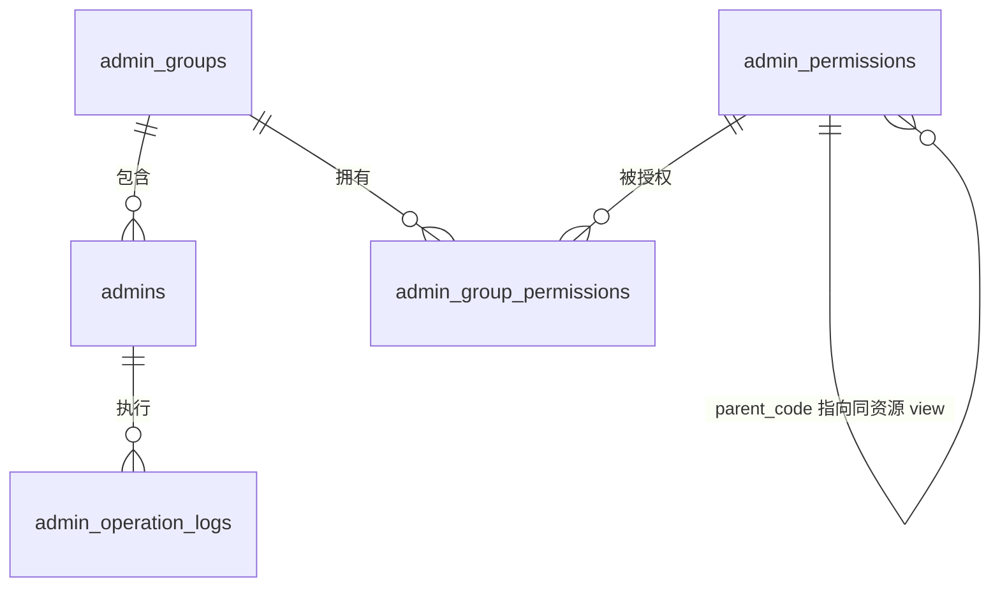
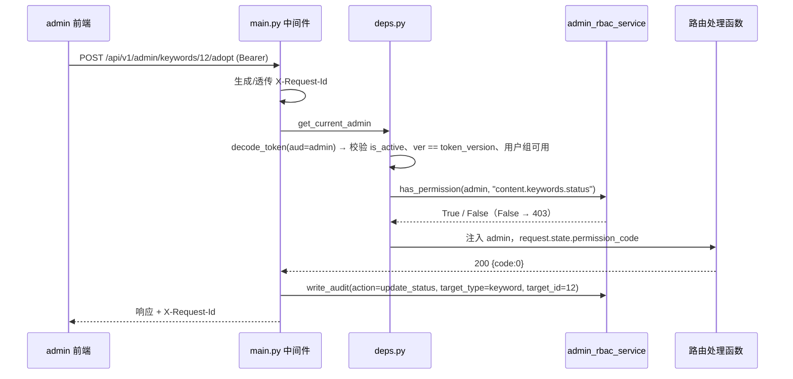

# 07 管理员与用户组权限设计

## 1. 目标与范围

aicreat 只有一个前端（管理后台 `apps/admin`），全部业务接口都挂在 `/api/v1/admin/*` 之下，因此管理员 RBAC（Role-Based Access Control）是整个平台的功能准入边界：关键词/标题/内容生成、媒体生成、回填链接、监控、报表、系统配置，没有一个接口可以绕过它；在功能权限之上，用户组的数据范围 `data_scope` 再决定一个用户能看到哪些数据（[13-user-data-scope](./13-user-data-scope.md)）。本期目标：

- 超级管理员可新增、编辑、启用、禁用管理员，并重置管理员密码；管理员账号不做物理删除。
- 一个管理员只属于一个「管理员用户组」；用户组按「菜单查看权限（`menu`）+ 操作权限（`action`）」两级配置。
- 除 `/admin/auth/*` 的登录态接口（`me`/`logout`/`change-password`，仅 `get_current_admin`）与 `GET /admin/settings/runtime`（已登录即可读）外，后端每个写接口与读接口都通过 `require_permission("module.resource.action")` 校验；前端菜单、路由与按钮同步隐藏，但只作为交互体验。
- 管理员、用户组、权限分配与所有后台写操作统一写入 `admin_operation_logs`，可按管理员、模块、动作、目标、时间追溯。
- 令牌携带 `token_version`：登出、本人修改密码、重置他人密码、启用/禁用、更换用户组时递增，旧令牌立即失效（事件全表见 §7.4）。
- 用户系统：每个用户组除权限码外还带**数据范围** `data_scope`（`all` 全部数据 / `own` 仅本人负责的项目）。功能权限（本文）与数据范围（[13-user-data-scope](./13-user-data-scope.md)）同时满足才能访问：`own` 范围的普通用户只能看到自己负责的项目及其下数据，`all` 范围即「总后台」，看全部用户的数据。

术语：本文与代码中的「管理员」（`admins` 表、`get_current_admin`、管理员 JWT、`/admin/admins`）即用户系统中的**用户账号**，界面统一显示为「用户」（菜单「用户管理」）；代码标识符、表名、接口路径与权限码保持不变。

BRIEF 中的四类角色与系统内置用户组一一对应：

| BRIEF 角色 | 系统用户组 `admin_groups.code` | 中文名 | 定位 | 默认数据范围 |
| --- | --- | --- | --- | --- |
| 超级管理员 | `super_admin` | 超级管理员 | 全部权限，不可删除/停用 | `all`（固定） |
| 运营人员 | `operator` | 运营人员 | 生成、编辑、回填、监控处理 | `own` |
| 审核人员 | `reviewer` | 审核人员 | 审核内容，查看生产数据 | `all` |
| 只读 | `read_only` | 只读 | 仅查看并导出报表与非敏感数据 | `all` |

本文档负责：RBAC 数据模型（字段级摘录）、**权限码全表**、系统用户组默认权限、`require_permission`/`token_version` 实现、审计中间件、管理端 RBAC 页面与前端权限控制。不在本文档范围、只做引用的内容：

| 主题 | 权威文档 |
| --- | --- |
| 全部表 DDL、索引、ER 图 | [03-data-model](./03-data-model.md) |
| 统一响应结构、分页、业务码表、全部接口表 | [04-api-spec](./04-api-spec.md) |
| `ADMIN_JWT_SECRET` 等环境变量、部署 | [05-deployment](./05-deployment.md) |
| 目录树、页面与组件清单 | [02-project-structure](./02-project-structure.md) |
| 系统配置页（`settings` 表、密钥脱敏规则） | [04-api-spec](./04-api-spec.md)、[08-zhiqiapi-integration](./08-zhiqiapi-integration.md) |
| 数据范围语义、数据归属与可见性、`get_data_scope`、项目负责人规则 | [13-user-data-scope](./13-user-data-scope.md) |

「用户组」即后台账号的用户组，同时决定功能权限与数据范围；平台没有 C 端用户，不存在会员分组，账号只由总后台创建（无自助注册）。

## 2. 权限模型

采用「一个管理员属于一个用户组，用户组持有权限集合」的 RBAC 模型，与 navigation 工程一致：



### 2.1 设计原则

1. 权限码 `module.resource.action` 稳定且只在代码中定义（`server/app/core/admin_permissions.py`），中文名仅用于展示；后台不可新增权限码。
2. 每个资源固定一个 `menu` 型权限 `module.resource.view` 与若干 `action` 型权限 `module.resource.<action>`；`action` 的 `parent_code` 指向同资源 `view`。拥有任一 `action` 必须同时拥有 `view`，保存用户组时由后端自动补齐。
3. 后端是最终权限边界：权限以数据库中的用户组授权为准，不信任 JWT 中的任何角色/权限字段；前端隐藏菜单不能替代接口鉴权。
4. `super_admin` 组拥有 `PERMISSION_CODES` 全集，但仍受「最后一个超级管理员」等安全规则约束。
5. 首版不支持一个管理员加入多个用户组，避免权限来源难以追踪。
6. 每个接口只绑定**一个静态权限码**；跨资源的隐含权限（如生成关键词需要查看批次）通过 `PERMISSION_DEPENDENCIES` 在保存用户组时补齐，而不是在接口里判断多个码。
7. 读与导出同权：列表 CSV 导出沿用该资源 `view`；只有内容全文导出 `content.contents.export` 与报表导出 `stats.reports.export` 使用独立权限。

### 2.2 关键术语

| 术语 | 含义 |
| --- | --- |
| 权限码 | `module.resource.action` 字符串，如 `content.keywords.generate`；`type=menu` 的码固定为 `*.view` |
| 系统用户组 | `admin_groups.is_system=1`，`code` 固定为 `super_admin`/`operator`/`reviewer`/`read_only`，不可删除、不可停用 |
| 自定义用户组 | 后台创建，`code` 由服务端生成 `custom_{uuid4().hex[:12]}`，创建后不可修改 |
| 数据范围 | `admin_groups.data_scope`：`all`（全部数据，总后台）/ `own`（仅本人负责的项目及其下数据）；与权限码正交，语义与可见性规则见 [13-user-data-scope](./13-user-data-scope.md) |
| `token_version` | `admins.token_version`，JWT claim `ver` 必须与之相等；递增即令所有旧令牌失效 |
| 审计 | `admin_operation_logs`：写接口成功后由 `main.py` 审计中间件自动记录，登录/登出等由处理函数自行记录 |

## 3. 数据模型

RBAC 五张表的权威 DDL 在 [03-data-model](./03-data-model.md)；本模块的 InnoDB 真实外键只有三处：`admins.group_id → admin_groups.id`、`admin_group_permissions.group_id → admin_groups.id`、`admin_group_permissions.permission_id → admin_permissions.id`（均 `ON DELETE RESTRICT`，因此「有成员的组不可删除」在数据库层也成立；`admin_operation_logs.admin_id` 为逻辑外键，管理员禁用后日志保留）。本节为实现所需的字段级摘录，取值与 03 完全一致。通用列 `created_at`/`updated_at`（`DATETIME`，UTC）每表都有，不再重复。

### 3.1 admins 管理员

| 字段 | 类型 | 说明 |
| --- | --- | --- |
| id | BIGINT PK AI | 主键 |
| username | VARCHAR(50) | 登录名，唯一；规则 `^[A-Za-z0-9_.-]{3,50}$` |
| password_hash | VARCHAR(255) | bcrypt 哈希，接口永不返回 |
| display_name | VARCHAR(50) | 显示名，可空 |
| group_id | BIGINT FK→admin_groups | 所属用户组，非空 |
| is_active | TINYINT 默认 1 | 1 正常 / 0 禁用 |
| token_version | INT 默认 1 | 以下事件在业务更新的同一事务内递增：登出、本人修改密码、重置他人密码、启用/禁用、更换用户组（`group_id` 变化）；仅修改显示名、修改用户组权限不递增（事件全表见 §7.4）；JWT `ver` 必须相等 |
| last_login_at | DATETIME | 最近登录，可空 |
| created_by | BIGINT | 创建人管理员 ID，可空（seed 创建的超管为 NULL） |

索引：`UNIQUE(username)`、`INDEX(group_id)`、`INDEX(is_active)`。与 navigation 不同，aicreat 从第一版就按 RBAC 建表，**没有** `role` 兼容字段。

### 3.2 admin_groups 管理员用户组

| 字段 | 类型 | 说明 |
| --- | --- | --- |
| id | BIGINT PK AI | 主键 |
| code | VARCHAR(40) | 组代码，唯一；系统组固定 `super_admin`/`operator`/`reviewer`/`read_only`，自定义组 `custom_{uuid4().hex[:12]}` |
| name | VARCHAR(50) | 中文名，唯一 |
| name_en | VARCHAR(80) | 英文名（系统自动生成，见 §6.3） |
| description | VARCHAR(255) | 说明，可空 |
| is_system | TINYINT 默认 0 | 系统内置组不可删除/停用 |
| is_active | TINYINT 默认 1 | 是否可用 |
| data_scope | VARCHAR(16) 默认 `own` | `all`/`own`；系统组默认值见 §5.1，`super_admin` 固定 `all`；自定义组创建时缺省 `own` |
| created_by | BIGINT | 创建人，可空 |

索引：`UNIQUE(code)`、`UNIQUE(name)`。

### 3.3 admin_permissions 权限定义

| 字段 | 类型 | 说明 |
| --- | --- | --- |
| id | BIGINT PK AI | 主键 |
| code | VARCHAR(100) | 权限码 `module.resource.action`，唯一 |
| module | VARCHAR(50) | 模块：`dashboard`/`content`/`media`/`ai`/`publish`/`monitoring`/`stats`/`system`/`security` |
| name | VARCHAR(80) | 中文名 |
| type | VARCHAR(16) | `menu`（`*.view`）/ `action` |
| parent_code | VARCHAR(100) | 上级权限码（action 指向同资源 view），可空 |
| sort | INT 默认 0 | 展示顺序 |

索引：`UNIQUE(code)`、`INDEX(module, sort)`。权限只由 `app/core/admin_permissions.py` + 迁移 `0002_seed_permissions.py` + 启动时 `ensure_rbac_seed` 维护，后台不可新增、不可改码。

### 3.4 admin_group_permissions 用户组权限关联

| 字段 | 类型 | 说明 |
| --- | --- | --- |
| group_id | BIGINT FK→admin_groups | 用户组 |
| permission_id | BIGINT FK→admin_permissions | 权限 |

约束：`PRIMARY KEY(group_id, permission_id)`、`INDEX(permission_id)`。保存用户组权限时整组覆盖（先删后插，同一事务）。

### 3.5 admin_operation_logs 管理员操作日志

| 字段 | 类型 | 说明 |
| --- | --- | --- |
| id | BIGINT PK AI | 主键 |
| admin_id | BIGINT | 操作管理员 |
| permission_code | VARCHAR(100) | 使用的权限码；登录/登出/本人改密这三个无权限码的动作固定写审计标签 `auth.login`/`auth.logout`/`auth.change_password`（不是权限码，仅供 `module=auth` 过滤） |
| action | VARCHAR(50) | `create`/`update`/`update_status`/`delete`/`execute`/`login`/`logout`/`reset_password` |
| target_type | VARCHAR(50) | 目标类型（表名单数：`admin`/`admin_group`/`project`/`content`/`publish_link`…，见 §7.6） |
| target_id | VARCHAR(64) | 目标 ID，可空 |
| summary | VARCHAR(255) | 中文摘要 |
| request_id | VARCHAR(64) | 本服务请求追踪 ID（响应头 `X-Request-Id`） |
| ip | VARCHAR(64) | 脱敏来源 IP |
| user_agent | VARCHAR(255) | UA，可空 |

索引：`INDEX(admin_id, created_at)`、`INDEX(permission_code)`、`INDEX(target_type, target_id)`、`INDEX(created_at)`。只读，不提供删除接口；不记录密码、密钥、令牌。

### 3.6 迁移与 seed 分工

| 步骤 | 位置 | 内容 |
| --- | --- | --- |
| 建表 | `server/migrations/versions/0001_initial.py` | 全部 24 张表，含 RBAC 五表与真实外键 |
| 权限与系统组 | `server/migrations/versions/0002_seed_permissions.py` | 写入 `PERMISSIONS` 全部权限码、4 个 `SYSTEM_GROUPS`（含各组默认 `data_scope`）、各系统组的默认权限关联（`super_admin` 写入全集） |
| 默认超管 | `server/seeds/seed.py` | 幂等 upsert `SEED_ADMIN_USERNAME`/`SEED_ADMIN_PASSWORD`（默认 `admin`/`admin123`）到 `super_admin` 组（`created_by=NULL`、`token_version=1`）；账号已存在时**不覆盖**密码、不改组、不改状态。同一脚本还 upsert 示例项目、系统 Prompt 模板与默认平台（见 [06-getting-started](./06-getting-started.md)），与本模块无关 |
| 启动自愈 | `main.py`、`worker.py`、`monitor_worker.py` 启动时在 `lock:bootstrap`（TTL 60s，等待最多 30s）内调用 `admin_rbac_service.ensure_rbac_seed(db)`（同一锁内随后执行 `settings_service.ensure_default_settings` 与 `ai_gateway_service.ensure_default_routes`，与本模块无关） | 补齐新增权限码、缺失的系统组、`super_admin` 缺失的权限行；全部幂等（`INSERT … ON DUPLICATE KEY UPDATE id=id` 或逐条 `IntegrityError` 回滚） |

`ensure_rbac_seed` 算法：

1. 遍历 `PERMISSIONS`：按 `code` upsert `admin_permissions`（已存在则更新 `module/name/type/parent_code/sort`）；数据库中多余的旧码不删除（留给迁移），但权限树与保存校验只认 `PERMISSION_CODES`。
2. 遍历 `SYSTEM_GROUPS`：不存在则插入（`is_active=1`，`data_scope` 取 `SYSTEM_GROUPS` 中的默认值）；组为新建**或当前没有任何权限关联行**时写入 `DEFAULT_GROUP_PERMISSIONS[code]`；`super_admin` 每次都补齐 `PERMISSION_CODES` 中缺失的关联行，并把 `data_scope` 写回 `all`。
3. 已有权限关联的 `operator`/`reviewer`/`read_only` 组**不**重写权限，也不改写 `data_scope`（管理员的手工调整优先）。
4. 不创建管理员账号（由 `seeds/seed.py` 负责）。

## 4. 权限清单

### 4.1 命名与生成规则

权限由 `server/app/core/admin_permissions.py` 的 `PermissionSpec(code, module, name, type, parent_code, sort)` 与 `_resource(module, resource, name, actions, sort)` 生成：每个资源生成一个 `menu` 型 `module.resource.view`（`sort` 为资源基准值）与若干 `action` 型 `module.resource.<action>`（`parent_code` 指向 view，`sort` 依次 +1）。模块同时导出：

| 常量 | 含义 |
| --- | --- |
| `PERMISSIONS: list[PermissionSpec]` | 全部权限定义（§4.5） |
| `PERMISSION_CODES = {item.code for item in PERMISSIONS}` | 权限码集合，共 90 个；`super_admin` seed 时写入全集 |
| `PERMISSION_DEPENDENCIES: dict[str, set[str]]` | 跨资源依赖（§4.3） |
| `SYSTEM_GROUPS` / `OPERATOR_EXCLUDED` / `DEFAULT_GROUP_PERMISSIONS` | 系统用户组与默认权限（§5） |

### 4.2 权限码全表（共 90 个）

| 模块 | 资源 | 菜单/资源名 | 权限码 |
| --- | --- | --- | --- |
| dashboard | — | 控制台 | `dashboard.view` |
| content | projects | 项目管理 | `content.projects.view/create/update/status/delete` |
| content | prompt_templates | Prompt 模板 | `content.prompt_templates.view/create/update/publish/delete` |
| content | keywords | 关键词 | `content.keywords.view/generate/create/import/update/status/delete` |
| content | titles | 标题 | `content.titles.view/generate/create/update/status/delete` |
| content | contents | 内容 | `content.contents.view/generate/create/update/review/status/export/delete` |
| content | batches | 生成批次 | `content.batches.view/cancel/retry` |
| media | assets | 素材库 | `media.assets.view/retry/delete` |
| media | images | 图片生成 | `media.images.view/generate` |
| media | videos | 视频生成 | `media.videos.view/generate` |
| ai | models | 模型目录 | `ai.models.view/sync` |
| ai | routes | 能力路由 | `ai.routes.view/create/update/delete/test/reset_breaker` |
| ai | tasks | AI 任务 | `ai.tasks.view/retry/cancel` |
| ai | usage | 用量对账 | `ai.usage.view/reconcile` |
| publish | platforms | 发布平台 | `publish.platforms.view/create/update/delete/test` |
| publish | links | 回填链接 | `publish.links.view/create/update/check/mark/delete` |
| monitoring | link_checks | 删除检测 | `monitoring.link_checks.view/run` |
| monitoring | index_checks | 收录检测 | `monitoring.index_checks.view/run` |
| monitoring | alerts | 告警中心 | `monitoring.alerts.view/handle` |
| stats | reports | 报表 | `stats.reports.view/export/recompute` |
| system | settings | 系统配置 | `system.settings.view/update` |
| system | upload | 素材上传 | `system.upload.view/create` |
| security | admins | 用户管理 | `security.admins.view/create/update/status/reset_password` |
| security | groups | 用户组权限 | `security.groups.view/create/update/delete/assign` |
| security | audit | 操作日志 | `security.audit.view` |

`system.upload.view` 仅作为 `system.upload.create` 的父权限，不对应菜单。各接口与权限码的逐条绑定见 [04-api-spec](./04-api-spec.md) 的「权限码」列。

### 4.3 依赖与补齐规则

保存用户组权限（`PUT /admin/admin-groups/{id}/permissions`）时后端按下列顺序规范化，再整组覆盖写入：

1. 校验：所有码必须属于 `PERMISSION_CODES`，否则 400，`data` 为 [04-api-spec](./04-api-spec.md) §5.1 的校验错误列表，每个无效码一项（`loc` 末位为该码在请求数组中的下标，0 起），如 `[{"loc":["body","permission_codes",2],"msg":"未知权限码","type":"unknown_permission","input":"content.keywords.publish"}]`；存在无效码时整组不写入。
2. 同资源补齐：对每个 `action` 码补上其 `parent_code`（同资源 `view`）。
3. 跨资源补齐（`PERMISSION_DEPENDENCIES`）：

| 拥有 | 自动补齐 | 原因 |
| --- | --- | --- |
| `content.keywords.generate` / `content.titles.generate` / `content.contents.generate` | `content.batches.view` | 生成后需轮询 `GET /admin/generation-batches/{id}` |
| `media.images.generate` / `media.videos.generate` | `media.assets.view` | 生成后需轮询 `GET /admin/media/assets/{id}/task` 并查看素材 |

```python
PERMISSION_DEPENDENCIES: dict[str, set[str]] = {
    "content.keywords.generate": {"content.batches.view"},
    "content.titles.generate": {"content.batches.view"},
    "content.contents.generate": {"content.batches.view"},
    "media.images.generate": {"media.assets.view"},
    "media.videos.generate": {"media.assets.view"},
}
```

补齐后的 `DEFAULT_GROUP_PERMISSIONS` 结果与 §5 完全一致（`operator` 的 `content.*`/`media.*` 规则本身已覆盖这些依赖）。前端权限树保存时同样先在本地补齐并提示「已自动勾选依赖权限」，避免用户困惑。

### 4.4 菜单与权限码对照

后台菜单是 `apps/admin/src/layouts/Layout.vue` 中的**显式配置**，每个菜单项绑定一个 `*.view` 权限码并按其过滤；路由 `meta.permission` 使用同一权限码：

| 分组 | 菜单项 → 页面（`apps/admin/src/views/`） | 权限码 |
| --- | --- | --- |
| 控制台 | 总览 → `Dashboard.vue` | `dashboard.view` |
| 内容生产 | 项目 → `projects/Index.vue`；Prompt 模板 → `prompt-templates/Index.vue`；关键词 → `keywords/Index.vue`；标题 → `titles/Index.vue`；内容 → `contents/Index.vue`；生成批次 → `generation-batches/Index.vue` | `content.projects.view`；`content.prompt_templates.view`；`content.keywords.view`；`content.titles.view`；`content.contents.view`；`content.batches.view` |
| 媒体 | 素材库 → `media/Assets.vue`；图片生成 → `media/ImageGenerate.vue`；视频生成 → `media/VideoGenerate.vue` | `media.assets.view`；`media.images.view`；`media.videos.view` |
| AI 网关 | 模型目录 → `ai/Models.vue`；能力路由 → `ai/Routes.vue`；AI 任务 → `ai/Tasks.vue`；用量对账 → `ai/Usage.vue` | `ai.models.view`；`ai.routes.view`；`ai.tasks.view`；`ai.usage.view` |
| 发布与监控 | 发布平台 → `platforms/Index.vue`；回填链接 → `links/Index.vue`；删除检测 → `monitoring/LinkChecks.vue`；收录检测 → `monitoring/IndexChecks.vue`；告警中心 → `alerts/Index.vue` | `publish.platforms.view`；`publish.links.view`；`monitoring.link_checks.view`；`monitoring.index_checks.view`；`monitoring.alerts.view` |
| 报表 | 报表 → `stats/Reports.vue` | `stats.reports.view` |
| 系统 | 系统配置 → `settings/Index.vue`；用户管理 → `admins/Index.vue`；用户组 → `admin-groups/Index.vue`；操作日志 → `admin-operation-logs/Index.vue` | `system.settings.view`；`security.admins.view`；`security.groups.view`；`security.audit.view` |

### 4.5 `PERMISSIONS` 定义（最终值）

```python
PERMISSIONS: list[PermissionSpec] = [
    PermissionSpec("dashboard.view", "dashboard", "查看控制台", "menu", None, 100),
    *_resource("content", "projects", "项目管理", [("create", "新增项目"), ("update", "编辑项目"), ("status", "归档或恢复项目"), ("delete", "删除项目")], 200),
    *_resource("content", "prompt_templates", "Prompt 模板", [("create", "新增模板"), ("update", "编辑模板"), ("publish", "发布或归档模板"), ("delete", "删除模板")], 210),
    *_resource("content", "keywords", "关键词", [("generate", "生成关键词"), ("create", "新增关键词"), ("import", "导入关键词"), ("update", "编辑关键词"), ("status", "采用或弃用关键词"), ("delete", "删除关键词")], 220),
    *_resource("content", "titles", "标题", [("generate", "生成标题"), ("create", "新增标题"), ("update", "编辑或打分标题"), ("status", "采用或弃用标题"), ("delete", "删除标题")], 230),
    *_resource("content", "contents", "内容", [("generate", "生成或重写内容"), ("create", "新增内容"), ("update", "编辑内容"), ("review", "审核内容"), ("status", "归档或恢复内容"), ("export", "导出内容"), ("delete", "删除内容")], 240),
    *_resource("content", "batches", "生成批次", [("cancel", "取消批次"), ("retry", "重试批次")], 250),
    *_resource("media", "assets", "素材库", [("retry", "重试或转存素材"), ("delete", "删除素材")], 300),
    *_resource("media", "images", "图片生成", [("generate", "生成图片")], 310),
    *_resource("media", "videos", "视频生成", [("generate", "生成视频")], 320),
    *_resource("ai", "models", "模型目录", [("sync", "同步模型目录")], 400),
    *_resource("ai", "routes", "能力路由", [("create", "新增项目路由"), ("update", "编辑路由"), ("delete", "删除项目路由"), ("test", "健康探测"), ("reset_breaker", "重置熔断")], 410),
    *_resource("ai", "tasks", "AI 任务", [("retry", "重试任务"), ("cancel", "取消任务")], 420),
    *_resource("ai", "usage", "用量对账", [("reconcile", "执行对账")], 430),
    *_resource("publish", "platforms", "发布平台", [("create", "新增平台"), ("update", "编辑平台规则"), ("delete", "删除平台"), ("test", "测试平台规则")], 500),
    *_resource("publish", "links", "回填链接", [("create", "回填链接"), ("update", "编辑链接"), ("check", "手动检测"), ("mark", "人工标记收录"), ("delete", "删除链接")], 510),
    *_resource("monitoring", "link_checks", "删除检测", [("run", "批量触发删除检测")], 600),
    *_resource("monitoring", "index_checks", "收录检测", [("run", "批量触发收录检测")], 610),
    *_resource("monitoring", "alerts", "告警中心", [("handle", "处理告警")], 620),
    *_resource("stats", "reports", "报表", [("export", "导出报表"), ("recompute", "重算统计")], 700),
    *_resource("system", "settings", "系统配置", [("update", "修改系统配置")], 800),
    *_resource("system", "upload", "素材上传", [("create", "上传参考素材")], 810),
    *_resource("security", "admins", "用户管理", [("create", "新增用户"), ("update", "编辑用户"), ("status", "启用或禁用用户"), ("reset_password", "重置用户密码")], 900),
    *_resource("security", "groups", "用户组权限", [("create", "新增用户组"), ("update", "编辑用户组"), ("delete", "删除用户组"), ("assign", "分配用户组权限")], 910),
    PermissionSpec("security.audit.view", "security", "操作日志", "menu", None, 920),
]
```

## 5. 系统用户组与默认权限

### 5.1 系统用户组

```python
SYSTEM_GROUPS = [
    {"code": "super_admin", "name": "超级管理员", "name_en": "Super Administrator", "description": "拥有全部后台权限", "is_system": 1, "data_scope": "all"},
    {"code": "operator", "name": "运营人员", "name_en": "Operator", "description": "生成、编辑、回填与监控处理", "is_system": 1, "data_scope": "own"},
    {"code": "reviewer", "name": "审核人员", "name_en": "Reviewer", "description": "审核内容并查看生产数据", "is_system": 1, "data_scope": "all"},
    {"code": "read_only", "name": "只读", "name_en": "Read Only", "description": "仅查看并导出报表与非敏感数据", "is_system": 1, "data_scope": "all"},
]
```

`data_scope` 为各系统组的**默认**数据范围：`super_admin` 固定为 `all`（修改返回 403，启动时自愈）；`operator`/`reviewer`/`read_only` 可在用户组页修改，修改后 `ensure_rbac_seed` 不再覆盖。取值理由见 [13-user-data-scope](./13-user-data-scope.md) §3.2。

### 5.2 默认权限（`DEFAULT_GROUP_PERMISSIONS`，最终值）

```python
PERMISSION_CODES = {item.code for item in PERMISSIONS}

OPERATOR_EXCLUDED = {"content.contents.review", "content.projects.delete", "content.prompt_templates.publish", "content.prompt_templates.delete"}

DEFAULT_GROUP_PERMISSIONS = {
    # super_admin：PERMISSION_CODES 全集（seed 时直接写入全部，不在本字典中）
    "operator": {
        code for code in PERMISSION_CODES
        if code in {"dashboard.view", "system.upload.view", "system.upload.create"}
        or (code.startswith("content.") and code not in OPERATOR_EXCLUDED)
        or code.startswith("media.")
        or code.startswith("publish.links.")
        or code == "publish.platforms.view"
        or code.startswith("monitoring.")
        or (code.startswith("ai.") and (code.endswith(".view") or code in {"ai.tasks.retry", "ai.tasks.cancel"}))
        or code in {"stats.reports.view", "stats.reports.export"}
    },
    "reviewer": {
        code for code in PERMISSION_CODES
        if code == "dashboard.view"
        or (code.startswith("content.") and code.endswith(".view"))
        or code in {"content.contents.review", "content.contents.update", "content.contents.export"}
        or (code.startswith("media.") and code.endswith(".view"))
        or (code.startswith("publish.") and code.endswith(".view"))
        or (code.startswith("monitoring.") and code.endswith(".view"))
        or code == "stats.reports.view"
    },
    "read_only": {
        code for code in PERMISSION_CODES
        if (code.endswith(".view") and not code.startswith("security.") and code != "system.settings.view")
        or code == "stats.reports.export"
    },
}
```

按组解读（实现时以上面的代码为准，本表仅供产品与测试对照）：

| 用户组 | 可以 | 不可以 |
| --- | --- | --- |
| `super_admin` | 全部 90 个权限码 | 禁用自己、禁用最后一个超管（§10） |
| `operator` | 控制台；项目/模板/关键词/标题/内容/批次的全部操作（除 `OPERATOR_EXCLUDED`）；图片/视频生成与素材管理；参考素材上传；回填链接全部操作；查看发布平台；删除/收录检测触发与告警处理；AI 网关各页查看 + 任务重试/取消；报表查看与导出 | 审核内容、删除项目、发布/删除 Prompt 模板；新增/编辑/删除/测试发布平台；模型同步、能力路由新增/编辑/删除、健康探测、重置熔断、对账触发；重算统计；系统配置；管理员/用户组/日志 |
| `reviewer` | 控制台；内容生产各页查看；审核、编辑、导出内容；媒体/发布/监控各页查看；报表查看 | 任何生成、回填、检测触发、告警处理、导出报表；AI 网关各页（无 `ai.*`）；参考素材上传；系统与安全模块 |
| `read_only` | 除 `security.*` 与 `system.settings.view` 外的全部 `*.view`（含 `system.upload.view`，但无 `create`）；`stats.reports.export`；列表 CSV 导出（沿用 `view`） | 任何写操作、内容全文导出、系统配置、安全模块 |

上表只描述**功能权限**；能看到哪些数据由所属组的 `data_scope` 决定（§5.1）：`operator` 默认 `own`，上表中的一切操作都只作用于本人负责的项目及其下数据；`super_admin`/`reviewer`/`read_only` 默认 `all`，作用于全部用户的数据。安全模块与全局配置（`security.*`、`system.settings.*`、`ai.models.sync`、`ai.routes` 的写与探测、`ai.usage.reconcile`、`publish.platforms` 的写与测试、`stats.reports.recompute`）不受数据范围约束（[13-user-data-scope](./13-user-data-scope.md) §4.3），只应授予 `all` 范围的组。

### 5.3 自定义用户组

- 由 `security.groups.create` 创建，`code=custom_{uuid4().hex[:12]}`、`is_system=0`、`data_scope` 缺省 `own`（创建时可传 `all`）；初始无任何权限，需随后 `PUT /admin/admin-groups/{id}/permissions` 分配。
- 自定义组可停用（须无启用中的管理员）、可删除（须无任何管理员）。
- 推荐的组合示例：「媒体设计」= `dashboard.view` + `media.*` + `system.upload.*` + `content.contents.view`；「SEO 专员」= `dashboard.view` + `publish.*` + `monitoring.*` + `stats.reports.view/export`。二者服务于全部用户时设为 `all`，只服务本人项目时保持 `own`。

## 6. 后端接口设计

统一前缀 `/api/v1/admin`；除 `POST /admin/auth/login` 与 `GET /admin/auth/site-info` 外都需要 `Authorization: Bearer <admin-jwt>`。表中「权限码」为 `require_permission` 参数，「已登录」表示仅 `get_current_admin`，「公开」表示无需令牌。响应结构 `{code, message, data}`、分页参数 `page`/`page_size` 与业务码表见 [04-api-spec](./04-api-spec.md)。路由文件与挂载前缀：

| 文件（`server/app/api/admin/`） | 挂载前缀 | 请求模型（`server/app/schemas/`） |
| --- | --- | --- |
| `auth.py` | `/auth` | `auth.py`：`LoginBody`、`ChangePasswordBody`、`MeOut` |
| `admins.py` | `/admins` | `admin_rbac.py`：`AdminCreate`、`AdminUpdate`、`AdminStatusBody`、`AdminResetPasswordBody` |
| `admin_groups.py` | `/admin-groups` | `admin_rbac.py`：`GroupCreate`、`GroupUpdate`（均含 `data_scope`）、`PermissionCodesBody` |
| `admin_permissions.py` | `/admin-permissions` | — |
| `operation_logs.py` | `/admin-operation-logs` | 查询参数直接声明在路由函数上 |

### 6.1 当前管理员（`/admin/auth`）

| 方法 | 路径 | 权限码 | 说明 |
| --- | --- | --- | --- |
| POST | `/admin/auth/login` | 公开 | `{username,password}` → `{token,expires_in,admin{id,username,display_name,group{id,code,name},permissions[],data_scope}}`；失败 5 次/15 分钟锁定（Redis `rate:admin_login:{username}`） |
| GET | `/admin/auth/me` | 已登录 | 当前用户 + 最新权限码 + 数据范围 `data_scope`（`all`/`own`，取所属用户组）+ `zhiqi_mode`（`mock`/`live`） |
| POST | `/admin/auth/logout` | 已登录 | `token_version += 1`，旧令牌失效 |
| POST | `/admin/auth/change-password` | 已登录 | `{old_password,new_password}`，成功后 `token_version += 1` |
| GET | `/admin/auth/site-info` | 公开 | `?locale=zh-CN` 或 `en-US`（缺省与非法值均回退 `zh-CN`，经 `services/i18n.normalize_locale`）→ `system_info`（站点名/Logo/页脚/联系方式），供 `Login.vue` 登录前渲染；仅返回该配置键 |

登录处理顺序：① 读取 `rate:admin_login:{username}`，计数 ≥ `ADMIN_LOGIN_MAX_FAILURES`（默认 5）→ 429「登录失败次数过多，请稍后再试」，`data={"retry_after": 键剩余 TTL 秒}`（锁定期间不校验密码、不 `INCR`、不续期，锁定时长固定为最后一次失败起 900 秒）；② 按 `username` 查找并 `verify_password`（账号不存在时也对 `DUMMY_PASSWORD_HASH` 执行一次 `verify_password`，使两种失败耗时一致，防止用户名枚举），失败 → `INCR` 后 `EXPIRE 900`（每次写入都续期，§7.5），返回 401「用户名或密码错误」（与 [04-api-spec](./04-api-spec.md) 登录示例一致；账号不存在、密码错误同一文案，不区分）；③ `is_active=0` → 403「账号已禁用」；所属组 `is_active=0` → 403「用户组已停用」（②③ 均不写审计）；④ 成功：`DEL` 计数键，更新 `last_login_at`，签发令牌，写审计 `login`。

```http
POST /api/v1/admin/auth/login
Content-Type: application/json

{"username": "admin", "password": "admin123"}
```

```json
{
  "code": 0,
  "message": "ok",
  "data": {
    "token": "eyJhbGciOiJIUzI1NiIs...",
    "expires_in": 7200,
    "admin": {
      "id": 1,
      "username": "admin",
      "display_name": "超级管理员",
      "group": {"id": 1, "code": "super_admin", "name": "超级管理员"},
      "permissions": ["dashboard.view", "content.projects.view", "content.projects.create", "..."],
      "data_scope": "all"
    }
  }
}
```

`GET /admin/auth/me` 返回同样的 `admin` 对象并增加 `last_login_at` 与 `zhiqi_mode`：

```json
{"code": 0, "message": "ok", "data": {"id": 1, "username": "admin", "display_name": "超级管理员", "group": {"id": 1, "code": "super_admin", "name": "超级管理员"}, "permissions": ["dashboard.view", "..."], "data_scope": "all", "last_login_at": "2026-10-06T01:00:00Z", "zhiqi_mode": "mock"}}
```

`POST /admin/auth/change-password`：原密码错误 → 400「原密码错误」；新密码不满足策略或与原密码相同 → 400；成功后 `token_version += 1`，返回 `ok(message="密码已修改，请重新登录")`，前端清除登录态并跳转登录页。`GET /admin/auth/site-info?locale=zh-CN` 返回 `{"site_name": "aicreat 内容生成平台", "logo_url": "", "footer": "", "support_contact": ""}`。

### 6.2 用户管理（`/admin/admins`）

| 方法 | 路径 | 权限码 | 说明 |
| --- | --- | --- | --- |
| GET | `/admin/admins` | `security.admins.view` | 分页；`keyword`（匹配 `username`/`display_name`）/`group_id`/`is_active`；按 `id` 倒序；每项附所属组的 `data_scope` |
| POST | `/admin/admins` | `security.admins.create` | `{username,display_name,password,group_id,is_active}`（`is_active` 缺省 `true`） |
| GET | `/admin/admins/{id}` | `security.admins.view` | 详情（含 `permissions[]`、`created_by`） |
| PUT | `/admin/admins/{id}` | `security.admins.update` | `{display_name,group_id}`（两者均可选，至少一个）；换组时 `token_version += 1`；不能修改自己的用户组；目标是最后一个有效超管（`super_admin` 组内 `is_active=1` 的唯一管理员）时不能把它移出 `super_admin` 组（403）；目标组必须存在且 `is_active=1`（否则 400） |
| PATCH | `/admin/admins/{id}/status` | `security.admins.status` | `{is_active}`；不能禁用自己/最后一个超管；`token_version += 1` |
| POST | `/admin/admins/{id}/reset-password` | `security.admins.reset_password` | `{password}`，`token_version += 1`；密码只在请求体出现一次，不回显、不入日志 |

不提供物理删除接口，禁用即「删除」，以保留审计链路。新增管理员：

```http
POST /api/v1/admin/admins
Authorization: Bearer <admin-jwt>
Content-Type: application/json

{"username": "operator01", "display_name": "运营小王", "password": "Op3rator2026", "group_id": 2, "is_active": true}
```

```json
{
  "code": 0,
  "message": "ok",
  "data": {"id": 5, "username": "operator01", "display_name": "运营小王", "group": {"id": 2, "code": "operator", "name": "运营人员"}, "data_scope": "own", "is_active": true, "last_login_at": null, "created_by": 1, "created_at": "2026-10-06T08:00:00Z"}
}
```

校验：`username` 匹配 `^[A-Za-z0-9_.-]{3,50}$` 且唯一（冲突 409，`data={"existing_id": …}`）；`display_name` ≤ 50 字符，可空；`group_id` 必须存在且 `is_active=1`（否则 400）；密码策略（创建、重置、本人修改共用，`schemas/admin_rbac.py` 的 `validate_password`）：正则 `^(?=.*[A-Za-z])(?=.*\d).{8,}$` 且 UTF-8 编码 ≤ 72 字节（bcrypt 上限），不满足 → 400「密码至少 8 位且须同时包含字母与数字」。

### 6.3 用户组与权限（`/admin/admin-groups`、`/admin/admin-permissions`）

| 方法 | 路径 | 权限码 | 说明 |
| --- | --- | --- | --- |
| GET | `/admin/admin-groups` | `security.groups.view` | **不分页**（与 [04-api-spec](./04-api-spec.md) 一致，`data` 为数组；用户组数量很小且前端下拉需要全量）；每组含 `admin_count` 与 `data_scope`；系统组在前、`id` 升序；可选 `is_active` 筛选 |
| POST | `/admin/admin-groups` | `security.groups.create` | `{name,description,is_active,data_scope?}`（`name` 1~50 字符、全局唯一，重复 409 `existing_id`；`description` ≤ 255 字符可空；`data_scope` ∈ `all`/`own`，缺省 `own`）；`code` 由服务端生成 `custom_{uuid4().hex[:12]}`（创建后不可修改），`name_en` 由 `name` 自动生成 |
| GET | `/admin/admin-groups/{id}` | `security.groups.view` | 详情 + `permission_codes[]` |
| PUT | `/admin/admin-groups/{id}` | `security.groups.update` | `{name,description,is_active,data_scope}`（均可选）改名称/说明/状态/数据范围；`name` 重复 409 `existing_id`；系统组不可停用（403）；停用前组内不得有启用中的管理员（403）；`super_admin` 组的 `data_scope` 只能为 `all`（其它值 403）；`data_scope` 修改立即生效、不递增成员 `token_version`，审计 `summary` 记录前后值（[13-user-data-scope](./13-user-data-scope.md) §3.3）；`code`、`name_en` 不可修改 |
| PUT | `/admin/admin-groups/{id}/permissions` | `security.groups.assign` | `{permission_codes[]}` 覆盖保存，自动补齐同资源 `view` 与 `PERMISSION_DEPENDENCIES`；`super_admin` 组拒绝修改；系统组补齐后不得为空 |
| DELETE | `/admin/admin-groups/{id}` | `security.groups.delete` | 非系统且无管理员（含已禁用管理员，否则 403）；同一事务内先 `DELETE FROM admin_group_permissions WHERE group_id = :id` 再删除组行（关联表外键为 `ON DELETE RESTRICT`，不级联，见 [03-data-model](./03-data-model.md)） |
| GET | `/admin/admin-permissions` | `security.groups.view` | 平铺权限列表 `[{code,module,name,type,parent_code,sort}]`（静态字典，按 `sort` 排序，不分页） |
| GET | `/admin/admin-permissions/tree` | `security.groups.view` | 按 module → menu → action 的树（静态字典，不分页） |

`name_en` 生成规则（`admin_rbac_service.generate_name_en`）：`name` 全为 ASCII 字母/数字/空格时取其 Title Case；否则取 `"Custom Group " + code[-6:]`。首版不开放编辑 `name_en`。

用户组对象：`{id, code, name, name_en, description, is_system, is_active, data_scope, admin_count, created_at}`，详情额外返回 `permission_codes[]`（`super_admin` 固定返回 `PERMISSION_CODES` 全集的排序结果）。保存权限：

```http
PUT /api/v1/admin/admin-groups/5/permissions
Authorization: Bearer <admin-jwt>
Content-Type: application/json

{"permission_codes": ["dashboard.view", "content.keywords.generate", "media.images.generate"]}
```

```json
{
  "code": 0,
  "message": "ok",
  "data": {
    "id": 5, "code": "custom_3f9a1c2b7d4e", "name": "媒体设计", "name_en": "Custom Group 2b7d4e", "description": null,
    "is_system": false, "is_active": true, "data_scope": "own", "admin_count": 0,
    "permission_codes": ["content.batches.view", "content.keywords.generate", "content.keywords.view", "dashboard.view", "media.assets.view", "media.images.generate", "media.images.view"]
  }
}
```

权限树（`GET /admin/admin-permissions/tree`）节选：

```json
{"code": 0, "message": "ok", "data": [
  {"module": "content", "name": "内容生产", "items": [
    {"code": "content.keywords.view", "name": "关键词", "type": "menu", "children": [
      {"code": "content.keywords.generate", "name": "生成关键词", "type": "action"},
      {"code": "content.keywords.create", "name": "新增关键词", "type": "action"}
    ]}
  ]}
]}
```

模块中文名由 `admin_rbac_service.MODULE_NAMES` 给出：`dashboard` 控制台、`content` 内容生产、`media` 媒体、`ai` AI 网关、`publish` 发布、`monitoring` 监控、`stats` 报表、`system` 系统、`security` 权限安全。

### 6.4 操作日志（`/admin/admin-operation-logs`）

| 方法 | 路径 | 权限码 | 说明 |
| --- | --- | --- | --- |
| GET | `/admin/admin-operation-logs` | `security.audit.view` | 分页；`admin_id`/`module`/`action`/`target_type`/`start`/`end`（ISO 8601 UTC，闭区间）；`module` 按 `permission_code LIKE '{module}.%'` 过滤（表无 `module` 列，复用 `INDEX(permission_code)`）；按 `id` 倒序；调用者所属组 `data_scope=own` 时只返回本人的记录（`admin_id` 参数被忽略，[13-user-data-scope](./13-user-data-scope.md) §6.3） |

```json
{"code": 0, "message": "ok", "data": {"items": [
  {"id": 1203, "admin": {"id": 1, "username": "admin", "display_name": "超级管理员"}, "group_name": "超级管理员",
   "permission_code": "security.admins.status", "action": "update_status", "target_type": "admin", "target_id": "5",
   "summary": "禁用管理员 operator01", "request_id": "6f1c0d8e4b2a4f0e9c1d2e3f4a5b6c7d", "ip": "203.0.113.0", "created_at": "2026-10-06T08:12:30Z"}
], "total": 1, "page": 1, "page_size": 20}}
```

日志只读：没有删除、修改接口，也不提供导出（首版）。

### 6.5 本模块业务码对照

| code / http | 场景 | `data` |
| --- | --- | --- |
| 400 | 密码不满足策略、原密码错误、新旧密码相同、分配到不存在或已停用的用户组、无效权限码 | 统一为 [04-api-spec](./04-api-spec.md) §5.1 的校验错误列表 `[{"loc":[…],"msg":"…","type":"…","input":…}]`（Pydantic 字段校验沿用其原生 `loc`/`type`）：密码不满足策略 `loc=["body","password"]`（本人改密为 `["body","new_password"]`）、`type="value_error"`；原密码错误 `loc=["body","old_password"]`、`type="wrong_password"`；新旧密码相同 `loc=["body","new_password"]`、`type="same_as_old"`；用户组不存在或已停用 `loc=["body","group_id"]`、`type="group_unavailable"`、`input` 为该 ID；无效权限码每码一项、`type="unknown_permission"`（§4.3）。密码类字段（`password`/`old_password`/`new_password`）的错误项一律不带 `input`（Pydantic 错误在 `register_exception_handlers` 转换时剔除），避免回显密码（§10 第 6 条） |
| 401 | 登录时用户名或密码错误；无令牌、令牌过期或签名错误、`ver` ≠ `token_version`、管理员不存在/已禁用、用户组已停用 | — |
| 403 | 无权限；安全规则拒绝：禁用自己、禁用最后一个有效超管、将最后一个有效超管移出 `super_admin` 组、修改自己的用户组、删除/停用系统组、停用仍有启用中管理员的自定义组、修改 `super_admin` 权限、把 `super_admin` 组的 `data_scope` 改为非 `all`、系统组权限清空、删除仍有管理员的组、登录时账号或用户组已停用 | 无权限时 `{"permission": code}` |
| 404 | 管理员/用户组不存在 | — |
| 409 | `username` 或用户组 `name` 重复 | `{"existing_id": …}` |
| 429 | 登录失败次数达到上限 | `{"retry_after": 秒}` |

## 7. 后端鉴权实现

### 7.1 令牌（`server/app/core/security.py`）

管理员 JWT 为 HS256，密钥 `ADMIN_JWT_SECRET`（生产必须修改），有效期 `ADMIN_JWT_EXPIRE_SECONDS`（默认 7200 秒）。claims 固定为：`sub`=管理员 ID 字符串、`aud="admin"`、`ver`=`admins.token_version`、`iat`、`exp`。aicreat 只有管理员一种主体，`aud` 固定为 `admin`。

```python
import time
import bcrypt
import jwt
from app.core.config import settings

AUD = "admin"
DUMMY_PASSWORD_HASH = bcrypt.hashpw(b"aicreat-dummy", bcrypt.gensalt()).decode("utf-8")   # 账号不存在时登录也对其 checkpw 一次，耗时与真实校验一致

def _to_bytes(password: str) -> bytes:
    return password.encode("utf-8")[:72]          # bcrypt 上限 72 字节

def hash_password(password: str) -> str:
    return bcrypt.hashpw(_to_bytes(password), bcrypt.gensalt()).decode("utf-8")

def verify_password(plain: str, hashed: str) -> bool:
    try:
        return bool(hashed) and bcrypt.checkpw(_to_bytes(plain), hashed.encode("utf-8"))
    except (ValueError, TypeError):
        return False

def create_token(subject: int, token_version: int) -> str:
    now = int(time.time())
    payload = {"sub": str(subject), "aud": AUD, "ver": token_version, "iat": now, "exp": now + settings.admin_jwt_expire_seconds}
    return jwt.encode(payload, settings.admin_jwt_secret, algorithm="HS256")

def decode_token(token: str) -> dict | None:
    try:
        return jwt.decode(token, settings.admin_jwt_secret, algorithms=["HS256"], audience=AUD)
    except jwt.PyJWTError:
        return None
```

### 7.2 依赖（`server/app/api/deps.py`）

```python
def _bearer(request: Request) -> str | None:
    auth = request.headers.get("Authorization", "")
    return auth[7:] if auth.startswith("Bearer ") else None

def get_current_admin(request: Request, db: Session = Depends(get_db)) -> Admin:
    token = _bearer(request)
    payload = decode_token(token) if token else None
    if not payload:
        raise BusinessError("未登录", code=401, http_status=401)
    try:
        admin_id = int(payload.get("sub", ""))
    except (TypeError, ValueError):
        raise BusinessError("未登录", code=401, http_status=401)
    admin = db.get(Admin, admin_id)
    if not admin or not admin.is_active:
        raise BusinessError("管理员不存在或已禁用", code=401, http_status=401)
    if int(payload.get("ver", -1)) != admin.token_version:
        raise BusinessError("登录状态已失效，请重新登录", code=401, http_status=401)
    group = db.get(AdminGroup, admin.group_id)
    if not group or not group.is_active:
        raise BusinessError("管理员用户组已停用", code=401, http_status=401)
    request.state.admin_id = admin.id
    return admin

def require_permission(code: str):
    """生成后台权限依赖；权限以数据库中的用户组授权为准。code 必须属于 PERMISSION_CODES。"""
    if code not in PERMISSION_CODES:
        raise ValueError(f"未知权限码: {code}")           # 路由模块导入时即失败

    def _checker(request: Request, admin: Admin = Depends(get_current_admin), db: Session = Depends(get_db)) -> Admin:
        if not admin_rbac_service.has_permission(db, admin, code):
            raise BusinessError("无权执行此操作", code=403, http_status=403, data={"permission": code})
        request.state.permission_code = code      # 供审计中间件使用
        return admin

    return _checker
```

接口绑定示例（每个接口只绑定一个静态码）：

```python
@router.post("/{keyword_id}/adopt")
def adopt_keyword(
    keyword_id: int,
    admin: Admin = Depends(require_permission("content.keywords.status")),
    db: Session = Depends(get_db),
):
    ...
```

`require_permission` 在模块导入时断言权限码存在，拼写错误的权限码会在应用启动时暴露，而不是在运行期永远返回 403。

数据范围由同一文件中的第二个依赖 `get_data_scope` 计算（代码见 [13-user-data-scope](./13-user-data-scope.md) §9.1）：它复用 `get_current_admin` 已加载的用户组，返回 `DataScope(admin_id, scope, owner_id)`，`super_admin` 组短路为 `all`，`own` 范围忽略查询参数 `owner_id`。受数据范围约束的路由同时声明两个依赖：

```python
@router.get("")
def list_keywords(
    query: KeywordQuery = Depends(),
    admin: Admin = Depends(require_permission("content.keywords.view")),
    scope: DataScope = Depends(get_data_scope),
    db: Session = Depends(get_db),
):
    return keyword_service.list_keywords(db, scope, query)    # service 以 scope 为必填参数，附加范围谓词
```

功能权限不足返回 403；对象在数据范围之外按「不存在」返回 404，从不以 403 暴露对象存在性（[13-user-data-scope](./13-user-data-scope.md) §8）。

### 7.3 权限计算（`server/app/services/admin_rbac_service.py`）

```python
def permission_codes(db: Session, admin: Admin) -> set[str]:
    group = db.get(AdminGroup, admin.group_id)
    if not group or not group.is_active:
        return set()
    if group.code == "super_admin":
        return set(PERMISSION_CODES)              # 短路：新增权限码无需等待 seed
    rows = db.scalars(
        select(AdminPermission.code)
        .join(AdminGroupPermission, AdminGroupPermission.permission_id == AdminPermission.id)
        .where(AdminGroupPermission.group_id == group.id)
    ).all()
    return set(rows) & PERMISSION_CODES          # 数据库中的历史旧码不生效

def has_permission(db: Session, admin: Admin, code: str) -> bool:
    return code in permission_codes(db, admin)
```

权限每次请求从数据库读取（`get_current_admin` 已加载的管理员与用户组在同一 `Session` 的身份映射中复用，`permission_codes` 只多一条命中 `admin_group_permissions` 主键索引的短 SQL；每个受保护请求合计不超过三条点查），不信任 JWT 中的任何角色或权限数组，因此修改用户组权限**立即生效、无需重新登录**。首版不做 Redis 缓存；蓝图 Redis 键表中没有权限缓存键，后续如有性能压力需先在 [01-architecture](./01-architecture.md) 的缓存键表登记，并在用户组权限变更、管理员换组、禁用时主动失效。

一次受保护写请求的完整路径：



### 7.4 `token_version` 失效事件

| 事件 | 接口 | 是否递增 | 说明 |
| --- | --- | --- | --- |
| 登出 | `POST /admin/auth/logout` | 是 | 服务端真正失效，而不只是前端删 token |
| 本人修改密码 | `POST /admin/auth/change-password` | 是 | 其它设备会话同时失效 |
| 重置他人密码 | `POST /admin/admins/{id}/reset-password` | 是 | 目标管理员所有会话失效 |
| 启用/禁用 | `PATCH /admin/admins/{id}/status` | 是 | 禁用后 `get_current_admin` 已拒绝，递增用于再次启用时清除旧令牌 |
| 更换用户组 | `PUT /admin/admins/{id}`（`group_id` 变化） | 是 | 强制重新登录以刷新前端菜单与权限缓存；安全规则（自己、最后一个有效超管）在递增前校验，拒绝时不递增 |
| 修改显示名 | `PUT /admin/admins/{id}`（仅 `display_name`） | 否 | — |
| 修改用户组权限 | `PUT /admin/admin-groups/{id}/permissions` | 否 | 后端实时读库生效；前端在下一次 `/auth/me`（刷新页面或收到带 `data.permission` 的 403 后）更新 |
| 修改用户组数据范围 | `PUT /admin/admin-groups/{id}`（`data_scope` 变化） | 否 | 同上：`get_data_scope` 每次请求读库，接口立即按新范围过滤；前端 `data_scope` 在下一次 `/auth/me` 更新 |

所有递增都在业务更新的同一事务内完成；令牌本身不存库，也没有黑名单。

### 7.5 登录频控（`server/app/core/ratelimit.py`）

`rate:admin_login:{username}`：登录失败 `INCR` 后立即 `EXPIRE 900`（遵守 [01-architecture](./01-architecture.md) Redis 键表的「TTL 统一规则」：计数类键每次写入后 `EXPIRE`；锁定时长 = 最后一次失败起 15 分钟）；计数 ≥ `ADMIN_LOGIN_MAX_FAILURES` 时直接返回 429（不再校验密码，避免撞库；此时不 `INCR`、不续期，否则攻击者可无限延长锁定）；`retry_after` = `TTL` 返回值（≤ 0 时视为未锁定）；登录成功 `DEL`。键按用户名而非 IP 计数，锁定的是账号（`username` 先 `strip()` 再转小写后拼键，与 `utf8mb4_unicode_ci` 下大小写不敏感的账号查找一致，避免大小写绕过；账号不存在的用户名同样计数，键 15 分钟自动过期）。首版不做 IP 维度频控，[05-deployment](./05-deployment.md) 的 Nginx 配置也未启用 `limit_req`；IP 级限速列为后续加固项，不在首版验收范围内。

### 7.6 审计中间件（`server/app/main.py`）

写接口成功后由 `admin_audit_middleware` 自动写 `admin_operation_logs`；读接口不记录。触发条件：路径以 `/api/v1/admin/` 开头、方法 ∈ `POST/PUT/PATCH/DELETE`、响应状态 < 400、`request.state.permission_code` 已设置、且 `request.state.audit_written` 不为真。`action` 按「方法 + 路由模板」映射：

| 规则 | `action` |
| --- | --- |
| `PUT`（含 `PUT /admin-groups/{id}/permissions`） | `update` |
| `DELETE` | `delete` |
| `PATCH`，或 `POST` 末段 ∈ 状态动作词 `adopt`/`discard`/`restore`/`archive`/`unarchive`/`approve`/`reject`/`submit-review`/`pause`/`resume`/`acknowledge`/`resolve`/`ignore`/`status`/`batch-status`/`batch-resolve` | `update_status` |
| `POST` 末段 ∈ `reset-password`/`change-password` | `reset_password`（`change-password` 无权限码，由处理函数自行 `write_audit`，`permission_code` 写审计标签 `auth.change_password`） |
| `POST` 末段 ∈ 执行动作词 `generate`/`generate-outline`/`generate-body`/`generate-seo`/`rewrite`/`import`/`import-file`/`batch`/`sync`/`test`/`probe`/`reconcile`/`run`/`recompute`/`check`/`index-check`/`rebaseline`/`mark-index`/`retry`/`cancel`/`transfer`/`attach`/`detach`/`duplicate`/`publish`/`score`/`reset-breaker`，以及模板以 `/versions/{version_id}/restore` 结尾 | `execute` |
| 其余集合级 `POST`（模板无路径参数、末段非动作词） | `create` |
| `login`/`logout` | 由处理函数自行 `write_audit`（`permission_code` 写审计标签 `auth.login`/`auth.logout`，`target_type=admin`，`target_id`=当前管理员）并设置 `audit_written=True` |

`resolve_action` 的判定顺序固定为：`PUT` → `DELETE` → `PATCH` → 模板以 `/versions/{version_id}/restore` 结尾（必须先于状态动作词，`restore` 同时是内容恢复的状态动作）→ 末段 ∈ `reset-password`/`change-password` → 末段 ∈ 状态动作词 → 末段 ∈ 执行动作词 → 无路径参数的 `POST` 记 `create`；**兜底**：带路径参数且末段不在任何动作词表中的 `POST` 记 `execute`（蓝图现有接口全部命中显式规则，兜底只防新增接口漏配，§11 以路由遍历测试保证）。无副作用的 `POST …/preview` 与 `POST /platforms/detect` 由处理函数设置 `request.state.audit_written=True` 跳过。`target_type` 由常量 `AUDIT_TARGET_TYPES`（路由前缀 → 固定值，最长前缀优先；匹配前先去掉模板的 `/api/v1` 前缀）决定，`target_id` = 路由模板中最后一个路径参数的值（无则 NULL）：

| 路由前缀 | target_type | 路由前缀 | target_type |
| --- | --- | --- | --- |
| `/admin/projects` | `project` | `/admin/prompt-templates` | `prompt_template` |
| `/admin/keywords` | `keyword` | `/admin/titles` | `title` |
| `/admin/contents/{id}/versions` | `content_version`（`target_id=version_id`） | `/admin/contents` | `content` |
| `/admin/generation-batches` | `generation_batch` | `/admin/media`、`/admin/uploads` | `media_asset` |
| `/admin/ai/routes` | `capability_route` | `/admin/ai/tasks` | `ai_task` |
| `/admin/ai/models` | `ai_model` | `/admin/ai/health` | `ai_model`（`target_id` NULL） |
| `/admin/ai/usage` | `ai_usage_log`（`target_id` NULL） | `/admin/platforms` | `publish_platform` |
| `/admin/links` | `publish_link` | `/admin/monitoring` | `publish_link`（`target_id` NULL） |
| `/admin/alerts` | `alert` | `/admin/stats` | `daily_stats`（`target_id` NULL） |
| `/admin/settings` | `setting`（`target_id` = `{key}`） | `/admin/admins` | `admin` |
| `/admin/admin-groups` | `admin_group` | `/admin/auth` | `admin`（`target_id` = 当前管理员） |

`summary` 默认为 `f"{ACTION_LABELS[action]} {target_type}" + (f" #{target_id}" if target_id else "")`（`ACTION_LABELS`：`create` 新增、`update` 更新、`update_status` 变更状态、`delete` 删除、`execute` 执行、`reset_password` 重置密码）；处理函数可在返回前设置 `request.state.audit_summary`（≤ 255 字符的中文摘要，如「禁用管理员 operator01」）与 `request.state.audit_target_id` 覆盖默认值。中间件实现骨架：

```python
@app.middleware("http")
async def admin_audit_middleware(request: Request, call_next):
    response = await call_next(request)
    if (request.url.path.startswith("/api/v1/admin/") and request.method in {"POST", "PUT", "PATCH", "DELETE"}
            and response.status_code < 400 and getattr(request.state, "permission_code", None)
            and not getattr(request.state, "audit_written", False)):
        try:
            route_path = request.scope["route"].path              # FastAPI APIRoute.matches 写入 scope["route"]，path 为含 include_router 前缀的模板，如 /api/v1/admin/keywords/{keyword_id}/adopt
            action = resolve_action(request.method, route_path)
            target_type = resolve_target_type(route_path)         # AUDIT_TARGET_TYPES 最长前缀优先
            params = list(request.path_params.values())
            target_id = getattr(request.state, "audit_target_id", None) or (str(params[-1]) if params else None)
            with SessionLocal() as db:
                admin = db.get(Admin, request.state.admin_id)
                write_audit(db, request, admin, request.state.permission_code, action, target_type, target_id,
                            getattr(request.state, "audit_summary", None) or default_summary(action, target_type, target_id))
        except Exception:                                          # 审计失败不影响业务响应，只记错误日志
            logger.exception("后台操作审计日志写入失败")
    return response
```

`write_audit` 由 `admin_rbac_service` 提供，签名与 navigation 相同：

```python
def write_audit(db: Session, request: Request, admin: Admin, permission_code: str, action: str,
                target_type: str, target_id: str | int | None, summary: str) -> None:
    forwarded = request.headers.get("x-forwarded-for", "").split(",")[0].strip()
    ip = mask_ip(forwarded or (request.client.host if request.client else ""))
    db.add(AdminOperationLog(admin_id=admin.id, permission_code=permission_code, action=action, target_type=target_type,
                             target_id=str(target_id) if target_id is not None else None, summary=summary[:255],
                             request_id=request.state.request_id, ip=ip, user_agent=(request.headers.get("user-agent") or "")[:255] or None))
    db.commit()
    request.state.audit_written = True
```

`mask_ip`：IPv4 末段置 0（`203.0.113.42` → `203.0.113.0`），IPv6 保留前 4 组后接 `::`；空值写 NULL。`summary` 与所有字段都不得包含密码、密钥、令牌（重置密码的摘要只写「重置管理员 xxx 的密码」）。

### 7.7 请求追踪 ID

`main.py` 的 `request_id_middleware`：读取请求头 `X-Request-Id`（仅接受匹配 `^[A-Za-z0-9-]{1,64}$` 的值），否则生成 `uuid4().hex`；写入 `request.state.request_id` 并回写响应头 `X-Request-Id`。两个 `@app.middleware("http")` 的注册顺序固定为先 `request_id_middleware`、后 `admin_audit_middleware`（Starlette 后注册者在外层，审计中间件在 `call_next` 返回后读取 `request.state`；`request.state` 基于共享的 `scope["state"]`，内层写入的 `request_id` 对外层可见）。该值写入 `admin_operation_logs.request_id`，并在错误日志中一并输出，便于把一次后台操作与 `ai_tasks.request_id`（zhiqiapi 的 `x-oneapi-request-id`）关联排障——两者是不同的 ID，前者属于本服务。

## 8. 管理端页面设计

### 8.1 页面、路由与 API 模块

| 路由 | 页面（`apps/admin/src/views/`） | `meta.permission` | 说明 |
| --- | --- | --- | --- |
| `/login` | `Login.vue` | —（公开） | 渲染前调用 `GET /admin/auth/site-info` |
| `/403` | `Forbidden.vue` | —（需登录） | 无权限落点 |
| `/admins` | `admins/Index.vue` | `security.admins.view` | 用户管理 |
| `/admin-groups` | `admin-groups/Index.vue` | `security.groups.view` | 用户组权限 |
| `/admin-operation-logs` | `admin-operation-logs/Index.vue` | `security.audit.view` | 操作日志 |

三个 RBAC 页面放在侧边栏「系统」分组，位于「系统配置」之后。其它页面的路由一律绑定 §4.4 对应的 `*.view` 码，路径与页面清单见 [02-project-structure](./02-project-structure.md)。前端 API 模块（`apps/admin/src/api/`）：

| 文件 | 函数 | 调用 |
| --- | --- | --- |
| `auth.ts` | `login(body)`、`me()`、`logout()`、`changePassword(body)`、`siteInfo(locale)` | §6.1 |
| `admins.ts` | `listAdmins(params)`、`getAdmin(id)`、`createAdmin(body)`、`updateAdmin(id, body)`、`setAdminStatus(id, is_active)`、`resetPassword(id, password)`、`listOperationLogs(params)`（函数名与 [02-project-structure](./02-project-structure.md) §3.4 一致） | §6.2、§6.4 |
| `groups.ts` | `listGroups(params?)`、`getGroup(id)`、`createGroup(body)`、`updateGroup(id, body)`、`saveGroupPermissions(id, codes)`、`deleteGroup(id)`、`listPermissions()`、`permissionTree()` | §6.3 |

### 8.2 登录页 `Login.vue`

- 进入页面先按当前 `locale` 请求 `GET /admin/auth/site-info`，渲染站点名、Logo、页脚与联系方式；失败时使用 i18n 默认文案，不阻塞登录。
- 表单：账号、密码；提交 `POST /admin/auth/login`。401 显示后端 `message`「用户名或密码错误」（`client.ts` 对登录请求本身的 401 不走「登录已失效」流程，§9.6）；403 显示后端 `message`；429 读取 `data.retry_after` 显示「尝试次数过多，请 N 秒后再试」并倒计时禁用按钮。
- 成功后 `auth.login()` 写入 token 与 `admin`，跳转 `query.redirect`（存在且以 `/` 开头）否则 `resolveHomePath()`（§9.4）。
- 顶栏用户区显示 `display_name || username`、用户组名；`zhiqi_mode === "mock"` 时显示「Mock 模式」标签（来源 `GET /admin/auth/me`）。

### 8.3 用户管理 `admins/Index.vue`

页面标题与按钮文案统一为「用户」（新增用户、编辑用户、重置密码）。列表字段：ID、账号、显示名称、所属用户组、数据范围（取所属组，`all` 显示「总后台」、`own` 显示「仅本人」）、状态、最后登录时间、创建时间、操作。筛选：账号关键词（`keyword`）、用户组（下拉，来源 `listGroups()`）、状态。用户组下拉（筛选与新增/编辑弹窗）依赖 `security.groups.view`：配置自定义组时应把 `security.admins.*` 与 `security.groups.view` 一起授予；缺少该权限时筛选项隐藏、弹窗降级为输入 `group_id`。操作按钮与权限码：

| 按钮 | 权限码 | 行为 |
| --- | --- | --- |
| 新增用户 | `security.admins.create` | 弹窗：账号、显示名称、所属用户组（仅 `is_active` 组，每项显示其数据范围）、初始密码、状态；前端按 §6.2 规则预校验 |
| 编辑 | `security.admins.update` | 弹窗只含显示名称、所属用户组；不回显密码；当前登录管理员自己这一行的用户组下拉禁用；把最后一个有效超管移出 `super_admin` 组由后端 403 拒绝，前端直接展示 `message` |
| 启用/禁用 | `security.admins.status` | 二次确认；自己这一行禁用按钮置灰；禁用成功后提示「该管理员的登录状态已失效」 |
| 重置密码 | `security.admins.reset_password` | 单独弹窗：新密码 + 确认；成功提示「密码已重置，旧登录状态已失效」；密码不再展示 |

列表接口 403 时由全局拦截器提示；页面自身不做权限判断，依赖路由守卫与 `v-permission`。

### 8.4 用户组权限 `admin-groups/Index.vue`

左右布局：左侧用户组列表（名称、系统组标签、`admin_count`、状态），右侧为选中组的详情：

- 基本信息表单：名称、说明、状态、数据范围（`el-radio-group`：「全部数据（总后台）」/「仅本人负责的项目」，说明文字「仅本人：只能看到自己负责的项目及其下数据与统计」）；系统组的「状态」开关禁用，`super_admin` 组的数据范围禁用；保存 → `PUT /admin/admin-groups/{id}`（`security.groups.update`）。左侧列表每组显示数据范围标签。
- 数据范围为「仅本人」的组勾选 `security.*`、`system.settings.*` 等总后台职能权限时，权限树上方显示提示「这些权限不受数据范围限制」（[13-user-data-scope](./13-user-data-scope.md) §4.3）。
- 权限树：数据来自 `GET /admin/admin-permissions/tree`（页面内缓存一次），用 `el-tree` 渲染「模块 → 页面（menu）→ 操作（action）」三层，`node-key="code"`、`show-checkbox`、`check-strictly=true` 并自定义联动：勾选 action 自动勾选其父 `view`；取消 `view` 自动取消其全部 action；模块节点提供「全选 / 取消全选 / 展开 / 收起」。
- 保存 → `PUT /admin/admin-groups/{id}/permissions`（`security.groups.assign`）；提交前在前端按 §4.3 补齐依赖并高亮「自动勾选」的节点；以响应 `permission_codes` 回显最终结果。
- `super_admin` 组：权限树全选且只读，保存按钮隐藏；其它系统组可改权限，但不能删除、停用。
- 新增用户组（`security.groups.create`）弹窗：名称、说明、状态、数据范围（缺省「仅本人」）；创建后自动选中并进入权限配置。删除（`security.groups.delete`）按钮在 `is_system` 或 `admin_count > 0` 时禁用并给出原因提示。

### 8.5 操作日志 `admin-operation-logs/Index.vue`

列表字段：操作时间、管理员（显示名/账号）、用户组、模块（由 `permission_code` 前缀映射中文）、权限码、动作、目标（`target_type #target_id`）、摘要、来源 IP、`request_id`（可复制）。筛选：管理员（有 `security.admins.view` 时为下拉，否则为 ID 输入框）、模块（`MODULE_NAMES` 九个模块 + `auth`）、动作（8 个枚举值）、目标类型、时间范围（本地时间选择，转换为 ISO 8601 UTC 的 `start`/`end`）。只读列表，无导出、无删除。

### 8.6 修改密码、403 与首页落点

- 顶栏用户下拉「修改密码」弹窗：原密码、新密码、确认；`POST /admin/auth/change-password` 成功后调用 `auth.logout()`（不再请求 logout 接口，因为令牌已失效）并跳转 `/login`，提示「密码已修改，请重新登录」。
- `Forbidden.vue`：展示 403、提示「当前管理员用户组未获得此页面的访问权限」，按钮「返回上一页」与「回到首页」（跳转 `resolveHomePath()`）。
- `resolveHomePath()`（`router/index.ts` 导出）：按 Layout 菜单配置顺序取第一个有权限的菜单路径；没有任何菜单权限时为 `/403`。`/` 的重定向目标使用该值：四个系统组都拥有 `dashboard.view`，因此对它们恒为 `/dashboard`（与 [02-project-structure](./02-project-structure.md) §3.3「`/` 重定向至 `/dashboard`」一致），仅未授予 `dashboard.view` 的自定义组落到其第一个可见菜单。

## 9. 前端权限控制

### 9.1 登录态与权限存储（`apps/admin/src/store/auth.ts`）

```ts
import { defineStore } from "pinia";
import type { AdminProfile } from "@aicreat/shared";
import { authApi } from "@/api/auth";

function readProfile(): AdminProfile | null {
  try { return JSON.parse(localStorage.getItem("admin_profile") || "null"); } catch { return null; }   // 本地缓存损坏时按未命中处理
}

export const useAuthStore = defineStore("adminAuth", {
  state: () => ({
    token: localStorage.getItem("admin_token") as string | null,
    admin: readProfile(),
    zhiqiMode: "mock" as "mock" | "live",
    hydrated: false,                                  // 本次会话是否已用 /auth/me 校验过
    lastRefreshAt: 0,
  }),
  getters: {
    permissions: (s) => s.admin?.permissions ?? [],
    hasPermission(): (code: string) => boolean { return (code) => this.permissions.includes(code); },
    isSuperAdmin: (s) => s.admin?.group?.code === "super_admin",
    isAllScope: (s) => s.admin?.data_scope === "all",          // 总后台视角（数据范围 all），见 13 §12
  },
  actions: {
    setAdmin(admin: AdminProfile) { this.admin = admin; this.hydrated = true; localStorage.setItem("admin_profile", JSON.stringify(admin)); },
    async login(body: { username: string; password: string }) {
      const data = await authApi.login(body);
      this.token = data.token; localStorage.setItem("admin_token", data.token); this.setAdmin(data.admin);
    },
    async fetchMe() {
      const me = await authApi.me();                    // 失败（401）由拦截器清登录态
      this.zhiqiMode = me.zhiqi_mode; this.setAdmin(me); this.lastRefreshAt = Date.now();
    },
    async refreshPermissions() {                       // 收到带 data.permission 的 403 后节流刷新（30s 内最多一次）
      if (Date.now() - this.lastRefreshAt > 30_000) await this.fetchMe().catch(() => undefined);
    },
    logout(callApi = true) {
      if (callApi && this.token) authApi.logout().catch(() => undefined);
      this.token = null; this.admin = null; this.hydrated = false;
      localStorage.removeItem("admin_token"); localStorage.removeItem("admin_profile");
    },
  },
});
```

`localStorage` 中的 `admin_profile` 只用于首屏快速渲染菜单；刷新页面后路由守卫必须用 `/auth/me` 重新校验（`hydrated=false` 时），不能只凭本地是否存在令牌放行。

### 9.2 组合式函数（`apps/admin/src/composables/usePermission.ts`）

```ts
import { computed } from "vue";
import { useAuthStore } from "@/store/auth";

export function usePermission() {
  const auth = useAuthStore();
  const has = (code: string) => auth.hasPermission(code);
  const hasAny = (codes: string[]) => codes.some(has);
  const hasAll = (codes: string[]) => codes.every(has);
  return { has, hasAny, hasAll, permissions: computed(() => auth.permissions), isSuperAdmin: computed(() => auth.isSuperAdmin), isAllScope: computed(() => auth.isAllScope) };
}
```

用于 `v-if` 控制整块区域，例如 `Dashboard.vue` 的告警摘要块与 `Layout.vue` 的 `AlertBadge` 都按 `usePermission().has("monitoring.alerts.view")` 条件渲染；`store/alerts.ts` 只有在该条件为真时才启动 60s 轮询 `GET /admin/alerts/summary`，避免无权限组反复 403。

### 9.3 指令（`apps/admin/src/directives/permission.ts`）

```ts
import type { Directive } from "vue";
import { useAuthStore } from "@/store/auth";

function apply(el: HTMLElement, value: string | string[] | undefined) {
  const auth = useAuthStore();
  const codes = Array.isArray(value) ? value : value ? [value] : [];
  el.style.display = codes.length === 0 || codes.some((c) => auth.hasPermission(c)) ? "" : "none";
}

export const permissionDirective: Directive<HTMLElement, string | string[]> = {
  mounted: (el, binding) => apply(el, binding.value),
  updated: (el, binding) => apply(el, binding.value),
};
```

`main.ts` 中 `app.directive("permission", permissionDirective)`。用法：`<el-button v-permission="'content.keywords.generate'">生成</el-button>`；数组表示任一满足。指令只隐藏元素，表格操作列、工具条按钮用指令；整块面板、弹窗、Tab 用 `v-if="has(...)"`。

### 9.4 路由守卫（`apps/admin/src/router/index.ts`）

```ts
import Layout, { menuGroups } from "@/layouts/Layout.vue";   // menuGroups 由 Layout.vue 的普通 <script lang="ts"> 块导出（§9.5）

export function resolveHomePath(): string {
  const auth = useAuthStore();
  const item = menuGroups.flatMap((g) => g.items).find((m) => auth.hasPermission(m.permission));
  return item?.path ?? "/403";
}

const routes: RouteRecordRaw[] = [
  { path: "/login", name: "login", component: () => import("@/views/Login.vue") },
  {
    path: "/", component: Layout, meta: { requiresAuth: true },
    children: [
      { path: "", redirect: () => resolveHomePath() },
      { path: "dashboard", component: () => import("@/views/Dashboard.vue"), meta: { permission: "dashboard.view" } },
      // …其它页面：meta.permission = §4.4 对应的 *.view 码
      { path: "admins", component: () => import("@/views/admins/Index.vue"), meta: { permission: "security.admins.view" } },
      { path: "admin-groups", component: () => import("@/views/admin-groups/Index.vue"), meta: { permission: "security.groups.view" } },
      { path: "admin-operation-logs", component: () => import("@/views/admin-operation-logs/Index.vue"), meta: { permission: "security.audit.view" } },
      { path: "403", name: "forbidden", component: () => import("@/views/Forbidden.vue") },
    ],
  },
  { path: "/:pathMatch(.*)*", redirect: "/" },
];

export const router = createRouter({ history: createWebHistory("/admin/"), routes });   // History 模式，与 02 §3.2 一致；Nginx 对 /admin/ 以 try_files 回退 index.html（05）

router.beforeEach(async (to) => {
  const auth = useAuthStore();
  const requiresAuth = to.matched.some((r) => r.meta.requiresAuth);
  if (!auth.token) return requiresAuth ? { name: "login", query: { redirect: to.fullPath } } : true;
  if (!auth.hydrated) {                                   // 有 token 但本次会话尚未用 /auth/me 校验（刷新页面、新开标签）
    try { await auth.fetchMe(); } catch { auth.logout(false); return requiresAuth ? { name: "login", query: { redirect: to.fullPath } } : true; }
  }
  if (to.name === "login") return resolveHomePath();      // 已登录访问登录页：按最新权限落到首页
  const permission = to.meta.permission as string | undefined;
  if (permission && !auth.hasPermission(permission)) return { path: "/403", query: { from: to.fullPath } };
  return true;
});
```

守卫先 `fetchMe()` 再计算 `resolveHomePath()`，避免 `localStorage` 中无 `admin_profile` 时误落 `/403`；`fetchMe()` 得到 401 时 `client.ts` 拦截器已清登录态，守卫只负责跳转。

### 9.5 菜单过滤（`apps/admin/src/layouts/Layout.vue`）

菜单为显式配置：`Layout.vue` 在普通 `<script lang="ts">` 块中 `export const menuGroups`（与 `<script setup>` 并存），供模板渲染与 `router/index.ts` 的 `resolveHomePath()` 共用；每项 `{ path, key, permission }`，`key` 对应 i18n 词条 `menu.<key>`（`zh-CN.ts`/`en-US.ts` 各一份）：

```ts
export interface MenuGroup { key: string; items: { path: string; key: string; permission: string }[] }

export const menuGroups: MenuGroup[] = [
  { key: "console", items: [{ path: "/dashboard", key: "dashboard", permission: "dashboard.view" }] },
  { key: "content", items: [
    { path: "/projects", key: "projects", permission: "content.projects.view" },
    { path: "/prompt-templates", key: "promptTemplates", permission: "content.prompt_templates.view" },
    { path: "/keywords", key: "keywords", permission: "content.keywords.view" },
    { path: "/titles", key: "titles", permission: "content.titles.view" },
    { path: "/contents", key: "contents", permission: "content.contents.view" },
    { path: "/generation-batches", key: "generationBatches", permission: "content.batches.view" },
  ] },
  // media / ai / publish / stats 分组同理，权限码见 §4.4
  { key: "system", items: [
    { path: "/settings", key: "settings", permission: "system.settings.view" },
    { path: "/admins", key: "admins", permission: "security.admins.view" },
    { path: "/admin-groups", key: "adminGroups", permission: "security.groups.view" },
    { path: "/admin-operation-logs", key: "operationLogs", permission: "security.audit.view" },
  ] },
];

const visibleMenuGroups = computed(() =>
  menuGroups.map((g) => ({ ...g, items: g.items.filter((m) => auth.hasPermission(m.permission)) })).filter((g) => g.items.length > 0),
);
```

分组没有任何可见项时整组隐藏；面包屑与当前高亮都基于 `visibleMenuGroups` 计算。

### 9.6 API 客户端（`apps/admin/src/api/client.ts`）

- 请求拦截：从 store 读取 token 写 `Authorization: Bearer`，附带当前 locale（`lang` 查询参数或 `Accept-Language` 头，后端 `get_locale` 两者都接受）。
- 响应拦截：`code !== 0` → `ElMessage.error(message)` 并 reject 原始体；成功返回 `data`。
- HTTP 401：`auth.logout(false)`（不再调用 logout 接口），跳转 `/login?redirect=<当前路由>`；一次会话内只提示一次「登录已失效」。例外：请求 URL 为 `/admin/auth/login` 的 401（用户名或密码错误）不触发上述流程，原样 reject 交给 `Login.vue` 展示 `message`。
- HTTP 403：**保留登录态**，按响应 `data` 区分：`data.permission` 存在（`require_permission` 拒绝，§7.2）→ 提示「无权执行此操作」，并调用 `auth.refreshPermissions()` 同步最新权限（用户组权限刚被修改的场景），若当前路由的 `meta.permission` 已不在新权限中，跳转 `/403`；`data` 为 `null`（§6.5 所列安全规则拒绝，含登录时账号或用户组已停用）→ 直接展示后端 `message`（如 §8.3 把最后一个有效超管移出 `super_admin` 组），不刷新权限、不跳转 `/403`。
- HTTP 429：按 `data.retry_after` 提示稍后重试。
- 网络错误/5xx：统一提示，不改变登录态。

### 9.7 共享类型（`packages/shared/src/types.ts`）

```ts
export interface AdminGroupRef { id: number; code: string; name: string }
export interface AdminProfile { id: number; username: string; display_name: string | null; group: AdminGroupRef | null; permissions: string[]; data_scope: DataScope; last_login_at?: string | null; zhiqi_mode?: "mock" | "live" }
export interface AdminItem { id: number; username: string; display_name: string | null; group: AdminGroupRef | null; data_scope: DataScope; is_active: boolean; last_login_at: string | null; created_by: number | null; created_at: string; permissions?: string[] }
export interface AdminGroupItem { id: number; code: string; name: string; name_en: string; description: string | null; is_system: boolean; is_active: boolean; data_scope: DataScope; admin_count: number; created_at: string; permission_codes?: string[] }
export interface AdminPermissionItem { code: string; module: string; name: string; type: "menu" | "action"; parent_code: string | null; sort: number }
export interface AdminOperationLogItem { id: number; admin: { id: number; username: string; display_name: string | null } | null; group_name: string | null; permission_code: string; action: "create" | "update" | "update_status" | "delete" | "execute" | "login" | "logout" | "reset_password"; target_type: string; target_id: string | null; summary: string; request_id: string | null; ip: string | null; created_at: string }
```

`DataScope` 来自 `enums.ts` 的 `DATA_SCOPE`（`"all" | "own"`），`OwnerOption` 等用户系统类型见 [13-user-data-scope](./13-user-data-scope.md) §12.4。前端控制（菜单、路由、按钮）只用于交互体验，所有安全判断以后端 `require_permission` 与 `get_data_scope` 为准。

## 10. 安全规则

1. 不允许管理员禁用自己，也不允许修改自己所属的用户组（防止超管误把自己降级）。
2. 不允许禁用最后一个有效（`is_active=1`）的 `super_admin` 组管理员，也不允许通过 `PUT /admin/admins/{id}` 把它移出 `super_admin` 组；超级管理员本人也不能绕过。判定在同一事务内 `SELECT … FOR UPDATE` 统计 `super_admin` 组内 `is_active=1` 的管理员数，等于 1 且目标即该管理员时拒绝。
3. 系统内置用户组（`is_system=1`）不允许删除、停用；`super_admin` 组权限固定为全集，`PUT …/permissions` 直接拒绝；其它系统组补齐后权限不得为空。
4. 仍有管理员（含已禁用）的用户组不允许删除，应先转移管理员；仍有启用中管理员的自定义组不允许停用。
5. 管理员账号不做物理删除，统一使用禁用；`admin_operation_logs` 只读。
6. 密码：≥ 8 位且同时包含字母与数字、≤ 72 字节；只存 bcrypt 哈希；创建与重置时密码仅出现在请求体，响应与日志不含密码。
7. 登录失败 5 次/15 分钟锁定账号（429），锁定期间不校验密码；登录成功清零。
8. JWT 使用 `ADMIN_JWT_SECRET`（生产必须替换默认值）、HS256、`aud=admin`、`ver` 校验；令牌只放在 `Authorization` 头，不放 URL。
9. 管理员换组、启用/禁用、重置/修改密码、登出都递增 `token_version`，旧会话立即失效。
10. 创建/编辑/禁用管理员、创建/编辑/删除用户组、分配权限、重置密码、登录、登出必须有审计记录；审计失败只记错误日志，不回滚业务。
11. 所有以上规则拒绝时返回 403（`CODE_FORBIDDEN`），不用 400 混淆「参数错误」与「规则拒绝」。
12. 敏感配置（`ZHIQI_API_KEY`、`OSS_SECRET_KEY`、SMTP 密码、告警 webhook 密钥等）只来自环境变量；`GET /admin/settings` 对密钥类字段只返回 `configured:true/false`，日志与 `summary` 同样脱敏（规则见 [08-zhiqiapi-integration](./08-zhiqiapi-integration.md)）。
13. 默认超管 `admin/admin123` 仅用于首次部署，启动日志提示修改；`seeds/seed.py` 不会覆盖已存在账号的密码。
14. `super_admin` 组的数据范围固定为 `all`：`PUT /admin/admin-groups/{id}` 改为其它值返回 403，`get_data_scope` 对该组短路为 `all`，`ensure_rbac_seed` 启动时写回；修改任一用户组的数据范围都写审计（前后值）。数据范围之外的对象一律 404，不以 403 暴露存在性（[13-user-data-scope](./13-user-data-scope.md) §8、§13）。

## 11. 测试范围

### 后端（`server/tests/test_admin_rbac.py`，夹具来自 `conftest.py` 的管理员 token）

- 权限注册表一致性：`PERMISSIONS` 无重复码、共 90 个；每个 `action` 的 `parent_code` 是存在的 `menu` 码；`DEFAULT_GROUP_PERMISSIONS` 的键 ⊆ 系统组、值 ⊆ `PERMISSION_CODES`；`super_admin` 不在 `DEFAULT_GROUP_PERMISSIONS` 中；`PERMISSION_DEPENDENCIES` 的键与值都是合法码；权限树包含每个码恰好一次。
- `require_permission`：对 `operator`/`reviewer`/`read_only` 各抽样允许与拒绝的接口（如 `reviewer` 调 `POST /admin/keywords/generate` 得 403、调 `POST /admin/contents/{id}/approve` 得 200）；未知权限码在导入时断言失败。
- 令牌：缺失/篡改/过期 → 401；登出、本人修改密码、重置他人密码、禁用账号（再次启用后仍为 401）、换组后旧令牌 401；仅修改显示名、修改用户组权限、换组被安全规则拒绝（403）后旧令牌仍有效（与 §7.4 事件表逐条对应）。
- 登录：错误密码与不存在的账号均返回 401 且文案相同；连续 5 次错误密码后第 6 次 429 且 `retry_after > 0`，锁定期间正确密码同样 429；成功登录后计数清零。
- 安全规则：禁用自己、禁用最后一个超管、把最后一个超管换到其它组、修改自己的组、删除/停用系统组、停用有启用中成员的自定义组、修改 `super_admin` 权限、删除有成员的组 → 403；再新增一个超管后原超管可被禁用；重复账号/组名 → 409 带 `existing_id`；弱密码（`abcdefgh`、`12345678`、7 位）→ 400，`data` 为校验错误列表且错误项不含 `input`（不回显密码）。
- 权限保存：传入 action 自动补齐 `view`；`content.keywords.generate` 自动补 `content.batches.view`；无效码 → 400，`data` 每个无效码一项（`type="unknown_permission"`、`input` 为该码），且该组原权限不变；修改后无需重新登录即生效。
- 审计：新增/编辑/禁用管理员、重置密码、分配权限、登录、登出各产生一条记录，`action`/`target_type`/`target_id`/`request_id` 正确；`POST …/preview` 不产生记录；`summary` 中不含密码；遍历 `app.routes` 中全部 `/api/v1/admin/*` 的 `POST`/`PUT`/`PATCH`/`DELETE` 路由，断言 `resolve_action` 命中显式规则（不落入兜底）且 `resolve_target_type` 非空。
- seed：`ensure_rbac_seed` 重复执行幂等；新增一个权限码后再次执行，`super_admin` 自动获得该码而 `operator` 不变。
- 直接调用接口无法绕过前端按钮隐藏（所有写接口在无权限 token 下为 403）。
- 数据范围（本文件只覆盖用户组侧，业务数据隔离见 [13-user-data-scope](./13-user-data-scope.md) §16 的 `test_data_scope.py`）：系统组默认 `data_scope` 与 §5.1 一致；新建自定义组缺省 `own`；`PUT` 修改 `data_scope` 写审计且不递增成员 `token_version`；`super_admin` 的 `data_scope` 改为 `own` → 403；`ensure_rbac_seed` 不改写已调整的 `operator`/`reviewer`/`read_only`，会把被篡改的 `super_admin` 写回 `all`；`login`/`me`/`GET /admin/admins` 返回 `data_scope`。

### 管理端

- 不同用户组登录后只显示允许的菜单分组与菜单项；无任何菜单权限时落到 `/403`。
- 直接输入无权限路由进入 403 页面；刷新页面后仍能通过 `/auth/me` 恢复权限并正确渲染。
- `v-permission` 按钮在无权限时不显示；数组写法任一满足即显示。
- 401 清除登录态并回到登录页（带 `redirect`）；登录页提交错误密码只显示「用户名或密码错误」、不跳转；403 保留登录态：带 `data.permission` 的 403 提示「无权执行此操作」并刷新权限、菜单随之更新；安全规则拒绝（`data` 为 null）直接展示后端 `message`，不调用 `/auth/me`。
- 用户组权限树回显、action → view 联动、模块全选/取消、保存后回显补齐结果正确；`super_admin` 组只读；数据范围单选可保存，`super_admin` 组禁用；用户管理列表显示数据范围。
- 登录页 429 倒计时；修改密码成功后被强制重新登录；Mock 模式标签显示。

## 12. 验收标准

1. 超级管理员能新增管理员并分配到四个系统组或自定义组，禁用后该管理员的旧会话立即失效。
2. 用户组能按「菜单 + 操作」粒度配置权限，依赖权限由后端自动补齐，修改后无需重新部署或重新登录即生效。
3. `operator`、`reviewer`、`read_only` 三个系统组的默认权限与 §5.2 代码完全一致，可由测试逐码验证。
4. 普通管理员既看不到未授权菜单，也无法直接调用未授权接口（403）。
5. 不可能禁用自己、禁用最后一个超级管理员或把它移出 `super_admin` 组，不可能删除或停用系统用户组。
6. 登录失败 5 次后账号锁定 15 分钟，锁定期间返回 429。
7. 所有后台写操作都能在操作日志中追溯到管理员、时间、权限码、动作、目标对象与 `request_id`，且日志中不含任何密码、密钥或令牌。
8. 每个用户组都有数据范围：`operator` 默认只能看到本人负责的项目数据，`super_admin`/`reviewer`/`read_only` 默认看到全部；修改后立即生效，`super_admin` 不可改（业务侧隔离的验收见 [13-user-data-scope](./13-user-data-scope.md) §17）。
9. 首次部署执行迁移与 seed 后（在 `server/` 目录执行 `alembic upgrade head && python seeds/seed.py`；Docker 部署在容器内执行同一命令，见 [05-deployment](./05-deployment.md)），即可用 `admin/admin123` 登录，看到全部菜单。

## 13. 实施顺序

对应 [README](./README.md) 实施顺序的第 1、2 步：

1. `server/app/core/admin_permissions.py`（`PERMISSIONS`、`PERMISSION_CODES`、`PERMISSION_DEPENDENCIES`、`SYSTEM_GROUPS`（含 `data_scope`）、`OPERATOR_EXCLUDED`、`DEFAULT_GROUP_PERMISSIONS`）与 `models.py` 中的 RBAC 五表（`admin_groups.data_scope`）；迁移 `0001_initial.py`、`0002_seed_permissions.py`；`seeds/seed.py` 的默认超管。
2. `core/security.py`、`core/ratelimit.py`、`api/deps.py`（`get_current_admin`、`require_permission`、`get_data_scope`、`get_pagination`）、`services/admin_rbac_service.py`（`ensure_rbac_seed`、`permission_codes`、`has_permission`、`write_audit`）、`services/data_scope_service.py`（[13-user-data-scope](./13-user-data-scope.md) §9）。
3. `main.py`：`request_id_middleware`、`admin_audit_middleware`、`AUDIT_TARGET_TYPES`、启动时 `lock:bootstrap` 内的 `ensure_rbac_seed`。
4. `api/admin/auth.py`、`admins.py`、`admin_groups.py`、`admin_permissions.py`、`operation_logs.py` 与对应 `schemas/auth.py`、`schemas/admin_rbac.py`；`tests/test_admin_rbac.py`。
5. 为后续每个业务路由文件按 [04-api-spec](./04-api-spec.md) 权限码列逐接口绑定 `require_permission`，受范围约束的路由同时声明 `get_data_scope`（随各功能文档实施，[13-user-data-scope](./13-user-data-scope.md) §9.3）。
6. 管理端：`store/auth.ts`、`composables/usePermission.ts`、`directives/permission.ts`、`router/index.ts`（守卫、`resolveHomePath`）、`Layout.vue` 菜单配置与过滤、`api/client.ts` 401/403 处理、`Login.vue`、`Forbidden.vue`。
7. 管理端页面：`admins/Index.vue`（用户管理，含数据范围列）、`admin-groups/Index.vue`（权限树 + 数据范围单选）、`admin-operation-logs/Index.vue`、修改密码弹窗。
8. 安全回归：按 §11 清单跑通后端测试与管理端手工用例，确认默认超管登录、四个系统组菜单与数据范围差异、审计记录。
