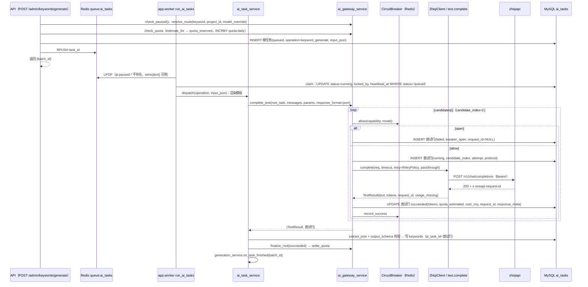
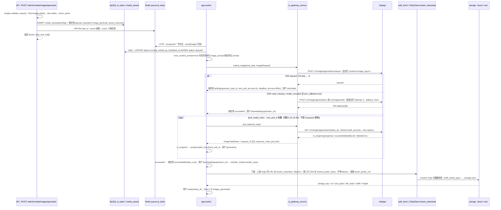
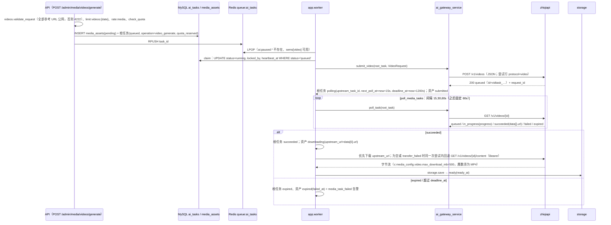
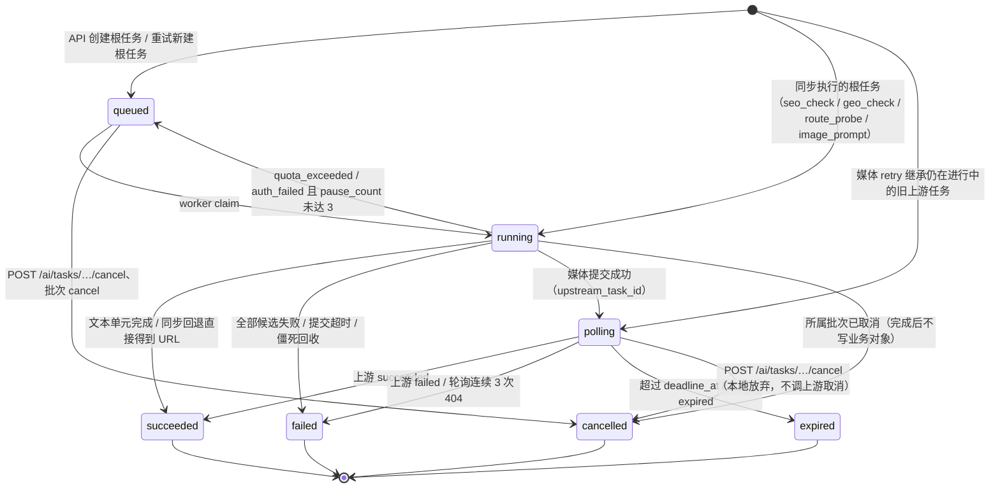
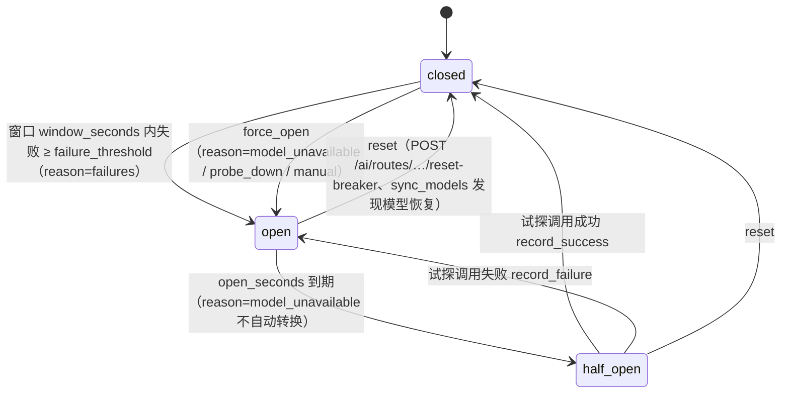
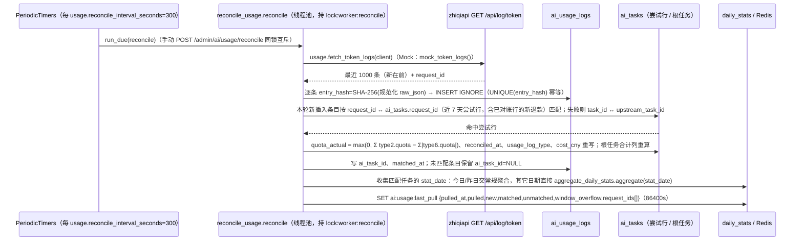

# 08 zhiqiapi 统一 AI 网关接入设计

> 本文是 zhiqiapi（志奇引擎）适配层与 AI 网关服务的权威设计：配置、客户端、三类能力（文本/图片/视频）的调用契约与代码级接口、能力路由与候选链、重试/熔断/超时、错误分类、`ai_tasks` 状态机、额度估算与 `/api/log/token` 对账、模型目录与价格同步、健康探测、Mock 实现、`ai_routing_config` 结构。[09-generation-pipeline](./09-generation-pipeline.md)、[10-media-generation](./10-media-generation.md)、[11-link-backfill-and-monitoring](./11-link-backfill-and-monitoring.md)、[12-dashboard-reports](./12-dashboard-reports.md) 只引用本文，不重复定义。
> 契约来源：只采用 BRIEF 已核实的 zhiqiapi 接口事实（§3.1 契约来源表）；标注「未核实」的细节一律以 zhiqiapi 官方文档为准，联调阶段逐项核对后再固化。
> 表结构见 [03-data-model](./03-data-model.md)，接口全表与业务码见 [04-api-spec](./04-api-spec.md)，完整 `.env` 清单见 [05-deployment](./05-deployment.md)，Redis 键与 worker 总表见 [01-architecture](./01-architecture.md)。

## 1. 目标

平台全部 AI 能力——关键词/标题/内容/重写的文本生成、图片生成、视频生成、SEO/GEO 收录检测的联网提问——统一经 zhiqiapi（new-api 系统一 AI 网关，基址 `https://zhiqiapi.com/v1`）接入。本文要达到的效果：

1. 一个客户端（`ZhiqiClient`）、一套错误分类（`error_category`）、一张任务表（`ai_tasks`）承载全部上游调用；业务模块只调用 `ai_gateway_service`，不直接发 HTTP。
2. 每次 HTTP 调用记录上游 `x-oneapi-request-id`；本地估算额度，定时拉取用量日志按 `request_id` 回填实扣额度，报表金额可复现。
3. 上游不稳定（整通道 500/503、参数白名单变更、模型下架又恢复）时，系统自动退避、熔断、切换备选模型并告警，且不重复计费。
4. `ZHIQI_API_KEY` 为空时全流程走本地 Mock，无密钥即可跑通验收。
5. 管理员在后台维护能力路由（「AI 网关 → 能力路由」：主模型 + 备选链）、同步模型目录与价格、一键测试模型健康、查看任务明细与对账结果。

本文不覆盖：Prompt 模板体系与生成业务编排（见 09）、媒体资产的业务生命周期与前端页面（见 10）、收录检测提供器与 GEO 引擎的判定逻辑（见 11）、报表指标口径（见 12）。

## 2. 核心决策

### 2.1 全部能力统一经 zhiqiapi

- 不接入第二家模型供应商；候选链中的备选模型同样必须是 zhiqiapi 模型目录内的模型。
- 能力与协议解耦：同一文本能力可配置为 `openai_chat`/`openai_responses`/`anthropic_messages` 任一协议，运行时由 `catalog.protocol_for` 按模型的 `supported_endpoint_types` 校正。
- 文本三协议、图片、视频共用一个 `ZhiqiClient`（httpx），共用 Bearer 鉴权、`request_id` 采集、错误分类与幂等重试。

### 2.2 异步优先

- 图片默认走 `POST /v1/images/generations/async` + 轮询；**仅当**异步提交返回 `route_missing`/`model_unrouted`（路由不存在/模型未路由）且 `media_config.image.sync_fallback=true` 时，在同一候选模型内回退同步 `POST /v1/images/generations`（有参考图默认走 `POST /v1/images/edits`，端点选择见 §6.5「图片同步回退端点」）。其它失败一律不回退，避免重复计费。
- 是否走同步只由上游返回决定：模型目录 `supported_endpoint_types` 未列 `image-generation-async` 的模型同样先发异步提交，**不**按目录预选同步（目录只用于判定该模型有无任何图片端点，无则按 §6.4「无可用端点」记 `model_unrouted`、不发 HTTP、切换候选）；`sync_fallback=false` 时异步提交返回的 `route_missing`/`model_unrouted` 按普通失败处理（`record_failure` 计入熔断，按 `fallback_on` 切换备选）。
- 视频只有任务式接口：`POST /v1/videos` 提交 → `GET /v1/videos/{id}` 轮询 → 下载。
- 文本首版固定非流式（`stream=False`），后台没有流式展示需求。
- 所有生成类接口只创建根任务并入队 `queue:ai_tasks`，由 `app.worker` 执行；API 进程不发起生成调用（同步执行的例外见 §7.4）。

### 2.3 无密钥即 Mock

`Settings.zhiqi_mock_mode = not zhiqi_api_key`。Mock 模式下 `get_client()` 返回 `MockZhiqiClient`：文本返回模板化假文、图片返回占位图、视频返回占位视频，目录/价格/用量日志返回伪数据；对账、熔断、健康探测、额度预占等流程与真实模式完全相同（§13）。

### 2.4 密钥只在环境变量

`ZHIQI_API_KEY` 只从 `server/app/core/config.py` 的 `Settings.zhiqi_api_key` 读取：不入 `settings` 表、不入 `ai_tasks.request_payload_json`、不入日志与接口响应；后台只显示 `zhiqi_mode: mock|live`。只有相对路径请求携带 `Authorization: Bearer`，`absolute=True` 的请求与第三方 CDN 下载不携带（§14）。

### 2.5 传输层与编排层分离

| 层 | 位置 | 职责 | 禁止 |
| --- | --- | --- | --- |
| 传输与契约 | `server/app/core/zhiqi/` | 请求体映射、响应解析、错误分类、按注入 `RetryPolicy` 的幂等重试、熔断器状态（Redis） | 读数据库、读 `settings` 表、写 `ai_tasks` |
| 编排 | `server/app/services/ai_gateway_service.py` | 路由解析、候选链、熔断判定、额度预占/结算、`ai_tasks` 根任务与尝试行记录、全局暂停、告警 | 直接拼 HTTP 请求 |
| 业务 | `ai_task_service`、`generation_service`、`media_service`、`index_check_service` 等 | 按 `operation + input_json` 分派、渲染模板、写回业务对象 | 直接调用 `core/zhiqi` |

`get_client()` 单例只持有 `base_url`/`api_key`/`timeouts`/`user_agent`；运行期可变参数（重试策略、熔断参数、超时、透传白名单）由 `ai_gateway_service` 每次按当前 `ai_routing_config` 构造并**按调用注入**，修改配置后下一次调用/下一轮 worker 循环即生效。

### 2.6 每次 HTTP 调用一行尝试行

`ai_tasks` 同时承载**根任务行**（一个业务单元的生命周期）与**尝试行**（一次实际 HTTP 调用）：候选切换、参数降级重试、`invalid_response` 重试、分段生成的每一段各占一行尝试行，`request_id`、`http_status`、tokens、额度、成本、错误分类均记在尝试行；轮询 `GET` 不记行（计入根任务 `poll_count`，`request_id` 记入根任务 `response_meta_json.poll`）；转存下载同样不记行（`request_id` 记入根任务 `response_meta_json.download`，§7.4 第 4 条）。报表的调用数/成功率/tokens/额度/成本按尝试行计算，批次计数与队列只看根任务行。记录规则见 §7.4。

## 3. 上游契约摘要

### 3.1 契约来源

| 项 | 来源 |
| --- | --- |
| 基址、Bearer 鉴权、`x-oneapi-request-id`；三协议文本端点；`/v1/models` 字段；`/api/pricing_new` 字段；`/api/log/token` 字段、`type` 语义与「最近 1000 条、无分页/时间过滤」限制；额度公式；图片异步/同步/编辑端点与字段、`unsupported_parameter`、`n=1`；视频 `/v1/videos` 必须 JSON、字段别名、状态集合、`/content`；可靠性事实；托管工具无法表达时被上游移除而不伪造 | **已核实**（BRIEF §3） |
| 轮询响应的 `expires_at`、失败体的 `error_code`/`error_message` 字段名；`anthropic-version: 2023-06-01` 头；Responses 的 `instructions`/`input` 形态与 `text.format`；`/v1/images/edits` 除 `image`/`model`/`prompt` 外的字段；按次计费公式中的 `× quota_per_unit`；`quota_per_unit` 默认 500000（500,000 额度 = 1 USD）的额度/美元换算比例；`annotations`/`citations` 结构；三协议 usage/缓存 tokens 的字段路径；`type=6` 退款的 `request_id` 语义；`passthrough` 白名单字段名；上游日志时间字段名；`/api/log/token` 条目的 `model_name` 字段名与条目 `id` 字段；404「路由不存在」的响应文案 | **未核实，以 zhiqiapi 官方文档为准** |

### 3.2 基址与鉴权

| 项 | 约定 |
| --- | --- |
| 基址 | `ZHIQI_BASE_URL=https://zhiqiapi.com/v1`；`Settings.zhiqi_origin` = `ZHIQI_BASE_URL` 去掉尾部 `/v1`（只去掉末段 `/v1`，保留协议、主机与其余路径前缀：`https://zhiqiapi.com/v1` → `https://zhiqiapi.com`），`ZhiqiClient.origin` 同值 |
| 路径拼接 | `/v1/*` 与 `/api/*`（管理接口 `/api/pricing_new`、`/api/log/token`）一律 `zhiqi_origin + path`；`anthropic_messages` 的 `POST /v1/messages` 同样由 `zhiqi_origin` 拼接，等价于「base 去掉尾部 `/v1`」（本项目不使用 Anthropic SDK，直接 httpx，不存在 SDK 自拼 `/v1/messages` 的双重前缀问题） |
| 鉴权 | `Authorization: Bearer <ZHIQI_API_KEY>`，仅相对路径请求携带 |
| 请求头 | `User-Agent: ZHIQI_USER_AGENT`（默认 `aicreat/0.1`）；`Content-Type: application/json`（multipart 仅用于 `/v1/images/edits`）；`anthropic-version: 2023-06-01` 仅 `anthropic_messages`（未核实） |
| 响应头 | `x-oneapi-request-id` 上游请求号：每次调用必须记录——尝试行 `ai_tasks.request_id`、轮询记入 `response_meta_json.poll.request_ids[]`、目录/价格/用量调用记入返回值 `request_ids` 并写 INFO 日志；下载调用（上游 origin URL 经 `ZhiqiClient.stream_download`、`GET /v1/videos/{id}/content` 经 `videos.download_content`，含以 `transfer_failed` 失败的下载）由返回的 `DownloadResult` 或抛出的 `ZhiqiError(TRANSFER_FAILED)` 带出 `request_id`，记入根任务 `response_meta_json.download{source, request_id, http_status, request_ids[]}`（§7.4 第 4 条）并写 INFO 日志 |
| 托管工具 | 模型无法表达的托管工具（如网页搜索）会被上游移除而不会伪造；`TextRequest.extra` 经 `ai_routing_config.passthrough` 白名单过滤后合并进请求体 |

**端点总表**（本文只使用下列 13 个上游端点；全部相对路径调用带 Bearer，并记录响应头 `x-oneapi-request-id`）：

| 用途 | 方法 / 路径 | 请求要点 | 响应要点 | 上游状态集合 | 详见 |
| --- | --- | --- | --- | --- | --- |
| 文本（OpenAI Chat） | `POST /v1/chat/completions` | JSON `model`、`messages[]`、`max_tokens`、`temperature`、`stream=false` | `choices[0].message.content`、`usage` | — | §3.3 |
| 文本（OpenAI Responses） | `POST /v1/responses` | JSON `model`、`instructions`、`input`、`max_output_tokens` | `output[]`、`usage` | — | §3.3 |
| 文本（Anthropic Messages） | `POST /v1/messages`（base 去尾部 `/v1`） | JSON `model`、`system`、`messages[]`、`max_tokens` | `content[]`、`usage` | — | §3.3 |
| 模型目录 | `GET /v1/models` | 无 | 每项 `id`/`owned_by`/`supported_endpoint_types` | — | §3.4 |
| 价格目录 | `GET /api/pricing_new`（需 Key） | 无 | 每模型价格字段 + 顶层 `vendors[]` | — | §3.5 |
| 用量日志 | `GET /api/log/token` | 无（固定返回最近 1000 条） | `request_id`、`quota`、tokens、`type`、`other{}` | `type` ∈ 2/5/6 | §3.6 |
| 图片异步提交 | `POST /v1/images/generations/async` | JSON `model`、`prompt`、`n:1`、`resolution`、`aspect_ratio`、`response_format:"url"`、`reference_image_urls?` | `202 {id:"task_…",status:"queued"}` | — | §3.7 |
| 图片任务轮询 | `GET /v1/images/generations/{task_id}` | 无 | `status`、`progress`、`data[0].url` | `queued`/`in_progress`/`succeeded`/`failed` | §3.7 |
| 图片同步生成 | `POST /v1/images/generations` | 同异步体 | `200 {data:[{url}]}` | — | §3.7 |
| 图片同步编辑 | `POST /v1/images/edits` | multipart：`image`（1~9 个公网 URL，重复字段）、`model`、`prompt`、`response_format` | `200 {data:[{url}]}` | — | §3.7 |
| 视频提交 | `POST /v1/videos`（必须 JSON） | `model`、`prompt` + 可选字段 | `200 {id:"vidtask_…",status:"queued"}` | — | §3.8 |
| 视频任务轮询 | `GET /v1/videos/{id}` | 无 | `status`、`progress`、`data[].url` | `queued`/`in_progress`/`succeeded`/`failed`/`expired` | §3.8 |
| 视频下载 | `GET /v1/videos/{id}/content` | 无 | 字节流 | — | §3.8 |

### 3.3 文本：三协议互转

| 协议 `protocol` | 端点 | 请求要点 | 响应要点 | 适用 |
| --- | --- | --- | --- | --- |
| `openai_chat` | `POST /v1/chat/completions` | `model`、`messages[]`、`max_tokens`、`temperature`、`top_p`、`stop`、`response_format`、`stream`（固定 `false`） | `choices[0].message.content`、`choices[0].finish_reason`、`usage.prompt_tokens/completion_tokens` | 默认协议（`ZHIQI_TEXT_DEFAULT_PROTOCOL=openai_chat`）；GEO 引擎与 `zhiqi_web_search` 默认协议 |
| `openai_responses` | `POST /v1/responses` | `model`、`instructions`、`input`、`max_output_tokens`、`temperature`、`top_p`、`text.format` | `output[].content[].text`、`status`、`usage.input_tokens/output_tokens` | gpt-5.x 系更适合；`chatgpt` GEO 引擎（`extra.tools=[{"type":"web_search"}]`） |
| `anthropic_messages` | `POST /v1/messages`（base 去尾部 `/v1`） | `model`、`system`、`messages[]`（仅 user/assistant）、`max_tokens`（必填）、`temperature`、`top_p`、`stop_sequences` | `content[].text`、`stop_reason`、`usage.input_tokens/output_tokens` | Claude 系模型 |

三个端点、`stream` 支持、「gpt-5.x 系更适合 Responses」与「base 去尾部 `/v1`」为已核实事实；表中请求/响应字段名按 OpenAI Chat / OpenAI Responses / Anthropic Messages 的公开协议书写，zhiqiapi 对各字段的实际支持范围以 zhiqiapi 官方文档为准（下表 `*` 标注项为联调时必须逐项核对的路径）。

**协议映射表**（`text.build_payload` / `text.parse_result` 的实现依据；`*` 标注的路径未核实，以 zhiqiapi 官方文档为准）：

| 项 | `openai_chat` | `openai_responses` | `anthropic_messages` |
| --- | --- | --- | --- |
| 端点 / 头 | `POST /v1/chat/completions` | `POST /v1/responses` | `POST /v1/messages`（base 去 `/v1`；头 `anthropic-version: 2023-06-01`\*） |
| system / messages | `messages[]`（`role=system` 在首位） | `instructions` = system；`input` = 其余 messages\* | `system` 独立字段；`messages` 仅 user/assistant |
| 最大输出 | `max_tokens`（降级重试改 `max_completion_tokens`） | `max_output_tokens` | `max_tokens` |
| `temperature` / `top_p` | 同名 | 同名 | 同名 |
| JSON 模式 | `response_format={"type":"json_object"}` | `text.format={"type":"json_object"}`\* | 无原生字段，靠提示词约束 + `extract_json` |
| `stop` | `stop` | 无（忽略） | `stop_sequences` |
| `extra` 白名单 | `passthrough.openai_chat` | `passthrough.openai_responses` | `passthrough.anthropic_messages` |
| 响应文本 | `choices[0].message.content` | `output[].content[].text`（`type=output_text` 拼接）\* | `content[].text`（`type=text` 拼接）\* |
| `finish_reason` | `choices[0].finish_reason` | `status` / `incomplete_details.reason`\* | `stop_reason` |
| prompt / completion tokens | `usage.prompt_tokens` / `usage.completion_tokens` | `usage.input_tokens` / `usage.output_tokens`\* | `usage.input_tokens` / `usage.output_tokens`\* |
| cache tokens | `usage.prompt_tokens_details.cached_tokens`\* | `usage.input_tokens_details.cached_tokens`\* | `usage.cache_read_input_tokens`\* |
| citations | `choices[0].message.annotations[]`（`url_citation`）\* → 无则解析 Markdown 链接/裸 URL | `output[].content[].annotations[]`\* → 同上 | `content[].citations[]`\* → 同上 |

### 3.4 模型目录 `GET /v1/models`

| 项 | 约定 |
| --- | --- |
| 端点 | `GET /v1/models`（Bearer；列表外层包装字段以 zhiqiapi 官方文档为准，解析按 OpenAI 列表约定兼容 `data[]`） |
| 请求字段 | 无 |
| 响应字段（每项） | `id`（模型 ID，与价格目录 `model_name` 同值，写入 `ai_models.model_id`）、`owned_by`、`supported_endpoint_types`（字符串数组） |
| `supported_endpoint_types` 取值示例 | `["openai"]`、`["openai-response"]`、`["anthropic"]`、`["openai-video"]`、`["image-generation","image-edit","image-generation-async"]` |
| 用途 | 协议预选（§6.5）与模态推导（§11.3）的唯一依据；`sync_models` 以模型是否出现于本端点维护 `ai_models.is_available`（§11.1） |

### 3.5 价格目录 `GET /api/pricing_new`（需 Key）

| 层级 | 字段 |
| --- | --- |
| 每模型 | `model_name`、`description`、`cover_url`、`tags`、`vendor_id`、`sort_order`、`quota_type`（0 按量 / 1 按次）、`model_ratio`、`model_price`、`completion_ratio`、`cache_ratio`、`create_cache_ratio`、`enable_groups`、`supported_endpoint_types`、`billing_mode`、`billing_expr`、`icon`、`model_price_type` |
| 顶层 | `vendors[]{id,name,icon,description}`、`model_parameter_capabilities`（可能为空）；模型条目列表的顶层键名以官方文档为准 |

### 3.6 用量日志 `GET /api/log/token`

| 项 | 约定 |
| --- | --- |
| 端点 | `GET /api/log/token`（origin 拼接；Bearer 为同一 Key） |
| 请求字段 | 无；固定返回该 Key **最近 1000 条**（新在前，无分页、无时间过滤） |
| 条目字段 | `request_id`（= 我方记录的 `x-oneapi-request-id`）、`group`、`quota`（实扣额度）、`prompt_tokens`/`completion_tokens`、`other{group_ratio, model_ratio, completion_ratio, cache_tokens, request_path}`、`type`、`task_id`（`type=6` 时） |
| `type` 语义 | 2 消费 / 5 失败（`quota=0`）/ 6 异步任务退款（带 `task_id`） |
| 额度公式 | `quota = (prompt_tokens + completion_tokens × completion_ratio) × model_ratio × group_ratio`（按次模型用 `model_price`） |
| 本地做法 | 调用时估算 + 定时拉取日志按 `request_id`（退款按 `task_id`）对账回填真实 `quota`（§10）；本地表字段映射见 §10.4 |

### 3.7 图片生成

| 调用 | 端点 | 请求 | 响应 / 状态 |
| --- | --- | --- | --- |
| 异步提交（默认） | `POST /v1/images/generations/async` | JSON `{model, prompt, n:1, resolution:"1080p"\|"2k"\|"4k", aspect_ratio:"1:1"\|"4:3"\|"3:4"\|"16:9"\|"9:16", response_format:"url", reference_image_urls?:[≤9 个公网 URL]}` | `202 {id:"task_…", status:"queued"}` |
| 轮询 | `GET /v1/images/generations/{task_id}` | — | `status: queued → in_progress`（`progress` 0~99）`→ succeeded`（`data[0].url`，托管在上游 CDN，**必须转存**）/ `failed`（错误含 `media_storage_*` 等） |
| 同步生成（回退） | `POST /v1/images/generations` | 同异步体（无 `async`） | `200 {data:[{url}]}` |
| 同步图生图（回退） | `POST /v1/images/edits` | multipart；`image` 字段为 1~9 个**公网 URL 字符串**（重复字段），不收文件/Base64；另含 `model`、`prompt`、`response_format=url` | `200 {data:[{url}]}` |

规则：契约外字段或枚举不符 → `400 unsupported_parameter`；不传 `size`/`quality`/`ratio`；`n` 固定 1，多图逐张创建独立根任务并行；同步路由曾长期不稳定，默认异步、仅 `route_missing`/`model_unrouted` 时回退同步。

### 3.8 视频任务（OpenAI Videos 风格）

| 调用 | 端点 | 请求 / 说明 | 响应 / 状态 |
| --- | --- | --- | --- |
| 提交 | `POST /v1/videos`（**必须 JSON**，multipart 返回 415） | 最小体 `{model, prompt}`；可选 `duration`（别名 `seconds`）、`resolution`（`480p\|720p\|1080p\|4k`）、`aspect_ratio`（别名 `ratio`，与 `size` 二选一）、`size`、`input_reference`（别名 `image`/`image_url`，图生视频参考图公网 URL）、`reference_image_urls[]`、`reference_video_urls[]`、`reference_audio_urls[]`、`first_frame_image_url`、`last_frame_image_url`、`negative_prompt`、`generate_audio`、`n` | `200 {id:"vidtask_…", status:"queued"}` |
| 轮询 | `GET /v1/videos/{id}` | 托管期间可能长时间停在 `in_progress` 99% | `queued / in_progress / succeeded / failed / expired`，结果 `data[].url` |
| 下载 | `GET /v1/videos/{id}/content` | 相对路径，带 Bearer | 字节流 |

所有素材必须是**公网可访问 URL**（本地 Mock 存储不可用于真实模式 → 需 `PUBLIC_BASE_URL` 为公网地址或对象存储公网地址）；轮询预算默认 20 分钟（`media_config.video.poll_budget_seconds=1200`）。

### 3.9 可靠性事实与设计响应

| 上游事实（已核实） | 设计响应 | 章节 |
| --- | --- | --- |
| 整通道 500/503 数小时 | 指数退避只用于幂等读与提交前错误；熔断按 `(capability, model)`；健康探测连续 2 次失败告警 `ai_upstream_unavailable`；候选链切换 | §8、§12 |
| 参数白名单临时变更（`unsupported_parameter`） | 文本做一次同模型参数降级重试，再切换备选；图片/视频直接切换备选；实际发送体记入 `request_payload_json` | §9 |
| 模型临时下架又恢复 | `sync_models` 把目录中消失的模型 `is_available=0` 并 `force_open(reason="model_unavailable")`，重新出现时 `reset()`；`resolve_route` 跳过不可用候选 | §11.4 |
| 读超时后上游可能已受理计费 | 非幂等 POST 不重发；图片/视频提交超时固定不回退、不切换；文本切换备选时必须记 `attempt`/`request_id` 供对账 | §8.2、§9 |
| 用量日志只保留最近 1000 条 | 对账间隔 300s，窗口溢出时降到 60s 并记 warning；溢出调用永久无法对账，以 `quota_reconciled_rate` 体现 | §10.6 |
| 上游临时 URL 会过期 | 轮询 `succeeded` 后立即转存，`media_assets.url` 只写转存后地址 | §7.2、§7.3 |

## 4. 配置

### 4.1 环境变量（`server/app/core/config.py` → `Settings`）

本节只列适配层相关变量；完整 `.env` 清单与 compose 覆盖规则见 [05-deployment](./05-deployment.md)。「seed」= 仅在启动时由 `settings_service.ensure_default_settings` 写入对应配置键的初值（键已存在不改写），运行期以数据库配置为准。

| 变量 | 默认值 | 说明 / 写入配置键 |
| --- | --- | --- |
| `ZHIQI_BASE_URL` | `https://zhiqiapi.com/v1` | 基址；Anthropic 协议自动去掉尾部 `/v1`；`/api/*` 自动取 origin |
| `ZHIQI_API_KEY` | 空 | 为空 → Mock 模式 |
| `ZHIQI_USER_AGENT` | `aicreat/0.1` | 请求 UA |
| `ZHIQI_TIMEOUT_CONNECT_SECONDS` | `10` | 连接超时（仅环境变量） |
| `ZHIQI_TIMEOUT_TEXT_SECONDS` | `180` | 文本读超时；seed `ai_routing_config.timeouts.text_seconds` |
| `ZHIQI_TIMEOUT_SUBMIT_SECONDS` | `60` | 图片/视频提交读超时；seed `timeouts.submit_seconds` |
| `ZHIQI_TIMEOUT_POLL_SECONDS` | `30` | 轮询读超时；seed `timeouts.poll_seconds` |
| `ZHIQI_TIMEOUT_DOWNLOAD_SECONDS` | `300` | 媒体下载超时 |
| `ZHIQI_MAX_RETRIES` | `3` | 客户端 HTTP 幂等重试次数；seed `retry.max_attempts` |
| `ZHIQI_RETRY_BASE_SECONDS` | `1.0` | 退避基数；seed `retry.base_seconds` |
| `ZHIQI_RETRY_MAX_SECONDS` | `30` | 退避上限；seed `retry.max_seconds` |
| `ZHIQI_BREAKER_FAILURE_THRESHOLD` | `5` | 窗口内失败次数触发熔断；seed `breaker.failure_threshold` |
| `ZHIQI_BREAKER_WINDOW_SECONDS` | `300` | 失败统计窗口；seed `breaker.window_seconds` |
| `ZHIQI_BREAKER_OPEN_SECONDS` | `120` | 熔断打开时长；seed `breaker.open_seconds` |
| `ZHIQI_TEXT_DEFAULT_MODEL` | 空 | `keyword/title/content/rewrite` 全局路由主模型初值（非 Mock 且为空 → 路由 `is_enabled=0` + 启动告警日志；Mock 固定 `mock-text`） |
| `ZHIQI_TEXT_DEFAULT_PROTOCOL` | `openai_chat` | 文本路由协议初值 |
| `ZHIQI_IMAGE_DEFAULT_MODEL` | 空 | `image` 路由主模型初值（Mock `mock-image`） |
| `ZHIQI_VIDEO_DEFAULT_MODEL` | 空 | `video` 路由主模型初值（Mock `mock-video`） |
| `ZHIQI_GEO_DEFAULT_MODEL` | 空 | `geo_check` 路由主模型初值（联网模型；Mock `mock-text`；只用于健康探测与默认 `params`，GEO 引擎实际模型取 `geo_engines.engines[].model`） |
| `ZHIQI_SEO_DEFAULT_MODEL` | 空 | `seo_check` 路由主模型初值（联网模型；Mock `mock-text`） |
| `ZHIQI_IMAGE_POLL_BUDGET_SECONDS` | `600` | seed `media_config.image.poll_budget_seconds` |
| `ZHIQI_VIDEO_POLL_BUDGET_SECONDS` | `1200` | seed `media_config.video.poll_budget_seconds` |
| `ZHIQI_IMAGE_SYNC_FALLBACK` | `true` | seed `media_config.image.sync_fallback` |
| `ZHIQI_USAGE_RECONCILE_INTERVAL_SECONDS` | `300` | seed `ai_routing_config.usage.reconcile_interval_seconds`（0 关闭） |
| `ZHIQI_MODELS_SYNC_INTERVAL_SECONDS` | `3600` | seed `catalog.sync_interval_seconds` |
| `ZHIQI_HEALTH_PROBE_INTERVAL_SECONDS` | `600` | seed `health.probe_interval_seconds`（0 关闭自动探测） |
| `ZHIQI_QUOTA_PER_UNIT` | `500000` | 额度/USD；seed `pricing.quota_per_unit`（「500,000 额度 = 1 USD」的换算比例未核实，以 zhiqiapi 官方文档为准，可经 `ai_routing_config.pricing.quota_per_unit` 修正） |
| `ZHIQI_USD_CNY_RATE` | `7.2` | 汇率；seed `pricing.usd_cny_rate` |
| `ZHIQI_GROUP_RATIO` | `1.0` | 本 Key 分组倍率；seed `pricing.group_ratio`（对账后以日志 `group_ratio` 为准） |
| `AI_MAX_CONCURRENCY_TEXT` / `AI_MAX_CONCURRENCY_IMAGE` / `AI_MAX_CONCURRENCY_VIDEO` | `4` / `2` / `1` | worker 进程内按模态的 `BoundedSemaphore` 上限（线程池大小 = 三者之和 + 2） |
| `AI_DAILY_QUOTA_LIMIT` / `AI_PROJECT_MONTHLY_QUOTA_LIMIT` | `0` / `0` | 本地估算额度上限（0 不限）；seed `generation_config.quota.daily_limit` / `project_monthly_limit` |
| `GENERATE_RATE_LIMIT` / `MEDIA_RATE_LIMIT` | `60/hour` / `20/hour` | 每管理员文本 / 媒体生成请求频控；seed `generation_config.rate_limits.generate_per_admin` / `media_per_admin`（§8.6） |
| `WORKER_POLL_INTERVAL_SECONDS` | `2` | `app.worker` 主循环休眠秒数（有任务时不休眠）；配置修改「下一轮生效」的粒度即此值 |
| `WORKER_STALE_TASK_MINUTES` | `10` | 根任务心跳超时回收阈值 |
| `PUBLIC_BASE_URL` | `http://127.0.0.1:8100` | 真实模式下参考素材 URL 与 Mock 占位图的对外地址，必须是浏览器与 zhiqiapi 都能访问的公网地址；主机非公网时 `GET /api/v1/health` 的 `warnings[]` 提示 |

`Settings` 派生属性：`zhiqi_mock_mode`（`not zhiqi_api_key`）、`zhiqi_origin`（去掉 `/v1`）。

### 4.2 `ai_routing_config`（`settings` 表，`locale='*'`）

```json
{
  "version": 1,
  "retry": { "max_attempts": 3, "base_seconds": 1.0, "max_seconds": 30, "jitter": true, "retry_on": ["upstream_unavailable", "rate_limited", "timeout", "invalid_response"] },
  "breaker": { "failure_threshold": 5, "window_seconds": 300, "open_seconds": 120, "half_open_max_calls": 1 },
  "fallback": { "enabled": true, "fallback_on": ["upstream_unavailable", "rate_limited", "timeout", "route_missing", "model_unrouted", "breaker_open", "media_storage", "invalid_response", "unsupported_parameter", "unknown"], "never_fallback_on": ["quota_exceeded", "auth_failed", "content_blocked", "transfer_failed", "cancelled"] },
  "pause_seconds": 600,
  "passthrough": { "openai_chat": ["tools", "tool_choice", "web_search_options", "reasoning_effort"], "openai_responses": ["tools", "tool_choice", "reasoning", "text"], "anthropic_messages": ["tools", "thinking"] },
  "timeouts": { "text_seconds": 180, "submit_seconds": 60, "poll_seconds": 30 },
  "pricing": { "quota_per_unit": 500000, "usd_cny_rate": 7.2, "group_ratio": 1.0 },
  "health": { "probe_interval_seconds": 600, "probe_text_prompt": "ping", "probe_max_tokens": 8, "probe_media": false, "degraded_latency_ms": 15000 },
  "catalog": { "sync_interval_seconds": 3600, "hide_unavailable_after_days": 7 },
  "usage": { "reconcile_interval_seconds": 300, "min_interval_seconds": 60, "max_new_per_pull_warn": 800, "unmatched_retention_days": 30 }
}
```

| 节 | 作用 | 生效方式 |
| --- | --- | --- |
| `retry` | 只管**客户端 HTTP 层幂等重试**（`RetryPolicy`）：幂等 GET（轮询/目录/用量）按 `retry_on` 全量生效；非幂等 POST 仅在 `ZhiqiError.retryable=True`（提交前错误）或 `rate_limited` 时生效 | `get_retry_policy(config)` 每次调用构造 |
| `breaker` | 熔断阈值/窗口/打开时长/半开试探次数 | `get_breaker(config)` 每次调用构造，`permanent_ttl = max(open_seconds, catalog.sync_interval_seconds) + 60` |
| `fallback` | 候选链切换条件；`never_fallback_on` 优先；只作用于**提交阶段**（文本调用与媒体提交），媒体轮询阶段固定只对 `media_storage` 回退；图片/视频提交阶段自动剔除 `timeout` | `is_fallbackable(category, config)` |
| `pause_seconds` | `ai:paused:{reason}` 键的 TTL | `record_failure` 写键时使用 |
| `passthrough` | `TextRequest.extra` 的按协议透传白名单（键名以 zhiqiapi 官方文档为准），实际发送内容记入 `ai_tasks.request_payload_json` | `build_payload` |
| `timeouts` | 文本/提交/轮询读超时的全局值（路由级 `timeout_seconds` 优先，§6.6） | 每次调用读取 |
| `pricing` | 额度 → 人民币换算参数，成本在任务终态/对账时按当时参数写入 | `quota_to_cny` |
| `health` | 自动探测间隔、探测提示词、是否真实提交媒体、`degraded` 延迟阈值（须小于探测固定 timeout 30s） | worker `PeriodicTimers.run_due` 每轮读取 |
| `catalog` | 目录同步间隔、后台隐藏久未出现模型的天数 | 同上 |
| `usage` | 对账间隔、溢出时的最小间隔、单次新增条数告警阈值、未匹配退款条目保留天数 | 同上 |

### 4.3 参数生效规则

1. 环境变量中标注 seed 的值只在首次启动写入 `settings`；之后管理员在「系统配置 → AI 路由」Tab（`settings/Index.vue`）经 `PUT /admin/settings/ai_routing_config`（权限 `system.settings.update`，按 `app/schemas/settings.py` 同名模型校验）修改这些全局路由参数（重试/熔断/回退/超时等）；各能力的主模型与备选链不在此处维护，而在「AI 网关 → 能力路由」（`ai/Routes.vue`，§6.7、§12.5）。
2. 读取经 `settings_service.get_config(db, "ai_routing_config")`，Redis 缓存 `cache:settings:ai_routing_config:*` 60s；保存后 `cache_delete_prefix("cache:settings:")`。
3. API 进程每次调用时构造 `RetryPolicy`/`CircuitBreaker`；worker 主循环每轮读取一次（进程循环骨架见 [01-architecture](./01-architecture.md)），周期任务间隔 `health.probe_interval_seconds`/`catalog.sync_interval_seconds`/`usage.reconcile_interval_seconds` 每轮读取，0 表示关闭。
4. `GET /admin/settings/runtime`（已登录即可读）只暴露 `zhiqi_mode`，不暴露本键的其它内容。

## 5. 适配层模块划分与接口签名

### 5.1 模块一览（`server/app/core/zhiqi/` 与编排服务）

| 文件 | 职责 | 依赖 | 调用方 |
| --- | --- | --- | --- |
| `__init__.py` | `get_client()`；导出 `Capability`/`Protocol`/`ErrorCategory` | `config` | 全部 |
| `types.py` | 能力/协议/错误/任务状态枚举、`Timeouts`、`RetryPolicy`、请求/结果 dataclass（含媒体下载结果 `DownloadResult`） | — | 全部（含 `safe_fetch.stream_public_bytes`） |
| `errors.py` | `ZhiqiError`、`ZhiqiBreakerOpen`、`classify_error`、`is_retryable`、`is_fallbackable`、`classify_task_failure` | `types` | `client`、`ai_gateway_service`、`poll_media_tasks` |
| `client.py` | `ZhiqiClient`（httpx、Bearer、`x-oneapi-request-id`、按注入 `RetryPolicy` 的幂等重试、`stream_download`） | `types`、`errors`、`safe_fetch` | `text`/`images`/`videos`/`catalog`/`usage`/`health` |
| `text.py` | 三协议文本调用、`build_payload`、`parse_result`、`extract_citations`、`extract_json` | `client` | `ai_gateway_service.complete_text`、`health.probe` |
| `images.py` | 异步提交/轮询、同步生成/编辑、`build_async_payload`、`validate_request` | `client` | `ai_gateway_service.submit_image/poll_task`、`media.py` |
| `videos.py` | 提交/轮询/字节流下载、`build_payload`、`validate_request` | `client` | `ai_gateway_service.submit_video/poll_task`、`transfer_media` |
| `catalog.py` | `/v1/models` 与 `/api/pricing_new` 拉取、`derive_modalities`、`protocol_for` | `client` | `sync_models`、`ai_gateway_service` |
| `usage.py` | `/api/log/token` 拉取、`estimate_quota`、`estimate_tokens`、`quota_to_cny` | `client` | `reconcile_usage`、`ai_gateway_service.estimate_for` |
| `health.py` | 单模型最小探测 `probe`、`status_from` | `text`/`images`/`videos`/`catalog` | `health_probe`、`POST /admin/ai/routes/{id}/test`、`POST /admin/ai/health/probe` |
| `breaker.py` | `CircuitBreaker`（Redis 状态） | `redis` | `ai_gateway_service`、`sync_models`、`health_probe`、`POST …/reset-breaker` |
| `mock.py` + `mock_assets/` | `MockZhiqiClient` 与占位结果（`placeholder.png`、`placeholder.mp4`） | `client`、`redis` | `get_client()` |
| `services/ai_gateway_service.py` | 路由解析、候选链、额度、`ai_tasks` 记录、暂停、告警 | 以上全部 + `models`、`settings_service`、`ai_catalog_service`（目录项读取与缓存回填，§11.1）、`alert_service` | `ai_task_service`、各 API、`index_providers` |

### 5.2 `types.py`

```python
class Capability(str, Enum):
    KEYWORD = "keyword"; TITLE = "title"; CONTENT = "content"; REWRITE = "rewrite"
    IMAGE = "image"; VIDEO = "video"; GEO_CHECK = "geo_check"; SEO_CHECK = "seo_check"

TEXT_CAPABILITIES = {Capability.KEYWORD, Capability.TITLE, Capability.CONTENT, Capability.REWRITE, Capability.GEO_CHECK, Capability.SEO_CHECK}
# 能力 → 模态（ai_models.modalities_json）：TEXT_CAPABILITIES → "text"；IMAGE → "image"；VIDEO → "video"
MODALITY_OF: dict[Capability, str] = {**{c: "text" for c in TEXT_CAPABILITIES}, Capability.IMAGE: "image", Capability.VIDEO: "video"}

class Protocol(str, Enum):
    OPENAI_CHAT = "openai_chat"; OPENAI_RESPONSES = "openai_responses"; ANTHROPIC_MESSAGES = "anthropic_messages"
    IMAGE_ASYNC = "image_async"; IMAGE_SYNC = "image_sync"; IMAGE_EDIT = "image_edit"; VIDEO = "video"

class ErrorCategory(str, Enum):
    UNSUPPORTED_PARAMETER = "unsupported_parameter"; ROUTE_MISSING = "route_missing"; MODEL_UNROUTED = "model_unrouted"
    UPSTREAM_UNAVAILABLE = "upstream_unavailable"; RATE_LIMITED = "rate_limited"; TIMEOUT = "timeout"
    QUOTA_EXCEEDED = "quota_exceeded"; AUTH_FAILED = "auth_failed"; CONTENT_BLOCKED = "content_blocked"
    MEDIA_STORAGE = "media_storage"; TRANSFER_FAILED = "transfer_failed"
    INVALID_RESPONSE = "invalid_response"; BREAKER_OPEN = "breaker_open"; CANCELLED = "cancelled"; UNKNOWN = "unknown"

class TaskStatus(str, Enum):      # 上游异步任务状态（图片/视频）
    QUEUED = "queued"; IN_PROGRESS = "in_progress"; SUCCEEDED = "succeeded"; FAILED = "failed"; EXPIRED = "expired"

@dataclass(frozen=True)
class Timeouts:
    connect: float = 10.0; read: float = 180.0; write: float = 30.0; pool: float = 10.0

@dataclass(frozen=True)
class RetryPolicy:                 # 客户端 HTTP 层幂等重试策略，由 ai_gateway_service 按 ai_routing_config.retry 构造并按调用注入
    max_attempts: int = 3; base_seconds: float = 1.0; max_seconds: float = 30.0; jitter: bool = True
    retry_on: frozenset[ErrorCategory] = frozenset({ErrorCategory.UPSTREAM_UNAVAILABLE, ErrorCategory.RATE_LIMITED, ErrorCategory.TIMEOUT, ErrorCategory.INVALID_RESPONSE})

@dataclass
class Citation:
    url: str; title: str | None = None; snippet: str | None = None; source: str = "annotation"   # annotation / markdown_link / plain_url / mock

@dataclass
class TextRequest:
    model: str; protocol: Protocol
    messages: list[dict[str, str]]                       # [{"role":"system"|"user"|"assistant","content":str}]
    max_tokens: int = 2048; temperature: float = 0.7; top_p: float | None = None
    response_format: str = "text"                        # text / json（json 时 chat 走 response_format={"type":"json_object"}，responses 走 text.format，anthropic 靠提示词约束）
    stream: bool = False; stop: list[str] | None = None
    extra: dict[str, Any] = field(default_factory=dict)  # 透传上游字段（白名单见 ai_routing_config.passthrough，build_payload 按协议过滤）；GEO 引擎/SEO 提供器的 extra 由此传入
    metadata: dict[str, Any] = field(default_factory=dict)  # 本地用：capability、task_id、target_url（seo_check/geo_check 的目标链接 URL，写入规则见 §5.13）；不发送：build_payload 不读取，只经 client.request(metadata=…) 交给 MockZhiqiClient（§5.12）

@dataclass
class TextResult:
    text: str; model: str; request_id: str | None
    prompt_tokens: int = 0; completion_tokens: int = 0; cache_tokens: int = 0
    usage_missing: bool = False                          # 响应缺少 usage 字段时 True（网关写 response_meta_json.usage_missing）
    finish_reason: str | None = None; citations: list[Citation] = field(default_factory=list)
    latency_ms: int = 0; http_status: int = 200; raw: dict[str, Any] = field(default_factory=dict)

@dataclass
class ImageRequest:
    model: str; prompt: str
    resolution: str = "1080p"; aspect_ratio: str = "16:9"; n: int = 1; response_format: str = "url"
    reference_image_urls: list[str] = field(default_factory=list)   # ≤ 9 个公网 URL

@dataclass
class ImageSubmitResult:
    mode: str                              # async / sync / edit
    task_id: str | None; status: TaskStatus | None
    urls: list[str]                        # sync/edit 直接返回
    request_id: str | None; latency_ms: int; http_status: int; raw: dict[str, Any]

@dataclass
class ImageTaskStatus:
    task_id: str; status: TaskStatus; progress: int
    urls: list[str]; error_code: str | None; error_message: str | None      # 字段名以官方文档为准
    request_id: str | None; raw: dict[str, Any]

@dataclass
class VideoRequest:
    model: str; prompt: str
    duration: int | None = None; resolution: str | None = None; aspect_ratio: str | None = None; size: str | None = None
    input_reference: str | None = None
    reference_image_urls: list[str] = field(default_factory=list)
    reference_video_urls: list[str] = field(default_factory=list)
    reference_audio_urls: list[str] = field(default_factory=list)
    first_frame_image_url: str | None = None; last_frame_image_url: str | None = None
    negative_prompt: str | None = None; generate_audio: bool | None = None; n: int = 1

@dataclass
class VideoSubmitResult:
    task_id: str; status: TaskStatus; request_id: str | None; latency_ms: int; http_status: int; raw: dict[str, Any]

@dataclass
class VideoTaskStatus:
    task_id: str; status: TaskStatus; progress: int
    urls: list[str]; error_code: str | None; error_message: str | None
    expires_at: datetime | None; request_id: str | None; raw: dict[str, Any]   # expires_at 字段名以官方文档为准

@dataclass
class DownloadResult:              # 媒体下载结果：ZhiqiClient.stream_download / videos.download_content / safe_fetch.stream_public_bytes 共用（§5.4、§7.4 第 4 条）
    source: str                    # origin（上游 origin 的 upstream_url）/ content（GET /v1/videos/{id}/content）/ cdn（第三方 CDN）/ mock（MockZhiqiClient 复制占位文件）
    request_id: str | None         # 本次下载响应头 x-oneapi-request-id；cdn 恒为 None；Mock 为 "mock-" + uuid4 hex
    http_status: int               # 下载响应状态码（cdn 为最终一跳的状态码）；失败不返回本结构，改抛 ZhiqiError(TRANSFER_FAILED)
    request_ids: list[str] = field(default_factory=list)   # 本次调用收到的全部非空 request_id（单次 HTTP 即 [request_id]；cdn 为 []），由 transfer_media 追加到 response_meta_json.download.request_ids[]

@dataclass
class ModelInfo:
    id: str; owned_by: str | None; supported_endpoint_types: list[str]

@dataclass
class PricingEntry:
    model_name: str; description: str | None; cover_url: str | None; tags: list[str]; vendor_id: int | None
    sort_order: int; quota_type: int; model_ratio: float | None; model_price: float | None
    completion_ratio: float | None; cache_ratio: float | None; create_cache_ratio: float | None
    enable_groups: list[str]; supported_endpoint_types: list[str]; billing_mode: str | None
    billing_expr: str | None; icon: str | None; model_price_type: str | None; raw: dict[str, Any]

@dataclass
class PricingCatalog:
    models: list[PricingEntry]; vendors: list[dict[str, Any]]; model_parameter_capabilities: dict[str, Any]

@dataclass
class UsageLogEntry:
    request_id: str; log_type: int; model_name: str | None; group: str | None; quota: int
    prompt_tokens: int; completion_tokens: int; cache_tokens: int
    group_ratio: float | None; model_ratio: float | None; completion_ratio: float | None
    request_path: str | None; task_id: str | None; created_at: datetime | None; raw: dict[str, Any]

@dataclass
class HealthResult:
    capability: Capability; model: str; protocol: Protocol; status: str      # healthy / degraded / down；unknown 仅见于 image/video 在 probe_media=False 且 model_available=None（ai_models 无该行）时（§12.1）
    latency_ms: int; request_id: str | None; error_category: ErrorCategory | None; error_message: str | None
    checked_at: datetime
```

### 5.3 `errors.py`

```python
class ZhiqiError(Exception):
    def __init__(self, category: ErrorCategory, message: str, *, http_status: int | None = None,
                 request_id: str | None = None, retryable: bool = False, pre_submit: bool = False, raw: dict | None = None): ...
    category: ErrorCategory; message: str; http_status: int | None; request_id: str | None
    retryable: bool        # = is_retryable(category) AND (请求幂等 OR pre_submit)；HTTP 500/504 固定 False；HTTP 502/503 仅 idempotent=True 时为 True
    pre_submit: bool       # True = 请求未发出（ConnectError/ConnectTimeout/PoolTimeout），重发不会重复计费
    raw: dict

class ZhiqiBreakerOpen(ZhiqiError): ...        # category 固定 BREAKER_OPEN，不发起 HTTP

def classify_error(http_status: int | None, body: dict | str | None, exc: Exception | None = None) -> tuple[ErrorCategory, bool]: ...   # (category, pre_submit)
def is_retryable(category: ErrorCategory) -> bool: ...          # 类别层面：仅 UPSTREAM_UNAVAILABLE / RATE_LIMITED / TIMEOUT / INVALID_RESPONSE
def is_fallbackable(category: ErrorCategory, config: dict) -> bool: ...   # 按 ai_routing_config.fallback（never_fallback_on 优先）
def classify_task_failure(error_code: str | None, error_message: str | None) -> ErrorCategory: ...
    # 异步任务 failed 体：含 media_storage_* → MEDIA_STORAGE；含审核文案（content_policy/moderation/sensitive/safety/敏感/违规）→ CONTENT_BLOCKED；其它 → UNKNOWN
```

`classify_error` 的判定顺序见 §9.1；`error_message` 写入 `ai_tasks.error_message` 前截断至 500 字符并脱敏（去掉 Bearer、URL 查询串中的 key）。

### 5.4 `client.py`

```python
@dataclass
class ZhiqiResponse:
    http_status: int; json: dict[str, Any] | list | None; text: str; headers: dict[str, str]
    request_id: str | None; latency_ms: int

# DownloadResult(source, request_id, http_status, request_ids) 定义在 types.py（§5.2），stream_download 与 safe_fetch.stream_public_bytes 共用

class ZhiqiClient:
    def __init__(self, *, base_url: str, api_key: str, timeouts: Timeouts, user_agent: str): ...   # 不持有重试/熔断参数
    @property
    def is_mock(self) -> bool: ...                                   # False
    @property
    def origin(self) -> str: ...                                     # base_url 去掉尾部 /v1
    def request(self, method: str, path: str, *, json: dict | None = None,
                data: dict | list[tuple[str, str]] | None = None, files: list[tuple[str, Any]] | None = None,
                multipart: bool = False, timeout: float | None = None, idempotent: bool = False,
                absolute: bool = False, retry: RetryPolicy | None = None,
                metadata: dict[str, Any] | None = None) -> ZhiqiResponse: ...
        # path 以 /v1 开头 → base_url 的 origin 拼接；/api/* → origin 拼接；absolute=True 直接使用 path 且不带 Authorization（只带 User-Agent）
        # metadata 为本地上下文（文本调用传入 TextRequest.metadata，§5.5）：ZhiqiClient 忽略它，不进请求体、请求头与日志；只有 MockZhiqiClient 读取（§5.12）
        # retry=None 表示不重试；给定时：idempotent=True 按 retry.retry_on 全量指数退避重试；idempotent=False（POST）仅在 err.retryable（提交前错误）或 rate_limited（遵守 Retry-After）时重试；重试不产生新 ai_tasks 行，request_id 为最后一次 HTTP 的值
        # multipart=True 时 data 以 list[tuple] 作为 httpx files=[(name, (None, value)), …] 发送（支持重复键）；只传 data 不传 files 时为 urlencoded 表单
        # 非 2xx 抛 ZhiqiError(classify_error(...))，始终附带 request_id
    def get(self, path: str, **kw) -> ZhiqiResponse: ...             # idempotent=True
    def post(self, path: str, **kw) -> ZhiqiResponse: ...            # 默认 idempotent=False
    def stream_download(self, path: str, dest: BinaryIO, *, max_bytes: int, timeout: float, source: str = "origin",
                        allowed_content_types: tuple[str, ...] = ("image/", "video/", "application/octet-stream", "binary/octet-stream")) -> DownloadResult: ...
        # 只接受相对路径（GET /v1/videos/{id}/content，或 origin 等于 base_url origin 的 URL 去掉 origin 后的路径），带 Bearer；source 由调用方标注：origin（upstream_url）/ content（videos.download_content 传入）
        # 返回 DownloadResult(source, request_id, http_status, request_ids)；request_id 无论成败都从响应头 x-oneapi-request-id 读取（request_ids 为本次调用收到的非空值），并写 INFO 日志（method path http_status latency_ms request_id）
        # 绝对 URL（第三方 CDN）一律改走 safe_fetch.stream_public_bytes(url, dest, *, max_bytes, allowed_types, max_redirects=3, timeout) -> DownloadResult
        #   transfer_media 传 timeout=ZHIQI_TIMEOUT_DOWNLOAD_SECONDS（读超时，语义同 stream_download 的 timeout，§6.6）
        #   → DownloadResult(source="cdn", request_id=None, http_status=最终一跳状态码, request_ids=[])（CDN 无上游请求号）：follow_redirects=False、每跳先 assert_public_url 再请求、不带 Authorization（只带 User-Agent）
        # 超限 / Content-Type 不在集合 / 魔数校验失败（storage.sniff_media_type）/ 读取失败 抛 ZhiqiError(TRANSFER_FAILED)，并携带已收到响应头的 request_id 与 http_status（未收到响应时为 None）
        # 调用方 transfer_media 把成功返回的 DownloadResult 或异常中的 request_id/http_status 写入根任务 response_meta_json.download（§7.4 第 4 条）
        # MockZhiqiClient 覆写：/media/mock/ 路径直接复制本地文件，返回 source="mock"
    def close(self) -> None: ...

def get_client() -> ZhiqiClient: ...     # lru_cache；settings.zhiqi_api_key 为空 → MockZhiqiClient
def reset_client() -> None: ...          # 测试用
```

实现要点：

- 底层 `httpx.Client(timeout=httpx.Timeout(connect=timeouts.connect, read=timeouts.read, write=timeouts.write, pool=timeouts.pool), follow_redirects=False)`；单次调用的 `timeout` 参数只覆盖 read。
- `origin` 属性 = `base_url` 去掉尾部 `/v1`（只去掉末段，保留其余路径前缀，与 `Settings.zhiqi_origin` 同值，§3.2）；`/v1/*` 与 `/api/*` 路径一律 `origin + path`。
- `request_id = headers.get("x-oneapi-request-id")`，无论状态码都读取；异常（未收到响应头）时 `request_id=None`。
- 重试循环只在 `request()` 内：第 n 次失败后 `sleep(backoff(n))`（§8.2），所有历次 `request_id` 收集到 `ZhiqiResponse.headers["x-aicreat-retry-request-ids"]`（本文补充的实现约定：本地拼装、逗号分隔，不是上游响应头）供网关写 `response_meta_json.retry_request_ids[]`。
- 日志只记 `method path http_status latency_ms request_id`，不记请求体与密钥。

### 5.5 `text.py`

```python
class TextProvider(Protocol):
    def complete(self, client: ZhiqiClient, req: TextRequest, *, timeout: float, retry: RetryPolicy | None) -> TextResult: ...

def complete(client: ZhiqiClient, req: TextRequest, *, timeout: float | None = None, retry: RetryPolicy | None = None,
             passthrough: dict[str, list[str]] | None = None) -> TextResult: ...   # 按 req.protocol 分发
def complete_openai_chat(client, req, *, timeout, retry, passthrough) -> TextResult: ...        # POST /v1/chat/completions
def complete_openai_responses(client, req, *, timeout, retry, passthrough) -> TextResult: ...   # POST /v1/responses
def complete_anthropic_messages(client, req, *, timeout, retry, passthrough) -> TextResult: ... # POST /v1/messages（base 去掉尾部 /v1）
def build_payload(req: TextRequest, passthrough: dict[str, list[str]], *, degraded: bool = False) -> dict[str, Any]: ...
    # 协议对应请求体（§3.3 映射表）；extra 按 passthrough[req.protocol.value] 过滤后合并；degraded=True 为参数降级重试：去掉 response_format/temperature/top_p，max_tokens → max_completion_tokens（仅 chat）
def parse_result(protocol: Protocol, response: ZhiqiResponse, model: str) -> TextResult: ...  # 按映射表取值；usage 缺失记 0 且 usage_missing=True
def extract_citations(text: str, raw: dict[str, Any]) -> list[Citation]: ...
def extract_json(text: str) -> Any: ...                           # 去 ``` 围栏后 json.loads；失败抛 ZhiqiError(INVALID_RESPONSE)
```

- `stream` 首版固定 `False`；`TextRequest.stream=True` 时内部仍以非流式调用并忽略该字段。
- 三个 `complete_*` 以 `client.post(path, json=build_payload(req, …), metadata=req.metadata, …)` 调用。`build_payload` 不读取 `metadata`，因此 `capability`/`task_id`/`target_url` 不会进入上游请求体与 `ai_tasks.request_payload_json`，只供 `MockZhiqiClient` 识别模板、取目标 URL（§13.2）。
- `extract_citations` 顺序：先取响应 `annotations`/`citations` 字段（`source="annotation"`），无则解析回答中的 Markdown 链接（`source="markdown_link"`）与裸 URL（`source="plain_url"`）；Mock 回答 `source="mock"`。
- `anthropic_messages` 的 JSON 模式：`build_payload` 在 system 末尾追加「只输出 JSON，不要围栏」的约束句，解析仍经 `extract_json`。

### 5.6 `images.py`

```python
def submit_async(client: ZhiqiClient, req: ImageRequest, *, timeout: float, retry: RetryPolicy | None = None) -> ImageSubmitResult: ...
    # POST /v1/images/generations/async（JSON：model/prompt/n=1/resolution/aspect_ratio/response_format=url/reference_image_urls?）
    # 期望 202 {id:"task_…",status:"queued"}；失败直接抛 ZhiqiError —— 异步→同步/编辑回退不在此处，由 ai_gateway_service.submit_image 完成（§5.13，每次调用一行尝试行）
def get_generation(client: ZhiqiClient, task_id: str, *, timeout: float, retry: RetryPolicy | None = None) -> ImageTaskStatus: ...   # GET /v1/images/generations/{task_id}
def generate_sync(client: ZhiqiClient, req: ImageRequest, *, timeout: float) -> ImageSubmitResult: ...  # POST /v1/images/generations → 200 {data:[{url}]}
def edit_sync(client: ZhiqiClient, req: ImageRequest, *, timeout: float, extra_fields: tuple[str, ...] = ()) -> ImageSubmitResult: ...
    # POST /v1/images/edits multipart：data=[("image", u) for u in req.reference_image_urls] + [("model", …), ("prompt", …), ("response_format", "url")]
    #   + [(f, getattr(req, f)) for f in extra_fields]（extra_fields 来自 media_config.image.edit_extra_fields，默认空；resolution/aspect_ratio 未核实），multipart=True
    # 不做任何同尝试行内的重试：unsupported_parameter 直接抛出，由 ai_gateway_service 按 fallback_on 切换候选（一次 HTTP = 一行尝试行）
def build_async_payload(req: ImageRequest) -> dict[str, Any]: ...   # 不含 size/quality/ratio；n 固定 1
def validate_request(req: ImageRequest, media_config: dict) -> None: ...  # 枚举、参考图数量 ≤ 9、URL 公网（抛 BusinessError 4222）
```

### 5.7 `videos.py`

```python
def submit_video(client: ZhiqiClient, req: VideoRequest, *, timeout: float, retry: RetryPolicy | None = None) -> VideoSubmitResult: ...   # POST /v1/videos（JSON，禁止 multipart）→ 200 {id:"vidtask_…",status:"queued"}
def get_video(client: ZhiqiClient, task_id: str, *, timeout: float, retry: RetryPolicy | None = None) -> VideoTaskStatus: ...   # GET /v1/videos/{id}
def download_content(client: ZhiqiClient, task_id: str, dest: BinaryIO, *, max_bytes: int, timeout: float) -> DownloadResult: ...
    # GET /v1/videos/{id}/content（相对路径，带 Bearer；经 client.stream_download(…, source="content")）→ DownloadResult(source="content", request_id, http_status, request_ids)；失败抛 ZhiqiError(TRANSFER_FAILED) 同样携带 request_id
def build_payload(req: VideoRequest) -> dict[str, Any]: ...   # 只发送非 None 字段；aspect_ratio 与 size 二选一（同时给出时保留 aspect_ratio）；只用主字段名 duration/aspect_ratio/input_reference，不发别名
def validate_request(req: VideoRequest, media_config: dict) -> None: ...   # 分辨率枚举、时长范围、所有参考 URL（含 reference_audio_urls）公网
```

### 5.8 `catalog.py`

```python
def list_models(client: ZhiqiClient, *, timeout: float = 30) -> tuple[list[ModelInfo], str | None]: ...          # GET /v1/models → (models, request_id)
def list_pricing(client: ZhiqiClient, *, timeout: float = 30) -> tuple[PricingCatalog, str | None]: ...          # GET /api/pricing_new（origin 拼接，Bearer）→ (catalog, request_id)
def derive_modalities(supported_endpoint_types: list[str]) -> set[str]: ...
    # {"openai","openai-response","anthropic"} ∩ types 非空 → "text"
    # {"image-generation","image-edit","image-generation-async"} ∩ types 非空 → "image"
    # "openai-video" ∈ types → "video"
def protocol_for(model: ModelInfo | None, preferred: Protocol) -> Protocol | None: ...
    # model 由调用方经 ai_catalog_service.catalog_entry(db, model_id) 取得（读 cache:ai:models:catalog，键缺失时由 ai_models 回填，§11.1；core/zhiqi 不读库）
    # model=None（目录缺失：回填后目录中仍无该模型，如尚未完成首次 sync_models）→ 返回 preferred，交由上游 404 判定
    # 文本：preferred 可用则用之；否则按 openai → openai_chat、openai-response → openai_responses、anthropic → anthropic_messages 的顺序取首个可用；无文本端点返回 None（网关记 model_unrouted，不发起 HTTP）
    # 图片（preferred=image_async）：有任一图片端点（image-generation-async / image-generation / image-edit）→ 一律 image_async；目录未列 image-generation-async 也不预选同步（§2.2，同步只由上游 route_missing/model_unrouted 触发）；无图片端点返回 None
    # 视频：有 openai-video → video，否则 None
```

### 5.9 `usage.py`

```python
def fetch_token_logs(client: ZhiqiClient, *, timeout: float = 30) -> tuple[list[UsageLogEntry], str | None]: ...   # GET /api/log/token（最近 1000 条，新在前）→ (entries, request_id)
def estimate_quota(*, prompt_tokens: int, completion_tokens: int, model_ratio: float, completion_ratio: float,
                   group_ratio: float, quota_type: int, model_price: float | None, quota_per_unit: int) -> int: ...
    # quota_type=0：round((prompt_tokens + completion_tokens * completion_ratio) * model_ratio * group_ratio)
    # quota_type=1：round(model_price * quota_per_unit * group_ratio)（× quota_per_unit 未核实，以官方文档为准）
def estimate_tokens(text: str) -> int: ...     # 粗估：中文字符 ×1 + 其它按 4 字符/1 token；用于调用前预估与配额预占
def quota_to_cny(quota: int, *, quota_per_unit: int, usd_cny_rate: float) -> Decimal: ...
```

### 5.10 `health.py`

```python
def probe(client: ZhiqiClient, *, capability: Capability, model: str, protocol: Protocol,
          prompt: str = "ping", max_tokens: int = 8, timeout: float = 30, probe_media: bool = False,
          model_available: bool | None = None) -> HealthResult: ...
    # timeout 固定 30s（> health.degraded_latency_ms=15000，保证「成功但延迟 ≥ 15s → degraded」分支可达）
    # 文本能力：最小 TextRequest（不重试）
    # image：probe_media=False 时不发 HTTP，按调用方查得的 model_available（= ai_models.is_available；ai_models 无该行传 None）判定：
    #   True → healthy；False → down（error_category=model_unrouted，模型不在 /v1/models 目录）；None → unknown（目录数据不可用，§12.1）
    #   probe_media=True 时提交 1 张 1080p 1:1 并立刻返回提交结果
    # video 同 image（probe_media=True 时提交最小视频任务，不等待完成）
def status_from(latency_ms: int, error: ZhiqiError | None, degraded_latency_ms: int) -> str: ...
```

### 5.11 `breaker.py`

```python
class CircuitBreaker:
    def __init__(self, redis: Redis, *, failure_threshold: int = 5, window_seconds: int = 300,
                 open_seconds: int = 120, half_open_max_calls: int = 1, permanent_ttl_seconds: int = 3660): ...
        # 由 ai_gateway_service.get_breaker(config) 按当前 ai_routing_config.breaker 构造；permanent_ttl = max(open_seconds, catalog.sync_interval_seconds) + 60
    @staticmethod
    def key(capability: str, model: str) -> str: ...                # ai:breaker:{capability}:{model}
    def state(self, capability: str, model: str) -> str: ...        # closed / open / half_open（open 到期自动转 half_open；reason=model_unavailable 的 open 不自动转换）
    def reason(self, capability: str, model: str) -> str | None: ...   # failures / model_unavailable / probe_down / manual
    def allow(self, capability: str, model: str) -> bool: ...       # closed → True；half_open → 占用一次试探名额；open → False
    def record_success(self, capability: str, model: str) -> bool: ...   # half_open → closed，清空失败；返回是否发生 → closed 转换（调用方据此自动解决 ai_breaker_open）
    def record_failure(self, capability: str, model: str, category: ErrorCategory) -> bool: ...
        # 仅 upstream_unavailable / timeout / rate_limited / model_unrouted / route_missing / media_storage 计入；窗口内 ≥ threshold → open（reason=failures）；返回是否发生 非 open → open 转换（调用方 raise_alert）
    def force_open(self, capability: str, model: str, *, reason: str) -> bool: ...   # reason=model_unavailable 时写 permanent_ttl 且不自动半开；返回是否发生转换
    def reset(self, capability: str, model: str) -> bool: ...      # 删除键；返回是否原为 open/half_open（调用方自动解决告警）
    def snapshot(self) -> list[dict[str, Any]]: ...                 # 扫描 ai:breaker:* 供 /ai/health，含 reason
```

### 5.12 `mock.py`

```python
class MockZhiqiClient(ZhiqiClient):
    is_mock = True
    def request(self, method, path, **kw) -> ZhiqiResponse: ...
        # 按 path 分发到下列函数，request_id = "mock-" + uuid4 hex；每次文本/图片/视频调用向 mock:usage_logs LPUSH 一条伪日志（type=2，quota=估算值，含 request_id/model/tokens）并 LTRIM 0 999
        # 文本三路径透传本地上下文：mock_chat / mock_responses / mock_messages(kw["json"], kw.get("metadata") or {})（metadata 即 TextRequest.metadata，§5.4/§5.5）
    def stream_download(self, url_or_path, dest, *, max_bytes, timeout, source="origin", allowed_content_types=...) -> DownloadResult: ...
        # url 含 /media/mock/ 时直接从 app/core/zhiqi/mock_assets/ 复制文件到 dest，不发 HTTP（容器内不依赖 PUBLIC_BASE_URL 可达）；/v1/videos/{id}/content 同样复制 placeholder.mp4
        # 返回 DownloadResult(source="mock", request_id="mock-" + uuid4 hex, http_status=200, request_ids=[同一 request_id])（忽略调用方传入的 source）
def mock_chat(payload: dict, metadata: dict) -> dict: ...      # metadata：capability / task_id / target_url；geo_query / seo_query 命中分支的目标 URL 只取 metadata["target_url"]（§13.2）
def mock_responses(payload: dict, metadata: dict) -> dict: ... # 同上（chatgpt 引擎走 openai_responses）
def mock_messages(payload: dict, metadata: dict) -> dict: ...  # 同上
def mock_image_async(payload: dict) -> tuple[int, dict]: ...   # 202 {id:"task_mock_…",status:"queued"}
def mock_image_status(task_id: str) -> dict: ...
def mock_video_submit(payload: dict) -> dict: ...              # {id:"vidtask_mock_…",status:"queued"}
def mock_video_status(task_id: str) -> dict: ...
def mock_models() -> dict: ...
def mock_pricing() -> dict: ...
def mock_token_logs() -> dict: ...
```

行为规格见 §13。

### 5.13 `services/ai_gateway_service.py`（路由、候选链、记录、额度）

```python
@dataclass
class ResolvedRoute:
    route_id: int; capability: Capability; protocol: Protocol
    candidates: list[str]                  # [primary, *fallbacks]，已剔除 ai_models.is_available=0 的模型；有 model_override 时固定为 [model_override]
    unavailable_models: list[str]          # 被剔除的模型（写入 5031 的 data.unavailable_models）
    params: dict[str, Any]; timeout_seconds: int; max_attempts: int
    model_override: str | None = None      # 请求级/引擎级指定模型

def get_breaker(config: dict) -> CircuitBreaker: ...        # 按当前 ai_routing_config.breaker/catalog 构造（每次调用）
def get_retry_policy(config: dict) -> RetryPolicy: ...      # 按 ai_routing_config.retry 构造
def ensure_default_routes(db: Session) -> None: ...         # 8 条全局路由不存在则按当前模式 seed（INSERT … ON DUPLICATE KEY UPDATE id=id，幂等）；非 Mock 且 primary_model 以 mock- 开头则用环境变量替换；调用方持 lock:bootstrap
def check_paused() -> str | None: ...                       # 返回 ai:paused:* 的 reason（quota_exceeded/auth_failed）或 None；API 生成接口与 worker 领取前、以及 process_one 每次上游调用前调用
def resolve_route(db: Session, capability: Capability, project_id: int | None, *,
                  model_override: str | None = None, protocol_override: Protocol | None = None) -> ResolvedRoute: ...
    # 项目覆盖优先，其次全局；is_enabled=0 → BusinessError 5031；候选全部 is_available=0 → 5031（data.unavailable_models）；model_override 按 §6.4 固定规则
def check_quota(db: Session, *, project_id: int | None, estimated_quota: int, task: AiTask) -> None: ...
    # 日/项目月上限 → BusinessError 4291；通过则 INCRBY quota:daily / quota:project 并写 task.quota_reserved
    # estimated_quota 由调用方用 estimate_for(db, model=候选链首个模型, prompt_tokens=estimate_tokens(prompt), completion_tokens=params.max_tokens) 得到（额度单位）
def settle_quota(db: Session, task: AiTask, *, reserved: int, actual: int) -> None: ...
    # 根任务终态调用：INCRBY (actual - reserved)；失败/取消/熔断 actual=0 → INCRBY -reserved；回滚为 queued 的根任务不调用
def complete_text(db: Session, *, root_task: AiTask, messages: list[dict], params: dict | None,
                  response_format: str, extra: dict | None = None, segment_index: int | None = None,
                  model_override: str | None = None, protocol_override: Protocol | None = None) -> tuple[TextResult, AiTask]: ...
    # model_override 默认取 root_task.input_json.model（API 请求级覆盖）；GEO 引擎 / SEO 提供器显式传入引擎的 model/protocol
    # 组装 TextRequest 时写 metadata（capability、task_id）；root_task.capability ∈ {seo_check, geo_check} 且 root_task.target_type == "publish_link" 时，
    #   另按 root_task.target_id 读取该链接的 publish_links.url 写入 metadata["target_url"]（链接已不存在则不写）。metadata 只在本地传递（text.complete → client.request(metadata=…)），
    #   不发送、不写 request_payload_json；Mock 命中分支据此取目标 URL（sys_geo_query 默认模板不含 URL，§13.2）
    # 执行前 check_paused() 非空 → 不发起调用，把 root_task 回滚为 queued（规则同 quota_exceeded，见 record_failure）并抛 ZhiqiError(BREAKER_OPEN) 给调用方放弃本轮
    # 遍历 candidates：protocol = catalog.protocol_for(ai_catalog_service.catalog_entry(db, model), protocol_override or route.protocol)（目录缓存缺失时由 ai_models 回填，§11.1）；None → INSERT 尝试行(failed, model_unrouted, request_id=NULL) 不发 HTTP，下一候选
    # breaker.allow → INSERT 尝试行(root_task_id, 复制冗余列, candidate_index, attempt, segment_index, protocol, status=running) → text.complete(retry=policy, passthrough=cfg.passthrough, timeout=按 §6.6 规则)
    # 成功：写 tokens/quota_estimated/cost_cny/request_id/response_meta（usage_missing、retry_request_ids）→ breaker.record_success（→closed 时解决 ai_breaker_open）→ return (result, 尝试行)
    # 失败：record_failure(尝试行, err)；然后按 §9.2：unsupported_parameter → 同模型 1 次参数降级重试（build_payload(degraded=True)，新尝试行 attempt+1）；
    #   invalid_response → 同模型 1 次重新生成；rate_limited / err.pre_submit → 同模型再尝试直至 max_attempts；
    #   quota_exceeded / auth_failed → 立即返回（根任务已回滚 queued，不再遍历候选）；
    #   is_fallbackable 且无 model_override → 下一候选（candidate_index+1）；否则抛 BusinessError 5021（content_blocked 附 data.hint="prompt_blocked"，其它分类在有 model_override 时附 data.hint="model_override"）；全部候选失败 → 5031（含各候选错误；model_override 的唯一候选熔断打开时附 data.hint="model_override"，§6.4）
def submit_image(db: Session, *, root_task: AiTask, req: ImageRequest, model_override: str | None = None) -> tuple[ImageSubmitResult, AiTask]: ...
    # 候选链同上（model_override 默认取 root_task.input_json.model）；每候选 protocol = catalog.protocol_for(ai_catalog_service.catalog_entry(db, model), route.protocol)：
    #   None（目录中该模型无任何图片端点）→ 尝试行 failed(model_unrouted, request_id=NULL) 不发 HTTP，下一候选；
    #   否则一律先 images.submit_async（尝试行 protocol=image_async）——目录未列 image-generation-async 也先发异步，不按目录预选同步（§2.2）
    # 异步提交返回 ZhiqiError.category ∈ {ROUTE_MISSING, MODEL_UNROUTED} 且 media_config.image.sync_fallback → 该尝试行置 failed（保留 request_id/error_category，不调用 breaker.record_failure），
    #   INSERT 新尝试行（attempt+1，protocol 按 §6.5「图片同步回退端点」取 image_sync / image_edit，response_meta_json.fallback_from=上一尝试行 id）调用 generate_sync/edit_sync（edit_extra_fields 来自 media_config）；同步尝试也失败时才 record_failure 一次
    # sync_fallback=false 时异步提交的 ROUTE_MISSING/MODEL_UNROUTED 按普通失败处理：record_failure（计入熔断）后按 fallback_on 决定是否切换备选
    # timeout（提交读超时）固定不回退、不切换备选：根任务 failed(timeout)、资产 failed + media_task_failed 告警；其它失败不回退同步（避免重复计费），按 fallback_on 决定是否切换备选（有 model_override 时不切换）
def submit_video(db: Session, *, root_task: AiTask, req: VideoRequest, model_override: str | None = None) -> tuple[VideoSubmitResult, AiTask]: ...
    # 候选链同上；timeout 固定不回退（同 submit_image）
def poll_task(db: Session, root_task: AiTask) -> ImageTaskStatus | VideoTaskStatus: ...
    # 轮询不记尝试行；GET 使用 retry=policy、timeout=timeouts.poll_seconds；每次把 request_id/http_status/error 写入 root_task.response_meta_json.poll（request_ids 保留最近 20 个）
    # 抛出的 ZhiqiError 由 poll_media_tasks 处理（auth_failed/quota_exceeded → record_failure 但任务保持 polling；连续 3 次 404 → failed(route_missing)）
def record_failure(db: Session, attempt_task: AiTask, err: ZhiqiError) -> None: ...
    # 写 error_category/error_message/http_status/request_id；breaker.record_failure（非 open→open 时 raise_alert(ai_breaker_open, target_type=ai_model, target_key=f"{capability}:{model}")）；
    # quota_exceeded / auth_failed → SET ai:paused:{reason} EX pause_seconds + raise_alert(ai_quota_exceeded / ai_auth_failed, target_type=system)，
    #   并把所属根任务回滚：pause_count += 1；pause_count < 3 且根任务为 queue:ai_tasks 任务（非同步执行）→ status=queued、清空 locked_by/heartbeat_at/started_at，不 settle_quota、不 on_task_finished、不 RPUSH（由 recover_stale_tasks ③ 补扫）；
    #   pause_count >= 3 或同步执行的根任务 → 按常规 failed
def finalize_root(db: Session, root_task: AiTask, status: str) -> None: ...
    # 单元终态：汇总尝试行（tokens/quota/cost 求和，model/protocol/request_id/candidate_index 取最终成功行）、写 status/finished_at/duration_ms、settle_quota（同一事务）；回滚为 queued 时不调用
def estimate_for(db: Session, model: str, prompt_tokens: int, completion_tokens: int) -> int: ...   # 查 ai_models 价格快照 + ai_routing_config.pricing；quota_type=1 的媒体模型走 model_price 路径
```

`complete_text` 的 `params` 与路由默认参数合并规则：`effective = {**route.params, **(params or {})}`（调用方传入优先），其中 `max_tokens`/`temperature`/`top_p`/`stop` 映射到 `TextRequest` 同名字段，其它键忽略（上游透传只能经 `extra` + `passthrough` 白名单）。`submit_image`/`submit_video` 的 `req` 由 `media_service` 按 `media_config` 默认值与请求参数构造，路由 `params` 只在请求未指定时填充。

## 6. 能力枚举与能力→模型路由

### 6.1 能力枚举（`app.core.zhiqi.types.Capability`）

| 能力 `capability` | 模态 `MODALITY_OF` | 可用协议 | 对应根任务 `operation` | 默认模型环境变量（seed） |
| --- | --- | --- | --- | --- |
| `keyword` | `text` | `openai_chat` / `openai_responses` / `anthropic_messages` | `keyword_generate` | `ZHIQI_TEXT_DEFAULT_MODEL` |
| `title` | `text` | 同上 | `title_generate` | `ZHIQI_TEXT_DEFAULT_MODEL` |
| `content` | `text` | 同上 | `content_generate` / `content_outline` / `content_body` / `content_seo`；图片任务内嵌的 `image_prompt` | `ZHIQI_TEXT_DEFAULT_MODEL` |
| `rewrite` | `text` | 同上 | `content_rewrite` | `ZHIQI_TEXT_DEFAULT_MODEL` |
| `image` | `image` | `image_async`（回退 `image_sync` / `image_edit`） | `image_generate` | `ZHIQI_IMAGE_DEFAULT_MODEL` |
| `video` | `video` | `video` | `video_generate` | `ZHIQI_VIDEO_DEFAULT_MODEL` |
| `geo_check` | `text` | 引擎自身协议（`geo_engines.engines[].protocol`） | `geo_check` | `ZHIQI_GEO_DEFAULT_MODEL`（仅探测与默认 `params`） |
| `seo_check` | `text` | 提供器协议（`seo_providers.providers.zhiqi_web_search.protocol`） | `seo_check` | `ZHIQI_SEO_DEFAULT_MODEL` |

`modality`（`text`/`image`/`video`）是模型目录的属性（`ai_models.modalities_json`），与能力枚举不同义；`GET /admin/ai/models/options?modality=` 与 `ModelSelect.vue` 按模态过滤候选模型。另有 `operation=route_probe`（`trigger_type=health_probe`）用于健康探测，`capability` 取被探测路由的能力。

### 6.2 `capability_routes` 与默认路由

表结构见 [03-data-model](./03-data-model.md) `capability_routes`（`UNIQUE(capability, project_id)`；`project_id=0` 为全局，`>0` 为项目覆盖）。8 条全局路由由 `ai_gateway_service.ensure_default_routes(db)` 在 `main.py` 与两个 worker 启动时（持 `lock:bootstrap`）保证存在，seed 初值如下（`params_json` 的具体数值为本文按 BRIEF 原则补充的初值，管理员可改）：

| capability | protocol | primary_model（真实 / Mock） | fallback_models_json | params_json（seed） | timeout_seconds | max_attempts | is_enabled |
| --- | --- | --- | --- | --- | --- | --- | --- |
| `keyword` | `ZHIQI_TEXT_DEFAULT_PROTOCOL` | `ZHIQI_TEXT_DEFAULT_MODEL` / `mock-text` | `[]` | `{"temperature":0.7,"max_tokens":2048}` | NULL | 3 | 1（真实模式主模型为空时 0） |
| `title` | 同上 | 同上 | `[]` | `{"temperature":0.8,"max_tokens":1024}` | NULL | 3 | 同上 |
| `content` | 同上 | 同上 | `[]` | `{"temperature":0.7,"max_tokens":4096}` | NULL | 3 | 同上 |
| `rewrite` | 同上 | 同上 | `[]` | `{"temperature":0.7,"max_tokens":4096}` | NULL | 3 | 同上 |
| `image` | `image_async` | `ZHIQI_IMAGE_DEFAULT_MODEL` / `mock-image` | `[]` | `{"resolution":"1080p","aspect_ratio":"16:9"}`（= `media_config.image` 默认） | NULL | 3 | 同上 |
| `video` | `video` | `ZHIQI_VIDEO_DEFAULT_MODEL` / `mock-video` | `[]` | `{"resolution":"720p","duration":5,"aspect_ratio":"16:9","generate_audio":false}`（= `media_config.video` 默认） | NULL | 3 | 同上 |
| `geo_check` | `ZHIQI_TEXT_DEFAULT_PROTOCOL` | `ZHIQI_GEO_DEFAULT_MODEL` / `mock-text` | `[]` | `{"temperature":0.2,"max_tokens":1024}` | NULL | 3 | 同上 |
| `seo_check` | 同上 | `ZHIQI_SEO_DEFAULT_MODEL` / `mock-text` | `[]` | `{"temperature":0.2,"max_tokens":1024}` | NULL | 3 | 同上 |

- 非 Mock 且现有行 `primary_model` 以 `mock-` 开头时用环境变量替换并记日志；环境变量仍为空则 `is_enabled=0` + 启动告警日志，该能力的生成接口返回 5031。
- `geo_check` 路由只作健康探测对象与 GEO 引擎默认 `params` 来源；各 GEO 引擎实际使用 `geo_engines.engines[].model`（经 `model_override` 传入，不回退到本路由）。`seo_check` 路由在 `seo_providers.engines.<engine>.model` 为空时作为候选链使用。

### 6.3 路由解析 `resolve_route`

1. 取 `capability_routes` 中 `(capability, project_id)` 行；不存在则取 `(capability, 0)` 全局行。结果缓存 `cache:routes:{capability}:{project_id}` 60s，写路由（`PUT /admin/ai/routes/{id}`、`PUT /admin/projects/{id}/routes` 等）后 `cache_delete_prefix("cache:routes:")`。
2. `is_enabled=0` → `BusinessError(5031, data={"capability":…,"paused_reason":null})`。
3. `candidates = [primary_model, *fallback_models_json]`，逐个查 `ai_models.is_available`，为 0 的剔除并记入 `unavailable_models`；全部剔除 → 5031（`data.unavailable_models`）。候选在 `ai_models` 中**不存在**（尚未完成首次 `sync_models`，如 API 进程先于 worker 启动）时不剔除、不计入 `unavailable_models`，协议按 §6.5「目录缺失」返回 `preferred`、价格按 §10.1 缺省倍率估算（本文补充规则，保证 Mock 模式冒烟不依赖 worker 先完成同步）。
4. `model_override` 非空 → `candidates=[model_override]`（§6.4）。
5. `timeout_seconds`：项目行非空 > 全局行非空 > `ai_routing_config.timeouts.text_seconds`（文本）/ `submit_seconds`（图片/视频提交）。
6. `params`/`protocol`/`max_attempts` 取命中行的值（项目行存在时以项目行为准，不与全局行合并；项目行插入时这些列已从全局行复制）。

### 6.4 候选链与模型覆盖的固定规则

| 规则 | 内容 |
| --- | --- |
| 候选顺序 | `candidate_index` 0 = 主模型，1..n = 备选；每个候选至少一行尝试行；同候选内 service 级重试 `attempt` 递增且受 `max_attempts` 约束 |
| 切换条件 | 失败分类 `is_fallbackable(category, ai_routing_config.fallback)`（`never_fallback_on` 优先）且无 `model_override`；图片/视频提交阶段自动剔除 `timeout` |
| `model_override` | 来源：API 请求级 `model?`（记入 `input_json.model`）、`geo_engines.engines[].model`、`seo_providers.engines.<engine>.model`；非空时 `candidates=[model_override]`、不切换备选；仍受 `breaker.allow`、`ai_models.is_available`、`ai:paused:*` 约束；覆盖模型不可用或失败时的返回（与 [04-api-spec](./04-api-spec.md) §5.1/§5.2 一致）：不存在于 `ai_models`、`is_available=0` 或模态不符 → 创建时 400 `data={"model":…}`（见本表「API 侧校验」行）；熔断打开 → 5031 并附 `data.hint="model_override"`；上游调用失败 → 5021 `data.hint="model_override"`（`content_blocked` 与覆盖同时成立时取 `prompt_blocked`；`data.hint` 只出现在同步 HTTP 路径的响应中）；异步任务在 worker 内捕获，根任务记 `failed(<分类>)`，`error_message` 一律不附 hint 后缀，前端统一以任务摘要的 `model_override` 字段（`string\|null`，取根任务 `input_json.model`；文本与媒体相同，媒体不使用 `params.model`）非空识别「使用了覆盖模型、未切换备选」，以 `error_category=content_blocked` 识别上游拦截，返回任务摘要的 `GET /admin/generation-batches/{id}` 的 `tasks[]`、`GET /admin/contents/{id}/task`、`GET /admin/media/assets/{id}/task` 均带该字段；GEO/SEO 同步检测由调用方捕获后写入 `error_category`；`route_id` 仍取解析到的路由（只用其 `params`/`timeout_seconds`/`max_attempts`） |
| `protocol_override` | 非空时优先于 `route.protocol` 作为 `protocol_for` 的 `preferred`（GEO 引擎 / SEO 提供器） |
| API 侧校验 | `model?` 须存在于 `ai_models` 且 `is_available=1` 且 `modalities_json ∋ MODALITY_OF[capability]`，否则 400 `data={"model":…}`；GEO/SEO 引擎模型由 `PUT /admin/settings/geo_engines` / `seo_providers` 校验 |
| 熔断跳过 | `breaker.allow=False` 的候选不发起 HTTP，插入尝试行 `failed(breaker_open, request_id=NULL)` 后看下一候选 |
| 无可用端点 | `protocol_for` 返回 `None` → 尝试行 `failed(model_unrouted, request_id=NULL)`，下一候选 |
| 全部失败 | 抛 5031 `data={"capability","breaker_open":[…],"unavailable_models":[…],"paused_reason"}`（worker 内记根任务 `failed`，`error_category` 取最后一个候选的分类） |

### 6.5 协议预选 `catalog.protocol_for`

| 能力类型 | 输入 | 结果 |
| --- | --- | --- |
| 文本 | `preferred` ∈ 三协议；模型 `supported_endpoint_types` | `preferred` 对应端点可用则用之；否则按 `openai → openai_chat`、`openai-response → openai_responses`、`anthropic → anthropic_messages` 顺序取首个可用；无文本端点 → `None` |
| 图片 | `preferred=image_async`（`image` 路由协议固定 `image_async`）；模型 `supported_endpoint_types` | 有任一图片端点（`image-generation-async`/`image-generation`/`image-edit`）→ 一律 `image_async`（异步体自带 `reference_image_urls`，有无参考图均走异步）；目录未列 `image-generation-async` 也**不**预选同步——同步只由异步提交返回 `route_missing`/`model_unrouted` 且 `media_config.image.sync_fallback=true` 触发（§2.2）；无图片端点 → `None` |
| 图片同步回退端点 | 仅在上一行所述回退触发后、于同一候选模型内选择；是否有参考图；模型 `supported_endpoint_types` | 无参考图 → `image_sync`；有参考图：目录含 `image-edit` 或目录缺失 → `image_edit`，否则 → `image_sync`（同步体与异步体相同，携带 `reference_image_urls`） |
| 视频 | `preferred=video` | 有 `openai-video` → `video`，否则 `None` |
| 目录缺失 | `ai_catalog_service.catalog_entry` 返回 `None`：`cache:ai:models:catalog`（TTL `max(catalog.sync_interval_seconds, 3600) + 600`，§11.1）键缺失时先从 `ai_models.supported_endpoint_types_json` 回填，回填后目录中仍无该模型（`ai_models` 无该行，如尚未完成首次 `sync_models`） | 返回 `preferred`，交由上游 404 判定（`route_missing`/`model_unrouted`）；缓存过期不会落入本分支 |

尝试行 `ai_tasks.protocol` 写预选后的实际协议；根任务行冗余最终成功尝试行的值。

### 6.6 超时取值规则

| 调用 | 读超时取值（优先级从高到低） |
| --- | --- |
| 文本（含 `image_prompt`） | GEO 引擎 / SEO 提供器自带 `timeout_seconds`（仅该引擎调用）> `capability_routes.timeout_seconds`（项目行非空 > 全局行非空）> `ai_routing_config.timeouts.text_seconds`（180） |
| 图片/视频提交 | `capability_routes.timeout_seconds` > `timeouts.submit_seconds`（60） |
| 轮询 `GET` | 只取 `timeouts.poll_seconds`（30） |
| 目录 / 价格 / 用量 / 健康探测 | 固定 30s（函数默认参数） |
| 媒体下载 | `ZHIQI_TIMEOUT_DOWNLOAD_SECONDS`（300） |
| 连接 / 写 / 连接池 | `Timeouts.connect=10`（`ZHIQI_TIMEOUT_CONNECT_SECONDS`）/ `write=30` / `pool=10` |

### 6.7 路由的两个写入口

| 入口 | 权限码 | 可写列 | 说明 |
| --- | --- | --- | --- |
| `PUT /admin/projects/{id}/routes`（运营，`projects/Detail.vue`） | `content.projects.update` | `protocol` / `primary_model` / `fallback_models` / `params` / `updated_by` | 更新既有项目行时其余列原样保留；插入新行时 `timeout_seconds/max_attempts/is_enabled` 从同能力全局行复制；列表中未出现的能力删除其覆盖行（含管理员经「AI 网关 → 能力路由」`/ai/routes` 创建的行）；主/备模型须在 `ai_models` 且 `is_available=1`，否则 400（`data` 为校验错误列表，§11.4 第 4 条）；保存后 `cache_delete_prefix("cache:routes:")` |
| `POST /admin/ai/routes`、`PUT /admin/ai/routes/{id}`、`DELETE /admin/ai/routes/{id}`（管理员，「AI 网关 → 能力路由」`ai/Routes.vue`） | `ai.routes.create` / `ai.routes.update` / `ai.routes.delete` | 全部列（`capability`/`project_id` 创建后不可改） | 全局路由仅可编辑不可删；`DELETE` 仅 `project_id > 0`；允许保存 `is_available=0` 的候选模型，保存成功并在响应附 `warnings[]` 提示（运行期 `resolve_route` 跳过不可用候选，§11.4 第 4 条）；保存后 `cache_delete_prefix("cache:routes:")` |

`GET /admin/ai/routes`（`ai.routes.view`，`?project_id=` 含项目覆盖）每条附 `breaker_state`、`breaker_reason` 与主/备模型 `health`、`is_available`（字段名以 [04-api-spec](./04-api-spec.md) §6.15 为准；`breaker_reason` 取值同 `GET /admin/ai/health` 的 `models[].breaker_reason`，`health` 取值为 §12.4 的 `health_status`），供 `Routes.vue` 展示。

## 7. 调用流程

### 7.1 文本同步调用（关键词生成为例）



失败分支（§9.2）：尝试行 `failed` + `record_failure`；`unsupported_parameter` 同模型降级重试一次；`invalid_response` 同模型重新生成一次；`rate_limited`/提交前错误同模型再尝试直至 `max_attempts`；`quota_exceeded`/`auth_failed` 根任务回滚 `queued` 并全局暂停；其它可回退分类切换下一候选；全部失败根任务 `failed`，终态提交后由 `on_task_finished` 计入批次 `task_failed`，计数齐全时批次按 [09-generation-pipeline](./09-generation-pipeline.md) §9.3 批次状态机收敛（`task_failed=0` → `succeeded`，部分失败/取消 → `partial`，全部失败/取消 → `failed`）。

### 7.2 图片：异步提交 → 轮询 → 转存



轮询 `failed` 的处理：`classify_task_failure` → `media_storage` 且 `fallback.enabled` 且仍有备选 → 同一资产回到 `pending`、新根任务（`trigger_type=system`、`parent_task_id`、从下一候选起）入队；其它分类（含 `unknown`/`content_blocked`）资产 `failed` + `media_task_failed` 告警；超过 `deadline_at` → 根任务与资产 `expired`。资产状态机与转存重试见 [10-media-generation](./10-media-generation.md)。

### 7.3 视频：提交 → 轮询 → 下载



提交读超时（`timeout`）固定不回退、不切换备选：根任务 `failed(timeout)`、资产 `failed` + `media_task_failed` 告警，交人工 `POST /admin/media/assets/{id}/retry`。`retry` 的行为按 `upstream_task_id` 区分：提交超时未收到响应体时 `upstream_task_id` 为空，`retry` 以同 `input_json` 重新提交（此时上游是否已受理无法得知，由对账 `quota_actual` 事后体现）；僵死回收改置 `polling` 后过期等 `upstream_task_id` 非空的场景，`retry` 先复查旧上游任务，避免重复提交计费（资产状态机见 [10-media-generation](./10-media-generation.md)）。

### 7.4 `ai_tasks` 记录模型：根任务与尝试行

| 行类型 | 判定 | 含义 | 状态集合 | 创建者 |
| --- | --- | --- | --- | --- |
| 根任务行 | `root_task_id IS NULL` | 一个业务单元的生命周期：排队、领取、轮询、终态；`queue:ai_tasks` 的元素、批次计数、取消/重试的对象；`operation` 判别做什么、`input_json` 承载业务参数（重试「同参数重建」的唯一来源） | `queued`/`running`/`polling`/`succeeded`/`failed`/`cancelled`/`expired` | API、`poll_media_tasks`（备选回退）、`recover_stale_tasks`（自动重试）、`health_probe`、`index_check_service`、`run_ai_tasks`（内嵌 `image_prompt`） |
| 尝试行 | `root_task_id = 根任务 id` | 一次实际 HTTP 调用（或未发起 HTTP 的 `breaker_open`/`model_unrouted` 占位）；记 `request_id`、`http_status`、tokens、`quota_estimated`、`quota_actual`、`cost_cny`、`error_category`、`duration_ms`、`upstream_latency_ms`、`request_payload_json`（脱敏、prompt 截断 20000 字符）、`response_meta_json` | `running`/`succeeded`/`failed` | `ai_gateway_service` |

记录规则：

1. 尝试行插入时复制根任务的 `project_id`、`capability`、`operation`、`trigger_type`、`target_type`、`target_id`、`batch_id`、`route_id`、`template_id`、`created_by`（报表、`/ai/usage/summary`、`/ai/tasks` 尝试行筛选依赖这些冗余列）。
2. 每次实际调用：先 `INSERT` 尝试行（`status=running`）再调上游；拿到 `request_id` 后立即 `UPDATE`，无论成败；客户端内部 HTTP 幂等重试不计 `attempt`，`request_id` 记最后一次，历次记 `response_meta_json.retry_request_ids[]`。
3. 根任务行不自行发起 HTTP：`model`/`protocol`/`request_id`/`candidate_index` 冗余最终成功尝试行的值（全部失败取最后一次尝试），`prompt_tokens`/`completion_tokens`/`cache_tokens`/`quota_estimated`/`quota_actual`/`cost_cny` 为尝试行之和（`finalize_root`）。
4. `response_meta_json`：尝试行记 `finish_reason`、`usage`、citations 数量、`http_status`、`usage_missing`、`degraded_params`、`fallback_from`、`retry_request_ids[]`；媒体根任务行另记 `poll:{last_request_id,last_http_status,error_code,error_message,request_ids[]（最近 ≤ 20 次）,consecutive_404}` 与 `download:{source,request_id,http_status,request_ids[]}`（转存下载记录，由 `transfer_media` 按下载函数返回的 `DownloadResult`（§5.2）写入：`source` ∈ `origin`（上游 origin 的 `upstream_url`，`stream_download`）/`content`（`GET /v1/videos/{id}/content`，`download_content`）/`cdn`（第三方 CDN，`safe_fetch.stream_public_bytes`，无上游请求号，`request_id` 为 null、`http_status` 为 CDN 最终响应状态码）/`mock`（`MockZhiqiClient` 复制占位文件）；每次下载调用——含失败、同一次转存内回退 `/content`、按 `transfer.retry_seconds` 的转存重试（转存共 3 次尝试，§8.3）——覆盖写最近一次的 `source`/`request_id`/`http_status`，并把 `DownloadResult.request_ids` 中的非空值追加到 `request_ids[]`（最近 ≤ 10 个）；下载失败时 `request_id`/`http_status` 取 `ZhiqiError(TRANSFER_FAILED)` 携带的值（未收到响应为 null，`request_id` 非空时同样追加），`source` 按本次所走的下载路径填写）；执行 `apply_generated` 的根任务行（关键词/标题生成）另记 `apply_counts:{duplicates,invalid,intent_missing,empty_output,too_long}`（本根任务的分项计数，由 `apply_generated` 在根任务终态同一事务写入，未用到的键记 0；供 `on_task_finished` 与 `recover_stale_tasks` ④ 按库汇总批次 `error_summary`，见 [09-generation-pipeline](./09-generation-pipeline.md) §9.3）；`recover_stale_tasks` ① 因「任一尝试行 `request_id` 非空且无结果」置 `failed(timeout)` 的根任务另记 `stale_after_submit: true`（与置 `failed(timeout)` 同一事务写入；汇总批次 `error_summary` 时该根任务计为 `stale_after_submit`、不计入 `timeout`，§7.5）。
5. 业务对象指向：`keywords`/`titles`/`content_versions`/`index_checks.ai_task_id` 指向**产出结果的尝试行**；`contents`/`media_assets.ai_task_id` 指向**根任务**（前端轮询生命周期）。
6. **同步执行的根任务**（`capability ∈ seo_check/geo_check` 的检测、`trigger_type=health_probe` 的探测、图片任务内嵌的 `operation=image_prompt`）不经 `queue:ai_tasks`、不经 `queued`：直接以 `running` 创建（`locked_by` = 执行进程、`heartbeat_at = started_at`）并在同一调用内写终态；不可 `cancel`/`retry`，僵死回收只置 `failed(timeout)`、不自动重试。
7. 手动重试（`POST /admin/ai/tasks/{id}/retry`、批次 `retry`）与 `recover_stale_tasks` 自动重试都新建根任务并以 `parent_task_id` 关联旧根任务（复制 `project_id`/`capability`/`operation`/`target_type`/`target_id`/`batch_id`/`input_json`，归属见 [13-user-data-scope](./13-user-data-scope.md) §9.4）。

### 7.5 `ai_tasks` 状态机（`ai_task_status`）



| 值 | 含义 | 可流转到 |
| --- | --- | --- |
| `queued` | 已入队，等待 worker（仅根任务行） | `running`、`cancelled` |
| `running` | 调用中（根任务行：worker 已领取、单元执行中；尝试行：HTTP 进行中） | `succeeded`、`failed`、`polling`（根任务，媒体提交成功后）、`queued`（**仅**根任务遇 `quota_exceeded`/`auth_failed` 且 `pause_count < 3`）、`cancelled`（根任务：所属批次已取消） |
| `polling` | 异步任务已提交，等待上游完成（仅根任务行；`retry` 继承旧上游任务时可作为创建初态） | `succeeded`、`failed`、`expired`、`cancelled` |
| `succeeded` | 成功 | 终态 |
| `failed` | 失败（`error_category` 必填） | 终态；重试新建根任务并设 `parent_task_id` |
| `cancelled` | 取消（`queued`/`polling` 可直接取消；`running` 不打断，完成后由 `ai_task_service` 复查批次状态置 `cancelled`，`error_category=cancelled`、不写业务对象、计入 `task_failed`，尝试行按实际结果保留） | 终态 |
| `expired` | 轮询超出 `deadline_at` 或上游返回 `expired` | 终态（媒体 `retry` 先复查旧上游任务） |

尝试行只用 `running`/`succeeded`/`failed`。僵死回收（`recover_stale_tasks`，每 60s）：`running` 根任务 `COALESCE(heartbeat_at, started_at) < now − WORKER_STALE_TASK_MINUTES` 时——同步执行的根任务 → `failed(timeout)` 不重试；`upstream_task_id` 非空 → 改置 `polling`（`next_poll_at=now`，补 `deadline_at`）；文本且全部尝试行 `request_id IS NULL` → `failed(timeout)` 并自动新建重试根任务（`trigger_type=system`、`parent_task_id`=旧根任务、继承 `batch_id`，提交后 `RPUSH`；有批次时创建它的同一事务 `task_failed −1`、批次保持 `running`，抵消旧根任务提交后 `on_task_finished` 的 +1，见 09 §9.7；所属批次已 `cancelled` 时不自动重试，只置 `failed(timeout)` 并按常规计入 `task_failed`）；图片/视频且 `request_id IS NULL` → `failed(timeout)` + 资产 `failed` + 告警，交人工 `retry`；任一尝试行 `request_id` 非空且无结果 → `failed(timeout)` 不自动重试（可能已计费），同一事务写根任务 `response_meta_json.stale_after_submit = true`（§7.4 第 4 条）；所属批次汇总 `error_summary` 时，带该标记的失败根任务计为 `stale_after_submit`、不再计入 `timeout`（汇总口径见 [09-generation-pipeline](./09-generation-pipeline.md) §9.3），批次经 `generation_service.on_task_finished` 按 09 §9.3 批次状态机正常收敛（计入 `task_failed`；计数齐全时 `task_failed=0` → `succeeded`，部分失败/取消 → `partial`，全部失败/取消 → `failed`）。以上各分支均对根任务 `settle_quota`。`polling` 且 `deadline_at < now` → `expired`。`queued` 超过 10 分钟且不在队列（`LPOS`）→ 重新 `RPUSH`（`ai:paused:*` 存在时不入队）。批次兜底（`recover_stale_tasks` ④）：全部根任务已终态但批次仍 `running`（如进程在根任务终态提交后、`on_task_finished` 之前崩溃）→ 按 09 §9.3 收敛；`heartbeat_at` 超 30 分钟且无活动根任务 → `partial`。`produced_count` 不依赖执行线程内存中的 `apply_generated` 返回值：`on_task_finished` 与兜底收敛都按数据库重算（关键词/标题批次统计 `ai_task_id` 指向本批次尝试行的 `keywords`/`titles` 行数，内容批次统计 `status=succeeded` 的 `content_generate` 根任务数，口径见 09 §9.3），崩溃窗口不会丢失产出计数。

### 7.6 额度预占与结算

| 步骤 | 函数 | 规则 |
| --- | --- | --- |
| 预估 | `estimate_for(db, model=候选链首个模型, prompt_tokens=estimate_tokens(渲染后 prompt), completion_tokens=params.max_tokens)` | 查 `ai_models` 价格快照 + `ai_routing_config.pricing`；分段生成按段数相乘；图片/视频按 `quota_type=1` 的 `model_price` 路径 |
| 预占 | `check_quota(db, project_id, estimated_quota, task)` | `generation_config.quota.daily_limit`（`AI_DAILY_QUOTA_LIMIT`）/ `project_monthly_limit` 为 0 不限；超限 → 4291 `data={"scope":"daily"\|"project_monthly","limit","used"}`；通过则 `INCRBY quota:daily:{date}` 与 `quota:project:{project_id}:{yyyy-mm}` 并写 `ai_tasks.quota_reserved` |
| 尝试行成本 | `complete_text`/`submit_*` 终态 | `quota_estimated = estimate_quota(实际 tokens…)`（`usage_missing` 时用 `estimate_tokens(prompt)`/`estimate_tokens(输出)` 估 tokens），`cost_cny = quota_to_cny(quota_estimated)` 按**当时** `pricing` 写入 |
| 结算 | `settle_quota(db, task, reserved, actual=Σ 尝试行 quota_estimated)` | 根任务终态（`finalize_root` 同一事务）：`INCRBY (actual − reserved)`；失败/取消/熔断 `actual=0` → `INCRBY −reserved`；回滚为 `queued` 的根任务不结算（预占保留） |
| 对账回填 | `ai_usage_service`（§10） | `quota_actual` 与按 `quota_actual` 重写的 `cost_cny`；不回写 `quota:daily`/`stats:rt` |

### 7.7 任务接口与页面 `ai/Tasks.vue`

| 接口 | 权限码 | 规则 |
| --- | --- | --- |
| `GET /admin/ai/tasks` | `ai.tasks.view` | 分页；筛选 `row_kind`（`root` 默认 / `attempt` / `all`）、`project_id`、`capability`、`operation`、`model`、`status`、`error_category`、`trigger_type`、`batch_id`、`root_task_id`、`target_type`、`target_id`、`request_id`、`start`、`end`（尝试行筛选依赖 §7.4 第 1 条的冗余列） |
| `GET /admin/ai/tasks/export` | `ai.tasks.view` | CSV（UTF-8 BOM，最多 50,000 行，超出 400；同列表筛选，默认 `row_kind=attempt`；列含脱敏请求摘要、`request_id`、tokens、额度、成本） |
| `GET /admin/ai/tasks/{id}` | `ai.tasks.view` | 详情：`input`、脱敏 `request_payload`、`response_meta`（媒体根任务含 `poll` 轮询记录与 `download` 下载记录）、对账信息（`quota_actual`/`reconciled_at`/`usage_log_type`）；根任务附 `attempts[]` 尝试行列表 |
| `POST /admin/ai/tasks/{id}/retry` | `ai.tasks.retry` | 仅接受根任务 `failed`/`expired` 且 `capability ∈ TEXT_CAPABILITIES`、`target_type ∈ {generation_batch, keyword, content}`、`trigger_type != health_probe`、`operation ∉ {seo_check, geo_check, route_probe, image_prompt}` → 新建根任务（`parent_task_id`，复制 `project_id`/`capability`/`operation`/`target_type`/`target_id`/`batch_id`/`input_json`，归属见 [13-user-data-scope](./13-user-data-scope.md) §9.4）重新入队；有批次时同事务 `task_failed −1` 并把批次置回 `running`（`task_total` 不变，[09-generation-pipeline](./09-generation-pipeline.md) §9.3/§9.7）；该根任务已有重试根任务（存在 `parent_task_id` = 该根任务的行，同一旧根任务只能有一个重试根任务，见 [03-data-model](./03-data-model.md)「任务幂等与状态收敛」第 6 条）→ 409 `data={"existing_id": 该重试根任务 ID}`；媒体根任务 409 `data={"hint":"POST /admin/media/assets/{asset_id}/retry"}`，收录检测根任务 409 `data={"hint":"POST /admin/links/{link_id}/index-check"}`，探测任务 409 |
| `POST /admin/ai/tasks/{id}/cancel` | `ai.tasks.cancel` | 根任务 `queued`/`polling` → `cancelled`（`error_category=cancelled`；`polling` 时不调用上游取消、仅本地放弃；`settle_quota` 释放预占）；媒体根任务同事务把资产置 `failed(error_category=cancelled, failed_at=now)`（不触发 `media_task_failed` 告警）；内容任务恢复 `prev_status`；同步执行的根任务（§7.4 第 6 条）返回 409 |

页面 `ai/Tasks.vue`：顶部 `row_kind` 切换（根任务 / 尝试行 / 全部）与筛选条；表格列 `id`、`capability`、`operation`、`model`、`protocol`、`status`（`StatusTag.vue`）、`error_category`、`request_id`、`prompt_tokens`/`completion_tokens`、`quota_estimated`/`quota_actual`、`cost_cny`、`duration_ms`、`created_at`；根任务行可展开 `attempts[]`（`candidate_index`、`attempt`、`segment_index`、`protocol`、`request_id`、`http_status`、`error_category`、`upstream_latency_ms`）；行操作「重试」（`v-permission="'ai.tasks.retry'"`）与「取消」（`v-permission="'ai.tasks.cancel'"`）按上表状态条件禁用；详情抽屉以 `JsonEditor.vue` 只读展示 `input`/`request_payload`/`response_meta`；「导出 CSV」沿用 `ai.tasks.view`；进行中的根任务由 `usePolling.ts` 可见时 3s 轮询刷新。

## 8. 重试、超时与熔断

### 8.1 三层重试分工

| 层 | 执行者 | 控制参数 | 产生新尝试行 | 适用 |
| --- | --- | --- | --- | --- |
| ① 客户端 HTTP 幂等重试 | `ZhiqiClient.request`（注入 `RetryPolicy`） | `ai_routing_config.retry.*` | 否（`request_id` 记最后一次，历次记 `retry_request_ids[]`） | 幂等 GET 按 `retry_on` 全量；非幂等 POST 仅 `pre_submit` 错误或 `rate_limited` |
| ② 网关同模型再尝试 | `ai_gateway_service` | `capability_routes.max_attempts`（含首次，默认 3） | 是（`attempt+1`） | `unsupported_parameter` 降级 1 次、`invalid_response` 重新生成 1 次、`rate_limited`/`pre_submit` 错误再尝试 |
| ③ 候选链切换 | `ai_gateway_service` | `ai_routing_config.fallback.fallback_on` / `never_fallback_on` | 是（`candidate_index+1`，`attempt=1`） | 提交阶段；媒体轮询阶段固定只对 `media_storage` |

`ZhiqiError.retryable = is_retryable(category) AND (请求幂等 OR pre_submit)`。

### 8.2 客户端 HTTP 幂等重试（`RetryPolicy`）

退避公式（本文补充的实现约定）：第 n 次失败（n 从 1 起）后等待 `d_n = min(max_seconds, base_seconds × 2^(n−1))`；`jitter=true` 时 `sleep = d_n × uniform(0.5, 1.0)`；HTTP 429 带 `Retry-After` 时 `sleep = max(Retry-After, d_n)`（上限 `max_seconds`）；总尝试次数 ≤ `max_attempts`（含首次）。

| 分类 | 幂等 GET（轮询 / 目录 / 价格 / 用量；媒体下载**不走本层**，由 `transfer.retry_seconds` 在 `transfer_media` 重试） | 非幂等 POST（文本 / 图片提交 / 视频提交） |
| --- | --- | --- |
| `upstream_unavailable` | 502/503 与连接阶段错误（`ConnectError`/`ConnectTimeout`/`PoolTimeout`）→ 重试；500/504 → 否 | 仅连接阶段错误（`pre_submit=True`）→ 重试；HTTP 500/502/503/504 一律否 |
| `rate_limited`（429） | 重试，遵守 `Retry-After` | 重试，遵守 `Retry-After` |
| `timeout`（`ReadTimeout`/`WriteTimeout`/`RemoteProtocolError`） | 重试（`retry_on` 含 `timeout`） | 否（请求可能已被上游受理，重发可能重复计费） |
| `invalid_response` | 重试 | 否 |
| 其它分类 | 否 | 否 |

### 8.3 超时预算

| 项 | 取值 | 来源 |
| --- | --- | --- |
| 连接 / 写 / 连接池 | 10s / 30s / 10s | `Timeouts`（`ZHIQI_TIMEOUT_CONNECT_SECONDS`） |
| 文本读超时 | 路由 `timeout_seconds` > `timeouts.text_seconds=180`；GEO/SEO 引擎 120s 覆盖 | §6.6 |
| 图片/视频提交读超时 | 路由 `timeout_seconds` > `timeouts.submit_seconds=60` | §6.6 |
| 轮询读超时 | `timeouts.poll_seconds=30` | `poll_task` |
| 图片轮询预算 | `media_config.image.poll_budget_seconds=600`，间隔 `[5,10,15,30]` 封顶 30s | `deadline_at` |
| 视频轮询预算 | `media_config.video.poll_budget_seconds=1200`，间隔 `[15,30,60]` 封顶 60s | `deadline_at` |
| 媒体下载 | `ZHIQI_TIMEOUT_DOWNLOAD_SECONDS=300`；转存共 3 次尝试（`transfer.max_attempts=3`：首次失败后按 `transfer.retry_seconds=[30,120,600]` 的前两项 30s、120s 重试，第 3 次失败即 `failed(transfer_failed)`；第 3 项 600s 仅在调大 `max_attempts` 时使用） | `transfer_media` |
| 目录 / 价格 / 用量 / 探测 | 固定 30s | 函数默认参数 |
| 根任务心跳 | 执行线程每 30s 更新 `heartbeat_at` 并 `EXPIRE lock:ai_task:{id} 1800`；超过 `WORKER_STALE_TASK_MINUTES=10` 回收 | `recover_stale_tasks` |

### 8.4 熔断器（按 `(capability, model)`）



| 项 | 规则 |
| --- | --- |
| Redis 键 | `ai:breaker:{capability}:{model}` Hash `{state, failures, opened_at, half_open_calls, reason}`，TTL `window_seconds + open_seconds`（默认 420s，每次写入续期）；`reason=model_unavailable` 时 TTL = `max(open_seconds, catalog.sync_interval_seconds) + 60`；`ai:breaker:failures:{capability}:{model}` List（时间戳），TTL `window_seconds` |
| 计入失败的分类 | `upstream_unavailable`、`timeout`、`rate_limited`、`model_unrouted`、`route_missing`、`media_storage`；其它分类（`unsupported_parameter`、`quota_exceeded`、`auth_failed`、`content_blocked`、`invalid_response`、`transfer_failed`、`cancelled`、`unknown`）不计 |
| 不计的特例 | 图片异步提交触发同步回退的 `route_missing`/`model_unrouted` 不计；同步尝试也失败时才计一次 |
| `half_open` | 最多 `half_open_max_calls=1` 个试探调用；`allow()` 占用名额 |
| `allow=False` 时 | 不发起 HTTP，插入尝试行 `failed(breaker_open, request_id=NULL)`，按候选链看下一模型；候选全部熔断 → 5031 `data.breaker_open=[…]` |
| 告警 | 非 open → open 转换时 `raise_alert(ai_breaker_open, target_type=ai_model, target_key="{capability}:{model}")`（warning）；`reset`/`record_success` 转 closed 时由调用方自动解决（不以 Redis 键缺失为依据）；`evaluate_alerts` ③ 扫描 `ai:breaker:*` 为 open 且无 open/acknowledged 告警的键补发 |
| 人工重置 | `POST /admin/ai/routes/{id}/reset-breaker`（`ai.routes.reset_breaker`）：清除该路由主/备模型熔断状态并 `DEL ai:paused:*` |
| 快照 | `breaker.snapshot()` → `GET /admin/ai/health` 的 `models[].breaker_state/breaker_reason` 与 `GET /admin/ai/routes` 的 `breaker_state`/`breaker_reason` |

### 8.5 全局暂停 `ai:paused:{reason}`

| 项 | 规则 |
| --- | --- |
| 触发 | `record_failure` 遇 `quota_exceeded`（HTTP 402，或 403 且文案含 `quota`/`额度`/`balance`）或 `auth_failed`（HTTP 401，或其它 403）：`SET ai:paused:{reason} <ISO 时间> EX pause_seconds`（600s）+ `raise_alert(ai_quota_exceeded / ai_auth_failed, target_type=system)`（critical） |
| 影响范围 | 只阻止 `run_ai_tasks.drain` 领取新根任务与 API 新建任务（生成类接口返回 5031，`data.paused_reason`）；`process_one` 每次上游调用前也调用 `check_paused()`，非空则按下一行回滚；**不影响** `poll_media_tasks` 轮询与 `transfer_media` 转存（轮询 GET 不计费；轮询遇 401/402 续写暂停键、任务保持 `polling`）；**不影响**健康探测（`health.probe` 不经 `complete_text`，探测成功即解除暂停）；`seo_check`/`geo_check` 由 `index_check_service` 在创建根任务前调用 `check_paused()`，非空则不创建根任务、整条链接延后 `pause_seconds`（见 [11-link-backfill-and-monitoring](./11-link-backfill-and-monitoring.md)） |
| 当前根任务 | 回滚 `queued`（`pause_count += 1`，清空 `locked_by/heartbeat_at/started_at`，不 `settle_quota`、不 `on_task_finished`、不 `RPUSH`）；`pause_count >= 3` 或同步执行的根任务 → 常规 `failed`。图片根任务内嵌的 `image_prompt` 根任务（同步执行）遇 `quota_exceeded`/`auth_failed`：`image_prompt` 根任务按常规 `failed`，**宿主图片根任务按本行回滚 `queued`**（不按 [10-media-generation](./10-media-generation.md) 的「提示词任务失败 → 图片根任务 failed」处理），下次执行时重新创建 `image_prompt` 根任务（本文补充规则） |
| 解除 | TTL 到期、`POST /admin/ai/routes/{id}/reset-breaker`、健康探测成功 → `DEL ai:paused:*`；`recover_stale_tasks` ③ 在键消失后把回滚的 `queued` 任务补扫入队 |
| 可见 | `GET /admin/ai/health` 的 `paused:{quota_exceeded:bool, auth_failed:bool}`；`check_paused()` 返回 reason |

### 8.6 并发、频控与本地配额

| 项 | 键 / 参数 | 行为 |
| --- | --- | --- |
| worker 并发 | 进程内 `sems = {"text": BoundedSemaphore(AI_MAX_CONCURRENCY_TEXT=4), "image": …=2, "video": …=1}`；线程池 `max_workers = 三者之和 + 2` | `drain` 在主循环非阻塞获取信号量，失败则 `LPUSH` 回队头；执行线程 `finally` 释放；多副本时每副本独立 |
| 文本生成频控 | `rate:generate:{admin_id}`（`generation_config.rate_limits.generate_per_admin=60/hour`） | 超限 429 `data={"retry_after":秒}` |
| 媒体生成频控 | `rate:media:{admin_id}`（`media_per_admin=20/hour`） | 同上 |
| 本地额度 | `quota:daily:{date}`（TTL 172800s）、`quota:project:{project_id}:{yyyy-mm}`（40 天） | 超限 4291（§7.6） |
| 媒体日上限 | `limit:images:{date} ≤ 200`、`limit:videos:{date} ≤ 20`（`media_config.daily_limits`） | 超限 4291 `scope=daily_images\|daily_videos`；备选回退复用资产不重复计数 |

## 9. 错误分类与处置

### 9.1 `classify_error` 判定顺序（首个命中即返回）

1. 异常为 `httpx.ConnectError`/`httpx.ConnectTimeout`/`httpx.PoolTimeout`（请求未发出）→ `upstream_unavailable`，`pre_submit=True`。
2. `httpx.RemoteProtocolError`/`ReadTimeout`/`WriteTimeout`（请求体已发出或可能已发出，上游可能已受理）→ `timeout`，`pre_submit=False`。
3. HTTP 401 → `auth_failed`。
4. HTTP 402，或 403 且文案含 `quota`/`额度`/`balance` → `quota_exceeded`。
5. 其它 403（令牌过期/IP 限制等）→ `auth_failed`。
6. HTTP 429 → `rate_limited`。
7. 400/422 且文案含 `content_policy`/`moderation`/`sensitive`/`safety`/`敏感`/`违规` → `content_blocked`。
8. 400/422 且文案含 `unsupported_parameter`/`invalid parameter`/`not supported` → `unsupported_parameter`。
9. 400/404/503 且文案含 `model` 关键字（`unrouted`/`no available channel`/`not exist`/`下架`/`无可用渠道`；关键词列表只用于本项识别）→ `model_unrouted`。
10. **其余 404 一律 `route_missing`**（默认分类，不依赖未核实的「no route」文案）。
11. 500/502/503/504 → `upstream_unavailable`，`pre_submit=False`（`retryable` 仅 502/503 且 `idempotent=True` 时为 True，500/504 固定 False）。
12. JSON 解析失败 → `invalid_response`。
13. 其它 → `unknown`。

### 9.2 错误分类表（`error_category`，用于 `ai_tasks` / `media_assets` / `index_checks`）

| 值 | 判定 | ① 客户端 HTTP 重试 | ② 网关同模型再尝试 | ③ 可切换备选模型 | 计入熔断 |
| --- | --- | --- | --- | --- | --- |
| `unsupported_parameter` | HTTP 400/422 且 body 含 `unsupported_parameter`/参数校验文案 | 否 | 文本：是，1 次「参数降级重试」：去掉 `response_format`/`temperature`/`top_p`，**仅 `openai_chat`** 将 `max_tokens` 改为 `max_completion_tokens`（`anthropic_messages` 的 `max_tokens` 必填、不改名），新尝试行 `response_meta_json.degraded_params` 列出被去掉的字段；图片/视频：否（含 `image_edit` 路径） | 是（HTTP 400 未计费；图片不做同步回退） | 否 |
| `route_missing` | HTTP 404 且文案不含 `model` 关键字（默认分类） | 否 | 否 | 是（图片异步 → 同步回退也由此触发） | 是（图片异步提交触发同步回退时**不计**，同步尝试也失败时才计一次） |
| `model_unrouted` | HTTP 400/404/503 且文案含 `model` 关键字；或候选模型无可用端点（不发起 HTTP，`request_id=NULL`） | 否 | 否 | 是 | 是（同 `route_missing`，同步回退时不计） |
| `upstream_unavailable` | HTTP 500/502/503/504，或连接阶段失败（`pre_submit=True`） | 幂等 GET：502/503 与连接阶段错误 → 指数退避重试，500/504 → 否；POST：仅连接阶段错误重试，HTTP 5xx 一律否 | 仅连接阶段错误（提交前） | 是 | 是 |
| `rate_limited` | HTTP 429 | 是（遵守 `Retry-After`） | 是 | 是 | 是 |
| `timeout` | 读/写超时或握手后断开（请求**可能已被上游接受**，`pre_submit=False`）或轮询超出预算 | POST 否；幂等 GET 按 `retry_on` | 否（重发非幂等 POST 可能重复计费） | 文本：是（由 `fallback_on` 控制；读超时后切换备选可能重复计费，必须记 `attempt`/`request_id` 供对账）；**图片/视频提交：否**（根任务 `failed(timeout)`、资产 `failed` + `media_task_failed` 告警，交人工 `retry`） | 是 |
| `quota_exceeded` | HTTP 402，或 403 且文案含 `quota`/`额度`/`balance` | 否 | 否 | 否（`ai_quota_exceeded` 告警 + 全局暂停 `ai:paused:quota_exceeded`）；根任务**不置 failed**：尝试行 `failed`，根任务回滚 `queued`（`pause_count += 1`，§8.5）；`pause_count >= 3` 才按常规 `failed` | 否 |
| `auth_failed` | HTTP 401，或 403 且文案不含额度词 | 否 | 否 | 否（`ai_auth_failed` 告警 + `ai:paused:auth_failed`）；根任务回滚规则同上 | 否 |
| `content_blocked` | HTTP 400/422 且文案含 `content_policy`/`moderation`/`sensitive`/`safety`/`敏感`/`违规`，或异步任务 `failed` 体含同类文案 | 否 | 否 | 否（异步任务记为根任务 `failed(content_blocked)`，`error_message` 不附 hint 后缀，前端以 `error_category=content_blocked` 识别；同步 HTTP 路径抛 5021 `data.hint="prompt_blocked"`（与覆盖模型同时成立时仍取 `prompt_blocked`），见 [04-api-spec](./04-api-spec.md) §5.2；前端提示修改提示词） | 否 |
| `media_storage` | 上游异步任务 `failed` 且错误含 `media_storage_*`（仅此来源） | — | 否 | 是（轮询阶段唯一允许回退的分类，复用同一资产行） | 是 |
| `transfer_failed` | 本地下载/转存失败：超过 `transfer.max_download_mb`/`video.max_download_mb`、`Content-Type` 不在允许集合、魔数校验（`storage.sniff_media_type`）与 `kind` 不符、重定向超过 3 跳或跳到非公网地址、存储写入失败 | — | 按 `transfer.retry_seconds` 重试，共 3 次尝试（§8.3；不新建尝试行） | 否 | 否 |
| `invalid_response` | 响应不可解析 / JSON 输出不符 `output_schema` | 否 | 是，1 次（「有意重新生成」，新尝试行、正常计费） | 是 | 否 |
| `breaker_open` | 本地熔断器打开，未发起调用 | 否 | 否 | 是 | — |
| `cancelled` | 人工取消（根任务；`media_assets.error_category` 亦使用：资产置 `failed(cancelled)`，不告警、不计 `media_failed`） | 否 | 否 | 否 | 否 |
| `unknown` | 其它 | 否 | 否 | 是 | 否 |

### 9.3 API 侧表现（业务码见 [04-api-spec](./04-api-spec.md)）

| 场景 | code / http | `data` |
| --- | --- | --- |
| 同步调用上游的路径失败且不可切换（`content_blocked`、`model_override` 失败等；异步任务不返回此码，见表后说明） | 5021 / 502 `CODE_UPSTREAM_ERROR` | `{"error_category","request_id","model","hint"}`（`content_blocked` → `hint="prompt_blocked"`；覆盖模型（`model_override`）上游调用失败 → `hint="model_override"`；二者同时成立时取 `prompt_blocked`） |
| 能力无可用模型 / 路由禁用 / 全局暂停 / 覆盖模型熔断打开 | 5031 / 503 `CODE_CAPABILITY_UNAVAILABLE` | `{"capability","breaker_open":[…],"unavailable_models":[…],"paused_reason":"quota_exceeded"\|"auth_failed"\|null}`；覆盖模型（`model_override`）熔断打开时另附 `"hint":"model_override"` |
| 本地额度上限 | 4291 / 429 `CODE_QUOTA_LIMIT_REACHED` | `{"scope":"daily"\|"project_monthly"\|"daily_images"\|"daily_videos","limit","used"}` |
| 参考素材 URL 非公网（真实模式） | 4222 / 422 `CODE_PUBLIC_URL_REQUIRED` | `{"urls":[…]}` |
| Prompt 模板必填变量缺失 | 4221 / 422 `CODE_TEMPLATE_VARIABLE_MISSING` | `{"missing":[…]}` |
| 频控 | 429 / 429 `CODE_RATE_LIMITED` | `{"retry_after":秒}` |
| 请求级 `model?` 覆盖的模型不存在于 `ai_models`、`is_available=0` 或模态不符 | 400 | `{"model":…}`（唯一例外；其它 400 的 `data` 均为 [04-api-spec](./04-api-spec.md) §5.1 的校验错误列表 `[{"loc":[…],"msg":"…","type":"…","input":…}]`） |

异步入队的任务（文本生成、媒体生成）在 API 侧只会遇到 400/404/409/429/4221/4222/4291/5031，不会出现 5021（创建时只做本地校验、不调用上游，[04-api-spec](./04-api-spec.md) §5.1/§5.2/§6.13：400 参数或 `model?` 校验失败、404 对象不存在、409 项目已归档/内容状态冲突/已有同类非终态任务、429 频控、4221 模板必填变量缺失、4222 参考 URL 非公网、4291 本地额度或媒体日上限、5031 能力不可用、全局暂停或覆盖模型熔断打开）；5021 只由同步调用上游的路径抛出（worker 内捕获后写入任务记录），直接返回给前端的只有 04 §5.2 列出的 `POST /admin/media/assets/{id}/retry`（复查旧上游任务）、`POST /admin/ai/models/sync`、`POST /admin/ai/usage/reconcile`。上游错误体现在根任务/尝试行的 `error_category`/`error_message`，前端经 `GET /admin/contents/{id}/task`、`GET /admin/generation-batches/{id}`（`tasks[]`）、`GET /admin/media/assets/{id}/task` 轮询并由 `TaskProgress.vue` 展示；这三个接口返回的任务摘要都带 `model_override`（`string|null`，取根任务 `input_json.model`；文本与媒体相同，媒体不使用 `params.model`）。异步任务的 `error_message` 一律不附 hint 后缀：覆盖模型失败以 `model_override` 非空识别，上游拦截以 `error_category=content_blocked` 识别；`data.hint` 只随同步 HTTP 响应返回（§6.4）。

### 9.4 异步任务失败体分类 `classify_task_failure`

上游轮询返回 `status=failed` 时，按失败体的 `error_code`/`error_message`（字段名未核实）判定：含 `media_storage_*` → `media_storage`；含审核文案（`content_policy`/`moderation`/`sensitive`/`safety`/`敏感`/`违规`）→ `content_blocked`；其它 → `unknown`。轮询 `GET` 自身抛出的 `ZhiqiError` 不走此函数：`auth_failed`/`quota_exceeded` → `record_failure`（续写暂停键、告警）但任务保持 `polling`；`route_missing`（404）连续 3 次（`response_meta_json.poll.consecutive_404`）→ 根任务 `failed(route_missing)`、资产 `failed` + 告警；其它分类按间隔重排直至 `deadline_at`。

## 10. 用量估算与 `/api/log/token` 对账

### 10.1 估算公式（`usage.estimate_quota` / `quota_to_cny`）

```text
quota_type = 0（按量）：quota = round((prompt_tokens + completion_tokens × completion_ratio) × model_ratio × group_ratio)
quota_type = 1（按次）：quota = round(model_price × quota_per_unit × group_ratio)        # × quota_per_unit 未核实，以 zhiqiapi 官方文档为准
cost_cny = quota / quota_per_unit × usd_cny_rate                                        # quota_per_unit=500000（500,000 额度 = 1 USD；该换算比例未核实，以 zhiqiapi 官方文档为准，可经 ai_routing_config.pricing.quota_per_unit 修正），usd_cny_rate=7.2
```

| 参数 | 来源 |
| --- | --- |
| `model_ratio`、`completion_ratio`、`quota_type`、`model_price` | `ai_models` 价格快照（`sync_models` 写入，§11）；模型不在快照中时 `model_ratio=1`、`completion_ratio=1`、`quota_type=0` 并记 warning 日志 |
| `group_ratio` | `ai_routing_config.pricing.group_ratio`（seed `ZHIQI_GROUP_RATIO`）；对账日志 `other.group_ratio` 与配置不一致时记 warning 提示管理员修正 |
| `quota_per_unit`、`usd_cny_rate` | `ai_routing_config.pricing` |
| 调用前 tokens | `estimate_tokens(渲染后 prompt)`（中文字符 ×1 + 其它按 4 字符/1 token）+ `params.max_tokens` → 用于 `check_quota` 预占 |
| 调用后 tokens | 响应 `usage`（映射路径见 §3.3）；`usage` 缺失时 `usage_missing=true`，用 `estimate_tokens(prompt)` 与 `estimate_tokens(输出文本)` 估算 |
| `cache_tokens` | 只记录到 `ai_tasks.cache_tokens`，首版估算不按 `cache_ratio` 折算（字段路径未核实），实扣以对账为准 |

示例：`prompt_tokens=1200`、`completion_tokens=800`、`model_ratio=2.5`、`completion_ratio=4`、`group_ratio=1` → `quota = (1200 + 800 × 4) × 2.5 = 11000` → `cost_cny = 11000 / 500000 × 7.2 = 0.1584`。

### 10.2 成本写入时机

| 时点 | 列 | 依据 |
| --- | --- | --- |
| 尝试行终态 | `quota_estimated`、`cost_cny` | 实际/估算 tokens + 当时 `pricing` |
| 根任务终态（`finalize_root`） | 合计列 = 尝试行之和 | 同一事务 |
| 对账命中（`ai_usage_service`） | `quota_actual`、`reconciled_at`、`usage_log_type`，`cost_cny` 以 `quota_actual` 按当时 `pricing` 重写；根任务合计列同事务重算 | `/api/log/token` |
| 报表 | `daily_stats.quota_estimated/quota_actual/cost_cny` 只对 `ai_tasks` 尝试行求和，不按当前参数折算 | [12-dashboard-reports](./12-dashboard-reports.md) |

### 10.3 对账流程（`tasks/reconcile_usage.py` `reconcile() -> dict`）



返回值 `{pulled, new, matched, unmatched, window_overflow, request_ids[]}`，`POST /admin/ai/usage/reconcile`（权限 `ai.usage.reconcile`）同步返回该结构。对账不回写 `quota:daily`/`stats:rt`。

### 10.4 字段映射（`/api/log/token` 条目 → `ai_usage_logs`）

| 上游字段 | `ai_usage_logs` 列 | 说明 |
| --- | --- | --- |
| 条目 `id`（字段名未核实） | `upstream_log_id` | 缺失时 NULL |
| `request_id` | `request_id` | `type=6` 退款条目可能为空 |
| `type` | `log_type` | 2 消费 / 5 失败（`quota=0`）/ 6 异步任务退款 |
| 模型名（字段名未核实） | `model_name` | 缺失时以匹配到的尝试行 `ai_tasks.model` 回填 |
| `group` | `group_name` | |
| `quota` | `quota` | 退款为负数时取绝对值并以 `log_type=6` 标识 |
| `prompt_tokens` / `completion_tokens` | 同名 | |
| `other.cache_tokens` | `cache_tokens` | |
| `other.group_ratio` / `other.model_ratio` / `other.completion_ratio` | `group_ratio` / `model_ratio` / `completion_ratio` | |
| `other.request_path` | `request_path` | |
| `task_id` | `upstream_task_id` | `type=6` |
| 上游日志时间（字段名未核实） | `upstream_created_at` | |
| 整条原文 | `raw_json`；`entry_hash = SHA-256(按键排序、无空白的规范化 raw_json)` | 幂等键 |
| — | `ai_task_id`、`matched_at`、`pulled_at` | 本地匹配信息 |

### 10.5 匹配与 `quota_actual`

1. 候选尝试行：`created_at >= now − 7 天` 且（`request_id IS NOT NULL` 或 `upstream_task_id IS NOT NULL`）；只用本轮**新插入**的 `ai_usage_logs` 条目（`INSERT IGNORE` 成功者）参与匹配，已入库条目不重复处理。`reconciled_at IS NULL` 的行由首次命中的条目（`type=2`/`type=5`）完成首次对账并写 `reconciled_at`；`reconciled_at` 非空的行只接受新的 `type=6` 退款条目累加（第 4 条），不因重复的 `type=2` 条目重写。
2. 匹配顺序：`request_id ↔ ai_tasks.request_id`（尝试行）→ 失败则 `task_id ↔ ai_tasks.upstream_task_id`（提交成功的尝试行同样记录 `upstream_task_id`）。
3. 同一 `request_id`/`upstream_task_id` 可有多条记录（`type=2` 消费、多条 `type=6` 部分退款）：`quota_actual = max(0, Σ type2.quota − Σ|type6.quota|)`，`usage_log_type` 记最近命中的类型；`type=5` 命中时 `quota_actual=0`。
4. 已对账的尝试行再次命中新的 `type=6` 条目 → 重新累加并重写 `cost_cny`（`type=6` 的 `request_id` 语义以 zhiqiapi 官方文档为准）。
5. 未匹配的条目（含 `type=6` 的 `request_id` 为空）保留 `ai_task_id=NULL`，`usage.unmatched_retention_days=30` 后由 `reconcile()` 清理。
6. 报表 `quota_reconciled_rate = Σ quota_reconciled_calls / Σ ai_calls`（同口径 `trigger_type != health_probe`）。

### 10.6 窗口溢出

上游只返回最近 1000 条、无分页：若本次拉取到 1000 条且全部为新记录（或最旧一条仍新于上次拉取的最新条），则记 warning、`window_overflow=true`、下一次间隔临时降到 `usage.min_interval_seconds=60`（**不**立即再拉：上游只会返回同一窗口，溢出的调用永久无法对账，以 `quota_reconciled_rate < 100%` 体现）；`new > usage.max_new_per_pull_warn=800` 记 warning。每次 `window_overflow=true` 时 `Usage.vue` 顶部按 `ai:usage:last_pull.window_overflow` 显示红色提示「对账窗口溢出：请将 `usage.reconcile_interval_seconds` 下调至不超过当前值的一半（下限 `min_interval_seconds=60`）」；系统不自动修改该配置，只由管理员经 `PUT /admin/settings/ai_routing_config` 调整。

### 10.7 接口与页面

| 接口 | 权限码 | 用途 |
| --- | --- | --- |
| `GET /admin/ai/usage/logs` | `ai.usage.view` | 分页 `ai_usage_logs`；筛选 `model_name`/`log_type`/`matched`/`request_id`/`start`/`end` |
| `POST /admin/ai/usage/reconcile` | `ai.usage.reconcile` | 立即对账（锁 `lock:worker:reconcile`；Mock 同样执行） |
| `GET /admin/ai/usage/summary` | `ai.usage.view` | `?group_by=model\|capability\|project\|day&start&end` → `[{key,calls,prompt_tokens,completion_tokens,quota_estimated,quota_actual,cost_cny,reconciled_rate}]`（按尝试行） |
| `GET /admin/ai/usage/last-pull` | `ai.usage.view` | 读 `ai:usage:last_pull`（键不存在时 `data=null`）；`all` 范围返回 `{pulled_at,pulled,new,matched,unmatched,window_overflow,request_ids[]}`，`own` 范围（或带 `owner_id`）只返回 `{pulled_at,window_overflow}`（[13-user-data-scope](./13-user-data-scope.md) §4.3） |

页面 `ai/Usage.vue`：顶部展示最近一次对账摘要（`GET /admin/ai/usage/last-pull`，源自 `ai:usage:last_pull`；总后台显示拉取时间、条数、匹配/未匹配与 `window_overflow` 警示，`own` 范围或用户视角只显示拉取时间与 `window_overflow` 警示，[13-user-data-scope](./13-user-data-scope.md) §12.3）与「立即对账」按钮（`v-permission="'ai.usage.reconcile'"`）；汇总 Tab（按模型/能力/项目/日）与日志 Tab（`matched` 筛选、`request_id` 搜索、点击跳转 `ai/Tasks.vue` 对应尝试行）。

## 11. 模型目录与价格同步

### 11.1 任务 `tasks/sync_models.py` `sync_models() -> dict`

| 项 | 规则 |
| --- | --- |
| 触发 | worker 启动时立即一次；之后每 `ai_routing_config.catalog.sync_interval_seconds=3600`；手动 `POST /admin/ai/models/sync`（`ai.models.sync`） |
| 互斥 | `lock:ai:models_sync`（300s） |
| 步骤 | ① `catalog.list_models()` + `catalog.list_pricing()`（各返回 `request_id`）→ ② 以 `model_id` upsert `ai_models`（`/v1/models` 的 `id` 与 `pricing_new` 的 `model_name` 同为 `model_id`；两边并集，只在价格目录出现的模型也入库但 `supported_endpoint_types_json` 取价格条目的同名字段）→ ③ 本次未出现于 `/v1/models` 的模型（含只在价格目录出现的模型）`is_available=0`、`last_seen_at` 保持原值（从未出现为 NULL）、`synced_at=now`；出现者 `is_available=1`、`last_seen_at=now`、`synced_at=now` → ④ 刷新 `cache:ai:models:catalog`（TTL `max(catalog.sync_interval_seconds, 3600) + 600`，默认 4200s，见下行「目录缓存」）、清 `cache:ai:models:options:*` → ⑤ 校验所有 `is_enabled=1` 路由的主/备模型与 GEO/SEO 引擎覆盖模型（§11.4） |
| 目录缓存 | `cache:ai:models:catalog` 由 `ai_catalog_service` 维护：步骤 ④ 覆盖写，TTL `max(catalog.sync_interval_seconds, 3600) + 600`（默认 4200s，始终长于同步间隔，两次同步之间不会过期）；读取统一经 `ai_catalog_service.catalog_entry(db, model_id) -> ModelInfo \| None`：键缺失（Redis 重启、清缓存、关闭定时同步后过期）时从 `ai_models`（`is_available=1` 行的 `model_id`/`owned_by`/`supported_endpoint_types_json`）重建并以同 TTL 回填；回填后目录中仍无该模型（`ai_models` 无该行）返回 `None`，`protocol_for` 按「目录缺失」处理（§6.5）。`core/zhiqi` 不读库，回填只在本服务内完成 |
| 返回 | `{total, added, updated, unavailable, synced_at, request_ids:{models, pricing}}`（手动接口同构返回，并记 INFO 日志） |
| Mock | `mock_models()`/`mock_pricing()` 写入 `mock-text`/`mock-image`/`mock-video` |

### 11.2 字段映射（`/v1/models` + `/api/pricing_new` → `ai_models`）

| 来源字段 | `ai_models` 列 | 说明 |
| --- | --- | --- |
| `/v1/models.id` = `pricing.model_name` | `model_id` | `UNIQUE` |
| `/v1/models.owned_by` | `owned_by` | |
| `pricing.vendor_id` → `vendors[].name` | `vendor_id`、`vendor_name` | 由顶层 `vendors[]` 映射 |
| `pricing.description` / `tags` / `icon` / `cover_url` | `description` / `tags_json` / `icon` / `cover_url` | |
| `/v1/models.supported_endpoint_types`（缺失时取 pricing 同名字段） | `supported_endpoint_types_json` | 协议预选依据 |
| `derive_modalities(supported_endpoint_types)` | `modalities_json` | `text`/`image`/`video` 集合（§11.3） |
| `pricing.quota_type` | `quota_type` | 0 按量 / 1 按次 |
| `pricing.model_ratio` / `model_price` / `completion_ratio` / `cache_ratio` / `create_cache_ratio` | 同名 `DECIMAL(12,6)` | 估算公式输入 |
| `pricing.enable_groups` | `enable_groups_json` | |
| `pricing.billing_mode` / `billing_expr` / `model_price_type` | 同名 | 原样保存，首版估算不解析 `billing_expr` |
| `pricing.sort_order` | `sort_order` | 列表默认排序 |
| 价格条目原文 | `raw_pricing_json` | `GET /admin/ai/models/{id}` 的 `raw_pricing` |
| — | `is_available`、`last_seen_at`、`synced_at`、`last_health_status`、`last_health_at`、`last_health_latency_ms` | 同步与探测状态 |

### 11.3 模态推导 `derive_modalities`

| `supported_endpoint_types` 含 | 模态 |
| --- | --- |
| `openai` / `openai-response` / `anthropic` 任一 | `text` |
| `image-generation` / `image-edit` / `image-generation-async` 任一 | `image` |
| `openai-video` | `video` |

一个模型可同时具备多个模态；`modalities_json` 为空集的模型在 `/options` 中不可选、不能配置为路由模型（API 400）。

### 11.4 不可用模型处理

1. 同步后对每条 `is_enabled=1` 路由的 `primary_model`/`fallback_models_json`、`geo_engines.engines[].model`、`seo_providers.engines.<e>.model`：不在目录（`is_available=0`）的模型 `breaker.force_open(capability, model, reason="model_unavailable")`（TTL `max(open_seconds, sync_interval_seconds) + 60`，不自动半开），观察到非 open → open 时 `raise_alert(ai_breaker_open, target_type=ai_model, target_key="{capability}:{model}")`；重新出现的模型 `breaker.reset()` 并自动解决告警。
2. `resolve_route` 直接跳过 `is_available=0` 的候选（写入 5031 的 `data.unavailable_models`）。
3. `GET /admin/ai/models` 默认隐藏 `is_available=0 AND last_seen_at < now − catalog.hide_unavailable_after_days(7) 天` 的模型（`?include_hidden=1` 可见）；不影响路由校验与 `/options`。
4. 路由保存时校验主/备模型存在于 `ai_models` 且 `modalities_json ∋ MODALITY_OF[capability]`，否则 400，`data` 按 [04-api-spec](./04-api-spec.md) §5.1 为校验错误列表，例如 `[{"loc":["body","primary_model"],"msg":"模型不存在或模态不匹配","type":"invalid_model","input":"<model_id>"}]`（`loc` 指向出错的模型字段：备选模型为 `["body","fallback_models",<下标>]`，项目路由为 `["body","routes",<下标>,"primary_model"]` 等）；`data={"model":…}` 形态只用于请求级 `model?` 覆盖校验。`is_available` 的处理按入口区分：运营侧 `PUT /admin/projects/{id}/routes` 要求主/备模型 `is_available=1`，否则 400（校验条件与请求级 `model?` 相同，`data` 仍为上述校验错误列表）；管理员侧 `POST /admin/ai/routes`、`PUT /admin/ai/routes/{id}` 允许保存 `is_available=0` 的候选模型（上游模型会临时下架又恢复；运行期 `resolve_route` 跳过不可用候选，见第 2 条），保存成功并在响应中附 `warnings[]`，逐项列出 `is_available=0` 的主/备模型（项结构以 [04-api-spec](./04-api-spec.md) §6.15 为准）；`Routes.vue` 保存后据此弹出警示，列表中该模型以 `is_available=false` 标记。

### 11.5 后台页面与接口

| 接口 | 权限码 | 说明 |
| --- | --- | --- |
| `GET /admin/ai/models` | `ai.models.view` | 分页；`modality`/`vendor_id`/`is_available`/`keyword`/`include_hidden`；含价格快照与健康状态 |
| `GET /admin/ai/models/options` | `ai.models.view` | 不分页 `?modality=text\|image\|video&is_available=1` → `[{model_id,vendor_name,modalities,is_available,last_health_status,quota_type}]`，缓存 `cache:ai:models:options:{modality}:{is_available}` 60s |
| `GET /admin/ai/models/{id}` | `ai.models.view` | 详情（含 `raw_pricing`） |
| `POST /admin/ai/models/sync` | `ai.models.sync` | 立即同步 |

页面 `ai/Models.vue`：表格列 `model_id`、`vendor_name`、`modalities`（标签）、`supported_endpoint_types`、`quota_type`、`model_ratio`/`completion_ratio`/`model_price`、`is_available`、`last_health_status`（`StatusTag.vue`）、`last_seen_at`、`synced_at`；顶部「同步目录」按钮（`v-permission="'ai.models.sync'"`）显示上次 `synced_at` 与返回的 `request_ids`；行点击抽屉展示 `raw_pricing` JSON（`JsonEditor.vue` 只读）。`ModelSelect.vue` 读 `/options` 供路由、项目默认模型、GEO/SEO 引擎配置页选择。

## 12. 健康探测（一键测试）

### 12.1 探测方法 `health.probe`

| 能力 | 探测动作 | 成功判定 |
| --- | --- | --- |
| 文本能力（`keyword`/`title`/`content`/`rewrite`/`geo_check`/`seo_check`） | 最小 `TextRequest(messages=[{"role":"user","content":health.probe_text_prompt="ping"}], max_tokens=health.probe_max_tokens=8)`，按模型实际协议，不重试、不带 `tools`，timeout 固定 30s | 2xx 且可解析 |
| `image` | `probe_media=false`：不发 HTTP，检查 `ai_models.is_available=1`（调用方查库后以 `model_available` 传入 `health.probe`，不依赖会过期的 `cache:ai:models:catalog`）：`1` → `healthy`；`0` → `down`（`error_category=model_unrouted`，模型不在 `/v1/models` 目录）；`ai_models` 无该模型行（目录数据不可用，如尚未完成首次 `sync_models`）→ `unknown`，不计入 `consecutive_failures`、不 `force_open(probe_down)`、不告警；`true`：提交 1 张 `1080p`、`1:1` 并立刻返回提交结果（不等待完成，产生真实计费） | `is_available=1` / 提交 2xx |
| `video` | 同 `image`（`probe_media=true` 时提交最小视频任务 `{model, prompt}`） | 同上 |

`status_from(latency_ms, error, degraded_latency_ms)`：无错误且 `latency_ms < 15000` → `healthy`；无错误但 `latency_ms >= 15000` → `degraded`；有错误 → `down`（单次结果；写入 `ai:health:*`/`ai_models.last_health_status` 前再按 §12.4 的窗口规则修正；image/video 的 `unknown` 不经 `status_from`，见上表）。每次探测（`unknown` 结果除外：不发 HTTP、不记任务行）记一个同步执行的根任务 + 尝试行（`trigger_type=health_probe`、`operation=route_probe`、`target_type=route_probe`、`target_id=route_id`、`project_id=NULL`、`created_by`=一键测试的操作人或 NULL），不计入报表 `ai_calls`；探测任务不做 `check_quota` 预占（`quota_reserved=0`），尝试行仍记 tokens/`quota_estimated`/`cost_cny` 并参与对账。`probe_media=true` 时提交得到的上游任务**只记录** `upstream_task_id`/`request_id` 供对账，不轮询、不转存、不创建 `media_assets`，根任务以提交结果直接写终态（2xx → `succeeded`，否则 `failed(分类)`）。`POST /admin/ai/health/probe` 的单模型探测无路由入参，`route_id`/`target_id` 取该能力的全局路由 `capability_routes(capability, project_id=0)`。

### 12.2 自动探测 `tasks/health_probe.py` `probe_routes(pool)`

| 项 | 规则 |
| --- | --- |
| 频率 | `ai_routing_config.health.probe_interval_seconds=600`（0 关闭） |
| 互斥 | `lock:ai:health_probe`（TTL = 探测间隔，最小 120s；由线程池内汇总任务持有，所有探测 Future 完成后 `finally` 释放） |
| 探测对象 | 每条 `is_enabled=1` 路由的主模型与备选模型 + 启用的 GEO 引擎（`capability=geo_check`，用引擎自身 `model`/`protocol`，不带 `tools`；`model` 为空的引擎——仅 Mock 允许——不单独探测，由 `geo_check` 路由主模型覆盖）+ `seo_providers.engines.<e>.model` 非空的覆盖模型（`capability=seo_check`），以 `(capability, model)` 去重；各模型提交线程池并行 |
| 写入 | `ai:health:{capability}:{model}` JSON `{status, latency_ms, checked_at, request_id, error_category, consecutive_failures}`（86400s）；`ai_models.last_health_status/last_health_at/last_health_latency_ms` |
| 告警 | 同模型连续 `ai_upstream_unavailable.consecutive_probes=2` 次失败 → `breaker.force_open(reason="probe_down")` + `raise_alert(ai_upstream_unavailable, target_type=ai_model, target_key="{capability}:{model}")`（critical）；恢复 `healthy` → 自动解决该告警、`DEL ai:paused:*`，并对 `reason=probe_down` 的熔断器 `reset()`（§12.3） |

### 12.3 一键测试接口

| 接口 | 权限码 | 说明 |
| --- | --- | --- |
| `POST /admin/ai/routes/{id}/test` | `ai.routes.test` | 对该路由主模型与每个备选模型各发一次最小探测，返回 `[{model,status,latency_ms,request_id,error_category}]`；`image`/`video` 仅在请求体 `{probe_media:true}` 时真实提交 |
| `POST /admin/ai/health/probe` | `ai.routes.test` | `{capability,model,protocol?}` 单模型探测（用于 GEO/SEO 引擎配置页「测试模型」）：`model` 须存在于 `ai_models`，否则 400，`data` 为 [04-api-spec](./04-api-spec.md) §5.1 的校验错误列表 `[{"loc":["body","model"],"msg":"模型不存在","type":"invalid_model","input":"<model_id>"}]`；`protocol` 缺省取 `catalog.protocol_for(模型目录项, 该能力全局路由.protocol)`；`image`/`video` 同样只在 `{probe_media:true}` 时真实提交；返回 `HealthResult` `{capability,model,protocol,status,latency_ms,request_id,error_category,error_message,checked_at}`（04 §7.16）；探测失败不抛业务码，以 `status="down"` + `error_category`/`error_message` 返回 |
| `GET /admin/ai/health` | `ai.routes.view` | 健康快照 `{zhiqi_mode,base_url,paused:{quota_exceeded,auth_failed},models:[{capability,model,status,latency_ms,checked_at,breaker_state,breaker_reason,is_available}],workers:[{name,hostname,pid,heartbeat_at,alive}]}`（`models[]` 以 `(capability, model)` 去重，含 GEO/SEO 引擎覆盖模型；`workers[]` 由 `SCAN worker:heartbeat:*` 汇总，`alive = now − at < 90s`） |
| `POST /admin/ai/routes/{id}/reset-breaker` | `ai.routes.reset_breaker` | 重置该路由主/备模型熔断并 `DEL ai:paused:*` |

一键测试在 API 进程内同步执行（每模型 ≤ 30s，模型并行、总超时 35s），结果同时写 `ai:health:*` 与 `ai_models.last_health_*`，并记 `route_probe` 根任务（`created_by`=操作人）。探测成功对熔断器的影响（本文补充规则）：`reason=probe_down` 的 open → `reset()`（自动解决 `ai_breaker_open`）；`half_open` → `record_success()` 关闭；`reason=failures` 的 open 不因单次探测成功关闭（到期转 `half_open` 后由真实调用试探，或人工 `reset-breaker`）；`reason=model_unavailable` 只由 `sync_models` 发现模型恢复或 `reset-breaker` 解除。

```http
POST /api/v1/admin/ai/routes/3/test
Authorization: Bearer <admin-jwt>
Content-Type: application/json

{"probe_media": false}
```

```json
{
  "code": 0,
  "message": "ok",
  "data": [
    {"model": "example-text-primary", "status": "healthy", "latency_ms": 1830, "request_id": "2026100608000012345", "error_category": null},
    {"model": "example-text-fallback", "status": "down", "latency_ms": 420, "request_id": "2026100608000012346", "error_category": "model_unrouted"}
  ]
}
```

（示例中的模型 ID 与 `request_id` 仅为占位示意：真实模型 ID 以 zhiqiapi 模型目录为准，`request_id` 取实际响应头 `x-oneapi-request-id`。）

### 12.4 健康状态 `health_status`

| 值 | 判定 |
| --- | --- |
| `healthy` | 探测成功且延迟 < 15s（`health.degraded_latency_ms=15000`） |
| `degraded` | 成功但延迟 ≥ 15s，或最近 5 次探测失败 1~2 次（按 `ai:health:*.consecutive_failures` 与 `ai_tasks(operation=route_probe)` 最近 5 条判定） |
| `down` | 连续 2 次失败 |
| `unknown` | 未探测；或 image/video 在 `probe_media=false` 时 `ai_models` 无该模型行（目录数据不可用，§12.1） |

窗口规则的计算位置与顺序（本文补充，`probe_routes` 与一键测试共用，在 `status_from` 之后、写入之前执行；单次结果为 `unknown` 时跳过全部步骤，只写 `ai:health:{capability}:{model}.status=unknown`，保留原 `consecutive_failures`）：① `status_from` 得到单次结果 `s`；② 更新 `ai:health:{capability}:{model}.consecutive_failures`（`s=down` 则 `+1`，否则清零）；③ `consecutive_failures >= 2` → `down`；④ 否则统计该 `(capability, model)` 最近 5 条 `route_probe` 尝试行（含本次）的失败次数 `f`，`f >= 1` → `degraded`（含本次单次失败但连续未达 2 次的情况）；⑤ `f = 0` → 取单次结果 `s`（`healthy`，或延迟 ≥ 15s 的 `degraded`）；最终值写入 `ai:health:*.status` 与 `ai_models.last_health_status`，告警与 `force_open(reason="probe_down")` 只看 `consecutive_failures`（§12.2）。熔断器状态 `breaker_state`：`closed`/`open`/`half_open`（§8.4）。`GET /api/v1/health`（公开）只给出 `zhiqi_mode: mock|live` 与 worker 心跳，不暴露模型级健康。

### 12.5 页面 `ai/Routes.vue`

- 菜单「AI 网关 → 能力路由」（前端路由 `/ai/routes`）：维护各能力的主模型与备选链；全局重试/熔断/回退/超时参数不在本页，在「系统配置 → AI 路由」Tab（§4.3）。
- 表格：能力、项目（全局/项目名）、协议、主模型（健康标签 + `breaker_state`）、备选模型列表（同样标签）、`params`、`timeout_seconds`、`max_attempts`、`is_enabled`、`updated_by`；行操作「一键测试」（`ai.routes.test`，弹出逐模型结果表，`image`/`video` 行提供「真实提交」复选框对应 `probe_media`）、「重置熔断」（`ai.routes.reset_breaker`）、「编辑」（`ai.routes.update`）、「删除」（仅项目行，`ai.routes.delete`）。
- 顶部状态条：`zhiqi_mode`、`base_url`、`paused` 两个开关状态（红色告警条）、worker 副本心跳；数据来自 `GET /admin/ai/health`，`usePolling.ts` 可见时 3s 轮询改为 30s（探测页无需高频）。
- 编辑弹窗：`ModelSelect.vue`（按 `MODALITY_OF[capability]` 过滤）、备选链拖拽排序、`params` 用 `JsonEditor.vue` 并按能力给出字段提示（§6.2 seed 表）；保存响应含 `warnings[]`（主/备模型 `is_available=0`）时弹出黄色警示，提示该模型运行时会被跳过（§11.4 第 4 条）。

## 13. Mock 实现规格

### 13.1 启用条件与分发

- `ZHIQI_API_KEY` 为空 → `get_client()` 返回 `MockZhiqiClient`（`is_mock=True`）；`/api/v1/health` 与 `/admin/ai/health` 显示 `zhiqi_mode="mock"`。
- `MockZhiqiClient.request(method, path, **kw)` 按 `path` 分发：`/v1/chat/completions` → `mock_chat`、`/v1/responses` → `mock_responses`、`/v1/messages` → `mock_messages`、`/v1/images/generations/async` → `mock_image_async`、`/v1/images/generations/{id}` → `mock_image_status`、`/v1/images/generations` 与 `/v1/images/edits` → 直接 `200 {data:[{url: 占位图}]}`、`/v1/videos` → `mock_video_submit`、`/v1/videos/{id}` → `mock_video_status`、`/v1/models` → `mock_models`、`/api/pricing_new` → `mock_pricing`、`/api/log/token` → `mock_token_logs`；未知路径 → 404（分类 `route_missing`，用于测试回退）。文本三路径把请求体 `kw["json"]` 与 `kw.get("metadata") or {}`（即 `TextRequest.metadata`，本地透传、不发送，§5.5）一并传给生成器。
- 每次响应 `request_id = "mock-" + uuid4().hex`；每次文本/图片/视频调用向 `mock:usage_logs` `LPUSH` 一条伪日志（`type=2`，`quota` = 本地估算值，含 `request_id`/`model`/tokens）并 `LTRIM 0 999`、`EXPIRE 86400`。
- 模拟延迟：文本 200~800ms、提交 100~300ms（随机），保证耗时指标非 0；不模拟错误（错误路径由 `tests/test_zhiqi_adapter.py` 用 `httpx.MockTransport` 覆盖）。

### 13.2 文本 Mock 返回规则（`mock_chat` / `mock_responses` / `mock_messages` 共用生成器）

按 `metadata`（`TextRequest.metadata`，经 `client.request(metadata=…)` 本地透传，不发送）或提示词特征识别模板种类：

| 识别到的模板 / 用途 | 返回 |
| --- | --- |
| `keyword`（`sys_keyword`） | JSON 数组 20 项 `{"keyword","intent","keyword_type","difficulty","heat","reason"}`（种子词 + 序号拼接，`intent` 轮换五种取值） |
| `title`（`sys_title`） | N 个 `{"title","ai_score"}`（N = 提示中的 `count`，默认 5） |
| `outline`（`sys_outline`） | JSON `[{"heading","level","points"}]`（4~6 节） |
| `content` / `section` | Markdown 正文（含 ≥ 3 个 H2、一段 FAQ），长度接近 `target_word_count` |
| `seo_meta` | JSON `{"summary","seo_title","seo_description","seo_keywords"}` |
| `faq` | JSON 数组 `[{"q","a"}]`（`faq_count` 项） |
| `image_prompt` | 固定单行英文提示词 |
| `geo_query` / `seo_query` | 70% 概率为「命中」分支：回答中含 1 个目标 URL 的 Markdown 链接（解析后 `cited`/`indexed`）。目标 URL 只取 `metadata.target_url`（§5.13 为 `seo_check`/`geo_check` 根任务写入的 `publish_links.url`），不从提示词提取：`sys_geo_query` 默认模板不把 `url`/`domain` 写入提问正文（[11-link-backfill-and-monitoring](./11-link-backfill-and-monitoring.md) §8.3），项目覆盖的模板也可能不含 URL；`metadata.target_url` 缺失时不按概率分流，一律按「未收录」分支返回。30% 为「未收录」分支：回答只含 1 个**非目标 URL** 的引用 `https://mock-source.invalid/ref/<hex>`（`.invalid` 为保留顶级域，不会与任何可回填的目标 URL 或其域名匹配；回答正文与 `evidence` 均不出现目标 URL），解析后 `not_cited`/`not_indexed`——该分支不能返回「无引用」，否则按 [11-link-backfill-and-monitoring](./11-link-backfill-and-monitoring.md) §7.3/§8.2 会因无检索痕迹判为 `unknown`（`no_search_evidence`）；两个分支的引用都解析为 `Citation(source="mock")`，视同工具证据，`evidence_json.source="mock"`；`seo_query` 另返回 JSON `{"indexed":bool,"evidence":[…]}`（`indexed` 与分支一致，`evidence[].url` 即上述引用 URL） |
| `route_probe`（`ping`） | `"pong"` |
| 其它 | 回显用户消息前 200 字符 |

`usage` 固定返回 `prompt_tokens=estimate_tokens(输入)`、`completion_tokens=estimate_tokens(输出)`，三协议各按自己的响应结构组装（§3.3 映射表），用于验证 `parse_result`。

### 13.3 图片 / 视频 Mock 状态机

| 项 | 图片 | 视频 |
| --- | --- | --- |
| 提交响应 | `202 {id:"task_mock_<hex>", status:"queued"}` | `200 {id:"vidtask_mock_<hex>", status:"queued"}` |
| 状态键 | `mock:task:{task_id}` Hash `{kind:"image", status, polls, urls}`，TTL 3600s | 同键 `kind:"video"` |
| 轮询推进 | 每次 `GET` `polls += 1`：1 次 `queued`、2 次 `in_progress`（`progress=50`）、3 次起 `succeeded` | 1 次 `queued`、2~4 次 `in_progress`（`progress` 25/60/99）、5 次起 `succeeded` |
| 结果 URL | `PUBLIC_BASE_URL + /media/mock/placeholder.png` | `PUBLIC_BASE_URL + /media/mock/placeholder.mp4` |
| 下载 | `MockZhiqiClient.stream_download` 对含 `/media/mock/` 的 URL 直接从 `app/core/zhiqi/mock_assets/` 复制文件到 `dest`，不发 HTTP（容器内不依赖 `PUBLIC_BASE_URL` 可达）；`/v1/videos/{id}/content` 同样复制 `placeholder.mp4` | 同左 |

### 13.4 目录 / 价格 / 用量 Mock

| 函数 | 返回 |
| --- | --- |
| `mock_models()` | `mock-text`（`["openai","openai-response","anthropic"]`）、`mock-image`（`["image-generation","image-generation-async","image-edit"]`）、`mock-video`（`["openai-video"]`） |
| `mock_pricing()` | 三个模型 `model_ratio=1`、`completion_ratio=1`、`quota_type=0`、`vendor_id=1`；`vendors=[{id:1,name:"mock"}]`、`model_parameter_capabilities={}` |
| `mock_token_logs()` | `LRANGE mock:usage_logs 0 999`（新在前）组装成 `/api/log/token` 响应，对账流程与真实模式完全一致（`entry_hash`、匹配、`quota_actual` 回填、`daily_stats` 重算） |

### 13.5 占位文件

`main.py` 启动时把 `app/core/zhiqi/mock_assets/placeholder.png`、`placeholder.mp4` 复制到 `LOCAL_STORAGE_DIR/mock/`，经 `GET /media/mock/placeholder.png|mp4` 可访问（浏览器预览）；转存后的资产仍按正常流程写入 `media/images/…`/`media/videos/…` 对象键与 `media_assets.url`。

### 13.6 Mock 模式下的路由与检测

- `ensure_default_routes` seed `mock-text`（`keyword`/`title`/`content`/`rewrite`/`geo_check`/`seo_check`）、`mock-image`、`mock-video`；切换为真实模式后首次启动用 `ZHIQI_*_DEFAULT_MODEL` 替换 `mock-` 前缀模型并记日志。
- `ensure_default_settings` 首次写入 `geo_engines` 时把 6 个引擎 seed 为 `enabled=true`（`model` 允许为空，`model_override=None` 走 `mock-text`）；非 zhiqi SEO 提供器（`baidu_ai_search`/`bing_webmaster`/`google_search_console`）返回 `unknown` + `error_category=auth_failed`、`error_message=credential_missing`。
- 冒烟预期：`server/scripts/integration_smoke.py`（`pnpm smoke:api`）在 Mock 下跑通「登录 → 关键词 → 标题 → 内容 → 图片 → 回填 → 检测 → 报表」，检测含两个分支：① 收录分支断言 SEO/GEO 结果非 `unknown`（`evidence_json.source="mock"`，依赖 §13.2「未收录」分支返回非目标 URL 引用）；② 删除检测/告警分支另回填一条稳定返回 404 的公网 URL，断言基线 `suspected_deleted`、手动检测后 `deleted`、产生 `link_deleted` 告警并可确认、解决。报表断言 `seo_index_rate`/`geo_cite_rate` 非 null 且 > 0（命中分支的目标 URL 来自 §5.13 写入的 `metadata.target_url`；`sys_geo_query` 默认模板不含 URL，缺少这一本地通道时 GEO 只能走「未收录」分支，`geo_cite_rate` 恒为 0）。恢复分支（`link_restored`）由后端集成测试覆盖，视频不在脚本内（按 06 手工验证）。步骤与参数见 [06-getting-started](./06-getting-started.md) §五「自动冒烟脚本」与 [11-link-backfill-and-monitoring](./11-link-backfill-and-monitoring.md) §16.4。

## 14. 安全与合规

1. 密钥只在环境变量：`ZHIQI_API_KEY` 不入库、不入日志、不入响应；`settings` 表与 `GET /admin/settings` 不含密钥（引用环境变量的字段只附带 `configured:true|false`，见 [04-api-spec](./04-api-spec.md) §6.6）；`GET /admin/settings/runtime`、`GET /admin/auth/me`、`GET /admin/ai/health`、`GET /api/v1/health` 只暴露 `zhiqi_mode: mock|live`；`request_payload_json` 为脱敏后的实际请求体（无 `Authorization`，prompt 截断 20000 字符）。
2. Bearer 只随相对路径请求发送：`absolute=True` 请求与第三方 CDN 下载（`safe_fetch.stream_public_bytes`）只带 `User-Agent`，防止密钥泄露给上游 CDN 或重定向目标。
3. 媒体下载走 SSRF 安全路径：`follow_redirects=False`、每跳 `assert_public_url`、≤ 3 跳、`Content-Type` 白名单 + 魔数校验（`storage.sniff_media_type`）、大小上限（图片 50 MB、视频 500 MB）；上游 origin 的 URL 与 `/v1/videos/{id}/content` 才带 Bearer。
4. 参考素材 URL 真实模式必须公网可达（`assert_public_url`，拒绝 `127.0.0.1/localhost/内网`），否则 4222；上传接口返回 `public:false` 时前端提示不可用于真实图生图/图生视频。
5. 不重复计费：非幂等 POST 读超时不重发；图片/视频提交超时不回退不切换；候选切换记录 `attempt`/`request_id` 供对账；媒体 `retry` 在 `upstream_task_id` 非空时先复查旧上游任务（§7.3）。
6. 提示注入隔离：抓取内容、链接标题等外部文本一律作为用户消息中的数据传入固定模板，GEO/SEO 提问不携带可执行工具（除 `extra` 白名单显式配置）；模型输出经 `extract_json`/`output_schema` 校验与 HTML 清理后才写业务对象（见 09/11）。
7. 权限与审计：`/admin/ai/*` 写操作（`sync`/`test`/`probe`/`reconcile`/`reset-breaker`/`retry`/`cancel`/路由 CRUD）经 `require_permission` 并由审计中间件写 `admin_operation_logs`（`target_type` 为 `ai_model`/`capability_route`/`ai_task`/`ai_usage_log`），日志只记配置差异摘要与对象 ID，不记请求体与密钥。
8. 错误信息脱敏：`error_message` 截断 500 字符并去掉 Bearer/查询串中的 key；`DEV_MODE=false` 时接口不返回堆栈。
9. 托管工具与联网：只经 `passthrough` 白名单透传 `tools` 等字段，模型无法表达的托管工具由上游移除而不伪造；不抓取搜索引擎结果页 HTML（SEO/GEO 检测只用模型回答与官方 API，见 11）。
10. 多副本与幂等：`ai_tasks` 领取用 DB `claim` + `lock:ai_task:{id}` 双保险；对账 `UNIQUE(entry_hash)`；目录同步、探测、对账均持单例锁。

## 15. 监控指标

| 指标 | 来源 | 用途 / 告警 |
| --- | --- | --- |
| `ai_calls`、`ai_success_rate`（按能力/模型/项目/人员/日）；`ai_avg_duration_ms`（按能力/模型/项目/日，不支持人员维度：`admin` 行不填 `ai_duration_ms_sum`） | `daily_stats`（尝试行）；今日 `stats:rt:{date}:{project_id}` | 控制台 KPI 与趋势（[12-dashboard-reports](./12-dashboard-reports.md)） |
| `ai_failures_by_category`、`ai_p95_duration_ms` | `ai_tasks` 尝试行实时查询 | AI 任务详情页；`top_failed_models` 榜单 |
| 连续失败尝试行 | `evaluate_alerts` ②：同 `capability+model` 30 分钟内连续失败 ≥ 5（不含 cancelled、`trigger_type != health_probe`） | `ai_task_failures`（critical），同模型出现成功尝试行自动解决 |
| 熔断状态 | `ai:breaker:*` 快照 | `ai_breaker_open`（warning）；`Routes.vue`/`/ai/health` |
| 健康探测结果与延迟 | `ai:health:*`、`ai_models.last_health_*` | `ai_upstream_unavailable`（critical，连续 2 次失败） |
| 全局暂停 | `ai:paused:*` | `ai_quota_exceeded` / `ai_auth_failed`（critical） |
| `quota_estimated`、`quota_actual`、`cost_cny`、`quota_reconciled_rate` | `daily_stats`（尝试行） | 成本看板；`quota_reconciled_rate` 持续下降提示对账窗口溢出 |
| 对账摘要 `pulled/new/matched/unmatched/window_overflow` | `ai:usage:last_pull` | `Usage.vue`（经 `GET /admin/ai/usage/last-pull`，计数仅 `all` 范围可见）；`window_overflow` 记 warning 日志 |
| 本地额度使用率 | `quota:daily:{date}`、`quota:project:*` 对比 `generation_config.quota.*`（`warn_percent=80`） | 文本与媒体（图片/视频）生成接口在达到预警线时响应附可选 `quota_warning`，生成页提示；上限为 0 表示不限、不预警（见 09 §9.6、10 §4.11） |
| 目录同步结果 `total/added/updated/unavailable` | `sync_models` 返回值与日志 | 模型下架提示；`ai_breaker_open(reason=model_unavailable)` |
| 队列与轮询积压 | `LLEN queue:ai_tasks`、`ai_tasks` 中 `queued`/`polling` 计数、`WORKER_STALE_TASK_MINUTES` 回收数 | worker 健康；`worker_stale`（warning） |
| 媒体任务 `images_generated`/`videos_generated`/`media_failed`、`media_success_rate` | `daily_stats` | `media_task_failed`（info） |
| 上游 HTTP 状态分布与 `upstream_latency_ms` | `ai_tasks.http_status/upstream_latency_ms`（尝试行） | 排障；INFO 日志每次调用记 `method path http_status latency_ms request_id` |

## 16. 测试范围

### 16.1 适配层单元测试（`server/tests/test_zhiqi_adapter.py`，`httpx.MockTransport` 模拟上游）

- 三协议 `build_payload`：system/messages 形态、`max_tokens`/`max_output_tokens`、JSON 模式字段、`stop`/`stop_sequences`、`extra` 按 `passthrough` 白名单过滤、`degraded=True` 的字段剔除与 `max_completion_tokens` 改名（仅 chat）。
- 三协议 `parse_result`：文本拼接、`finish_reason`、tokens 路径、`usage` 缺失 → `usage_missing=True`；`extract_citations` 的 annotation / Markdown 链接 / 裸 URL 三种来源；`extract_json` 去围栏与失败抛 `INVALID_RESPONSE`。
- `classify_error` 全部 13 条判定顺序（含 403 额度词与非额度词、404 默认 `route_missing`、含 `model` 关键字的 400/404/503、500/504 不可重试、502/503 仅幂等可重试、连接异常 `pre_submit=True`）。
- `ZhiqiClient.request`：相对路径 Bearer、`absolute=True` 无 Bearer、`x-oneapi-request-id` 采集、`idempotent` 与 `retry` 组合矩阵（§8.2 表）、429 `Retry-After`、退避上限、重试历次 `request_id` 收集、multipart 重复 `image` 字段、`metadata` 不进入请求体与请求头；`stream_download`/`videos.download_content` 返回 `DownloadResult`（`source` 为 `origin`/`content`，Mock 为 `mock`；`request_id`、`http_status`、`request_ids[]`），失败抛出的 `ZhiqiError(TRANSFER_FAILED)` 同样携带 `request_id`/`http_status`。
- `images.build_async_payload` 不含 `size`/`quality`/`ratio` 且 `n=1`；`edit_sync` 表单字段顺序与 `extra_fields`；`videos.build_payload` 只发非 None 字段、`aspect_ratio` 与 `size` 二选一；`validate_request` 枚举、数量、公网 URL（4222）。
- `catalog.derive_modalities`、`protocol_for` 四类分支（含 `model=None` 目录缺失返回 `preferred`；图片目录未列 `image-generation-async`、只有 `image-generation`/`image-edit` 时仍返回 `image_async`，无图片端点返回 `None`）。
- `usage.estimate_quota` 两种 `quota_type`、`estimate_tokens` 中英混合、`quota_to_cny` 精度（`Decimal(14,6)`）。
- `CircuitBreaker`：阈值/窗口/半开试探/`force_open(model_unavailable)` 不自动半开/`reset` 返回值/`snapshot`；计入与不计入的分类。
- `health.probe` 文本/图片/视频三分支（image/video `probe_media=False` 时 `model_available` 为 True/False/None → `healthy`/`down`/`unknown`）、`status_from` 三态。
- `MockZhiqiClient`：路径分发、模板识别返回结构、`geo_query`/`seo_query` 命中分支的引用 URL 等于 `metadata.target_url` 且 `metadata.target_url` 缺失时只返回「未收录」分支、图片 3 次/视频 5 次轮询状态机、`mock_token_logs` 组装、`stream_download` 复制占位文件、未知路径 404。

### 16.2 网关服务与 worker 集成测试（`test_generation.py` / `test_media.py` 复用，SQLite/MySQL 夹具）

- `resolve_route`：项目覆盖优先、`is_enabled=0` → 5031、`is_available=0` 剔除与 `unavailable_models`、候选不在 `ai_models`（未同步）时不剔除、`model_override` 固定候选、超时取值优先级、缓存失效。
- `complete_text` 候选链：主模型 `breaker_open` → 备选成功；`unsupported_parameter` 降级重试一次后切换；`invalid_response` 重新生成一次；`rate_limited` 同模型再尝试至 `max_attempts`；`content_blocked` 不切换且 `hint=prompt_blocked`；`model_override` 不切换备选（覆盖模型熔断打开 → 5031、上游调用失败 → 5021，均附 `hint=model_override`；覆盖模型被判 `content_blocked` 时 `hint=prompt_blocked`；worker 捕获后根任务 `error_message` 不附 hint 后缀，批次 `tasks[]`、`/contents/{id}/task`、`/media/assets/{id}/task` 任务摘要的 `model_override` 等于根任务 `input_json.model`、未覆盖时为 null）；`quota_exceeded`/`auth_failed` 根任务回滚 `queued`、`pause_count` 递增、`ai:paused:*` 写入与告警、`pause_count>=3` 置 `failed`；每种路径的尝试行数、`candidate_index`/`attempt`、冗余列复制；`seo_check`/`geo_check` 根任务（`target_type=publish_link`）的 `TextRequest.metadata.target_url` 等于链接 `url`，且不出现在 `request_payload_json`。
- `submit_image`：异步 202 → `polling`；目录未列 `image-generation-async` 的模型仍先发异步（不存在按目录直接走同步的路径）；404 `route_missing` + `sync_fallback` → 同候选新增 `image_sync`/`image_edit` 尝试行（`fallback_from`，端点按 §6.5「图片同步回退端点」）且不计熔断；`sync_fallback=false` 时 `route_missing` 计熔断并按 `fallback_on` 切换备选；提交 `timeout` 不回退不切换；`poll_task` 写 `response_meta_json.poll`、连续 3 次 404 判失败、401/402 保持 `polling`。
- `submit_video` + `poll_media_tasks` + `transfer_media`：`[15,30,60]` 间隔、`deadline_at` 过期 → `expired`、`media_storage` 回退复用资产、下载回退 `/v1/videos/{id}/content`、Content-Type/魔数/大小限制 → `transfer_failed` 共尝试 3 次（首次 + 30s/120s 两次重试）后 `failed(transfer_failed)`；每次下载调用（含失败与 `/content` 回退）按 `DownloadResult` 或 `ZhiqiError(TRANSFER_FAILED)` 覆盖写根任务 `response_meta_json.download` 的 `source`/`request_id`/`http_status` 并追加 `request_ids[]`（第三方 CDN 下载经 `safe_fetch.stream_public_bytes`，`source="cdn"`、`request_id=null`）。
- 额度：`check_quota` 预占与 4291、`settle_quota` 正负修正、回滚 `queued` 不结算；`finalize_root` 合计列。
- 对账：`entry_hash` 幂等、`request_id` 与 `upstream_task_id` 两级匹配、多条 `type=6` 累加、`type=5` 置 0、`cost_cny` 重写、根任务重算、未匹配保留、窗口溢出标记与间隔下调、`daily_stats` 重算触发。
- 目录同步：upsert、`is_available` 翻转、`force_open(model_unavailable)` 与 `reset`、缓存清理与 `cache:ai:models:catalog` TTL（`max(catalog.sync_interval_seconds, 3600) + 600`）、键缺失时 `catalog_entry` 从 `ai_models` 回填、Mock 三模型写入。
- 健康探测：对象集合去重、连续 2 次失败告警与恢复解决、§12.4 窗口规则（单次失败 → `degraded`、连续 2 次 → `down`）、`lock:ai:health_probe` 释放、一键测试返回结构（`POST /admin/ai/health/probe` 返回完整 `HealthResult`）、`probe_media` 开关（真实提交不创建 `media_assets`、不轮询）、image/video `probe_media=false` 按 `ai_models.is_available` 判定且无行 → `unknown`（不计 `consecutive_failures`、不 `force_open(probe_down)`、不告警）、探测任务不预占额度。
- 僵死回收：各分支（同步根任务、`upstream_task_id` 非空改 `polling`、`request_id` 为空自动重试/人工重试、`request_id` 非空不重试且批次经 `on_task_finished` 按 09 §9.3 收敛）与 `queued` 补扫（`ai:paused:*` 存在时不入队）；文本 `request_id` 为空的自动重试根任务继承旧根任务的 `batch_id`（`trigger_type=system`、`parent_task_id`=旧根任务），创建它的同一事务批次 `task_failed −1`、批次保持 `running`，与旧根任务 `on_task_finished` 的 +1 抵消（`task_total=1` 的关键词批次在重试根任务仍为 `queued` 时不收敛为 `failed`）；所属批次已 `cancelled` 时不新建重试根任务，旧根任务只置 `failed(timeout)` 并按常规计入 `task_failed`；`request_id` 非空分支同一事务写根任务 `response_meta_json.stale_after_submit = true`，批次 `error_summary` 汇总时计入 `stale_after_submit`（如 `stale_after_submit=1`）且该根任务不计入 `timeout`；根任务终态提交后、`on_task_finished` 之前崩溃时，批次兜底收敛按数据库重算的 `produced_count` 与正常路径一致。
- 权限与审计：`/admin/ai/*` 每个接口的权限码、无权限 403、写操作落 `admin_operation_logs` 且不含密钥。

### 16.3 管理端（`apps/admin`）

- `Models.vue`：筛选、`include_hidden`、同步按钮权限与返回提示、`raw_pricing` 抽屉。
- `Routes.vue`：路由列表健康/熔断标签、编辑弹窗 `ModelSelect` 按模态过滤、备选链排序、一键测试结果表与 `probe_media` 复选框、重置熔断、暂停告警条。
- `Tasks.vue`：`row_kind` 切换、根任务展开 `attempts[]`、`error_category`/`request_id` 展示与筛选、重试/取消按钮按状态与权限禁用、CSV 导出。
- `Usage.vue`：`last-pull` 摘要（`own` 范围只返回 `pulled_at`/`window_overflow`）、立即对账、汇总与日志 Tab、跳转任务。
- 无权限时菜单、按钮与直接接口访问均被阻止；浅色/深色主题与移动端布局正常。

## 17. 验收标准

1. `ZHIQI_API_KEY` 为空时，不改任何代码即可在本地跑通 `pnpm smoke:api` 全流程（登录 → 关键词 → 标题 → 内容 → 图片 → 回填 → 检测 → 报表，含删除检测/告警分支，断言见 §13.6；冒烟流程不含视频提交，以 [06-getting-started](./06-getting-started.md) §五「自动冒烟脚本」为准：视频提交 → 轮询 → 下载由后端集成测试覆盖（§16.2），也可按 06 §五第 9 步手工验证），所有 AI 调用在 `ai_tasks` 中有根任务与尝试行、`request_id` 以 `mock-` 开头，对账后 `quota_actual` 非空。
2. 配置真实 Key 后，`sync_models` 能拉取 `/v1/models` 与 `/api/pricing_new` 并写入 `ai_models`（含 `modalities_json` 与价格快照）；后台「模型目录」可见并可手动同步。
3. 文本三协议均能完成一次真实调用并正确解析文本、`finish_reason`、tokens；`extra` 透传字段只在白名单内发送；实际请求体记入 `request_payload_json` 且不含密钥。
4. 图片按异步提交 → 轮询 → 转存完成，`media_assets.url` 为转存后地址；异步路由不存在时自动回退同步/编辑且不重复计费、不计熔断；视频提交 → 轮询 → 下载完成，`/v1/videos/{id}/content` 回退可用。
5. 能力路由支持主模型 + 备选链、项目级覆盖与请求级 `model?` 覆盖；主模型熔断/下架/404 时自动切换备选并在尝试行中可追溯；`model_override` 时不切换。
6. 错误分类表 §9.2 的每个分类在尝试行 `error_category` 中可观测，重试/切换/熔断行为与表一致；`quota_exceeded`/`auth_failed` 触发全局暂停与 critical 告警，根任务回滚 `queued` 并在暂停解除后自动继续。
7. 熔断器按 `(capability, model)` 工作，`ai_breaker_open` 告警在打开时产生、在 `reset`/`record_success` 时自动解决；后台可一键重置。
8. 自动健康探测按 `probe_interval_seconds` 运行，连续 2 次失败产生 `ai_upstream_unavailable` 并在恢复时解决；后台「一键测试」对主/备模型返回逐模型状态、延迟、`request_id`、错误分类。
9. 本地额度估算与 `/api/log/token` 对账按 `request_id`（或 `upstream_task_id`）回填 `quota_actual` 与 `cost_cny`，`UNIQUE(entry_hash)` 保证重复拉取不重复入库；报表 `quota_reconciled_rate` 可解释窗口溢出。
10. 读超时后非幂等 POST 不重发；图片/视频提交超时不回退不切换并产生 `media_task_failed` 告警；人工 `retry` 在 `upstream_task_id` 非空时先复查旧上游任务、为空时以同 `input_json` 重新提交。
11. 密钥不出现在数据库、日志、接口响应与第三方下载请求中；`absolute=True` 与 CDN 下载请求头无 `Authorization`。
12. `ai_routing_config` 的修改经「系统配置 → AI 路由」Tab（`PUT /admin/settings/ai_routing_config`）保存后，下一次调用/下一轮 worker 循环即生效，无需重启。
13. `/admin/ai/*` 全部接口受权限码保护，写操作可在操作日志中追溯。

## 18. 实施顺序

1. `core/zhiqi/types.py`、`errors.py`、`client.py`：枚举、dataclass、`classify_error`、`ZhiqiClient`（Bearer、`request_id`、`RetryPolicy` 幂等重试、`stream_download`），配套 `httpx.MockTransport` 单元测试。
2. `text.py`、`images.py`、`videos.py`、`catalog.py`、`usage.py`、`health.py`、`breaker.py`：三协议映射、媒体提交/轮询/下载、目录与价格解析、估算公式、探测、熔断器。
3. `mock.py` 与 `mock_assets/`：`MockZhiqiClient` 全部分发函数、Redis 状态机、伪用量日志、占位文件复制；`get_client()` 按密钥切换。
4. `services/ai_gateway_service.py`：`ensure_default_routes`、`resolve_route`、候选链与 `model_override`、`check_quota`/`settle_quota`/`finalize_root`、`complete_text`/`submit_image`/`submit_video`/`poll_task`、`record_failure`（暂停与告警），以及其依赖的 `ai_catalog_service.catalog_entry`（目录缓存读取与 `ai_models` 回填，§11.1）；`ai_models`/`capability_routes`/`ai_tasks`/`ai_usage_logs` 模型与迁移（随 `0001_initial`）。
5. `ai_catalog_service` + `tasks/sync_models.py`、`tasks/health_probe.py`、`ai_usage_service` + `tasks/reconcile_usage.py`、`tasks/recover_stale_tasks.py`；`app.worker` 主循环接入 `run_ai_tasks`（文本分派先行）。
6. `/admin/ai/models|routes|tasks|usage|health` 接口（`ai_models.py`/`ai_routes.py`/`ai_tasks.py`/`ai_usage.py`）、`schemas/ai.py`、权限码 `ai.*` 与审计映射；「系统配置 → AI 路由」Tab（`settings/Index.vue`）的校验模型 `AiRoutingConfig`。
7. 后台页面 `ai/Models.vue`、`ai/Routes.vue`（一键测试、重置熔断）、`ai/Tasks.vue`、`ai/Usage.vue` 与 `ModelSelect.vue`、`TaskProgress.vue`；`packages/shared` 的 `CAPABILITIES`、`BUSINESS_CODES` 与状态枚举（`enums.ts`，取值集合见 [00-overview](./00-overview.md)）。
8. 媒体链路接入：`poll_media_tasks`/`transfer_media` 调用 `poll_task` 与 `stream_download`/`safe_fetch.stream_public_bytes`，下载结果（`DownloadResult` 或 `ZhiqiError(TRANSFER_FAILED)`；`safe_fetch.stream_public_bytes` 同样返回 `DownloadResult`）的 `source`/`request_id`/`http_status`/`request_ids[]` 写入根任务 `response_meta_json.download`（与 [10-media-generation](./10-media-generation.md) 实施顺序衔接）。
9. 集成测试（`test_zhiqi_adapter.py` + 网关集成用例）、Mock 冒烟 `integration_smoke.py`，随后用真实 Key 在联调环境逐项核对 §3.1「未核实」条目并固化到代码注释与本文。
