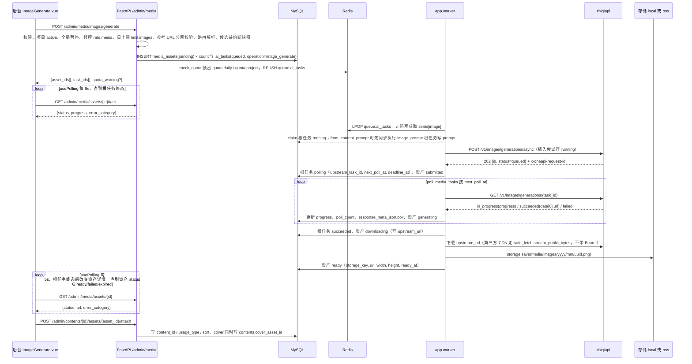
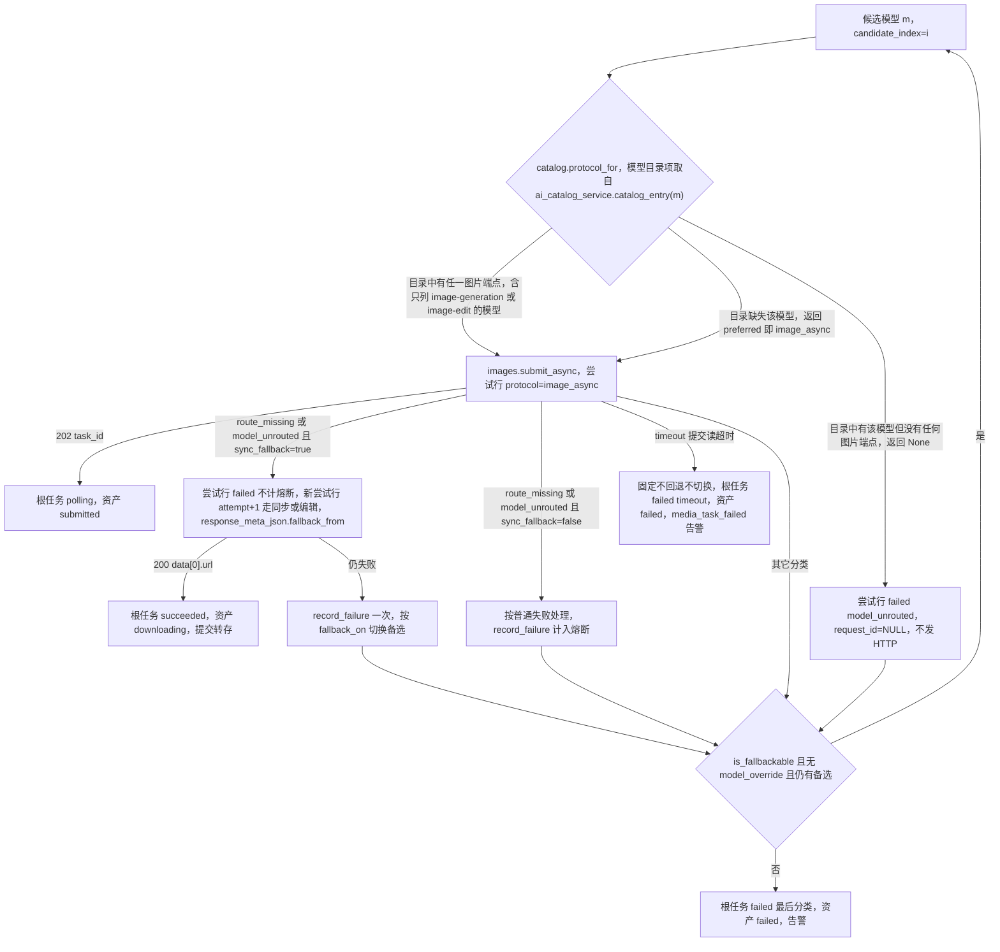
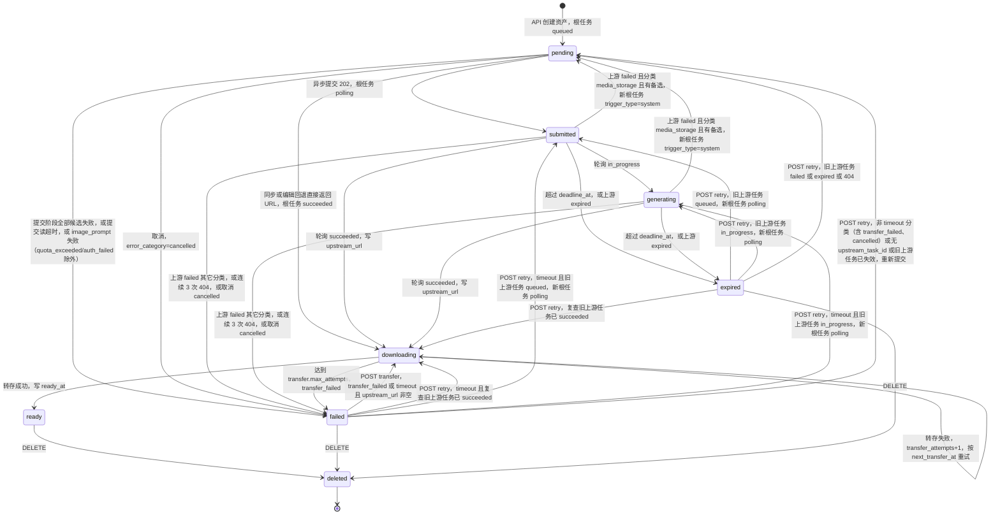
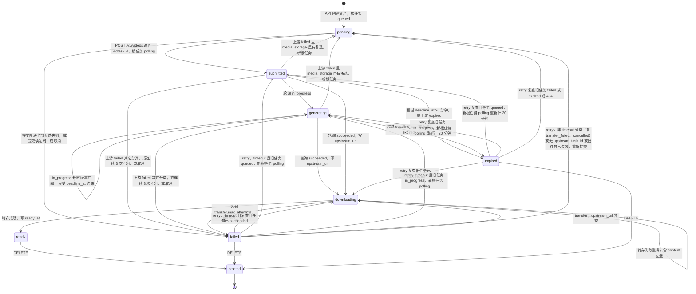
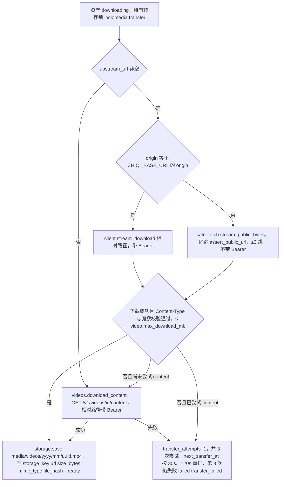

# 10 图片与视频生成设计

> 范围：本文是 **媒体任务生命周期**（图片/视频异步任务的提交、轮询、转存）、`media_assets.status`（`media_status`）与配置键 `media_config` 的权威定义。zhiqiapi 适配层（客户端、协议、错误分类 `error_category`、`ai_tasks` 状态机、候选链、额度估算与对账）见 [08-zhiqiapi-integration](./08-zhiqiapi-integration.md)；表字段与索引见 [03-data-model](./03-data-model.md)；接口全表与业务码见 [04-api-spec](./04-api-spec.md)；worker 任务总表与 Redis 键表见 [01-architecture](./01-architecture.md)；权限码见 [07-admin-rbac](./07-admin-rbac.md)；环境变量见 [05-deployment](./05-deployment.md)。
> 上游契约只采用 BRIEF 已核实内容（基址与 Bearer 鉴权、响应头 `x-oneapi-request-id`、图片异步/同步/编辑端点与字段、视频 `/v1/videos` 任务接口与字段别名、状态集合、`/content` 字节流、`n=1`、契约外字段返回 `400 unsupported_parameter`）。标注「以 zhiqiapi 官方文档为准」的项为未核实项，实现前须对照官方文档。

## 1. 目标

1. 为文章提供封面与配图（文生图、图生图），也可生成与文章无关的素材（`usage_type=standalone`，仍属于某个项目）。
2. 生成短视频素材：文生视频、图生视频（单张参考图）、首尾帧、参考图/参考视频/参考音频、可选生成音频。
3. 全部媒体能力统一经 zhiqiapi 接入，调用、成本、失败原因统一落 `ai_tasks`，与文本能力共用能力路由、候选链、熔断、额度预占与用量对账。
4. 任务异步执行：API 只做校验与入队，`app.worker` 负责提交、轮询、转存；后台通过轮询接口展示进度，视频任务最长等待 20 分钟。
5. 上游返回的临时 URL 必须转存到本地磁盘或对象存储后才对外可用；素材统一在素材库管理，可绑定到内容、插入正文、清理回收。
6. `ZHIQI_API_KEY` 为空的 Mock 模式下全流程可跑通（占位图 / 占位视频）。

**非目标（首版不做）**：本地图片处理（缩放、裁剪、水印，不引入 Pillow）；视频转码与抽帧（不引入 ffmpeg）；音频素材上传与独立的音频生成能力；向上游直传文件或 Base64（上游只接收公网 URL）；素材自由标签与全文检索；站内发布素材页面。

## 2. 核心决策

### 2.1 异步优先，同步只作回退

- 图片一律先走 `POST /v1/images/generations/async`（协议 `image_async`；有无参考图都走异步，异步体自带 `reference_image_urls`），得到 `202 {id:"task_…",status:"queued"}` 后由 worker 轮询 `GET /v1/images/generations/{task_id}`。
- 仅当异步提交返回分类 `route_missing`（404 路由不存在）或 `model_unrouted`（模型未路由）且 `media_config.image.sync_fallback=true` 时，在**同一候选模型**内新增一行尝试行回退同步：无参考图 → `POST /v1/images/generations`（`image_sync`）；有参考图 → 默认 `POST /v1/images/edits`（`image_edit`，multipart，`image` 为公网 URL 字符串重复字段；目录中有该模型但不含 `image-edit` 时改走 `image_sync`，端点选择见 §4.3）。
- 是否走同步只由上游返回决定，**不按模型目录预选同步**（§4.3，与 [08-zhiqiapi-integration](./08-zhiqiapi-integration.md) §6.5 一致）：模型目录 `supported_endpoint_types` 只列 `image-generation`/`image-edit`、未列 `image-generation-async` 的候选同样先发异步提交；目录只用于判定该候选有无任何图片端点，目录中有该模型但没有任何图片端点时该候选记 `model_unrouted`（`request_id=NULL`，不发 HTTP）并按 `fallback_on` 切换备选；目录缺失该模型（`ai_catalog_service.catalog_entry` 返回 `None`，如首次 `sync_models` 之前）时按 `preferred`（`image_async`）提交，交由上游 404 判定。`sync_fallback=false` 时异步提交返回的 `route_missing`/`model_unrouted` 按普通失败处理（`record_failure` 计入熔断，按 `fallback_on` 切换备选）。
- 其它失败（含提交读超时 `timeout`）一律不回退同步，避免重复计费；触发回退的异步错误不计入熔断，同步也失败时才记一次。
- 视频只有任务式接口（`POST /v1/videos` → `GET /v1/videos/{id}`），没有同步形态，也没有同步回退。
- 轮询 `GET` 不计费、不记尝试行；只有提交 `POST` 产生尝试行与费用。

### 2.2 上游 URL 只作过渡，必须转存

- 上游 `data[0].url` 托管在上游 CDN 且会过期；`media_assets.url` 只在转存成功后写入，转存前前端只能看到状态与进度，不展示上游 URL。
- 转存由 worker `tasks/transfer_media.py` 完成：`storage.save()` 后 `url = storage.public_url_for(storage_key)`，按**当时**的 `PUBLIC_BASE_URL`（local）或 `OSS_PUBLIC_BASE_URL`（oss）生成并落库；之后修改这两个变量不自动改写历史行。
- `upstream_url` 落库保留供审计与人工重试转存（`POST /admin/media/assets/{id}/transfer`），不再对外使用。
- 存储后端由 `STORAGE_MODE` 决定：`local` 落 `server/storage/`（`LOCAL_STORAGE_DIR`）并经 `GET /media/{key}` 暴露；`oss` 走 S3 兼容对象存储（boto3，`OSS_*`）；`OSS_ENDPOINT` 为空时强制 local。

### 2.3 所有参考素材必须是公网 URL

- 上游图生图、图生视频、首尾帧、参考素材都只接收**公网可访问的 URL**，不接收文件或 Base64。
- 后台上传参考图/参考视频经 `POST /admin/uploads/image|video` 落 `media_assets(source=uploaded, usage_type=reference, status=ready)`，返回 `{asset_id,url,public}`；真实模式下 `PUBLIC_BASE_URL`（local）或 `OSS_PUBLIC_BASE_URL`（oss）必须是 zhiqiapi 能访问的公网地址，`http://127.0.0.1:8100` 或 compose 内部服务名只在 Mock 模式可用（[05-deployment](./05-deployment.md)）。
- 真实模式 API 对全部参考 URL 执行 `safe_fetch.normalize_public_url` + `assert_public_url`（规则见 §11.1）：非 `http/https`（`DEV_MODE=false` 时非 `https`）、含用户名密码、非 80/443/缺省端口、`127.0.0.1`/`localhost`/内网/链路本地地址 → 业务码 `4222`，`data={"urls":[…]}`；Mock 模式放行（本地地址亦可）。
- 由此推出的部署约束：真实模式下 `PUBLIC_BASE_URL`/`OSS_PUBLIC_BASE_URL` 必须是经 Nginx 80/443 暴露的公网地址（`DEV_MODE=false` 时必须为 `https`），否则本系统上传素材的 `public=false`、不能作为参考素材；`GET /api/v1/health` 的 `warnings[]` 对主机非公网地址给出提示（[05-deployment](./05-deployment.md)）。

### 2.4 每个资产一次生成对应一个根任务

- 每个 `media_assets` 行的一次生成 = 一个 `ai_tasks` **根任务**（`capability=image|video`、`operation=image_generate|video_generate`、`target_type=media_asset`、`target_id=asset_id`、`trigger_type=user`），`media_assets.ai_task_id` 指向根任务；每次对上游的提交 HTTP = 一行**尝试行**（`root_task_id=根任务`，`request_id`/`http_status`/额度/成本记在尝试行）。
- 轮询与转存进度记在根任务（`status=polling`、`progress`、`poll_count`、`next_poll_at`、`deadline_at`、`response_meta_json.poll`；转存阶段只更新下载记录 `response_meta_json.download`，§4.8）与资产行（`status`、`progress`、`transfer_attempts`、`next_transfer_at`）。
- 人工重试与轮询阶段的备选回退一律**新建根任务**（`parent_task_id` 指向旧根任务）并更新 `media_assets.ai_task_id`，失败历史完整保留在 `ai_tasks`；前端轮询 `GET /admin/media/assets/{id}/task` 时自动指向新根任务。

### 2.5 不引入图像 / 视频处理依赖

- 图片宽高由 `storage.probe_image_size(data)` 解析文件头得到（PNG IHDR / JPEG SOF / WebP VP8）；不生成独立缩略图，`thumbnail_key = storage_key`、`thumbnail_url = url`，列表由前端 CSS 缩放。
- 视频 `width/height/duration_seconds` 首版留空，`thumbnail_key/thumbnail_url` 为 NULL；封面抽帧列为可选后续能力（§5.6）。
- 转存前对文件做魔数校验（`storage.sniff_media_type(head)`：PNG/JPEG/WebP/GIF/MP4），类型与 `kind` 不符按 `transfer_failed` 处理。

## 3. 总体流程



| 阶段 | 执行者 | 代码位置 | 关键写入 |
| --- | --- | --- | --- |
| 校验与入队 | API 进程 | `app/api/admin/media.py` → `services/media_service.py`（参数映射、资产创建）→ `services/ai_gateway_service.py`（`resolve_route`、候选链熔断快照、`check_quota`） | `media_assets(pending)`、`ai_tasks(queued)`、`queue:ai_tasks`、`limit:images:{date}` / `limit:videos:{date}`、`rate:media:{admin_id}`、`quota:daily:{date}` / `quota:project:{project_id}:{yyyy-mm}` |
| 提交 | `app.worker` | `tasks/run_ai_tasks.py` → `services/ai_task_service.py`（`claim`/`dispatch`）→ `ai_gateway_service.submit_image` / `submit_video` → `core/zhiqi/images.py` / `core/zhiqi/videos.py` | 尝试行、根任务 `polling`（或同步回退时 `succeeded`）、资产 `submitted`（或 `downloading`） |
| 轮询 | `app.worker` | `tasks/poll_media_tasks.py` → `ai_gateway_service.poll_task` → `images.get_generation` / `videos.get_video` | 根任务 `progress/poll_count/next_poll_at/response_meta_json.poll`，资产 `generating` → `downloading` |
| 转存 | `app.worker` | `tasks/transfer_media.py` → `core/storage.py`、`core/safe_fetch.py`、`core/zhiqi/client.py.stream_download`、`videos.download_content` | 资产 `downloading → ready`，根任务 `response_meta_json.download`（`{source, request_id, http_status, request_ids[]}`，取自下载函数返回的 `DownloadResult`，§4.8），`stats:rt` 计数 |
| 回收与清理 | `app.worker` | `tasks/recover_stale_tasks.py`、`tasks/cleanup_media.py` | 僵死/超期任务终态，失败与孤儿素材文件清理 |

`app.monitor_worker` 不参与媒体任务。文本生成任务与媒体提交任务共用 `queue:ai_tasks`，由同一 `run_ai_tasks.drain` 按根任务 `capability` 的模态（`MODALITY_OF`）分别受 `sems["image"]`（`AI_MAX_CONCURRENCY_IMAGE=2`）与 `sems["video"]`（`AI_MAX_CONCURRENCY_VIDEO=1`）限流（[01-architecture](./01-architecture.md)）。

## 4. 图片生成

### 4.1 请求参数与 zhiqiapi 字段映射

接口 `POST /admin/media/images/generate`（权限 `media.images.generate`，请求模型 `app/schemas/media.py` 的 `ImageGenerateBody`）。参数校验在 `media_service` 与 `core/zhiqi/images.py.validate_request`，上游请求体由 `images.build_async_payload` 生成。

| API 字段 | 类型 / 取值 | 必填 | 校验 | 映射到上游字段 |
| --- | --- | --- | --- | --- |
| `project_id` | int | 是 | 项目存在且 `status=active` | —（写 `media_assets.project_id`、根任务 `project_id`） |
| `content_id` | int | 否 | 属于同一项目；`usage_type ∈ cover/inline` 时必填，`standalone` 时必须为空（否则 400，与 [04-api-spec](./04-api-spec.md) §7.8 一致）；`from_content_prompt=true` 须带 `content_id`，因此只能与 `cover`/`inline` 组合 | —（写 `media_assets.content_id`） |
| `usage_type` | `cover` / `inline` / `standalone` | 是 | 枚举 `media_usage_type`（取值集合见 [00-overview](./00-overview.md)，字段见 [03-data-model](./03-data-model.md)）；`reference` 只允许上传素材使用，此处传入返回 400 | —（写 `media_assets.usage_type`；作为 `image_prompt` 模板变量） |
| `prompt` | string，≤ 4000 字符 | 条件 | `from_content_prompt` 为假时必填 | `prompt` |
| `from_content_prompt` | bool，默认 `false` | 否 | 为真时 `content_id` 必填、`prompt` 可省略，资产 `prompt=NULL` 由 worker 生成（§4.5） | —（记入根任务 `input_json.from_content_prompt`） |
| `count` | int，1~4 | 否，默认 1 | ≤ `media_config.image.max_count_per_request`（4） | 不映射：上游 `n` 固定 1，`count` 张逐张创建独立资产与根任务（§4.4） |
| `resolution` | `1080p` / `2k` / `4k` | 否 | ∈ `media_config.image.allowed_resolutions` | `resolution` |
| `aspect_ratio` | `1:1` / `4:3` / `3:4` / `16:9` / `9:16` | 否 | ∈ `media_config.image.allowed_aspect_ratios` | `aspect_ratio` |
| `reference_image_urls` | string[] | 否 | 数量 ≤ `media_config.image.max_reference_images`（9）；真实模式每个 URL 须公网（否则 `4222`）；能反解为本系统上传素材的 URL 记入 `reference_asset_ids_json` | 异步/同步：`reference_image_urls`；编辑回退：multipart 重复字段 `image` |
| `model` | string | 否 | 请求级模型覆盖：须在 `ai_models` 且 `is_available=1` 且 `modalities_json ∋ image`，否则 400 `data={"model":…}`；覆盖后 `candidates=[model]` 不切换备选 | `model`（无覆盖时为 `capability_routes(image)` 候选链当前模型） |

固定字段：`n=1`、`response_format="url"`。**不发送** `size`/`quality`/`ratio`（契约外字段上游返回 `400 unsupported_parameter`）。未显式传入的 `resolution`/`aspect_ratio` 取值优先级：请求参数 > 项目级路由 `capability_routes(image, project_id).params_json` > 全局路由 `params_json` > `media_config.image.default_resolution` / `default_aspect_ratio`。`params_json` 快照记录最终发送值。

上游请求与响应（已核实）：

```http
POST /v1/images/generations/async HTTP/1.1
Host: zhiqiapi.com
Authorization: Bearer <ZHIQI_API_KEY>
Content-Type: application/json
```

```json
{
  "model": "<image-model-id>",
  "prompt": "Flat-style editorial illustration of a home office, soft morning light, no text",
  "n": 1,
  "resolution": "1080p",
  "aspect_ratio": "16:9",
  "response_format": "url",
  "reference_image_urls": ["https://aicreat.example.com/media/media/uploads/2026/10/3f9c.png"]
}
```

```json
{ "id": "task_5f1c2a", "status": "queued" }
```

轮询 `GET /v1/images/generations/{task_id}`（`status` 集合已核实；`progress` 为 0~99；`failed` 体中的 `error_code`/`error_message` 字段名未核实，以 zhiqiapi 官方文档为准，`classify_task_failure` 同时扫描两者文案）：

```json
{ "id": "task_5f1c2a", "status": "in_progress", "progress": 42 }
```

```json
{ "id": "task_5f1c2a", "status": "succeeded", "data": [ { "url": "https://cdn.upstream.example/out/5f1c2a.png" } ] }
```

```json
{ "id": "task_5f1c2a", "status": "failed", "error_code": "media_storage_upload_failed", "error_message": "..." }
```

同步回退端点（已核实）：`POST /v1/images/generations`（JSON 同上，无 `async`）→ `200 {data:[{url}]}`；`POST /v1/images/edits` multipart：`image` 字段 1~9 个公网 URL 字符串（重复字段）+ `model` + `prompt`（以上三项已核实）+ `response_format=url`（edits 除 `image`/`model`/`prompt` 外的字段均未核实，以 zhiqiapi 官方文档为准；被上游拒绝时按 `unsupported_parameter` 切换备选），仅 `media_config.image.edit_extra_fields` 白名单内的字段才附带（默认空；`resolution`/`aspect_ratio` 是否被接受未核实）。本地 `url` 形如 `…/media/media/images/…`：`GET /media/{key}` 的 `key` 本身以 `media/` 开头（与对象存储键一致），不是拼接错误。

### 4.2 分辨率与比例枚举

| 枚举 | 取值 | 默认 | 定义位置 |
| --- | --- | --- | --- |
| `image_resolution` | `1080p`、`2k`、`4k` | `1080p` | `media_config.image.allowed_resolutions` / `default_resolution`；`packages/shared/src/constants.ts` 的 `IMAGE_RESOLUTIONS` |
| `image_aspect_ratio` | `1:1`、`4:3`、`3:4`、`16:9`、`9:16` | `16:9` | `media_config.image.allowed_aspect_ratios` / `default_aspect_ratio`；`ASPECT_RATIOS` |

前端按用途给出推荐默认值：封面 `16:9`；正文配图 `4:3`；竖版社媒 `9:16` 或 `3:4`；头像/图标 `1:1`。管理员可在系统配置把 `allowed_*` 收窄为枚举子集（例如关闭 `4k` 控制成本），不能超出枚举。模型实际支持的分辨率与比例以 zhiqiapi 模型目录与官方文档为准，不支持时上游返回 `unsupported_parameter`，按 §4.10 切换备选模型。

### 4.3 协议预选与同步回退



- 协议预选按 `catalog.protocol_for(ai_catalog_service.catalog_entry(db, model), route.protocol)`（`image` 路由协议固定 `image_async`，规则以 [08-zhiqiapi-integration](./08-zhiqiapi-integration.md) §6.5 为准）：目录中该模型有任一图片端点（`image-generation-async`/`image-generation`/`image-edit`）→ 一律 `image_async`，有无参考图都先走异步；目录只列 `image-generation`/`image-edit`、未列 `image-generation-async` 也**不**预选同步，同步只由异步提交返回 `route_missing`/`model_unrouted` 且 `media_config.image.sync_fallback=true` 触发（§2.1）。目录中有该模型但没有任何图片端点（`protocol_for` 返回 `None`）→ 尝试行 `failed(model_unrouted)`、`request_id=NULL`、不发 HTTP，按 `fallback_on` 切换备选。目录缺失该模型（`catalog_entry` 返回 `None`：`cache:ai:models:catalog` 键缺失时先从 `ai_models` 回填，回填后仍无该模型，如首次 `sync_models` 之前；缓存过期不会落入此分支）→ 返回 `preferred`（`image_async`）照常异步提交，交由上游 404 判定，不预判 `model_unrouted`。
- `sync_fallback=true` 时触发回退的异步错误不计熔断，同步/编辑也失败时才 `record_failure` 一次；`sync_fallback=false` 时异步提交返回的 `route_missing`/`model_unrouted` 按普通失败处理：`record_failure`（计入熔断）后按 `fallback_on` 决定是否切换备选。
- 同步回退的端点选择（只在回退触发后、于同一候选模型内选择，与 08 §6.5「图片同步回退端点」一致）：无参考图 → `generate_sync`（`image_sync`）；有参考图且（目录含 `image-edit` 或目录缺失该模型）→ `edit_sync`（`image_edit`）；有参考图但目录不含 `image-edit` → `generate_sync`（JSON 与异步同体，含 `reference_image_urls`）。`generate_sync`/`edit_sync` 内不做任何重试，`unsupported_parameter` 直接抛出，由网关按 `fallback_on` 切换候选。
- 图片与视频**不做参数降级**（与文本的 `unsupported_parameter` 降级重试不同）。
- `model` 请求级覆盖时 `candidates=[model]`（覆盖值记入根任务 `input_json.model`），任何失败直接终止、不切换备选：媒体提交在 worker 内异步执行，API 不同步调用上游、不会返回 `5021`；worker 捕获网关抛出的 `5021`/`5031` 业务异常后把根任务置 `failed(最后分类)`、资产 `failed(failed_at)` + `media_task_failed` 告警，任务 `error_message` 一律不附 hint 后缀（`data.hint` 只出现在同步 HTTP 响应中，如创建时覆盖模型熔断打开返回的 `5031`，§4.10）；`content_blocked` 与覆盖同时成立时根任务记 `failed(content_blocked)`，`error_message` 同样不附 hint（同步路径的 `5021` 此时取 `hint=prompt_blocked`，[04-api-spec](./04-api-spec.md) §5.1）。前端以任务摘要的 `model_override`（`GET /admin/media/assets/{id}/task` 与资产详情的 `task` 均返回，取根任务 `input_json.model`，未覆盖时为 `null`；与文本任务相同，媒体不使用 `params.model`）非空识别「使用了覆盖模型」、未切换备选，以 `error_category` 识别失败原因（`content_blocked` 即被拦截，提示修改提示词），覆盖时另提示更换或去掉模型覆盖（§7.1）。
- 单模型尝试行数受 `capability_routes.max_attempts`（默认 3）约束，只有 `rate_limited` 与提交前错误（`pre_submit=True`）才同模型再尝试。

### 4.4 批量生成

- `count` 为 1~4：API 在同一事务创建 `count` 条 `media_assets(pending)` 与 `count` 个根任务，`input_json` 相同，返回 `{asset_ids[],task_ids[],quota_warning?}`（`quota_warning` 见 §4.11）。
- 日上限：`INCRBY limit:images:{date} count`（每次 `INCRBY` 后 `EXPIRE 172800`），结果超过 `media_config.daily_limits.images`（200）时 `DECRBY` 回滚并返回 `4291`，`data={"scope":"daily_images","limit":200,"used":…}`，不部分创建。
- 频控：`rate:media:{admin_id}` 按请求计 1 次（`MEDIA_RATE_LIMIT=20/hour`，seed 到 `generation_config.rate_limits.media_per_admin`），超限 `429` 带 `retry_after`。
- 额度：每个根任务独立 `check_quota` 预占（§4.11），`count` 个根任务在同一事务内依次预占；任一根任务预占失败（`4291`）时回滚事务、对已预占的根任务 `DECRBY quota:daily:{date}` / `quota:project:{project_id}:{yyyy-mm}` 并回滚 `limit:images:{date}`，整请求返回 `4291`，不部分创建。
- 并行度由进程内 `sems["image"]`（`AI_MAX_CONCURRENCY_IMAGE=2`）约束；多副本 worker 各自独立。
- 没有「批次」对象：`generation_batches` 只用于文本生成，媒体根任务 `batch_id=NULL`；前端按资产卡片独立展示进度，一张失败不影响其它。

### 4.5 配图提示词（from_content_prompt）

`from_content_prompt=true` 时资产创建后 `prompt=NULL`，worker 在提交前先生成提示词：

1. `run_ai_tasks.process_one` 领取图片根任务后，创建并**同步执行**一个独立根任务 `ai_tasks(status=running, capability=content, operation=image_prompt, target_type=content, target_id=content_id, trigger_type=system, project_id/created_by 同图片根任务, input_json={"asset_id":…,"usage_type":…}, locked_by=当前 worker, heartbeat_at=started_at)`；它不经 `queue:ai_tasks`，不可 `cancel`/`retry`，僵死回收只置 `failed(timeout)`。
2. 模板 `prompt_template_service.resolve_template("image_prompt", project_id, language)`（seed `sys_image_prompt`，变量 `title`、`summary`、`style`、`usage_type`）。`summary` 取 `contents.summary`，为空取 `seo_description`，再为空取正文前 200 字符；`style` 取 `contents.style`。
3. 经 `ai_gateway_service.complete_text`（文本路由 `capability=content` 候选链）得到**单行英文提示词**（取首个非空行、去首尾空白、截断至 4000 字符；空输出归 `invalid_response`；经 §11.2 `banned_words` 检查，命中按 `content_blocked` 处理：`image_prompt` 根任务本身记 `succeeded`（文本已产出、正常计费），图片根任务 `failed(content_blocked)`），写入 `media_assets.prompt` 与该根任务 `output_excerpt`，再继续 `submit_image`。
4. 提示词任务失败 → 图片根任务 `failed(同分类)`、资产 `failed(failed_at)` + `media_task_failed` 告警；`content_blocked` 时 `error_message` 不附 hint 后缀，前端按 `error_category=content_blocked` 识别（§7.1）。**例外**（以 [08-zhiqiapi-integration](./08-zhiqiapi-integration.md) §8.5 与 [03-data-model](./03-data-model.md)「任务幂等与状态收敛」第 5 条为准）：分类为 `quota_exceeded`/`auth_failed` 时（`record_failure` 已写 `ai:paused:{reason}` 并发 `ai_quota_exceeded`/`ai_auth_failed` 告警），`image_prompt` 根任务按常规 `failed`；宿主图片根任务回滚 `queued`（`pause_count += 1`，清空 `locked_by/heartbeat_at/started_at`，不 `settle_quota`、不 `RPUSH`、不发 `media_task_failed`），资产保持 `pending`（`prompt` 仍为 NULL）；暂停解除后由 `recover_stale_tasks` ③ 补扫入队，下次执行时重新创建 `image_prompt` 根任务；`pause_count >= 3` 才按常规 `failed(同分类)`（资产 `failed` + `media_task_failed` 告警）。
5. 其文本成本记在 `image_prompt` 根任务的尝试行，按 `capability=content` 归入报表；`quota_reserved=0`，终态 `settle_quota` 以实际估算额度累加 `quota:daily`。
6. Mock 模式 `mock_chat` 对 `image_prompt` 模板返回固定英文提示词。

运营可在资产详情查看生成的提示词，复制到工作台修改后再次生成（新资产）；`sys_image_prompt` 模板本身在 Prompt 模板页维护（[09-generation-pipeline](./09-generation-pipeline.md)）。

### 4.6 任务生命周期



资产状态与根任务状态的对应关系（`media_assets.ai_task_id` 指向当前根任务）：

| `media_assets.status` | 对应根任务 `ai_tasks.status` | 说明 |
| --- | --- | --- |
| `pending` | `queued`（领取后提交中为 `running`） | 根任务未入队/未提交；备选回退复用资产行时也回到此态 |
| `submitted` / `generating` | `polling` | `progress` 两处同步更新；`deadline_at` 在提交成功时写入 |
| `downloading` / `ready` | `succeeded` | 转存属于资产行状态，根任务已终态 |
| `failed` | `failed` 或 `cancelled`；`transfer_failed` 时为 `succeeded` | 根任务 `failed`/`cancelled` 时 `error_category` 同步写两处；`transfer_failed` 发生在根任务 `succeeded` 之后（§4.8 第 6 步），只在资产行写 `error_category=transfer_failed`，根任务状态与 `error_category` 不改（只更新 `response_meta_json.download` 下载记录）；`cancelled` 不告警、不计 `media_failed` |
| `expired` | `expired` | 轮询超出 `deadline_at` 或上游返回 `expired` |
| `deleted` | 不变 | 删除只改资产行与存储文件 |

### 4.7 轮询策略

- `tasks/poll_media_tasks.py.poll_due(pool, limit=20)` 每轮执行：`SELECT … FROM ai_tasks WHERE status='polling' AND next_poll_at <= now ORDER BY next_poll_at LIMIT 20`，逐条以 `UPDATE … SET next_poll_at = now + 60s WHERE id=? AND status='polling' AND next_poll_at <= now` 抢占（`rowcount=0` 跳过），再提交线程池；不受 `ai:paused:*` 影响。
- 单次轮询 `ai_gateway_service.poll_task(db, root_task)` → `images.get_generation(client, task_id, timeout=ai_routing_config.timeouts.poll_seconds, retry=policy)`：幂等 GET，客户端按 `retry.retry_on` 指数退避重试；不记尝试行。
- 间隔：`media_config.image.poll_intervals_seconds=[5,10,15,30]`：提交成功时 `next_poll_at = now + intervals[0]`，第 k 次轮询（k 从 1 起）后 `next_poll_at = now + intervals[min(k, len-1)]`，即首轮 5s、之后 10s、15s，再之后固定 30s；预算 `media_config.image.poll_budget_seconds=600`（seed 自 `ZHIQI_IMAGE_POLL_BUDGET_SECONDS`），`deadline_at = 提交成功时刻 + 600s`。主循环 `WORKER_POLL_INTERVAL_SECONDS=2`，实际延迟 ≤ 间隔 + 2s。
- 每次轮询写根任务 `poll_count += 1`、`progress`（上游 `progress` 0~99）、`response_meta_json.poll = {last_request_id, last_http_status, error_code, error_message, request_ids[]（最近 ≤ 20 次）, consecutive_404}`；资产 `progress` 同步。

| 轮询结果 | 处理 |
| --- | --- |
| 上游 `queued` | 更新 `poll_count/next_poll_at`，资产保持 `submitted` |
| 上游 `in_progress` | 更新 `progress/poll_count/next_poll_at`，资产 `generating` |
| 上游 `succeeded` | 根任务 `succeeded`（`finished_at`，`duration_ms` = 提交 → 完成含轮询）；资产 `downloading`、`upstream_url=data[0].url`；立即 `pool.submit(transfer_media.transfer_asset, asset_id)` |
| 上游 `failed` | `errors.classify_task_failure(error_code, error_message)`：`media_storage` 且 `fallback.enabled` 且仍有备选 → 备选回退（§4.10）；其它分类（含 `unknown`、`content_blocked`）→ 根任务 `failed(分类)`、资产 `failed(failed_at)` + `media_task_failed` 告警 |
| 上游 `expired` 或本地超过 `deadline_at` | 根任务 `expired`、资产 `expired(failed_at)` + 告警（当次轮询判断；未被轮询到的由 `recover_stale_tasks` ② 兜底） |
| GET 抛 `auth_failed` / `quota_exceeded` | `record_failure`（续写 `ai:paused:{reason}`、触发 `ai_auth_failed`/`ai_quota_exceeded` 告警），任务保持 `polling` 按间隔重排 |
| GET 404（`route_missing`） | `poll.consecutive_404 += 1`（任一非 404 响应把它清零）；连续 3 次 → 根任务 `failed(route_missing)`、资产 `failed` + 告警 |
| GET 其它异常（`upstream_unavailable`/`timeout`/`rate_limited`/`invalid_response`…） | 客户端幂等重试仍失败 → 记入 `poll`，按间隔重排直至 `deadline_at` |

### 4.8 转存与缩略图

`tasks/transfer_media.py.transfer_asset(asset_id) -> bool`：

1. 获取 `lock:media:transfer:{asset_id}`（TTL 600s）；流式下载中每 10 MB 或每 60s `EXPIRE … 600` 续锁。获取失败直接返回 `False`（另一副本在转存）。
2. 选择下载源：`upstream_url` 的 origin 等于 `ZHIQI_BASE_URL` 的 origin → `client.stream_download(相对路径, dest, max_bytes, timeout)`，带 Bearer；否则（第三方 CDN）→ `safe_fetch.stream_public_bytes(url, dest, max_bytes=…, allowed_types=…, max_redirects=3, timeout=ZHIQI_TIMEOUT_DOWNLOAD_SECONDS)`（读超时，语义同 `stream_download` 的 `timeout`，见第 3 步）：`follow_redirects=False`、每一跳先 `assert_public_url` 再请求、最多 3 跳、**不带 Authorization**，只带 `User-Agent`（`ZHIQI_USER_AGENT`）。Mock 模式下 `MockZhiqiClient.stream_download` 对 `/media/mock/` 路径直接复制 `app/core/zhiqi/mock_assets/` 文件，不发 HTTP。三个下载函数（`client.stream_download`、视频的 `videos.download_content`、`safe_fetch.stream_public_bytes`）成功时均返回 `DownloadResult(source, request_id, http_status, request_ids[])`（定义见 [08-zhiqiapi-integration](./08-zhiqiapi-integration.md)），失败抛 `ZhiqiError(TRANSFER_FAILED)` 并携带同样的下载信息（未收到响应时为 `null`）；`transfer_media` 据此写下载记录（第 5 步）。
3. 校验：响应 `Content-Type` ∈ `image/*`、`application/octet-stream`、`binary/octet-stream`（视频另含 `video/*`）；读取文件头经 `storage.sniff_media_type` 得到 PNG/JPEG/WebP/GIF 之一且与 `kind=image` 一致；字节数 ≤ `media_config.transfer.max_download_mb`（50）；读超时 `ZHIQI_TIMEOUT_DOWNLOAD_SECONDS=300`（httpx 读超时，指两次数据块之间的最大等待，不是总时长）。任一不满足 → 本次失败，分类 `transfer_failed`。
4. 落盘：下载先流式写入临时文件 `LOCAL_STORAGE_DIR/tmp/{asset_id}.part`（`oss` 模式同样先落本地临时文件），校验通过后 `storage.save(key, data, content_type)`：local 以 `os.replace` 移入 `key` 路径，oss 以 `put_object` 上传；`key = media/images/{yyyy}/{mm}/{uuid4 hex}.{ext}`（`ext` 来自魔数类型：`png`/`jpg`/`webp`/`gif`）；`url = storage.public_url_for(key)`。成功或失败均在 `finally` 删除临时文件，进程崩溃遗留的 `tmp/*.part` 由 `cleanup_media` 回收（§6.4）。
5. 写资产行：`storage_key`、`url`、`size_bytes`、`mime_type`、`file_hash`（SHA-256）、`width/height`（`storage.probe_image_size`）、`thumbnail_key=storage_key`、`thumbnail_url=url`、`progress=100`、`status=ready`、`ready_at=now`、`failed_at=NULL`、`next_transfer_at=NULL`；`HINCRBY stats:rt:{date}:{project_id} images_generated 1`（`project_id=0` 行同时累加；生成的素材必有 `project_id`，见 §4.1 与 [13-user-data-scope](./13-user-data-scope.md) §4.2）。`transfer_attempts` 保留历史计数不清零。下载记录：每次转存尝试结束（成功或失败）时，与资产行同一事务把下载结果写回当前根任务 `response_meta_json.download = {source, request_id, http_status, request_ids[]}`（字段与 `DownloadResult` 一致，见 [08-zhiqiapi-integration](./08-zhiqiapi-integration.md) §7.4 第 4 条；失败时取 `ZhiqiError(TRANSFER_FAILED)` 携带的值）：`source`/`request_id`/`http_status` 覆盖为最近一次下载调用的值，`source` ∈ `origin`（上游 origin 的 `upstream_url`，`stream_download`）/ `content`（`GET /v1/videos/{id}/content`，`download_content`）/ `cdn`（第三方 CDN，`safe_fetch.stream_public_bytes`）/ `mock`（Mock 本地复制）；`request_id` 为下载响应头 `x-oneapi-request-id`，`origin` 与 `content` 有该头；`cdn` 无上游请求号，`request_id` 记 `null`，不向 `request_ids[]` 追加；`http_status` 记 CDN 最终一跳的响应状态码（与 [08-zhiqiapi-integration](./08-zhiqiapi-integration.md) §5.2、§7.4 第 4 条一致）；任一来源只有下载失败且未收到响应时 `http_status` 才为 `null`；`request_ids[]` 按时间顺序追加每次下载调用的非空 `request_id`（含失败的调用、同一次尝试内被 `/content` 回退取代的 origin 下载、此前各次转存尝试的下载，保留最近 ≤ 10 个）。每次下载调用另写客户端 INFO 日志（`method path http_status latency_ms request_id`）。该写入只更新 `response_meta_json.download`，根任务 `status` 不变。
6. 失败：保持 `downloading`、`transfer_attempts += 1`、`next_transfer_at = now + media_config.transfer.retry_seconds[transfer_attempts-1]`，下载记录按第 5 步写回 `response_meta_json.download`。默认 `max_attempts=3`，即转存共 3 次尝试：首次转存失败后间隔 30s、120s 各重试一次，第 3 次仍失败（`transfer_attempts` 达到 `transfer.max_attempts=3`）置 `failed(transfer_failed, failed_at)`、`next_transfer_at=NULL` + `media_task_failed` 告警，资产 `error_message` 末尾与告警 `payload` 附 `download_request_id`（即 `response_meta_json.download.request_id`：最后一次下载调用的请求号，`cdn` 来源为 `null`），保留 `upstream_url` 供人工 `POST /admin/media/assets/{id}/transfer`；`retry_seconds` 第 3 项（600s）仅在调大 `max_attempts` 时使用。`transfer_failed` 不计熔断、不切换备选、不新建尝试行，根任务保持 `succeeded`。
7. `retry_due(pool, limit=10)` 每 60s 查询 `status='downloading' AND next_transfer_at <= now` 并提交线程池；`recover_stale_tasks` ⑥ 把「`downloading` 且 `updated_at < now − 15 分钟` 且锁不存在」的资产视为一次转存失败重排。

缩略图：图片不生成独立缩略图（无 Pillow），`thumbnail_url = url`，列表用 `<el-image fit="cover" lazy>` 缩放展示；`4k` 图片体积较大，列表默认懒加载、详情才加载原图。如使用对象存储，图片处理参数（如 CDN 缩放）由运维在 CDN 层配置，本系统不改写 `url`。

### 4.9 与内容的关联与插入文章

关联关系只用三处字段表达：`media_assets.content_id`（绑定内容）、`media_assets.usage_type` + `sort`（用途与顺序）、`contents.cover_asset_id`（封面）。

| 路径 | 触发 | 规则 |
| --- | --- | --- |
| 生成时直接绑定 | `images/generate` 传 `content_id` + `usage_type ∈ cover/inline`；`videos/generate` 只能传 `usage_type=inline`（视频传 `cover` 返回 400，§5.1） | 资产创建即写 `content_id/usage_type`，`sort` = 该内容现有绑定素材的 `MAX(sort) + 1`（无绑定时为 1）；`usage_type=cover` 的资产转存成功进入 `ready` 时 `media_service.on_asset_ready` 把 `contents.cover_asset_id` 指向它（`on_asset_ready` 只对 `kind=image` 的资产设置 `contents.cover_asset_id`，封面只能是图片，与 [03-data-model](./03-data-model.md) B.12 一致），原封面资产 `usage_type` 改为 `inline`（仍保持绑定）；同一请求 `count > 1` 且 `usage_type=cover` 时按 `ready` 先后依次替换，最后 `ready` 的成为封面，其余为 `inline` |
| 事后绑定 | `POST /admin/contents/{id}/assets/{asset_id}/attach {usage_type: cover\|inline, sort}`（`content.contents.update`） | 资产须 `status=ready` 且 `asset.project_id ∈ {NULL, content.project_id}`（为 NULL 时写入内容的项目）；`usage_type=cover` 要求 `kind=image`（与 03 B.12 一致），视频返回 400；`cover` 同时写 `contents.cover_asset_id`（替换旧封面同上）；重复 attach 只更新 `usage_type/sort`；内容 `generating` 时返回 409 |
| 解绑 | `POST /admin/contents/{id}/assets/{asset_id}/detach` | `content_id=NULL`、`usage_type=standalone`、`sort=0`；若为封面则清空 `contents.cover_asset_id`；文件不删除 |
| 插入正文 | 内容编辑器素材面板「插入到光标处」 | 按 `contents.format` 生成标记：`markdown` → ``；`html` → ``；视频两种格式均插入 `<video src="{url}" controls></video>`（`utils/markdown.ts` 渲染白名单含 `img`/`video`，只允许 `http(s)` 的 `src`）；`alt` 默认取资产 `prompt` 前 50 字符，无则取文章标题；正文变更经 `PUT /admin/contents/{id}` 保存，产生 `source=manual` 版本 |
| 查询 | `GET /admin/contents/{id}/assets`、`GET /admin/contents/{id}`（含 `cover_asset_id` 与素材列表） | 按 `sort, id` 排序 |
| 删除联动 | `DELETE /admin/contents/{id}`（仅 `draft`/`archived` 且 `link_count=0`） | 解绑素材（`content_id=NULL`），不删除素材；`DELETE /admin/media/assets/{id}` 反向解绑并清空封面（§6.4） |

导出 `GET /admin/contents/{id}/export` 原样保留素材 URL；外部平台发布时由运营手工上传图片（首版不做随文打包）。attach/detach/封面更新在同一事务内完成，审计 `target_type=content`、`target_id=asset_id`。

### 4.10 失败分类与重试

错误分类取值与三层重试的定义见 [08-zhiqiapi-integration](./08-zhiqiapi-integration.md)；下表只列图片任务在各阶段的处理结果。

| 阶段 | 错误 / 分类 | 处理 |
| --- | --- | --- |
| API 校验 | 枚举/数量/`usage_type`/`content_id` 不符 | `400`，`data` 为校验错误列表 |
| API 校验 | 请求级 `model` 覆盖的模型不在模型目录（`ai_models`）、`is_available=0` 或 `modalities_json` 不含 `image` | `400`，`data={"model":"<model_id>"}`（[04-api-spec](./04-api-spec.md) §5.1 校验错误列表格式的唯一例外）；不创建资产与根任务 |
| API 校验 | 提示词 / 负向提示词命中 `generation_config.quality.banned_words` | `400`，`data` 为校验错误列表（[04-api-spec](./04-api-spec.md) §5.1 统一格式）：`[{"loc":["body","prompt"],"msg":"命中敏感词：xxx","type":"banned_words","input":"<提交的提示词，超过 200 字符截断>"}]`（`loc`/`msg`/`type`/`input` 四个键齐全），负向提示词的条目 `loc` 为 `["body","negative_prompt"]`、`input` 为提交的负向提示词（同样超过 200 字符截断）；不创建资产与根任务（§11.2） |
| API 校验 | 参考 URL 非公网（真实模式） | `4222`，`data={"urls":[…]}` |
| API 校验 | 日上限 / 本地额度上限 | `4291`，`data.scope` = `daily_images` / `daily` / `project_monthly` |
| API 校验 | 每管理员频控 | `429`，`data={"retry_after":秒}` |
| API 校验 | 路由 `is_enabled=0`、候选全部 `is_available=0`、全局暂停 `ai:paused:*`；候选链全部熔断打开（创建时对各候选 `ai:breaker:{capability}:{model}` 做状态快照，`half_open` 视为可用；仅部分打开时正常入队，由 worker 按候选链跳过打开的模型）；请求级 `model` 覆盖的模型熔断打开 | `5031`，`data={"capability":"image","breaker_open":[…],"unavailable_models":[…],"paused_reason":…}`（候选全部熔断时 `breaker_open` 列出这些模型）；覆盖模型熔断打开时另附 `"hint":"model_override"`；均不创建资产与根任务、不入队 |
| 提交 | `route_missing` / `model_unrouted`（异步提交返回） | 同一候选内同步/编辑回退（仅 `sync_fallback=true`，触发回退的错误不计熔断）；`sync_fallback=false`（按普通失败计入熔断）或回退仍失败（记一次熔断）→ 按 `fallback_on` 切换备选；目录中有该模型但没有任何图片端点时不发 HTTP，直接记 `model_unrouted` 并切换备选（§4.3） |
| 提交 | `unsupported_parameter` | 不降级，直接切换备选（HTTP 400 未计费） |
| 提交 | `upstream_unavailable`（连接阶段，`pre_submit=True`）/ `rate_limited` | 客户端幂等重试 → 同模型再尝试（≤ `max_attempts`）→ 切换备选 |
| 提交 | `upstream_unavailable`（HTTP 5xx）/ `breaker_open` / `invalid_response` / `unknown` | 不做同模型再尝试（含 `invalid_response`：提交响应不可解析时上游可能已受理，重发会重复计费，只记 `request_id` 供对账），按 `fallback_on` 切换备选 |
| 提交 | `timeout`（读超时，上游可能已受理） | **固定不回退、不切换**：根任务 `failed(timeout)`、资产 `failed` + 告警；人工 `retry` 时因 `upstream_task_id` 为空直接重新提交 |
| 提交 | `quota_exceeded` / `auth_failed` | 尝试行 `failed`；根任务回滚 `queued`（`pause_count += 1`，< 3 时），资产保持 `pending`；`SET ai:paused:{reason}` + 对应告警；暂停解除后由 `recover_stale_tasks` ③ 补扫入队；`pause_count >= 3` 按常规 `failed`。同样适用于内嵌 `image_prompt` 阶段：`image_prompt` 根任务按常规 `failed`，宿主图片根任务按本行回滚 `queued`、不发 `media_task_failed`，下次执行重新创建 `image_prompt` 根任务（§4.5 第 4 步） |
| 提交 | `content_blocked` | 根任务 `failed(content_blocked)`、资产 `failed` + 告警，`error_message` 不附 hint 后缀（前端按 `error_category=content_blocked` 识别）；不重试、不切换 |
| 轮询 | 上游 `failed` → `media_storage` | 备选回退：**复用同一资产行** `status=pending`、`ai_task_id`=新根任务、`progress=0`、`transfer_attempts=0`、`error_*`/`failed_at` 清空；新根任务 `trigger_type=system`、`parent_task_id`=旧根任务、`candidate_index` 从下一候选起、复制 `project_id`/`input_json`（归属见 [13-user-data-scope](./13-user-data-scope.md) §9.4），`RPUSH queue:ai_tasks`；不重复计入 `limit:images:{date}`；无备选或 `fallback.enabled=false` → `failed(media_storage)` |
| 轮询 | 上游 `failed` → `content_blocked` / `unknown` | 根任务 `failed`、资产 `failed` + 告警 |
| 轮询 | 连续 3 次 404 | `failed(route_missing)` + 告警 |
| 轮询 | 超过 `deadline_at` / 上游 `expired` | `expired` + 告警；人工 `retry` 先复查旧任务 |
| 转存 | `transfer_failed` | 共 3 次尝试（首次失败后间隔 30s、120s 各重试一次），第 3 次仍失败（`transfer_attempts` 达到 `max_attempts=3`）→ `failed(transfer_failed)` + 告警（附 `download_request_id`）；每次尝试的下载结果写 `response_meta_json.download`（§4.8 第 5 步）；根任务保持 `succeeded`；人工 `transfer` |
| 任意 | 取消（`POST /admin/ai/tasks/{id}/cancel`，根任务 `queued`/`polling`） | 根任务 `cancelled`（`settle_quota` 释放预占；`polling` 时不调用上游取消、费用不退）、资产 `failed(error_category=cancelled, failed_at)`；不告警、不计 `media_failed`；根任务 `running`（worker 已领取、提交中，含内嵌 `image_prompt` 执行中）时返回 409 `data={"current_status":"running"}`，提交完成转 `polling` 后可再取消；媒体根任务无批次，不存在「运行中被批次取消」分支 |
| 僵死 | `running` 根任务心跳超时（`WORKER_STALE_TASK_MINUTES=10`） | `upstream_task_id` 非空 → 改置 `polling`（`next_poll_at=now`，`deadline_at` 为空时补 `now + poll_budget_seconds`，资产 `pending → submitted`）；`request_id` 为空 → `failed(timeout)`、资产 `failed` + 告警，不自动重试；任一尝试行 `request_id` 非空且无结果 → `failed(timeout)`，不自动重试（可能已计费） |

人工入口：

- `POST /admin/media/assets/{id}/retry`（`media.assets.retry`，资产 `failed`/`expired`）：`upstream_task_id` 非空且资产为 `expired` 或 `failed(timeout)` → API 先同步 `poll_task` 复查旧任务：上游 `succeeded` → 新建根任务（`parent_task_id`、继承 `upstream_task_id`、直接 `succeeded`），资产 `downloading`、`upstream_url=data[0].url`、`transfer_attempts=0`、`next_transfer_at=now`（API 进程不下载，由 worker `transfer_media.retry_due` 在 60s 内领取转存；不重新提交、不重复计费）；上游 `queued`/`in_progress` → 新建根任务以 `polling` 创建（继承 `upstream_task_id`、`deadline_at = now + poll_budget_seconds`、`next_poll_at=now`），资产 `submitted`/`generating`；上游 `failed`/`expired`/404 或无 `upstream_task_id` → 资产 `pending`，新建根任务 `queued`（同 `input_json`）重新提交并重新计入日上限。三种情况新建的根任务均为 `trigger_type=user`、`created_by`=操作人、`parent_task_id`=旧根任务、复制 `project_id`/`input_json`（13 §9.4）；均更新 `ai_task_id`、清空 `error_*`/`failed_at`，返回 `{asset,task_id,resumed}`（`resumed=true` 表示未重新提交）。补充规则：① 复查 `poll_task` 抛 `ZhiqiError` 时，404（`route_missing`）视为旧任务已失效，走重新提交分支；其它分类（`upstream_unavailable`/`timeout`/`rate_limited`/`auth_failed`/`quota_exceeded`…）→ API 返回 `5021`（`data.error_category/request_id`），资产与根任务状态不变，稍后再试。② `failed(transfer_failed)`（含 `upstream_url` 非空）、`failed(cancelled)` 与其它不满足复查条件的 `failed` 分类一律走重新提交分支（重新计费，前端确认框提示），与 [04-api-spec](./04-api-spec.md) §6.13「其余情况直接 `pending` 重新提交」一致；`transfer_failed` 且 `upstream_url` 非空时确认框额外提示「重试会重新提交并重新计费，建议优先使用『转存』」。③ 重新提交分支的新根任务重新 `check_quota` 预占（超限 `4291`）并计入 `limit:images:{date}` / `limit:videos:{date}`；复查分支不计入；`retry`/`transfer` 均不计入 `rate:media:{admin_id}`。
- `POST /admin/media/assets/{id}/transfer`（`media.assets.retry`，`failed(transfer_failed/timeout)` 且 `upstream_url` 非空）→ `downloading`，`transfer_attempts` 清零、`failed_at` 清空、`next_transfer_at=now`，由 worker `transfer_media.retry_due` 在 60s 内领取转存（API 进程不下载）；不新建根任务、`ai_task_id` 不变。
- `POST /admin/ai/tasks/{id}/retry` 对媒体根任务返回 409 `data={"hint":"POST /admin/media/assets/{asset_id}/retry"}`。

告警：`media_task_failed`（severity `info`，`target_type=media_asset`，`target_key={asset_id}`，`project_id` = 资产的 `project_id`（决定告警对哪位用户可见，[13-user-data-scope](./13-user-data-scope.md) §11），`payload` 含 `error_category`、`request_id`（提交尝试行）、`model`、`upstream_task_id`；`transfer_failed` 时另含 `download_request_id`，§4.8 第 6 步），同一资产重复失败只累加 `trigger_count`；`error_category=cancelled` 不触发。其它告警（模型级 `ai_breaker_open`、`ai_task_failures`、`ai_upstream_unavailable`，系统级 `ai_quota_exceeded`、`ai_auth_failed`）定义见 [11-link-backfill-and-monitoring](./11-link-backfill-and-monitoring.md)。

### 4.11 成本

- 计费点：只有提交 `POST`（异步、同步、编辑）计费，按模型 `quota_type`（1 按次 `model_price`，0 按量）结算；轮询 `GET`、下载、转存不计费；上游对失败的异步任务可能产生 `type=6` 退款日志（按 `upstream_task_id` 匹配），退款语义以 zhiqiapi 官方文档为准。
- 预占：API 创建根任务时 `check_quota(estimated_quota = estimate_for(db, model=候选链首个模型, prompt_tokens=estimate_tokens(prompt)（from_content_prompt 时为 0）, completion_tokens=0))`，按次模型走 `model_price` 路径；写 `quota_reserved` 并 `INCRBY quota:daily:{date}` / `quota:project:{project_id}:{yyyy-mm}`；超过 `generation_config.quota.daily_limit` / `project_monthly_limit` 返回 `4291`。根任务终态 `finalize_root` → `settle_quota` 修正为 Σ 尝试行 `quota_estimated`。
- 预警：规则与文本生成相同（[04-api-spec](./04-api-spec.md) §5.2、[09-generation-pipeline](./09-generation-pipeline.md) §9.6）。`check_quota` 通过但 `used + estimated ≥ limit × generation_config.quota.warn_percent / 100`（默认 80%）时，`POST /admin/media/images/generate` 与 `POST /admin/media/videos/generate` 照常创建资产与根任务，并在响应 `data` 附可选字段 `quota_warning={scope,limit,used,percent}`（`scope` ∈ `daily` / `project_monthly`）。一次请求最多附一个 `quota_warning`：`daily` 与 `project_monthly` 同时达到预警线时取 `percent` 较高者，相同取 `daily`；图片 `count > 1` 时按全部根任务预占完成后的累计用量判断。上限为 0 表示不限，不预警。预警不阻断请求、不产生告警，工作台在表单顶部显示黄色提示（§7.1）。
- 成本：尝试行终态按当时 `ai_routing_config.pricing` 写 `cost_cny = quota / quota_per_unit × usd_cny_rate`；对账（`reconcile_usage`）按 `request_id` → `upstream_task_id` 回填 `quota_actual = max(0, Σ type2 − Σ|type6|)` 并重写 `cost_cny`。
- 报表：`images_generated`（按 `ready_at`）、`media_failed`（按 `failed_at`，排除 `cancelled`）、`media_success_rate`、`cost_cny` 按 `capability=image` / `model` 分解（[12-dashboard-reports](./12-dashboard-reports.md)）；`GET /admin/ai/usage/summary?group_by=capability` 可看估算与实扣差异。

| 控制项 | 取值 / 位置 | 作用 |
| --- | --- | --- |
| 每管理员频控 | `MEDIA_RATE_LIMIT=20/hour` → `rate:media:{admin_id}` | 防误操作连点 |
| 日上限 | `media_config.daily_limits.images=200` → `limit:images:{date}` | 全局兜底 |
| 本地额度上限 | `generation_config.quota.daily_limit` / `project_monthly_limit`（首次 seed 自 `AI_DAILY_QUOTA_LIMIT` / `AI_PROJECT_MONTHLY_QUOTA_LIMIT`，0 = 不限）、`quota.warn_percent=80` | 超限 `4291`；达到 80% 时 `generate` 响应附 `quota_warning`、工作台黄色提示；上限为 0 = 不限，不预警 |
| 默认分辨率 | `media_config.image.default_resolution=1080p`，`allowed_resolutions` 可收窄 | `2k`/`4k` 只在需要时选择 |
| 单请求张数 | `count ≤ 4`，上游 `n=1` | 避免一次性大额消耗 |
| 参考图数量 | `max_reference_images=9` | 契约上限 |
| 同步回退范围 | 仅异步提交返回 `route_missing`/`model_unrouted` 且 `sync_fallback=true`；不按模型目录预选同步（§4.3） | 避免重复计费 |
| 超时不自动重试 | 提交 `timeout` 固定人工处理 | 上游可能已受理 |
| 重试先复查 | `retry` 先 `poll_task` 旧任务 | 已成功的任务直接转存 |
| 备选回退复用资产 | 轮询阶段 `media_storage` 回退不新建资产 | 不重复计日上限 |
| 健康探测 | `ai_routing_config.health.probe_media=false` | 默认不用真实生成做探测 |

## 5. 视频生成

### 5.1 请求参数与 zhiqiapi 字段映射

接口 `POST /admin/media/videos/generate`（权限 `media.videos.generate`，请求模型 `VideoGenerateBody`）。校验在 `media_service` 与 `core/zhiqi/videos.py.validate_request`，上游请求体由 `videos.build_payload` 生成，**只发送非 None 字段**，一律使用规范字段名（不使用别名 `seconds`/`ratio`/`image`/`image_url`）。

| API 字段 | 类型 / 取值 | 必填 | 校验 | 上游字段 |
| --- | --- | --- | --- | --- |
| `project_id` | int | 是 | 项目 `active` | — |
| `content_id` | int | 否 | 同项目；仅 `usage_type=inline` 时必填；`standalone` 时必须为空（否则 400），与 [04-api-spec](./04-api-spec.md) §7.8/§7.9 一致 | — |
| `usage_type` | `inline` / `standalone` | 是 | 视频不能作封面：传 `cover` 返回 400（封面只能是图片，[03-data-model](./03-data-model.md) B.12）；传 `reference` 同图片返回 400 | — |
| `prompt` | string，≤ 4000 字符 | 是 | 视频不支持 `from_content_prompt` | `prompt` |
| `negative_prompt` | string | 否 | ≤ 2000 字符，写 `media_assets.negative_prompt` | `negative_prompt` |
| `duration` | int（秒） | 否，默认 `media_config.video.default_duration`（5） | `1 ≤ duration ≤ media_config.video.max_duration`（15）；模型实际取值范围以 zhiqiapi 官方文档为准，超限由上游返回 `unsupported_parameter` | `duration` |
| `resolution` | `480p` / `720p` / `1080p` / `4k` | 否，默认 `720p` | ∈ `media_config.video.allowed_resolutions` | `resolution` |
| `aspect_ratio` | 如 `16:9` / `9:16` / `1:1` | 否，默认 `media_config.video.default_aspect_ratio`（`16:9`） | 与 `size` 二选一，同时给出时保留 `aspect_ratio`、丢弃 `size`；取值集合以官方文档为准，本地只校验 `{w}:{h}` 格式 | `aspect_ratio` |
| `size` | 如 `1280x720` | 否 | 格式 `{宽}x{高}`；与 `aspect_ratio` 二选一 | `size` |
| `input_reference` | URL | 图生视频模式必填 | 公网 URL（`4222`）；不得与 `first_frame_image_url` 同时传（400，组合行为未核实） | `input_reference` |
| `reference_image_urls` | URL[] | 否 | 公网；本地上限沿用 `media_config.image.max_reference_images`（9），上游上限以 zhiqiapi 官方文档为准 | `reference_image_urls` |
| `reference_video_urls` | URL[] | 否 | 公网；本地上限 3（`core/zhiqi/videos.py` 常量 `MAX_REFERENCE_VIDEOS=3`，上游上限以官方文档为准） | `reference_video_urls` |
| `reference_audio_urls` | URL[] | 否 | 公网；本系统无音频上传接口，须填外部公网地址；本地上限 1（常量 `MAX_REFERENCE_AUDIOS=1`） | `reference_audio_urls` |
| `first_frame_image_url` | URL | 首尾帧模式必填 | 公网 | `first_frame_image_url` |
| `last_frame_image_url` | URL | 否 | 公网；须与 `first_frame_image_url` 同时出现 | `last_frame_image_url` |
| `generate_audio` | bool | 否，默认 `media_config.video.generate_audio_default`（false） | — | `generate_audio` |
| `model` | string | 否 | `modalities_json ∋ video`，其余同图片 | `model` |

固定：`n=1`；请求体**必须为 JSON**（multipart 上游返回 415）；一次只创建一个资产（无 `count`，需要多条请多次提交）。`params_json` 快照记录 `resolution/aspect_ratio/size/duration/input_reference/reference_image_urls/reference_video_urls/reference_audio_urls/first_frame_image_url/last_frame_image_url/generate_audio` 的最终发送值；参考 URL 中能反解为本系统上传素材的记入 `reference_asset_ids_json`。

| 前端模式 | 必填 | 发送的上游字段 |
| --- | --- | --- |
| 文生视频 | `prompt` | `model`、`prompt`（+ 通用参数） |
| 图生视频 | `prompt` + `input_reference` | `input_reference` |
| 首尾帧 | `prompt` + `first_frame_image_url`（可选 `last_frame_image_url`） | `first_frame_image_url`、`last_frame_image_url` |
| 参考素材 | `prompt` + `reference_image_urls` / `reference_video_urls` / `reference_audio_urls` 至少一项 | 对应数组 |
| 音频 | `generate_audio=true`，可与以上任一模式组合 | `generate_audio` |

通用参数 `duration`/`resolution`/`aspect_ratio|size`/`negative_prompt` 对所有模式可用。上游请求与响应（已核实，`progress`/`expires_at` 字段名未核实）：

```http
POST /v1/videos HTTP/1.1
Host: zhiqiapi.com
Authorization: Bearer <ZHIQI_API_KEY>
Content-Type: application/json
```

```json
{
  "model": "<video-model-id>",
  "prompt": "A slow dolly shot across a tidy desk at sunrise, soft light, 4 seconds",
  "duration": 5,
  "resolution": "720p",
  "aspect_ratio": "16:9",
  "input_reference": "https://aicreat.example.com/media/media/uploads/2026/10/9a7e.png",
  "generate_audio": false,
  "n": 1
}
```

```json
{ "id": "vidtask_8c2d", "status": "queued" }
```

轮询 `GET /v1/videos/{id}` → `status ∈ queued / in_progress / succeeded / failed / expired`，成功时 `data[].url`；`GET /v1/videos/{id}/content` 返回字节流。

### 5.2 时长与分辨率

| 项 | 取值 | 默认 | 定义位置 |
| --- | --- | --- | --- |
| `video_resolution` | `480p`、`720p`、`1080p`、`4k` | `720p` | `media_config.video.allowed_resolutions` / `default_resolution`；`constants.ts` 的 `VIDEO_RESOLUTIONS` |
| `duration` | 1 ~ `max_duration` 秒 | 5 | `media_config.video.default_duration` / `max_duration`（15） |
| `aspect_ratio` / `size` | `{w}:{h}` / `{w}x{h}`，二选一 | `16:9` | `media_config.video.default_aspect_ratio` |

成本随时长、分辨率上升（具体按模型 `model_price`/`model_ratio`；前端首版不显示数值预估，额度预占仍按 §4.11 执行）：前端表单在选择 `1080p`/`4k` 或 `duration > 10` 时显示固定成本提示文案，所选模型 `quota_type=1`（取自 `GET /admin/ai/models/options?modality=video`）时追加「按次计费」字样；实际消耗以用量页对账结果为准。模型对时长/分辨率/比例的实际支持以 zhiqiapi 官方文档为准；不支持的组合由上游返回 `unsupported_parameter`，直接切换备选模型，不做本地降级。

### 5.3 任务生命周期



与图片的差异：没有同步回退（`pending` 不会直接到 `downloading`）；`expired` 是常态分支，需要人工 `retry` 复查；转存多一层 `/content` 回退；资产 `width/height/duration_seconds` 留空。

### 5.4 20 分钟轮询预算与 in_progress 99% 的处理

- 间隔 `media_config.video.poll_intervals_seconds=[15,30,60]`：15s、30s，之后固定 60s；预算 `media_config.video.poll_budget_seconds=1200`（seed 自 `ZHIQI_VIDEO_POLL_BUDGET_SECONDS`），`deadline_at = 提交成功时刻 + 1200s`，约 21 次轮询。轮询读超时 `timeouts.poll_seconds=30`。
- 上游托管期间可能**长时间停在 `in_progress` 且 `progress=99`**（上游在做媒体托管/后处理）。本系统**不做特殊处理**：不提前判失败、不缩短或加密间隔、不额外调用 `/content` 试探、不切换备选；只受 `deadline_at` 约束。
- 超出预算 → 根任务 `expired`、资产 `expired(failed_at)` + `media_task_failed` 告警。人工 `POST /admin/media/assets/{id}/retry` 先 `poll_task` 复查旧 `upstream_task_id`：已 `succeeded` → 直接转存（不重新提交、不重复计费）；仍 `queued`/`in_progress` → 新根任务以 `polling` 继续（新的 1200s 预算，继承 `upstream_task_id`，不重复计入 `limit:videos`）；`failed`/`expired`/404 → 重新提交（重新计入日上限）。
- 上游返回 `expired` → 本地 `expired`，处理同上；上游任务已过期时 `retry` 只能走重新提交分支。
- 调整预算：管理员在系统配置提高 `video.poll_budget_seconds`（`MediaConfig` 校验 `60 ≤ video.poll_budget_seconds ≤ 3600`，超出保存返回 400）；只影响之后提交的任务，`deadline_at` 在提交成功时计算；`recover_stale_tasks` ① 补写 `deadline_at` 时取当前配置。
- 前端 `VideoGenerate.vue` 显示进度条、已用时 / 预算：已用时 = `now − 资产 created_at`（取自 `GET /admin/media/assets/{id}`，`/task` 响应只有 `finished_at`，不含 `created_at` / `started_at` 等计时起点），预算 = `GET /admin/settings/runtime` 的 `media_config.video.poll_budget_seconds`（1200s）；`progress ≥ 99` 时提示「上游处理中，可能需要数分钟」；允许取消（`POST /admin/ai/tasks/{id}/cancel`，仅本地放弃，不调用上游取消，费用不退）。

### 5.5 content 下载与转存



- 下载顺序固定：优先 `upstream_url`（`data[0].url`）；`upstream_url` 为空或该下载失败（`transfer_failed`）时，在**同一次转存尝试内**回退 `videos.download_content(client, task_id, dest, max_bytes, timeout)`；两者都失败才计一次 `transfer_attempts`。每次尝试结束时按 §4.8 第 5 步写回根任务 `response_meta_json.download = {source, request_id, http_status, request_ids[]}`：`source`/`request_id`/`http_status` 为最后一次下载调用的值（`source` ∈ `origin` / `cdn` / `content` / `mock`，回退 `/content` 后为 `content`），被 `/content` 回退取代的那次 origin 下载的非空 `request_id` 保留在 `request_ids[]`；`GET /v1/videos/{id}/content`（`content`）与上游 origin 的 `stream_download`（`origin`）记录响应头 `x-oneapi-request-id`，第三方 CDN 下载（`cdn`）无上游请求号，`request_id` 记 `null`，不向 `request_ids[]` 追加；`http_status` 记 CDN 最终一跳的响应状态码（与 [08-zhiqiapi-integration](./08-zhiqiapi-integration.md) §5.2、§7.4 第 4 条一致）；只有下载失败且未收到响应时 `http_status` 才为 `null`。
- 校验：`Content-Type` ∈ `video/*`、`application/octet-stream`、`binary/octet-stream`；魔数须为 MP4（`ftyp` box）且 `kind=video`；字节数 ≤ `media_config.video.max_download_mb`（500）；读超时 `ZHIQI_TIMEOUT_DOWNLOAD_SECONDS=300`。大文件下载中每 10 MB 或 60s 续锁 `EXPIRE lock:media:transfer:{id} 600`。
- 写入（临时文件与落盘方式同 §4.8 第 4 步，先写 `LOCAL_STORAGE_DIR/tmp/{asset_id}.part`）：`storage_key = media/videos/{yyyy}/{mm}/{uuid4 hex}.mp4`、`mime_type=video/mp4`、`size_bytes`、`file_hash`、`url`、`status=ready`、`ready_at`、`progress=100`；`width/height/duration_seconds` 留空；`HINCRBY stats:rt:{date}:{project_id} videos_generated 1`。
- 重试节奏与图片相同（§4.8 第 6 步）：转存共 3 次尝试（首次失败后间隔 30s、120s 各重试一次），第 3 次仍失败（`transfer_attempts` 达到 `max_attempts=3`）置 `failed(transfer_failed)`，`error_message` 与告警 `payload` 附 `download_request_id`（即 `response_meta_json.download.request_id`：最后一次下载调用的请求号，`/content` 回退时为其 `request_id`）；`retry_seconds` 第 3 项仅在调大 `max_attempts` 时使用。上游临时 URL 过期导致的失败可经 `/content` 回退缓解，`/content` 自身可用期以 zhiqiapi 官方文档为准。
- Mock：`upstream_url = PUBLIC_BASE_URL + /media/mock/placeholder.mp4`，`MockZhiqiClient.stream_download` 直接复制 `mock_assets/placeholder.mp4`。

### 5.6 封面抽帧（可选，首版不做）

首版不引入 ffmpeg：视频 `thumbnail_key/thumbnail_url` 为 NULL，素材库与编辑器用 `<video preload="metadata">` 由浏览器渲染首帧。后续可选方案（按优先级）：

1. 用现有图片生成能力生成封面（`usage_type=cover` 的图片资产），不需要新依赖，首版即可用。
2. 对象存储 / CDN 的视频截帧参数（运维侧配置，`thumbnail_url` 指向带参数的 URL）。
3. 在 worker 镜像加入 ffmpeg，转存成功后抽第 1 秒帧写 `media/videos/{yyyy}/{mm}/{uuid}.cover.jpg` 到 `thumbnail_key`，同时解析 `width/height/duration_seconds`；需在 [05-deployment](./05-deployment.md) 增加镜像依赖后再启用。

### 5.7 失败与过期

| 阶段 | 分类 | 处理（与 §4.10 不同之处加粗） |
| --- | --- | --- |
| API 校验 | 参数 / 敏感词 / 公网 URL / 日上限 / 频控 / 路由 / 熔断快照 | 同图片：`400`（**`usage_type=cover` 返回 400**；敏感词为 `type=banned_words` 的校验错误条目，`loc` 为 `["body","prompt"]` 或 `["body","negative_prompt"]`）/ `4222` / `4291`（`scope=daily_videos`，`limit:videos:{date}` ≤ 20）/ `429` / `5031`（`data={"capability":"video","breaker_open":[…],"unavailable_models":[…],"paused_reason":…}`；候选链全部熔断打开时 `breaker_open` 非空，覆盖模型熔断打开另附 `hint=model_override`，均不创建资产与根任务） |
| 提交 | `route_missing` / `model_unrouted` | **无同步回退**，直接按 `fallback_on` 切换备选 |
| 提交 | `unsupported_parameter` | 切换备选，不降级 |
| 提交 | `timeout` | 固定不回退、不切换：`failed(timeout)` + 告警，人工 `retry`（无 `upstream_task_id` 时重新提交） |
| 提交 | `quota_exceeded` / `auth_failed` / `content_blocked` / 其它 | 同图片 |
| 轮询 | `media_storage` | 备选回退复用资产行（同图片），新根任务重新计 1200s 预算 |
| 轮询 | 其它 `failed` / 连续 3 次 404 | `failed` + 告警 |
| 轮询 | `expired`（本地预算或上游） | **常见分支**：资产 `expired`，告警；人工 `retry` 先复查旧任务 |
| 转存 | `transfer_failed` | **每次尝试内 `upstream_url` 失败先回退 `/content`**，两者都失败才计一次；共 3 次尝试（首次失败后间隔 30s、120s 各重试一次），第 3 次仍失败（`transfer_attempts` 达到 `max_attempts=3`）置 `failed(transfer_failed)`（附 `download_request_id`）；人工 `transfer` |
| 取消 / 僵死 | — | 同图片；`running` 根任务心跳超时且 `upstream_task_id` 非空 → 继续 `polling` |

### 5.8 成本

- 视频按次价格通常远高于图片：`AI_MAX_CONCURRENCY_VIDEO=1`、`media_config.daily_limits.videos=20`、默认 `720p` / 5s、`generate_audio_default=false`。
- 预占、结算与额度预警（`quota_warning`，上限为 0 = 不限，不预警）同 §4.11（`completion_tokens=0`，按次模型走 `model_price`）；取消 `polling` 中的任务不退费，前端取消前二次确认。
- 提交 `timeout` 与 `expired` 都不自动重新提交，避免重复计费；`retry` 先复查旧任务。
- 报表 `videos_generated`、`media_failed`、`cost_cny(capability=video)`；用量页按 `upstream_task_id` 匹配 `type=6` 退款。

## 6. 素材库

### 6.1 media_assets 管理

表定义、类型与索引见 [03-data-model](./03-data-model.md) `media_assets`；本节按用途归组说明字段职责：

| 分组 | 字段 | 写入者 |
| --- | --- | --- |
| 归属 | `project_id`（可空=独立素材）、`content_id`、`kind`、`usage_type`、`source`、`sort`、`created_by` | API（创建、attach/detach、上传） |
| 生成参数 | `ai_task_id`（当前根任务）、`prompt`、`negative_prompt`、`model`、`params_json`、`reference_asset_ids_json`、`upstream_task_id`、`upstream_url`、`progress` | API（创建）、worker（提交、轮询、回退） |
| 存储 | `storage_key`、`url`、`thumbnail_key`、`thumbnail_url`、`mime_type`、`size_bytes`、`width`、`height`、`duration_seconds`、`file_hash` | worker `transfer_media`、API 上传 |
| 状态 | `status`、`error_category`、`error_message`、`transfer_attempts`、`next_transfer_at`、`ready_at`、`failed_at` | worker、API（retry/transfer/cancel/delete） |
| 时间 | `created_at`、`updated_at` | 数据库默认 |

- 列表 `GET /admin/media/assets`（`media.assets.view`）：筛选 `project_id`/`content_id`/`kind`/`status`/`usage_type`/`source`/`created_by`，按 `created_at DESC`，`page_size` 默认 20、最大 100；走索引 `INDEX(project_id, kind, status, created_at)`。
- 详情 `GET /admin/media/assets/{id}`：`AssetOut` 含 `params`、`reference_asset_ids`、根任务摘要 `task`（结构同 `/task` 接口）与引用信息 `references{cover_of,bound_content_id,referenced_by_asset_ids[{id,status}],count}`（仅详情实时计算，列表不含，§6.3）。
- 后台默认按全局项目选择器（`store/project.ts`）过滤，可切换「全部项目」查看独立素材（`project_id` 为空）。
- 数据范围（[13-user-data-scope](./13-user-data-scope.md) §4.2）：有 `project_id` 的素材随项目负责人可见；`project_id` 为空的上传素材按上传人 `created_by` 归属，只对上传人与总后台可见（`INDEX(created_by, created_at)`）；普通用户的列表、详情、重试、转存、删除只作用于这两类可见素材，其它素材按不存在返回 404。生成接口的 `project_id` / `content_id` 必须可见。

### 6.2 标签与分类

首版不设自由标签列：「标签」= 固定维度（`kind`、`usage_type`、`source`、`status`），由 `components/StatusTag.vue` 按 `packages/shared/src/enums.ts` 的枚举渲染为可点击筛选的彩色标签；提示词关键字检索与自定义标签不在首版范围（新增列须先在 [03-data-model](./03-data-model.md) 变更）。

| 标签维度 | 取值 | 展示 |
| --- | --- | --- |
| `kind` | `image` / `video` | 图标 |
| `usage_type` | `cover` / `inline` / `standalone` / `reference` | 封面 / 配图 / 独立 / 参考 |
| `source` | `generated` / `uploaded` | AI 生成 / 上传 |
| `status` | `pending` / `submitted` / `generating` / `downloading` / `ready` / `failed` / `expired` / `deleted` | 灰 / 蓝 / 蓝（进度）/ 蓝 / 绿 / 红 / 橙 / 灰 |

### 6.3 引用关系与引用计数

引用不单独建表，由三类字段派生，详情接口实时计算 `references`：

| 引用方 | 字段 | 含义 |
| --- | --- | --- |
| 内容封面 | `contents.cover_asset_id = asset.id` | `references.cover_of = content_id` |
| 内容绑定 | `media_assets.content_id`（本行） | `references.bound_content_id` |
| 生成任务的参考素材 | 其它 `media_assets.reference_asset_ids_json ∋ asset.id`（只列调用者可见的引用方） | `references.referenced_by_asset_ids[{id,status}]` |

`references.count = (cover_of ? 1 : 0) + (bound_content_id ? 1 : 0) + len(referenced_by_asset_ids)`。列表不计算引用（成本），只在详情与删除确认时计算；`reference_asset_ids_json` 在 API 创建资产（`generate` 请求校验通过）时写入：URL 以 `PUBLIC_BASE_URL + /media/` 或 `OSS_PUBLIC_BASE_URL` 为前缀时取其后的 `storage_key` 查 `media_assets(source=uploaded)` 得到 ID（查不到或外部 URL 不记）；备选回退与 `retry` 新建根任务时原样保留，是 `cleanup_media` 判断孤儿参考素材与 §6.4 删除保护的唯一依据。

数据范围下，详情返回的 `reference_asset_ids`、`references.referenced_by_asset_ids` 与 `references.count` 只计调用者可见的素材（[13-user-data-scope](./13-user-data-scope.md) §6.1）；`reference_asset_ids_json` 的反解、§6.4 的 409 `in_use` 删除保护与 `cleanup_media` 不受范围约束，按全部引用判断（13 §7.1）。因此确认框计数为 0 时删除仍可能返回 `data={"reason":"in_use"}`，前端按该 reason 提示「素材正被待提交的生成任务引用」。

### 6.4 删除与清理

`DELETE /admin/media/assets/{id}`（`media.assets.delete`）：

- 允许状态 `ready`/`failed`/`expired`；`pending`/`submitted`/`generating`/`downloading` 返回 409 `data={"current_status":…}`（前三者可先 `POST /admin/ai/tasks/{id}/cancel` 再删除；`downloading` 的根任务已 `succeeded` 不可取消，须等待转存进入 `ready` 或 `failed(transfer_failed)`）；已 `deleted` 的资产再次 `DELETE` 返回 409 `data={"current_status":"deleted"}`（与 [03-data-model](./03-data-model.md)「删除规则」、[04-api-spec](./04-api-spec.md) §5.3 一致，重复的状态流转不静默成功）。
- `usage_type=reference` 的上传素材若被任一 `status ∈ pending/submitted` 的资产的 `reference_asset_ids_json` 引用（上游可能尚未抓取该 URL）→ 409 `data={"reason":"in_use"}`（[04-api-spec](./04-api-spec.md) §5.3「删除受保护对象」）；其它引用只在前端确认框提示。
- 同一事务：`status=deleted`（保留行与 `ready_at`/`failed_at`，报表按历史归属不变）；解绑内容（`content_id=NULL`，若为封面则清空 `contents.cover_asset_id`）；删除存储文件（`storage.delete(storage_key)`，`thumbnail_key` 不同时一并删除；文件不存在忽略）。`url`/`storage_key`/`thumbnail_key`/`thumbnail_url` 不清空、保留作审计（[03-data-model](./03-data-model.md)「删除规则」与「媒体转存与素材引用」第 4 条只列以上动作）；资产是否可用一律以 `status=deleted` 判定（attach 要求 `status=ready`，`AssetPicker` 只查 `status=ready`），手工删除与 `cleanup_media` 孤儿清理两条路径写法一致。审计 `target_type=media_asset`、`action=delete`。
- 已插入正文的 ``/`<video>` 不自动改写，前端确认框提示「正文中的引用将失效」。

`tasks/cleanup_media.py.cleanup() -> dict`（每日 03:00，`stats_config.timezone`）：

| 步骤 | 条件 | 动作 |
| --- | --- | --- |
| 清理失败残留 | `status ∈ failed/expired` 且 `failed_at < now − media_config.retention.failed_days(30)`；另对 `LOCAL_STORAGE_DIR/tmp/` 下 `mtime < now − 1 天` 的 `*.part` 无条件删除 | 删除本地下载缓存/半成品文件（`tmp/{asset_id}.part` 与无 `url` 的 `storage_key` 对象），记录行保留（供报表与排障） |
| 清理孤儿参考素材 | `source=uploaded` 且 `usage_type=reference` 且 `status=ready` 且 `created_at < now − retention.orphan_reference_days(7)` 且未出现在任何 `media_assets.reference_asset_ids_json` 中 | 同手工删除：置 `deleted` 并删除存储文件（`storage.delete(storage_key)`），`url`/`storage_key` 等列保留作审计 |
| 返回 | — | `{failed_cleaned, orphans_deleted}` 写 INFO 日志 |

`ready` 的生成素材不自动删除，只能人工删除。对象存储按 `delete_object` 删除，local 按 `os.remove`。

### 6.5 上传参考素材

| 接口 | 权限 | 限制 | 落库 |
| --- | --- | --- | --- |
| `POST /admin/uploads/image` | `system.upload.create` | multipart `file`；扩展名 jpg/png/webp/gif，魔数 `storage.sniff_media_type` 须一致；≤ `MAX_IMAGE_SIZE_MB`（10）；Nginx `client_max_body_size` 兜底 | `media_assets(kind=image, source=uploaded, usage_type=reference, status=ready, ready_at=now, project_id=NULL, width/height=probe_image_size, file_hash, mime_type, size_bytes, storage_key=media/uploads/{yyyy}/{mm}/{uuid}.{ext}, thumbnail_key=storage_key)` |
| `POST /admin/uploads/video` | `system.upload.create` | mp4/mov（均为 `ftyp` 容器）；≤ `MAX_VIDEO_SIZE_MB`（200） | 同上 `kind=video`，`thumbnail_key=NULL` |

响应 `{asset_id,url,public}`：`public` 在真实模式下 = `normalize_public_url(url)` + `assert_public_url(url)` 是否全部通过（§11.1 规则：`PUBLIC_BASE_URL`/`OSS_PUBLIC_BASE_URL` 使用 80/443/缺省端口、`DEV_MODE=false` 时为 `https`、主机解析为公网地址），为 `false` 时前端警告「真实模式下 zhiqiapi 无法读取该地址」；Mock 模式恒为 `true`（放行本地地址）。上传素材可在 `ImageUpload.vue` 直接作为 `reference_image_urls`/`input_reference`/`first_frame_image_url`/`last_frame_image_url`/`reference_video_urls` 使用；音频不支持上传。上传接口只接收 multipart `file`（[04-api-spec](./04-api-spec.md) §6.14，无 `project_id` 表单字段），上传素材一律 `project_id=NULL`（独立素材）：参考素材选择器按 `usage_type=reference&status=ready` 查询、不带 `project_id`（§7.4），被 attach 到内容时按 §4.9 写入内容的项目。上传不做 `file_hash` 去重（同文件多次上传产生多条 `reference` 行，由孤儿清理回收）。上传素材绑定到内容前只对上传人与总后台可见，因此普通用户在参考素材选择器里只看到自己上传的素材（[13-user-data-scope](./13-user-data-scope.md) §7.4）。

## 7. 后台页面

菜单分组「媒体」（`layouts/Layout.vue` 显式配置）：素材库 → `views/media/Assets.vue`（`media.assets.view`）、图片生成 → `views/media/ImageGenerate.vue`（`media.images.view`）、视频生成 → `views/media/VideoGenerate.vue`（`media.videos.view`）。前端 API 模块：`api/media.ts`（`generateImages`/`generateVideo`/`listAssets`/`getAsset`/`getAssetTask`/`retryAsset`/`transferAsset`/`deleteAsset`）、`api/uploads.ts`（`uploadImage`/`uploadVideo`）、`api/ai.ts`（`listModelOptions`、`cancelTask`）、`api/settings.ts`（`runtime`）、`api/contents.ts`（`listAssets`/`attachAsset`/`detachAsset`）。运行时配置来自 `GET /admin/settings/runtime` 的 `media_config.{image,video,daily_limits}` 与 `zhiqi_mode`。

### 7.1 图片工作台（ImageGenerate.vue）

左侧表单、右侧结果区（窄屏上下排列）：

| 表单项 | 控件 | 数据来源 / 规则 |
| --- | --- | --- |
| 项目 | 顶栏项目选择器（`ProjectSelect.vue`，只读显示） | `store/project.ts` |
| 关联内容 | 可搜索下拉（`GET /admin/contents?project_id=&keyword=`），可空 | `usage_type ∈ cover/inline` 时必填；用途选 `standalone` 时禁用并清空、不可选择（`standalone` 的 `content_id` 必须为空，否则后端返回 400，§4.1） |
| 用途 | 单选 `cover` / `inline` / `standalone` | 决定推荐比例默认值（§4.2） |
| 提示词 | 多行输入，≤ 4000 字符；开关「由文章生成提示词」= `from_content_prompt` | 开关打开时提示词可空且必须选内容；用途为 `standalone` 时开关禁用（`from_content_prompt` 只能与 `cover`/`inline` 组合，§4.1） |
| 张数 | 数字 1 ~ `media_config.image.max_count_per_request` | 默认 1 |
| 分辨率 / 比例 | 下拉，取 `allowed_resolutions` / `allowed_aspect_ratios`，默认 `default_*`；比例旁显示等比预览框 | 选 `2k`/`4k` 显示成本提示 |
| 参考图 | `ImageUpload.vue`（≤ `max_reference_images`）：上传（`POST /admin/uploads/image`，需 `system.upload.create`，无权限时只显示 URL 输入框）或粘贴公网 URL；`AssetPicker.vue` 可选已有 `reference`/`ready` 素材 | 真实模式下 `public=false` 的 URL 标红并提示 |
| 模型 | `ModelSelect.vue`（`GET /admin/ai/models/options?modality=image`），可空=按路由 | 可空 |
| 提交 | 按钮 `v-permission="media.images.generate"` | 返回 `{asset_ids[],task_ids[],quota_warning?}`；带 `quota_warning` 时在表单顶部显示黄色提示（`scope`、`used`/`limit`、`percent`），不阻断（§4.11） |

结果区：每个 `asset_id` 一张 `AssetCard.vue`，内嵌 `TaskProgress.vue`，通过 `usePolling.ts`（`interval=5000`，页面可见时）轮询 `GET /admin/media/assets/{id}/task`；根任务进入终态（`succeeded/failed/cancelled/expired`）后继续轮询 `GET /admin/media/assets/{id}`，直到资产 `status ∈ ready/failed/expired` 才停止并展示图片（[04-api-spec](./04-api-spec.md) §8：根任务 `succeeded` 时资产可能仍在 `downloading` 转存，可能持续数分钟或以 `failed(transfer_failed)` 结束，而 `/task` 响应不含资产状态）；卡片操作：绑定到内容（attach，`content.contents.update`）、复制 Markdown/HTML 标记、重试 / 转存（`media.assets.retry`；`failed(transfer_failed)` 点「重试」走重新提交，确认框提示重新计费并建议优先「转存」，§4.10）、取消（`ai.tasks.cancel`，仅 `pending/submitted/generating`；根任务 `running` 时后端返回 409，前端提示「提交中，请稍后再试」）、删除（`media.assets.delete`）、查看提示词（`from_content_prompt` 生成后回显）。

错误提示映射：对 `400` 中 `type=banned_words` 的条目，按 `loc`（`["body","prompt"]` / `["body","negative_prompt"]`）高亮对应输入框并展示 `msg`；`400` 且 `data.model` 存在（请求级模型覆盖不在目录、`is_available=0` 或模态不符，§4.10）时高亮模型下拉并提示更换或去掉模型覆盖；`4222` 高亮非公网 URL；`4291` 按 `data.scope` 提示日上限或额度；`5031` 显示 `paused_reason`/`unavailable_models`/`breaker_open`，`data.hint=model_override` 时提示更换或去掉模型覆盖；`429` 显示 `retry_after`；`5021`（仅 `retry` 复查旧上游任务失败时出现，§4.10）显示 `error_category` 与 `request_id`；`409` 显示 `data.current_status` 或 `data.hint`。任务级失败不经 HTTP 错误码，而由 `/task` 的 `error_category` 驱动 `TaskProgress.vue` 文案（`content_blocked` 提示修改提示词；`timeout` 提示「上游可能已受理，重试将先复查旧任务」；`/task` 的 `model_override`（取根任务 `input_json.model`，不看 `params.model`）非空表示使用了覆盖模型、未切换备选，失败时另提示更换或去掉模型覆盖；任务 `error_message` 一律不附 hint 后缀，见 §4.3）。

### 7.2 视频工作台（VideoGenerate.vue）

- 模式 Tab：文生视频 / 图生视频 / 首尾帧 / 参考素材，按 §5.1 显示对应必填项；用途单选 `inline` / `standalone`（不提供 `cover`：封面只能是图片，§5.1；`inline` 时须选关联内容，下拉同图片工作台；`standalone` 时关联内容禁用并清空，§5.1）；通用参数：时长滑块（1 ~ `max_duration`，默认 `default_duration`）、分辨率（`allowed_resolutions`）、比例或尺寸（二选一切换）、负向提示词、`generate_audio` 开关、模型（`modality=video`）。
- 参考图 / 首尾帧 / 参考视频通过 `ImageUpload.vue`（视频走 `POST /admin/uploads/video`）或公网 URL；参考音频只接受公网 URL 输入。
- 提交（返回 `{asset_id,task_id,quota_warning?}`，`quota_warning` 的黄色提示同图片工作台）后展示单个长任务卡片，通过 `usePolling.ts`（`interval=15000`，页面可见时）轮询，停止条件同图片（根任务终态后继续轮询 `GET /admin/media/assets/{id}`，直到资产 `status ∈ ready/failed/expired`，§7.1）：进度条（`progress`）、已用时 / 预算（计算方式见 §5.4）；`/task` 响应不含 `poll_count`，轮询次数只在素材库详情的「任务」Tab（`GET /admin/ai/tasks/{id}`）展示；`progress ≥ 99` 显示「上游处理中，可能需要数分钟」；`expired` 显示「重试（先复查上游任务）」；取消需二次确认（不退费）。
- 完成后用 `<video controls>` 播放 `url`，操作同图片卡片。
- 页面离开不影响任务（worker 侧执行），再次进入可在素材库按 `kind=video` 继续查看。

### 7.3 素材库（Assets.vue）

- 筛选栏：项目（默认当前项目，可选全部）、`kind`、`status`、`usage_type`、`source`、创建人；网格 / 列表切换；分页。
- 卡片：缩略图（图片 `thumbnail_url`；视频 `<video preload="metadata">`）、`StatusTag`、尺寸 / 大小 / 时长、模型、创建时间、进行中任务的进度条（对 `pending/submitted/generating/downloading` 的卡片启用轮询）。
- 详情抽屉 Tab：基本信息（含 `url` 复制、`file_hash`）、参数（`params`、`reference_asset_ids` 可点击跳转）、任务（根任务摘要、`error_category/error_message`、`request_id`、轮询记录与下载记录来自 `GET /admin/ai/tasks/{id}` 的 `response_meta.poll` / `response_meta.download`，需 `ai.tasks.view`，无该权限时只显示 `/task` 摘要）、引用（§6.3）。
- 操作：重试（`failed`/`expired`；`failed(transfer_failed)` 的重试走重新提交分支，确认框提示重新计费并建议优先「转存」）、转存（`failed(transfer_failed/timeout)` 且有 `upstream_url`）、取消、删除（确认框显示引用计数）、绑定到内容（打开 `AssetPicker` 的反向流程：选择内容 + 用途；视频的用途只提供 `inline`）。首版不提供批量删除（接口无批量端点）。

### 7.4 组件

| 组件 | 职责 |
| --- | --- |
| `components/AssetCard.vue` | 素材卡片：预览、状态标签、进度、操作按钮（按权限码显示） |
| `components/AssetPicker.vue` | 弹窗选择素材：`GET /admin/media/assets?project_id=&kind=&status=ready`，供内容编辑器与参考图选择；选参考素材时按 `usage_type=reference&status=ready` 查询、不带 `project_id`（上传素材 `project_id` 为空，§6.5） |
| `components/TaskProgress.vue` | 进度条 + 错误分类文案映射（读 shared 枚举），接收 `/task` 响应 |
| `components/ImageUpload.vue` | 上传到 `/admin/uploads/*` 并返回 URL；展示 `public` 警告；支持粘贴 URL |
| `components/ModelSelect.vue` | 从 `/admin/ai/models/options?modality=` 选择模型 |
| `components/StatusTag.vue` | `media_status`/`usage_type`/`source` 的颜色与文案 |
| `composables/usePolling.ts` | 按 `interval` 参数轮询（批次/内容 3s、图片 5s、视频 15s，[04-api-spec](./04-api-spec.md) §8），页面不可见时暂停，连续 3 次网络错误退避到 10s、恢复后回到原间隔，终态停止；媒体卡片的终态按「根任务终态且资产 `status ∈ ready/failed/expired`」双条件判断（§7.1） |

### 7.5 内容编辑器素材面板

`views/contents/Editor.vue` 的素材面板（[09-generation-pipeline](./09-generation-pipeline.md)）：列出 `GET /admin/contents/{id}/assets`，按 `sort` 排序；「生成配图」在抽屉内复用图片工作台表单（预填 `content_id`，`from_content_prompt` 默认开启，`usage_type` 默认 `inline`）；「选择已有素材」打开 `AssetPicker`；每项可「设为封面」（attach `usage_type=cover`；只对 `kind=image` 的项显示，视频项不提供，后端对视频返回 400，§4.9）、「插入到光标处」（§4.9 标记）、上移 / 下移（attach 更新 `sort`）、解绑。封面区显示 `cover_asset_id` 对应资产。

## 8. 接口

接口全表、响应结构与业务码以 [04-api-spec](./04-api-spec.md) 为准，本节只列媒体相关接口的用途与关键示例。

| 方法 | 路径 | 权限码 | 用途 |
| --- | --- | --- | --- |
| POST | `/admin/media/images/generate` | `media.images.generate` | 文生图 / 图生图，创建 `count` 个资产与根任务；返回 `{asset_ids[],task_ids[],quota_warning?}`（§4.11） |
| POST | `/admin/media/videos/generate` | `media.videos.generate` | 文生视频 / 图生视频 / 首尾帧 / 参考素材；返回 `{asset_id,task_id,quota_warning?}`（§4.11） |
| GET | `/admin/media/assets` | `media.assets.view` | 素材列表 |
| GET | `/admin/media/assets/{id}` | `media.assets.view` | 素材详情（含 `task`、`params`、`reference_asset_ids`、`references`；`references` 仅详情实时计算，§6.3） |
| GET | `/admin/media/assets/{id}/task` | `media.assets.view` | 当前根任务摘要（前端轮询） |
| POST | `/admin/media/assets/{id}/retry` | `media.assets.retry` | 失败 / 过期重试（先复查旧上游任务） |
| POST | `/admin/media/assets/{id}/transfer` | `media.assets.retry` | 重新转存 |
| DELETE | `/admin/media/assets/{id}` | `media.assets.delete` | 删除素材与文件（仅 `ready`/`failed`/`expired`；其它状态含已 `deleted` 返回 409 `current_status`） |
| POST | `/admin/uploads/image` / `/admin/uploads/video` | `system.upload.create` | 上传参考素材 |
| GET / POST | `/admin/contents/{id}/assets`、`/assets/{asset_id}/attach`、`/assets/{asset_id}/detach` | `content.contents.view` / `content.contents.update` | 内容绑定 |
| POST | `/admin/ai/tasks/{id}/cancel` | `ai.tasks.cancel` | 取消 `queued`/`polling` 根任务 |
| GET | `/admin/ai/tasks/{id}` | `ai.tasks.view` | 根任务详情（尝试行、轮询记录 `response_meta.poll`、下载记录 `response_meta.download`） |
| GET | `/admin/ai/models/options?modality=image\|video` | `ai.models.view` | 模型选择 |
| GET | `/admin/settings/runtime` | 已登录 | `media_config` 非敏感子集 |
| GET | `/media/{key}` | 公开 | 媒体文件（local 直出 / oss 回源） |

跨资源依赖：`media.images.generate`、`media.videos.generate` 隐含 `media.assets.view`（保存用户组时自动补齐）。审计：`/admin/media`、`/admin/uploads` 前缀 `target_type=media_asset`；`generate`/`retry`/`transfer` 记 `execute`，上传记 `create`，删除记 `delete`。

```http
POST /api/v1/admin/media/images/generate HTTP/1.1
Authorization: Bearer <admin-jwt>
Content-Type: application/json
```

```json
{
  "project_id": 1,
  "content_id": 42,
  "usage_type": "cover",
  "from_content_prompt": true,
  "count": 2,
  "resolution": "1080p",
  "aspect_ratio": "16:9",
  "reference_image_urls": []
}
```

```json
{ "code": 0, "message": "ok", "data": { "asset_ids": [301, 302], "task_ids": [9101, 9102] } }
```

额度达到预警线时 `data` 另附 `quota_warning={scope,limit,used,percent}`（§4.11；上限为 0 表示不限，不附）。

```http
GET /api/v1/admin/media/assets/301/task HTTP/1.1
Authorization: Bearer <admin-jwt>
```

```json
{
  "code": 0,
  "message": "ok",
  "data": { "task_id": 9101, "operation": "image_generate", "status": "polling", "progress": 42, "error_category": null, "error_message": null, "model_override": null, "finished_at": null }
}
```

`model_override` 取根任务 `input_json.model`（请求级覆盖的模型，未覆盖为 `null`），前端据此识别「使用了覆盖模型」；失败原因只看 `error_category`，`error_message` 不附 hint 后缀（§4.3）。

```http
GET /api/v1/admin/media/assets/301 HTTP/1.1
Authorization: Bearer <admin-jwt>
```

```json
{
  "code": 0,
  "message": "ok",
  "data": {
    "id": 301, "project_id": 1, "content_id": 42, "kind": "image", "usage_type": "cover", "source": "generated",
    "status": "ready", "ai_task_id": 9101,
    "prompt": "Flat-style editorial illustration of a home office, soft morning light, no text",
    "model": "<image-model-id>",
    "params": { "resolution": "1080p", "aspect_ratio": "16:9", "reference_image_urls": [] },
    "reference_asset_ids": [],
    "upstream_task_id": "task_5f1c2a",
    "storage_key": "media/images/2026/10/0c9d1e2f3a4b.png",
    "url": "https://aicreat.example.com/media/media/images/2026/10/0c9d1e2f3a4b.png",
    "thumbnail_url": "https://aicreat.example.com/media/media/images/2026/10/0c9d1e2f3a4b.png",
    "mime_type": "image/png", "size_bytes": 1843200, "width": 1920, "height": 1080, "file_hash": "e3b0…b855",
    "progress": 100, "error_category": null, "error_message": null,
    "transfer_attempts": 0, "ready_at": "2026-10-06T08:02:11Z", "failed_at": null, "sort": 0,
    "task": { "task_id": 9101, "operation": "image_generate", "status": "succeeded", "progress": 100, "error_category": null, "error_message": null, "model_override": null, "finished_at": "2026-10-06T08:01:58Z" },
    "references": { "cover_of": 42, "bound_content_id": 42, "referenced_by_asset_ids": [], "count": 2 },
    "created_by": 1, "created_at": "2026-10-06T08:00:00Z", "updated_at": "2026-10-06T08:02:11Z"
  }
}
```

```http
POST /api/v1/admin/media/videos/generate HTTP/1.1
Authorization: Bearer <admin-jwt>
Content-Type: application/json
```

```json
{
  "project_id": 1,
  "usage_type": "standalone",
  "prompt": "A slow dolly shot across a tidy desk at sunrise, soft light",
  "duration": 5,
  "resolution": "720p",
  "aspect_ratio": "16:9",
  "input_reference": "https://aicreat.example.com/media/media/uploads/2026/10/9a7e.png",
  "generate_audio": false
}
```

```json
{ "code": 0, "message": "ok", "data": { "asset_id": 310, "task_id": 9120 } }
```

```json
{ "code": 4222, "message": "参考素材 URL 必须是公网可访问地址", "data": { "urls": ["http://127.0.0.1:8100/media/media/uploads/2026/10/9a7e.png"] } }
```

```json
{ "code": 4291, "message": "今日视频生成已达上限", "data": { "scope": "daily_videos", "limit": 20, "used": 20 } }
```

```http
POST /api/v1/admin/media/assets/310/retry HTTP/1.1
Authorization: Bearer <admin-jwt>
```

```json
{ "code": 0, "message": "ok", "data": { "asset": { "id": 310, "status": "downloading" }, "task_id": 9133, "resumed": true } }
```

## 9. 配置 `media_config`（权威）

`settings` 表 `key='media_config'`、`locale='*'`，校验模型 `app/schemas/settings.py` 的 `MediaConfig`，经 `PUT /admin/settings/{key}`（`key=media_config`，`system.settings.update`）保存，`settings_service.get_config(db, "media_config")` 读取（与默认值深合并，Redis `cache:settings:media_config:*` 60s）。默认值：

```json
{
  "version": 1,
  "image": {
    "default_resolution": "1080p", "allowed_resolutions": ["1080p", "2k", "4k"],
    "default_aspect_ratio": "16:9", "allowed_aspect_ratios": ["1:1", "4:3", "3:4", "16:9", "9:16"],
    "max_reference_images": 9, "max_count_per_request": 4,
    "poll_budget_seconds": 600, "poll_intervals_seconds": [5, 10, 15, 30],
    "sync_fallback": true, "edit_extra_fields": [], "image_prompt_template_code": "sys_image_prompt"
  },
  "video": {
    "default_resolution": "720p", "allowed_resolutions": ["480p", "720p", "1080p", "4k"],
    "default_duration": 5, "max_duration": 15, "default_aspect_ratio": "16:9",
    "generate_audio_default": false,
    "poll_budget_seconds": 1200, "poll_intervals_seconds": [15, 30, 60],
    "max_download_mb": 500
  },
  "transfer": { "max_attempts": 3, "retry_seconds": [30, 120, 600], "max_download_mb": 50 },
  "retention": { "failed_days": 30, "orphan_reference_days": 7 },
  "daily_limits": { "images": 200, "videos": 20 }
}
```

| 路径 | 读取者 | 生效时机 / 校验 |
| --- | --- | --- |
| `image.default_*` / `allowed_*` | API 校验、前端表单（`runtime`） | 即时；`allowed_*` 必须是枚举子集且包含 `default_*` |
| `image.max_reference_images` / `max_count_per_request` | API | 即时；上限 9 / 4 |
| `image.poll_budget_seconds` / `poll_intervals_seconds` | worker `poll_media_tasks`、API `retry` | 影响之后提交的任务；`60 ≤ poll_budget_seconds ≤ 1800`；数组非空、递增、每项 1~300 |
| `image.sync_fallback` | `ai_gateway_service.submit_image` | 即时（seed 自 `ZHIQI_IMAGE_SYNC_FALLBACK`）；为 `true` 时只有异步提交返回 `route_missing`/`model_unrouted` 才在同一候选内回退同步/编辑（不按模型目录预选同步）；为 `false` 时该类失败按普通失败计入熔断并按 `fallback_on` 切换备选（§4.3） |
| `image.edit_extra_fields` | `images.edit_sync` | 即时；白名单只允许 `resolution`/`aspect_ratio`（是否被上游接受未核实，默认空） |
| `image.image_prompt_template_code` | worker `image_prompt` 根任务 | 须为 `kind=image_prompt` 的全局（`project_id=0`）已发布模板 code，否则 400（校验错误格式同 [09-generation-pipeline](./09-generation-pipeline.md) §4.4） |
| `video.default_*` / `allowed_resolutions` / `max_duration` | API、前端 | `1 ≤ default_duration ≤ max_duration ≤ 60`；`allowed_resolutions` 必须是 `video_resolution` 枚举子集且包含 `default_resolution`；`default_aspect_ratio` 须符合 `{w}:{h}` |
| `video.poll_budget_seconds` / `poll_intervals_seconds` | worker、API `retry` | 影响之后提交的任务（seed 自 `ZHIQI_VIDEO_POLL_BUDGET_SECONDS`）；`60 ≤ poll_budget_seconds ≤ 3600`；数组规则同图片 |
| `video.max_download_mb` / `transfer.max_download_mb` | `transfer_media` | 即时 |
| `transfer.max_attempts` / `retry_seconds` | `transfer_media` | 即时；`len(retry_seconds) >= max_attempts - 1`；默认共 3 次尝试，只用到前两项（30s、120s），第 3 项（600s）供调大 `max_attempts` 时使用 |
| `retention.*` | `cleanup_media` | 次日 03:00 生效 |
| `daily_limits.*` | API | 即时（当日已用计数不重置） |

相关环境变量（定义与默认值见 [05-deployment](./05-deployment.md)）：`PUBLIC_BASE_URL`、`STORAGE_MODE`、`STORAGE_PROVIDER`、`LOCAL_STORAGE_DIR`、`OSS_ENDPOINT`/`OSS_REGION`/`OSS_BUCKET`/`OSS_ACCESS_KEY`/`OSS_SECRET_KEY`/`OSS_PUBLIC_BASE_URL`、`MAX_IMAGE_SIZE_MB`、`MAX_VIDEO_SIZE_MB`、`ZHIQI_IMAGE_DEFAULT_MODEL`、`ZHIQI_VIDEO_DEFAULT_MODEL`、`ZHIQI_TIMEOUT_SUBMIT_SECONDS`（60，提交读超时，运行期以 `capability_routes.timeout_seconds` > `ai_routing_config.timeouts.submit_seconds` 为准）、`ZHIQI_TIMEOUT_POLL_SECONDS`（30）、`ZHIQI_TIMEOUT_DOWNLOAD_SECONDS`（300）、`ZHIQI_IMAGE_POLL_BUDGET_SECONDS`（600）、`ZHIQI_VIDEO_POLL_BUDGET_SECONDS`（1200）、`ZHIQI_IMAGE_SYNC_FALLBACK`（true）、`MEDIA_RATE_LIMIT`（20/hour）、`AI_MAX_CONCURRENCY_IMAGE`（2）、`AI_MAX_CONCURRENCY_VIDEO`（1）、`WORKER_STALE_TASK_MINUTES`（10）、`DEV_MODE`（允许 `http` 参考 URL）。

## 10. Mock 规格

`ZHIQI_API_KEY` 为空时 `get_client()` 返回 `app/core/zhiqi/mock.py` 的 `MockZhiqiClient`（[08-zhiqiapi-integration](./08-zhiqiapi-integration.md)）；媒体相关行为如下，worker、转存、对账与报表流程与真实模式**完全相同**。

| 调用 | Mock 行为 |
| --- | --- |
| `GET /v1/models` / `GET /api/pricing_new` | `mock_models()`：`mock-image`（`image-generation`、`image-generation-async`、`image-edit`）、`mock-video`（`openai-video`）；`mock_pricing()`：`model_ratio=1`、`completion_ratio=1`、`quota_type=0`；默认路由 seed `mock-image` / `mock-video` |
| `POST /v1/images/generations/async` | `mock_image_async(payload)`：校验同真实契约（枚举、`n=1`，出现 `size`/`quality`/`ratio` 返回 400 `unsupported_parameter`）；返回 `202 {id:"task_mock_<hex>",status:"queued"}`，Redis `mock:task:{task_id}` Hash `{kind:"image",status,polls,urls}` TTL 3600s |
| `GET /v1/images/generations/{task_id}` | `mock_image_status`：第 1 次 `in_progress` 30、第 2 次 `in_progress` 70、第 3 次起 `succeeded`，`data[0].url = PUBLIC_BASE_URL + /media/mock/placeholder.png`；未知 id 返回 404 |
| `POST /v1/images/generations` / `POST /v1/images/edits` | 直接 `200 {data:[{url:…placeholder.png}]}`（同步回退路径可测） |
| `POST /v1/videos` | `mock_video_submit`：JSON 校验，multipart 返回 415；`{id:"vidtask_mock_<hex>",status:"queued"}` |
| `GET /v1/videos/{id}` | `mock_video_status`：前 4 次 `in_progress`（20/40/60/99），第 5 次起 `succeeded`，`url = …/media/mock/placeholder.mp4` |
| `GET /v1/videos/{id}/content` | 返回 `mock_assets/placeholder.mp4` 字节 |
| 下载 | `MockZhiqiClient.stream_download` 对含 `/media/mock/` 的 URL 直接复制 `app/core/zhiqi/mock_assets/` 文件，不发 HTTP，不依赖 `PUBLIC_BASE_URL` 可达；返回 `DownloadResult`（`source=mock`、`request_id` 以 `mock-` 开头、`http_status=200`），照常写入 `response_meta_json.download` |
| 用量 | 每次提交向 `mock:usage_logs` `LPUSH` 一条 `type=2` 伪日志（含 `request_id`、`model`、估算 `quota`）并 `LTRIM 0 999`、`EXPIRE 86400`；`reconcile_usage` 经 `mock_token_logs()` 走相同对账流程 |
| `request_id` | `"mock-" + uuid4 hex`，照常写入尝试行、`response_meta_json.poll` 与 `response_meta_json.download` |
| 参考 URL | 不做公网校验（`4222` 不触发），`uploads` 的 `public` 恒为 `true` |
| `image_prompt` | `mock_chat` 返回固定单行英文提示词 |

- `main.py` 启动时把 `mock_assets/placeholder.png`、`placeholder.mp4` 复制到 `LOCAL_STORAGE_DIR/mock/`，使 `/media/mock/*` 可访问。
- Mock 图片任务按默认间隔约 30s 完成（5 + 10 + 15），视频约 4 分钟（15 + 30 + 60 × 3）；本地验证时可把 `poll_intervals_seconds` 临时改为 `[1,1,1]`。`scripts/integration_smoke.py` 的「图片」步骤断言资产在 120s 内到达 `ready` 且 `url` 可 GET（[06-getting-started](./06-getting-started.md)）。
- 失败路径（`media_storage`、`content_blocked`、`expired`、404、`transfer_failed`）不在生产 `MockZhiqiClient` 内模拟，由 `server/tests/conftest.py` 的 Mock 客户端夹具（monkeypatch `mock_image_status`/`mock_video_status`/`stream_download`）覆盖。

## 11. 安全

### 11.1 参考 URL 校验与 SSRF

- API 侧（真实模式）：对每个参考 URL 执行 `safe_fetch.normalize_public_url` + `assert_public_url`：仅 `http/https`（`DEV_MODE=false` 时只允许 `https`，`http` 参考 URL 同样返回 `4222`，与 [05-deployment](./05-deployment.md) 一致）、禁止 userinfo、端口仅 80/443/缺省、长度 ≤ 1000、DNS 解析后的全部地址必须是公网地址（拒绝回环、私网、链路本地、CGNAT、云元数据 `169.254.169.254`、IPv6 ULA/本地、多播）；任一失败返回 `4222`，`data.urls` 列出全部不合格 URL。Mock 模式跳过 DNS 与公网校验。
- 本系统自己的存储 URL（`PUBLIC_BASE_URL + /media/` 或 `OSS_PUBLIC_BASE_URL` 前缀）同样必须通过公网校验（真实模式下 zhiqiapi 要能读到），并反解为 `reference_asset_ids_json`。
- 转存侧：第三方 URL 一律走 `safe_fetch.stream_public_bytes`（`follow_redirects=False`、每跳 `assert_public_url`、≤ 3 跳、不带 Authorization、固定 UA、Content-Type 白名单 + 魔数校验、字节上限、读超时）；只有相对路径（上游 origin）才带 Bearer，密钥不会随下载请求发往第三方 CDN。
- 写盘：`storage_key` 由服务端按 `media/{images|videos|uploads}/{yyyy}/{mm}/{uuid}.{ext}` 生成，不接受客户端路径；`GET /media/{key}` 拒绝 `..`、绝对路径与非白名单扩展名；响应 `Content-Type` 取库内 `mime_type`，附 `X-Content-Type-Options: nosniff`。
- 上传：扩展名与魔数双重校验，大小由 API 与 Nginx `client_max_body_size` 双重限制；文件名不入库、不作为 key。

### 11.2 内容合规

- 提示词与负向提示词在 API 校验阶段经 `generation_config.quality.banned_words` 本地拦截（忽略大小写、子串命中即算；命中返回 400，`data` 为 [04-api-spec](./04-api-spec.md) §5.1 的校验错误列表，每个命中字段一条 `{"loc":["body","prompt"],"msg":"命中敏感词：xxx","type":"banned_words","input":"<提交的提示词，超过 200 字符截断>"}`（负向提示词 `loc` 为 `["body","negative_prompt"]`，`input` 为提交的负向提示词，同样超过 200 字符截断），不创建资产与根任务）；词表与文本生成共用（文本侧用作质量标记 `banned_word` 并阻断提审，[09-generation-pipeline](./09-generation-pipeline.md)），媒体侧因提示词直接发往上游审核而改为提交前拒绝。`from_content_prompt=true` 时对 worker 生成的提示词同样检查，命中按 `content_blocked` 处理（图片根任务 `failed(content_blocked)`，`error_message` 不附 hint，§4.5）。
- 上游审核拒绝（`content_blocked`）：根任务与资产 `failed(content_blocked)`，`error_message` 不附 hint 后缀（前端按 `error_category=content_blocked` 提示修改提示词），不重试、不切换备选、不回退同步；告警 `media_task_failed`。
- 参考素材由运营自行确保权利（肖像、商标、版权）；生成素材只在内容审核流（`reviewing → approved`，[09-generation-pipeline](./09-generation-pipeline.md)）通过后随文章发布；平台不对外托管素材页面。
- 审计：生成、重试、转存、删除、上传、attach/detach 全部经 `main.py` 审计中间件写 `admin_operation_logs`；`ai_tasks.request_payload_json` 保存脱敏请求体（`prompt` 截断 20000 字符，无密钥）；`ZHIQI_API_KEY` 只存在于环境变量，不进入任何表、日志与响应。

### 11.3 存储访问

- local 模式文件按 UUID 键公开可读、不可枚举；oss 模式使用公共读桶或 CDN（`OSS_PUBLIC_BASE_URL`），首版不支持私有桶签名 URL（上游需要无鉴权的公网 GET 读取参考素材）。
- 删除素材时同步删除对象；`cleanup_media` 只删除本系统写入的键，不扫描桶内其它对象。

## 12. 测试范围

### 12.1 后端单元测试（`server/tests/test_media.py`、`test_zhiqi_adapter.py`）

- `images.build_async_payload`：固定 `n=1`、`response_format=url`，不含 `size`/`quality`/`ratio`；`reference_image_urls` 为空时不发送；`videos.build_payload` 只发送非 None 字段、`aspect_ratio` 与 `size` 二选一、不使用别名。
- `validate_request`：分辨率/比例/时长枚举与范围、参考图 ≤ 9、真实模式非公网 URL 抛 `4222`（含 `127.0.0.1`、内网、`javascript:`、带 userinfo），Mock 模式放行；`input_reference` 与 `first_frame_image_url` 互斥。
- 协议预选：有任一图片端点的模型一律 `image_async`，目录只列 `image-generation`/`image-edit`、未列 `image-generation-async` 时仍先发异步（不存在按目录直接走同步的路径）；目录中有该模型但无任何图片端点 → `model_unrouted` 不发 HTTP 并切换备选；目录缺失该模型（`catalog_entry` 返回 `None`：缓存键缺失经 `ai_models` 回填后仍无该模型）→ 按 `preferred=image_async` 发送，不预判 `model_unrouted`；回退端点：无参考图 → `image_sync`，有参考图且目录含 `image-edit` 或目录缺失 → `image_edit`，否则 → `image_sync`。
- 同步回退：仅异步提交返回 `route_missing`/`model_unrouted` 且 `sync_fallback=true` 触发，新尝试行 `attempt+1`、`fallback_from`，触发回退的错误不计熔断；`sync_fallback=false` 时 `route_missing` 计熔断并按 `fallback_on` 切换备选；`timeout` 不回退不切换；`unsupported_parameter` 不降级直接切换备选；`model_override` 不切换。
- 轮询：间隔序列 `[5,10,15,30]`/`[15,30,60]` 封顶、`deadline_at` 计算、`poll_count`/`response_meta_json.poll` 更新、`progress=99` 不触发特殊逻辑、超预算 `expired`、连续 3 次 404 → `failed(route_missing)`、`auth_failed`/`quota_exceeded` 保持 `polling` 并写暂停键、`media_storage` 备选回退复用资产行（`ai_task_id` 更新、`transfer_attempts=0`、不重复计 `limit:images`）、`content_blocked` → `failed` + 告警。
- 转存：下载源选择（上游 origin 带 Bearer / 第三方不带 Bearer、`follow_redirects=False`、逐跳公网校验、≤ 3 跳）、视频 `/content` 回退、Content-Type 与魔数不符 → `transfer_failed`、超过大小上限、重试节奏（共 3 次尝试：首次失败后间隔 30s、120s 重试，第 3 次失败即 `failed(transfer_failed)`，不出现 600s 间隔）、`failed(transfer_failed)` 保留 `upstream_url` 且根任务保持 `succeeded`、下载函数返回 `DownloadResult(source, request_id, http_status, request_ids[])` 与 `response_meta_json.download` 写入（`source` ∈ `origin`/`content`/`cdn`/`mock`；`origin` 与 `/content` 记 `x-oneapi-request-id`，`cdn` 的 `request_id` 为 `null`（不向 `request_ids[]` 追加）、`http_status` 为最终一跳状态码，仅下载失败且未收到响应时 `http_status` 为 `null`；`request_ids[]` 保留被 `/content` 回退取代的 origin 下载与历次转存尝试的非空请求号，最近 ≤ 10 个）与告警 `payload.download_request_id`、成功写 `storage_key/url/width/height/file_hash/ready_at` 与 `stats:rt` 计数、锁续期。
- 重入：`retry` 三分支（已成功 → 转存、进行中 → `polling`、失败/404/无 id 或非 `timeout` 分类（含 `transfer_failed`）→ 重新提交）、`transfer` 清零 `transfer_attempts`、`cancel` → `failed(cancelled)` 不告警不计 `media_failed`、`recover_stale_tasks` ①②③⑥ 对媒体任务的处理、`cleanup_media` 两条规则。
- 关联：attach/detach/封面替换、`project_id` 校验、`on_asset_ready` 只对 `kind=image` 设置封面、删除素材解绑与清封面且 `url`/`storage_key` 保留、删除内容解绑素材、删除进行中资产 409、被待提交任务引用的参考素材 409 `data={"reason":"in_use"}`。
- 额度与上限：`check_quota` 预占与 `settle_quota` 结算、`4291` 的 `scope`、`limit:images/videos` `INCRBY` 超限回滚、`rate:media` 频控。
- Mock：3 次 / 5 次轮询状态机、`mock:task` TTL、`stream_download` 本地复制、`mock:usage_logs` 写入与对账匹配（`request_id` 与 `upstream_task_id`）。

### 12.2 worker 集成测试

- 从 `queue:ai_tasks` 领取 → 提交 → 轮询 → 转存 → `ready` 全链路（Mock 客户端，间隔设为 `[1,1,1]`）；`from_content_prompt` 内嵌 `image_prompt` 根任务写 `prompt` 并以 `capability=content` 计费。
- 暂停回滚：内嵌 `image_prompt` 遇 `quota_exceeded`/`auth_failed` → `image_prompt` 根任务 `failed`，宿主图片根任务回滚 `queued`（`pause_count=1`，不结算、不发 `media_task_failed`），资产保持 `pending`；暂停解除后重新执行并新建 `image_prompt` 根任务；`pause_count >= 3` 才 `failed`。
- 信号量：`AI_MAX_CONCURRENCY_IMAGE=2` 下第 3 个图片任务留在队列；`ai:paused:*` 存在时不领取但轮询与转存继续。
- 僵死：心跳超时且有 `upstream_task_id` 的 `running` 根任务转 `polling` 继续完成；`deadline_at` 超时由回收置 `expired`。
- 对账：`type=6` 退款按 `upstream_task_id` 回填 `quota_actual` 并重算根任务合计。

### 12.3 接口测试

- 权限：`media.images.generate` 隐含 `media.assets.view`；无 `media.assets.delete` 删除返回 403；`system.upload.create` 控制上传。
- 参数：`usage_type=cover` 不带 `content_id` → 400；`from_content_prompt=true` 不带 `content_id` → 400；`usage_type=standalone` 带 `content_id` → 400（图片含 `from_content_prompt=true` 的组合，视频同）；`count=5` → 400；`usage_type=reference` → 400；视频 `usage_type=cover` → 400；attach 视频资产为 `cover` → 400；提示词命中 `banned_words` → 400 且 `data` 含 `type=banned_words`、`loc=["body","prompt"]`、`input` 为提交的提示词（超过 200 字符截断）的条目；`DEV_MODE=false` 下 `http` 参考 URL → `4222`；候选链全部熔断打开 → `5031` 且 `data.breaker_open` 非空、不创建资产；覆盖模型不在模型目录或 `is_available=0` → 400 `data={"model":…}`；覆盖模型熔断打开 → `5031` 且 `data.hint=model_override`。
- 状态：根任务 `running` 时 `cancel` → 409；`downloading` 资产 `DELETE` → 409；`retry`/`transfer` 只写 `next_transfer_at=now` 不在 API 进程下载；`retry` 对 `failed(transfer_failed)` 的资产走重新提交分支（新根任务 `queued`、重新 `check_quota` 并计入日上限）；复查旧任务时 GET 抛非 404 错误 → `5021` 且资产状态不变，404 → 重新提交分支；`PUT /admin/settings/{key}`（`media_config`）的 `poll_budget_seconds` 越界 → 400。
- 响应：`generate` 返回 `asset_ids/task_ids`（视频 `asset_id/task_id`），额度达到预警线时附 `quota_warning`、上限为 0 时不附；`/task` 在备选回退后指向新根任务，并含 `model_override`（请求带 `model` 时为该模型，否则为 `null`）；已 `deleted` 的资产再次 `DELETE` → 409 `current_status=deleted`；`uploads` 返回 `public` 标志；`POST /admin/ai/tasks/{id}/retry` 对媒体根任务 409 并给出 `hint`。
- 审计：生成 / 重试 / 转存 / 删除 / 上传写入 `admin_operation_logs`，`target_type=media_asset`。

### 12.4 前端

- 图片工作台：表单校验、开关联动、参考图上传与 `public=false` 警告、提交后卡片轮询至终态（`interval=5000`；根任务终态后继续轮询资产详情至 `ready`/`failed`/`expired`）、错误码提示映射、`quota_warning` 黄色提示、权限按钮隐藏。
- 视频工作台：模式切换必填项、用途不提供 `cover`、`interval=15000` 轮询与停止条件同图片、比例/尺寸互斥、预算进度与 99% 提示、取消二次确认、`expired` 重试入口。
- 素材库：筛选、分页、详情抽屉四个 Tab、引用计数展示、删除确认、进行中卡片轮询停止条件。
- 编辑器素材面板：插入标记按 `format` 正确、设为封面（仅图片项显示）、排序、解绑后封面区更新。

### 12.5 Mock 冒烟

`pnpm smoke:api`（`server/scripts/integration_smoke.py`，Mock 模式全流程为登录 → 关键词 → 标题 → 内容 → 图片 → 回填 → 检测 → 报表；检测步骤含删除检测 / 告警分支：另回填一条返回 404 的公网 URL，断言链接进入 `deleted` 并产生 `link_deleted` 告警；报表步骤断言 `seo_index_rate` / `geo_cite_rate` 非 `null` 且 > 0；恢复分支（`link_restored`）由后端测试覆盖；视频不在脚本内。步骤以 [06-getting-started](./06-getting-started.md)「自动冒烟脚本」与 [11-link-backfill-and-monitoring](./11-link-backfill-and-monitoring.md) §16.4 为准）中本文档负责的「图片」步骤：对已生成的内容调用 `images/generate(from_content_prompt=true, usage_type=cover)` → 轮询 `/task` 至 `succeeded`（断言 120s 内资产 `ready`）→ `GET /media/{key}` 返回 200 且 `Content-Type: image/png` → 校验 `GET /admin/contents/{id}` 的 `cover_asset_id` 指向该资产（生成时已直接绑定为封面，§4.9）→ 报表步骤断言 `images_generated ≥ 1`。

## 13. 验收标准

1. 真实模式下，图片任务经 `POST /v1/images/generations/async` 提交并在 10 分钟预算内轮询完成，资产 `ready` 后 `url` 指向本系统存储（local 或 oss），上游 URL 不出现在任何前端展示中。
2. 图片一律先经异步接口提交（模型目录未列 `image-generation-async` 也不预选同步）；`sync_fallback=true` 时，异步提交返回路由不存在或模型未路由（`route_missing`/`model_unrouted`）才自动回退同步 / 编辑接口，且回退只发生一次、不计熔断；`sync_fallback=false` 时不回退、计入熔断并切换备选；提交读超时的任务不自动重发，人工 `retry` 可用。
3. 视频任务经 `POST /v1/videos`（JSON）提交，`in_progress` 停在 99% 时不误判失败；20 分钟预算耗尽进入 `expired`，`retry` 先复查旧任务，已成功的任务直接转存、不重复计费。
4. 所有参考 URL 在真实模式下必须公网可达，否则返回 `4222`；转存只向上游 origin 携带 Bearer，第三方 CDN 下载不带密钥、逐跳校验公网地址、不超过 3 跳。
5. 转存共 3 次尝试（首次失败后间隔 30s、120s 各重试一次），第 3 次仍失败（`transfer_attempts` 达到 `max_attempts=3`）置 `failed(transfer_failed)` 并保留 `upstream_url`（根任务保持 `succeeded`，告警附 `download_request_id`，根任务 `response_meta_json.download` 记录 `{source, request_id, http_status, request_ids[]}`），`POST /admin/media/assets/{id}/transfer` 可人工恢复。
6. 轮询阶段 `media_storage` 失败在有备选模型时复用同一资产行回退，不重复计入日上限；其它失败不回退并产生 `media_task_failed` 告警；取消不告警、不计 `media_failed`。
7. `from_content_prompt=true` 时由内嵌 `image_prompt` 根任务生成单行英文提示词并写回资产，其成本按 `capability=content` 归入报表。
8. 素材可绑定为封面（仅图片）/ 配图、插入正文、解绑与删除；删除同步清理存储文件、解绑内容并清空封面；进行中资产不可删除。
9. 每管理员 `20/hour` 频控、日上限 200 张图片 / 20 条视频、本地额度上限生效，超限返回 `429` / `4291` 并带 `scope`。
10. `cleanup_media` 每日清理超过 30 天的失败残留文件与 7 天未被引用的上传参考素材。
11. Mock 模式下无密钥即可完成图片与视频全流程（占位图 / 占位视频落盘、`ready`、报表 `images_generated`/`videos_generated` 增加、用量对账匹配）。
12. 后台三个页面按 `media.assets.view`、`media.images.view`、`media.videos.view` 显示，动作按钮按 `media.images.generate`、`media.videos.generate`、`media.assets.retry`、`media.assets.delete`、`system.upload.create`、`ai.tasks.cancel` 控制；`server/tests/test_media.py` 与前端类型检查、生产构建通过。

## 14. 实施顺序

对应总体实施顺序第 7 步（[docs/README](./README.md)），前置为第 1~6 步（基础设施、RBAC、zhiqiapi 适配层与 `run_ai_tasks`、项目与模板、关键词、标题与内容）。

1. `app/schemas/media.py`（`ImageGenerateBody`/`VideoGenerateBody`/`AssetOut`）与 `app/schemas/settings.py` 的 `MediaConfig`；`settings_service.DEFAULT_SETTINGS["media_config"]`；`packages/shared` 的 `IMAGE_RESOLUTIONS`/`ASPECT_RATIOS`/`VIDEO_RESOLUTIONS`/`UPLOAD_LIMITS` 与 `MediaAsset` 类型。
2. `core/storage.py` 补齐 `probe_image_size`/`sniff_media_type`/`public_url_for`，`core/safe_fetch.py` 的 `stream_public_bytes`（与 `stream_download`、`videos.download_content` 一样返回 `DownloadResult`）；`core/zhiqi/images.py`、`videos.py` 与 `mock.py` 的媒体函数（含 `mock:task` 状态机与 `stream_download` 覆写）。
3. `services/media_service.py`：资产创建、参数映射与默认值优先级、公网 URL 校验与 `reference_asset_ids_json` 反解、日上限与频控、`retry`/`transfer`/`cancel`/`delete` 状态机、`on_asset_ready` 封面联动；`ai_gateway_service.submit_image`/`submit_video`/`poll_task` 的媒体分支。
4. worker：`tasks/poll_media_tasks.py`、`tasks/transfer_media.py`、`tasks/cleanup_media.py`，`run_ai_tasks` 的 `image_generate`/`video_generate` 分派与内嵌 `image_prompt`，`recover_stale_tasks` 的媒体分支 ①②⑥。
5. 接口：`app/api/admin/media.py`、`app/api/admin/uploads.py`，`contents.py` 的 `assets`/`attach`/`detach`，`ai_tasks.py` 对媒体根任务的 `cancel`/`retry` 处理；审计映射。
6. 后台：`api/media.ts`、`api/uploads.ts`，组件 `AssetCard`/`AssetPicker`/`TaskProgress`/`ImageUpload`，页面 `media/ImageGenerate.vue`、`media/VideoGenerate.vue`、`media/Assets.vue`，菜单与路由权限。
7. 内容编辑器素材面板（`contents/Editor.vue`）：生成配图抽屉、选择素材、设为封面、插入正文、排序与解绑。
8. 测试与验收：`server/tests/test_media.py` 全部用例、`integration_smoke.py` 中本文负责的「图片」步骤（§12.5）通过（`pnpm smoke:api` 全流程在总体第 10 步验收）、真实密钥下的小规模联调（1 张 `1080p` 图片 + 1 条 5s `720p` 视频），核对 `ai_tasks` 尝试行、`request_id` 与用量对账结果。
