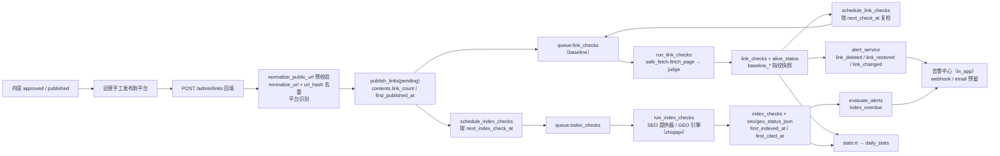
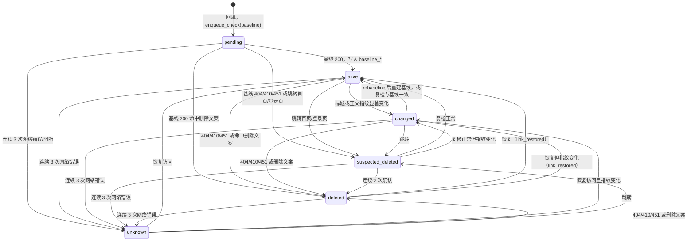
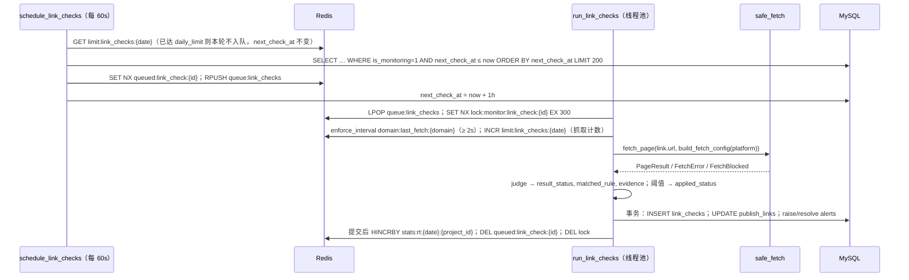
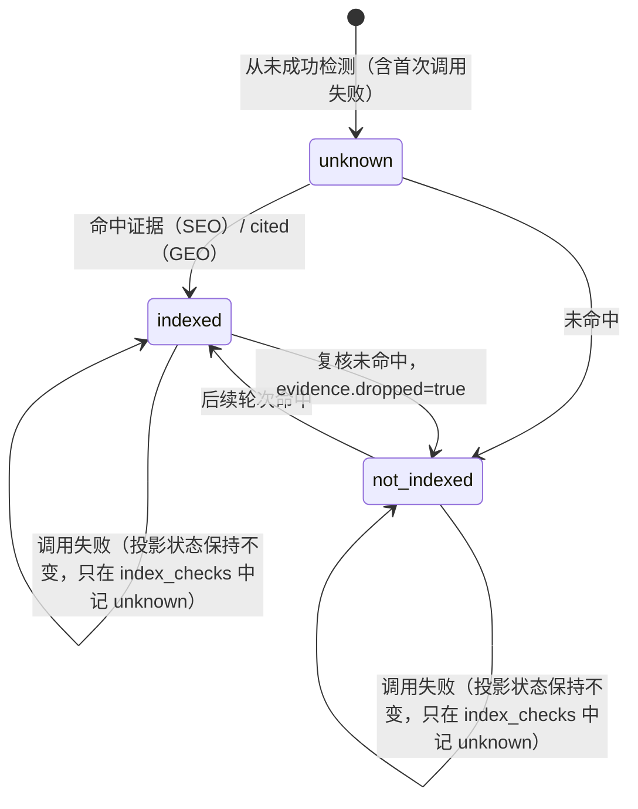
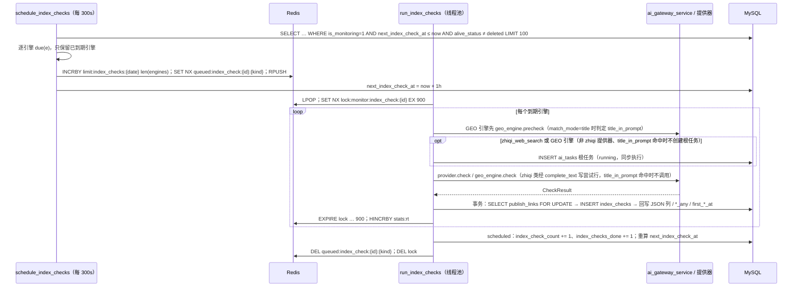

# 11 发布链接回填与监控设计

> 本文档是「回填链接 → 删除检测 → SEO/GEO 收录检测 → 告警」链路的权威设计：定义判定规则、调度频率、状态机、提供器抽象、告警规则与后台页面，以及配置键 `monitoring_config`、`geo_engines`、`seo_providers`、`alert_config` 的结构。表字段以 [03-data-model](./03-data-model.md) 为准（`publish_platforms`/`publish_links`/`link_checks`/`index_checks`/`alerts`），接口参数与响应示例以 [04-api-spec](./04-api-spec.md) 为准，环境变量以 [05-deployment](./05-deployment.md) 为准，zhiqiapi 调用、错误分类与 `ai_tasks` 状态机以 [08-zhiqiapi-integration](./08-zhiqiapi-integration.md) 为准，Redis 键表与 worker 总表以 [01-architecture](./01-architecture.md) 为准，报表指标以 [12-dashboard-reports](./12-dashboard-reports.md) 为准，权限码以 [07-admin-rbac](./07-admin-rbac.md) 为准。

## 1. 目标

文章由运营人员**手工**发布到外部平台之后，平台完成以下闭环：

1. 回填发布链接：一篇文章可对应多条链接、多个平台；记录平台、发布账号、发布时间、回填人与回填时的标题快照。
2. 删除检测：定时探测链接是否仍可访问、是否被平台删除、标题/正文是否被显著修改，形成 `alive_status` 状态流转，删除与恢复产生告警。
3. SEO 收录检测：按引擎（`baidu`/`bing`/`google`）记录链接是否被搜索引擎收录，并保存证据（标题、摘要、命中 URL、提供器、`request_id`）。
4. GEO 引用检测：按引擎（`baidu_ai`/`doubao`/`kimi`/`deepseek`/`perplexity`/`chatgpt`）记录链接是否被生成式引擎引用（解析回答中的引用 URL/域名判定；标题近似只在引擎显式配置 `parse.match_mode=title` 时启用，§8.4），并保存引用片段。
5. 告警：链接被删除/恢复/被改、长期未收录、监控进程失活等事件进入站内告警中心，预留 webhook/邮件通道。
6. 为报表提供口径一致的数据：首次收录时间、收录耗时（发布 → 首次收录）、存活率、收录率、引用率（公式见 [12-dashboard-reports](./12-dashboard-reports.md)）。

所有检测结果写入**不可变**记录表（`link_checks`/`index_checks`），链接当前状态是检测记录的投影（§2.4），报表快照可从历史记录复现。

## 2. 核心决策

### 2.1 手工发布 + 回填，不做自动化代发

首版不登录任何外部平台、不模拟发布动作。运营人员在平台发布后，把最终文章 URL 回填到系统（单条或批量），系统只做「校验 → 入库 → 排程检测」。`publish_account` 仅为展示用的账号/昵称文本，**不保存任何平台凭据**；一篇内容可回填多条链接（同平台多账号、多平台），`url_hash` 全局唯一。

### 2.2 不抓取搜索引擎结果页 HTML

与 navigation 的来源合规原则一致：SEO 收录判定只通过以下途径获得——zhiqiapi 上具备联网检索能力的模型（提供器 `zhiqi_web_search`）、百度 AI 搜索官方 API（`baidu_ai_search`）、站长平台官方 API（`bing_webmaster`/`google_search_console`，仅限自有已验证站点）、人工标记（`manual`）。不请求百度/Bing/Google 的搜索结果页，不绕过验证码、登录与反爬机制。GEO 引用判定同样只依赖 zhiqiapi 联网模型的回答与引用字段（提供器 `zhiqi_model`）或人工标记。

### 2.3 所有外部抓取经 SSRF 安全抓取器

删除检测与平台规则测试统一走 `server/app/core/safe_fetch.py`（参考 navigation `server/app/core/seo_fetch.py` 的 `assert_public_url`/`fetch_public_bytes`/`fetch_article`）：只允许 `http`/`https`、公网 IP、80/443 端口，限制重定向跳数与响应体大小，固定 UA，不执行 JS、不带 Cookie。回填接口只做 URL 语法级预校验（`normalize_public_url`），DNS 与内网 IP 校验放在基线检测里执行；链接类接口内不做任何外网 I/O，唯一例外是平台规则测试 `POST /admin/platforms/{id}/test`（在 API 进程内同步抓取一次，受 §6.1 全部抓取限制，并计入日上限计数 `limit:link_checks:{date}`，§6.7）。

### 2.4 检测记录不可变，链接状态可派生

`link_checks`/`index_checks` 只插入不更新。`publish_links` 上的 `alive_status`、`seo_status_json`、`geo_status_json`、`seo_indexed_any`/`geo_cited_any`、`first_indexed_at`/`first_cited_at` 是检测记录的冗余投影（收录状态在检测结果为 `unknown` 时保留原值，§7.4），与记录插入在同一事务写入；`daily_stats` 的快照列按记录历史派生（见 [12-dashboard-reports](./12-dashboard-reports.md)；`seo_indexed_snapshot`/`geo_cited_snapshot` 取每链接每引擎**最后一条非 `unknown`** 的 `index_checks.result_status`，与上述「`unknown` 不覆盖原 `status`」的投影口径一致），重算结果与当日一致。删除链接时级联删除其检测记录。

### 2.5 AI 检测全部经 zhiqiapi 网关并记 `ai_tasks`

`zhiqi_web_search` 与全部 GEO 引擎的调用经 `ai_gateway_service.complete_text`，每次引擎调用记一个**同步执行**的根任务 + 尝试行（`capability=seo_check`/`geo_check`，`operation=seo_check`/`geo_check`，`target_type=publish_link`），`index_checks.ai_task_id` 指向产出结果的尝试行、`request_id` 冗余上游 `x-oneapi-request-id`，成本与用量对账口径与生成任务完全一致。GEO 引擎以自身 `model`/`protocol` 作为 `model_override`/`protocol_override` 传入，**不回退**到 `capability_routes(geo_check)` 主模型（该路由只用于健康探测与默认 `params`）。检测根任务失败不自动重试、不可 `retry`/`cancel`，等待下次调度。

### 2.6 检测只在 `monitor_worker` 执行，MySQL 是排程权威

API 只负责校验与入队（`queue:link_checks`/`queue:index_checks`），所有抓取与模型调用在 `python -m app.monitor_worker` 的线程池里执行。`publish_links.next_check_at`/`next_index_check_at` 是排程权威，队列元素丢失由调度器按到期时间重新扫描补齐；队列去重标记与锁均带 TTL，消费者崩溃不会永久阻塞再次入队。

## 3. 总体流程



## 4. 回填链接

### 4.1 入口与前置校验

| 入口 | 说明 |
| --- | --- |
| `POST /admin/links` | 单条回填 `{content_id, platform_id?, url, publish_account?, published_at?, note?}`，权限 `publish.links.create`，响应 `{link, queued}` |
| `POST /admin/links/batch` | `{items:[…]}` 批量回填（≤ 100 条，超出 400）→ `{created, failed, results:[{index, ok, link_id, queued, code, message, reason?}]}`（逐条独立事务，整体返回 200，单条失败不影响其它条；成功条目 `code=0`；`url_hash` 重复时 `code=409`，`link_id` 为已存在链接 ID；已存在链接对回填人不可见（属于其他用户的项目）时该条 `link_id=null`、`reason="owned_by_other"`、`message`「该链接已由其他用户回填」，不暴露对方链接 ID（[13-user-data-scope](./13-user-data-scope.md) §7.5、§8）；`reason` 仅在此情形出现；与 [04-api-spec](./04-api-spec.md) §6.17、§7.10 一致） |
| `views/links/Index.vue` 回填弹窗、`views/contents/Editor.vue` 链接面板 | 均使用 `components/LinkBackfillDialog.vue`，调用上述接口 |

`link_service.backfill(db, scope, body, admin_id)`（`scope` 由路由经 `get_data_scope` 传入，[13-user-data-scope](./13-user-data-scope.md) §9.3；`POST /admin/links/batch` 对每条传入同一 `scope`）依次校验，任一失败抛 `BusinessError`：

| 序 | 校验 | 失败 |
| --- | --- | --- |
| 1 | 内容存在、对回填人可见（数据范围，[13-user-data-scope](./13-user-data-scope.md)：普通用户只能回填本人负责项目的内容）且 `contents.status ∈ {approved, published}` | 404 / 409 `data.current_status` |
| 2 | 内容所属项目 `projects.status=active` | 409 |
| 3 | `safe_fetch.normalize_public_url(url, allow_http=monitoring_config.link_check.allow_http)`：scheme 只允许 `http`/`https`、禁止 userinfo、端口只允许 80/443/缺省、拒绝 `javascript:`/`file:`/`data:` 等、主机名 IDNA 小写化；**不做 DNS** | 400 `data=[{"loc":["body","url"],"msg":"…","type":"value_error","input":"ftp://example.com/a"}]` |
| 4 | `platform_id` 缺省 → `platform_service.detect(url)`（§4.3）；给定时平台须存在且 `is_active=1` | 404 / 409 |
| 5 | `url_hash = urls.url_hash(urls.normalize_url(url))` 唯一（全局，跨用户） | 409 `data.existing_id` = 已存在链接 ID（前端提示「该链接已回填」并可跳转详情）；已存在链接对回填人不可见（属于其他用户的项目）时 `data={"existing_id":null,"reason":"owned_by_other"}`，前端提示「该链接已由其他用户回填」，不暴露对方链接 |
| 6 | `published_at` 缺省取当前时间；不得晚于当前时间 + 5 分钟（容忍时钟偏差）；不得早于当前时间 − 3650 天（防年份笔误）；**允许早于内容 `created_at`**（支持登记历史文章、补录早已发布的链接） | 400 `data=[{"loc":["body","published_at"],"msg":"…","type":"value_error","input":"2061-10-06T03:00:00Z"}]` |
| 7 | `publish_account` ≤ 100 字符、`note` ≤ 500 字符 | 400 |

> 本文其余 service 函数签名省略 `scope` 参数：按 [13-user-data-scope](./13-user-data-scope.md) §9.3、§9.4，凡读写 `publish_links`、`link_checks`、`index_checks`、`alerts` 等受范围约束表的函数（如 `link_check_service.check_link`、`index_check_service.run`、`alert_service.raise_alert`/`resolve_alert`/`evaluate`）都以 `scope` 为紧随 `db` 的必填参数：worker 与 monitor-worker 传 `SYSTEM_SCOPE`，路由（如 `rebaseline`、删除链接时的 `resolve_alert`）传本请求的 `scope`。

### 4.2 URL 规范化与哈希去重（`server/app/core/urls.py`）

`normalized_url` 只用于**去重与展示**，删除检测抓取始终使用原始 `url`（部分平台的访问令牌参数如 `xsec_token` 会被规范化去掉，但抓取需要它）。

```python
TRACKING_PARAM_PREFIXES = ("utm_",)
TRACKING_PARAMS = {
    "spm", "from", "share_token", "sharer_shareid", "sharer_sharetime", "srcid", "chksm", "mpshare",
    "scene", "subscene", "xsec_token", "xsec_source", "log_from", "wid", "wfr", "for", "fbclid", "gclid",
}

def normalize_url(url: str) -> str: ...
    # 1. safe_fetch.normalize_public_url：scheme/host 小写、IDNA、去 userinfo 校验、折叠 path 中的 //
    # 2. 去 fragment；去默认端口（:80 / :443）
    # 3. query：parse_qsl(keep_blank_values=True) → 去掉 TRACKING_PARAMS 与 utm_* → 按 key 稳定排序 → urlencode
    # 4. path：quote(unquote(path), safe="/:@!$&'()*+,;=-._~") 统一百分号编码；去尾部 "/"（根路径 "/" 保留）
def url_hash(normalized_url: str) -> str: ...          # SHA-256 hex（64 位），写入 publish_links.url_hash（UNIQUE）
def extract_domain(url: str) -> str: ...               # hostname 小写、去前导 "www."，写入 publish_links.domain
def match_url_patterns(url: str, patterns: list[str]) -> bool: ...   # 任一正则 re.search(pattern, url, re.IGNORECASE) 命中
```

示例：`https://www.zhihu.com/question/1/answer/2?utm_source=wechat&spm=a#top` → `https://www.zhihu.com/question/1/answer/2`；`https://mp.weixin.qq.com/s?__biz=MzA&mid=1&idx=1&sn=abc&chksm=xyz&scene=126` → `https://mp.weixin.qq.com/s?__biz=MzA&idx=1&mid=1&sn=abc`。

### 4.3 平台识别（`platform_service.detect`）

1. 读 `cache:platforms:all`（300s，平台写操作后 `cache_delete`），按 `sort, id` 顺序遍历 `is_active=1` 的平台。
2. 对 `normalized_url` 逐个平台执行 `urls.match_url_patterns(url, url_patterns_json)`，首个命中即返回；`website`/`other` 的 `url_patterns_json` 为空数组，永不自动命中。
3. 未命中返回 `website`（企业官网/自有站点）；运营可在弹窗中改选平台（含 `other`）。
4. 接口 `POST /admin/platforms/detect {url}` → `{platform_id, code}`，无副作用、不写审计；`LinkBackfillDialog.vue` 在 URL 输入框失焦时调用并预填平台下拉。

### 4.4 回填事务

第 1~3 步在**同一事务**内完成（一致性规则见 [03-data-model](./03-data-model.md)「一致性与事务规则 · 链接哈希去重与回填」第 2 条），第 4 步在提交成功后执行（Redis 写入一律在 `commit` 之后，见 03「事务边界总则」）：

1. `INSERT publish_links`：`project_id`（冗余自内容）、`content_id`、`platform_id`、`url`、`normalized_url`、`url_hash`、`domain`、`publish_account`、`published_at`、`backfilled_by=admin_id`、`title_snapshot=contents.title[:300]`、`alive_status='pending'`、`next_check_at=now`（提交后 `enqueue_check` 成功即推后 1h；入队失败或进程在提交与入队之间退出时，由 `schedule_link_checks` 按到期补检：此时 `check_count=0`，调度器以 `check_type=baseline` 入队，首次抓取仍享受规则 3 的基线 404 宽限（§6.3、§6.7）；MySQL 列是排程权威，§2.6）、`index_check_count`=`schedule_days` 中已过期的轮次数（晚回填直接进入对应轮次，§7.5）、`next_index_check_at=compute_next_index_check_at(link)`（基于已初始化的 `index_check_count` 计算）、`index_checks_done=0`、`is_monitoring=1`、`note`。
2. `contents.link_count += 1`；内容为 `approved` 时经 `content_service.transition` 置为 `published`（已是 `published` 不变）。
3. 重算 `contents.first_published_at = MIN(publish_links.published_at WHERE content_id = …)`。
4. 提交后：`HINCRBY stats:rt:{date}:{project_id} links_backfilled 1`（`project_id=0` 行同时累加），再调用 `link_service.enqueue_check(link, "baseline", admin_id)`（§6.7），响应 `queued` 为入队结果（`false` 时附 `reason=already_queued`；基线检测不受日上限拦截，不会返回 `daily_limit`）。

审计中间件写 `admin_operation_logs(action=create, target_type=publish_link, target_id=link.id)`。

### 4.5 编辑、删除、暂停与恢复

| 操作 | 接口 / 权限 | 规则 |
| --- | --- | --- |
| 编辑 | `PUT /admin/links/{id}`，`publish.links.update` | 可改 `platform_id`/`publish_account`/`published_at`/`note`（新的 `published_at` 按 §4.1 第 6 条的上下限校验，同样允许早于内容 `created_at`）；**URL 不可改**（改 URL = 删除后重填）；改 `published_at` 时同事务重算 `next_index_check_at` 与 `contents.first_published_at`，`index_check_count`/`index_checks_done`/`next_check_at` 不变；改平台后下次删除检测按新平台规则判定 |
| 删除 | `DELETE /admin/links/{id}`，`publish.links.delete` | 级联删除 `link_checks`/`index_checks`；同事务 `contents.link_count -= 1`、重算 `first_published_at`；内容 `published` 且 `link_count` 归零 → 回到 `approved`；该链接的 `open`/`acknowledged` 告警（`link_deleted`/`link_changed`/`index_overdue`）同事务逐类型调用 `resolve_alert(db, alert_type, "publish_link", str(link_id))`（`note` 取默认值 `"auto"`，即 `resolved_by=NULL`、`resolution_note='auto'`，与 03「删除规则」一致；「因链接删除而解决」只记入本次操作 `admin_operation_logs` 的差异摘要，不改写 `resolution_note`）；`DEL queued:link_check:{id}`、`queued:index_check:{id}:*`（队列中残留元素由消费者按「链接不存在」直接丢弃） |
| 暂停监控 | `POST /admin/links/{id}/pause`，`publish.links.update` | `is_monitoring=0`、`next_check_at=NULL`、`next_index_check_at=NULL`；已在队列中的手动检测仍会执行一次，非手动元素由消费者丢弃（§6.7、§9 第 2 步） |
| 恢复监控 | `POST /admin/links/{id}/resume`，`publish.links.update` | `is_monitoring=1`；`next_check_at = max(now, compute_next_check_at(link, alive_status, alive_status, alive_status, now=last_checked_at or now, cfg=cfg))`（结果、检测前、写回状态三个参数均取当前 `alive_status`；以最近检测时间为基准推算，再不早于当前时间；`deleted` 已超过 `deleted_recheck_until_days` 时函数返回 `None`，`next_check_at` 保持 `NULL`）（`pending` 链接直接 `enqueue_check(link, "baseline", admin_id)`）；先按 §7.5 重新初始化 `index_check_count`，再 `next_index_check_at = compute_next_index_check_at(link)` |

删除内容的前提是 `link_count=0`（先删链接再删内容），见 [03-data-model](./03-data-model.md)。

## 5. 发布平台与删除特征规则

### 5.1 数据与缓存

平台表 `publish_platforms` 的完整字段见 [03-data-model](./03-data-model.md)。本文使用的列：`code`（唯一、创建后不可改，被 `daily_stats.dimension_key` 引用）、`url_patterns_json`（识别正则数组）、`deleted_markers_json`（200 页面中判定「已删除」的特征文案数组）、`redirect_markers_json`（判定跳转到首页/登录页的 URL 正则数组）、`fetch_config_json`（抓取覆盖项）、`is_system`（seed 平台不可删除）、`is_active`（停用后不可回填）、`sort`。平台列表缓存 `cache:platforms:all`（300s），任何写操作后 `cache_delete("cache:platforms:all")`。

### 5.2 内置平台与规则示例

`server/seeds/seed.py` 幂等 upsert 以下 8 个平台（`is_system=1`）。markers 为**示例初值，以实际平台页面为准，后台可维护**；文案匹配不区分大小写，范围为 `<title>` 与正文前 2000 字符（§6.3 规则 5）。

| code | 名称 | `url_patterns_json` | `deleted_markers_json`（示例） | `redirect_markers_json`（示例） |
| --- | --- | --- | --- | --- |
| `zhihu` | 知乎 | `["^https?://(www\\.\|zhuanlan\\.)?zhihu\\.com/"]` | `["你似乎来到了没有知识存在的荒原", "内容已被删除", "该内容已被作者删除", "违反社区规范"]` | `["^https?://www\\.zhihu\\.com/signin", "^https?://www\\.zhihu\\.com/?$"]` |
| `wechat_mp` | 微信公众号 | `["^https?://mp\\.weixin\\.qq\\.com/"]` | `["该内容已被发布者删除", "此内容因违规无法查看", "此内容发送失败无法查看", "参数错误"]` | `[]` |
| `xiaohongshu` | 小红书 | `["^https?://(www\\.)?xiaohongshu\\.com/", "^https?://xhslink\\.com/"]` | `["当前笔记暂时无法浏览", "笔记不存在", "你访问的页面不见了", "该笔记已被删除"]` | `["^https?://www\\.xiaohongshu\\.com/?$", "^https?://www\\.xiaohongshu\\.com/404"]` |
| `csdn` | CSDN | `["^https?://(blog\\.\|www\\.)?csdn\\.net/"]` | `["您访问的页面不存在", "文章已被删除", "该文章已被作者删除"]` | `["^https?://www\\.csdn\\.net/?$", "^https?://passport\\.csdn\\.net/"]` |
| `toutiao` | 今日头条 | `["^https?://(www\\.\|m\\.)?toutiao\\.com/"]` | `["内容已删除", "该内容已下线", "文章不存在", "暂无内容"]` | `["^https?://www\\.toutiao\\.com/?$", "^https?://sso\\.toutiao\\.com/"]` |
| `baijiahao` | 百家号 | `["^https?://baijiahao\\.baidu\\.com/"]` | `["该内容已被删除", "此内容已被作者删除", "内容不存在", "很抱歉，您访问的页面不存在"]` | `["^https?://baijiahao\\.baidu\\.com/?$", "^https?://www\\.baidu\\.com/?$"]` |
| `website` | 企业官网/自有站点 | `[]` | `["页面不存在", "文章不存在", "文章已删除", "404 Not Found"]` | `[]` |
| `other` | 其他 | `[]` | `["内容不存在", "该内容已被删除", "页面不存在"]` | `[]` |

规则编写约定：

- `url_patterns_json`/`redirect_markers_json` 为 Python `re` 正则，保存时 `re.compile` 校验，非法返回 400 `data=[{"loc":["body","url_patterns",1],"msg":"正则无法编译：…","type":"value_error","input":"^https?://(www\\.example\\.com/"}]`（`redirect_markers` 同理，`loc` 为 `["body","redirect_markers",<序号>]`）。
- `deleted_markers_json` 为纯文本（非正则），单条 4~100 字符、数组 ≤ 50 条（保存时校验，不足 4 字符返回 400）：拒绝「404」「删除」这类过短泛用词以免命中正文中的普通叙述，「404 Not Found」「页面不存在」等组合短语允许。
- 跳转到首页的通用判定（最终 URL path 为 `/`）由代码固定实现，不需要写入 `redirect_markers_json`；`redirect_markers_json` 用于登录页、404 落地页等非根路径。

### 5.3 `fetch_config_json` 与请求头白名单

`{"user_agent":"","headers":{},"timeout_seconds":15,"respect_robots":false,"allow_http":true}`；空对象或缺失键取 `monitoring_config.link_check` 同名默认值（`link_check_service.build_fetch_config(platform, monitoring_config)` 以配置为底、平台非空键覆盖）。`schemas/platform.py` 校验 `headers`：键忽略大小写，拒绝 `cookie`/`authorization`/`proxy-authorization`（400），只允许 `Accept-Language`、`Referer` 与 `X-*`；`user_agent` 允许覆盖（如需移动端页面）：覆盖值 ≤ 200 字符且必须包含子串 `aicreat`（保持可识别，可在移动端 UA 末尾追加 ` aicreatLinkMonitor/1.0`），否则 400；空字符串表示不覆盖。

### 5.4 规则测试与平台维护

| 操作 | 接口 / 权限 | 规则 |
| --- | --- | --- |
| 规则测试 | `POST /admin/platforms/{id}/test {url}`，`publish.platforms.test` | 用该平台 `fetch_config` 经 `safe_fetch.fetch_page` 实时抓取一次（§6.1 全部限制，计入 `limit:link_checks:{date}`），以该平台规则执行 `judge`（无基线、`check_type=manual`），返回 `{result_status, matched_rule, http_status, final_url, redirect_count, title, duration_ms, evidence}`（与 [04-api-spec](./04-api-spec.md) §6.16 一致；`evidence` 与 `link_checks.evidence_json` 同构（§6.9）：命中文案在 `evidence.marker`/`evidence.context`，正文前 300 字符在补充键 `evidence.text_excerpt`）；在 API 进程内同步执行（不占 `monitor_worker` 的信号量，但同样执行 `enforce_interval` 同域名间隔）；不写库；审计 `execute` |
| 新建 / 编辑 | `POST /admin/platforms`、`PUT /admin/platforms/{id}`，`publish.platforms.create/update` | `code` 唯一且创建后不可改；编辑规则立即影响后续检测（已有基线不变） |
| 停用 | `PUT` 置 `is_active=0` | 既有链接继续检测与收录检测，新回填到该平台返回 409 |
| 删除 | `DELETE /admin/platforms/{id}`，`publish.platforms.delete` | `is_system=0` 且无 `publish_links` 引用，否则 409 |

## 6. 删除检测

### 6.1 抓取器安全限制（`server/app/core/safe_fetch.py`）

```python
class FetchError(RuntimeError): ...        # 网络错误 / 超时 / 5xx 连接层失败 / 响应超限 / 重定向过多
class FetchBlocked(FetchError): ...        # SSRF 拒绝 / robots 禁止（judge 规则 1）

@dataclass(frozen=True)
class FetchConfig:
    timeout_seconds: float = 15; max_response_bytes: int = 2_097_152; max_redirects: int = 3
    user_agent: str = "aicreatLinkMonitor/1.0 (+https://example.com/contact)"
    headers: dict[str, str] = field(default_factory=dict)       # 已经 schemas/platform.py 白名单校验
    allow_http: bool = True; respect_robots: bool = False

@dataclass
class PageResult:
    status: int; final_url: str; redirect_chain: list[tuple[int, str]]   # [(302, "https://…"), …]
    headers: dict[str, str]                                              # 小写键；排除 set-cookie
    is_html: bool; title: str | None; text: str                          # text 为正文纯文本（≤ 40000 字符）
    response_bytes: int; duration_ms: int

def normalize_public_url(value: str, *, allow_http: bool = True) -> str: ...
    # 语法级校验：scheme ∈ {http, https}（allow_http=False 时仅 https）、禁止 userinfo、端口 ∈ {缺省, 80, 443}、主机 IDNA 小写、折叠 path 中的 //；失败抛 FetchBlocked；不做 DNS
def assert_public_url(value: str, *, allow_http: bool = True) -> str: ...
    # normalize_public_url + 主机黑名单（localhost、*.local、*.internal、*.localhost）+ IP 字面量与 getaddrinfo 全部地址均须 ip.is_global
    # （排除回环/私网/链路本地/保留/多播与云元数据 169.254.169.254、fd00::/8）；解析失败抛 FetchError("dns_failed")
def fetch_public_bytes(url: str, *, config: FetchConfig, accept: str = "text/html,application/xhtml+xml;q=0.9,*/*;q=0.1") -> tuple[bytes, str, int, dict[str, str], list[tuple[int, str]]]: ...
    # httpx.Client(follow_redirects=False, timeout=httpx.Timeout(connect=5, read=config.timeout_seconds, write=10, pool=5))
    # 手动跟随 3xx：Location 相对地址 urljoin，每跳先 assert_public_url；跳数 > max_redirects 抛 FetchError("too_many_redirects")
    # 流式读取 max_response_bytes + 1，超限抛 FetchError("response_too_large")；4xx/5xx 不抛，原样返回 (body, final_url, status, headers, chain)
    # 只发送 User-Agent / Accept / Accept-Language / 平台白名单头；不发送 Cookie、Authorization；不复用上一跳的响应 Cookie
def fetch_page(url: str, *, config: FetchConfig) -> PageResult: ...
    # respect_robots=True 时先 robots_allowed，False 抛 FetchBlocked("blocked_by_robots")
    # fetch_public_bytes → Content-Type 为 text/html 或 application/xhtml+xml 时按 charset（Content-Type → <meta charset> → utf-8，errors="replace"）解码并 fingerprint.extract_main_text；否则 is_html=False、title=None、text=""
def robots_allowed(url: str, *, user_agent: str, timeout: float) -> bool: ...
    # 缓存 robots:{domain}（Redis JSON {allowed, fetched_at}，86400s；navigation 为进程内 dict，这里改为 Redis 以便多副本共享）
    # robots.txt 返回 404/410 视为允许；其它失败视为不允许并缓存 900s（严格模式）
def stream_public_bytes(url: str, dest: BinaryIO, *, max_bytes: int, allowed_types: tuple[str, ...], max_redirects: int = 3, timeout: float) -> DownloadResult: ...
    # 媒体转存专用（见 10-media-generation），规则同上：逐跳 assert_public_url、不带 Authorization
    # DownloadResult 定义在 core/zhiqi/types.py（见 08-zhiqiapi-integration §5.2，与 client.stream_download / videos.download_content 共用）
    # 成功返回 DownloadResult(source="cdn", request_id=None, http_status=最终一跳状态码, request_ids=[])（第三方 CDN 无上游请求号）
    # 超过大小上限、Content-Type 不在 allowed_types、魔数校验失败（storage.sniff_media_type）或读取失败（含逐跳校验被拒、重定向过多）
    #   → 抛 ZhiqiError(TRANSFER_FAILED)，携带已收到的 http_status（未收到响应时为 None）
    # 调用方 transfer_media 把返回值或异常携带的值写入根任务 response_meta_json.download（10-media-generation §4.8）
```

限制汇总（取值来自 `monitoring_config.link_check`，平台 `fetch_config_json` 可覆盖 `user_agent`/`headers`/`timeout_seconds`/`respect_robots`/`allow_http`）：

| 项 | 限制 |
| --- | --- |
| 协议 / 端口 | `http`/`https`（`allow_http=false` 时仅 `https`，生产环境设 `MONITOR_ALLOW_HTTP=false`）；端口 80/443/缺省 |
| 目标地址 | 回填时语法级校验；检测时 DNS 解析后所有地址必须为公网地址，重定向每跳重新校验，命中 → `ssrf_blocked` |
| 重定向 | ≤ `max_redirects=3`，`follow_redirects=False` 手动跟随，记录 `PageResult.redirect_chain`（证据中写为 URL 字符串数组 `redirects`，§6.9） |
| 响应体 | ≤ `max_response_bytes=2097152`（2 MB），流式读取超限即中止 → `network_error` |
| 内容类型 | 只解析 `text/html`/`application/xhtml+xml`；其它类型（PDF、图片）只按状态码判定、不做指纹、不做文案匹配 |
| 超时 | connect 5s（固定）、read `timeout_seconds=15` |
| UA | `user_agent`（seed 自 `MONITOR_USER_AGENT`，含联系地址）；平台覆盖值须含 `aicreat`（§5.3） |
| Cookie / 凭据 / JS | 不发送 Cookie 与 Authorization；不执行 JavaScript；不提交表单 |
| 并发 | 进程内 `BoundedSemaphore(global_concurrency=4)`；同域名最小间隔 `per_domain_interval_seconds=2`（`ratelimit.enforce_interval` + `domain:last_fetch:{domain}`） |
| 日上限 | `limit:link_checks:{date}` 记当日实际抓取次数（含基线、手动检测与 `POST /admin/platforms/{id}/test`）；`daily_limit=5000` 由调度 / 批量入队前判定，抓取时计数；回填基线、单链接手动检测与规则测试只计数、不拦截（§6.7） |
| robots | `respect_robots=false`（默认关闭：检测对象是运营自己发布的文章页，常规频率每链接每日 ≤ 1 次；可按平台以 `fetch_config_json.respect_robots=true` 开启），开启时 `robots:{domain}` 缓存 24 小时 |

### 6.2 页面解析与指纹（`server/app/core/fingerprint.py`）

```python
def extract_main_text(html: str) -> tuple[str | None, str]: ...
    # 返回 (title, text)：HTMLParser 跳过 script/style/noscript/svg/canvas/form/nav/footer/aside/header/iframe；
    # 优先 <article>/<main> 内文本（合并后 ≥ 200 字符时采用），否则全文；title 取 og:title，其次 <title>；文本合并空白、截断 40000 字符
def normalize_title(title: str | None) -> str: ...
    # NFKC → 去掉站点后缀（最后一个 " - " / " | " / " _ " / "｜" 之后的部分，仅当剩余 ≥ 4 字符）→ 去标点与空白 → 小写；None → ""
def simhash64(text: str) -> int: ...
    # 特征：中文按字符 3-gram、英文/数字按小写单词；权重 = 频次；64 位 SimHash
    # 返回有符号 64 位整数：v - (1 << 64) if v >= 1 << 63 else v（可直接存 BIGINT，SQLite 测试会话同样可存）
def hamming_distance(a: int, b: int) -> int: ...
    # 先 & ((1 << 64) - 1) 转回无符号再异或，取 bit_count()
```

正文不足 80 字符时 `simhash=NULL`（不做正文比对，只比标题），证据记 `short_text=true`。

### 6.3 判定规则

`link_check_service.judge(fetch_result: PageResult | FetchError, link, platform, *, check_type: str) -> tuple[str, str, dict]`（返回 `(result_status, matched_rule, evidence)`：`check_type` 为 keyword 参数，仅规则 3 的基线特例使用；`evidence` 为写入 `evidence_json` 的字典），按顺序首个命中：

| 序 | 条件 | `result_status` | `matched_rule` |
| --- | --- | --- | --- |
| 1 | `FetchBlocked`：SSRF 拒绝 / robots 禁止（`respect_robots=true`） | `unknown` | `ssrf_blocked` / `blocked_by_robots` |
| 2 | `FetchError`（DNS 失败、连接/读取超时、重定向过多、响应超限）或 HTTP 5xx，以及 401/403/429 等未在下文列出的 4xx（视为访问受阻而非删除） | `unknown` | `network_error` |
| 3 | HTTP 404 / 410 / 451 | `deleted`；`check_type=baseline` 时为 `suspected_deleted`（等待确认） | `http_404` / `http_410` / `http_451` |
| 4 | 发生过重定向且：最终 URL 命中 `redirect_markers_json` 任一正则，或最终 URL 的 path 为 `/`（且原 URL path 非 `/`） | `suspected_deleted` | `redirect_login`（命中含 `login`/`signin`/`passport`/`sso` 的规则或 URL）/ `redirect_home` |
| 5 | HTTP 200 且 `title` 或 `text[:2000]` 命中 `deleted_markers_json` 任一文案（忽略大小写） | `deleted`（基线检测同样立即 `deleted`，即 `pending → deleted`） | `marker:<文案>`（整体截断 100 字符） |
| 6 | HTTP 200 且已有基线（`baseline_captured_at` 非空）：`title_compare=true` 且双方标题非空且 `normalize_title(title) != normalize_title(baseline_title)`；或双方 `simhash` 非空且 `hamming_distance(simhash, baseline_simhash) >= changed_simhash_distance(20)` | `changed` | `title_changed` / `body_changed` |
| 7 | HTTP 200 且无基线（基线检测，或 `rebaseline` 清空后） | `alive`（同事务写入 `baseline_*`，§6.8） | `ok` |
| 8 | 其它 2xx/3xx | `alive` | `ok` |

规则 5 的文案匹配只在 `is_html=true` 时执行；非 HTML 的 200 走规则 8。规则 6 只在 `is_html=true` 且基线存在时执行，否则跳到规则 8（非 HTML 链接不做变更检测）。

### 6.4 确认阈值与计数器

- 两个计数器：结果 `unknown` → `consecutive_unknown += 1`、`consecutive_suspected = 0`；结果 `suspected_deleted` → `consecutive_suspected += 1`、`consecutive_unknown = 0`；其它结果（`alive`/`changed`/`deleted`）→ 两者清零。阈值只看最近连续同类结果，混合序列（suspected, unknown, unknown）因此有确定结果。
- 饱和规则：累加一律取 `min(当前值 + 1, 100)`。两列在 [03-data-model](./03-data-model.md) B.20 中为 `TINYINT`（有符号上限 127），长期不可达的链接（DNS 失败、站点关停）每次都是 `unknown`，按 24h 退避约 125 天后第 128 次累加就会越界，MySQL 严格模式下写回报 1264 Out of range、整个写回事务回滚（SQLite 测试会话不会暴露）；阈值 `unknown_confirm_count`/`suspected_confirm_count` ≤ 10、退避索引 `min(n-1, 2)` 都不受饱和影响。
- `unknown`：`consecutive_unknown < unknown_confirm_count(3)` 时链接状态**不变**（`applied_status = previous_status`，可为 `pending`）；达到 3 次写 `unknown`（`deleted` 状态同样适用：连续 3 次网络错误 → `deleted → unknown`）。
- `suspected_deleted`：检测前为 `deleted` 时保持 `deleted`（`consecutive_suspected` 照常累加，不回退为 `suspected_deleted`，因此不会再次产生 `link_deleted`、重复计入 `links_deleted` 或反复重算收录排程）；否则首次写 `suspected_deleted`，`consecutive_suspected >= suspected_confirm_count(2)`（含规则 3 的基线 404）时写 `deleted`。
- `deleted`（规则 3 非基线、规则 5）：立即写 `deleted`（含 `pending → deleted`）。
- `changed`：立即写 `changed`；再次检测仍为 `changed` 则保持；复检时标题/指纹重新与基线一致（规则 6 未命中 → 规则 8）→ `alive`；`rebaseline` 清空基线后下次 200 走规则 7 → `alive`。
- `alive`/`changed`：若检测前为 `deleted` → 视为恢复，产生 `link_restored` 告警（创建即 `resolved`）并自动解决该链接的 `link_deleted`；回到 `alive` 时自动解决 `link_changed`。
- `applied_status` 与 `previous_status` 均写入 `link_checks`，`alive_status` 变化时写 `alive_changed_at=now`。

### 6.5 存活状态机（`publish_links.alive_status`）



图中没有 `deleted → suspected_deleted` 这条边：`deleted` 状态下复检遇到跳转首页/登录页（结果 `suspected_deleted`）或未达阈值的网络错误时保持 `deleted`（§6.4）。

### 6.6 调度频率与退避

`link_service.compute_next_check_at(link, result_status, previous_status, applied_status, *, now, cfg) -> datetime | None`（`cfg = monitoring_config.link_check`；`applied_status` 为应用确认阈值后写回的 `alive_status`，§6.4）：

| 条件 | 下次检测 |
| --- | --- |
| 回填（基线）/ `rebaseline` | 立即入队（`enqueue_check(link, "baseline" / "manual", admin_id)`）；回填时 `next_check_at=now`，入队成功后推后 1h；基线入队失败时由调度器对 `check_count=0` 的到期链接以 `baseline` 补检（§4.4、§6.7） |
| `published_at` 距今 ≤ `initial_days=7` 且结果 `alive` | `now + initial_interval_hours=24` |
| 距今 > 7 天且结果 `alive` | `now + regular_interval_days=7` |
| 写回状态为 `deleted`（结果 `deleted` 或 `suspected_deleted`，含经跳转确认的删除与 `deleted` 状态下的跳转复检；优先于下一行的退避） | `now + deleted_recheck_days=7`，直到 `alive_changed_at + deleted_recheck_until_days=30`，超出则 `NULL`（不再检测，可手动检测） |
| 结果 `suspected_deleted`（写回状态非 `deleted`）/ `unknown` | `now + abnormal_backoff_hours[min(max(consecutive_unknown, consecutive_suspected, 1) - 1, 2)]`（6h → 12h → 24h）；调度器见计数器 > 0 以 `check_type=retry` 入队 |
| 结果 `changed` 且检测前非 `changed`（首次进入） | `now + abnormal_backoff_hours[0]`（6h，复核一次） |
| 结果 `changed` 且检测前已为 `changed`（持续变化，等待 `rebaseline`） | 按 `alive` 规则，不再加密检测 |
| `is_monitoring=0` | `NULL`；恢复时按当前状态重算（§4.5） |
| 手动检测（`check_type=manual`） | 入队不触碰 `next_check_at`；写回时仅当 `applied_status != previous_status` 才按上表重算，否则写回原值 |

```python
def compute_next_check_at(link, result, previous, applied, *, now, cfg):
    if not link.is_monitoring:
        return None
    if applied == "deleted" and result in ("deleted", "suspected_deleted"):
        # 进入 deleted 时 alive_changed_at 已按本次写回置为 now；deleted 状态下的跳转复检同样走此分支
        until = link.alive_changed_at + timedelta(days=cfg["deleted_recheck_until_days"])
        nxt = now + timedelta(days=cfg["deleted_recheck_days"])
        return nxt if nxt <= until else None
    if result in ("suspected_deleted", "unknown"):
        n = max(link.consecutive_unknown, link.consecutive_suspected, 1)        # 已含本次累加（饱和于 100）
        return now + timedelta(hours=cfg["abnormal_backoff_hours"][min(n - 1, 2)])
    if result == "changed" and previous != "changed":
        return now + timedelta(hours=cfg["abnormal_backoff_hours"][0])
    if (now - link.published_at).days <= cfg["initial_days"]:
        return now + timedelta(hours=cfg["initial_interval_hours"])
    return now + timedelta(days=cfg["regular_interval_days"])
```

`link_check.enabled=false` 时 `schedule_link_checks` 不扫描（到期链接积压，恢复后按 `next_check_at` 顺序逐批补检，不追补历史轮次），手动检测仍可用。

### 6.7 队列、锁与执行流程

队列元素（`queue:link_checks`，JSON）：

```json
{ "link_id": 1, "check_type": "scheduled", "triggered_by": null }
```

`link_service.enqueue_check(link, check_type, triggered_by) -> bool`（与 [01-architecture](./01-architecture.md) §6.1、[02-project-structure](./02-project-structure.md) 一致；返回 `False` 时接口层映射为 `reason=already_queued`）：

1. `SET queued:link_check:{link_id} 1 NX EX 3600` 失败 → 返回 `False`。
2. `check_type=manual` → `LPUSH`（插队），其它 → `RPUSH`。
3. `check_type ∈ {baseline, scheduled, retry}` 时 `next_check_at = now + 1h`（防重复入队，兼作队列元素丢失的兜底）；`manual` 不触碰。

日上限不在 `enqueue_check` 内判定。`limit:link_checks:{date}` 记当日**实际抓取**次数：`run_link_checks.process_one`（抓取前）与平台规则测试各 `INCR` 一次，写入后 `EXPIRE 172800`。`schedule_link_checks.enqueue_due` 与 `POST /admin/monitoring/link-checks/run` 在调用 `enqueue_check` 之前读取该键判定：已达 `link_check.daily_limit` 时，调度器本轮不入队、`next_check_at` 保持不变（链接留在当前游标等下轮扫描，次日计数键切换后自然恢复入队，与 [03-data-model](./03-data-model.md) B.20 一致），批量入口把超限链接计入 `skipped`；未达上限时本轮入队数不超过剩余额度（`daily_limit − 已用`）。回填基线、单链接手动检测（`POST /admin/links/{id}/check`、`/rebaseline`）与规则测试只计数、不受日上限拦截，因此这些接口不会返回 `daily_limit`。

调度器 `tasks/schedule_link_checks.py::enqueue_due(limit=200)` 每 `scan_interval_seconds=60` 在主循环线程执行（短 SQL + Redis 读写，无网络 I/O），持单例锁 `lock:monitor:schedule:link_checks`（60s）；先按上文判定日上限，再为到期链接选择 `check_type`：`check_count=0`（尚未完成任何检测，即回填后基线入队失败或进程在提交与入队之间退出）→ `baseline`，与回填时直接入队的基线检测一样享受规则 3 的基线 404 宽限（§6.3），但随本轮调度一起受日上限约束；否则 `consecutive_unknown > 0 or consecutive_suspected > 0` → `retry`；其余 → `scheduled`。



`run_link_checks.process_one(payload)`：

1. `SET lock:monitor:link_check:{link_id} NX EX 300` 失败 → 丢弃该元素、**不**删除 `queued:link_check` 标记（由持锁者完成时删除）、记 INFO。
2. 读取链接与平台；链接不存在或 `is_monitoring=0`（手动检测除外）→ 删除标记后结束。
3. 获取进程内信号量 `sems["link_check"]`（`global_concurrency=4`）后调用 `link_check_service.check_link(db, link, check_type, triggered_by) -> LinkCheck`：`enforce_interval("domain:last_fetch:{domain}", per_domain_interval_seconds)` → `INCR limit:link_checks:{date}`（`EXPIRE 172800`；只计数、不拦截）→ `fetch_page(link.url, config=build_fetch_config(platform, monitoring_config))`。
4. `judge` → 计数器与 `applied_status`（§6.4）→ `compute_next_check_at(link, result_status, previous_status, applied_status, now=now, cfg=cfg)`（manual 仅状态变化时重算）。
5. 写回事务（§6.9）；`finally`：`DEL queued:link_check:{link_id}`、释放锁与信号量。任何异常同样走 `finally`，并以 `result_status=unknown, matched_rule=network_error, error_message=脱敏异常` 落一条记录（抓取器自身异常不丢记录）。

手动入口：`POST /admin/links/{id}/check`（单链接，`publish.links.check`；返回 `{queued:true}` 或 `{queued:false, reason:"already_queued"}`，不受日上限拦截）、`POST /admin/monitoring/link-checks/run`（批量，`monitoring.link_checks.run`，`{project_id?, platform_id?, link_ids?[], only_due:true}` → `{enqueued, skipped}`；入队前读取 `limit:link_checks:{date}` 判定，已在队列或超日上限计入 `skipped`）。

### 6.8 指纹快照（基线）与 `rebaseline`

- 基线 = 首次成功抓取（规则 7）时写入的 `baseline_title`（≤ 300）、`baseline_simhash`、`baseline_excerpt`（正文前 1000 字符）、`baseline_captured_at`。基线**不随 `changed` 自动更新**，由运营确认后重建。
- `POST /admin/links/{id}/rebaseline`（`publish.links.check`）：同事务清空四个 `baseline_*` 列（`alive_status` 暂不变）、`resolve_alert(db, "link_changed", "publish_link", str(link_id))`，然后 `enqueue_check(link, "manual", admin_id)`；下次 200 走规则 7 重建基线并写 `alive`。
- 对反爬验证页、地区差异页等导致的误判 `changed`，运营可先用 `POST /platforms/{id}/test` 查看实际抓到的标题与正文摘录，再决定 `rebaseline` 或调整平台 `fetch_config_json`（如 UA）。

### 6.9 写回事务与证据

同一事务内（[03-data-model](./03-data-model.md)「一致性与事务规则 · 检测写回」第 1 条）：

1. `INSERT link_checks(link_id, check_type, result_status, previous_status, applied_status, http_status, final_url, redirect_count, matched_rule, title, simhash, hamming_distance, response_bytes, duration_ms, error_message, evidence_json, checked_at=now, triggered_by)`。
2. `UPDATE publish_links SET alive_status=applied_status, alive_changed_at=（变化时 now）, last_checked_at=now, next_check_at=…, check_count+=1, consecutive_unknown=…, consecutive_suspected=…（按 §6.4 饱和后的值写入，≤ 100）, last_http_status=…, baseline_*=（规则 7 时写入）`；收录排程在同一条 `UPDATE` 内处理：进入 `deleted` → `next_index_check_at=NULL`，离开 `deleted` → `next_index_check_at=compute_next_index_check_at(link)` 重算。
3. 进入 `deleted` → `alert_service.raise_alert(db, "link_deleted", target_type="publish_link", target_id=link_id, project_id=link.project_id, title=f"链接已被删除：{normalized_url 去掉 scheme}", message=…, payload={"url", "platform_code", "matched_rule", "link_check_id", "content_id"})`（与 [04-api-spec](./04-api-spec.md) §7.13 一致；`link_check_id` 为第 1 步插入的记录 ID，供前端跳转证据与内容）。`message` 是按 `matched_rule` 生成的中文说明：规则 5 为 `平台 {platform_code} 命中删除特征「{marker}」（HTTP {http_status}）`，规则 3 为 `平台 {platform_code} 返回 HTTP {http_status}`，规则 4 确认为 `平台 {platform_code} 连续 {consecutive_suspected} 次跳转到首页/登录页`。`deleted → alive/changed` → `raise_alert(db, "link_restored", …)`（创建即 `resolved`）并 `resolve_alert(db, "link_deleted", "publish_link", str(link_id))`；进入 `changed` → `raise_alert(db, "link_changed", …)`；回到 `alive` → `resolve_alert(db, "link_changed", "publish_link", str(link_id))`。`link_restored`/`link_changed` 的 `payload` 使用同一组键。
4. 提交后：`HINCRBY stats:rt:{date}:{project_id}`（`project_id=0` 行同时累加）：`links_checked`；`applied_status` 进入 `deleted`（`previous_status != deleted`）→ `links_deleted`；进入 `changed` → `links_changed`；`deleted → alive/changed` → `links_restored`；然后 `DEL queued:link_check:{link_id}`。

写入 `link_checks` 时按 [03-data-model](./03-data-model.md) B.21 的列宽截断：`title` ≤ 300、`final_url` ≤ 1000、`error_message` ≤ 500（`matched_rule` 已按规则 5 截断至 100），避免 MySQL 严格模式下 Data too long 导致整个写回事务回滚。

`evidence_json` 示例（规则 5 命中）：

```json
{
  "marker": "该内容已被发布者删除",
  "context": "…微信公众平台 该内容已被发布者删除 返回首页…",
  "redirects": ["https://mp.weixin.qq.com/s/xxxx"],
  "headers": { "content-type": "text/html; charset=utf-8", "server": "nginx", "content-length": "3120" },
  "title": "微信公众平台",
  "text_excerpt": "该内容已被发布者删除 …（前 300 字符）",
  "short_text": false
}
```

`marker`（命中文案）、`context`（命中处上下文）、`redirects`（重定向经过的 URL 字符串数组，取自 `PageResult.redirect_chain`）、`headers`（响应头摘要）四个键与 [03-data-model](./03-data-model.md) B.21、[04-api-spec](./04-api-spec.md) §7.12 一致；`title`、`text_excerpt`（正文前 300 字符）、`short_text`（§6.2）为补充键，平台规则测试返回的 `evidence` 与此同构（§5.4）。`headers` 排除 `set-cookie`；`error_message` 不含目标站响应体，只含异常类型与简短原因（如 `ReadTimeout after 15s`）。

## 7. SEO 收录检测

### 7.1 提供器抽象与接口签名（`server/app/services/index_providers/base.py`）

```python
@dataclass
class CheckContext:
    link: PublishLink; kind: str                      # "seo" / "geo"
    engine: str; engine_name: str                     # 引擎 code（baidu / doubao …）与展示名
    url: str; normalized_url: str; domain: str        # 来自 publish_links
    title: str; keyword: str | None                   # contents.title；contents.keyword_id → keywords.keyword（可空）
    platform_code: str                                # 用于 domain 命中规则（§8.4）
    query_by: list[str]                               # monitoring_config.index_check.query_by
    check_type: str; triggered_by: int | None         # scheduled / manual；手动触发人
    project_id: int

@dataclass
class CheckResult:
    status: str                                       # SEO：indexed / not_indexed / unknown；GEO：cited / not_cited / unknown
    provider: str                                     # index_checks.provider
    match_mode: str = "none"                          # url / domain / title / none
    query_text: str | None = None
    evidence_title: str | None = None; evidence_snippet: str | None = None; evidence_url: str | None = None
    evidence: dict[str, Any] = field(default_factory=dict)      # 写入 evidence_json（原始回答截断 4000 字符）
    confidence: Decimal | None = None
    ai_task_id: int | None = None; request_id: str | None = None; model: str | None = None
    duration_ms: int = 0
    error_category: str | None = None; error_message: str | None = None

class SeoProvider(Protocol):
    code: str                                                                     # seo_provider 枚举值（取值集合见 00-overview）
    def check(self, db: Session, link: PublishLink, engine: str, query_by: list[str], *, ctx: CheckContext) -> CheckResult: ...
    def available(self) -> tuple[bool, str | None]: ...                           # (可用, 不可用原因：credential_missing / mock_mode)

class GeoEngine(Protocol):
    def precheck(self, db: Session, link: PublishLink, engine: dict, *, ctx: CheckContext) -> CheckResult | None: ...   # 调用前预检（§8.2）：命中 title_in_prompt 返回 unknown 结果，否则 None；index_check_service 在创建根任务之前调用（§9）
    def check(self, db: Session, link: PublishLink, engine: dict, *, ctx: CheckContext) -> CheckResult: ...   # engine = geo_engines.engines[] 中的一项

# __init__.py
def get_seo_provider(code: str) -> SeoProvider: ...     # zhiqi_web_search / baidu_ai_search / bing_webmaster / google_search_console / manual；未知 code 抛 KeyError
def get_geo_engine(code: str) -> GeoEngine: ...         # 当前固定返回 geo_engine.ZhiqiModelEngine（provider="zhiqi_model"）
```

提供器的职责边界：只负责「调用 + 解析 + 返回 `CheckResult`」，**不写库**；`index_checks` 插入与 `publish_links` 回写由 `index_check_service` 完成（§9）。提供器内部不得抛出未分类异常：网络/上游异常转为 `status="unknown"` + `error_category`（取值见 [08-zhiqiapi-integration](./08-zhiqiapi-integration.md) 错误分类）。

### 7.2 各提供器行为与限制

| provider | 适用引擎 | 调用方式 | 判定 | 限制 / 失败处理 |
| --- | --- | --- | --- | --- |
| `zhiqi_web_search`（默认） | `baidu`/`bing`/`google` | `ai_gateway_service.complete_text(capability=seo_check, model_override=engines.<e>.model or None, protocol_override=providers.zhiqi_web_search.protocol, extra=providers.zhiqi_web_search.extra)`（读超时取 `providers.zhiqi_web_search.timeout_seconds`，按 [08-zhiqiapi-integration](./08-zhiqiapi-integration.md) 的超时固定规则覆盖路由值），模板 `sys_seo_query` | 解析回答 JSON `{"indexed", "evidence":[…]}`，只以检索工具产生的引用（工具证据）按 `match_mode` 复核命中；模型自述的 URL 不能单独判 `indexed`，无检索痕迹记 `unknown`（§7.3） | 结果反映该联网模型检索工具的可见性，**不等价于目标引擎的官方收录口径**，需要精确口径时改用其它提供器；成本按 `capability=seo_check` 计入报表；`breaker_open`/`ai:paused:*`/调用失败 → `unknown` + `error_category` |
| `baidu_ai_search` | `baidu` | `POST https://qianfan.baidubce.com/v2/ai_search/web_search`（`providers.baidu_ai_search.endpoint`；路径 `/v2/ai_search/web_search` 来自 BRIEF，主机 `qianfan.baidubce.com` 未核实，以百度官方文档为准），凭据取环境变量 `SEO_BAIDU_AI_SEARCH_API_KEY`，`query_by` 含 `title` 与 `url` 时各检索一次（`top_k=10`，`timeout_seconds=30`）；鉴权头名称与格式、请求/响应字段均以百度官方文档为准 | 任一结果 URL 按 `url_or_domain` 命中 → `indexed`；两次均未命中 → `not_indexed` | 凭据为空或 Mock 模式 → `unknown`、`error_category=auth_failed`、`error_message=credential_missing`；HTTP 失败按 [08](./08-zhiqiapi-integration.md) 错误分类映射（401/403 → `auth_failed`、429 → `rate_limited`、5xx → `upstream_unavailable`、超时 → `timeout`）；`query_text` 记两次查询用 ` \| ` 连接；`model`/`request_id`/`ai_task_id` 为 NULL |
| `bing_webmaster` | 仅 `bing` | Bing Webmaster API（`apikey=${SEO_BING_WEBMASTER_API_KEY}`，站点 `SEO_BING_SITE_URL`）查询该 URL 的索引/抓取信息；方法名与字段以 Microsoft 官方文档为准 | 已编入索引 → `indexed`；否则 `not_indexed` | 仅 `link.domain`（含子域）属于 `SEO_BING_SITE_URL` 域名时生效，否则 `unknown` + `error_message=not_own_site`（不计 `error_category`）；`query_text`/`model`/`request_id` 为 NULL |
| `google_search_console` | 仅 `google` | URL Inspection API `POST https://searchconsole.googleapis.com/v1/urlInspection/index:inspect {"inspectionUrl", "siteUrl"}`，服务账号 `SEO_GSC_CREDENTIALS_FILE` 经 `google-auth` 取令牌后用 httpx 调用；字段以 Google 官方文档为准 | `indexStatusResult.verdict=PASS` 且 `coverageState` 表示已编入索引 → `indexed`；否则 `not_indexed` | 同上 `not_own_site`；配额以 Google 为准，超配额 → `rate_limited` |
| `manual` | 任意 | `POST /admin/links/{id}/mark-index` | 人工指定 | `confidence=1`、`duration_ms=0`、`match_mode=manual`、`query_text`/`model`/`request_id` 为 NULL |

`available()` 在 `PUT /admin/settings/seo_providers` 保存时校验：真实模式下启用 `credential_env` 为空的提供器返回 400（Mock 模式除外）；运行期不可用的提供器返回 `unknown`，不阻塞其它引擎。

### 7.3 `zhiqi_web_search` 提示模板与解析

系统模板 `sys_seo_query`（`kind=seo_query`，变量 `url`、`title`、`domain`、`engine_name`；可被项目 `default_templates_json["seo_query"]` 覆盖）：

```text
[system]
你是搜索引擎收录核查助手。只能依据联网检索到的真实结果作答，不得编造；检索不到时如实回答未收录。只输出 JSON，不要输出其它文字。
[user]
请在 {{engine_name}} 中核查以下页面是否已被收录：
URL：{{url}}
标题：{{title}}
域名：{{domain}}
分别用 URL 与标题各检索一次；标题为空时只按 URL 检索，URL 为空时只按标题检索。若检索结果中出现该 URL，或同域名下出现该标题的页面，视为已收录，并把命中的结果放入 evidence。
输出：{"indexed": true 或 false, "evidence": [{"url": "", "title": "", "snippet": ""}]}
```

`query_by` 决定注入的变量：不含 `title` 时 `title` 变量传空字符串（模板已说明「标题为空时只按 URL 检索」），不含 `url` 时同理。请求 `response_format="json"`（`anthropic_messages` 靠提示词约束）。解析顺序：

1. 证据分两类。**工具证据**：`TextResult.citations`（`text.extract_citations(text, raw)`）中 `source="annotation"` 的项，即上游检索工具产生的 `annotations`/`citations` 字段；Mock 回答的 `source="mock"` 视为同等。**自述线索**：模型自己写出的 URL，包括 `text.extract_json(answer)` 解析出的 `evidence[].url`，以及回答正文中的 Markdown 链接与裸 URL（`source="markdown_link"`/`"plain_url"`）。提示词本身写有 `URL：{{url}}`，未联网的模型原样回显就能让自述线索「命中」，所以自述线索只用于标记 `evidence_unverified`，不能单独判 `indexed`。
2. `text.extract_json(answer)` 成功且含 `indexed` 字段 → 记为 JSON 回答（取 `indexed` 值）；解析失败记为非 JSON 回答。
3. 工具证据与自述线索分别经 `match_citations`（§8.4，`mode` 取 `providers.zhiqi_web_search.match_mode`）复核，按下表自上而下取首个命中的行：

| 解析结果 | `result_status` | `match_mode` | `confidence` |
| --- | --- | --- | --- |
| 调用异常 / `breaker_open` / `ai:paused:*` | `unknown` + `error_category` | `none` | NULL |
| 回答为空（去空白 < 10 字符） | `unknown`，`error_category=invalid_response` | `none` | NULL |
| 工具证据命中，JSON `indexed=true` | `indexed` | `url` / `domain` | 1.0 / 0.6 |
| 工具证据命中，回答非 JSON 或 `indexed=false` | `indexed` | `url` / `domain` | 0.9 / 0.5 |
| 工具证据未命中，但自述线索命中（URL 只出现在 JSON `evidence` 或提示词回显里）；或 `indexed=true` 而无任何命中 | `unknown`，`error_message=evidence_unverified` | `none` | 0.3 |
| 回答中没有任何工具证据（无检索痕迹），且为 `indexed=false` 或非 JSON 无命中 | `unknown`，`error_message=no_search_evidence` | `none` | NULL |
| 有工具证据但未命中，JSON `indexed=false` | `not_indexed` | `none` | 0.8 |
| 有工具证据但未命中，回答非 JSON | `not_indexed` | `none` | 0.5 |

`evidence_unverified`/`no_search_evidence` 只写 `error_message`，不计 `error_category`。上游会移除模型无法表达的托管工具（如网页搜索）而不报错（见 §8.1 `extra`），请求照常成功但实际没有联网；没有检索痕迹的「未收录」因此记 `unknown` 而不是 `not_indexed`，避免压低收录率并在 30 天后误触发 `index_overdue`。

Mock 模式：`mock_chat` 对 `seo_query` 模板 70% 概率返回含目标 URL（`metadata.target_url`，即该链接的 `publish_links.url`）引用的回答（→ `indexed`），30% 返回只含非目标 URL 引用的回答（→ `not_indexed`）；Mock 引用的 `source="mock"` 视同工具证据，`evidence_json.source="mock"`，保证冒烟脚本 `server/scripts/integration_smoke.py` 的「结果非 `unknown`」断言成立（`geo_query` 同理，§8.2）。

### 7.4 结果结构与证据

每次引擎检测插入一行 `index_checks`（字段见 [03-data-model](./03-data-model.md)）：`kind`、`engine`、`provider`、`check_type`、`result_status`、`previous_status`（检测前该引擎状态，首次为 `unknown`）、`match_mode`、`query_text`、`ai_task_id`、`request_id`、`model`、`evidence_title`/`evidence_snippet`/`evidence_url`、`evidence_json`、`confidence`、`duration_ms`、`error_category`/`error_message`、`checked_at`、`triggered_by`。

写入 `index_checks` 时按 [03-data-model](./03-data-model.md) B.22 的列宽截断：`query_text` ≤ 500 字符、`evidence_title` ≤ 300、`evidence_snippet` ≤ 1000、`evidence_url` ≤ 1000、`error_message` ≤ 500，完整文本保留在 `evidence_json`（`query_text`、`citations`、`answer_excerpt`）。渲染后的提问含完整 URL（≤ 1000）与标题，`baidu_ai_search` 记录的是两次查询的拼接文本（§7.2），二者都可能超过 500 字符；不截断时 MySQL 严格模式会报 Data too long，整个引擎写回事务失败。

`evidence_json` 示例（`zhiqi_web_search`）：

```json
{
  "source": "zhiqi_web_search",
  "engine_name": "百度",
  "query_text": "请在 百度 中核查以下页面是否已被收录：URL：https://zhuanlan.zhihu.com/p/1 …",
  "parsed": { "indexed": true, "evidence": [{ "url": "https://zhuanlan.zhihu.com/p/1", "title": "示例标题", "snippet": "…" }] },
  "citations": [{ "url": "https://zhuanlan.zhihu.com/p/1", "title": "示例标题", "snippet": null, "source": "annotation" }],
  "matched": { "mode": "url", "candidate": "https://zhuanlan.zhihu.com/p/1" },
  "answer_excerpt": "{\"indexed\": true, …}（截断 4000 字符）",
  "dropped": false
}
```

`indexed → not_indexed`（复核发现未命中）时写 `dropped=true`。引擎状态投影到 `publish_links.seo_status_json.<engine>`：`{"status", "checked_at", "first_indexed_at", "check_count"}`，其中 `check_count` 只计 `scheduled` 轮次（手动与人工标记不计，用于 `max_checks_per_link_per_engine`）。投影写回规则：

- 结果为 `indexed`/`not_indexed`：写入 `status` 与 `checked_at`（`scheduled` 时 `check_count += 1`）；首次 `indexed` 写 `first_indexed_at`（引擎级）与 `publish_links.first_indexed_at`（任一引擎，只写一次、不清空）。
- 结果为 `unknown`（调用失败、`evidence_unverified`、`no_search_evidence` 等）：只更新该引擎的 `checked_at`（`scheduled` 时 `check_count += 1`），**保留原 `status`**；从未成功检测过的引擎（JSON 中无该引擎键，或原 `status` 即为 `unknown`）才写 `unknown`。`index_checks.result_status` 照常记 `unknown`。
- 人工标记（`provider=manual`）的 `status` 只接受确定结论：SEO 为 `indexed`/`not_indexed`，GEO 为 `cited`/`not_cited`；提交 `unknown`（或与 `kind` 不符的值）返回 400。按所选值写回，规则同第一条（`check_type=manual`，`check_count` 不变）。不接受 `unknown` 是为了与 [12-dashboard-reports](./12-dashboard-reports.md) §4.3、[03-data-model](./03-data-model.md) B.24 的快照口径一致：快照取每链接每引擎最后一条非 `unknown` 的结果，人工 `unknown` 会被快照忽略，却会改写投影 `status` 并可能把 `seo_indexed_any`/`geo_cited_any` 置 0，二者随即不一致。
- `seo_indexed_any`/`geo_cited_any` 在每次回写时重算为「`seo_status_json`/`geo_status_json` 中任一引擎（不区分当前是否启用）`status` 为 `indexed`/`cited`」，与 [03-data-model](./03-data-model.md) B.20 和 §9 第 4 步一致，可由 1 变 0（如复核 `dropped`）。由于 `unknown` 不覆盖原 `status`，瞬时故障不会把已收录链接推入 `index_overdue`，也不会出现 `seo_indexed_any=1` 而 JSON 中没有任何引擎为 `indexed` 的状态。

### 7.5 频率与排程（SEO/GEO 共用）

`link_service.compute_next_index_check_at(link, *, now, cfg) -> datetime | None`（`cfg = monitoring_config.index_check`）：

| 条件 | 规则 |
| --- | --- |
| 基准 | `published_at`；主计划 `schedule_days=[1, 3, 7, 14, 30]`，之后每 `monthly_interval_days=30` 一次 |
| 引擎从未检测 | `due = published_at + d`，`d = schedule_days[index_check_count]`（`index_check_count` 回填/恢复时初始化为已过期轮次数，等价于首个大于已发布天数的值）；越界则 `now` |
| 引擎已 `indexed`/`cited` | `due = checked_at + indexed_recheck_days=90`（降频复核；须大于 `monthly_interval_days`，§13.1） |
| 引擎未收录（`not_indexed`/`not_cited`/`unknown`） | `due = published_at + d`，`d` 为 `schedule_days` 中首个满足 `published_at + d > checked_at` 的值；数组用尽则 `checked_at + monthly_interval_days` |
| 引擎 `check_count >= max_checks_per_link_per_engine=24` | 该引擎不再到期（手动不计） |
| 汇总 | `next_index_check_at = min(due(e))`，`e` 遍历 `enabled_engines("seo") ∪ enabled_engines("geo")`；无启用引擎或全部不再到期 → `NULL`（保存 `seo_providers`/`geo_engines` 后对这类链接重算，§7.6、§8.1） |
| 停止条件 | `alive_status=deleted`、`is_monitoring=0` → `NULL`；离开 `deleted`（§6.9）或恢复监控（§4.5）时重算。`index_check.enabled=false` 不置 `NULL`：`schedule_index_checks` 不扫描，`next_index_check_at` 保留计算值，恢复后按到期顺序补检（与 §6.6 的 `link_check.enabled` 对称） |
| 晚回填 | 回填/恢复监控时 `index_check_count` 初始化为 `schedule_days` 中已过期的轮次数（`d <= 已发布天数` 的个数），「从未检测」的引擎直接从 `schedule_days[index_check_count]` 开始，不补跑过期轮次；`index_checks_done` 不初始化 |
| 入队防重 | 入队后 `next_index_check_at = now + 1h`；检测完成后重算 |
| 手动 / 人工标记 | `check_type=manual` 与 `mark-index` 不推进 `index_check_count`/`index_checks_done`、不重算 `next_index_check_at`（保留原值） |

```python
def due(engine_state: dict | None, link, *, now, cfg) -> datetime | None:
    st = engine_state or {}
    if st.get("check_count", 0) >= cfg["max_checks_per_link_per_engine"]:
        return None
    checked_at = st.get("checked_at")
    if checked_at is None:                                   # 从未检测：按排程轮次指针 index_check_count 取值
        i = link.index_check_count
        return link.published_at + timedelta(days=cfg["schedule_days"][i]) if i < len(cfg["schedule_days"]) else now
    if st.get("status") in ("indexed", "cited"):
        return checked_at + timedelta(days=cfg["indexed_recheck_days"])
    d = next((d for d in cfg["schedule_days"] if link.published_at + timedelta(days=d) > checked_at), None)
    return link.published_at + timedelta(days=d) if d is not None else checked_at + timedelta(days=cfg["monthly_interval_days"])
```

调度器 `tasks/schedule_index_checks.py::enqueue_due(limit=100)`（每 `scan_interval_seconds=300`，持单例锁 `lock:monitor:schedule:index_checks`（300s））只把**已到期的引擎**写入 payload `engines`，`kinds` 由到期引擎所属推导；`run_index_checks` 只执行这些引擎。日上限 `daily_limit=2000`（按引擎调用计数）统一在入队时 `INCRBY limit:index_checks:{date} len(engines)` 预扣，超限则不入队并把该链接 `next_index_check_at` 设为次日 00:00（`stats_config.timezone`），消费端不再判定。

### 7.6 `seo_providers` 配置结构

```json
{
  "version": 1,
  "engines": {
    "baidu":  { "provider": "zhiqi_web_search", "enabled": true,  "model": "", "options": {} },
    "bing":   { "provider": "zhiqi_web_search", "enabled": true,  "model": "", "options": {} },
    "google": { "provider": "zhiqi_web_search", "enabled": false, "model": "", "options": {} }
  },
  "providers": {
    "zhiqi_web_search": { "prompt_template_code": "sys_seo_query", "protocol": "openai_chat", "timeout_seconds": 120, "match_mode": "url_or_domain", "extra": {} },
    "baidu_ai_search": { "endpoint": "https://qianfan.baidubce.com/v2/ai_search/web_search", "credential_env": "SEO_BAIDU_AI_SEARCH_API_KEY", "timeout_seconds": 30, "top_k": 10 },
    "bing_webmaster": { "credential_env": "SEO_BING_WEBMASTER_API_KEY", "site_url_env": "SEO_BING_SITE_URL", "timeout_seconds": 30 },
    "google_search_console": { "credential_env": "SEO_GSC_CREDENTIALS_FILE", "site_url_env": "SEO_GSC_SITE_URL", "timeout_seconds": 30 },
    "manual": {}
  }
}
```

校验规则（`schemas/settings.py` 的 `SeoProviders`，`PUT /admin/settings/seo_providers`）：

- `engines.<engine>.provider` ∈ `zhiqi_web_search`/`baidu_ai_search`/`bing_webmaster`/`google_search_console`/`manual`；`bing_webmaster` 只允许用于 `bing`，`google_search_console` 只允许用于 `google`，`baidu_ai_search` 只允许用于 `baidu`。
- `engines.<engine>.model` 非空时须为 `ai_models` 中 `is_available=1` 且 `modalities_json ∋ "text"` 的模型（作为 `seo_check` 的 `model_override`，仅对 `zhiqi_web_search` 有意义）；为空时走 `capability_routes(seo_check)` 候选链。
- 真实模式下启用 `credential_env` 对应环境变量为空的提供器 → 400；后台只显示 `configured: true/false`，密钥永不入 settings。
- `providers.zhiqi_web_search.extra` 为透传字段（经 `ai_routing_config.passthrough` 白名单过滤，字段名以 zhiqiapi 官方文档为准）；`providers.baidu_ai_search.endpoint` 默认值中，路径 `/v2/ai_search/web_search` 来自 BRIEF；主机 `qianfan.baidubce.com` 不在 BRIEF 中，未核实，以百度官方文档为准。
- 引擎集合固定为 `baidu`/`bing`/`google`（`monitoring_config.index_check.seo_engines`），`enabled_engines("seo")` = `engines` 中 `enabled=true` 的引擎。
- 保存后清 `cache:settings:*`；下一轮调度生效，已入队的 payload 按入队时的引擎执行。保存成功后还要对满足 `is_monitoring=1 AND alive_status != 'deleted' AND next_index_check_at IS NULL` 的链接逐条按 `compute_next_index_check_at` 重算，覆盖因无启用引擎而被置 `NULL` 的链接（§7.5「汇总」；`schedule_index_checks` 只扫描 `next_index_check_at <= now`，不会自行发现这些行）。`geo_engines` 保存后同理（§8.1）。

## 8. GEO 引用检测

### 8.1 引擎配置结构（`geo_engines`）

```json
{
  "version": 1,
  "engines": [
    { "code": "baidu_ai", "name": "百度 AI 搜索", "enabled": false, "model": "", "protocol": "openai_chat", "prompt_template_code": "sys_geo_query", "extra": {}, "parse": { "citation_source": "annotations_or_markdown_links", "match_mode": "url_or_domain", "title_fuzzy_threshold": 0.8 }, "timeout_seconds": 120 },
    { "code": "doubao", "name": "豆包", "enabled": false, "model": "", "protocol": "openai_chat", "prompt_template_code": "sys_geo_query", "extra": {}, "parse": { "citation_source": "annotations_or_markdown_links", "match_mode": "url_or_domain", "title_fuzzy_threshold": 0.8 }, "timeout_seconds": 120 },
    { "code": "kimi", "name": "Kimi", "enabled": false, "model": "", "protocol": "openai_chat", "prompt_template_code": "sys_geo_query", "extra": {}, "parse": { "citation_source": "annotations_or_markdown_links", "match_mode": "url_or_domain", "title_fuzzy_threshold": 0.8 }, "timeout_seconds": 120 },
    { "code": "deepseek", "name": "DeepSeek", "enabled": false, "model": "", "protocol": "openai_chat", "prompt_template_code": "sys_geo_query", "extra": {}, "parse": { "citation_source": "annotations_or_markdown_links", "match_mode": "url_or_domain", "title_fuzzy_threshold": 0.8 }, "timeout_seconds": 120 },
    { "code": "perplexity", "name": "Perplexity", "enabled": false, "model": "", "protocol": "openai_chat", "prompt_template_code": "sys_geo_query", "extra": {}, "parse": { "citation_source": "annotations_or_markdown_links", "match_mode": "url_or_domain", "title_fuzzy_threshold": 0.8 }, "timeout_seconds": 120 },
    { "code": "chatgpt", "name": "ChatGPT", "enabled": false, "model": "", "protocol": "openai_responses", "prompt_template_code": "sys_geo_query", "extra": { "tools": [ { "type": "web_search" } ] }, "parse": { "citation_source": "annotations_or_markdown_links", "match_mode": "url_or_domain", "title_fuzzy_threshold": 0.8 }, "timeout_seconds": 120 }
  ]
}
```

| 字段 | 规则 |
| --- | --- |
| `code` | 唯一，默认 6 个引擎（与 `monitoring_config.index_check.geo_engines` 一致）；可新增自定义引擎（`code` 为 `snake_case` ≤ 32 字符），`index_checks.engine`/`daily_stats.dimension_key` 以此为键 |
| `enabled` | `enabled_engines("geo")` 只看此字段（Mock 模式无「视为启用」特例，可逐个关闭） |
| `model` | 真实模式必须是 `ai_models` 中 `is_available=1` 的文本模型，留空时该引擎**不可启用**（`PUT /admin/settings/geo_engines` 返回 400）；Mock 模式可留空（`model_override=None` 走 `mock-text`）。各引擎对应的联网模型 ID 以 zhiqiapi 模型目录为准 |
| `protocol` | `openai_chat`/`openai_responses`/`anthropic_messages`，作为 `protocol_override` |
| `prompt_template_code` | 默认 `sys_geo_query`，须为全局（`project_id=0`）已发布模板（`seo_providers.providers.zhiqi_web_search.prompt_template_code` 同此规则；校验错误格式同 [09-generation-pipeline](./09-generation-pipeline.md) §4.4） |
| `extra` | 按引擎透传的上游字段（经 `ai_routing_config.passthrough` 白名单过滤后合并进请求体）；例如 `chatgpt` 走 Responses 协议需 `tools:[{"type":"web_search"}]` 才会联网检索；模型无法表达的托管工具会被上游移除而不会伪造；字段名以 zhiqiapi 官方文档为准 |
| `parse.citation_source` | `annotations_or_markdown_links`：先取响应 `annotations`/`citations` 字段，无则解析回答中的 Markdown 链接与裸 URL |
| `parse.match_mode` | `url`/`domain`/`url_or_domain`（默认）/`title`。前三者只按引用 URL/域名判定，无命中即 `not_cited`，不做标题兜底；`title` 只做标题近似，须显式配置，且该引擎 `prompt_template_code` 对应 `published` 模板的 `user_prompt` 不得含 `{{title}}`（`PUT /admin/settings/geo_engines` 校验，否则 400），避免模型复述提问中的标题就被判 `cited` |
| `parse.title_fuzzy_threshold` | 0~1，仅 `match_mode=title` 时生效的标题近似阈值（§8.4） |
| `timeout_seconds` | 覆盖该引擎调用的读超时（优先级最高） |

`ensure_default_settings` 首次写入本键时按模式写初值：真实模式为上面的 JSON；Mock 模式把 6 个引擎 seed 为 `enabled=true`。校验模型为 `schemas/settings.py` 的 `GeoEngines`。保存后清 `cache:settings:*`，并按 §7.6 对满足 `is_monitoring=1 AND alive_status != 'deleted' AND next_index_check_at IS NULL` 的链接按 `compute_next_index_check_at` 重算排程。

### 8.2 引擎实现（`index_providers/geo_engine.py`）

`ZhiqiModelEngine.precheck(db, link, engine, *, ctx) -> CheckResult | None`（调用前预检，不调用上游、不写库）：只对 `parse.match_mode=title` 的引擎做防护，`prompt_template_service.resolve_template("geo_query", ctx.project_id, language)` 解析出的模板 `user_prompt` 含 `{{title}}`（例如项目 `default_templates_json` 覆盖了模板），或 `keyword` 为空（§8.3 会以 `title` 代替）时返回 `CheckResult(status="unknown", provider="zhiqi_model", error_message="title_in_prompt")`，其它情况返回 `None`。`index_check_service` 在创建根任务之前调用它（§9 第 4 步）；命中时不创建根任务、不写 `ai_tasks`、不调用 `check`，直接按 §7.4 写回该结果。

`ZhiqiModelEngine.check(db, link, engine, *, ctx)`（`precheck` 返回 `None` 后才调用）：

1. `prompt_template_service.resolve_template("geo_query", ctx.project_id, language)` → `render(template, {keyword, title, url, domain})`。
2. 组装 `TextRequest(messages, max_tokens=params.max_tokens, temperature=params.temperature, response_format="text", extra=engine.extra)`，`params` 取 `capability_routes(geo_check)` 的 `params_json`（项目覆盖优先）。
3. `ai_gateway_service.complete_text(db, root_task=根任务, messages, params, response_format="text", extra=engine["extra"], model_override=engine["model"] or None, protocol_override=engine["protocol"])`，读超时 = `engine.timeout_seconds`；根任务由 `index_check_service` 预先创建（§9）。
4. `text.extract_citations(result.text, result.raw)` → `match_citations(citations, link, engine.parse.match_mode, ctx.platform_code)`（§8.4）。
5. 判定（`match_mode` 取 `engine.parse.match_mode`）：
   - `citations` 为空（回答里没有任何引用 URL，无检索痕迹）→ `unknown`，`error_message=no_search_evidence`，不计 `not_cited`（理由同 §7.3：上游会静默移除模型无法表达的检索工具）。
   - `match_mode ∈ {url, domain, url_or_domain}`：`match_citations` 命中 → `cited`（`match_mode=url`/`domain`，`confidence=1.0`/`0.6`）；未命中 → `not_cited`，**不做标题近似兜底**。
   - `match_mode=title`（须显式配置，§8.1）：`title_similarity(result.text, title) >= title_fuzzy_threshold` → `cited`（`match_mode=title`，`confidence=相似度`）；否则 `not_cited`。
6. 返回 `CheckResult(provider="zhiqi_model", model=result.model, request_id=result.request_id, ai_task_id=尝试行 id, query_text=渲染后的 user 消息（写入时截断，§7.4）, evidence={…})`。

### 8.3 提示模板与请求示例

系统模板 `sys_geo_query`（`kind=geo_query`，变量 `keyword`、`title`、`url`、`domain`）。默认模板**不把 `url`/`domain` 写入提问正文**——否则模型会直接访问该链接并「引用」它，造成假阳性；二者仅供自定义模板与解析规则使用：

```text
[system]
你是一名普通用户，正在向 AI 助手提问。请基于联网检索回答，并在回答中以 Markdown 链接形式给出你引用的来源。
[user]
关于「{{keyword}}」，有哪些值得参考的文章或资料？请重点介绍与「{{title}}」相关的内容，并列出来源链接。
```

`keyword` 为空时以 `title` 代替（`parse.match_mode=title` 的引擎除外，见 §8.2 `precheck`）。默认模板的提问正文含 `{{title}}`，模型复述题目即可「命中」标题，因此默认 `match_mode=url_or_domain` 只按引用 URL/域名判定，不做标题近似；改用 `match_mode=title` 时必须换用 `user_prompt` 不含 `{{title}}` 的自定义模板（§8.1）。经 `openai_chat` 协议发送的请求体（`extra` 已按 `passthrough.openai_chat` 过滤；完整映射见 [08-zhiqiapi-integration](./08-zhiqiapi-integration.md)）：

```http
POST /v1/chat/completions
Authorization: Bearer <ZHIQI_API_KEY>
Content-Type: application/json
```

```json
{
  "model": "<geo_engines.engines[].model>",
  "messages": [
    { "role": "system", "content": "你是一名普通用户，正在向 AI 助手提问。…" },
    { "role": "user", "content": "关于「AI 内容平台」，有哪些值得参考的文章或资料？请重点介绍与「…」相关的内容，并列出来源链接。" }
  ],
  "max_tokens": 2048,
  "temperature": 0.3
}
```

`chatgpt` 引擎走 `POST /v1/responses` 并附 `"tools": [{"type": "web_search"}]`；响应中的 `annotations`/`citations` 结构以 zhiqiapi 官方文档为准，解析器对缺失字段回退到 Markdown 链接/裸 URL。

### 8.4 引用提取与 URL / 域名匹配规则

`text.extract_citations(text, raw) -> list[Citation]`（`Citation(url, title, snippet, source)`，`source` ∈ `annotation`/`markdown_link`/`plain_url`/`mock`）：先取协议对应的 `annotations`/`citations` 字段（路径以官方文档为准），无则用正则提取 Markdown 链接 `[text](url)` 与裸 `https?://` URL，去重保序。

`index_providers.base.match_citations(citations, link, mode, platform_code) -> tuple[str, Citation | None, Decimal]`（返回 `(match_mode, citation, confidence)`）：

| 命中层级 | 规则 | `match_mode` | `confidence` |
| --- | --- | --- | --- |
| URL 命中 | `urls.url_hash(urls.normalize_url(c.url)) == link.url_hash`；或二者去掉 scheme 与尾斜杠后相等 | `url` | 1.0 |
| 域名命中 | `urls.extract_domain(c.url) == link.domain`，**仅当** `platform_code ∈ {website, other}`（自有/非共享域名）时有效；知乎/CSDN/头条等共享域名平台的域名命中一律忽略并记 `evidence.domain_match_ignored=true`（否则同站任何文章都会误判） | `domain` | 0.6 |
| 标题近似（仅 GEO，且仅 `parse.match_mode=title`） | 回答按句切分，`difflib.SequenceMatcher(None, normalize_title(title), normalize_title(sentence)).ratio()` 最大值 ≥ `title_fuzzy_threshold`（不设「规范化标题被回答包含即命中」的规则） | `title` | 相似度 |
| 无命中 | — | `none` | — |

`mode=url` 只检查第一层，`mode=domain` 只检查第二层，`mode=url_or_domain` 先 URL 后域名，`mode=title` 只做标题近似；前三种模式无命中即返回 `none`，不回退到标题近似。引用 URL 在比较前经 `safe_fetch.normalize_public_url` 语法校验，非法 URL 跳过。`match_citations` 同时供 SEO 的 `zhiqi_web_search`/`baidu_ai_search` 复核证据使用。

### 8.5 结果结构

与 SEO 共用 `index_checks`（`kind=geo`、`provider=zhiqi_model`/`manual`、`result_status ∈ cited/not_cited/unknown`）。`evidence_json` 示例：

```json
{
  "source": "zhiqi_model",
  "engine": "doubao",
  "query_text": "关于「AI 内容平台」，有哪些值得参考的文章或资料？…",
  "citations": [
    { "url": "https://zhuanlan.zhihu.com/p/1", "title": "示例标题", "snippet": "…", "source": "markdown_link" },
    { "url": "https://example.com/other", "title": null, "snippet": null, "source": "plain_url" }
  ],
  "matched": { "mode": "url", "candidate": "https://zhuanlan.zhihu.com/p/1" },
  "domain_match_ignored": false,
  "answer_excerpt": "…（截断 4000 字符）"
}
```

`match_mode=title` 的引擎另写 `title_similarity`（按句最大相似度）。投影到 `publish_links.geo_status_json.<engine>`：`{"status", "checked_at", "first_cited_at", "check_count"}`，写回规则与 SEO 相同（§7.4：`unknown` 不覆盖原 `status`）；首次 `cited` 写 `publish_links.first_cited_at`（任一引擎）与 `geo_cited_any=1`。`evidence_snippet` 取命中引用的 `snippet`，为空时取回答中含该 URL 的句子（≤ 1000 字符）。

### 8.6 频率与成本控制

排程与 SEO 共用 §7.5。成本控制手段：

| 手段 | 取值 / 说明 |
| --- | --- |
| 引擎开关 | `geo_engines.engines[].enabled`，默认真实模式全部关闭，按需开启 1~3 个 |
| 日上限 | `index_check.daily_limit=2000`（SEO + GEO 按引擎调用合计），入队预扣 |
| 单链接上限 | `max_checks_per_link_per_engine=24`（scheduled 轮次），已 `cited` 后每 `indexed_recheck_days=90` 天复核一次（大于 `monthly_interval_days=30`，降频） |
| 单次超时 / 输出上限 | 引擎 `timeout_seconds=120`；`max_tokens` 取 `capability_routes(geo_check).params_json`（默认 2048，项目覆盖行优先），引擎配置不单独设置 |
| 本地额度 | 检测根任务同样经 `ai_gateway_service.check_quota` 预占、终态 `settle_quota`；命中 `AI_DAILY_QUOTA_LIMIT`/项目月上限（业务码 4291）时该引擎记 `unknown`、`error_category=quota_exceeded`、`error_message=local_quota_limit`，整条链接 `next_index_check_at` 推到次日 00:00 |
| 全局暂停 / 熔断 | `ai:paused:*` 存在 → 整条链接延后 `next_index_check_at = now + ai_routing_config.pause_seconds`，不发起调用；某引擎模型 `breaker_open` → 该引擎 `unknown(breaker_open)`，其它引擎照常 |
| 成本估算 | 日成本上限 ≈ `daily_limit × 单次平均额度`，单次额度按 [08](./08-zhiqiapi-integration.md) 公式以 `prompt_tokens ≈ 300`、`completion_tokens ≈ 800` 估算；报表按 `capability=geo_check` 分解（见 [12-dashboard-reports](./12-dashboard-reports.md)） |
| 报表 | `daily_stats(dimension=geo_engine)` 每引擎一行，`geo_cite_rate_by_engine` 可观察低价值引擎并关闭 |

### 8.7 收录 / 引用状态机（引擎级，`seo_status_json` / `geo_status_json`）



GEO 的 `cited`/`not_cited` 与上图同构。「调用失败」泛指本次结果为 `unknown` 的所有情形（含 `evidence_unverified`、`no_search_evidence`），此时只更新该引擎的 `checked_at`（§7.4）。人工标记（`provider=manual`）可设 `indexed`/`not_indexed` 或 `cited`/`not_cited`（不接受 `unknown`，§7.4）并写 `index_checks`，但不改变排程。

## 9. 收录检测执行流程（SEO / GEO 共用）

队列元素（`queue:index_checks`）：

```json
{ "link_id": 1, "kinds": ["seo", "geo"], "engines": ["baidu", "bing", "doubao"], "check_type": "scheduled", "triggered_by": null }
```



`run_index_checks.process_one(payload)` 持锁后调用 `index_check_service.run(db, link, kinds, engines, check_type, triggered_by) -> list[IndexCheck]`，要点：

1. `SET lock:monitor:index_check:{link_id} NX EX 900` 失败 → **不重入队**：`DEL` 本 payload 涉及的 `queued:index_check:{link_id}:{kind}`、`next_index_check_at = now + 300s`（下轮调度重新入队；手动触发方已拿到 `queued:true`，结果在下轮体现）、记 INFO。
2. 链接不存在、`alive_status=deleted` 或（非手动且 `is_monitoring=0`）→ 删除标记后结束。API 层已对 `deleted` 或暂停监控的链接返回 409（见下文手动入口），这里只处理入队后状态发生变化的残留元素。
3. 获取进程内信号量 `sems["index_check"]`（`index_check.concurrency=2`）。`check_paused()` 非空 → 全部引擎跳过、`next_index_check_at = now + pause_seconds`、结束。
4. 按 payload `engines` 顺序（先 SEO 后 GEO）逐引擎执行：
   - GEO 引擎先调用 `geo_engine.precheck(...)`（§8.2）：`parse.match_mode=title` 且命中 `title_in_prompt`（模板 `user_prompt` 含 `{{title}}` 或 `keyword` 为空）时直接记 `unknown`、`error_message=title_in_prompt`，**不创建**根任务、不发起调用，跳到下面的写回事务（`index_checks.ai_task_id` 为 NULL）。其余情况创建同步根任务 `ai_tasks(status=running, capability=seo_check|geo_check, operation=seo_check|geo_check, trigger_type=worker（手动为 user、created_by=triggered_by）, target_type=publish_link, target_id=link_id, project_id, input_json={"engine", "kind", "query_by"}, locked_by=本进程, started_at=heartbeat_at=now)`；非 zhiqi 提供器（`baidu_ai_search`/`bing_webmaster`/`google_search_console`/`manual`）**不创建**根任务。
   - `provider.check(...)`/`geo_engine.check(...)` → `CheckResult`（`precheck` 命中时不调用，直接使用其返回的 `CheckResult`）；根任务按结果 `finalize_root(succeeded|failed)`（`failed` 时 `error_category` 取 `CheckResult.error_category`）。
   - 独立事务：`SELECT … FOR UPDATE` 重读 `publish_links` 的 JSON 列 → `INSERT index_checks` → 按 §7.4 投影规则更新 `seo_status_json/geo_status_json.<engine>`（`status`：结果为 `unknown` 时保留原值，从未成功检测才写 `unknown`；`checked_at`、`first_indexed_at/first_cited_at`、scheduled 时 `check_count += 1`）、重算 `seo_indexed_any/geo_cited_any`（JSON 中任一引擎，不区分当前是否启用）、`publish_links.first_indexed_at/first_cited_at`（首次）、`last_index_checked_at=now` → 提交。
   - `EXPIRE lock:monitor:index_check:{link_id} 900` 续期；`HINCRBY stats:rt:{date}:{project_id}`（`project_id=0` 行同时累加）：`seo_checks`/`geo_checks`；首次收录（`publish_links.first_indexed_at` 首次写入）→ `seo_newly_indexed`，且仅当补录延迟（`publish_links.created_at − published_at`）≤ 72 小时（常量 `stats_service.MAX_BACKFILL_DELAY_HOURS = 72`，定义见 [12-dashboard-reports](./12-dashboard-reports.md)）时另加 `index_hours_sum`（+= `TIMESTAMPDIFF(HOUR, published_at, first_indexed_at)`），并同步 `HINCRBY stats:rt:{date}:{project_id} index_hours_links 1`（当日计入 `index_hours_sum` 的新收录链接数，即收录耗时趋势 `time_to_index_hours_avg` 的分母）；补录延迟 > 72 小时的链接视为历史补录，首次收录时间不可观测，`index_hours_sum` 与 `index_hours_links` 均不累计（`seo_newly_indexed` 照常累加，只用于新收录数量）；首次引用（`publish_links.first_cited_at` 首次写入）→ `geo_newly_cited`。
   - 单引擎异常只影响该引擎（记 `unknown` + `error_category`），继续下一引擎。
5. 全部引擎完成：`scheduled` → `index_check_count += 1`、`index_checks_done += 1`、`compute_next_index_check_at` 重算；`manual` → 排程不变。
6. `finally`：`DEL queued:index_check:{link_id}:{kind}`（本 payload 涉及的 kind）、释放锁与信号量。

手动入口：`POST /admin/links/{id}/index-check {kinds, engines?}`（`publish.links.check`，与 [04-api-spec](./04-api-spec.md) §6.17、§7.11、§5.3 一致：频控 `rate:index_check_manual:{admin_id}` 固定 `30/hour`，超出返回 429 `data.retry_after`；`engines` 缺省为所选 `kinds` 下全部启用引擎，传入未启用引擎返回 400；`alive_status=deleted` 返回 409 `data={"current_status":"deleted"}`；`is_monitoring=0` 返回 409 `data={"current_status":"<alive_status>","reason":"monitoring_paused"}`，需先 `POST /admin/links/{id}/resume`；入队前按引擎数预扣 `limit:index_checks:{date}`；响应 `{queued, reason?}`，`reason` ∈ `already_queued`/`daily_limit`）、`POST /admin/monitoring/index-checks/run`（`monitoring.index_checks.run`）、`POST /admin/links/{id}/mark-index`（`publish.links.mark`，人工标记直接在 API 事务内写 `index_checks` 与回写，不入队）。

## 10. 告警

### 10.1 触发条件

| alert_type | 触发点 | 条件 | target_type / target_key | severity | 自动解决 |
| --- | --- | --- | --- | --- | --- |
| `link_deleted` | `link_check_service`（同事务） | `alive_status` 进入 `deleted` | `publish_link` / `{link_id}` | warning | 链接回到 `alive`/`changed`（同事务；`evaluate_alerts` ⑤ 兜底） |
| `link_restored` | `link_check_service` | `deleted → alive/changed` | `publish_link` / `{link_id}` | info | 创建即 `resolved` |
| `link_changed` | `link_check_service` | 进入 `changed` | `publish_link` / `{link_id}` | info | `rebaseline` 或回到 `alive`（同事务） |
| `index_overdue` | `evaluate_alerts` ①（每 300s） | `published_at <= now - days(30)` 且 `seo_indexed_any=0` 且 `index_checks_done >= min_checks(3)` 且 `alive_status ∈ {alive, changed}` | `publish_link` / `{link_id}` | warning | `seo_indexed_any=1`（`evaluate_alerts` ⑤） |
| `ai_task_failures` | `evaluate_alerts` ② | 同 `capability+model` 在 `window_minutes=30` 内连续失败尝试行 ≥ `consecutive=5`（不含 `cancelled`，`trigger_type != health_probe`） | `ai_model` / `{capability}:{model}` | critical | 同模型出现成功尝试行 |
| `ai_breaker_open` | `ai_gateway_service.record_failure`、`sync_models`、`health_probe`；`evaluate_alerts` ③ 兜底 | 熔断器进入 `open` | `ai_model` / `{capability}:{model}` | warning | 熔断器经 `reset`/`record_success` 关闭时由调用方解决 |
| `ai_quota_exceeded` | `ai_gateway_service.record_failure` | `error_category=quota_exceeded`，同时 `SET ai:paused:quota_exceeded` | `system` / `''` | critical | 人工 |
| `ai_auth_failed` | `ai_gateway_service.record_failure` | `error_category=auth_failed`，同时 `SET ai:paused:auth_failed` | `system` / `''` | critical | 人工 |
| `ai_upstream_unavailable` | `health_probe` | 同模型连续 `consecutive_probes=2` 次探测失败 | `ai_model` / `{capability}:{model}` | critical | 探测恢复 `healthy` |
| `media_task_failed` | 媒体任务路径（见 [10-media-generation](./10-media-generation.md)） | 资产进入 `failed`/`expired`（`cancelled` 除外） | `media_asset` / `{asset_id}` | info | 人工 |
| `worker_stale` | `recover_stale_tasks` ⑤（查 `monitor_worker`）/ `evaluate_alerts` ④（查 `worker`） | 副本级：心跳键 `at` 落后 > `minutes=5`；进程级：该进程名下无存活副本（键不存在视为 `at=1970-01-01`） | `worker` / `{name}:{hostname}:{pid}` 或 `{name}` | warning | 副本 `at` 恢复或键过期；进程级任一副本恢复 |

AI 类告警的触发细节以 [08-zhiqiapi-integration](./08-zhiqiapi-integration.md) 为准，本文定义规则表与通道。

### 10.2 告警状态与去重

- `alert_status`：`open → acknowledged → resolved`；`open`/`acknowledged → ignored`；`open`/`acknowledged → resolved`（人工 `POST /alerts/{id}/resolve` 或自动，自动解决 `resolved_by=NULL`、`resolution_note='auto'`）。`resolved`/`ignored` 为终态，同 `dedupe_key` 再次触发新建一行。
- `dedupe_key = {alert_type}:{target_type}:{target_key}`；存在 `open`/`acknowledged` 同 key → `trigger_count += 1`、`last_triggered_at=now`、`payload_json` 更新为最新上下文，不新建。
- `alert:cooldown:{dedupe_key}`（TTL `dedupe_cooldown_minutes × 60`）内不重复投递通道（站内记录仍更新）。

```python
def raise_alert(db, alert_type: str, *, target_type: str, target_id: int | None = None, target_key: str = "",
                project_id: int | None = None, title: str, message: str, payload: dict | None = None) -> Alert: ...
    # alert_config.enabled=false 或 rules[alert_type].enabled=false → 不创建；severity 取 rules[alert_type].severity
    # target_key 缺省：数值目标 str(target_id)；写 notified_channels_json；事务提交后调用 deliver(alert)
    # title 截断至 200 字符、message 截断至 1000 字符（alerts.title VARCHAR(200)、message VARCHAR(1000)，见 03 B.23）
def resolve_alert(db, alert_type: str, target_type: str, target_key: str, *, note: str = "auto", resolved_by: int | None = None) -> int: ...
    # 解决该 dedupe_key 下所有 open/acknowledged 告警，返回条数
def evaluate(db) -> dict: ...                       # evaluate_alerts 调用：①~⑤（§10.1），持 lock:monitor:evaluate_alerts
def deliver(alert: Alert, event: str) -> list[str]: ...   # 返回成功投递的通道
```

### 10.3 `alert_config` 结构

```json
{
  "version": 1,
  "enabled": true,
  "rules": {
    "link_deleted":            { "enabled": true, "severity": "warning" },
    "link_restored":           { "enabled": true, "severity": "info" },
    "link_changed":            { "enabled": true, "severity": "info" },
    "index_overdue":           { "enabled": true, "severity": "warning", "days": 30, "min_checks": 3 },
    "ai_task_failures":        { "enabled": true, "severity": "critical", "consecutive": 5, "window_minutes": 30 },
    "ai_breaker_open":         { "enabled": true, "severity": "warning" },
    "ai_quota_exceeded":       { "enabled": true, "severity": "critical" },
    "ai_auth_failed":          { "enabled": true, "severity": "critical" },
    "ai_upstream_unavailable": { "enabled": true, "severity": "critical", "consecutive_probes": 2 },
    "media_task_failed":       { "enabled": true, "severity": "info" },
    "worker_stale":            { "enabled": true, "severity": "warning", "minutes": 5 }
  },
  "dedupe_cooldown_minutes": 60,
  "channels": {
    "in_app":  { "enabled": true },
    "webhook": { "enabled": false, "url_env": "ALERT_WEBHOOK_URL", "min_severity": "warning" },
    "email":   { "enabled": false, "to": [], "min_severity": "critical" }
  }
}
```

校验：`severity` ∈ `info`/`warning`/`critical`；`days`/`min_checks`/`consecutive`/`window_minutes`/`consecutive_probes`/`minutes` 为正整数；`in_app.enabled` 固定 `true`（界面只读）；`webhook.enabled=true` 时 `ALERT_WEBHOOK_URL` 必须非空（否则 400）；`email.enabled=true` 时 `SMTP_HOST` 非空且 `to` 为合法邮箱数组。

### 10.4 通知通道（首版站内，webhook / 邮件预留）

`deliver(alert, event)` 在产生告警的事务**提交后**执行（worker 线程内），按 `channels` 逐通道投递（通道为总后台通道，投递全部用户的告警，不按用户分发）；`severity` 低于通道 `min_severity` 不投递；冷却期内不投递；成功的通道追加到 `notified_channels_json`；失败只记 WARNING 日志，不重试、不影响告警落库。

| 通道 | 实现 | 预留配置 |
| --- | --- | --- |
| `in_app` | 告警落库即完成；后台铃铛 `AlertBadge.vue` 经 `GET /admin/alerts/summary` 60s 轮询 | 固定启用 |
| `webhook` | `POST ${ALERT_WEBHOOK_URL}`，JSON 体如下，超时 5s；头 `X-Aicreat-Event: alert.triggered\|alert.resolved`、`X-Aicreat-Signature: sha256=<HMAC-SHA256(ALERT_WEBHOOK_SECRET, body)>`（`ALERT_WEBHOOK_SECRET` 为空时省略签名头） | `channels.webhook.enabled`、`min_severity`；`alert_service.py` 保留 `WebhookChannel` 实现 |
| `email` | SMTP（`SMTP_HOST`/`SMTP_PORT`/`SMTP_USER`/`SMTP_PASSWORD`/`MAIL_FROM`），主题 `[aicreat][{severity}] {title}`，正文为 message + 链接详情 URL | `channels.email.enabled`、`to[]`、`min_severity`；首版只保留 `EmailChannel` 骨架与配置校验，不发送 |

```json
{
  "event": "alert.triggered",
  "sent_at": "2026-10-06T08:00:00Z",
  "alert": {
    "id": 12, "alert_type": "link_deleted", "severity": "warning", "status": "open",
    "project_id": 1, "target_type": "publish_link", "target_id": 1, "target_key": "1",
    "title": "链接已被删除：zhuanlan.zhihu.com/p/1", "message": "平台 zhihu 命中删除特征「内容已被删除」（HTTP 200）",
    "trigger_count": 1, "first_triggered_at": "2026-10-06T08:00:00Z", "last_triggered_at": "2026-10-06T08:00:00Z",
    "payload": { "url": "https://zhuanlan.zhihu.com/p/1", "platform_code": "zhihu", "matched_rule": "marker:内容已被删除", "link_check_id": 40001, "content_id": 18 }
  }
}
```

### 10.5 评估周期与锁

`tasks/evaluate_alerts.py::evaluate()` 每 300s 在 `monitor_worker` 线程池执行，持 `lock:monitor:evaluate_alerts`（300s）：① `index_overdue`；② `ai_task_failures`；③ `ai_breaker_open` 兜底（扫描 `ai:breaker:*` 为 `open` 且无 `open`/`acknowledged` 告警）；④ `worker_stale`（`SCAN worker:heartbeat:worker:*`）；⑤ 自动解决（`link_deleted`、`index_overdue`、`ai_task_failures`、`worker_stale`）。事件型告警（`link_*`、`media_task_failed`、`ai_quota_exceeded`、`ai_auth_failed`）在产生事件的 service 内同事务触发，不经本任务。

## 11. 后台页面

### 11.1 菜单、路由与权限

分组「发布与监控」（`layouts/Layout.vue` 显式菜单配置，每项按 `*.view` 权限过滤；路由 `meta.permission` 同码）：

| 菜单项 | 路由 | 页面 | 权限码 | API 封装 |
| --- | --- | --- | --- | --- |
| 发布平台 | `/platforms` | `views/platforms/Index.vue` | `publish.platforms.view` | `api/platforms.ts` |
| 回填链接 | `/links`、`/links/:id` | `views/links/Index.vue`、`views/links/Detail.vue` | `publish.links.view` | `api/links.ts` |
| 删除检测 | `/monitoring/link-checks` | `views/monitoring/LinkChecks.vue` | `monitoring.link_checks.view` | `api/monitoring.ts` |
| 收录检测 | `/monitoring/index-checks` | `views/monitoring/IndexChecks.vue` | `monitoring.index_checks.view` | `api/monitoring.ts` |
| 告警中心 | `/alerts` | `views/alerts/Index.vue` | `monitoring.alerts.view` | `api/alerts.ts` |
| 系统配置（Tab：监控 / GEO 引擎 / SEO 提供器 / 告警） | `/settings` | `views/settings/Index.vue` | `system.settings.view`（保存 `system.settings.update`） | `api/settings.ts` |

按钮级控制用 `v-permission` 与 `usePermission().has(code)`；状态文案与颜色统一由 `components/StatusTag.vue` 读取 `@aicreat/shared` 的 `enums.ts`（`link_alive_status`、`seo_index_status`、`geo_cite_status`、`alert_status`、`alert_severity`），词条在 `i18n/locales/zh-CN.ts`/`en-US.ts`。

### 11.2 回填链接列表（`views/links/Index.vue`）

| 列 | 来源 / 说明 |
| --- | --- |
| 标题快照 / 内容 | `title_snapshot`，点击跳转内容编辑器；`content_id` |
| 平台 | `platform.code` → 名称 + 图标 |
| 链接 | `domain` + 缩略 `normalized_url`，复制按钮，`<a target="_blank" rel="noopener noreferrer">` 指向原始 `url` |
| 发布账号 / 发布时间 | `publish_account`、`published_at`（UTC → 本地，`utils/format.ts`） |
| 存活状态 | `alive_status` `StatusTag`；hover 显示 `last_checked_at`/`last_http_status`/`next_check_at` |
| SEO 收录 | 按引擎的小徽标（`seo_status`，键为引擎 code），`seo_indexed_any` 高亮；hover 显示 `checked_at`/`first_indexed_at` |
| GEO 引用 | 同上（`geo_status`、`geo_cited_any`） |
| 监控 | `is_monitoring` 开关（`pause`/`resume`） |
| 操作 | 详情、立即检测（`check`）、收录检测（`index-check` 弹窗选 `kinds`/`engines`）、人工标记（`mark-index`）、重建基线（`rebaseline`，二次确认）、编辑、删除（二次确认） |

筛选：全局项目选择器（`store/project.ts`）、`content_id`、`platform_id`、`alive_status`、`seo_indexed_any`、`geo_cited_any`、`is_monitoring`、`keyword`（标题/URL 模糊）、`published_start`/`published_end`；分页 `page/page_size`。工具栏：回填（`LinkBackfillDialog.vue`）、批量回填（粘贴多行「URL[,平台 code][,账号][,发布时间]」→ `POST /links/batch`；顶部显示 `created`/`failed`，逐条结果表列 `index`/`ok`/`link_id`/`queued`/`code`/`message`，`code=409` 且 `link_id` 非空时为已存在链接、可跳转详情；`link_id=null`（`reason=owned_by_other`）时显示 `message`「该链接已由其他用户回填」，不提供跳转）、导出 CSV（`GET /links/export`，`utils/download.ts`）。列表在存在 `pending` 链接时经 `usePolling.ts` 每 3s 刷新，直到无 `pending`。

### 11.3 链接详情与时间线（`views/links/Detail.vue`）

1. 头部卡片：标题快照、平台、原始 URL/规范化 URL、发布账号/时间、回填人、`alive_status`、监控开关、操作按钮（同列表）。
2. 基线卡片：`baseline_title`、`baseline_excerpt`、`baseline_captured_at`、`baseline_simhash`（十六进制展示），`rebaseline` 按钮。
3. 收录状态表：每行一个引擎（`seo_status`/`geo_status` 的键），列：kind、引擎、状态、`checked_at`、`first_indexed_at`/`first_cited_at`、`check_count`、提供器（来自 `seo_providers`/`geo_engines`）；`next_index_check_at` 显示在表头。
4. 时间线：前端合并 `GET /admin/links/{id}/checks`、`GET /admin/links/{id}/index-checks` 与 `GET /admin/alerts?target_type=publish_link&target_id={id}`（[04-api-spec](./04-api-spec.md) §6.19 的 `target_type`/`target_id` 筛选参数）三个结果按时间倒序渲染（Element Plus `el-timeline`），每项显示类型图标、结果、规则/引擎、耗时；点击检测记录打开 `components/EvidenceDrawer.vue` 展示 `evidence` JSON（只读 `JsonEditor.vue`）与 `request_id`/`ai_task_id`（`ai_task_id` 链接到 AI 任务页）。告警项（`link_deleted`/`link_restored`/`link_changed`/`index_overdue`，§10.1）按 `first_triggered_at` 排入时间线，显示 `alert_type`、`severity`、`status`、`trigger_count`，点击跳转告警中心并带上同一组筛选。告警接口需要 `monitoring.alerts.view`：前端仅在 `has('monitoring.alerts.view')` 为真时请求，否则时间线只合并两类检测记录（不发请求、不弹 403 提示）。存活状态变化仍以删除检测记录的 `previous_status → applied_status` 呈现。
5. Tab「删除检测历史」「收录检测历史」：分页表格（`kind`/`engine` 筛选）。

### 11.4 发布平台规则页（`views/platforms/Index.vue`）

表格列：`code`、名称、启用、链接数、`url_patterns` 条数、删除文案条数、跳转规则条数、排序、系统标记、操作（编辑/规则测试/停用/删除）。编辑弹窗：基本信息 + `url_patterns`/`deleted_markers`/`redirect_markers`（可编辑列表，逐条校验正则）+ `fetch_config`（`JsonEditor.vue`，提交前按 §5.3 白名单校验并提示）。规则测试弹窗：输入 URL → `POST /platforms/{id}/test` → 展示 `http_status`、`final_url`、`result_status`、`matched_rule`、`evidence.marker`、`evidence.context`，并显示 `title` 与 `evidence.text_excerpt` 供核对实际抓取内容（§6.8）。「识别 URL」工具条：输入 URL → `POST /platforms/detect`。

### 11.5 检测配置（`views/settings/Index.vue`）

| Tab | 配置键 | 表单要点 |
| --- | --- | --- |
| 监控 | `monitoring_config` | `link_check.*`（启用、初始/常规间隔、退避数组、确认阈值、删除复检、SimHash 阈值、标题比对、抓取限制、并发、日上限、扫描间隔）与 `index_check.*`（启用、`schedule_days`、月间隔、已收录复核、`query_by`、超期天数、单链接上限、日上限、扫描间隔、并发）；数值范围校验与单位提示 |
| GEO 引擎 | `geo_engines` | 引擎卡片列表：启用开关、`model`（`ModelSelect.vue`，`GET /ai/models/options?modality=text`）、`protocol`、模板 code、`extra`（JSON）、`parse.*`、`timeout_seconds`；新增自定义引擎；真实模式下 `model` 为空不允许启用（前端即时提示，后端 400 兜底） |
| SEO 提供器 | `seo_providers` | 每引擎一行：提供器下拉（按引擎限制可选项）、启用、`model`（仅 `zhiqi_web_search`）；提供器参数区显示 `credential_env` 的 `configured` 状态（只读，不展示密钥）与 `endpoint`/`timeout_seconds`/`top_k` |
| 告警 | `alert_config` | 规则表（启用、severity、阈值参数）、冷却分钟、通道（`in_app` 只读；`webhook`/`email` 显示「预留」说明与环境变量 `configured` 状态） |

保存走 `PUT /admin/settings/{key}`，成功后提示「下一轮调度生效」。

### 11.6 检测记录页（`views/monitoring/LinkChecks.vue`、`IndexChecks.vue`）

顶部概览来自 `GET /admin/monitoring/overview`：到期数、队列长度、今日检测数、最近执行时间、`monitor_worker` 副本心跳（`alive` 标记）、日上限使用量（`daily_limits`）。表格：

- 删除检测：时间、链接（`link.url` + `platform_code`，取自列表接口每条附带的 `link{id,url,platform_code}`，点击跳转链接详情）、`check_type`、`result_status`、`previous_status → applied_status`、`http_status`、`matched_rule`、`redirect_count`、`hamming_distance`、耗时、触发人；筛选 `project_id`/`platform_id`/`result_status`/`check_type`/`link_id`/`start`/`end`；行点击打开 `EvidenceDrawer.vue`。
- 收录检测：时间、`link_id`（列表接口不附链接信息，点击跳转链接详情）、`kind`、`engine`、`provider`、`result_status`、`match_mode`、`confidence`、`model`、`request_id`、`error_category`、耗时；筛选 `kind`/`engine`/`provider`/`result_status`/`project_id`/`platform_id`/`link_id`。
- 工具栏「批量触发」：`POST /monitoring/link-checks/run` / `POST /monitoring/index-checks/run`（表单：项目、平台、`only_due`、kinds/engines），返回 `{enqueued, skipped}` 提示。总后台处于用户视角时请求自动附加 `owner_id`，未选项目则只对该用户负责项目下的链接入队（[13-user-data-scope](./13-user-data-scope.md) §7.5、§12.2）。

### 11.7 告警中心（`views/alerts/Index.vue`）与铃铛

摘要卡片（`GET /alerts/summary`）：按 severity 的 `open`/`acknowledged` 数、今日新增/解决。列表列：severity、类型、标题、目标（`target_type` + 跳转：`publish_link` → 链接详情，`ai_model` → 「AI 网关 → 能力路由」页（`/ai/routes`），`media_asset` → 素材库）、项目、`trigger_count`、首次/最近触发、状态、处理人；筛选 `status`/`severity`/`alert_type`/`project_id`/`target_type`/`target_id`/`start`/`end`（`target_id` 通常由链接详情时间线跳转带入，§11.3）。操作：确认（`acknowledge`）、解决（`resolve`，填 `note`）、忽略（`ignore`）、批量解决（`batch-resolve`），均需 `monitoring.alerts.handle`。数据范围（[13-user-data-scope](./13-user-data-scope.md) §11）：告警按 `alerts.project_id` 归属项目负责人——业务告警（`link_*`、`index_overdue`、`media_task_failed`）必须写 `project_id`，普通用户的告警中心、摘要卡片与铃铛只含本人项目的告警；`project_id` 为空的系统告警（`ai_*`、`worker_stale`）只对总后台可见。`components/AlertBadge.vue` 在顶栏显示未处理数（`store/alerts.ts` 仅在 `has('monitoring.alerts.view')` 为真时启动 60s 轮询）；`Dashboard.vue` 的告警摘要块同条件渲染。

### 11.8 内容编辑器的链接面板（`views/contents/Editor.vue`）

内容为 `approved`/`published` 时显示「发布链接」面板：已回填链接列表（平台、状态徽标、收录徽标、发布时间）、「回填链接」按钮（`LinkBackfillDialog.vue`，`content_id` 预填）、跳转链接详情。`link_count` 变化后刷新内容状态（`approved ↔ published`）。

## 12. 接口（引用 04）

完整参数、响应结构与示例以 [04-api-spec](./04-api-spec.md) 为准，本文只列本模块接口与权限码（前缀 `/api/v1`）：

| 资源 | 接口 | 权限码 |
| --- | --- | --- |
| 平台 | `GET /admin/platforms`、`GET /admin/platforms/{id}`、`POST /admin/platforms/detect` | `publish.platforms.view` |
| 平台 | `POST /admin/platforms`；`PUT /admin/platforms/{id}`；`DELETE /admin/platforms/{id}`；`POST /admin/platforms/{id}/test` | `publish.platforms.create`；`update`；`delete`；`test` |
| 链接 | `GET /admin/links`、`GET /admin/links/export`、`GET /admin/links/{id}`、`GET /admin/links/{id}/checks`、`GET /admin/links/{id}/index-checks` | `publish.links.view` |
| 链接 | `POST /admin/links`、`POST /admin/links/batch` | `publish.links.create` |
| 链接 | `PUT /admin/links/{id}`、`POST /admin/links/{id}/pause`、`POST /admin/links/{id}/resume` | `publish.links.update` |
| 链接 | `POST /admin/links/{id}/check`、`POST /admin/links/{id}/index-check`、`POST /admin/links/{id}/rebaseline` | `publish.links.check` |
| 链接 | `POST /admin/links/{id}/mark-index` | `publish.links.mark` |
| 链接 | `DELETE /admin/links/{id}` | `publish.links.delete` |
| 监控 | `GET /admin/monitoring/overview`、`GET /admin/monitoring/link-checks`、`GET /admin/monitoring/link-checks/{id}` | `monitoring.link_checks.view` |
| 监控 | `GET /admin/monitoring/index-checks`、`GET /admin/monitoring/index-checks/{id}` | `monitoring.index_checks.view` |
| 监控 | `POST /admin/monitoring/link-checks/run`；`POST /admin/monitoring/index-checks/run` | `monitoring.link_checks.run`；`monitoring.index_checks.run` |
| 告警 | `GET /admin/alerts`、`GET /admin/alerts/summary`、`GET /admin/alerts/{id}` | `monitoring.alerts.view` |
| 告警 | `POST /admin/alerts/{id}/acknowledge`、`/resolve`、`/ignore`、`POST /admin/alerts/batch-resolve` | `monitoring.alerts.handle` |
| 配置 | `GET /admin/settings/{key}`、`PUT /admin/settings/{key}`（`monitoring_config`/`geo_engines`/`seo_providers`/`alert_config`） | `system.settings.view` / `system.settings.update` |

静态子路径（`export`、`batch`、`link-checks`、`index-checks`、`summary`、`batch-resolve`、`detect`、`overview`）必须在同方法的 `/{id}` 路由之前注册。回填示例：

```http
POST /api/v1/admin/links
Authorization: Bearer <admin-jwt>
Content-Type: application/json
```

```json
{ "content_id": 18, "url": "https://zhuanlan.zhihu.com/p/123456?utm_source=wechat", "publish_account": "品牌官方号", "published_at": "2026-10-06T02:00:00Z" }
```

```json
{
  "code": 0, "message": "ok",
  "data": {
    "link": {
      "id": 1, "project_id": 1, "content_id": 18, "platform_id": 1,
      "url": "https://zhuanlan.zhihu.com/p/123456?utm_source=wechat",
      "normalized_url": "https://zhuanlan.zhihu.com/p/123456",
      "url_hash": "9f2c…", "domain": "zhuanlan.zhihu.com",
      "publish_account": "品牌官方号", "published_at": "2026-10-06T02:00:00Z",
      "backfilled_by": 1, "title_snapshot": "示例标题",
      "alive_status": "pending", "alive_changed_at": null, "last_checked_at": null, "next_check_at": "2026-10-06T09:00:00Z",
      "check_count": 0, "consecutive_unknown": 0, "consecutive_suspected": 0, "last_http_status": null,
      "baseline_title": null, "baseline_simhash": null, "baseline_excerpt": null, "baseline_captured_at": null,
      "seo_status": {}, "geo_status": {}, "seo_indexed_any": false, "geo_cited_any": false,
      "first_indexed_at": null, "first_cited_at": null, "last_index_checked_at": null,
      "next_index_check_at": "2026-10-07T02:00:00Z", "index_check_count": 0, "index_checks_done": 0,
      "is_monitoring": true, "note": null,
      "created_at": "2026-10-06T08:00:00Z", "updated_at": "2026-10-06T08:00:00Z"
    },
    "queued": true
  }
}
```

`link` 为扁平对象（`platform_id`，不嵌套 `platform`），字段集合与 [04-api-spec](./04-api-spec.md) §7.10 一致；`platform` 对象只出现在 `GET /admin/links/{id}` 详情中。`next_check_at` 为回填时刻 + 1h（基线已入队后的兜底，§4.4）。

重复回填返回 `{"code": 409, "message": "链接已存在", "data": {"existing_id": 1}}`；已存在链接对回填人不可见时返回 `{"code": 409, "message": "该链接已由其他用户回填", "data": {"existing_id": null, "reason": "owned_by_other"}}`（§4.1 第 5 条，[13-user-data-scope](./13-user-data-scope.md) §8）。

## 13. 配置与环境变量

### 13.1 `monitoring_config`

```json
{
  "version": 1,
  "link_check": {
    "enabled": true,
    "initial_days": 7, "initial_interval_hours": 24, "regular_interval_days": 7,
    "abnormal_backoff_hours": [6, 12, 24],
    "unknown_confirm_count": 3, "suspected_confirm_count": 2,
    "deleted_recheck_days": 7, "deleted_recheck_until_days": 30,
    "changed_simhash_distance": 20, "title_compare": true,
    "timeout_seconds": 15, "max_response_bytes": 2097152, "max_redirects": 3,
    "respect_robots": false, "allow_http": true, "user_agent": "aicreatLinkMonitor/1.0 (+https://example.com/contact)",
    "global_concurrency": 4, "per_domain_interval_seconds": 2,
    "daily_limit": 5000, "scan_interval_seconds": 60
  },
  "index_check": {
    "enabled": true,
    "schedule_days": [1, 3, 7, 14, 30], "monthly_interval_days": 30, "indexed_recheck_days": 90,
    "seo_engines": ["baidu", "bing", "google"],
    "geo_engines": ["baidu_ai", "doubao", "kimi", "deepseek", "perplexity", "chatgpt"],
    "query_by": ["url", "title"], "overdue_days": 30, "max_checks_per_link_per_engine": 24,
    "daily_limit": 2000, "scan_interval_seconds": 300, "concurrency": 2
  }
}
```

校验（`schemas/settings.py` 的 `MonitoringConfig`）：`abnormal_backoff_hours` 长度固定 3 且递增；`unknown_confirm_count`/`suspected_confirm_count` ∈ 1~10；`changed_simhash_distance` ∈ 1~63；`max_response_bytes` ≤ 10 MB；`max_redirects` ≤ 5；`global_concurrency` ∈ 1~16；`schedule_days` 严格递增正整数；`indexed_recheck_days` > `monthly_interval_days`（已收录 / 已引用后降频复核，否则主计划用尽后两类链接复检频率相同）；`query_by` ⊆ `{url, title}` 且非空；`seo_engines`/`geo_engines` 为引擎 code 集合（GEO 列表须与 `geo_engines.engines[].code` 一致，由 `index_check_service.enabled_engines` 以 `geo_engines` 为准）；`index_check.concurrency` ∈ 1~8。`global_concurrency`/`index_check.concurrency` 修改后需重启 `monitor_worker`（线程池大小 = 二者之和 + 2）。`index_check.overdue_days` 只用于链接列表/详情的「超期未收录」标记；`index_overdue` 告警阈值以 `alert_config.rules.index_overdue.days` 为准（二者默认都是 30；保存时不强制相等，各自独立生效）。

### 13.2 环境变量（完整清单见 [05-deployment](./05-deployment.md)）

| 变量 | 默认 | 用途 |
| --- | --- | --- |
| `MONITOR_POLL_INTERVAL_SECONDS` | `5` | `app.monitor_worker` 主循环休眠 |
| `MONITOR_USER_AGENT` | `aicreatLinkMonitor/1.0 (+https://example.com/contact)` | seed `monitoring_config.link_check.user_agent` |
| `MONITOR_FETCH_TIMEOUT_SECONDS` / `MONITOR_MAX_RESPONSE_BYTES` / `MONITOR_MAX_REDIRECTS` | `15` / `2097152` / `3` | seed `link_check.timeout_seconds`/`max_response_bytes`/`max_redirects` |
| `MONITOR_CONCURRENCY` / `MONITOR_PER_DOMAIN_INTERVAL_SECONDS` / `MONITOR_ALLOW_HTTP` | `4` / `2` / `true` | seed `link_check.global_concurrency`/`per_domain_interval_seconds`/`allow_http`（生产设 `false`） |
| `SEO_BAIDU_AI_SEARCH_API_KEY` | 空 | `baidu_ai_search` 提供器 |
| `SEO_BING_WEBMASTER_API_KEY` / `SEO_BING_SITE_URL` | 空 | `bing_webmaster` 提供器（仅自有站点） |
| `SEO_GSC_CREDENTIALS_FILE` / `SEO_GSC_SITE_URL` | 空 | `google_search_console` 提供器（仅自有站点） |
| `ZHIQI_GEO_DEFAULT_MODEL` / `ZHIQI_SEO_DEFAULT_MODEL` | 空 | `geo_check`/`seo_check` 路由主模型初值（健康探测与默认 `params`；GEO 实际模型见 `geo_engines`） |
| `ALERT_WEBHOOK_URL` / `ALERT_WEBHOOK_SECRET` | 空 | webhook 通道（预留） |
| `SMTP_HOST` / `SMTP_PORT` / `SMTP_USER` / `SMTP_PASSWORD` / `MAIL_FROM` | 空 / `465` / 空 / 空 / `no-reply@example.com` | 邮件通道（预留） |

标注 seed 的变量只在 `ensure_default_settings` 首次写入配置键时生效，之后以数据库配置为准；密钥类变量只在环境变量中，后台仅显示 `configured`。`DEV_MODE` 不参与链接检测的协议判定（仅由 `allow_http` 控制；`DEV_MODE` 对 http 的放宽只针对参考素材 URL）。

## 14. 合规与隐私

1. 只访问运营人员自行回填的公开文章 URL，访问频率极低（每链接每日 ≤ 1 次，异常退避最密 6 小时），固定可识别 UA 并附联系地址。
2. 不登录平台、不带 Cookie/凭据、不执行 JS、不绕过验证码/付费墙/反爬；平台 `headers` 白名单禁止注入认证头。
3. 不抓取搜索引擎结果页 HTML；SEO/GEO 只用官方 API 或 zhiqiapi 联网模型的回答与引用字段。
4. 数据最小化：页面只保存标题（≤ 300）、正文摘录（≤ 1000）、SimHash 与命中文案上下文，不保存完整 HTML/正文；模型回答截断 4000 字符；响应头排除 `Set-Cookie`；`error_message` 不含目标站响应体。
5. 抓取内容与模型回答视为**不可信输入**：只做文案匹配、指纹与 URL 提取，不进入任何 Prompt 作为指令；GEO/SEO 模板把 URL/标题作为数据注入，不跟随回答中的指令。
6. 密钥（zhiqiapi、百度、Bing、GSC、webhook、SMTP）只在环境变量；settings 与接口只暴露 `configured`，日志脱敏。
7. `publish_account` 仅为展示文本；不采集平台账号密码、Cookie 或粉丝等私有数据。
8. 回填、编辑、删除、暂停/恢复、手动检测、人工标记、规则修改、配置修改、告警处理全部写 `admin_operation_logs`（只记对象 ID 与差异摘要，不记密钥与页面正文）。
9. 删除链接时级联删除检测记录；删除项目/内容前须先清理链接，保证无悬挂数据。
10. 仅在 `respect_robots=true` 时读取 robots.txt；robots 只控制抓取，不等于内容授权——本系统不转载目标页内容。

## 15. 异常与降级

| 场景 | 表现 | 处理 / 降级 |
| --- | --- | --- |
| 回填 URL 非法（scheme/端口/userinfo） | 400 | 前端即时提示；不入库 |
| 回填 URL 解析到内网/保留 IP | 基线检测 `unknown` + `ssrf_blocked` | 连续 3 次后 `unknown`；运营核实后删除链接 |
| DNS 失败 / 连接超时 / 读超时 | `unknown` + `network_error` | 退避 6h → 12h → 24h（`retry`），达阈值写 `unknown`，恢复后自动回到 `alive`/`changed` |
| 目标站 5xx / 401 / 403 / 429 | `unknown` + `network_error` | 同上；429 不额外重试，按退避 |
| 反爬验证页 / 地区差异页返回 200 | 基线可能是验证页；后续变为 `changed` | 首版不识别验证页；运营用 `POST /platforms/{id}/test` 查看实际抓取内容，调整平台 `fetch_config_json`（UA）或 `rebaseline`；必要时 `pause` |
| 非 HTML 响应（PDF/图片） | 只按状态码判定，`simhash`/标题为空 | 不做变更检测，`evidence.short_text=true` |
| 响应体 > 2 MB | `unknown` + `network_error`（`response_too_large`） | 在 `monitoring_config.link_check.max_response_bytes` 调整（全局，≤ 10 MB；平台 `fetch_config_json` 不可覆盖该项） |
| 重定向超过 3 跳 | `unknown` + `network_error`（`too_many_redirects`） | 在 `monitoring_config.link_check.max_redirects` 调整（全局，≤ 5；平台不可覆盖） |
| 平台停用 / 删除 | 既有链接继续检测；新回填 409 | 删除平台要求无链接引用 |
| 日上限 `limit:link_checks`/`limit:index_checks` 用尽 | 删除检测：调度器本轮不入队，`next_check_at` 不变（链接留在当前游标，次日计数键切换后自然恢复入队），批量触发计入 `skipped`；收录检测：入队前预扣失败，`next_index_check_at` 推到次日 00:00，手动 `index-check` 返回 `daily_limit` | 后台概览显示使用量；按需上调 `daily_limit` |
| Redis 不可用 | 调度器/消费者异常，主循环记日志后下轮重试；回填仍落库，但基线检测未能入队 | MySQL 排程字段不丢；恢复后按 `next_*_at` 补检（回填时基线未入队的链接 `check_count=0`，调度器以 `baseline` 入队，§6.7）；`queued:*` 标记 TTL 1h 自过期 |
| `monitor_worker` 全部副本停止 | `GET /api/v1/health` 的 `workers.monitor_worker.alive=false`（`degraded`）；`worker_stale` 告警 | 恢复后 `catch_up` 与到期扫描自动补检；不追补历史轮次 |
| 消费者崩溃未删除 `queued:*` | 1 小时内该链接不能再次入队 | 标记 `SET NX EX 3600` 自过期 |
| 锁竞争（手动 + 定时同时） | 删除检测：后到者丢弃元素；收录检测：后到者不重入队、`next_index_check_at = now + 300s` | 日志 INFO，不告警 |
| `ai:paused:quota_exceeded`/`auth_failed` | 收录检测整条链接延后 `pause_seconds`；告警 `ai_quota_exceeded`/`ai_auth_failed` | 人工处理额度/密钥后 `reset-breaker` 或探测成功解除 |
| 引擎模型熔断（`breaker_open`） | 该引擎 `unknown(breaker_open)`，其它引擎照常 | 熔断关闭后下轮正常 |
| GEO 引擎 `model` 为空（真实模式） | 不可启用（400） | 配置模型后启用 |
| 非 zhiqi 提供器凭据缺失 / Mock | `unknown`、`auth_failed`、`credential_missing` | 配置环境变量或改用 `zhiqi_web_search` |
| `bing_webmaster`/`google_search_console` 用于非自有域名 | `unknown`、`error_message=not_own_site` | 仅对 `SEO_*_SITE_URL` 域名有效，其它引擎改用其它提供器 |
| 模型回答非 JSON / 空 | 按 §7.3 映射（工具证据命中 → `indexed`；空回答 → `unknown(invalid_response)`） | 检测根任务不自动重试，等下次调度；可手动 `index-check` |
| 模型声称已收录但无证据 | `unknown`、`evidence_unverified`（含 URL 只出现在 JSON 自述 `evidence` 或提示词回显里的情形） | 运营可人工 `mark-index`（记录 `provider=manual`） |
| 联网模型未实际检索（SEO 回答无工具证据 / GEO 回答无任何引用 URL） | 该引擎 `unknown`、`error_message=no_search_evidence`，不计 `not_indexed`/`not_cited`，投影保留原 `status` | 检查引擎 `model` 是否具备联网检索能力、`extra` 是否开启检索工具（如 Responses 协议的 `tools:[{"type":"web_search"}]`）；上游会移除模型无法表达的托管工具而不报错 |
| GEO 引擎 `match_mode=title` 但提问含标题 | `unknown`、`error_message=title_in_prompt`，不创建根任务、不发起调用（`precheck`，§8.2） | 换用 `user_prompt` 不含 `{{title}}` 的模板并补全内容关键词，或改回 `url_or_domain` |
| 本地额度上限（4291） | 该引擎 `unknown(quota_exceeded, local_quota_limit)`；链接推到次日 | 调整 `AI_DAILY_QUOTA_LIMIT`/项目月上限 |
| 链接被删除后 | `next_index_check_at=NULL`，停止收录检测；30 天内每 7 天复检删除状态 | 恢复后自动重算排程并 `link_restored` |
| 内容被归档 | 链接检测不受影响 | 如需停止，手动 `pause` |
| webhook / 邮件投递失败 | WARNING 日志，`notified_channels_json` 不含该通道 | 首版不重试；站内告警不受影响 |

## 16. 测试范围

### 16.1 后端单元测试（`server/tests/test_links.py`、`test_monitoring.py`）

- `urls.normalize_url`：大小写、IDNA、fragment、默认端口、跟踪参数剔除与排序、尾斜杠、百分号编码；`url_hash` 稳定；`extract_domain` 去 `www.`。
- `safe_fetch`：scheme/端口/userinfo 拒绝；`localhost`/`*.local`/私网/链路本地/云元数据地址拒绝；DNS 解析后校验；重定向逐跳校验、跳数上限；响应体超限中止；非 HTML 不解析；请求头白名单（本地模拟 HTTP 服务，不依赖真实站点）。
- `fingerprint`：`normalize_title` 后缀剥离；`simhash64` 有符号映射与 `hamming_distance` 往返；相似文本距离 < 20、无关文本 ≥ 20；短文本 `simhash=NULL`。
- `judge` 八条规则的顺序与 `matched_rule`：404 基线 → `suspected_deleted`、非基线 → `deleted`；跳转首页/登录页；删除文案（title 与正文前 2000 字符）；标题/正文变化；基线写入；非 HTML 200。
- 计数器与阈值：`unknown` 两次不改状态、第三次改；`suspected` 两次确认 → `deleted`；混合序列清零；计数器累加饱和于 100；`deleted` 状态下收到跳转结果（`suspected_deleted`）仍保持 `deleted`，不再产生 `link_deleted`、不计 `links_deleted`；`deleted → alive` 产生 `link_restored` 并解决 `link_deleted`；回到 `alive` 解决 `link_changed`。
- `compute_next_check_at`：7 天内/后、退避数组索引、`changed` 首次 6h、持续 `changed` 按 alive、写回状态为 `deleted`（结果 `deleted`，或经跳转确认、`deleted` 状态下跳转复检的 `suspected_deleted`）时 7 天直到 30 天后 `NULL`、`is_monitoring=0` → `NULL`、`manual` 不改排程。
- `compute_next_index_check_at`/`due`：从未检测按 `index_check_count` 轮次指针取值（越界 `now`）、已收录按 `indexed_recheck_days` 降频、未收录推进轮次、数组用尽月检、`max_checks` 停止、晚回填 `index_check_count` 初始化、`deleted`/暂停 → `NULL`、`index_check.enabled=false` 不置 `NULL`。
- 收录投影写回（§7.4）：结果 `unknown` 只更新 `checked_at` 并保留原 `status`、从未成功检测才写 `unknown`、人工标记按所选值写入；`seo_indexed_any`/`geo_cited_any` 按 JSON 中全部引擎（含已停用）重算。
- `match_citations`：URL 命中、共享域名平台忽略域名命中、`website` 域名命中、标题近似阈值（仅 `mode=title`，无「被回答包含即命中」）、`url`/`domain`/`url_or_domain` 无命中不回退标题、非法 URL 跳过。
- `zhiqi_web_search` 解析映射（§7.3 八种情形）：工具证据与自述线索分开复核，URL 只出现在 JSON `evidence` 或提示词回显中 → `evidence_unverified`，无工具证据 → `no_search_evidence`；`extract_citations` 对 annotations/Markdown/裸 URL 的提取、`source` 标注与去重。
- `geo_engine`：回答无任何引用 → `unknown(no_search_evidence)`；`url_or_domain` 无命中 → `not_cited`；`match_mode=title` 的阈值判定与 `precheck` 的 `title_in_prompt` 防护（模板含 `{{title}}` 或 `keyword` 为空时返回 `unknown`，不创建根任务、不调用）。
- 非 zhiqi 提供器：凭据缺失 → `credential_missing`；`not_own_site`；HTTP 错误映射（本地模拟）。
- `enqueue_check`：返回 `bool`，`already_queued` 返回 `False`；`manual` 插队且不改 `next_check_at`；其它类型推后 1h。`schedule_link_checks` 读取 `limit:link_checks:{date}` 判定日上限（超限本轮不入队、`next_check_at` 不变，未超限时入队数不超过剩余额度），并按 `check_count=0` → `baseline`、计数器 > 0 → `retry`、其余 → `scheduled` 选择 `check_type`；`process_one` 抓取前 `INCR` 计数。
- `alert_service`：`dedupe_key` 组装、同 key 累加 `trigger_count`、冷却不重复投递、`resolve_alert` 只解决 open/acknowledged 且写 `resolution_note='auto'`、规则 `enabled=false` 不创建、`title`/`message` 截断、webhook 签名计算。
- `schemas`：平台 `headers` 白名单、正则校验（400 `data` 为 `loc`/`msg`/`type`/`input` 列表，`input` 为出错的正则）；`MonitoringConfig`/`GeoEngines`/`SeoProviders`/`AlertConfig` 的范围与互斥校验（含 `indexed_recheck_days > monthly_interval_days`、`match_mode=title` 的 GEO 引擎模板 `user_prompt` 含 `{{title}}` → 400）。

### 16.2 后端集成测试

- 回填事务：`publish_links` 插入（`next_check_at=now`，入队成功后推后 1h）、`contents.link_count`/`first_published_at`/`approved → published`、提交后 `stats:rt` 计数与基线入队；入队抛错（Redis 不可用）时链接已落库且 `next_check_at` 已到期，由 `schedule_link_checks` 以 `check_type=baseline` 补检（`check_count=0`，补检抓到 404 仍只记 `suspected_deleted`）；`published_at` 晚于当前 + 5 分钟或早于当前 − 3650 天返回 400，早于内容 `created_at` 允许；重复回填 409 带 `existing_id`（已存在链接属于其他用户项目时 `existing_id=null`、`reason=owned_by_other`）；批量回填返回 `{created, failed, results[]}`，409 条目的 `link_id` 为已存在链接，已存在链接属于其他用户项目（对回填人不可见）时该条目 `link_id=null`、`reason=owned_by_other`、`message`=「该链接已由其他用户回填」（[13-user-data-scope](./13-user-data-scope.md) §7.5、§8）。
- 删除链接：级联记录、`link_count` 归零回 `approved`、该链接告警以 `resolved_by=NULL`、`resolution_note='auto'` 解决。
- 删除 / 恢复闭环（覆盖 §17 第 4 条）：pytest 内起本地 HTTP 服务，测试夹具 monkeypatch `safe_fetch.assert_public_url`（放行回环地址）并放宽 `normalize_public_url` 的端口限制，仅在测试进程生效，生产代码不提供任何 SSRF 豁免。流程：回填 → 基线 200 得 `alive` 并写入 `baseline_*` → 页面改为 404（非基线 404 一次即 `deleted`）→ 断言 `link_checks.applied_status=deleted`、`publish_links.alive_status=deleted` 与 `link_deleted` 告警 → 恢复 200 → `alive`、`link_restored`（创建即 `resolved`）且 `link_deleted` 被自动解决；另测连续 2 次跳转首页确认 `deleted`，以及 `deleted` 状态下跳转仍保持 `deleted`。
- 设置保存后的排程重算：关闭全部收录引擎后回填的链接 `next_index_check_at=NULL`，重新启用引擎并保存 `seo_providers`/`geo_engines` 后被重算。
- `run_link_checks.process_one`：锁竞争丢弃、异常分支仍落 `unknown` 记录并清理标记、`link_checks` 与 `publish_links` 同事务。
- `run_index_checks.process_one`：锁失败不重入队、每引擎独立事务与 `FOR UPDATE`、单引擎失败不影响其它、`scheduled` 推进计数而 `manual` 不推进、`ai_tasks` 根任务/尝试行记录与 `index_checks.ai_task_id` 指向。
- 人工标记：`index_checks(provider=manual)` 与回写，不改排程；`status=unknown` 或与 `kind` 不符返回 400。
- `evaluate_alerts`：`index_overdue` 条件（含 `index_checks_done >= 3`）与自动解决。
- 权限：各接口无权限 403；`read_only` 组可查看与导出、不可操作。
- 审计：回填/编辑/删除/检测/标记/配置/告警处理均写 `admin_operation_logs`。

### 16.3 管理端

- 回填弹窗：URL 失焦自动识别平台、重复链接提示跳转、批量粘贴解析与逐条结果（`created`/`failed` 计数，`index`/`ok`/`link_id`/`queued`/`code`/`message` 列）。
- 列表筛选/分页/导出；`pending` 轮询刷新；存活与收录徽标与 `StatusTag` 映射一致。
- 详情时间线合并删除检测、收录检测与告警（`GET /admin/alerts?target_type=publish_link&target_id={id}`）三类记录、排序正确；无 `monitoring.alerts.view` 权限时不请求告警、只合并两类检测记录；证据抽屉 JSON 展示；`rebaseline`/`pause`/`resume` 二次确认。
- 平台页正则即时校验、`headers` 白名单提示、规则测试结果展示（`evidence.marker`/`evidence.context`/`evidence.text_excerpt`）。
- 配置页四个 Tab 的校验提示与保存；GEO 引擎 `model` 为空时禁用启用开关；密钥只显示 `configured`。
- 告警中心操作与铃铛数量同步；无 `monitoring.alerts.view` 权限时不发起轮询。
- 浅色/深色与移动端布局无横向溢出。

### 16.4 Mock 冒烟（`server/scripts/integration_smoke.py`）

与 [06-getting-started](./06-getting-started.md)「自动冒烟脚本」一致。无密钥（Mock），API、`app.worker`、`app.monitor_worker` 三进程运行，且 `monitor_worker` 能访问公网；脚本接受 `--base-url`、`--username`、`--password`，凭据缺省取 `SEED_ADMIN_USERNAME` / `SEED_ADMIN_PASSWORD`（预发改密后用参数传入新密码）。与本文相关的两个分支：

1. 收录分支：登录 → 生成内容并审核 → 回填**公网 URL**（`published_at` 置于 31 天前，以触发 `scheduled` 轮次；§4.1 第 6 条允许早于内容 `created_at`）→ 定时 / 手动 `index-check`（SEO `baidu`/`bing` + GEO 6 引擎；`scheduled` 轮次后仍全部未命中时手动复查，最多 3 次）→ 断言 `index_checks.result_status` 均非 `unknown`、`evidence_json.source="mock"` → 报表 `seo_index_rate`/`geo_cite_rate` 非 null 且 > 0。
2. 删除检测 / 告警分支：对同一内容再回填一个稳定返回 404 的公网 URL（例如 `https://httpbin.org/status/404`，同 06 第 12 步）→ 断言基线检测记录 `check_type=baseline`、`result_status=suspected_deleted`、`matched_rule=http_404`（§6.3 规则 3 的基线宽限）→ `POST /admin/links/{id}/check` 手动检测后断言 `applied_status=deleted`、`alive_status=deleted` → 断言产生 `link_deleted` 告警（`target_type=publish_link`、`target_id` 为该链接），并依次 `acknowledge`、`resolve` 成功。

删除检测是真实抓取，本地 / 内网 URL 会被 SSRF 规则判为 `ssrf_blocked`（§6.1、§15），因此两个分支都只回填公网 URL，生产代码不为冒烟提供任何 SSRF 豁免。公网 404 地址无法人为恢复，恢复分支（`deleted → alive` + `link_restored`，并自动解决 `link_deleted`）由 §16.2 的删除 / 恢复闭环集成测试覆盖。

## 17. 验收标准

1. 运营可对 `approved`/`published` 内容回填单条/批量链接；非法 URL 返回 400，重复链接返回 409 并带 `existing_id`（他人已回填的链接按第 10 条处理）；回填后内容变为 `published`、`first_published_at` 正确，基线检测自动入队并在 `monitor_worker` 运行时 1 分钟内完成。
2. 平台自动识别覆盖 8 个内置平台；运营可维护 `url_patterns`/`deleted_markers`/`redirect_markers`/`fetch_config`，并用规则测试接口验证单个 URL，测试不写库。
3. 删除检测严格遵守抓取限制（协议、端口、公网 IP、重定向 ≤ 3、2 MB、固定 UA、无 Cookie/JS），SSRF 测试用例全部被拒绝；判定规则与 §6.3 一致，`link_checks` 记录 `matched_rule` 与证据。
4. 状态流转符合 §6.5 状态机：404 基线需二次确认、非基线立即 `deleted`、`unknown` 需连续 3 次、`changed` 可通过 `rebaseline` 恢复；`deleted` 状态下复检遇到跳转仍保持 `deleted`；删除与恢复分别产生 `link_deleted`/`link_restored` 告警并自动解决（完整闭环由 §16.2 的删除 / 恢复闭环集成测试验证；基线 404 → 手动检测 `deleted` → `link_deleted` 告警这一段另由 §16.4 冒烟脚本用公网 404 地址验证）。
5. 检测频率符合 §6.6：新链接前 7 天每日一次，之后每周一次，异常 6h/12h/24h 退避，删除后 7 天复检至 30 天；手动检测不打乱排程；日上限生效。
6. SEO 收录检测支持 `zhiqi_web_search`（默认）、`baidu_ai_search`、`bing_webmaster`、`google_search_console`、`manual` 五种提供器，按引擎记录 `indexed`/`not_indexed`/`unknown` 与证据（标题、摘要、URL、提供器、`request_id`、`ai_task_id`）；首次收录写 `first_indexed_at`。
7. GEO 引用检测按 `geo_engines` 配置逐引擎经 zhiqiapi 提问，以引擎自身模型/协议调用，解析回答中的引用按 URL/域名判定 `cited`/`not_cited`/`unknown`（标题近似仅在引擎显式配置 `parse.match_mode=title` 时启用；回答无任何引用记 `unknown`）并保存引用片段；共享域名平台不因域名命中误判。
8. 收录检测排程符合 §7.5（第 1/3/7/14/30 天，之后每月，已收录每 90 天降频复核，单引擎 ≤ 24 轮，日上限 2000），`index_checks_done` 只计实际完成的 scheduled 轮次。
9. 告警规则、去重、冷却、状态流转符合 §10；告警中心可确认/解决/忽略/批量解决；铃铛 60s 更新；webhook/邮件通道配置可保存但默认关闭。
10. 数据范围：普通用户只能回填、查看、检测本人负责项目的链接，检测记录与告警同样隔离；回填其他用户已回填的 URL 返回 `reason=owned_by_other` 且不暴露链接 ID；总后台看全部（[13-user-data-scope](./13-user-data-scope.md) §17）。
11. 后台页面（平台、链接列表与详情时间线、删除/收录检测记录、告警中心、四个配置 Tab）功能完整，权限与 `read_only`/`reviewer`/`operator` 默认授权一致。
12. 不抓取搜索引擎结果页 HTML；密钥只在环境变量；所有操作可在操作日志追溯。
13. Mock 模式冒烟脚本全流程通过：收录检测结果非 `unknown`；公网 404 链接基线为 `suspected_deleted`、手动检测后为 `deleted`，产生的 `link_deleted` 告警可确认、解决；报表收录率/引用率非 null 且 > 0。

## 18. 实施顺序

对应 [docs/README](./README.md) 实施顺序第 8、9 步，依赖第 1~3 步（基础设施、RBAC、zhiqiapi 适配层）与第 6 步（内容审核流）已完成。

### 阶段一：回填与删除检测（实施顺序第 8 步）

1. `core/urls.py`、`core/safe_fetch.py`、`core/fingerprint.py` 及其单元测试（本地模拟 HTTP 服务）。
2. `platform_service` + `api/admin/platforms.py`（CRUD、`detect`、`test`）、`schemas/platform.py`、seed 8 个平台、`cache:platforms:all`。
3. `link_service`（`backfill`/`normalize`/`compute_next_check_at`/`compute_next_index_check_at`/`enqueue_check`/`rebaseline`/`pause`/`resume`）+ `api/admin/links.py`（除 `index-check`/`mark-index` 外）+ `schemas/link.py`。
4. `link_check_service`（`build_fetch_config`/`judge`/`check_link`）、`tasks/schedule_link_checks.py`、`tasks/run_link_checks.py`、`app/monitor_worker.py` 骨架（线程池、信号量、心跳）。
5. 在第 3 步已实现的 `alert_service.raise_alert` / `resolve_alert`（站内通道）上接入 `link_deleted` / `link_restored` / `link_changed` 三类告警（由 `link_check_service` 同事务触发）；`ai_breaker_open`、`ai_quota_exceeded`、`ai_auth_failed`、`ai_upstream_unavailable`、`worker_stale`、`media_task_failed` 等告警在第 3、7 步就已触发，`raise_alert` 不能等到本步才实现（[08-zhiqiapi-integration](./08-zhiqiapi-integration.md) §18 第 4 步）。
6. 后台：`platforms/Index.vue`、`links/Index.vue`、`LinkBackfillDialog.vue`、`StatusTag` 枚举、`contents/Editor.vue` 链接面板、`settings/Index.vue` 「监控」Tab。

### 阶段二：收录检测与告警（实施顺序第 9 步）

1. `index_providers/base.py`、`zhiqi_web_search.py`、`geo_engine.py`、`manual.py`；`sys_seo_query`/`sys_geo_query` 模板 seed；`match_citations`。
2. `index_check_service`（`enabled_engines`/`run`）、`tasks/schedule_index_checks.py`、`tasks/run_index_checks.py`、`POST /links/{id}/index-check`、`link_service.mark_index` 与 `POST /links/{id}/mark-index`、`api/admin/monitoring.py`。
3. `baidu_ai_search.py`、`bing_webmaster.py`、`google_search_console.py`（凭据缺失降级优先实现，真实调用按官方文档对接）。
4. `api/admin/alerts.py`、`tasks/evaluate_alerts.py`（`index_overdue`、兜底与自动解决）、`alert_config` 校验、webhook/email 通道骨架。
5. 后台：`links/Detail.vue`（时间线、证据抽屉）、`monitoring/LinkChecks.vue`、`monitoring/IndexChecks.vue`、`alerts/Index.vue`、`AlertBadge.vue`/`store/alerts.ts`、`settings/Index.vue` 「GEO 引擎 / SEO 提供器 / 告警」Tab。
6. `integration_smoke.py` 的回填 → 检测 → 报表步骤（与 [06-getting-started](./06-getting-started.md)「自动冒烟脚本」及 §16.4 一致：含公网 404 地址的删除检测与 `link_deleted` 告警确认 / 解决断言；`link_restored` 恢复分支由 §16.2 集成测试覆盖）；`daily_stats` 的链接/收录列与报表联调（第 10 步）。

### 回滚

关闭 `monitoring_config.link_check.enabled`/`index_check.enabled` 可停止调度而不影响回填；停止 `monitor-worker` 容器不影响 API 与 `worker`；表与记录保留，不做物理删除。
