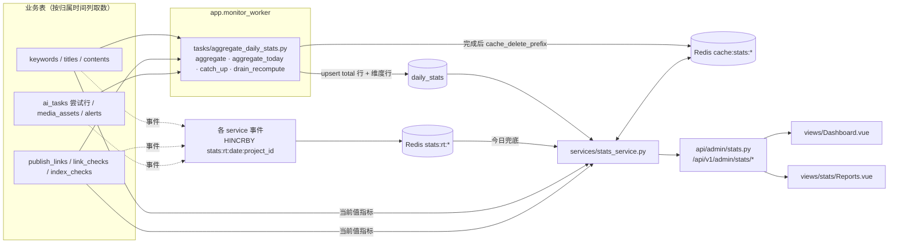
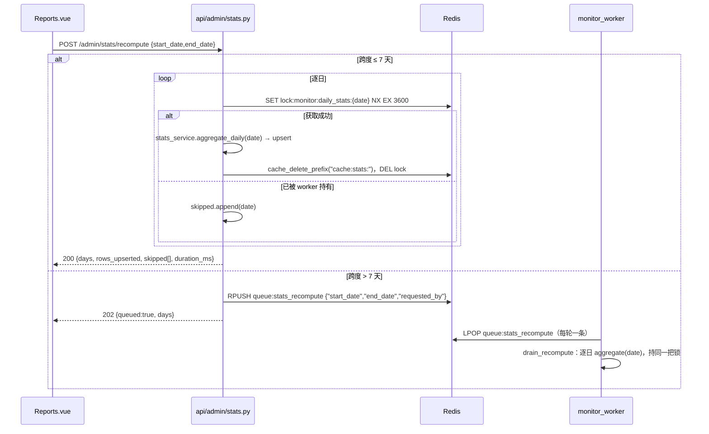

# 12 控制台报表设计

## 1. 目标

控制台报表是平台的「总账本」：把关键词/标题/内容生产、回填链接的存活与收录、AI 调用与消耗、图片/视频生成、告警等运行数据按统一口径汇总，供超级管理员、运营、审核与只读角色在后台查看、筛选和导出。

本期目标：

- 总览页一屏展示 KPI 卡片（含环比与迷你趋势）、趋势图、状态分解表与告警摘要，支持按项目与时间范围（今日 / 7 天 / 30 天）切换。
- 报表页提供趋势、分解、明细榜、AI 消耗四个 Tab；筛选覆盖时间、项目、平台、人员、模型、能力；粒度支持日 / 周 / 月。
- 指标口径唯一：每个指标有明确公式、来源表与可用维度（§3），前后端与冒烟脚本使用同一套字段名，导出 CSV 的列头为这些字段对应的中文名（§8）。
- 预聚合：`daily_stats` 按「日 × 项目 × 维度」预聚合，由 `app.monitor_worker` 的 `tasks/aggregate_daily_stats.py` 每日重算、今日增量刷新；Redis 实时计数只作今日兜底。
- 可复现：快照类指标从检测历史派生，任何一天的重算结果与当日计算一致；成本只对 `ai_tasks.cost_cny` 求和，不按当前汇率折算。
- 导出：趋势 / 分解 / 榜单可导出 UTF-8 BOM CSV；链接、AI 任务、关键词等明细导出留在各自资源路由。
- 权限：总览只需 `dashboard.view`；报表受 `stats.reports.view` / `stats.reports.export` / `stats.reports.recompute` 控制。
- 数据范围（用户系统，[13-user-data-scope](./13-user-data-scope.md)）：普通用户（`data_scope=own`）的控制台与报表只统计本人负责的项目；总后台（`all`）看全部，可用 `owner_id` 切换到任一用户的视角，并可按用户分解（`dimension=owner`）。按用户统计不新增预聚合维度，而是在查询时对该用户的项目行求和（§3.1、§9）。

非目标（首版不做）：自定义指标与自定义看板、小时级粒度、外部 OLAP 依赖（ClickHouse / Elasticsearch）、实时流式大屏、按「用户 × 平台 / 模型」等交叉维度的预聚合（按用户只能与单一维度组合，靠查询时对项目行求和实现）。

范围划分：本文是指标公式、`daily_stats` 计算方式、报表接口语义、页面布局、导出、性能与缓存、`stats_config` 结构的权威。表结构与索引见 [03-data-model](./03-data-model.md)，接口总表与响应约定见 [04-api-spec](./04-api-spec.md)，worker 进程、Redis 键与队列总表见 [01-architecture](./01-architecture.md)，权限实现见 [07-admin-rbac](./07-admin-rbac.md)，AI 任务记录、额度估算与对账见 [08-zhiqiapi-integration](./08-zhiqiapi-integration.md)，内容状态机见 [09-generation-pipeline](./09-generation-pipeline.md)，媒体任务见 [10-media-generation](./10-media-generation.md)，链接检测、收录检测与告警见 [11-link-backfill-and-monitoring](./11-link-backfill-and-monitoring.md)。

## 2. 总体结构



| 层 | 文件 | 职责 |
| --- | --- | --- |
| 聚合任务 | `server/app/tasks/aggregate_daily_stats.py` | `aggregate(stat_date)` / `aggregate_today()` / `catch_up(days=3)` / `drain_recompute()`；持 `lock:monitor:daily_stats:{date}`；完成后清 `cache:stats:*` |
| 业务层 | `server/app/services/stats_service.py` | 指标规格表 `METRIC_SPECS`、`overview` / `trends` / `breakdown` / `rankings` / `export_csv`、`aggregate_daily`（被任务调用）、实时计数 `increment_realtime` / `realtime_today`、时区工具 `day_bounds` / `today_date`、标签解析 `resolve_labels` |
| 接口层 | `server/app/api/admin/stats.py`、`server/app/schemas/stats.py` | `/admin/stats/overview`、`/trends`、`/breakdown`、`/rankings`、`/export`、`/recompute`；查询参数与响应模型 |
| 配置 | `settings` 表 `stats_config`（§4.8） | 时区、每日聚合时间、今日刷新间隔、保留期、榜单默认条数、总览缓存秒数 |
| 前端 | `apps/admin/src/views/Dashboard.vue`、`apps/admin/src/views/stats/Reports.vue`、`apps/admin/src/api/stats.ts`、`components/KpiCard.vue`、`components/TrendChart.vue` | 总览页、报表页、接口封装、KPI 卡片与 echarts 图表封装 |
| 共享包 | `packages/shared/src/types.ts`（`DailyStats`、`StatsOverview`、`TrendPoint`、`BreakdownRow`、`RankingRow`）、`enums.ts`（枚举 `stats_dimension` / `stats_granularity`，以 `as const` 导出为常量 `STATS_DIMENSION` / `STATS_GRANULARITY`） | 前后端共用类型与枚举 |

## 3. 口径约定与指标定义

### 3.1 通用口径

| 项 | 约定 |
| --- | --- |
| 统计日 | `daily_stats.stat_date`（`DATE`），按 `stats_config.timezone`（默认 `Asia/Shanghai`，首次启动由 `APP_TIMEZONE` seed）切日；接口参数 `start` / `end` / `start_date` / `end_date` 均为该时区的 `YYYY-MM-DD`；返回的 `date` 在日粒度为 `YYYY-MM-DD`，周 / 月粒度为周期标签（如 `2026-W41` / `2026-10`，§3.4） |
| 时间范围 | 总览 `range=today\|7d\|30d`：`today` = 今日；`7d` = 今日及之前 6 天；`30d` = 今日及之前 29 天。报表页 `start` / `end` 为闭区间 |
| 流量类指标 | range 内对 `daily_stats` 列求和，取 `dimension='total'` 行，`project_id` 按筛选（`0` = 全部项目汇总行） |
| 快照类指标 | `*_snapshot` 列不求和，取 range 末日（趋势按周期末日）的行；末日尚无行时取 `stat_date <= 末日` 的最近一行，并在 `meta.snapshot_date` 标注实际取值日 |
| 当前值指标 | 直接查询业务表当前状态（如 `COUNT … GROUP BY status`），不受 range 影响，只受 `project_id`（及榜单的 `platform`）影响 |
| 今日兜底 | 今日的流量类数值优先取 `daily_stats(stat_date = 今日)`（`aggregate_today` 每 `intraday_refresh_seconds` 刷新一次）；该行不存在时取 `stats:rt:{date}:{project_id}` 的 Hash；二者不叠加。是否已聚合以今日 `project_id=0` 的 `total` 行是否存在为准（各范围一致）：存在时 `owner` 范围对 P 内今日项目行求和（无行计 0），`today_source=daily_stats`；不存在时 `all` 范围取 `stats:rt:{date}:{project_id}`、`owner` 范围对 P 内各 `stats:rt:{date}:{pid}` 求和，`today_source=realtime`（[13-user-data-scope](./13-user-data-scope.md) §10.2）。`meta.today_source` 标注 `daily_stats` / `realtime` / `none` |
| 尝试行口径 | 所有 AI 调用 / tokens / 额度 / 成本指标按 `ai_tasks` **尝试行**（`root_task_id IS NOT NULL`）统计：`status IN ('succeeded','failed')`、`trigger_type != 'health_probe'`，含未发起 HTTP 的 `model_unrouted` / `breaker_open` 行（`request_id IS NULL`，可经 `ai_failures_by_category` 区分）；根任务行一律不计，根任务 `expired` / `cancelled` 不计入任何 `ai_*` 列 |
| 根任务口径 | 任务级指标（`tasks_succeeded` / `tasks_failed` / `task_success_rate` / `task_avg_duration_ms`）只按 `ai_tasks` **根任务行**（`root_task_id IS NULL`、`trigger_type != 'health_probe'`）统计：`succeeded` 为成功，`failed` / `expired` 为失败，`cancelled` 不计；回答「任务成功率与耗时」，与尝试行口径的 `ai_*` 指标并列展示，不可互换 |
| 比率 | 以 0~1 小数返回（保留 4 位），分母为 0 返回 `null`；前端显示 `--`，CSV 留空；比率在周 / 月粒度与分解中一律由**分子分母先求和再相除**得到，不对日比率取平均 |
| 额度与金额 | `quota_*` 为 zhiqiapi 原始整数额度（`BIGINT`）；`cost_cny` 为人民币元（6 位小数），只对 `ai_tasks.cost_cny` 求和，不按当前 `ai_routing_config.pricing` 重新折算，历史金额可复现 |
| 项目 | `project_id=0` 为全部项目汇总行；已物理删除的项目其 `daily_stats` 行保留（重算不删除，§4.1 规则 3），分解 / 榜单中按 `#<project_id>` 显示（仅范围键 `all`；`owner:{id}` 范围下已删除项目不属于 P，见 [13-user-data-scope](./13-user-data-scope.md) §10.2） |
| 数据范围 | 每个查询先确定范围键（[13-user-data-scope](./13-user-data-scope.md) §10.1）：总后台且未带 `owner_id` 为 `all`，按本表其余口径取数；普通用户本人或总后台带 `owner_id` 为 `owner:{id}`，此时 `project_id=0` 表示「该用户负责的全部项目」（即可见项目集 P，13 §2）——取这些项目的行按相同 `dimension` / `dimension_key` 求和（流量列与快照列都可加和，快照按链接计数、各项目链接集合不相交），当前值指标附加 `project_id IN (该用户的项目)`，今日兜底对各项目的 `stats:rt:{date}:{project_id}` 求和，告警只计这些项目的告警；`project_id` 不属于该用户返回 404。不归属任何项目的数据（系统告警等）只出现在 `all` 范围 |
| 用户（负责人） | 仅分解接口的 `dimension=owner`：取各项目 `total` 行按 `projects.owner_id` 当前值分组，`key` 为用户 ID 字符串，标签同「人员」；已删除项目归入键 `0`（「已删除项目」）。与 `admin` 维度不同：`admin` 是操作人（`created_by` 等），`owner` 是数据归属人 |
| 人员 | `dimension=admin`，`dimension_key` 为管理员 ID 字符串；标签取 `admins.display_name`，为空取 `admins.username` |
| 平台 / 模型 / 能力 / 引擎 | `dimension_key` 分别为 `publish_platforms.code`、`ai_models.model_id`（或尝试行实际 `ai_tasks.model`）、能力枚举 `app.core.zhiqi.types.Capability`（`keyword` / `title` / `content` / `rewrite` / `image` / `video` / `geo_check` / `seo_check`，定义见 [08-zhiqiapi-integration](./08-zhiqiapi-integration.md)）、`seo_engine`（`baidu` / `bing` / `google`）与 `geo_engine`（`baidu_ai` / `doubao` / `kimi` / `deepseek` / `perplexity` / `chatgpt`，可在 `geo_engines` 扩展） |
| 同名列的两种含义 | `links_deleted` / `links_changed` / `links_restored` 在总览 KPI 中是**当前值**（`publish_links` 按 `alive_status` 计数，仅 `links_deleted`）；在趋势 / 分解 / 榜单中是 `daily_stats` 的**事件计数**（当日进入该状态的次数）。页面文案必须区分「当前已删除链接数」与「当日新增删除」 |

### 3.2 指标定义表

指标名即 API 字段名；凡 `daily_stats` 列名（`keywords_adopted`、`titles_adopted`、`seo_checks`、`geo_checks`、`links_alive_snapshot` 等）也可直接作为趋势 / 分解的 `metric` 使用，公式为 `Σ`（流量列）或末日取值（快照列）。本文新增的任务级列 `tasks_succeeded` / `tasks_failed`（流量列）、收录耗时分母列 `index_hours_links`（流量列）与派生指标 `task_success_rate` / `task_avg_duration_ms` 同样可作 `metric`，[04-api-spec](./04-api-spec.md) §7.14 的 `metrics` 合法取值表同步列入。

#### 内容生产

| 指标 | 公式 | 来源 | 维度 |
| --- | --- | --- | --- |
| `keywords_total` | `COUNT(keywords)`（当前） | keywords | project |
| `keywords_by_status` | `COUNT(keywords) GROUP BY status`（`candidate` / `adopted` / `discarded`） | keywords | project |
| `keywords_created` | `Σ daily_stats.keywords_created` | daily_stats | project / admin / day |
| `keywords_adopted` | `Σ daily_stats.keywords_adopted` | daily_stats | project / admin / day |
| `keyword_adopt_rate` | `Σ keywords_adopted / Σ keywords_created`（range 内采用的关键词可创建于 range 之前，比率可能 > 1，不封顶、不特殊标注） | daily_stats | project / day |
| `titles_total` / `titles_by_status` | 同关键词：`COUNT(titles) [GROUP BY status]` | titles | project |
| `titles_created` / `titles_adopted` | `Σ daily_stats.titles_created` / `Σ daily_stats.titles_adopted` | daily_stats | project / admin / day（admin 行：`titles_created` 按 `created_by`，`titles_adopted` 按 `adopted_by`） |
| `contents_total` / `contents_by_status` | `COUNT(contents) [GROUP BY status]`（`content_status` 八态：`draft` / `generating` / `ready` / `reviewing` / `approved` / `rejected` / `published` / `archived`，取值见 [00-overview](./00-overview.md)，流转见 [09-generation-pipeline](./09-generation-pipeline.md)） | contents | project |
| `contents_created` / `contents_approved` / `contents_published` | `Σ daily_stats.*`（`contents_approved` 的 admin 行按审核人 `reviewed_by`，不含自动通过） | daily_stats | project / day（`contents_created`、`contents_approved` 另有 admin） |

#### 链接与存活

| 指标 | 公式 | 来源 | 维度 |
| --- | --- | --- | --- |
| `links_total` | `COUNT(publish_links)` | publish_links | project / platform |
| `links_backfilled` | `Σ daily_stats.links_backfilled` | daily_stats | project / platform / admin / day |
| `links_alive` / `links_deleted` / `links_by_status` | `COUNT(publish_links) GROUP BY alive_status`（当前）；`links_alive` = `alive` + `changed`，`links_deleted` = `deleted` | publish_links | project / platform |
| `link_alive_rate` | `COUNT(alive_status IN ('alive','changed')) / COUNT(alive_status != 'pending')` | publish_links | project / platform |
| `link_deleted_rate` | `COUNT(alive_status = 'deleted') / COUNT(alive_status != 'pending')` | publish_links | project / platform |
| `links_checked` | `Σ daily_stats.links_checked` | daily_stats | day / platform |
| `links_deleted` / `links_changed` / `links_restored`（趋势 / 分解） | `Σ daily_stats.*`：当日进入 `deleted` / `changed` / 从 `deleted` 恢复的次数（§4.1） | daily_stats | day / platform / project |
| `links_alive_snapshot` / `links_total_snapshot` | 末日快照：日终存活链接数 / 日终链接总数 | daily_stats | day / platform |

#### 收录

| 指标 | 公式 | 来源 | 维度 |
| --- | --- | --- | --- |
| `seo_index_rate` | 分母 `D = COUNT(published_at <= now - 1d AND index_checks_done >= 1)`；分子 `COUNT(seo_indexed_any = 1 AND published_at <= now - 1d AND index_checks_done >= 1)`（分子限定在分母集合内；人工 `mark-index` 不增 `index_checks_done`，比率 ≤ 100%） | publish_links | project / platform |
| `seo_index_rate_by_engine` | 当前值：`daily_stats(dimension='seo_engine').seo_indexed_snapshot`（range 末日）/ `links_total_snapshot`（同日 `total` 行，日终链接总数，含未检测链接）；趋势：按日取引擎行快照 | daily_stats | seo_engine |
| `geo_cite_rate` | 分母 `COUNT(index_checks_done >= 1)`；分子 `COUNT(geo_cited_any = 1 AND index_checks_done >= 1)` | publish_links | project / platform |
| `geo_cite_rate_by_engine` | 当前值：`daily_stats(dimension='geo_engine').geo_cited_snapshot`（range 末日）/ `links_total_snapshot`（口径同 `seo_index_rate_by_engine`）；趋势：按日取引擎行快照 | daily_stats | geo_engine |
| `time_to_index_hours_avg` | 当前值：`AVG(TIMESTAMPDIFF(HOUR, published_at, first_indexed_at))`，仅 `first_indexed_at` 非空且补录延迟不超过 72 小时（`created_at <= published_at + INTERVAL 72 HOUR`）的链接；趋势：`Σ index_hours_sum / Σ index_hours_links`（分母为 0 时 `null`；`index_hours_links` 与 `index_hours_sum` 为同一链接集合，§4.1；`seo_newly_indexed` 含历史补录链接，只用于新收录数量，不作本指标分母）。**历史补录**（本文为权威定义）：补录延迟 `publish_links.created_at − published_at` 超过 72 小时（常量 `stats_service.MAX_BACKFILL_DELAY_HOURS = 72`）的链接视为历史补录，回填前可能早已被收录，`first_indexed_at` 只是回填后首次检测命中的时间，真实的首次收录时间不可观测，因此不计入本指标、`time_to_index_hours_p50`、`daily_stats.index_hours_sum` / `daily_stats.index_hours_links`（§4.1）与榜单 `fastest_indexed`；仍计入收录率、`seo_newly_indexed` 等其它指标 | publish_links / daily_stats | project / platform / seo_engine / day |
| `time_to_index_hours_p50` | 同上当前值取中位数：仅 `first_indexed_at` 非空且补录延迟不超过 `MAX_BACKFILL_DELAY_HOURS`（72）小时的链接，历史补录不计入（Python 侧计算，§10） | publish_links | project / platform |
| `seo_newly_indexed` / `geo_newly_cited` | `Σ daily_stats.*`（当日首次被任一引擎收录 / 引用的链接数；引擎行为该引擎） | daily_stats | day（另有 project / platform / seo_engine / geo_engine） |
| `seo_checks` / `geo_checks` | `Σ daily_stats.*`（当日检测次数，引擎行为该引擎次数） | daily_stats | day / platform / seo_engine / geo_engine |
| `seo_indexed_snapshot` / `geo_cited_snapshot` | 末日快照：日终已收录 / 已引用链接数（每链接每引擎取日终前最后一条非 `unknown` 的检测结果，§4.3；`total` 行任一引擎，引擎行只看该引擎） | daily_stats | day / platform / seo_engine / geo_engine |

#### AI 调用与消耗

| 指标 | 公式 | 来源 | 维度 |
| --- | --- | --- | --- |
| `ai_calls` | `Σ daily_stats.ai_calls`（`succeeded` / `failed` 尝试行，`trigger_type != health_probe`，含未发起 HTTP 的 `model_unrouted` / `breaker_open` 行） | daily_stats | project / capability / model / admin / day |
| `ai_success_rate` | `Σ ai_succeeded / Σ ai_calls`（按尝试行；`ai_failed` 只含 `status='failed'` 的尝试行，媒体过期不在其中） | daily_stats | 同上 |
| `ai_avg_duration_ms` | `Σ ai_duration_ms_sum / Σ ai_succeeded`（单次尝试的耗时；`capability` 为 `image` / `video` 时仅为提交请求的耗时，不含上游生成与轮询，全程耗时看 `task_avg_duration_ms`） | daily_stats | project / capability / model / day（`admin` 行不填 `ai_duration_ms_sum`，不支持人员维度） |
| `tasks_succeeded` / `tasks_failed` | `Σ daily_stats.*`：当日进入终态的**根任务**数（`tasks_failed` 含 `failed` 与 `expired`，`cancelled` 不计，`trigger_type != health_probe`，§4.1） | daily_stats | project / capability / model / admin / day |
| `task_success_rate` | `Σ tasks_succeeded / Σ (tasks_succeeded + tasks_failed)`（任务级：一个业务单元计一次，候选切换、参数降级与分段生成的多次尝试不重复计数） | daily_stats | project / capability / model / admin / day |
| `task_avg_duration_ms` | `Σ task_duration_ms_sum / Σ tasks_succeeded`（成功根任务从提交到完成的全程耗时，含媒体轮询与分段生成） | daily_stats | project / capability / model / admin / day |
| `ai_p95_duration_ms` | `PERCENTILE_95(ai_tasks.duration_ms)`（尝试行，range 内实时查询，仅详情页，不经 `/admin/stats/*`） | ai_tasks | capability / model |
| `ai_failures_by_category` | `COUNT(ai_tasks 尝试行) GROUP BY error_category`（仅详情页，不经 `/admin/stats/*`） | ai_tasks | capability / model |
| `prompt_tokens` / `completion_tokens` / `tokens_total` | `Σ daily_stats.*`；`tokens_total = prompt_tokens + completion_tokens` | daily_stats | project / capability / model / admin / day |
| `quota_estimated` / `quota_actual` | `Σ daily_stats.*`（`quota_actual` 只含已对账部分） | daily_stats | 同上 |
| `quota_reconciled_rate` | `Σ quota_reconciled_calls / Σ ai_calls`（分子分母同口径 `trigger_type != health_probe`；< 100% 的常见原因见 §7.3） | daily_stats | project / capability / model / day（`admin` 行不填 `quota_reconciled_calls`，不支持人员维度） |
| `cost_cny` | `Σ daily_stats.cost_cny` = `Σ ai_tasks.cost_cny`（尝试行；单任务成本在终态 / 对账时按当时 `pricing` 写入） | daily_stats | project / capability / model / admin / day |
| `cost_cny_per_content` | `cost_cny(capability IN ('content','rewrite')) / contents_created`（分子取 `capability` 行之和，分母取 `total` 行） | daily_stats | project |
| `quota_estimated_reconciled` | `Σ daily_stats.extra_json.quota_estimated_reconciled`（已对账尝试行的估算额度之和，§7.3） | daily_stats | project / capability / model / admin / day |
| `quota_diff` | `Σ quota_actual − Σ quota_estimated_reconciled` | daily_stats | 同上 |
| `quota_diff_rate` | `quota_diff / Σ quota_estimated_reconciled` | daily_stats | 同上 |

#### 媒体

| 指标 | 公式 | 来源 | 维度 |
| --- | --- | --- | --- |
| `images_generated` / `videos_generated` / `media_failed` | `Σ daily_stats.*`（按 `ready_at` / `failed_at` 归属，不看当前状态；admin 行按 `media_assets.created_by`） | daily_stats | project / day（另有 capability / model / admin） |
| `media_success_rate` | `(images_generated + videos_generated) / (images_generated + videos_generated + media_failed)` | daily_stats | project / day |

#### 告警

| 指标 | 公式 | 来源 | 维度 |
| --- | --- | --- | --- |
| `alerts_open` | `COUNT(alerts WHERE status IN ('open','acknowledged')) GROUP BY severity` | alerts | project |
| `alerts_opened` / `alerts_resolved` | `Σ daily_stats.*`（按 `first_triggered_at` / `resolved_at` 归属） | daily_stats | day |

#### 榜单

| 指标 | 公式 | 来源 | 维度 |
| --- | --- | --- | --- |
| `fastest_indexed` | 按 `first_indexed_at − published_at` 升序取前 N 的 contents（含链接与平台），range 按 `first_indexed_at` 过滤；只取补录延迟不超过 `MAX_BACKFILL_DELAY_HOURS`（72）小时的链接（`created_at <= published_at + INTERVAL 72 HOUR`），历史补录链接首次收录时间不可观测，不参与排名（见上文 `time_to_index_hours_avg`） | publish_links ⋈ contents | project |
| `most_deleted_platforms` | range 内 `Σ links_deleted` 按 `dimension='platform'` 行降序 | daily_stats | platform |
| `top_cost_models` / `top_cost_projects` | range 内 `Σ cost_cny` 按 `dimension='model'` 行 / `dimension='total'` 行按 `project_id` 分组（排除 `project_id=0`；范围键 `all` 下已删除项目按 `project_id` 显示）降序 | daily_stats | model / project |
| `top_failed_models` | range 内 `Σ ai_failed` 按 `dimension='model'` 行降序 | daily_stats | model |

### 3.3 两种收录率口径（必须并列展示）

| 口径 | 指标 | 分母 | 分子 | 来源 | 回答的问题 |
| --- | --- | --- | --- | --- | --- |
| 检测口径 | `seo_index_rate` / `geo_cite_rate` | 已完成 ≥ 1 轮 `scheduled` 收录检测的链接（`index_checks_done >= 1`；SEO 另要求 `published_at <= now − 1d`） | 同一集合内 `seo_indexed_any = 1` / `geo_cited_any = 1` | `publish_links` 当前值 | 「检测过的链接里有多少被收录」，排除刚回填、未检测链接的噪音，恒 ≤ 100% |
| 存量口径 | `seo_index_rate_by_engine` / `geo_cite_rate_by_engine` | 日终链接总数快照 `links_total_snapshot`（含 `pending` 与未检测链接） | 该引擎日终 `seo_indexed_snapshot` / `geo_cited_snapshot` | `daily_stats` 引擎行 | 「全部链接里该引擎已收录多少」，可按日画趋势、按引擎横向对比 |

两种口径分母不同，数值不可互相比较：总览 KPI 卡片使用检测口径并在卡片副标题标注「检测口径」；引擎分解表与引擎趋势使用存量口径并标注「存量口径」；同一张图表不得混放两种口径的序列。

### 3.4 趋势粒度与环比

| 项 | 规则 |
| --- | --- |
| `granularity=day` | 直接取 `daily_stats` 行，`date` 为 `YYYY-MM-DD` |
| `granularity=week` | ISO 周（周一为首日），SQL 侧 `GROUP BY DATE_FORMAT(stat_date, '%x-W%v')`，`date` 形如 `2026-W41`；流量列 `SUM`，快照列取该周期内最后一个有行的日期的值，比率由求和后的分子分母相除 |
| `granularity=month` | 自然月，`GROUP BY DATE_FORMAT(stat_date, '%Y-%m')`，`date` 形如 `2026-10`；规则同周 |
| 环比（总览） | `range=today` 对比昨天；`7d` 对比前 7 天；`30d` 对比前 30 天。`compare.<metric> = {previous, delta, delta_rate}`，`delta = current − previous`，`delta_rate = delta / previous`（`previous` 为 0 或 `null` 时 `delta_rate = null`）。只对流量类与比率类指标计算环比，当前值指标无环比 |
| 周期边界 | 跨 range 首尾的周 / 月只统计 range 内的日期，响应 `date` 仍用完整周期标签；前端对首尾周期显示「不完整」角标 |

## 4. 聚合设计

### 4.1 daily_stats 的计算口径

字段类型、索引与约束见 [03-data-model](./03-data-model.md) `daily_stats`；本节定义每一列**怎么算**。行键 `UNIQUE(stat_date, project_id, dimension, dimension_key)`，`dimension` ∈ `stats_dimension`（`total` / `platform` / `capability` / `model` / `admin` / `seo_engine` / `geo_engine`），`total` 行的 `dimension_key=''`。下表的「归属时间」列决定一条源数据属于哪个统计日（§4.7 时区），`[start, end)` 为该统计日的 UTC 边界。

| 列 | 归属时间列 | 计算 |
| --- | --- | --- |
| `keywords_created` | `keywords.created_at` | `COUNT(*)`，按 `project_id`；`admin` 行按 `created_by` |
| `keywords_adopted` | `keywords.adopted_at` | `COUNT(*)`；`admin` 行按 `adopted_by` |
| `titles_created` / `titles_adopted` | `titles.created_at` / `titles.adopted_at` | 同上；`admin` 行：`titles_created` 按 `created_by`，`titles_adopted` 按 `adopted_by` |
| `contents_created` | `contents.created_at` | `COUNT(*)`；`admin` 行按 `created_by` |
| `contents_approved` | `contents.reviewed_at` | `COUNT(review_result = 'approved')`（含 `review_required=false` 的自动通过；之后状态变化不影响）；`admin` 行按 `reviewed_by`，且排除 `review_note = 'auto'` 的自动通过，只统计审核人员的人工审核 |
| `contents_published` | `contents.first_published_at` | `COUNT(*)`（按重算后的 `first_published_at`，链接删除 / 改时间导致的历史变化在下次重算时「不再出现」） |
| `links_backfilled` | `publish_links.created_at` | `COUNT(*)`；`platform` 行按 `platform_id → publish_platforms.code`；`admin` 行按 `backfilled_by` |
| `links_checked` | `link_checks.checked_at` | `COUNT(*)` |
| `links_deleted` | `link_checks.checked_at` | `COUNT(applied_status = 'deleted' AND previous_status != 'deleted')` |
| `links_changed` | `link_checks.checked_at` | `COUNT(applied_status = 'changed' AND previous_status != 'changed')` |
| `links_restored` | `link_checks.checked_at` | `COUNT(previous_status = 'deleted' AND applied_status IN ('alive','changed'))` |
| `links_alive_snapshot` / `links_total_snapshot` | 快照（日终） | §4.3 |
| `seo_checks` / `geo_checks` | `index_checks.checked_at` | `COUNT(kind='seo')` / `COUNT(kind='geo')`；引擎行按 `engine` |
| `seo_newly_indexed` | `publish_links.first_indexed_at`（引擎行：`seo_status_json.<engine>.first_indexed_at`） | `COUNT(*)`；引擎行在 Python 侧解析 JSON 列后计数：候选集为 `first_indexed_at IS NOT NULL AND first_indexed_at < :end`（引擎级首次收录时间不早于链接级首次收录时间），逐行取各引擎的 `first_indexed_at` 落在 `[start, end)` 者计数 |
| `geo_newly_cited` | `publish_links.first_cited_at`（引擎行：`geo_status_json.<engine>.first_cited_at`） | 同上（候选集 `first_cited_at IS NOT NULL AND first_cited_at < :end`） |
| `seo_indexed_snapshot` / `geo_cited_snapshot` | 快照（日终） | §4.3 |
| `index_hours_sum` | 同 `seo_newly_indexed` | `Σ TIMESTAMPDIFF(HOUR, published_at, first_indexed_at)`（引擎行用该引擎的 `first_indexed_at`），只累加补录延迟不超过 `stats_service.MAX_BACKFILL_DELAY_HOURS`（72）小时的链接（`created_at <= published_at + INTERVAL 72 HOUR`，引擎行同样按链接判定）；历史补录链接首次收录时间不可观测，不累加耗时，但照常计入 `seo_newly_indexed`（§3.2） |
| `index_hours_links` | 同 `seo_newly_indexed` | `COUNT(*)`，与 `index_hours_sum` 同一链接集合：当日新收录（引擎行按该引擎的 `first_indexed_at` 归属）且补录延迟不超过 `stats_service.MAX_BACKFILL_DELAY_HOURS`（72）小时的链接数，即当日计入 `index_hours_sum` 的新收录链接数；趋势 `time_to_index_hours_avg = Σ index_hours_sum / Σ index_hours_links` 的分母（§3.2）；历史补录链接不计入本列，但照常计入 `seo_newly_indexed` |
| `ai_calls` / `ai_succeeded` / `ai_failed` | `ai_tasks.finished_at` | 尝试行 `root_task_id IS NOT NULL AND status IN ('succeeded','failed') AND trigger_type != 'health_probe'`；`capability` / `model` 行按尝试行的 `capability` / `model`；`admin` 行按尝试行冗余的 `created_by`（`NULL` 不进 admin 行） |
| `ai_duration_ms_sum` | `ai_tasks.finished_at` | `Σ duration_ms`，仅 `status='succeeded'` 的尝试行 |
| `prompt_tokens` / `completion_tokens` / `quota_estimated` | `ai_tasks.finished_at` | 尝试行 `Σ` |
| `quota_actual` / `quota_reconciled_calls` | `ai_tasks.finished_at` | `Σ quota_actual` / `COUNT(reconciled_at IS NOT NULL)`，口径同 `ai_calls`；对账回填后由 `reconcile()` 触发该日重算 |
| `cost_cny` | `ai_tasks.finished_at` | `Σ cost_cny`（尝试行） |
| `tasks_succeeded` / `tasks_failed` | `ai_tasks.finished_at` | 只取**根任务行** `root_task_id IS NULL AND trigger_type != 'health_probe'`：`status = 'succeeded'` 计入 `tasks_succeeded`，`status IN ('failed','expired')` 计入 `tasks_failed`，`cancelled` 不计；`capability` / `model` 行按根任务的 `capability` / `model`（`model` 为最终尝试的冗余值，为空不进 `model` 行）；`admin` 行按根任务 `created_by`（`NULL` 不进 admin 行）；手动 / 自动重试新建的根任务各自计数，旧根任务的失败不被覆盖 |
| `task_duration_ms_sum` | `ai_tasks.finished_at` | `Σ duration_ms`，仅 `status = 'succeeded'` 的根任务行（提交 → 完成全程，含媒体轮询与分段生成）；维度行规则同上 |
| `images_generated` / `videos_generated` | `media_assets.ready_at` | `COUNT(kind='image' / 'video' AND source='generated')`，**不看当前 status**（之后 `deleted` 仍计入）；`capability` 行归入 `image` / `video`，`model` 行按 `media_assets.model`，`admin` 行按 `media_assets.created_by` |
| `media_failed` | `media_assets.failed_at` | `COUNT(error_category IS NULL OR error_category != 'cancelled')`，`failed` 与 `expired` 均计入，不看当前 status；维度行规则同上（`admin` 行按 `created_by`） |
| `alerts_opened` / `alerts_resolved` | `alerts.first_triggered_at` / `alerts.resolved_at` | `COUNT(*)`；`project_id` 为 NULL 的告警只进 `project_id=0` 行 |
| `extra_json` | — | `{"quota_estimated_reconciled": Σ quota_estimated WHERE reconciled_at IS NOT NULL}`，仅 `total` / `capability` / `model` / `admin` 行写入（§7.3） |
| `computed_at` | — | 本行计算时间（UTC） |

`tasks_succeeded` / `tasks_failed` / `task_duration_ms_sum` 是任务级列（字段定义见 [03-data-model](./03-data-model.md) `daily_stats`），回答「业务单元成功了多少、全程花了多久」，与按尝试行统计的 `ai_*` 列互补。

行生成规则：

1. `project_id=0` 的 `total` 行每日必写；每个在当日任一源表出现过的项目写一条 `total` 行。
2. 维度行只在该维度下至少一列非零时写入。例外：`project_id=0` 的 `seo_engine` / `geo_engine` 行对 `index_check_service.enabled_engines("seo"|"geo")` 返回的每个启用引擎必写一行（即使全零，保证引擎分解表与维度键候选完整）；当日 `index_checks` 出现但已停用的引擎因 `seo_checks` / `geo_checks` 非零同样生成行；项目级（`project_id>0`）引擎行遵循非零规则。
3. 重算采用「全量 upsert + 清理」：计算出的行 `INSERT … ON DUPLICATE KEY UPDATE`；同一 `stat_date` 下不在本次计算结果中的旧行 `DELETE`（例如链接被物理删除后平台行消失），两步在同一事务内完成。清理只针对 `project_id = 0` 或 `project_id` 仍存在于 `projects` 的行；`project_id` 已不在 `projects` 中的行（已删除项目）既不重算也不删除，按 [03-data-model](./03-data-model.md) 删除规则保留（项目删除前其关键词 / 标题 / 内容 / 链接 / 媒体 / 批次已清空，`ai_tasks` / `alerts` 的 `project_id` 已置 NULL，重算本就算不出这些行）。因此含已删除项目数据的日期重算后，`project_id=0` 汇总行按现存源数据计算，可能不再等于各项目行之和。
4. 维度行不填写矩阵之外的列（保持 0），见 §4.2。

### 4.2 维度 × 列矩阵

| dimension | dimension_key | 填写的列 |
| --- | --- | --- |
| `total` | `''` | 全部列 |
| `platform` | `publish_platforms.code` | `links_backfilled`、`links_checked`、`links_deleted`、`links_changed`、`links_restored`、`links_alive_snapshot`、`links_total_snapshot`、`seo_checks`、`seo_newly_indexed`、`seo_indexed_snapshot`、`geo_checks`、`geo_newly_cited`、`geo_cited_snapshot`、`index_hours_sum`、`index_hours_links` |
| `capability` / `model` | 能力枚举 / 模型 ID | `ai_calls`、`ai_succeeded`、`ai_failed`、`ai_duration_ms_sum`、`prompt_tokens`、`completion_tokens`、`quota_estimated`、`quota_actual`、`quota_reconciled_calls`、`cost_cny`（按尝试行的 `capability` / `model`）、`tasks_succeeded`、`tasks_failed`、`task_duration_ms_sum`（按根任务行的 `capability` / `model`）、`images_generated`、`videos_generated`、`media_failed`（`capability` 行按 `media_assets.kind` → `image` / `video`；`model` 行按 `media_assets.model`）；`extra_json.quota_estimated_reconciled` |
| `admin` | 管理员 ID 字符串 | `keywords_created`（`keywords.created_by`）、`keywords_adopted`（`keywords.adopted_by`）、`titles_created`（`titles.created_by`）、`titles_adopted`（`titles.adopted_by`）、`contents_created`（`contents.created_by`）、`contents_approved`（`contents.reviewed_by`，排除 `review_note='auto'` 的自动通过）、`links_backfilled`（`publish_links.backfilled_by`）、`images_generated`、`videos_generated`、`media_failed`（`media_assets.created_by`）、`ai_calls`、`ai_succeeded`、`ai_failed`、`prompt_tokens`、`completion_tokens`、`quota_estimated`、`quota_actual`、`cost_cny`（AI 列按尝试行冗余的 `created_by` = 根任务发起人）、`tasks_succeeded`、`tasks_failed`、`task_duration_ms_sum`（按根任务行的 `created_by`）；`created_by IS NULL` 的系统 / 探测任务不进 admin 行；`extra_json.quota_estimated_reconciled` |
| `seo_engine` | `baidu` / `bing` / `google` | `seo_checks`、`seo_newly_indexed`、`seo_indexed_snapshot`、`index_hours_sum`、`index_hours_links`（引擎集合 = `seo_providers.engines` 中 `enabled=true` 的引擎） |
| `geo_engine` | `geo_engines.engines[].code` | `geo_checks`、`geo_newly_cited`、`geo_cited_snapshot`（引擎集合 = `geo_engines.engines[]` 中 `enabled=true` 的引擎） |

接口校验据此矩阵：`GET /admin/stats/breakdown` 与带 `dimension` 的 `GET /admin/stats/trends` 请求了该维度未填写的列（派生指标按其分子、分母列判断）时返回 400，`data` 为 [04-api-spec](./04-api-spec.md) §5.1 的校验错误列表，每个不匹配的指标一项，如 `[{"loc":["query","dimension"],"msg":"该指标不支持此维度","type":"unsupported_dimension","input":{"metric":"quota_reconciled_rate","dimension":"admin"}}]`（§9.8）。

### 4.3 快照列的派生（当日与重算一致）

快照列不取业务表的当前状态，而是从检测历史回放到「该统计日日终」的状态，因此任意一天的重算结果与当日计算一致：

- `links_total_snapshot` = `publish_links.created_at < end`（end 为次日 00:00 的 UTC 时刻，等价于「≤ 当日 23:59:59」）的链接数。
- `links_alive_snapshot` = 其中「派生状态」∈ `alive` / `changed` 的链接数；派生状态 = 该链接在 `link_checks` 中 `checked_at < end` 的最后一条 `applied_status`（无记录视为 `pending`）。`applied_status` 已经包含确认阈值未达时「状态不变」的语义，因此直接取最后一条即可。
- `seo_indexed_snapshot` / `geo_cited_snapshot` = 每链接每引擎取 `index_checks` 中 `checked_at < end` 的**最后一条非 `unknown`** 的 `result_status`。`unknown` 表示本次无法判定，与 [11-link-backfill-and-monitoring](./11-link-backfill-and-monitoring.md) §7.4 的投影规则（`unknown` 不覆盖原 `status`）一致，不覆盖此前的 `indexed` / `not_indexed`、`cited` / `not_cited` 结论：一次瞬时故障不会让已收录链接从快照中消失，快照与 `seo_indexed_any` / `geo_cited_any` 口径一致；某链接某引擎只有 `unknown` 记录时不计入。`total` / `platform` 行任一引擎为 `indexed` / `cited` 即计入该链接一次，引擎行只看该引擎。人工标记（`provider='manual'`）同样是 `index_checks` 记录，自然参与回放。
- 已物理删除的链接连同其检测记录级联删除，不再出现在任何历史快照中。

```sql
-- 链接存活快照（MySQL 8 窗口函数；:end 为统计日次日 00:00 的 UTC 时刻）
WITH links AS (
  SELECT l.id, l.project_id, p.code AS platform_code
  FROM publish_links l JOIN publish_platforms p ON p.id = l.platform_id
  WHERE l.created_at < :end
),
last_check AS (
  SELECT link_id, applied_status FROM (
    SELECT link_id, applied_status,
           ROW_NUMBER() OVER (PARTITION BY link_id ORDER BY checked_at DESC, id DESC) AS rn
    FROM link_checks WHERE checked_at < :end
  ) t WHERE rn = 1
)
SELECT links.project_id, links.platform_code,
       COUNT(*) AS links_total_snapshot,
       SUM(CASE WHEN c.applied_status IN ('alive','changed') THEN 1 ELSE 0 END) AS links_alive_snapshot
FROM links LEFT JOIN last_check c ON c.link_id = links.id
GROUP BY links.project_id, links.platform_code;
-- project_id=0 汇总行与 total 行在 Python 侧累加，不用 WITH ROLLUP（便于同时产出 platform 行）

-- 收录快照：每链接每引擎最后一次非 unknown 的结果（unknown 不覆盖此前结论，与 11 §7.4 投影一致）
WITH last_idx AS (
  SELECT link_id, kind, engine, result_status FROM (
    SELECT link_id, kind, engine, result_status,
           ROW_NUMBER() OVER (PARTITION BY link_id, kind, engine ORDER BY checked_at DESC, id DESC) AS rn
    FROM index_checks WHERE checked_at < :end AND result_status <> 'unknown'
  ) t WHERE rn = 1
)
SELECT i.kind, i.engine, l.project_id, p.code AS platform_code, COUNT(DISTINCT l.id) AS hit_links
FROM last_idx i JOIN publish_links l ON l.id = i.link_id JOIN publish_platforms p ON p.id = l.platform_id
WHERE l.created_at < :end AND i.result_status IN ('indexed','cited')
GROUP BY i.kind, i.engine, l.project_id, p.code;
-- total/platform 行的「任一引擎」口径：对同一 (kind, link_id) 去重后计数，在 Python 侧用集合合并
```

快照列重算需要扫描检测历史，成本随链接数与检测次数增长，因此 `POST /admin/stats/recompute` 限制跨度 ≤ 31 天，且每日只重算昨天与前天。

### 4.4 聚合任务 `tasks/aggregate_daily_stats.py`

运行在 `app.monitor_worker`（`python -m app.monitor_worker`，主循环休眠 `MONITOR_POLL_INTERVAL_SECONDS=5`），所有函数的实际计算都在线程池内执行，主循环只负责提交（[01-architecture](./01-architecture.md) 进程循环骨架）。

| 函数 | 触发 | 行为 |
| --- | --- | --- |
| `aggregate(stat_date) -> int` | 下列各入口 | 获取 `lock:monitor:daily_stats:{date}`（`SET NX EX 3600`），失败则返回 0 并记 INFO（本轮跳过，不报错）；调用 `stats_service.aggregate_daily(db, stat_date)` 计算全部行并在单事务内 upsert + 清理旧行，写 `computed_at`；提交后 `cache_delete_prefix("cache:stats:")`；`finally` 释放锁；返回 upsert 行数 |
| `aggregate_today() -> int` | `PeriodicTimers.run_due("stats_today", stats_config.intraday_refresh_seconds)`（默认 600s，0 关闭） | `aggregate(today)`；保证总览「今日」最多滞后 10 分钟 |
| `catch_up(days=3) -> int` | monitor_worker 启动时 `pool.named_submit("catch_up", …)` | 对 `today − (days − 1) … today` 逐日 `aggregate`（含今日），补齐进程停机期间缺失的行 |
| 每日聚合（`run_daily("daily_stats", stats_config.daily_at, …, tz=stats_config.timezone)`） | 每日 `daily_at`（默认 `00:30`，按统计时区） | 依次 `aggregate(昨天)`、`aggregate(前天)`（前天再算一次以吸收跨日的对账回填与晚到的检测写回）；随后删除 `stat_date < today − retention_days` 的行，每批 1000 行直到无行可删 |
| `drain_recompute() -> int` | 主循环每轮：先检查 `recompute` 任务是否在飞（`pool.named_submit` 同名任务最多一个未完成的 Future），**不在飞时才** `LPOP queue:stats_recompute` 一条；在飞时不出队，元素留在队列等待下一轮（先出队再跳过会丢失请求） | 解析 `{"start_date","end_date","requested_by"}`，按日期升序逐日 `aggregate`；获取锁失败的日期跳过并记日志；完成后写 INFO 日志 `recompute done start=… end=… days=… skipped=[…] requested_by=…`；以 `pool.named_submit("recompute", …)` 提交到线程池，主循环不等待其完成 |

其它入口（同一把锁保证互斥）：

- `app.worker` 的 `tasks/reconcile_usage.py` 在对账回填 `quota_actual` 后，收集本轮匹配任务涉及的 `stat_date`：今日 / 昨日交给常规聚合，其它日期直接调用 `aggregate_daily_stats.aggregate(stat_date)`，不回写 `stats:rt`。
- `POST /admin/stats/recompute` 跨度 ≤ 7 天时在 API 进程内逐日调用 `aggregate`（§4.5）。

`stats_service.aggregate_daily(db, stat_date)` 的实现骨架：

```python
def aggregate_daily(db: Session, stat_date: date) -> int:
    start, end = day_bounds(stat_date)                       # UTC naive datetime，[start, end)
    rows: dict[tuple[int, str, str], dict[str, Any]] = {}   # (project_id, dimension, dimension_key) -> 列值
    def bump(project_id, dimension, key, **cols):            # 同时累加项目行与 project_id=0 汇总行
        for pid in {project_id or 0, 0}:
            row = rows.setdefault((pid, dimension, key), {})
            for col, val in cols.items():
                row[col] = row.get(col, 0) + val
    _collect_content(db, start, end, bump)                   # keywords / titles / contents（含 admin 行）
    _collect_links(db, start, end, bump)                     # publish_links / link_checks / index_checks（含 platform / engine 行）
    _collect_ai(db, start, end, bump)                        # ai_tasks 尝试行（ai_* / tokens / 额度 / 成本与 extra_json）+ 根任务行（tasks_* / task_duration_ms_sum），含 capability / model / admin 行
    _collect_media(db, start, end, bump)                     # media_assets（含 capability / model / admin 行）
    _collect_alerts(db, start, end, bump)
    _collect_snapshots(db, end, bump)                        # §4.3，写 *_snapshot 列
    rows.setdefault((0, "total", ""), {})                    # project_id=0 的 total 行每日必写（无数据时全 0）
    _ensure_engine_rows(db, rows)                            # project_id=0 下每个启用引擎一行（即使全零）
    rows = {k: v for k, v in rows.items()
            if k[1] == "total"
            or (k[0] == 0 and k[1] in ("seo_engine", "geo_engine"))
            or any(v.values())}                              # 其余维度行只保留至少一列非零的（§4.1 行生成规则）
    with db.begin():
        upsert_daily_stats(db, stat_date, rows, computed_at=utcnow())
        # 只清理 project_id = 0 OR project_id IN (SELECT id FROM projects) 的旧行：
        #   DELETE FROM daily_stats WHERE stat_date = :stat_date
        #     AND (project_id = 0 OR project_id IN (SELECT id FROM projects))
        #     AND (project_id, dimension, dimension_key) NOT IN :keep
        # 已删除项目（project_id 不在 projects 中）的行不在 keep 内也不删除（§4.1 规则 3）
        delete_stale_rows(db, stat_date, keep=set(rows))
    return len(rows)
```

`_collect_ai` 对尝试行的查询条件固定为 `root_task_id IS NOT NULL AND status IN ('succeeded','failed') AND trigger_type != 'health_probe' AND finished_at >= :start AND finished_at < :end AND created_at >= :start - INTERVAL 1 DAY AND created_at < :end`：尝试行从插入到终态的时长受单次读超时（文本默认 180s、提交 60s，`capability_routes.timeout_seconds` 可覆盖）与客户端幂等重试（最多 3 次、退避上限 30s）约束，远小于 1 天，因此追加 `created_at` 条件不会漏行，且能命中 `ai_tasks` 的 `INDEX(created_at)`，避免按未建索引的 `finished_at` 全表扫描。

任务级列另查根任务行：`root_task_id IS NULL AND status IN ('succeeded','failed','expired') AND trigger_type != 'health_probe' AND finished_at >= :start AND finished_at < :end AND created_at < :end`。根任务从创建到终态的时长没有上界（全局暂停期间会回滚并停留在 `queued`，视频轮询预算最长 20 分钟，分段生成按段串行），所以**不**追加 `created_at` 的下界，否则跨多日才完成的根任务会被漏计；该查询按 `finished_at` 范围扫描根任务行，`ai_tasks` 超过 100 万行或单日聚合超过 60s 时按 §10.4 为 `finished_at` 增加索引。

### 4.5 重算接口与队列

`POST /api/v1/admin/stats/recompute`（权限 `stats.reports.recompute`）接收 `{start_date, end_date}`，校验 `start_date <= end_date <= today` 且跨度 ≤ 31 天，否则 400。



- 同步路径在 API 进程内串行执行，前端 `apps/admin/src/api/stats.ts` 对该请求设置 300s 超时；`skipped[]` 非空时前端提示「以下日期正在被 worker 聚合，稍后自动完成」。
- 异步路径只入队、不等待；前端提示「已加入队列」，worker 完成后缓存被清除，用户稍后重新查询即可看到新结果（总览的 `meta.computed_at` 随之更新）。
- 接口成功后由审计中间件写 `admin_operation_logs(action='execute', target_type='daily_stats', target_id=NULL, summary='重算统计 2026-09-01~2026-09-07')`。
- 同一跨度重复提交不去重：锁与 `UNIQUE` 约束保证结果幂等，只是多做一次计算。

### 4.6 实时计数兜底 `stats:rt:{date}:{project_id}`

目的只有一个：在今日的 `daily_stats` 行尚未生成（worker 刚启动、`intraday_refresh_seconds=0` 或 monitor_worker 停机）时，让总览的「今日」不显示为 0。

| 规则 | 说明 |
| --- | --- |
| 键与类型 | Redis Hash `stats:rt:{date}:{project_id}`，字段名 = `daily_stats` 列名；`{date}` 为归属时间按 `stats_config.timezone` 换算出的日期；每次写入同时累加 `stats:rt:{date}:0` 汇总键 |
| 写入时机 | 产生事件的 service 在事务提交后写入；只在归属日期 == 今日时写（归属到过去日期的事件，如回填 `published_at` 为 10 天前的链接导致的 `contents_published`，不写 Redis，由该日的重算体现）；整数列 `HINCRBY`，`cost_cny` 用 `HINCRBYFLOAT`；每次写入后 `EXPIRE key 259200` |
| 不写入的列 | `quota_actual`、`quota_reconciled_calls`、`extra_json`（对账不回写此键）；全部 `*_snapshot` 列；维度行（Redis 只有 `total` 粒度，今日的平台 / 模型分解只能来自 `aggregate_today`） |
| 读取 | `stats_service.realtime_today(scope, project_id)`：`all` 范围 `HGETALL stats:rt:{date}:{project_id}`；`owner` 范围下 `project_id>0`（已校验属于 P）同样读单键，`project_id=0` 时用 pipeline 对 P 内每个项目 `HGETALL stats:rt:{date}:{pid}` 后按字段求和，不读 `stats:rt:{date}:0` 汇总键（[13-user-data-scope](./13-user-data-scope.md) §10.2）；按列类型解析；Redis 不可用时返回空并在 `meta.warnings[]` 追加 `realtime_unavailable`，`today_source=none` |
| 与 daily_stats 的关系 | 今日行（以今日 `project_id=0` 的 `total` 行为准，各范围一致，§3.1）存在时**只用 daily_stats**（最多滞后 `intraday_refresh_seconds`），不与 Redis 相加；今日行不存在时用 Redis；历史日期永远只用 daily_stats。Redis 计数不参与重算，也不要求与 daily_stats 严格一致 |

事件 → 字段对照（写入点见各权威文档）：

| 事件 | 写入位置 | 字段 |
| --- | --- | --- |
| 关键词插入 / 采用 | `keyword_service` | `keywords_created` / `keywords_adopted` |
| 标题插入 / 采用 | `title_service` | `titles_created` / `titles_adopted` |
| 内容创建 / 审核通过（含自动通过）/ 首条链接回填 | `content_service`、`link_service.backfill` | `contents_created` / `contents_approved` / `contents_published` |
| 回填链接 | `link_service.backfill` | `links_backfilled` |
| 删除检测写回 | `link_check_service.check_link` | `links_checked`、`links_deleted`、`links_changed`、`links_restored` |
| 收录检测写回 | `index_check_service.run` | `seo_checks` / `geo_checks`、`seo_newly_indexed` / `geo_newly_cited`、`index_hours_sum` / `index_hours_links`（仅首次收录且补录延迟不超过 `MAX_BACKFILL_DELAY_HOURS`（72）小时时累加：`index_hours_sum` 累加 `TIMESTAMPDIFF(HOUR, published_at, first_indexed_at)`，同时 `HINCRBY stats:rt:{date}:{project_id} index_hours_links 1`；历史补录两列均不累加，`seo_newly_indexed` 照常累加） |
| 尝试行终态 | `ai_gateway_service`（`complete_text` / `submit_image` / `submit_video` 写尝试行终态处） | `ai_calls`、`ai_succeeded` / `ai_failed`、`ai_duration_ms_sum`、`prompt_tokens`、`completion_tokens`、`quota_estimated`、`cost_cny`（`trigger_type != health_probe`） |
| 根任务终态 | `ai_gateway_service.finalize_root`（`poll_media_tasks`、`recover_stale_tasks` 把根任务置 `failed` / `expired` 的分支同样写入） | `tasks_succeeded` / `tasks_failed`、`task_duration_ms_sum`（`trigger_type != health_probe`；`cancelled` 与回滚为 `queued` 不计） |
| 媒体转存成功 / 失败或过期 | `transfer_media.transfer_asset`、`poll_media_tasks`、`recover_stale_tasks`、`run_ai_tasks` 提交阶段 | `images_generated` / `videos_generated` / `media_failed`（`cancelled` 不计） |
| 告警新建 / 解决 | `alert_service.raise_alert`（新建行时）/ `resolve_alert` 与手动 `resolve` | `alerts_opened` / `alerts_resolved` |

### 4.7 时区

- 数据库 `DATETIME` 一律存 UTC；`daily_stats.stat_date` 与接口中的日期参数是 `stats_config.timezone` 下的本地日期。
- `stats_service.get_tz()` 返回 `zoneinfo.ZoneInfo(stats_config.timezone)`（`tzdata` 已在依赖中，Windows 开发机可用）；`today_date()` 返回该时区的今天；`day_bounds(stat_date) -> (start_utc, end_utc)` 把本地 `00:00` 与次日 `00:00` 转换为 naive UTC `datetime`，所有聚合查询统一写成 `col >= :start AND col < :end`，不使用 `CONVERT_TZ`（依赖 MySQL 时区表）。
- `GET /admin/settings/runtime` 向前端暴露 `stats_config.timezone`；前端用 `utils/format.ts` 把 `computed_at` 等时刻转成浏览器本地时间显示，统计日 `date` 字段按字符串原样显示并在页面角落标注统计时区。
- 修改时区后已生成的 `daily_stats` 行仍是旧边界；保存 `stats_config.timezone` 时前端提示「历史统计需按新时区重算（每次最多 31 天）」，后端不自动全量重算。
- `APP_TIMEZONE` 仅在首次启动 seed `stats_config.timezone`，之后以数据库配置为准。

### 4.8 `stats_config`

存于 `settings(key='stats_config', locale='*')`，读写经 `GET/PUT /api/v1/admin/settings/stats_config`（权限 `system.settings.view` / `system.settings.update`），由 `app/schemas/settings.py` 的 `StatsConfig` 模型校验，保存后清 `cache:settings:*`，worker 在下一轮循环读取新值。

```json
{
  "version": 1,
  "timezone": "Asia/Shanghai",
  "daily_at": "00:30",
  "intraday_refresh_seconds": 600,
  "retention_days": 730,
  "rankings_limit": 10,
  "overview_cache_seconds": 60
}
```

| 字段 | 校验 | 作用 |
| --- | --- | --- |
| `timezone` | 合法 IANA 时区名（`ZoneInfo` 可加载） | 切日时区（§4.7） |
| `daily_at` | `HH:MM` | 每日聚合（昨天 + 前天）与保留期清理的执行时间 |
| `intraday_refresh_seconds` | `0` 或 `60~86400` | `aggregate_today` 间隔；`0` 关闭，今日完全依赖 Redis 兜底 |
| `retention_days` | `30~3650` | `daily_stats` 保留天数，超期行在每日聚合后分批删除 |
| `rankings_limit` | `1~100` | `GET /admin/stats/rankings` 的 `limit` 默认值与前端下拉默认项 |
| `overview_cache_seconds` | `0~3600` | `cache:stats:overview:{scope_key}:{project_id}:{range}` 的 TTL；`0` 关闭总览缓存 |

## 5. 总览页（`views/Dashboard.vue`）

菜单「控制台 → 总览」，路由 `meta.permission='dashboard.view'`。页面**只调用** `GET /api/v1/admin/stats/overview`：KPI、环比、分解表与迷你趋势全部来自这一个响应；告警摘要块的未处理数来自 `store/alerts.ts`（该 store 只在 `usePermission().has('monitoring.alerts.view')` 为真时启动 60s 轮询 `GET /admin/alerts/summary`）与总览响应的 `breakdowns.alerts_open`，不再额外请求。

### 5.1 页面结构

```text
┌ 工具栏：ProjectSelect（全局项目）│ 今日 / 7 天 / 30 天 │ 刷新 │ 数据时间 computed_at · today_source 徽标 ┐
├ KPI 区（el-row :gutter="16"；el-col :xs="24" :sm="12" :md="8" :lg="6"）                                  │
│   内容生产：关键词新增 │ 标题新增 │ 内容新增 │ 内容发布                                                     │
│   链接收录：链接回填 │ 链接存活率 │ SEO 收录率（检测口径）│ GEO 引用率（检测口径）                           │
│   AI 消耗：AI 调用 │ AI 费用（元）│ tokens │ 对账率                                                          │
│   媒体告警：图片生成 │ 视频生成 │ 媒体成功率 │ 新增告警                                                      │
├ 趋势区 el-col :lg="16"：TrendChart（ai_calls / cost_cny / links_backfilled / seo_newly_indexed）│ 告警摘要 el-col :lg="8"（需 monitoring.alerts.view）│
├ 分解区（四张 el-table size="small"，el-col :lg="12" 两列排布）                                             │
│   内容状态（内容 / 关键词 / 标题切换）│ 链接状态                                                             │
│   能力 / 模型消耗（cost_by_capability / cost_by_model 切换）│ 引擎收录率（存量口径）                         │
└──────────────────────────────────────────────────────────────────────────────────────────────────────────┘
```

### 5.2 工具栏

| 控件 | 实现 | 行为 |
| --- | --- | --- |
| 用户视角（仅总后台） | 顶栏 `components/OwnerSelect.vue`，绑定 `store/project.ts` 的 `ownerId`（[13-user-data-scope](./13-user-data-scope.md) §12.2） | 「全部用户」= 不带 `owner_id`；选中用户后 GET 请求及两个检测 `run` 接口自动附加 `owner_id`（其它写请求不附加），内容区顶部显示 `el-alert`「正在查看用户 {name} 的数据」与「返回全部用户」按钮（13 §12.2）；普通用户不显示，标题为「我的数据」 |
| 项目选择器 | `components/ProjectSelect.vue`，绑定 `store/project.ts`（持久化） | 「全部项目」= `project_id=0`（普通用户为本人全部项目）；只列可见项目；切换后重新请求 |
| 时间范围 | `el-radio-group`：`today` / `7d` / `30d`，默认 `7d`，记忆在 `localStorage` 键 `aicreat.dashboard.range` | 切换后重新请求 |
| 刷新 | `el-button` | 立即重新请求（服务端缓存 ≤ 60s，响应 `meta.cached=true` 时按钮旁提示「缓存数据」） |
| 数据时间 | `el-tag` | 显示 `meta.computed_at`（转本地时间）；`today_source` 徽标：`daily_stats` →「已聚合」、`realtime` →「实时计数」、`none` →「无今日数据」（warning 色） |

### 5.3 KPI 卡片（`components/KpiCard.vue`）

```ts
// components/KpiCard.vue props
interface KpiCardProps {
  title: string;                                        // i18n 文案
  value: number | null;                                 // null 显示 "--"
  format: 'number' | 'percent' | 'currency' | 'duration' | 'quota' | 'tokens';   // 对应 utils/format.ts
  sub?: string;                                         // 副值（已格式化）
  compare?: { previous: number | null; delta: number | null; delta_rate: number | null } | null;
  sparkline?: number[];                                 // 迷你趋势（series），无则不渲染
  help?: string;                                        // 口径说明，显示为 el-tooltip
  to?: RouteLocationRaw;                                // 点击跳转（无对应权限时不可点击）
  loading?: boolean;
}
```

环比显示规则：`delta_rate > 0` 绿色上箭头、`< 0` 红色下箭头、`null` 显示「--」；对「越低越好」的指标（`media_failed`、`alerts_opened`、`link_deleted_rate`）颜色反转。

| 分组 | 卡片 | 主值 | 副值 | 环比 | 迷你趋势 | 点击跳转（权限） |
| --- | --- | --- | --- | --- | --- | --- |
| 内容生产 | 关键词新增 | `keywords_created` | 当前 `keywords_total`、采用率 `keyword_adopt_rate` | 是 | — | `keywords/Index.vue`（`content.keywords.view`） |
| 内容生产 | 标题新增 | `titles_created` | 当前 `titles_total` | 是 | — | `titles/Index.vue`（`content.titles.view`） |
| 内容生产 | 内容新增 | `contents_created` | 审核通过 `contents_approved` | 是 | — | `contents/Index.vue`（`content.contents.view`） |
| 内容生产 | 内容发布 | `contents_published` | 当前 `contents_total` | 是 | — | `contents/Index.vue`（已发布 Tab） |
| 链接收录 | 链接回填 | `links_backfilled` | 当前 `links_total`、检测次数 `links_checked` | 是 | `series.links_backfilled` | `links/Index.vue`（`publish.links.view`） |
| 链接收录 | 链接存活率 | `link_alive_rate` | 当前存活 `links_alive` / 已删除 `links_deleted` | 否（当前值） | — | `links/Index.vue?alive_status=deleted` |
| 链接收录 | SEO 收录率（检测口径） | `seo_index_rate` | 新收录 `seo_newly_indexed`、平均收录耗时 `time_to_index_hours_avg` | 对 `seo_newly_indexed` | `series.seo_newly_indexed` | `links/Index.vue?seo_indexed_any=0` |
| 链接收录 | GEO 引用率（检测口径） | `geo_cite_rate` | 新引用 `geo_newly_cited` | 对 `geo_newly_cited` | — | `links/Index.vue?geo_cited_any=0` |
| AI 消耗 | AI 调用 | `ai_calls` | 尝试成功率 `ai_success_rate`、任务成功率 `task_success_rate`、平均耗时 `ai_avg_duration_ms` | 是 | `series.ai_calls` | `ai/Tasks.vue`（`ai.tasks.view`） |
| AI 消耗 | AI 费用（元） | `cost_cny` | 单篇成本 `cost_cny_per_content` | 是 | `series.cost_cny` | `stats/Reports.vue` AI 消耗 Tab（`stats.reports.view`） |
| AI 消耗 | tokens | `tokens_total` | `prompt_tokens` / `completion_tokens` | 是 | — | `stats/Reports.vue` |
| AI 消耗 | 对账率 | `quota_reconciled_rate` | 实扣 `quota_actual` / 估算 `quota_estimated` | 是 | — | `ai/Usage.vue`（`ai.usage.view`） |
| 媒体告警 | 图片生成 | `images_generated` | — | 是 | — | `media/Assets.vue`（`media.assets.view`） |
| 媒体告警 | 视频生成 | `videos_generated` | — | 是 | — | `media/Assets.vue` |
| 媒体告警 | 媒体成功率 | `media_success_rate` | 失败 `media_failed`、图片 / 视频平均任务耗时（`breakdowns.cost_by_capability` 中 `image` / `video` 行的 `task_avg_duration_ms`，无该行显示 `--`） | 是 | — | `media/Assets.vue?status=failed` |
| 媒体告警 | 新增告警 | `alerts_opened` | 已解决 `alerts_resolved`、当前未处理 `Σ alerts_open` | 是 | — | `alerts/Index.vue`（`monitoring.alerts.view`） |

### 5.4 趋势图（`components/TrendChart.vue`）

```ts
// components/TrendChart.vue props
interface TrendSeries { key: string; name: string; data: (number | null)[]; unit: 'count' | 'percent' | 'currency' | 'duration' | 'quota' | 'tokens'; type?: 'line' | 'bar' }
interface TrendChartProps { dates: string[]; series: TrendSeries[]; height?: number; loading?: boolean; incompleteEdges?: boolean }
```

- 封装 echarts（`import('echarts')` 动态加载，只在首次渲染时下载），`ResizeObserver` 自适应宽度，主题跟随 `store/theme.ts`（明暗切换时 `dispose` 后按新主题重建）。
- 最多两个 Y 轴：第一个单位组放左轴，第二个放右轴；超过两个单位组时组件抛出警告并只画前两组（调用方应拆成多张图）。
- 总览固定四条序列：`ai_calls`（count，左轴）、`links_backfilled`（count，左轴）、`seo_newly_indexed`（count，左轴）、`cost_cny`（currency，右轴）；图例可点击隐藏；`null` 断线不连。
- 数据点 tooltip 显示日期、各序列格式化值；`range=today` 时序列固定为最近 7 天（含今日），保证迷你趋势与主趋势有形状。

### 5.5 分解表

| 表 | 数据 | 列 |
| --- | --- | --- |
| 内容状态 | `breakdowns.contents_by_status`（切换 `keywords_by_status` / `titles_by_status`） | 状态（`StatusTag.vue`）、数量、占比（数量 / 合计） |
| 链接状态 | `breakdowns.links_by_status`（`link_alive_status` 六态：`pending` / `alive` / `changed` / `suspected_deleted` / `deleted` / `unknown`，流转见 [11-link-backfill-and-monitoring](./11-link-backfill-and-monitoring.md)） | 状态（`StatusTag.vue`）、数量、占比；`deleted` 行可点击跳转链接列表 |
| 能力 / 模型消耗 | `el-radio-group` 切换「能力 / 模型」：`breakdowns.cost_by_capability` / `breakdowns.cost_by_model`（均按 `cost_cny` 降序，最多 8 行） | 能力（i18n `stats.capability.<code>`）或模型 ID、调用数 `ai_calls`、成功率 `ai_success_rate`、tokens `tokens_total`、估算额度 `quota_estimated`、实扣额度 `quota_actual`、费用 `cost_cny`、费用占比 `share`；额度列表头 tooltip 说明「实扣只含已对账部分，与估算不可直接相减（§7.3）」 |
| 引擎收录率（存量口径） | `breakdowns.seo_index_rate_by_engine` + `breakdowns.geo_cite_rate_by_engine` | 引擎、类型（SEO / GEO）、已收录 `hit`、链接总数 `total`、收录率 `rate`（`null` 显示 `--`，并提示「该引擎未启用或无快照」） |

### 5.6 告警摘要

- 仅当 `usePermission().has('monitoring.alerts.view')` 时渲染，与顶栏 `AlertBadge.vue` 条件一致，避免无权限用户组触发 403。
- 内容：按严重度的未处理数（`breakdowns.alerts_open` 的 `critical` / `warning` / `info`，按当前项目筛选）、今日新增与今日解决（来自 `store/alerts.ts` 的 `today_opened` / `today_resolved`，不分项目、按数据范围：普通用户只计本人项目的告警）、「前往告警中心」按钮（`alerts/Index.vue?status=open`）。
- `critical > 0` 时卡片边框使用 danger 色。

### 5.7 交互与状态

- 首次加载 `el-skeleton`（卡片骨架 16 块），刷新时只在工具栏显示 loading，不清空旧数据。
- 请求失败：`el-result` 错误态 + 重试按钮，保留上一次成功的数据；403 由 `api/client.ts` 统一提示。
- 空数据：所有 KPI 为 0 且 `today_source=none` 时显示引导文案「尚无统计数据，请确认 monitor-worker 已启动」。
- 页面可见时每 60s 自动刷新（与 `overview_cache_seconds` 对齐），`document.hidden` 时暂停。
- 响应式：`< 768px` 时 KPI 单列、趋势区与告警摘要上下排布；`el-table` 横向滚动。
- i18n：所有指标名、口径说明在 `i18n/locales/zh-CN.ts` / `en-US.ts` 的 `dashboard.*` 与 `stats.metrics.*` 命名空间下维护，指标 key 即文案 key。

## 6. 报表页（`views/stats/Reports.vue`）

菜单「报表 → 报表」，路由 `meta.permission='stats.reports.view'`。四个 `el-tabs`：趋势、分解、明细榜、AI 消耗；筛选条件同步到路由 query（`?tab=trends&start=…&end=…&project_id=…`），便于分享与刷新保持。

### 6.1 筛选器

| 控件 | 参数 | 取值 / 来源 | 适用 Tab |
| --- | --- | --- | --- |
| 时间范围 | `start` / `end` | `el-date-picker type="daterange"`，快捷项「最近 7 天 / 30 天 / 90 天 / 本月 / 上月」，默认最近 30 天；跨度上限 731 天（`retention_days` 之内） | 全部 |
| 粒度 | `granularity` | `day` / `week` / `month`（`stats_granularity`），默认 `day`；跨度 > 92 天时默认切到 `week` | 趋势、AI 消耗 |
| 用户 | `owner_id` | 顶栏用户视角切换器（仅总后台，§5.2），请求自动附加；普通用户恒为本人 | 全部 |
| 项目 | `project_id` | `ProjectSelect.vue`（含「全部项目」= 0），默认跟随全局 `store/project.ts`；只列可见项目 | 全部 |
| 维度 | `dimension` | `el-select`。趋势 Tab 取 `stats_dimension`：`total`（不分维度）/ `platform` / `capability` / `model` / `admin` / `seo_engine` / `geo_engine`；分解 Tab 取 `project` / `owner`（仅总后台显示）/ `platform` / `capability` / `model` / `admin` / `seo_engine` / `geo_engine`（无 `total`；`project` / `owner` 取各项目 `total` 行分组，不需要维度键，§9.3） | 趋势（选一个维度键看趋势）、分解（按维度分解） |
| 维度键 | `dimension_key` | 依赖维度动态加载（§6.2） | 趋势 |
| 指标 | `metrics` / `metric` | `el-select multiple`（趋势最多 8 个；分解最多 8 个，第一个为主指标，§6.4）；候选按 §3.2 分组，并按 §4.2 矩阵过滤掉当前维度不支持的指标 | 趋势、分解 |
| 榜单类型 | `type` | `fastest_indexed` / `most_deleted_platforms` / `top_cost_models` / `top_cost_projects` / `top_failed_models` | 明细榜 |
| 条数 | `limit` | 10 / 20 / 50；不选时不传 `limit`，由后端按 `stats_config.rankings_limit` 取默认值 | 明细榜 |

约束：`daily_stats` 是单维度预聚合，一次查询只能指定**一个**维度与一个维度键，不能同时按「平台 + 模型」交叉筛选；项目（`project_id`）可以与任一维度组合，因为它是行键的独立一列。前端在维度下拉旁用 `el-tooltip` 说明。

### 6.2 维度键候选

维度键候选统一来自 `GET /admin/stats/breakdown`（同维度、同时间范围、同项目），只需 `stats.reports.view`，不依赖其它资源的权限；接口返回该范围内存在聚合行的全部键（含 `value=0`），因此候选完整。

| 维度 | 候选请求的 `metric` | 标签 |
| --- | --- | --- |
| `platform` | `links_total_snapshot` | `publish_platforms.name` / `name_en`（按界面语言） |
| `capability` | `ai_calls`（也可直接用 `@aicreat/shared` 的 `CAPABILITIES` 常量） | i18n `stats.capability.<code>` |
| `model` | `ai_calls` | `model_id`，后缀 `ai_models.vendor_name`（有则显示） |
| `admin` | `ai_calls` | `admins.display_name` 或 `username` |
| `owner`（仅分解，不作趋势维度；按用户看趋势用 `owner_id`） | `contents_created` | `admins.display_name` 或 `username`，已禁用用户加「（已禁用）」，键 `0` 为「已删除项目」 |
| `seo_engine` | `seo_checks` | 引擎 code 大写（`BAIDU` / `BING` / `GOOGLE`） |
| `geo_engine` | `geo_checks` | `geo_engines.engines[].name` |

分解表每行提供「查看趋势」操作：切换到趋势 Tab 并预填 `dimension` / `dimension_key` / `metric`。

### 6.3 趋势 Tab

- 请求 `GET /admin/stats/trends`；一张 `TrendChart`（折线 / 柱状切换），下方 `el-table` 列出原始行（`date` + 各指标列），表头显示单位。
- 指标分组下拉：内容生产、链接与存活、收录（含「存量口径」标识的引擎指标，只在 `dimension=seo_engine|geo_engine` 时可选）、AI 调用与消耗、媒体、告警。
- 周 / 月粒度时首尾不完整周期显示「不完整」角标（`incompleteEdges`）。
- 导出按钮（需 `stats.reports.export`）：`GET /admin/stats/export?report=trends&…`，参数与当前查询一致。

### 6.4 分解 Tab

- 请求 `GET /admin/stats/breakdown`；左侧柱状图（前 10 项，其余合并为「其它」），右侧 `el-table`：键、标签、数值、占比 `share`（比率类指标占比显示 `--`）、操作（查看趋势）。
- `dimension=project` 时排除 `project_id=0` 汇总行，已删除项目显示 `#<id>`（仅范围键 `all`）；`dimension=owner`（仅总后台显示）按项目负责人汇总，点击用户行可切换到该用户视角（设置顶栏 `ownerId` 为该行 `key`）；键 `0`（「已删除项目」）行不可点击（`ownerId=0` 表示「全部用户」，见 [13-user-data-scope](./13-user-data-scope.md) §12.2）。
- 支持同时选择多个指标（`metric=a,b,c`，最多 8 个），表格增加对应列，排序与占比以第一个指标为准。

### 6.5 明细榜 Tab

| `type` | 表列 | 说明 |
| --- | --- | --- |
| `fastest_indexed` | 名次、文章标题（链接到 `contents/Editor.vue`）、链接 URL（链接到 `links/Detail.vue`）、平台、项目、发布时间、首次收录时间、收录耗时（小时） | range 按 `first_indexed_at` 过滤，不含历史补录链接（§3.2）；`project_id` 可筛选 |
| `most_deleted_platforms` | 名次、平台、range 内删除次数 `links_deleted`、当前链接数 | 来自 `daily_stats` 平台行 |
| `top_cost_models` | 名次、模型、费用 `cost_cny`、调用数 `ai_calls`、成功率 | 来自 `daily_stats` 模型行 |
| `top_cost_projects` | 名次、项目（已删除显示 `#<id>`）、费用 `cost_cny`、内容新增 `contents_created`、单篇成本 | 来自 `daily_stats` 各项目 `total` 行 |
| `top_failed_models` | 名次、模型、失败次数 `ai_failed`、调用数 `ai_calls`、失败率 | 来自 `daily_stats` 模型行 |

### 6.6 AI 消耗 Tab

见 §7；数据全部来自 `/admin/stats/trends` 与 `/admin/stats/breakdown`，不依赖 `ai.*` 权限。

## 7. AI 消耗报表

### 7.1 布局与数据来源

```text
┌ 筛选：时间范围 │ 粒度 │ 项目 ┐
├ 汇总卡片：AI 调用 · 成功率 · tokens · 估算额度 · 实扣额度 · 对账率 · 费用（元）· 单篇内容成本   ┐
├ 趋势图：cost_cny（右轴）+ quota_estimated / quota_actual（左轴）按粒度                      │
├ 按能力分解表 │ 按模型分解表 │ 按项目分解表（project_id=0 时显示）│ 按人员分解表 │ 按用户分解表（仅总后台且 project_id=0 时显示）│
└────────────────────────────────────────────────────────────────────────────────────────┘
```

| 区块 | 请求 | 说明 |
| --- | --- | --- |
| 汇总卡片 | `GET /admin/stats/trends?metrics=ai_calls,ai_success_rate,tokens_total,quota_estimated,quota_actual,quota_reconciled_rate,cost_cny,cost_cny_per_content&granularity=day&…` | 前端对流量列求和、对比率按分子分母重算；比率指标的分子分母列（`ai_succeeded`、`quota_reconciled_calls`、`contents_created`）由后端自动附带在响应中（§9.2），前端无需额外请求 |
| 趋势图 | 同上响应 | `cost_cny` 右轴，`quota_estimated` / `quota_actual` 左轴 |
| 分解表 | 每张表两次请求，`metric` 均不超过 8 个（§9.3）：① `GET /admin/stats/breakdown?dimension=capability\|model\|project\|admin\|owner&metric=ai_calls,ai_success_rate,tokens_total,quota_estimated,quota_estimated_reconciled,quota_actual,quota_reconciled_rate,cost_cny&…`（8 个）；② 同维度、同范围 `metric=task_success_rate,task_avg_duration_ms` | ① 决定行集合、排序与占比（以 `ai_calls` 为准），② 的 `values` 按 `key` 并入同一行（两次请求都返回范围内存在聚合行的全部键，键集合相同，§6.2）；「对账差异」`quota_diff` 与差异率 `quota_diff_rate` 不再请求，由前端按 §7.3 公式用同一行的 `quota_actual` 与 `quota_estimated_reconciled` 计算；表尾合计行；`dimension=admin` 时 ① 去掉 `quota_reconciled_rate`（`admin` 行不填 `quota_reconciled_calls`，§4.2，请求会被 400 拒绝），该列显示 `--`；按项目 / 按用户分解表只在 `project_id=0` 时显示（这两个维度忽略 `project_id`，§9.3） |

### 7.2 额度与费用换算

- 单次调用的本地估算：`quota_estimated = round((prompt_tokens + completion_tokens × completion_ratio) × model_ratio × group_ratio)`（按量模型）；按次模型 `round(model_price × quota_per_unit × group_ratio)`（`× quota_per_unit` 未核实，以 zhiqiapi 官方文档为准）。参数来自 `ai_models` 价格快照与 `ai_routing_config.pricing`，实现见 [08-zhiqiapi-integration](./08-zhiqiapi-integration.md)。
- 金额：`cost_cny = quota / quota_per_unit × usd_cny_rate`（默认 `quota_per_unit=500000`、`usd_cny_rate=7.2`），在尝试行终态按 `quota_estimated` 写入 `ai_tasks.cost_cny`，对账回填后按 `quota_actual` 用**当时**参数重写。
- 报表只对 `ai_tasks.cost_cny`（经 `daily_stats.cost_cny`）求和，修改 `pricing` 不改变历史金额；页面在费用列表头 tooltip 说明「按调用当时的计价参数折算」。
- 健康探测（`trigger_type=health_probe`）不计入任何额度 / 费用指标；图片配图提示词（`operation=image_prompt`）的文本成本按 `capability=content` 归入。

### 7.3 对账差异

| 字段 | 定义 |
| --- | --- |
| `quota_estimated` | 全部尝试行的本地估算额度之和 |
| `quota_actual` | 已对账尝试行的实扣额度之和；单尝试行 `quota_actual = max(0, Σ type=2 的 quota − Σ abs(type=6 的 quota))`，退款已扣除（匹配与累加规则见 [08-zhiqiapi-integration](./08-zhiqiapi-integration.md)） |
| `quota_estimated_reconciled` | 已对账尝试行的估算额度之和，存于 `daily_stats.extra_json`（与 `quota_actual` 同一集合，可比） |
| `quota_diff` | `quota_actual − quota_estimated_reconciled`；> 0 表示本地低估、< 0 表示高估 |
| `quota_diff_rate` | `quota_diff / quota_estimated_reconciled`，分母 0 为 `null` |
| `quota_reconciled_rate` | `quota_reconciled_calls / ai_calls` |

`quota_estimated` 与 `quota_actual` 不可直接相减（集合不同）；页面上「对账差异」列固定使用 `quota_diff` / `quota_diff_rate`，并在列头 tooltip 说明（AI 消耗 Tab 分解表中这两列由前端用同一行的 `quota_actual` 与 `quota_estimated_reconciled` 计算，不占用 `metric` 的 8 个名额，§7.1）。对账率 < 100% 的常见原因（页面「说明」折叠面板原文）：

| 原因 | 说明 | 处理 |
| --- | --- | --- |
| 上游日志窗口溢出 | `/api/log/token` 只保留最近 1000 条且无分页、无时间过滤，高峰期溢出的调用**永久**无法对账 | 无法补救；在「系统配置 → AI 路由 Tab」缩短 `ai_routing_config.usage.reconcile_interval_seconds` 可降低概率 |
| 尚未到对账周期 | 默认每 300s 拉取一次 | 等待或在用量页手动 `POST /admin/ai/usage/reconcile` |
| 未收到响应头 | 连接失败 / 读写超时的尝试行 `request_id IS NULL`，无法按 `request_id` 匹配 | 媒体任务可按 `upstream_task_id` 二次匹配；文本任务不可补 |
| 未发起 HTTP | `model_unrouted` / `breaker_open` 尝试行本就无上游记录 | 属正常，计入 `ai_calls` 但永远不对账 |
| 失败调用 | 上游 `type=5` 记录 `quota=0`，匹配后 `quota_actual=0` | 正常，对账率计入 |

`quota_diff_rate` 的绝对值持续 > 20% 时，说明价格快照过期或 `group_ratio` 不符，应在模型目录页执行同步，并在「系统配置 → AI 路由 Tab」核对 `ai_routing_config.pricing.group_ratio`（对账后以日志 `group_ratio` 为准）。具备 `ai.usage.view` 时，页面提供「查看对账日志」链接到 `ai/Usage.vue`。

## 8. 导出 CSV

| 项 | 规则 |
| --- | --- |
| 接口 | `GET /api/v1/admin/stats/export?report=trends\|breakdown\|rankings&…`，其余参数与对应查询接口完全相同；权限 `stats.reports.export`（独立于 `view`，`read_only` 组默认拥有） |
| 参数模型 | `schemas/stats.py` 的 `StatsExportParams(ExportParams)`：`format=csv`（固定）+ `report` + 三类查询参数的并集，按 `report` 校验必填项 |
| 编码与格式 | UTF-8 **BOM**，`\r\n` 行尾，逗号分隔，字段含逗号 / 引号 / 换行时用双引号包裹；`Content-Type: text/csv; charset=utf-8`；`Content-Disposition: attachment; filename="stats-{report}-{YYYYMMDD}.csv"`（`{YYYYMMDD}` 为导出当日，如 `stats-trends-20261006.csv`；与 [04-api-spec](./04-api-spec.md) §2 的 `<资源>-<YYYYMMDD>.csv` 规则一致） |
| 行数上限 | 最多 50,000 行，超出返回 400（仍为 JSON 外壳，`message`：「导出行数超过 50000，请收窄筛选范围」，`data` 为校验错误列表，§9.8）；行数在写出前按 `granularity` 与范围估算（趋势 = 周期数，分解 / 榜单 = 行数） |
| 数值格式 | 整数原样；`cost_cny` 保留 6 位小数；比率保留 4 位小数（0~1），`null` 留空；时间列为 ISO 8601 UTC |
| 表头 | 第一行为中文列头（[04-api-spec](./04-api-spec.md) §9）：指标列用该指标的中文名（`METRIC_SPECS` 中的中文标签，与报表页表头及 zh-CN 的 `stats.metrics.*` 文案一致）；固定列（日期、维度、维度键、键、名称、占比、名次等）及列顺序由 `schemas/stats.py` 的 `EXPORT_COLUMNS` 按 `report` 规定；列头与文件名不随界面语言切换 |
| 审计 | 导出为 GET 读接口，不写 `admin_operation_logs`（审计中间件只记录写接口，规则见 [04-api-spec](./04-api-spec.md)） |
| 前端 | `api/stats.ts` 的 `exportReport(params)` 以 `responseType: 'blob'` 请求，`utils/download.ts` 触发保存；按钮加 `v-permission="'stats.reports.export'"` |

各报表的列：

| `report` | 列 |
| --- | --- |
| `trends` | 日期（`date`）+ 请求的每个指标一列（中文指标名，顺序与 `metrics` 参数一致；后端自动附带的分子分母列不导出）；维度查询时在最前面加「维度」「维度键」两列（`dimension`、`dimension_key`） |
| `breakdown` | 维度、键、名称、数值（主指标）、占比（对应 `dimension`、`key`、`label`、`value`、`share`）；多指标时在占比之后按 `metric` 顺序追加每个指标一列（中文指标名，取自 `values`） |
| `rankings` | `fastest_indexed`：名次、内容 ID、标题、链接 ID、链接、平台代码、平台、项目 ID、项目、发布时间、首次收录时间、收录耗时（小时）（对应 `rank`、`content_id`、`title`、`link_id`、`url`、`platform_code`、`platform_name`、`project_id`、`project_name`、`published_at`、`first_indexed_at`、`hours`）；其它类型：名次、键、名称、数值及 `extra` 中的附加列（如调用数 `ai_calls`、成功率 `ai_success_rate`），列头同样为中文 |

明细导出不在本接口：链接明细 `GET /admin/links/export`（`publish.links.view`）、AI 任务明细 `GET /admin/ai/tasks/export`（`ai.tasks.view`，默认尝试行）、关键词明细 `GET /admin/keywords/export`（`content.keywords.view`），见 [04-api-spec](./04-api-spec.md)。

## 9. 接口

路由文件 `server/app/api/admin/stats.py`，前缀 `/admin/stats`，全部需要管理员 JWT；接口总表与通用约定（响应结构、分页、错误码）见 [04-api-spec](./04-api-spec.md)，本节给出参数语义与示例。查询参数模型在 `server/app/schemas/stats.py`：`OverviewQuery`、`TrendsQuery`、`BreakdownQuery`、`RankingsQuery`、`StatsExportParams`、`RecomputeBody`；响应模型 `OverviewOut`、`TrendPoint`、`BreakdownRow`、`RankingRow`、`RecomputeOut`。

| 方法 | 路径 | 权限码 | 说明 |
| --- | --- | --- | --- |
| GET | `/admin/stats/overview` | `dashboard.view` | 总览 KPI + 环比 + 分解 + 四条轻量序列 |
| GET | `/admin/stats/trends` | `stats.reports.view` | 趋势 |
| GET | `/admin/stats/breakdown` | `stats.reports.view` | 分解 |
| GET | `/admin/stats/rankings` | `stats.reports.view` | 榜单 |
| GET | `/admin/stats/export` | `stats.reports.export` | CSV 导出 |
| POST | `/admin/stats/recompute` | `stats.reports.recompute` | 重算 `daily_stats` |

### 9.1 总览

```http
GET /api/v1/admin/stats/overview?project_id=0&range=7d
Authorization: Bearer <admin-token>
```

| 参数 | 必填 | 说明 |
| --- | --- | --- |
| `project_id` | 否 | 默认 `0`（全部）；`all` 范围不校验项目是否存在（已删除项目仍可查其保留行）；按用户统计时（`own` 范围或带 `owner_id`）`0` 表示该用户的全部项目，非 0 时须属于该用户，否则 404 |
| `range` | 否 | `today` / `7d` / `30d`，默认 `7d` |
| `owner_id` | 否 | 仅总后台有效：只统计该用户负责的项目（§3.1「数据范围」）；`own` 范围忽略 |

```json
{
  "code": 0,
  "message": "ok",
  "data": {
    "meta": {
      "range": "7d", "start_date": "2026-09-30", "end_date": "2026-10-06", "timezone": "Asia/Shanghai",
      "project_id": 0, "scope": "all", "owner_id": null, "today_source": "daily_stats", "snapshot_date": "2026-10-06",
      "computed_at": "2026-10-06T02:30:12Z", "cached": false, "warnings": []
    },
    "kpis": {
      "keywords_total": 1280, "keywords_created": 96, "keywords_adopted": 40, "keyword_adopt_rate": 0.4167,
      "titles_total": 860, "titles_created": 120, "titles_adopted": 35,
      "contents_total": 310, "contents_created": 24, "contents_approved": 20, "contents_published": 18,
      "links_total": 420, "links_backfilled": 31, "links_alive": 398, "links_deleted": 9,
      "link_alive_rate": 0.9567, "link_deleted_rate": 0.0216, "links_checked": 612,
      "seo_index_rate": 0.6102, "geo_cite_rate": 0.2711, "seo_newly_indexed": 12, "geo_newly_cited": 5,
      "time_to_index_hours_avg": 52.4, "time_to_index_hours_p50": 36.0,
      "ai_calls": 540, "ai_success_rate": 0.9630, "ai_avg_duration_ms": 8420, "task_success_rate": 0.9712,
      "prompt_tokens": 1210000, "completion_tokens": 620000, "tokens_total": 1830000,
      "quota_estimated": 9120000, "quota_actual": 8870000, "quota_reconciled_rate": 0.9111,
      "cost_cny": 131.328000, "cost_cny_per_content": 3.670833,
      "images_generated": 44, "videos_generated": 3, "media_failed": 2, "media_success_rate": 0.9592,
      "alerts_opened": 6, "alerts_resolved": 4
    },
    "compare": {
      "ai_calls": { "previous": 480, "delta": 60, "delta_rate": 0.125 },
      "cost_cny": { "previous": 118.5, "delta": 12.828, "delta_rate": 0.1083 },
      "links_backfilled": { "previous": 0, "delta": 31, "delta_rate": null }
    },
    "breakdowns": {
      "keywords_by_status": { "candidate": 700, "adopted": 500, "discarded": 80 },
      "titles_by_status": { "candidate": 420, "adopted": 380, "discarded": 60 },
      "contents_by_status": { "draft": 20, "generating": 2, "ready": 30, "reviewing": 5, "approved": 40, "rejected": 3, "published": 200, "archived": 10 },
      "links_by_status": { "pending": 4, "alive": 390, "changed": 8, "suspected_deleted": 2, "deleted": 9, "unknown": 7 },
      "alerts_open": { "info": 1, "warning": 3, "critical": 0 },
      "cost_by_capability": [
        { "capability": "content", "ai_calls": 210, "ai_success_rate": 0.9714, "tokens_total": 1520000, "quota_estimated": 6120000, "quota_actual": 5570000, "cost_cny": 88.100000, "share": 0.6708, "task_success_rate": 0.9800, "task_avg_duration_ms": 41200 },
        { "capability": "image", "ai_calls": 46, "ai_success_rate": 0.9565, "tokens_total": 0, "quota_estimated": 1500000, "quota_actual": 1380000, "cost_cny": 21.600000, "share": 0.1645, "task_success_rate": 0.9545, "task_avg_duration_ms": 38500 },
        { "capability": "video", "ai_calls": 3, "ai_success_rate": 1.0, "tokens_total": 0, "quota_estimated": 600000, "quota_actual": 600000, "cost_cny": 8.640000, "share": 0.0658, "task_success_rate": 1.0, "task_avg_duration_ms": 512000 }
      ],
      "cost_by_model": [
        { "model": "mock-text", "ai_calls": 491, "ai_success_rate": 0.9633, "tokens_total": 1830000, "quota_estimated": 7020000, "quota_actual": 6890000, "cost_cny": 101.088000, "share": 0.7697 },
        { "model": "mock-image", "ai_calls": 46, "ai_success_rate": 0.9565, "tokens_total": 0, "quota_estimated": 1500000, "quota_actual": 1380000, "cost_cny": 21.600000, "share": 0.1645 },
        { "model": "mock-video", "ai_calls": 3, "ai_success_rate": 1.0, "tokens_total": 0, "quota_estimated": 600000, "quota_actual": 600000, "cost_cny": 8.640000, "share": 0.0658 }
      ],
      "seo_index_rate_by_engine": { "baidu": { "rate": 0.5500, "hit": 231, "total": 420 }, "bing": { "rate": 0.4810, "hit": 202, "total": 420 }, "google": { "rate": null, "hit": null, "total": 420 } },
      "geo_cite_rate_by_engine": { "doubao": { "rate": 0.2024, "hit": 85, "total": 420 } }
    },
    "series": {
      "dates": ["2026-09-30", "2026-10-01", "2026-10-02", "2026-10-03", "2026-10-04", "2026-10-05", "2026-10-06"],
      "ai_calls": [70, 82, 75, 90, 66, 88, 69],
      "cost_cny": [17.2, 19.9, 18.1, 22.4, 15.8, 21.3, 16.6],
      "links_backfilled": [4, 6, 3, 5, 4, 5, 4],
      "seo_newly_indexed": [1, 2, 3, 1, 2, 2, 1]
    }
  }
}
```

- `kpis` 只含标量指标，字段集合以上例为准：§3.2 中的分布类指标（`*_by_status`、`alerts_open`、`*_by_engine`）放在 `breakdowns`，榜单、`ai_p95_duration_ms`、`ai_failures_by_category` 不在总览；当前值指标按 `project_id` 过滤，流量类按 range 求和，比率类（含任务级 `task_success_rate`）由 range 内分子、分母求和后相除，`*_by_engine` 按 `snapshot_date` 取快照。
- `compare` 只含流量类与比率类指标；`previous` 为 0 时 `delta_rate=null`。
- `breakdowns.cost_by_capability` / `breakdowns.cost_by_model` 分别来自 `daily_stats` 的 `capability` / `model` 行，range 内求和后按 `cost_cny` 降序各取最多 8 行；每行列为 `capability`（或 `model`）、`ai_calls`、`ai_success_rate`、`tokens_total`、`quota_estimated`、`quota_actual`、`cost_cny`、`share`（费用占比），`cost_by_capability` 另带任务级 `task_success_rate`、`task_avg_duration_ms`（`image` / `video` 行供「媒体成功率」卡片副值使用）；示例中 `cost_cny_per_content = 88.1 / 24`，只取 `content` / `rewrite` 行（示例期内无 `rewrite` 调用）。示例的 `cost_by_capability` 只列出部分能力行（`content` / `image` / `video`），实际返回当期有调用的全部能力（能力枚举共 8 个，最多 8 行），因此示例各行之和小于 `kpis` 合计（如 `ai_calls` 259 < 540，差额来自省略的 `keyword` / `title` 等行）；`cost_by_model` 示例三行即全部模型。`*_by_engine` 的 `total` 为同日 `total` 行的 `links_total_snapshot`；`snapshot_date` 当日不存在该引擎行（引擎未启用，或该项目无该引擎数据）时 `rate` 与 `hit` 均为 `null`。`owner` 范围下引擎集合取 `project_id=0` 的引擎行，`hit` / `total` 为 P 内各项目之和，无行计 0，`total=0` 时 `rate=null`（[13-user-data-scope](./13-user-data-scope.md) §10.2）。
- `meta.computed_at` = range 内 `project_id=0` `total` 行 `computed_at` 的最大值（各范围一致；今日走 Redis 兜底时仍取已聚合行的最大值），range 内无行时为 `null`。
- `meta.scope` = `all`（总后台未按用户筛选）或 `owner`（普通用户本人，或总后台带 `owner_id`），`meta.owner_id` 为后者的用户 ID；`owner` 范围下 `*_by_engine` 的引擎集合取同日 `project_id=0` 引擎行的键（启用引擎），`hit` 为该用户各项目引擎行之和（无行计 0），`total` 为其各项目 `links_total_snapshot` 之和（[13-user-data-scope](./13-user-data-scope.md) §10.2）。
- `series` 的天数 = range 天数，但最少 7 天（`today` 时返回最近 7 天）；缺行的日期填 0。
- 缓存键 `cache:stats:overview:{scope_key}:{project_id}:{range}`（`scope_key` = `all` 或 `owner:{owner_id}`），TTL `overview_cache_seconds`。
- `GET /api/v1/admin/projects/{id}/overview`（`content.projects.view`）直接返回 `stats_service.overview(project_id=id, range)` 的同一结构，供项目详情页复用。

### 9.2 趋势

```http
GET /api/v1/admin/stats/trends?metrics=ai_calls,cost_cny,ai_success_rate&granularity=week&start=2026-08-31&end=2026-10-06&project_id=0&dimension=model&dimension_key=mock-text
Authorization: Bearer <admin-token>
```

| 参数 | 必填 | 说明 |
| --- | --- | --- |
| `metrics` | 是 | 逗号分隔，1~8 个，取值为 §3.2 的 `daily_stats` 来源指标或列名；比率指标自动附带其分子分母列不计入上限 |
| `granularity` | 否 | `day`（默认）/ `week` / `month` |
| `start` / `end` | 是 | `YYYY-MM-DD`（统计时区），闭区间，`start <= end`，跨度 ≤ 731 天 |
| `project_id` | 否 | 默认 `0`；按用户统计时规则同总览 |
| `owner_id` | 否 | 同总览 |
| `dimension` / `dimension_key` | 否 | `dimension` ∈ `stats_dimension`（`total` / `platform` / `capability` / `model` / `admin` / `seo_engine` / `geo_engine`；无 `project`，按项目看趋势用 `project_id`），默认 `total` / `''`；`dimension != total` 时 `dimension_key` 必填，且 `metrics` 须全部属于该维度的矩阵列或由其派生（§4.2） |

```json
{
  "code": 0,
  "message": "ok",
  "data": [
    { "date": "2026-W36", "ai_calls": 312, "ai_succeeded": 302, "cost_cny": 41.221000, "ai_success_rate": 0.9679 },
    { "date": "2026-W37", "ai_calls": 298, "ai_succeeded": 284, "cost_cny": 39.870000, "ai_success_rate": 0.9530 },
    { "date": "2026-W38", "ai_calls": 305, "ai_succeeded": 290, "cost_cny": 40.112000, "ai_success_rate": 0.9508 },
    { "date": "2026-W39", "ai_calls": 0, "ai_succeeded": 0, "cost_cny": 0.000000, "ai_success_rate": null },
    { "date": "2026-W40", "ai_calls": 276, "ai_succeeded": 265, "cost_cny": 36.504000, "ai_success_rate": 0.9601 },
    { "date": "2026-W41", "ai_calls": 58, "ai_succeeded": 56, "cost_cny": 7.930000, "ai_success_rate": 0.9655 }
  ]
}
```

本例使用独立的示例数据，与 §9.1 总览示例不对应。比率指标的分子分母列（此处 `ai_success_rate` 的 `ai_succeeded` / `ai_calls`）由后端自动附带在每行中，不计入 `metrics` 的 8 个上限。无行的周期不省略，流量列填 0、比率填 `null`、快照列沿用上一周期的值并不额外标注（前端按 `null` / 0 显示）。缓存键 `cache:stats:trends:{sha1(query)}`（`query` 为规范化后的参数串，含范围键 `scope_key`），TTL 300s；按用户统计时维度行为该用户各项目同维度行之和。

### 9.3 分解

```http
GET /api/v1/admin/stats/breakdown?dimension=platform&metric=links_deleted&start=2026-09-07&end=2026-10-06&project_id=0
Authorization: Bearer <admin-token>
```

| 参数 | 必填 | 说明 |
| --- | --- | --- |
| `dimension` | 是 | `project` / `owner` / `platform` / `admin` / `model` / `capability` / `seo_engine` / `geo_engine`（`project` 取各项目 `total` 行按 `project_id` 分组并排除 `project_id=0`；`owner` 取各项目 `total` 行按 `projects.owner_id` 当前值分组，已删除项目归入键 `0`，`metric` 规则同 `project`；其它取同名维度行） |
| `metric` | 是 | 逗号分隔，1~8 个；第一个为主指标（排序与 `share` 依据） |
| `start` / `end` | 是 | 同趋势 |
| `project_id` | 否 | 默认 `0`；`dimension=project` / `owner` 时忽略 |
| `owner_id` | 否 | 同总览；按用户统计时 `dimension=project` 只列该用户的项目、`dimension=owner` 只返回该用户一行 |

```json
{
  "code": 0,
  "message": "ok",
  "data": [
    { "key": "zhihu", "label": "知乎", "value": 5, "share": 0.4167, "values": { "links_deleted": 5 } },
    { "key": "csdn", "label": "CSDN", "value": 4, "share": 0.3333, "values": { "links_deleted": 4 } },
    { "key": "website", "label": "企业官网", "value": 0, "share": 0.0, "values": { "links_deleted": 0 } }
  ]
}
```

`value` / `share` 对应主指标，`values` 含全部请求指标；比率类主指标的 `share=null`；快照类指标取 `end` 的快照行；按 `value` 降序、`key` 升序稳定排序；标签解析 `stats_service.resolve_labels(dimension, keys, locale)` 按 §6.2。缓存键 `cache:stats:breakdown:{sha1}`（规范化查询串含 `scope_key`），TTL 300s。`owner` 维度按**当前**负责人归属：项目转移后其历史统计随之归到新负责人，与可见性一致（[13-user-data-scope](./13-user-data-scope.md) §10.3）。

### 9.4 榜单

```http
GET /api/v1/admin/stats/rankings?type=fastest_indexed&limit=10&start=2026-09-07&end=2026-10-06&project_id=3
Authorization: Bearer <admin-token>
```

| 参数 | 必填 | 说明 |
| --- | --- | --- |
| `type` | 是 | `fastest_indexed` / `most_deleted_platforms` / `top_cost_models` / `top_cost_projects` / `top_failed_models` |
| `limit` | 否 | 默认 `stats_config.rankings_limit`（10），最大 100 |
| `start` / `end` | 是 | 同趋势；`fastest_indexed` 按 `first_indexed_at` 落在范围内过滤，且不含补录延迟超过 `MAX_BACKFILL_DELAY_HOURS`（72）小时的历史补录链接（§3.2） |
| `project_id` | 否 | 默认 `0`；`top_cost_projects` 忽略 |
| `owner_id` | 否 | 同总览；按用户统计时 `fastest_indexed` 只取该用户项目的链接，`top_cost_projects` 只列其项目，其余三类对其项目行求和 |

```json
{
  "code": 0,
  "message": "ok",
  "data": [
    {
      "rank": 1, "content_id": 128, "title": "示例文章标题", "link_id": 301, "url": "https://zhuanlan.zhihu.com/p/123456",
      "platform_code": "zhihu", "platform_name": "知乎", "project_id": 3, "project_name": "示例项目",
      "published_at": "2026-09-20T02:00:00Z", "first_indexed_at": "2026-09-20T15:10:00Z", "hours": 13
    }
  ]
}
```

其它四类的行结构固定为 `{rank, key, label, value, extra}`：`most_deleted_platforms` 的 `extra={links_total}`；`top_cost_models` / `top_failed_models` 的 `extra={ai_calls, ai_success_rate}`；`top_cost_projects` 的 `extra={contents_created, cost_cny_per_content}`。缓存键 `cache:stats:rankings:{sha1}`（含 `scope_key`），TTL 300s。

### 9.5 导出

```http
GET /api/v1/admin/stats/export?report=trends&metrics=ai_calls,cost_cny&granularity=day&start=2026-09-30&end=2026-10-06&project_id=0
Authorization: Bearer <admin-token>
```

响应为 CSV 流（§8），文件名 `stats-trends-20261006.csv`（导出当日）：

```text
日期,AI 调用,费用（元）
2026-09-30,70,17.200000
2026-10-01,82,19.900000
```

### 9.6 重算

```http
POST /api/v1/admin/stats/recompute
Authorization: Bearer <admin-token>
Content-Type: application/json

{ "start_date": "2026-09-01", "end_date": "2026-09-07" }
```

跨度 ≤ 7 天（同步执行）：

```json
{ "code": 0, "message": "ok", "data": { "days": 7, "rows_upserted": 3124, "skipped": ["2026-09-05"], "duration_ms": 18420 } }
```

跨度 8~31 天（入队 `queue:stats_recompute`，HTTP 202）：

```json
{ "code": 0, "message": "ok", "data": { "queued": true, "days": 30 } }
```

### 9.7 关联接口

| 接口 | 权限 | 与报表的关系 |
| --- | --- | --- |
| `GET /api/v1/admin/projects/{id}/overview` | `content.projects.view` | 项目详情页 KPI，= `overview(project_id=id)` |
| `GET` / `PUT /api/v1/admin/settings/stats_config` | `system.settings.view` / `system.settings.update` | 系统配置页「统计」Tab 读写 §4.8 |
| `GET /api/v1/admin/settings/runtime` | 已登录 | 前端取 `stats_config.timezone` 用于页面标注 |
| `GET /api/v1/admin/alerts/summary` | `monitoring.alerts.view` | 总览告警摘要的今日新增 / 解决（经 `store/alerts.ts`） |
| `GET /api/v1/admin/ai/usage/summary` | `ai.usage.view` | 用量页按尝试行的实时汇总；与 §7 的差别：它直接查 `ai_tasks`，报表查 `daily_stats` |

### 9.8 校验与错误

统计接口（`overview` / `trends` / `breakdown` / `rankings` / `export` / `recompute`）的 400 一律返回 [04-api-spec](./04-api-spec.md) §5.1 的校验错误列表 `data=[{"loc":[…],"msg":"…","type":"…","input":…}]`，Pydantic 校验与业务校验同一格式；统计接口没有请求级 `model?` 覆盖，不会出现 `data={"model":…}` 的例外。`message` 为可直接展示的中文摘要。`loc` 第二项为实际参数名：趋势与 `report=trends` 导出为 `metrics`，分解与 `report=breakdown` 导出为 `metric`。除 `unsupported_metric` / `unsupported_dimension` 两种专用 `type` 外，其余业务校验的 `type` 为 `value_error`。

| 场景 | 响应 |
| --- | --- |
| `range` / `granularity` / `dimension` / `type` / `report` 取值非法，日期格式错误 | 400，Pydantic 校验错误项（`type` 为 Pydantic 内置类型），`loc` 指向该参数（如 `["query","granularity"]`） |
| `metrics` / `metric` 含未知指标 | 400，`[{"loc":["query","metrics"],"msg":"不支持的指标","type":"unsupported_metric","input":["foo"]}]`（`input` 为全部未知项） |
| `metrics` / `metric` 超过 8 个 | 400，`loc=["query","metrics"]`、`type="value_error"`，`input` 为请求的指标数组 |
| 指标与维度不匹配（§4.2 矩阵之外） | 400，`[{"loc":["query","dimension"],"msg":"该指标不支持此维度","type":"unsupported_dimension","input":{"metric":"…","dimension":"…"}}]`（每个不匹配的指标一项） |
| `start > end`、跨度 > 731 天 | 400，`loc=["query","end"]`、`type="value_error"` |
| `dimension != total` 且 `dimension_key` 为空 | 400，`loc=["query","dimension_key"]`、`type="value_error"` |
| 重算 `start_date > end_date`、`end_date` 晚于今日、跨度 > 31 天 | 400，`loc=["body","end_date"]`、`type="value_error"` |
| 导出行数 > 50,000 | 400，`message`「导出行数超过 50000，请收窄筛选范围」，`loc=["query"]`、`type="value_error"`，`input` 为估算行数 |
| 无对应权限 | 403 |

示例（AI 消耗 Tab 按人员分解时误带 `quota_reconciled_rate`，`admin` 行不填 `quota_reconciled_calls`，§7.1）：

```json
{
  "code": 400,
  "message": "该指标不支持此维度：quota_reconciled_rate（admin）",
  "data": [
    { "loc": ["query", "dimension"], "msg": "该指标不支持此维度", "type": "unsupported_dimension", "input": { "metric": "quota_reconciled_rate", "dimension": "admin" } }
  ]
}
```

## 10. 性能与缓存

### 10.1 数据量估算

每个统计日的行数 ≈ `(1 + 平台数 + 能力数 8 + 活跃模型数 + 活跃管理员数 + SEO 引擎数 + GEO 引擎数) × (活跃项目数 + 1)`。按 10 个项目、8 个平台、10 个模型、10 个管理员、3 + 6 个引擎估算，每日约 500 行，两年（`retention_days=730`）约 36 万行；`INDEX(stat_date, dimension)` 与 `INDEX(project_id, stat_date)` 足以支撑所有报表查询，不需要额外存储。

### 10.2 查询路径

| 查询 | 走的索引 / 方式 | 目标耗时 |
| --- | --- | --- |
| 总览流量列（range 求和） | `daily_stats INDEX(project_id, stat_date)`，`dimension='total'` | < 50 ms |
| 总览当前值（`keywords_total`、`links_by_status`、`alerts_open` 等） | `keywords INDEX(project_id, status, score)`、`publish_links INDEX(platform_id, alive_status)` / `INDEX(alive_status)`、`contents INDEX(project_id, status, updated_at)`、`alerts INDEX(project_id, status)` | 每条 < 100 ms |
| `seo_index_rate` / `geo_cite_rate` | `publish_links INDEX(published_at)` + 过滤 `index_checks_done`，单条聚合 SQL | < 200 ms |
| `time_to_index_hours_p50` | `SELECT TIMESTAMPDIFF(HOUR, published_at, first_indexed_at) … WHERE first_indexed_at IS NOT NULL AND created_at <= published_at + INTERVAL 72 HOUR ORDER BY first_indexed_at DESC LIMIT 10000`（`72` 取 `stats_service.MAX_BACKFILL_DELAY_HOURS`，排除首次收录时间不可观测的历史补录链接，§3.2；`time_to_index_hours_avg` 当前值的 `AVG` 使用同一过滤条件），Python `statistics.median`；超过 1 万条按最近 1 万条近似并在 `meta.warnings[]` 追加 `p50_sampled` | < 200 ms |
| 趋势 / 分解 / 榜单（`daily_stats`） | `INDEX(stat_date, dimension)`，`GROUP BY` 在 SQL 侧完成 | 366 天 < 300 ms |
| `fastest_indexed` | `publish_links INDEX(published_at)` + `first_indexed_at` 范围过滤 + `created_at <= published_at + INTERVAL 72 HOUR`（排除历史补录，同上），`JOIN contents`、`publish_platforms`，`ORDER BY (first_indexed_at − published_at) LIMIT n` | < 300 ms |
| 总览整体 | 未命中缓存 < 1.5 s，命中缓存 < 100 ms | — |

`ai_p95_duration_ms` 与 `ai_failures_by_category` 是 `ai_tasks` 的实时查询，只在详情页按需计算（`ai_tasks INDEX(capability, model, created_at)`），不进入总览与报表接口。

### 10.3 缓存

| 键 | 内容 | TTL | 失效 |
| --- | --- | --- | --- |
| `cache:stats:overview:{scope_key}:{project_id}:{range}` | 总览完整响应（含 `meta.cached=false` 原值，命中时由接口改写为 `true`） | `stats_config.overview_cache_seconds`（60s；0 关闭） | 任何 `aggregate(stat_date)` 完成后 `cache_delete_prefix("cache:stats:")`；项目创建、删除、转移负责人提交后同样 `cache_delete_prefix("cache:stats:")`（可见项目集变化）；TTL 到期 |
| `cache:stats:trends:{sha1(query)}` / `cache:stats:breakdown:{sha1}` / `cache:stats:rankings:{sha1}` | 查询结果 JSON | 300s | 同上 |

- `scope_key` = `all`（总后台未带 `owner_id`）或 `owner:{owner_id}`（普通用户本人，或总后台带 `owner_id`），取自 `DataScope.cache_key`（[13-user-data-scope](./13-user-data-scope.md) §9.1）；普通用户本人与总后台切到该用户视角的结果相同，共用缓存。
- `query` 的规范化：参数按键名排序、值去首尾空白、`metrics` 按原顺序拼接，`sha1` 取十六进制；`scope_key`、`project_id` 与 `locale` 参与哈希（标签随语言不同）。
- 今日的 Redis 实时计数本身不缓存；总览缓存 60s 意味着「今日」最多再滞后 60s，可接受。
- 缓存读写走 `app.core.redis` 的 `cache_get_json` / `cache_set_json`；Redis 不可用时直接查库并在 `meta.warnings[]` 追加 `cache_unavailable`，不影响功能。

### 10.4 聚合成本控制

- 每日只重算昨天与前天；对账触发的历史重算按日逐个执行；人工重算单次 ≤ 31 天、≤ 7 天才同步执行。
- 聚合 SQL 按归属时间列的 `[start, end)` 范围扫描：`ai_tasks` 尝试行追加 `created_at` 条件命中 `INDEX(created_at)`，根任务行按 `finished_at` 范围扫描（§4.4）；`media_assets` 用 `INDEX(kind, ready_at)` / `INDEX(kind, failed_at)`；`link_checks` / `index_checks` 用 `INDEX(checked_at)`；`keywords` / `titles` / `contents` / `publish_links` / `alerts` 为万级表，按归属时间列范围扫描即可；触发条件固定：单日聚合耗时超过 60s（下方 WARNING 日志）或其中任一表超过 100 万行时，在 [03-data-model](./03-data-model.md) 为对应归属时间列（`created_at` / `adopted_at` / `reviewed_at` / `first_published_at` / `first_triggered_at` / `resolved_at` / `ai_tasks.finished_at`）增加单列索引。
- 快照派生的窗口函数查询在 `link_checks` / `index_checks` 全历史上运行，单日一次；每条链接的检测记录受 `max_checks_per_link_per_engine=24` 与删除检测频率约束，总量线性可控。
- 聚合在线程池线程内执行，主循环不阻塞；单日聚合超过 60s 时记 WARNING 日志（含各步骤耗时）。

### 10.5 前端

- echarts 动态导入，报表页与总览页共用 `TrendChart.vue`；图表数据点超过 400 个时启用 `dataZoom`。
- 筛选变化 300 ms 防抖；切换 Tab 或筛选时用 `AbortController` 取消未完成请求；`stats.ts` 的 `recompute` 单独设置 `timeout: 300000`。
- 导出走浏览器下载流，不在前端拼 CSV。

## 11. 权限与审计

| 权限码 | 类型 | 说明 | super_admin | operator | reviewer | read_only |
| --- | --- | --- | --- | --- | --- | --- |
| `dashboard.view` | menu | 查看总览（`GET /admin/stats/overview`） | 是 | 是 | 是 | 是 |
| `stats.reports.view` | menu | 查看报表（趋势 / 分解 / 榜单 / AI 消耗） | 是 | 是 | 是 | 是 |
| `stats.reports.export` | action | 导出报表 CSV | 是 | 是 | 否 | 是 |
| `stats.reports.recompute` | action | 重算 `daily_stats` | 是 | 否 | 否 | 否 |
| `monitoring.alerts.view` | menu | 总览告警摘要块与顶栏铃铛（非本模块权限，仅条件渲染） | 是 | 是 | 是 | 是 |
| `system.settings.update` | action | 修改 `stats_config` | 是 | 否 | 否 | 否 |

- 默认授权取自 `app/core/admin_permissions.py` 的 `DEFAULT_GROUP_PERMISSIONS`（[07-admin-rbac](./07-admin-rbac.md)）；拥有 `stats.reports.export` / `recompute` 任一 action 时保存用户组自动补齐 `stats.reports.view`。
- 后端：每个接口以 `Depends(require_permission("<code>"))` 声明单一静态权限码，同时写入 `request.state.permission_code`。
- 前端：`Layout.vue` 菜单按 `dashboard.view` / `stats.reports.view` 过滤；路由 `meta.permission`；导出按钮 `v-permission="'stats.reports.export'"`，重算按钮 `v-permission="'stats.reports.recompute'"` 并二次确认（显示日期跨度与同步 / 异步提示）。
- 审计：`POST /admin/stats/recompute` 由审计中间件记录 `action='execute'`、`target_type='daily_stats'`、`target_id=NULL`、`summary` 含日期跨度；GET 类接口不写日志；`PUT /admin/settings/stats_config` 记 `update`、`target_type='setting'`、`target_id='stats_config'`。
- 数据范围：权限码只决定能否打开总览与报表，能统计哪些数据由所属用户组的 `data_scope` 决定——普通用户（`own`）只能看到本人负责项目的统计（`project_id=0` 即本人全部项目，指定他人项目返回 404），总后台（`all`）看全部并可用 `owner_id` 按用户查看、用 `dimension=owner` 按用户分解；`POST /admin/stats/recompute` 是全局动作，不受数据范围影响（[13-user-data-scope](./13-user-data-scope.md) §10）。

## 12. 异常与降级

| 场景 | 处理 |
| --- | --- |
| 今日 `daily_stats` 行不存在（worker 未启动 / `intraday_refresh_seconds=0`） | 总览今日取 `stats:rt:*`，`meta.today_source=realtime`；Redis 也不可用时 `none` + `warnings[]`，今日按 0 显示并提示 |
| 历史日期缺行（worker 长时间停机） | 启动时 `catch_up(days=3)` 自动补最近 3 天；更早的日期由管理员 `POST /admin/stats/recompute` 补算（每次 ≤ 31 天） |
| 聚合锁被占用 | `aggregate` 返回 0 并记日志；同步重算把该日期放进 `skipped[]`；异步重算跳过该日期并记日志，下次重算补上 |
| 对账回填晚于每日聚合 | `reconcile()` 对涉及日期逐日调用 `aggregate`，`quota_actual` / `quota_reconciled_calls` / `extra_json` 自动更新；前天在每日聚合时再算一次 |
| 修改 `stats_config.timezone` | 新行按新时区切日，旧行不变；前端提示重算；`day_bounds` 以当前配置为准 |
| `seo_providers` / `geo_engines` 停用某引擎 | 之后的日期不再生成该引擎行（当日仍有检测记录时例外）；历史行保留；分解表显示历史引擎键时标签回退为 code |
| 删除平台 / 项目 | 项目行保留（重算不删除，§4.1 规则 3）；范围键 `all` 下，分解 / 榜单中标签回退为 `#<id>`，`dimension=project` 的分解继续列出已删除项目；范围键 `owner:{id}` 下已删除项目不属于 P，其行不再计入该用户的总览 / 趋势 / 分解 / 榜单（[13-user-data-scope](./13-user-data-scope.md) §10.2），在 `dimension=owner` 中归入键 `0`（13 §10.3）；平台的链接删除后，其平台行在下次重算时按 §4.1 规则 3 消失，已存在且未重算的行显示时标签回退为 code |
| 指标 / 维度参数不合法 | 400（§9.8），前端下拉已按矩阵过滤，正常操作不会触发 |
| 导出超过 50,000 行 | 400，前端提示缩小时间范围或改用周 / 月粒度 |
| Redis 不可用 | 查询缓存与实时计数降级（直接查库、今日按 `none`），聚合锁不可用时本轮聚合跳过并记 ERROR；`GET /api/v1/health` 返回 503 |
| echarts 加载失败 | 图表区显示错误占位，表格仍可用 |
| 重算请求超时（> 300s） | 前端提示「仍在后台执行」；服务端继续完成，锁与 `UNIQUE` 保证幂等 |

## 13. 前后端改动范围

### 后端

- `server/app/models.py`：`DailyStats` 模型（表定义见 [03-data-model](./03-data-model.md)），`extra_json` 由 service 编解码。
- `server/app/schemas/stats.py`：查询参数、响应模型、`StatsExportParams` 与各 `report` 的 `EXPORT_COLUMNS`（中文列头与列顺序）；`server/app/schemas/settings.py`：`StatsConfig`。
- `server/app/services/stats_service.py`：`METRIC_SPECS`、`overview` / `trends` / `breakdown` / `rankings` / `export_csv`（均以 `DataScope` 为必填参数：`owner` 范围对该用户项目行求和、`dimension=owner` 分组、缓存键含 `scope_key`）、`aggregate_daily`、`increment_realtime` / `realtime_today`（`owner` 范围对多个项目键求和）、`day_bounds` / `today_date`、`resolve_labels`、缓存读写；范围谓词复用 `services/data_scope_service.py`（[13-user-data-scope](./13-user-data-scope.md) §9）。
- `server/app/tasks/aggregate_daily_stats.py`：`aggregate` / `aggregate_today` / `catch_up` / `drain_recompute`；`server/app/monitor_worker.py`：注册 `run_due("stats_today", …)`、`run_daily("daily_stats", …)`、启动 `catch_up(days=3)`、每轮在 `recompute` 任务不在飞时 `LPOP queue:stats_recompute` 一条并 `named_submit("recompute", …)`。
- `server/app/api/admin/stats.py`：六个接口，均声明 `get_data_scope`；`server/app/api/__init__.py` 以 `prefix="/stats"` 挂载。
- 各事件 service（`keyword_service` / `title_service` / `content_service` / `link_service` / `link_check_service` / `index_check_service` / `ai_gateway_service` / `media_service` 与 `transfer_media` / `alert_service`）：调用 `stats_service.increment_realtime`。
- `server/app/services/settings_service.py`：`DEFAULT_SETTINGS["stats_config"]`，`ENV_SEED_PATHS` 的 `APP_TIMEZONE → stats_config.timezone`。
- `server/tests/test_stats.py`；`server/scripts/integration_smoke.py` 报表步骤。

### 管理端

- `apps/admin/src/api/stats.ts`：`overview` / `trends` / `breakdown` / `rankings` / `exportReport` / `recompute`（300s 超时）与指标分组常量。
- `apps/admin/src/views/Dashboard.vue`、`apps/admin/src/views/stats/Reports.vue`（标题按范围显示「总览」/「我的数据」，分解维度与 AI 消耗 Tab 的「按用户」仅总后台显示）；顶栏 `components/OwnerSelect.vue` 与 `store/project.ts` 的 `ownerId`（[13-user-data-scope](./13-user-data-scope.md) §12）。
- `apps/admin/src/components/KpiCard.vue`、`apps/admin/src/components/TrendChart.vue`（新增）；复用 `ProjectSelect.vue`、`StatusTag.vue`。
- `apps/admin/src/utils/format.ts`：`formatNumber` / `formatPercent` / `formatCny` / `formatDuration` / `formatQuota` / `formatTokens`；`apps/admin/src/utils/download.ts` 的 CSV 保存。
- `apps/admin/src/views/settings/Index.vue`：「统计」Tab 编辑 `stats_config`。
- `apps/admin/src/router/index.ts`、`apps/admin/src/layouts/Layout.vue`：总览与报表菜单、`meta.permission`。
- `apps/admin/src/i18n/locales/zh-CN.ts` / `en-US.ts`：`dashboard.*`、`stats.*`（含 `stats.metrics.*`、`stats.capability.*`、口径说明）。
- `packages/shared/src/types.ts`、`enums.ts`：`DailyStats`、`StatsOverview`、`TrendPoint`、`BreakdownRow`、`RankingRow`、`STATS_DIMENSION`、`STATS_GRANULARITY`。

## 14. 测试范围

### 后端（`server/tests/test_stats.py`）

- 时区：`day_bounds` 对 `Asia/Shanghai` 返回正确 UTC 边界；本地 `23:59` 与次日 `00:00` 的事件分别落入两个统计日；切换 `stats_config.timezone` 后边界随之变化。
- 聚合正确性（夹具跨两个统计日构造关键词 / 标题 / 内容 / 链接 / 检测记录 / 尝试行 / 媒体 / 告警）：每列的归属时间与条件；`total` 行、`platform` / `capability` / `model` / `admin` / `seo_engine` / `geo_engine` 行只填矩阵内的列；无已删除项目时 `project_id=0` 汇总行等于各项目行之和。
- 尝试行口径：根任务行不计；`health_probe` 不计；`model_unrouted` / `breaker_open`（`request_id IS NULL`）计入 `ai_calls` 与 `ai_failed`；根任务 `expired` / `cancelled` 不计；`created_by IS NULL` 的尝试行不进 admin 行。
- 任务级列：只计根任务行（`root_task_id IS NULL`），`health_probe` 不计；`succeeded` 计入 `tasks_succeeded`，`failed` / `expired` 计入 `tasks_failed`，`cancelled` 与回滚为 `queued` 的根任务不计；`task_duration_ms_sum` 只含成功根任务的 `duration_ms`；重试新建的根任务单独计数；创建与终态相隔多日（如全局暂停后排队）的根任务按 `finished_at` 归属且不会被漏计；`task_success_rate` / `task_avg_duration_ms` 按分子、分母求和后计算，image / video 的 `task_avg_duration_ms` 含轮询耗时而 `ai_avg_duration_ms` 不含。
- admin 行：`contents_approved` 按 `reviewed_by` 统计且排除 `review_note='auto'`（`total` 行仍含自动通过）；`keywords_created` / `titles_created` 按 `created_by`；`images_generated` / `videos_generated` / `media_failed` 按 `media_assets.created_by`；`tasks_*` / `task_duration_ms_sum` 按根任务 `created_by`。
- 媒体：`ready_at` 当日的资产即使之后 `deleted` 仍计入 `images_generated`；`media_failed` 包含 `expired`、排除 `cancelled`。
- 快照派生：日终之后发生的检测不影响该日快照；`applied_status` 未达阈值时派生状态不变；收录快照跳过 `unknown`（`indexed` 之后的 `unknown` 检测仍计为已收录，只有 `unknown` 记录的链接 × 引擎不计入）；`total` 行「任一引擎」与引擎行只看本引擎；链接物理删除后历史快照不再包含它。
- 引擎行：启用引擎即使当日无检测也有一行；当日有检测但已停用的引擎同样生成行。
- 幂等与清理：同一日期重复 `aggregate` 结果相同、行数不变；源数据变化后重算会删除不再出现的维度行；无任何事件的日期仍写入 `project_id=0` 的 `total` 行（全 0）与 `project_id=0` 的启用引擎行，项目级全零维度行不写入；删除项目后重算该项目有数据的日期，该项目的 `daily_stats` 行（`total` 与各维度行）保持不变、不被清理，`project_id=0` 行按现存源数据重算；删除平台的全部链接后重算，该平台行被清理。
- `extra_json.quota_estimated_reconciled` 只汇总 `reconciled_at` 非空的尝试行；对账回填后重算 `quota_actual` / `quota_reconciled_calls` 更新。
- 比率：分母为 0 返回 `null`；`seo_index_rate` 分子限定在分母集合内且人工标记不增 `index_checks_done`；`*_by_engine` 使用 `links_total_snapshot` 作分母；`time_to_index_hours_avg` 趋势以 `index_hours_links` 作分母（历史补录链接计入 `seo_newly_indexed`，不计入 `index_hours_sum` / `index_hours_links`）。
- 总览：今日有行时 `today_source=daily_stats` 且不叠加 Redis；无行时取 `stats:rt:*` 为 `realtime`；Redis 不可用为 `none` 并带 warning；环比窗口与 `delta_rate` 计算；`project_id` 过滤当前值指标；`series` 至少 7 天；`cost_by_capability` / `cost_by_model` 各 ≤ 8 行且含 `quota_estimated` / `quota_actual`，`cost_by_capability` 含 `task_success_rate` / `task_avg_duration_ms`；缓存命中 `meta.cached=true`，`aggregate` 后缓存被清除。
- 趋势：周 / 月分组标签、流量列求和、快照列取周期末日、比率按分子分母重算；`task_success_rate` / `task_avg_duration_ms` 可按 `capability` / `model` / `admin` 维度请求；未知指标 / 超过 8 个 / 维度不匹配 / 跨度超限 → 400，`data` 为校验错误列表（未知指标 `type=unsupported_metric`、维度不匹配 `type=unsupported_dimension`，其余 `value_error`，§9.8）；`dimension != total` 缺 `dimension_key` → 400。
- 分解：`dimension=project` 排除 `project_id=0`，范围键 `all` 下已删除项目标签为 `#<id>`，`owner:{id}` 下不出现；多指标 `values`；`share` 计算与比率指标 `share=null`；`value=0` 的键仍返回；同维度两次请求（如 AI 消耗分解表的 8 + 2 个指标）返回的键集合相同。
- 榜单：五种类型的排序与 `limit` 上限；`fastest_indexed` 按 `first_indexed_at` 过滤、排除补录延迟超过 72 小时的历史补录链接（恰为 72 小时的计入），并包含链接与平台字段。
- 导出：BOM、`\r\n`、文件名 `stats-{report}-{YYYYMMDD}.csv`（导出当日）、中文列头与 `EXPORT_COLUMNS` 列顺序（如趋势首行 `日期,AI 调用,费用（元）`）、`null` 留空、`cost_cny` 六位小数；超过 50,000 行 → 400；无 `stats.reports.export` → 403。
- 重算：≤ 7 天同步执行并返回 `rows_upserted` / `skipped[]`；锁被占用时日期进入 `skipped[]`；> 7 天入队 `queue:stats_recompute`（校验队列元素）并返回 202；> 31 天或 `end_date` 晚于今日 → 400；操作日志 `action=execute`、`target_type=daily_stats`；`recompute` 任务在飞时主循环不 `LPOP`，队列元素不丢失、下一轮被消费。
- 权限：`dashboard.view` / `stats.reports.view` / `export` / `recompute` 缺失时各接口 403；`read_only` 可导出、不可重算。
- 数据范围（完整用例见 [13-user-data-scope](./13-user-data-scope.md) §16）：普通用户的总览 / 趋势 / 分解 / 榜单 / 导出只含本人项目，`project_id=0` 等于其各项目行之和（含快照列与 `*_by_engine`），指定他人项目 → 404；总后台带 `owner_id` 与该用户本人结果一致且共用缓存键；`dimension=owner` 按当前负责人分组、已删除项目归入键 `0`、普通用户只得到本人一行；项目转移负责人后统计随之归属并清除 `cache:stats:*`；今日兜底对该用户各项目的 `stats:rt` 求和。
- 实时计数：各事件 service 写入正确字段（含根任务终态写入的 `tasks_*` / `task_duration_ms_sum`；收录检测写回时 `index_hours_links` 与 `index_hours_sum` 同步累加，历史补录两列均不累加）与 `project_id=0` 汇总键；归属到非今日的事件不写；`EXPIRE` 为 259200。
- 冒烟（`server/scripts/integration_smoke.py`，流程以 [06-getting-started](./06-getting-started.md)「自动冒烟脚本」与 [11-link-backfill-and-monitoring](./11-link-backfill-and-monitoring.md) §16.4 为准）：Mock 模式跑通 登录 → 关键词 → 标题 → 内容 → 图片 → 回填 → 检测（含删除检测 / 告警分支：另回填一条返回 404 的公网 URL，断言 `deleted` 与 `link_deleted` 告警；恢复分支 `link_restored` 由后端测试覆盖）→ 触发重算 → 总览，报表步骤断言 `seo_index_rate` / `geo_cite_rate` 非 `null` 且 > 0、`ai_calls > 0`、`cost_cny >= 0`。

### 管理端

- 数据范围：普通用户标题为「我的数据」、无用户视角切换器、分解维度无「用户」；总后台切换用户后所有 GET 请求带 `owner_id` 并显示「正在查看用户 {name} 的数据」提示条。
- 总览：项目与范围切换触发请求并更新 URL 无关状态；`today_source` 徽标三态；KPI 环比箭头与反色规则；能力 / 模型消耗切换；无权限时卡片不可点击、告警摘要不渲染；骨架、错误重试、空数据引导；60s 自动刷新与隐藏暂停。
- 报表：筛选同步到路由 query 并可刷新还原；维度切换后指标下拉按矩阵过滤、维度键候选按 §6.2 加载；周 / 月粒度的「不完整」角标；分解表「查看趋势」联动；榜单五种类型的列；AI 消耗 Tab 汇总卡片、分解表两次请求按 `key` 合并（`quota_diff` / `quota_diff_rate` 由前端计算，`metric` 每次不超过 8 个）与表尾合计行；导出按钮权限与文件下载；重算二次确认、`skipped[]` 提示、202 入队提示、300s 超时提示。
- 主题与响应式：浅色 / 深色下图表重建、颜色正确；`< 768px` 布局；中英文文案完整无缺失 key。

## 15. 验收标准

1. 总览页在 `dashboard.view` 下一次请求即可渲染全部 KPI、环比、迷你趋势、趋势图、四张分解表；`monitoring.alerts.view` 缺失时告警摘要不渲染且无 403 请求。
2. 总览的流量类数值 = `daily_stats` `total` 行在 range 内的求和；今日无行时自动使用 Redis 实时计数，`meta.today_source` 正确标注。
3. 每日 `daily_at` 后，昨天与前天的 `daily_stats` 行存在且 `computed_at` 更新；今日行每 `intraday_refresh_seconds` 刷新；monitor_worker 重启后自动补算最近 3 天。
4. 任意一天的 `POST /admin/stats/recompute` 结果与该日首次聚合结果一致（快照列从检测历史派生）；≤ 7 天同步返回，8~31 天返回 202 并由 worker 完成，> 31 天返回 400。
5. §3.2 每个指标都能在总览或报表中查到，公式与本文一致；AI 调用 / tokens / 额度 / 成本指标按尝试行统计，任务成功率与任务耗时按根任务行统计，健康探测均不计入。
6. 两种收录率口径在页面上分别标注「检测口径」「存量口径」，不出现在同一图表中。
7. 报表页支持时间 / 项目 / 平台 / 人员 / 模型 / 能力筛选，粒度日 / 周 / 月；周 / 月的比率由分子分母求和后计算。
8. AI 消耗 Tab 展示额度、估算费用、实扣额度、对账率与对账差异（`quota_diff` / `quota_diff_rate`），费用不随 `pricing` 修改而变化。
9. 趋势 / 分解 / 榜单可导出 UTF-8 BOM CSV（中文列头，文件名 `stats-{report}-{YYYYMMDD}.csv`），行数超过 50,000 时返回 400；`read_only` 组可导出、不可重算。
10. 总览缓存 `overview_cache_seconds`、报表缓存 300s，聚合完成后缓存被清除；Redis 不可用时功能降级但不报错。
11. `stats_config` 可在系统配置页编辑并经校验，修改时区后前端提示重算。
12. Mock 模式下 `integration_smoke.py` 报表步骤通过，`seo_index_rate` / `geo_cite_rate` 非 `null` 且 > 0。
13. 浅色 / 深色主题、桌面与移动端布局正常，中英文文案完整。
14. 普通用户的控制台与报表只统计本人负责的项目；总后台能按用户查看（与该用户本人所见一致）并按用户分解统计（[13-user-data-scope](./13-user-data-scope.md) §17）。

## 16. 实施顺序

1. 后端基础：`DailyStats` 模型与 `StatsConfig` 校验、`DEFAULT_SETTINGS["stats_config"]`、`stats_service` 的时区工具与 `METRIC_SPECS`。
2. 聚合：`stats_service.aggregate_daily` 各采集函数与快照派生 SQL，`tasks/aggregate_daily_stats.py` 四个函数与 monitor_worker 注册，`test_stats.py` 聚合与口径用例。
3. 实时计数：`increment_realtime` / `realtime_today` 并接入各事件 service。
4. 查询接口：`overview` → `trends` → `breakdown` → `rankings`，缓存与参数校验，`schemas/stats.py`；数据范围（范围键、`owner` 范围的项目行求和、`dimension=owner`、缓存键含 `scope_key`，[13-user-data-scope](./13-user-data-scope.md) §10）。
5. 导出与重算：`export_csv`、`POST /admin/stats/recompute`（同步 / 入队）、`drain_recompute`、审计验证。
6. 前端总览：`KpiCard.vue`、`TrendChart.vue`、`Dashboard.vue`、`api/stats.ts`、i18n；顶栏 `OwnerSelect.vue` 与按范围的标题。
7. 前端报表：`stats/Reports.vue` 四个 Tab、筛选器与维度键加载、导出与重算交互、系统配置页「统计」Tab。
8. 验收：`integration_smoke.py` 报表步骤、Mock 全流程冒烟、主题与响应式检查。
