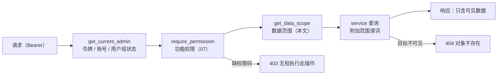

# 13 用户系统与数据隔离

## 1. 目标与范围

早先的设计里，所有后台账号共享全部业务数据（[12-dashboard-reports](./12-dashboard-reports.md) 曾写明「项目筛选只是视图筛选」）。本期加入**用户系统**，在功能权限之外再加一层**数据范围**：

- 每个账号（界面统一称「用户」）通过所属用户组同时获得**功能权限**（权限码，[07-admin-rbac](./07-admin-rbac.md)）与**数据范围**（`admin_groups.data_scope`，本文），两者都满足才能访问。
- 数据范围为「仅本人」（`own`）的**普通用户**只能看到、操作自己负责的项目及其下全部数据：关键词、标题、内容与版本、生成批次、图片 / 视频素材、AI 任务与用量、回填链接、删除检测与收录检测记录、告警。控制台与报表也只统计自己的数据。
- 数据范围为「全部」（`all`）的账号就是**总后台**：看全部用户的数据，可按用户筛选、切换到任一用户的视角（看到的内容与该用户本人一致），也可按用户分解统计。
- 总后台在「用户管理」中创建用户、分配用户组，并为用户开设或转移项目。

本文是以下内容的**权威**：`data_scope` 的取值与语义、系统用户组的默认数据范围、数据归属的推导规则、各资源的可见性与写入规则、不可见对象的错误语义、`DataScope` 依赖与 `data_scope_service` 的实现、`GET /admin/projects/owner-options`、统计报表的范围语义（范围键、`owner` 分解维度、缓存键）、告警的范围归属，以及前端的用户视角切换。以下内容只引用，不在本文重复定义：

| 主题 | 权威文档 |
| --- | --- |
| 表字段、索引、DDL（`admin_groups.data_scope`、`projects.owner_id` 等） | [03-data-model](./03-data-model.md) |
| 接口总表、业务码、响应结构 | [04-api-spec](./04-api-spec.md) |
| 权限码、用户组 CRUD、令牌与审计 | [07-admin-rbac](./07-admin-rbac.md) |
| 指标公式、`daily_stats` 计算口径 | [12-dashboard-reports](./12-dashboard-reports.md) |
| 告警触发规则与通道 | [11-link-backfill-and-monitoring](./11-link-backfill-and-monitoring.md) |

## 2. 概念与术语

| 术语 | 含义 |
| --- | --- |
| 用户 | 一个后台账号，即 `admins` 表的一行。代码与接口沿用 `admin` 命名（`admins` 表、`get_current_admin`、管理员 JWT、`/admin/admins`），界面统一显示为「用户」 |
| 用户组 | `admin_groups`，同时决定功能权限（权限码集合）与数据范围（`data_scope`） |
| 数据范围 | `admin_groups.data_scope`：`all`（全部数据）/ `own`（仅本人） |
| 总后台 | 数据范围为 `all` 的用户所看到的视角；`super_admin` 组固定属于此类 |
| 普通用户 | 数据范围为 `own` 的用户（系统组 `operator` 默认如此） |
| 负责人 | `projects.owner_id`：项目及其下全部数据归属的用户，是数据隔离的**唯一依据** |
| 可见项目集 P | 一次请求可见的项目 ID 集合：总后台且未按用户筛选时为全部项目；其余情况为 `owner_id = 目标用户` 的项目 |
| 用户视角 | 总后台通过查询参数 `owner_id`（前端为顶栏的用户视角切换器）只看某一用户的数据，结果与该用户本人看到的完全一致 |

一次受保护请求先后经过两层判定：



## 3. 数据范围模型

### 3.1 取值

| `data_scope` | 名称 | 可见数据 |
| --- | --- | --- |
| `all` | 全部数据（总后台） | 全部项目及其下数据，以及不归属任何项目的系统数据（系统告警、健康探测任务、未匹配的用量日志）；可用 `owner_id` 收窄到某一用户（§6.2） |
| `own` | 仅本人 | `projects.owner_id = 本人` 的项目及其下数据、本人上传的参考素材（尚未绑定到内容、`project_id` 为空）、本人的操作日志 |

枚举名 `data_scope`：后端在 `server/app/models.py` 顶部以 `Literal` 声明，前端在 `packages/shared/src/enums.ts` 以 `DATA_SCOPE` 导出（`as const`），与其它枚举的约定相同（[00-overview](./00-overview.md) §8.5）。

### 3.2 系统用户组的默认值

| 用户组 | `data_scope` | 可修改 | 理由 |
| --- | --- | --- | --- |
| `super_admin` | `all` | 否（固定；修改返回 403，§13） | 总后台 |
| `operator` | `own` | 是 | 普通用户：只做自己的内容生产、回填与监控 |
| `reviewer` | `all` | 是 | 审核人员需要看到全部用户提交审核的内容 |
| `read_only` | `all` | 是 | 管理层查看全局报表 |
| 自定义组 | 创建时缺省 `own` | 是 | 最小权限原则 |

`SYSTEM_GROUPS` 的每一项带 `data_scope` 键（[07-admin-rbac](./07-admin-rbac.md) §5.1），由迁移 `0002_seed_permissions` 写入。`ensure_rbac_seed` 新建系统组时写入默认值；已存在的系统组**不改写** `data_scope`（管理员的调整优先），唯独 `super_admin` 每次启动都强制写回 `all`（自愈）。

### 3.3 生效与变更

- 每个请求都从数据库读取所属用户组的 `data_scope`。`get_current_admin` 已经加载了用户组，`get_data_scope` 从同一 `Session` 的身份映射中取用，不增加查询。因此修改立即生效，无需重新登录，也不递增 `token_version`，这一点与修改用户组权限相同（[07-admin-rbac](./07-admin-rbac.md) §7.4）。
- 前端在下一次 `GET /admin/auth/me` 时刷新 `data_scope`（刷新页面，或收到带 `data.permission` 的 403 之后）。在那之前，前端的显示（例如是否出现用户视角切换器）可能滞后，但接口返回的数据始终按最新的数据范围过滤。
- 更换用户所属的用户组（`PUT /admin/admins/{id}` 的 `group_id` 变化）沿用 07 的规则：`token_version += 1`，需要重新登录。
- 修改 `data_scope` 写审计：`action=update`、`target_type=admin_group`，`summary` 形如「用户组 运营人员 数据范围 own → all」。

## 4. 数据归属

### 4.1 归属键 `projects.owner_id`

- 业务数据以项目为单位归属：项目负责人 `projects.owner_id` 就是项目下全部数据的所有者。`created_by` / `backfilled_by` / `adopted_by` / `reviewed_by` 等列只记录操作人，不参与可见性判断（例外见 §4.2 中的素材上传与操作日志）。
- `projects.owner_id` 非空（[03-data-model](./03-data-model.md) B.7）。创建项目时缺省为创建人；总后台可以在创建时指定负责人，也可以事后转移（§7.2）。
- 转移负责人会把项目连同其下全部历史数据（包括 `daily_stats` 的项目行与项目告警）一次性转给新负责人：原负责人立即不可见，新负责人立即可见。子表不需要任何迁移，因为它们只通过 `project_id` 归属。

### 4.2 各表的归属推导（权威矩阵）

下表给出 `own` 范围（以及总后台带 `owner_id` 时）的可见条件，`:me` 为目标用户 ID，`P` = `SELECT id FROM projects WHERE owner_id = :me`。总后台未带 `owner_id` 时不加任何条件。

| 表 | 可见条件 | 说明 |
| --- | --- | --- |
| `projects` | `owner_id = :me` | — |
| `keywords` / `titles` / `contents` / `generation_batches` / `publish_links` | `project_id IN P` | 这些表的 `project_id` 均非空 |
| `content_versions` | 所属 `contents` 可见 | 只经 `/admin/contents/{id}/versions*` 访问 |
| `link_checks` / `index_checks` | 所属 `publish_links` 可见：`link_id IN (SELECT id FROM publish_links WHERE project_id IN P)` | — |
| `media_assets` | `project_id IN P OR (project_id IS NULL AND created_by = :me)` | 生成的素材必有项目（[10-media-generation](./10-media-generation.md)）；上传的参考素材 `project_id` 为空，按上传人归属（§7.4） |
| `ai_tasks` | `project_id IN P` | 无项目的根任务（健康探测、路由测试）只对总后台可见 |
| `ai_usage_logs` | `ai_task_id IN (可见的尝试行)` | 未匹配条目（`ai_task_id IS NULL`）只对总后台可见 |
| `prompt_templates` | `project_id IN P`，或 `project_id = 0 AND (status <> 'draft' OR created_by = :me)` | 全局已发布 / 已归档模板对所有人只读可见；全局草稿只对创建人与总后台可见（§7.3） |
| `capability_routes` | `project_id = 0 OR project_id IN P` | 全局路由是平台配置，项目覆盖行随项目 |
| `alerts` | `project_id IN P` | `project_id` 为 NULL 的系统告警（AI 网关、worker）只对总后台可见（§11） |
| `daily_stats` | `project_id IN P`（`project_id > 0`） | `project_id = 0` 的汇总行只在总后台未按用户筛选时使用（§10） |
| `admin_operation_logs` | `admin_id = 当前用户`（不受 `owner_id` 参数影响） | 普通用户只看自己的操作记录 |

### 4.3 不受数据范围约束的资源

以下资源属于平台级配置或安全职能，只由权限码控制，不加范围谓词：

| 资源 | 说明 |
| --- | --- |
| `settings`、`ai_models`、全局 `capability_routes`（`project_id = 0`）、`publish_platforms` | 平台配置。`GET /admin/platforms` 返回的 `link_count` 例外，只统计可见链接 |
| `admins`、`admin_groups`、`admin_permissions` | 安全模块（用户、用户组、权限） |
| `GET /admin/ai/health`、`POST /admin/ai/health/probe`、`POST /admin/ai/routes/{id}/test`、`POST /admin/ai/routes/{id}/reset-breaker`、`POST /admin/ai/models/sync`、`POST /admin/ai/usage/reconcile`、`POST /admin/stats/recompute` | 运维动作，不返回业务数据 |
| `GET /admin/monitoring/overview` 中的 `queued`、`workers`、`daily_limits` | 平台运行状态；同一响应中的 `due` / `today` / `last_run_at` 按范围计算（§6.3） |

这些能力本质上是总后台职能。建议只把 `security.*`、`system.settings.*`、`ai.models.sync`、`ai.routes.create/update/delete/test/reset_breaker`、`ai.usage.reconcile`、`publish.platforms.create/update/delete/test`、`stats.reports.recompute` 授予 `all` 范围的用户组。系统组的默认权限已经满足这一点（`operator` 不含这些码），前端在给 `own` 组勾选这些码时会给出提示（§12.3）。

## 5. 数据模型变更（摘要）

字段定义与索引以 [03-data-model](./03-data-model.md) 为准，本节只汇总改动：

| 表 | 变更 |
| --- | --- |
| `admin_groups` | 新增 `data_scope VARCHAR(16) NOT NULL DEFAULT 'own'` |
| `projects` | `owner_id` 改为非空；唯一约束改为按负责人：`UNIQUE(owner_id, name)`、`UNIQUE(owner_id, slug)`，替换原来的 `UNIQUE(name)`、`UNIQUE(slug)`。原 `INDEX(owner_id)` 已被 `uq_projects_owner_id_name` 的最左前缀覆盖，删除 |
| `media_assets` | 新增 `INDEX(created_by, created_at)`，供「未归属项目的素材按上传人过滤」使用 |

不新增表（仍为 24 张），不新增权限码（仍为 90 个），也不新增 `settings` 配置键、环境变量或 Redis 键族；唯一变化是统计缓存键的格式加入范围段（§10.4）。

项目名与 slug 改为「同一负责人下唯一」有两个原因：全局唯一时，409 冲突会暴露其他用户的项目名；改为按负责人唯一后，不同用户也可以使用同名项目。

## 6. 读规则

### 6.1 通用规则

- **列表、导出、统计**：按 §4.2 的条件过滤，`total` 只计可见行。
- **详情与对象级动作**：目标不可见与目标不存在作同样处理（§8）。
- **筛选参数引用了不可见对象**（如 `project_id`、`content_id`、`link_id`、`batch_id`、`target_id`）：与范围取交集后返回空列表，不报错。
- **嵌套对象与冗余计数**同样受范围约束：链接详情中的 `content` 摘要、素材详情中的 `references.referenced_by_asset_ids` 只列出可见对象；`GET /admin/platforms` 的 `link_count` 只统计可见链接。`GET /admin/projects` 的 `counts{}` 本就限于该项目，无需特别处理。

### 6.2 `owner_id` 查询参数

- 所有受数据范围约束的列表、导出、统计接口，以及 `GET /admin/alerts/summary`、`GET /admin/monitoring/overview`、`GET /admin/ai/usage/summary`，都接受可选查询参数 `owner_id`（正整数）。`GET /admin/projects` 原有的 `owner_id` 筛选就是这个参数。
- **`all` 范围**：给出 `owner_id` 时，把 P 收窄为该用户负责的项目，素材另加 `project_id IS NULL AND created_by = owner_id`。不归属任何项目的系统数据（系统告警、探测任务、未匹配的用量日志）不出现在结果中，因此结果与该用户本人看到的完全一致，即「用户视角」。服务端不校验该用户是否存在或已禁用，已禁用用户的历史数据仍可查看。`admin_operation_logs` 不适用此参数，按用户筛选请用它原有的 `admin_id` 参数。
- **`own` 范围**：忽略 `owner_id`（恒为本人），不报错。

### 6.3 各接口组的范围行为

| 接口组 | `own` 范围（以及总后台带 `owner_id` 时） | 备注 |
| --- | --- | --- |
| `/admin/projects*` | 列表只含 P；详情、编辑、`routes`、`archive` / `unarchive`、删除、`overview` 的目标须属于 P | 创建与转移负责人见 §7.2；`owner-options` 见 §6.4 |
| `/admin/prompt-templates*` | 按 §4.2 过滤；`versions` 只列可见版本 | 写入见 §7.3 |
| `/admin/keywords*`、`/admin/titles*`、`/admin/contents*`、`/admin/generation-batches*` | 按 `project_id IN P` 过滤；生成、导入、手工新增的 `project_id` 须属于 P | 引用校验见 §7.1 |
| `/admin/media*`、`/admin/uploads*` | 按 §4.2 过滤；生成的 `project_id` 须属于 P；上传的素材归上传人 | 上传见 §7.4 |
| `/admin/ai/models*` | 不受约束 | 全局模型目录 |
| `/admin/ai/routes*` | 列表返回全局行与 P 内项目的覆盖行；`?project_id=` 指向不可见项目时只返回全局行；新建 / 编辑 / 删除项目覆盖行要求项目属于 P | 全局行的写入只看权限码 |
| `/admin/ai/tasks*` | 按 `project_id IN P` 过滤；`retry` / `cancel` 的目标须可见；`export` 同列表 | 探测任务只对总后台可见 |
| `/admin/ai/usage/logs`、`/summary` | 只含匹配到可见尝试行的日志；`summary` 只汇总可见尝试行，`group_by=project` 只列 P | `reconcile` 不受约束 |
| `/admin/platforms*` | 平台本身不受约束；`link_count` 只计可见链接 | `test` / `detect` 不受约束 |
| `/admin/links*` | 按 `project_id IN P` 过滤；回填的 `content_id` 须可见 | URL 冲突见 §8 |
| `/admin/monitoring/overview` | `due` / `today` / `last_run_at` 只按可见链接及其检测记录计算；`queued` / `workers` / `daily_limits` 为平台值 | — |
| `/admin/monitoring/link-checks*`、`index-checks*` | 经所属链接过滤；`run` 见 §7.5 | — |
| `/admin/alerts*` | 见 §11 | — |
| `/admin/stats*` | 见 §10 | `recompute` 不受约束 |
| `/admin/admin-operation-logs` | 只返回 `admin_id = 本人` 的记录，`admin_id` 参数被忽略 | 总后台不受约束 |
| `/admin/settings*`、`/admin/admins*`、`/admin/admin-groups*`、`/admin/admin-permissions*` | 不受约束 | 只由权限码控制 |
| `/admin/auth/*` | `login` / `me` 返回 `data_scope` | [07-admin-rbac](./07-admin-rbac.md) §6.1 |

### 6.4 负责人候选 `GET /admin/projects/owner-options`

供项目表单的「负责人」下拉和顶栏的用户视角切换器使用。权限码 `content.projects.view`，不分页。`owner-options` 是静态子路径，必须在 `GET /admin/projects/{id}` 之前注册（[04-api-spec](./04-api-spec.md) §6.0）。

| 范围 | 返回 |
| --- | --- |
| `all` | 全部 `is_active=1` 的用户，加上仍负责至少一个项目的已禁用用户；按 `display_name`（为空时用 `username`）排序 |
| `own` | 只返回本人一项 |

```http
GET /api/v1/admin/projects/owner-options
Authorization: Bearer <admin-jwt>
```

```json
{
  "code": 0,
  "message": "ok",
  "data": [
    { "id": 1, "username": "admin", "display_name": "超级管理员", "is_active": true, "data_scope": "all", "project_count": 1 },
    { "id": 5, "username": "operator01", "display_name": "运营小王", "is_active": true, "data_scope": "own", "project_count": 3 },
    { "id": 7, "username": "operator02", "display_name": "运营小李", "is_active": false, "data_scope": "own", "project_count": 2 }
  ]
}
```

`data_scope` 取自用户所属的用户组；`project_count` 为负责的项目数（含已归档）。

## 7. 写规则

### 7.1 引用校验

任何写接口，只要路径或请求体引用了受范围约束的对象，都先校验其可见性：`project_id`、`content_id`、`keyword_id(s)`、`title_id(s)`、`asset_id`、`link_id(s)`、`template_id`、`batch_id`、`ids[]`。不可见的引用一律按「不存在」处理（§8）。原有的跨对象一致性规则不变，例如标题生成的 `keyword_ids` 必须属于 `project_id`、`attach` 要求 `asset.project_id ∈ {NULL, content.project_id}`。

- 生成接口的 `template_id` 必须可见：全局已发布模板，或 P 内项目的模板。普通用户不能使用其他用户项目的专属模板。
- `PUT /admin/projects/{id}` 的 `default_templates` 只能引用可见的 `published` 模板。
- 参考素材 URL（`reference_image_urls` 等）本身就是公网地址，不做归属校验。把 URL 反解为 `reference_asset_ids_json` 属于内部记账，不受范围约束，以保证删除保护（`409 in_use`）对所有引用都生效；但素材详情的 `references` 只向调用者列出可见的引用方。

### 7.2 项目负责人

| 操作 | `own` 范围 | `all` 范围 |
| --- | --- | --- |
| `POST /admin/projects` 的 `owner_id` | 可省略或等于本人；其它值返回 400 `type="owner_forbidden"` | 省略时为本人；指定时须为存在且 `is_active=1` 的用户，否则 400 `type="owner_unavailable"` |
| `PUT /admin/projects/{id}` 的 `owner_id`（转移） | 只能等于本人（即不变）；其它值 400 `owner_forbidden` | 目标须为启用中的用户（否则 400 `owner_unavailable`）；目标用户已有同名或同 slug 项目时返回 409 `existing_id` |

- 400 的 `data` 遵循 [04-api-spec](./04-api-spec.md) §5.1 的校验错误列表，例如 `[{"loc":["body","owner_id"],"msg":"只能创建或保留自己负责的项目","type":"owner_forbidden","input":7}]`。
- 转移在同一事务内只修改 `projects.owner_id`；提交后执行 `cache_delete_prefix("cache:stats:")`（P 发生了变化）。审计由处理函数设置 `request.state.audit_summary`，内容为「转移项目 {name} 负责人：{旧} → {新}」。所需权限码仍是 `content.projects.update`，不新增权限码。
- 创建与删除项目同样会改变 P，提交后也执行 `cache_delete_prefix("cache:stats:")`。
- 负责人被禁用后，项目与数据保留：总后台可以继续查看并转移；被禁用的用户无法登录。
- 项目删除规则不变（[03-data-model](./03-data-model.md)「删除规则」）。
- 前端处于某个用户视角（§12.2）时，新建项目表单的负责人缺省为该用户。

### 7.3 Prompt 模板

- **创建**：`project_id` 须属于 P 或为 `0`。普通用户创建的全局模板（`project_id = 0`）是只对本人和总后台可见的草稿；发布需要 `content.prompt_templates.publish`（系统组中只有 `super_admin` 默认拥有），这就构成了「普通用户提交、总后台发布」的流程。
- **编辑**（`PUT`）：目标须可见。对可见的全局 `published` 模板调用 `PUT`，会按 [09-generation-pipeline](./09-generation-pipeline.md) 的规则复制为同 code 的新 `draft`（`created_by` 为本人，仅本人与总后台可见），不影响其他用户。
- **发布、归档、删除**：目标须可见。普通用户只能作用于自己项目的模板和自己创建的全局草稿，而且这些权限码默认不在 `operator` 组。
- **复制、预览、版本列表**：源模板须可见；版本列表只列可见版本。
- **运行期解析**：`resolve_template(kind, project_id, language)` 在任务创建时和 worker 中按项目解析，不受请求者的数据范围影响，因为项目模板只属于该项目。

### 7.4 素材上传

- `POST /admin/uploads/image|video` 的接口不变：上传素材一律 `project_id = NULL`（[10-media-generation](./10-media-generation.md) §6.5），按上传人 `created_by` 归属，只有上传人本人和总后台可见。
- `AssetPicker.vue` 选择参考素材时（`usage_type=reference&status=ready`，不带 `project_id`），结果天然只包含可见素材：普通用户只看到自己上传的参考素材。
- `attach` 要求素材可见，并沿用原规则 `asset.project_id ∈ {NULL, content.project_id}`；绑定后素材按 10 §4.9 写入内容的项目，此后随项目负责人归属（普通用户只能绑定到自己的内容，归属不变）。

### 7.5 批量接口

- `POST /admin/keywords/batch-status`、`POST /admin/titles/batch-status`、`POST /admin/alerts/batch-resolve`：不可见的 ID 计入 `skipped[]`，原因 `not_found`，与不存在的 ID 相同。
- `POST /admin/links/batch`：逐条按单条规则校验，`content_id` 不可见的条目返回 `ok=false, code=404`。
- `POST /admin/monitoring/link-checks/run`、`POST /admin/monitoring/index-checks/run`：不可见的 `link_ids` 计入 `skipped`；`project_id` 不可见时返回 `{enqueued:0, skipped:0}`；两者都未给出时，普通用户只对自己的链接入队。

## 8. 错误语义与防探测

| 场景 | 响应 |
| --- | --- |
| 路径参数指向不可见对象（含对象级动作与子资源） | 404 `CODE_NOT_FOUND`，与对象真不存在时完全相同 |
| 请求体引用不可见对象 | 与该接口对「不存在的 ID」的既有响应相同；[04-api-spec](./04-api-spec.md) 未单独规定时为 404、`data=null` |
| 列表筛选参数引用不可见对象 | 空结果，不报错 |
| 统计接口的 `project_id` 不属于 P（按用户范围统计时） | 404（§10.2） |
| 全局唯一键命中不可见对象：`publish_links.url_hash`（URL 全局唯一）、`prompt_templates.code`（code 全局唯一） | 409，`data={"existing_id":null,"reason":"owned_by_other"}`，`message` 分别为「该链接已由其他用户回填」「模板代码已被其他用户使用」；命中可见对象时保持原来的 `{"existing_id":…}` |
| 越权指定负责人 | 400 `owner_forbidden` / `owner_unavailable`（§7.2） |
| 修改 `super_admin` 组的 `data_scope` | 403 安全规则，`data=null` |

数据范围**从不返回 403**：403 只表示功能权限不足或安全规则拒绝（[04-api-spec](./04-api-spec.md) §4.3），否则会向调用者暴露对象的存在。`owned_by_other` 只告诉调用者「该 URL / code 已被占用」，这是去重所必需的信息；它不返回对象 ID，也不透露是哪个用户。

## 9. 后端实现

### 9.1 `DataScope` 与 `get_data_scope`

核心层 `app/core` 不得导入 `models` / `services`（[02-project-structure](./02-project-structure.md) §2.2），而范围判定需要查询 `projects`，因此实现放在业务层 `server/app/services/data_scope_service.py`，依赖函数放在 `server/app/api/deps.py`：

```python
# server/app/services/data_scope_service.py
from dataclasses import dataclass
from typing import Literal

DataScopeValue = Literal["all", "own"]

@dataclass(frozen=True)
class DataScope:
    admin_id: int | None        # 发起请求的用户；worker、启动引导、seed 为 None
    scope: DataScopeValue       # 所属用户组的 data_scope
    owner_id: int | None        # 生效的负责人筛选：own 恒为 admin_id；all 为查询参数 owner_id（None = 不筛选）

    @property
    def is_all(self) -> bool:
        return self.scope == "all"

    @property
    def restricted(self) -> bool:
        return self.owner_id is not None

    @property
    def cache_key(self) -> str:                      # 统计缓存键的范围段（§10.4）
        return f"owner:{self.owner_id}" if self.restricted else "all"

SYSTEM_SCOPE = DataScope(admin_id=None, scope="all", owner_id=None)
```

```python
# server/app/api/deps.py
def get_data_scope(
    admin: Admin = Depends(get_current_admin),
    db: Session = Depends(get_db),
    owner_id: int | None = Query(None, gt=0),
) -> DataScope:
    group = db.get(AdminGroup, admin.group_id)        # get_current_admin 已加载，身份映射命中，不再查询
    if group.code == "super_admin" or group.data_scope == "all":   # super_admin 短路，与 permission_codes 一致
        return DataScope(admin.id, "all", owner_id)
    return DataScope(admin.id, "own", admin.id)       # own 范围忽略 owner_id 参数
```

FastAPI 在同一请求内缓存依赖结果，`require_permission` 与 `get_data_scope` 共用同一个 `get_current_admin` 结果，不会重复鉴权。`get_data_scope` 声明的 `owner_id` 查询参数会并入路由的查询参数，各路由不再单独声明 `owner_id`。

### 9.2 `data_scope_service` 函数清单

| 函数 | 作用 |
| --- | --- |
| `visible_project_ids(scope) -> Select \| None` | `scope.restricted` 时返回 `select(Project.id).where(Project.owner_id == scope.owner_id)`，否则返回 `None`（不加条件） |
| `scope_by_project(stmt, column, scope)` | 附加 `column.in_(visible_project_ids(scope))`，用于 `keywords` / `titles` / `contents` / `generation_batches` / `publish_links` / `ai_tasks` / `alerts` / `daily_stats` |
| `scope_media(stmt, scope)` | `media_assets` 的条件（§4.2） |
| `scope_templates(stmt, scope)` | `prompt_templates` 的条件（§4.2），`:me` 取 `scope.owner_id` |
| `scope_routes(stmt, scope)` | `capability_routes`：`project_id = 0 OR project_id IN P` |
| `scope_link_children(stmt, link_column, scope)` | `link_checks` / `index_checks` 经所属链接过滤 |
| `scope_usage_logs(stmt, scope)` | `ai_usage_logs.ai_task_id IN (可见尝试行)` |
| `scope_operation_logs(stmt, scope)` | `scope.scope == "own"` 时附加 `admin_id = scope.admin_id` |
| `get_visible(db, scope, model, obj_id)` | 读取对象并判断可见性；不存在或不可见都抛 `BusinessError("对象不存在", code=404, http_status=404)` |
| `require_project(db, scope, project_id, *, active=False) -> Project` | 写入口：项目须可见；`active=True` 时 `archived` 按原规则返回 409 `current_status` |
| `is_visible(db, scope, obj) -> bool` | 对已加载的对象判断可见性，供批量接口逐条使用 |
| `owner_options(db, scope) -> list[dict]` | §6.4 |

谓词全部以子查询表达，由 `projects` 的 `uq_projects_owner_id_name`（最左前缀 `owner_id`）与各表已有的 `project_id` 前缀索引支撑，不需要额外的 Redis 缓存。

### 9.3 路由接入约定与覆盖测试

- 受范围约束的路由文件是 `projects.py`、`prompt_templates.py`、`keywords.py`、`titles.py`、`contents.py`、`generation_batches.py`、`media.py`、`uploads.py`、`ai_routes.py`、`ai_tasks.py`、`ai_usage.py`、`platforms.py`、`links.py`、`monitoring.py`、`alerts.py`、`stats.py`、`operation_logs.py`。其中路径前缀属于常量 `SCOPED_ROUTE_PREFIXES` 的路由，都声明 `scope: DataScope = Depends(get_data_scope)` 并原样传给 service。`SCOPED_ROUTE_PREFIXES` 包括 `/admin/projects`、`/admin/prompt-templates`、`/admin/keywords`、`/admin/titles`、`/admin/contents`、`/admin/generation-batches`、`/admin/media`、`/admin/uploads`、`/admin/ai/routes`、`/admin/ai/tasks`、`/admin/ai/usage`、`/admin/platforms`、`/admin/links`、`/admin/monitoring`、`/admin/alerts`、`/admin/stats`、`/admin/admin-operation-logs`。§4.3 中不受约束的动作即使声明了该依赖也只是忽略它，以保持规则单一。
- service 中所有读写上述表的函数都以 `scope` 为**必填**参数（不设缺省值），漏传会在调用处直接报错；worker 调用时显式传 `SYSTEM_SCOPE`。
- 路由层不得绕过 service 直接查表（[01-architecture](./01-architecture.md) §4.2 已有规定），因此范围谓词只需在 service 中实现一次。
- 覆盖测试 `test_scoped_routes_declare_data_scope` 遍历 `app.routes`，断言路径以 `SCOPED_ROUTE_PREFIXES` 中任一前缀开头的路由，其依赖树都包含 `get_data_scope`。新增资源时，在 [02-project-structure](./02-project-structure.md) §6.4 的触点清单中同步维护该常量。

### 9.4 worker 与系统任务

- worker、monitor-worker、启动引导与 `seeds/seed.py` 不经过 HTTP，不受数据范围约束，统一使用 `SYSTEM_SCOPE`。
- 业务写入点必须把 `project_id` 写全，归属才正确：
  - 告警按 §11 写 `project_id`。
  - `ai_tasks` 的尝试行复制根任务的 `project_id`（已有规则，[03-data-model](./03-data-model.md) B.15）。
  - `index_check_service` 创建的收录检测根任务写 `project_id = link.project_id`。
  - 媒体内嵌的 `image_prompt` 根任务写宿主资产的 `project_id`。
- 频控键 `rate:*:{admin_id}` 本来就按用户计数；额度键 `quota:daily:{date}` 全平台共享，`quota:project:{project_id}:{yyyy-mm}` 按项目计数（按用户的额度见 §15）。

## 10. 统计与报表的范围

指标公式与 `daily_stats` 的计算方式不变（[12-dashboard-reports](./12-dashboard-reports.md)），预聚合本来就按项目分行，因此按用户统计只需在**查询时**对 P 内的项目行求和，不增加预聚合维度。

### 10.1 范围键

`scope.cache_key` 有两种取值：`all`（总后台且未按用户筛选）与 `owner:{owner_id}`（普通用户本人，或总后台带 `owner_id`）。普通用户本人与总后台切换到该用户视角得到的范围键相同，结果也相同。

### 10.2 各接口的语义

| 项 | 范围键 `all` | 范围键 `owner:{id}` |
| --- | --- | --- |
| `project_id=0` | 取 `daily_stats.project_id=0` 的汇总行（含不归属项目的数据） | 取 P 内各项目行，按相同的 `dimension` / `dimension_key` 求和。流量列和快照列都可以相加：快照按链接计数，各项目的链接集合互不相交 |
| `project_id>0` | 取该项目行（不校验项目是否存在） | 项目须属于 P，否则 404 |
| 当前值指标（`*_total`、`*_by_status`、`seo_index_rate` 等） | 按 `project_id` 筛选 | 附加 `project_id IN P` |
| 今日兜底 `stats:rt` | `stats:rt:{date}:{project_id}` | 用 pipeline 逐项目 `HGETALL stats:rt:{date}:{pid}`（pid ∈ P），按字段求和 |
| `alerts_open` / `alerts_opened` / `alerts_resolved` | 全部告警 | 只含 P 内项目的告警，不计系统告警 |
| `*_by_engine` | `project_id=0` 的引擎行（启用引擎每日必写） | 引擎集合取同一 `snapshot_date` 下 `project_id=0` 引擎行的键（即启用中的引擎）；`hit` = P 内项目引擎行之和（无行计 0），`total` = P 内 `links_total_snapshot` 之和，`total=0` 时 `rate=null` |
| `breakdown?dimension=project`、`rankings?type=top_cost_projects` | 全部项目 | 只含 P |
| `rankings?type=fastest_indexed` | 全部链接 | `publish_links.project_id IN P` |
| `most_deleted_platforms` / `top_cost_models` / `top_failed_models`、其它维度的 `trends` / `breakdown` | `project_id` 指定的行 | P 内同维度行求和 |
| `meta` | 新增 `scope:"all"`、`owner_id:null` | `scope:"owner"`、`owner_id` |

- 按用户统计时看不到不归属项目的数据（只有总后台能看到的系统数据），所以 P 内各项目行之和可能小于 `project_id=0` 的汇总行。这与 [12-dashboard-reports](./12-dashboard-reports.md) §4.1 规则 3 中已删除项目造成的差异是同一类现象。
- `POST /admin/stats/recompute` 是全局动作，不受数据范围影响。
- 性能：按用户统计的查询走 `daily_stats` 的 `INDEX(project_id, stat_date)` 与 `project_id IN (子查询)`；按 12 §10.1 的数据量估算，单个用户有数百个项目时依然在目标耗时之内。

### 10.3 按用户分解 `dimension=owner`

- `GET /admin/stats/breakdown?dimension=owner` 是只用于分解接口的新维度值。它不属于 `daily_stats` 的存储维度 `stats_dimension`，也不写入 `daily_stats`。计算方式：取 `dimension='total'` 的项目行（`project_id>0`），按 `projects.owner_id` 的**当前值**分组求和。
- `project_id` 已不在 `projects` 中的行（已删除项目）归入键 `0`，标签为「已删除项目」。其余键为用户 ID 字符串，标签取 `display_name`，为空时取 `username`；已禁用用户在标签后加「（已禁用）」。
- `metric` 的规则与 `dimension=project` 相同：可以是 `total` 行的任一列及其派生指标；忽略 `project_id` 参数。
- 归属以**当前**负责人为准：项目转移后，其历史统计随之归到新负责人名下，与可见性规则一致。
- `own` 范围只返回本人一行；总后台带 `owner_id` 时只返回该用户一行。
- 报表页「分解」Tab 与「AI 消耗」Tab 的「按用户分解表」使用此维度，只在总后台显示（§12.3）；维度键候选的取法相同（[12-dashboard-reports](./12-dashboard-reports.md) §6.2）。

### 10.4 缓存键

| 键 | 变化 |
| --- | --- |
| `cache:stats:overview:{scope_key}:{project_id}:{range}` | 原为 `cache:stats:overview:{project_id}:{range}`，新增范围段 |
| `cache:stats:trends:{sha1(query)}` / `cache:stats:breakdown:{sha1}` / `cache:stats:rankings:{sha1}` | 规范化查询串中加入 `scope_key` |

失效规则：保留原有的「聚合完成后清 `cache:stats:*`」；新增「项目创建、删除、转移负责人后 `cache_delete_prefix("cache:stats:")`」，因为这些操作会改变 P。

## 11. 告警的范围

- **归属**：按 `alerts.project_id`。业务告警必须写 `project_id`：
  - `link_deleted` / `link_restored` / `link_changed` / `index_overdue` 写 `link.project_id`。
  - `media_task_failed` 写 `asset.project_id`（生成的素材必有项目）。
  - 系统告警 `ai_task_failures` / `ai_breaker_open` / `ai_quota_exceeded` / `ai_auth_failed` / `ai_upstream_unavailable` / `worker_stale` 的 `project_id` 为 NULL，只对总后台可见。
- `GET /admin/alerts`、`GET /admin/alerts/summary`（含 `today_opened` / `today_resolved`）、详情与处理动作都按 §4.2 过滤；普通用户顶栏铃铛的计数只包含本人项目的告警。
- 去重键 `dedupe_key` 不变：一条链接只属于一个项目，键里不需要包含用户。
- 通道（webhook / 邮件）是总后台通道，投递全部告警，不按用户分发（按用户投递见 §15）。
- 项目转移后，该项目的历史告警与未处理告警随项目一起转给新负责人。
- 普通用户看不到系统告警，但在发起生成时，仍能从 5031 的 `paused_reason` 等同步提示得知 AI 调用已暂停（[04-api-spec](./04-api-spec.md) §5.2）。

## 12. 前端

### 12.1 登录态与范围标识

- `POST /admin/auth/login` 与 `GET /admin/auth/me` 返回的 `admin` 对象新增 `data_scope`（`all` / `own`），对应共享类型 `AdminProfile.data_scope`。
- `store/auth.ts` 新增 getter `isAllScope`（`admin?.data_scope === "all"`）；`composables/usePermission.ts` 一并暴露 `isAllScope`。
- 顶栏用户区按范围显示标签：`all` 为「总后台」，`own` 为「我的数据」（i18n 键 `scope.all` / `scope.own`）。

### 12.2 用户视角切换器 `components/OwnerSelect.vue`

- 只在 `isAllScope && has("content.projects.view")` 时渲染，位于顶栏 `ProjectSelect` 左侧。选项来自 `GET /admin/projects/owner-options`（缓存在 `store/project.ts`），首项为「全部用户」（值 0）。
- 当前值保存在 `store/project.ts` 的 `ownerId`，持久化到 localStorage 键 `aicreat.owner_id`。切换时把 `currentId` 重置为 0，并重新加载项目列表（`GET /admin/projects?status=active&owner_id=`）。
- `api/client.ts` 的请求拦截器：`ownerId > 0` 时为 **GET** 请求自动附加 `owner_id`（请求已显式携带时不覆盖）；写请求不附加。普通用户不渲染切换器，也不附加该参数。
- `ownerId > 0` 时，内容区顶部显示 `el-alert`「正在查看用户 {name} 的数据」，并提供「返回全部用户」按钮。
- 登录、退出、切换账号时清空 `ownerId` 与 `currentId`，避免沿用上一个账号的选择；持久化的 `currentId` 不在可见项目列表中时重置为 0；统计接口返回 404（项目已不可见）时同样重置为 0 后重新请求。

### 12.3 页面改动

| 页面 | 改动 |
| --- | --- |
| `Dashboard.vue` | 标题按范围显示「总览」（总后台）或「我的数据」（`own`）；依据 `meta.scope` 显示范围徽标；告警摘要只含可见告警 |
| `stats/Reports.vue` | `isAllScope` 时，分解维度下拉增加「用户」（`owner`），AI 消耗 Tab 增加「按用户分解表」；项目筛选只列可见项目 |
| `projects/Index.vue` | 总后台的列表增加「负责人」列与筛选；新建 / 编辑表单的「负责人」下拉取自 `owner-options`，`own` 范围隐藏该字段；转移负责人时二次确认「项目及其下全部数据将转给 {name}」 |
| `admin-groups/Index.vue` | 基本信息表单增加「数据范围」单选：「全部数据（总后台）」/「仅本人负责的项目」，`super_admin` 组禁用；列表显示数据范围标签；`own` 组勾选 §4.3 所列权限码时，在权限树上方提示「这些权限属于总后台职能，不受数据范围限制」 |
| `admins/Index.vue`（用户管理） | 列表增加「数据范围」列（取所属用户组）；用户组下拉每项显示该组的数据范围 |
| `links/Index.vue`、`components/LinkBackfillDialog.vue` | 回填返回 409 且 `reason=owned_by_other` 时提示「该链接已由其他用户回填」 |
| `prompt-templates/Index.vue` | 普通用户新建全局模板时提示「草稿仅自己可见，需由总后台发布」；409 `owned_by_other` 时提示「模板代码已被其他用户使用」 |
| 其它列表页 | 无改动：由后端过滤，并由拦截器附加 `owner_id` |

### 12.4 共享类型

```ts
// packages/shared/src/enums.ts
export const DATA_SCOPE = ["all", "own"] as const;
export type DataScope = (typeof DATA_SCOPE)[number];

// packages/shared/src/types.ts（只列新增字段）
export interface AdminProfile { /* … */ data_scope: DataScope }
export interface AdminItem { /* … */ data_scope: DataScope }          // 取所属用户组
export interface AdminGroupItem { /* … */ data_scope: DataScope }
export interface OwnerOption { id: number; username: string; display_name: string | null; is_active: boolean; data_scope: DataScope; project_count: number }
// StatsOverview.meta 增加 scope: "all" | "owner" 与 owner_id: number | null
```

## 13. 安全与审计

1. 数据范围只在后端判定（`get_data_scope` + service 谓词），前端的隐藏只影响交互体验。
2. 不可见即不存在（404），不用 403 暴露对象存在性；全局唯一键冲突只返回 `owned_by_other`，不返回对象 ID（§8）。
3. `super_admin` 的 `data_scope` 固定为 `all`：`PUT /admin/admin-groups/{id}` 把它改成其它值时返回 403（安全规则，`data=null`）；`get_data_scope` 对 `super_admin` 组短路为 `all`；`ensure_rbac_seed` 每次启动都写回 `all`。
4. 修改用户组的数据范围、转移项目负责人都写审计，`summary` 包含变更前后的值。
5. 安全模块与全局配置不受数据范围约束（§4.3）。把这些权限码授予 `own` 组，等同于授予总后台能力（例如 `security.admins.create` 可以创建 `super_admin` 组的用户），前端在保存用户组权限时会提示（§12.3）。
6. 媒体文件 `GET /media/{key}` 仍然公开，因为 zhiqiapi 需要从公网取参考素材；对象键含 `uuid4` 十六进制段，无法枚举。素材 URL 只通过可见的资产返回给调用者。
7. 普通用户之间不共享任何业务数据；需要协作时，只能由总后台转移项目负责人（项目成员见 §15）。

## 14. 迁移、seed 与既有库升级

| 位置 | 内容 |
| --- | --- |
| `server/migrations/versions/0001_initial.py` | 按 [03-data-model](./03-data-model.md) 建列与索引：`admin_groups.data_scope`、非空的 `projects.owner_id`、`uq_projects_owner_id_name`、`uq_projects_owner_id_slug`、`ix_media_assets_created_by_created_at` |
| `server/migrations/versions/0002_seed_permissions.py` | 写入 `SYSTEM_GROUPS` 时带上 `data_scope`（§3.2） |
| `admin_rbac_service.ensure_rbac_seed` | 新建系统组时写默认 `data_scope`；已存在的系统组不改写，`super_admin` 强制写回 `all` |
| `server/seeds/seed.py` | 示例项目的 `owner_id` 为默认超管；示例项目已存在时不改负责人 |

**既有库升级**：只有按本文之前的文档版本建成的数据库才需要升级，新部署不需要。另写一次性迁移（建议命名 `0003_data_scope.py`），在同一迁移内执行：

1. `ALTER TABLE admin_groups ADD COLUMN data_scope VARCHAR(16) NOT NULL DEFAULT 'own'`；`UPDATE admin_groups SET data_scope = 'all' WHERE code IN ('super_admin', 'reviewer', 'read_only')`。
2. `UPDATE projects SET owner_id = created_by WHERE owner_id IS NULL`；`ALTER TABLE projects MODIFY owner_id BIGINT NOT NULL`。
3. 删除 `uq_projects_name`、`uq_projects_slug`、`ix_projects_owner_id`；新建 `uq_projects_owner_id_name`、`uq_projects_owner_id_slug`。
4. 新建 `ix_media_assets_created_by_created_at`。
5. 迁移完成后清除 Redis `cache:stats:*`。

上线前，总后台需要在「项目」页核对每个项目的负责人，必要时转移。升级之后，`operator` 组的用户只能看到自己负责的项目。

## 15. 非目标与后续扩展

- **自助注册、找回密码、第三方登录**：账号只由总后台在「用户管理」中创建。
- **项目成员 / 共享**（一个项目由多个用户协作）：后续可增加 `project_members` 表，把 P 扩展为「负责或参与的项目」。§9.2 的 `visible_project_ids` 是唯一需要改动的地方。
- **按用户的额度与频控上限**：首版 `quota:daily:{date}` 全平台共享，`quota:project:*` 按项目计数；后续可增加 `quota:owner:{owner_id}:{yyyy-mm}` 与 `generation_config.quota.owner_monthly_limit`。
- **多租户**：zhiqiapi 密钥、能力路由全局行、发布平台规则、系统配置仍由全平台共享（[00-overview](./00-overview.md) §6）。
- **按用户投递告警通道**（webhook / 邮件）。
- **部门 / 层级数据范围**（如「本部门」）：`data_scope` 是字符串枚举，后续可以扩展取值。

## 16. 测试范围

### 后端（`server/tests/test_data_scope.py`）

夹具：`operator` 组用户 A、B（`own`），`reviewer` 组用户 R（`all`），超管 S；项目 PA（负责人 A）、PB（负责人 B），两个项目下各有关键词、标题、内容与版本、批次、AI 根任务与尝试行、素材、回填链接与检测记录、项目告警和 `daily_stats` 行；另有一条系统告警、一个探测任务、一条未匹配的用量日志，以及 A 上传的一条未归属项目的参考素材。

- **范围计算**：各组的 `get_data_scope` 结果；`super_admin` 短路为 `all`；`own` 范围忽略 `owner_id` 参数；`all` 范围带 `owner_id` 时 `restricted=True`；`cache_key` 的两种取值。
- **列表隔离**：§6.3 中每个受约束的列表与导出接口，A 只看到 PA 的数据且 `total` 正确，B 只看到 PB 的数据，R 与 S 看到两者；S 带 `owner_id=A` 的结果与 A 本人的结果逐 ID 相同。
- **详情与动作**：A 对 PB 的对象执行 GET / PUT / 对象级 POST / DELETE 均返回 404，响应体与访问不存在的 ID 完全相同；批量接口中 PB 的 ID 计入 `skipped`（`not_found`）。
- **引用校验**：A 以 `project_id=PB` 生成、导入、新增，或用 PB 的项目模板 `template_id`、回填 PB 的内容、`attach` PB 的素材，响应均与引用不存在的 ID 相同。
- **冲突**：A 回填 PB 已回填的 URL → 409 `existing_id=null, reason=owned_by_other`；R 回填同一 URL → 409 带 `existing_id`；模板 code 冲突同理。
- **项目负责人**：A 创建的项目负责人为 A；A 指定 `owner_id=B` → 400 `owner_forbidden`；S 为 A 创建的项目 A 可见；S 把 PA 转移给 B 后，A 访问返回 404、B 可见，统计与告警随之转移，统计缓存被清除；不同负责人可以有同名项目，同一负责人下重名 409；转移给已有同名项目的用户返回 409；指定已禁用用户 → 400 `owner_unavailable`。
- **owner-options**：A 只得到本人；S 得到全部启用用户和仍负责项目的已禁用用户，`project_count` 正确。
- **模板**：全局已发布模板对所有人可见；A 的全局草稿对 B 不可见、对 S 可见；B 对全局已发布模板 `PUT` 得到属于 B 的新草稿，A 不可见。
- **素材**：A 上传的参考素材（`project_id` 为空）只有 A 与 S 可见，B 的 `AssetPicker` 查询不到；A 把它绑定到 PA 的内容后随 PA 归属；`reference_asset_ids` 反解不受范围影响，删除保护（409 `in_use`）对其他用户的引用同样生效，而素材详情的 `references` 只列出可见的引用方。
- **AI**：AI 任务列表与导出按项目过滤；探测任务只对 S 可见；用量日志中未匹配条目只对 S 可见，匹配到 PA 尝试行的条目 A 可见；`usage/summary` 按范围汇总。
- **监控**：`monitoring/overview` 的 `due` / `today` 按范围计算，`queued` / `workers` 为平台值；`run` 时 PB 的 `link_ids` 计入 `skipped`。
- **告警**：PB 的链接告警对 A 不可见；系统告警只对 S 与 R 可见；`summary` 计数按范围；`batch-resolve` 中 PB 的 ID 计入 `skipped`。
- **统计**：A 的总览等于 PA 各行之和（流量列、快照列、`*_by_engine`）；S 带 `owner_id=A` 的总览与 A 的结果相同，且使用同一缓存键；A 请求 `project_id=PB` → 404；`breakdown?dimension=owner` 对 S 返回每位负责人一行、已删除项目归入键 `0`，对 A 只返回本人一行；`all` 与 `owner:{id}` 的缓存键不同；今日实时兜底对 P 内各项目求和。
- **操作日志**：A 只看到自己的记录。
- **用户组**：新建自定义组缺省 `own`；修改 `data_scope` 后无需重新登录即生效（旧令牌仍有效，下一次请求按新范围过滤），并写审计；把 `super_admin` 的 `data_scope` 改为 `own` → 403；`ensure_rbac_seed` 不改写其它系统组已调整的值。
- **路由覆盖**：`test_scoped_routes_declare_data_scope`（§9.3）。

### 管理端

- 普通用户：没有用户视角切换器；顶栏显示「我的数据」；控制台标题为「我的数据」；项目表单没有负责人字段；所有列表只出现本人数据。
- 总后台：顶栏有用户视角切换器；选择用户后 GET 请求附带 `owner_id`，出现「正在查看」提示条，项目选择器只列该用户的项目；报表分解出现「用户」维度；项目列表有负责人列；转移负责人有二次确认。
- 用户组页的数据范围单选可以保存，`super_admin` 禁用；用户管理页显示数据范围；切换账号后 `ownerId` 与 `currentId` 被清空。

## 17. 验收标准

1. 两个 `operator` 用户各自建项目，并跑完「生成 → 回填 → 检测」：彼此在任何页面和接口上都看不到对方的数据，列表为空，直接访问对方对象的 ID 返回 404；控制台与报表只统计自己的数据。
2. 超管（总后台）能看到全部数据；在顶栏选择某个用户后，各页面看到的内容与该用户本人一致；报表可以按用户分解。
3. `reviewer` 能看到并审核所有用户提交的内容。
4. 修改用户组的数据范围立即生效，无需重新登录；`super_admin` 的数据范围不可修改。
5. 转移项目负责人后，项目及其历史数据、统计、告警一起转移给新负责人。
6. 回填其他用户已回填的 URL 时，只提示「已由其他用户回填」，不暴露对方的链接 ID。
7. 系统告警（AI 网关、worker）只在总后台可见，普通用户的顶栏铃铛只统计本人项目的告警。
8. 所有受范围约束的路由都声明了 `get_data_scope`，由覆盖测试保证。
9. Mock 模式下，按 [06-getting-started](./06-getting-started.md) 的「数据隔离验证」步骤可以复现第 1、2、5 条。

## 18. 实施顺序

数据范围不单独成为一个阶段，而是随 [README](./README.md)「当前规划顺序」的各步落地：

1. **第 1 步（基础设施）**：`models.py` 中的 `admin_groups.data_scope`、`projects.owner_id` 非空与新索引、`media_assets` 新索引；迁移 `0001_initial` / `0002_seed_permissions`；`seeds/seed.py` 写示例项目负责人。
2. **第 2 步（RBAC 与后台骨架）**：`services/data_scope_service.py`（`DataScope`、`SYSTEM_SCOPE`、谓词函数、`get_visible`、`require_project`）、`deps.get_data_scope`；用户组 `data_scope` 的读写与安全规则；`login` / `me` 返回 `data_scope`；操作日志按范围过滤；`test_data_scope.py` 骨架与路由覆盖测试；前端 `store/auth.ts` 的 `isAllScope` 与用户组页的数据范围单选。
3. **第 3 步（AI 网关）**：`ai_tasks`、`ai_usage_logs`、项目覆盖路由接入范围谓词。
4. **第 4 步（项目与 Prompt 模板）**：负责人规则（创建、转移、按负责人唯一）、`GET /admin/projects/owner-options`、模板的可见性与写入规则；前端项目页负责人字段。
5. **第 5~6 步（关键词、标题、内容、批次）**：按项目过滤与引用校验。
6. **第 7 步（图片 / 视频）**：素材范围（生成素材随项目、上传素材随上传人）。
7. **第 8~9 步（回填、检测、告警）**：`link_count` 按范围计数、回填 `owned_by_other`、监控概览与批量检测的范围、告警写 `project_id` 与按范围过滤。
8. **第 10 步（报表与交付）**：统计范围键、P 内求和、`dimension=owner`、缓存键与失效；前端 `OwnerSelect.vue`、拦截器附加 `owner_id`、控制台 / 报表改动、i18n 与共享类型；Mock 模式下的数据隔离验证。
