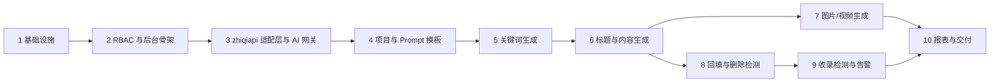

# aicreat 内容生成平台项目文档

本文档集描述 **aicreat（AI 内容生成与效果监控平台）** 工程的产品、架构、项目结构、数据模型、接口、部署方案与各功能模块设计。全套文档共用一份命名基准：表名、字段名、状态枚举值、接口路径、权限码、环境变量、配置键、Redis 键、目录/文件名在所有文档中逐字一致，每一项只在一篇「权威文档」中完整定义（见下文「文档分工与引用约定」），其它文档只引用、不改写。

aicreat 是面向运营/内容团队的 **B 端内部工具**：在「项目/专题」下，由 AI 批量生成候选**关键词**，对采用的关键词生成候选**标题**，再基于标题 + 关键词 + 大纲 + Prompt 模板生成**文章**（Markdown/HTML，支持大纲先行、分段生成、重写/扩写/缩写/改风格、版本历史与 SEO 要素）；文章经审核后由运营人员**手工**发布到知乎、微信公众号、小红书、CSDN、头条、百家号、企业官网等外部平台，并在平台**回填发布链接**（一篇文章可回填多条链接、多个平台）；平台随后自动对链接做**删除检测**（是否被平台删除/修改）与 **SEO/GEO 收录检测**（是否被百度/Bing/Google 收录，是否被百度 AI 搜索/豆包/Kimi/DeepSeek/Perplexity/ChatGPT 等生成式引擎引用），异常时产生**告警**，并在**控制台报表**中汇总 KPI、趋势、分解、榜单与 AI 消耗。平台同时提供**图片生成**（文生图/图生图）与**视频生成**（文生视频/图生视频），所有 AI 能力（文本、图片、视频以及 GEO/SEO 检测所用的联网模型）**统一经 zhiqiapi（志奇引擎，`https://zhiqiapi.com/v1`）接入**（SEO 收录检测的默认提供器 `zhiqi_web_search` 同样经 zhiqiapi；可选提供器 `baidu_ai_search` / `bing_webmaster` / `google_search_console` / `manual` 不经 zhiqiapi，且全部**不抓取搜索引擎结果页 HTML**）。

首版**不做**：站内托管文章页面、自动登录外部平台代发（只做手工发布后回填）、C 端用户社区、会员/支付、多语言内容（界面保留 zh-CN/en-US 切换，生成内容语言由项目 `projects.language` 决定，默认 `zh-CN`）。角色只有超级管理员、运营人员、审核人员、只读四类（系统用户组 `super_admin` / `operator` / `reviewer` / `read_only`），无 C 端用户。**用户系统**：每个后台账号（界面称「用户」）经用户组同时获得权限码与数据范围 `data_scope`——普通用户（`own`，`operator` 默认）只能看到自己负责的项目（`projects.owner_id`）及其下全部数据与统计，总后台（`all`，`super_admin` 固定，`reviewer` / `read_only` 默认）看全部用户的数据、可切换到任一用户视角并按用户分解统计（[13-user-data-scope](./13-user-data-scope.md)）。

技术栈：后端 **Python 3.11 + FastAPI + Pydantic v2/pydantic-settings + SQLAlchemy 2.x/Alembic + MySQL 8（utf8mb4）+ Redis 7 + gunicorn/uvicorn + pyjwt/bcrypt + httpx**，两个 navigation 式「轮询循环」worker 进程（`python -m app.worker` 负责 AI 任务队列、媒体任务轮询与转存、用量对账、模型目录同步、健康探测、过期回收、素材清理；`python -m app.monitor_worker` 负责链接删除检测、SEO/GEO 收录检测、每日统计聚合、告警评估），唯一前端为管理后台 **Vue 3 + Vite + TypeScript + Element Plus + Pinia + Vue Router + vue-i18n + axios + echarts**，共享包 `@aicreat/shared`（TS 类型/枚举/常量），采用 **pnpm@9 monorepo**；存储 `STORAGE_MODE=local`（默认；`OSS_ENDPOINT` 为空时强制 local）时文件落本地磁盘 `server/storage/`（`LOCAL_STORAGE_DIR`）经 `/media/{key}` 暴露，`STORAGE_MODE=oss` 时走 S3 兼容对象存储（`OSS_*`，boto3），zhiqiapi 返回的临时 URL **必须转存**后才写入 `media_assets.url`；`ZHIQI_API_KEY` 为空时文本/图片/视频以及经 zhiqiapi 的 SEO/GEO 收录检测全部走本地 **Mock**（`MockZhiqiClient`；非 zhiqi 收录提供器在 Mock 模式返回 `unknown`），无密钥可跑通全流程。技术栈与工程约定**完全沿用本地 `navigation` 工程**。

## 文档目录

| 文档 | 说明 |
| --- | --- |
| [00-overview](./00-overview.md) | 产品定位、目标用户与四类角色、按模块的核心能力表、端到端业务流程（mermaid）、非目标、关键名词与**状态枚举总表**（各枚举取值集合的权威） |
| [01-architecture](./01-architecture.md) | 技术栈表、服务拓扑、6 张关键数据流时序图（§3.1 关键词→标题→内容；§3.2 图片/视频异步任务；§3.3 回填→删除检测→告警；§3.4 SEO/GEO 收录检测；§3.5 zhiqiapi 调用与用量对账；§3.6 报表聚合）、后端分层、**Redis 键/队列/锁表**、**worker 进程与任务总表**、鉴权总览 |
| [02-project-structure](./02-project-structure.md) | monorepo **完整目录树**（`server/app` 各文件、`apps/admin/src` 各页面与组件、`packages/shared`、`nginx`、`scripts`）、模块职责表、命名约定（核心） |
| [03-data-model](./03-data-model.md) | 全部 **24 张 MySQL 表**的字段/类型/索引/约束、ER 图、一致性与事务规则、`settings` 配置键清单 |
| [04-api-spec](./04-api-spec.md) | 统一响应 `{code, message, data}`、分页、鉴权头、**业务码表**，全部 `/api/v1/admin/*` 接口表（按资源分组，含权限码）与关键接口的 `http` + `json` 示例 |
| [05-deployment](./05-deployment.md) | 运行组件、**完整 `.env` 清单**（含 `ZHIQI_*`、`PUBLIC_BASE_URL`、`MONITOR_*`、`SEO_*`、`ALERT_*`）、docker-compose 结构、Nginx 路由、构建产物、发布流程、迁移回滚、备份与监控指标 |
| [06-getting-started](./06-getting-started.md) | 环境要求、依赖服务、后端/worker/前端启动、**Mock 模式验证步骤**（无密钥跑通全流程）、接入真实 zhiqiapi、常用命令、排错 |
| [07-admin-rbac](./07-admin-rbac.md) | 管理员（用户）/用户组（含数据范围 `data_scope`）/权限/操作日志数据模型、**90 个权限码全表**（`module.resource.action`）、系统用户组默认权限、`require_permission` 后端实现、前端权限控制与审计日志 |
| [08-zhiqiapi-integration](./08-zhiqiapi-integration.md) | **zhiqiapi 适配层**（`app/core/zhiqi/`）：配置、客户端、三协议文本/图片/视频调用契约与函数签名、模型目录与价格同步、能力路由与候选链、重试/熔断/超时、**错误分类**、额度估算与 `/api/log/token` 对账、健康探测、Mock 实现、**`ai_tasks` 状态机**、`ai_routing_config` 结构 |
| [09-generation-pipeline](./09-generation-pipeline.md) | 关键词/标题/内容生成：输入输出、**Prompt 模板体系**（变量、版本、系统模板 code 清单）、生成批次、**关键词/标题/内容/批次状态机**、人工编辑与版本、质量规则、频控与配额、前端页面交互、`generation_config` 结构 |
| [10-media-generation](./10-media-generation.md) | 图片/视频生成：参数映射、**媒体任务生命周期与轮询策略**、上游临时 URL 转存、与文章的关联（封面/配图）、失败处理与重试、成本控制、前端页面、`media_config` 结构 |
| [11-link-backfill-and-monitoring](./11-link-backfill-and-monitoring.md) | 回填链接、发布平台与删除特征规则、**删除检测判定与频率**、**SEO/GEO 收录检测提供器与调度**、链接/收录状态机、**告警规则与通道**、合规与 SSRF 安全、前端页面、`monitoring_config` / `geo_engines` / `seo_providers` / `alert_config` 结构 |
| [13-user-data-scope](./13-user-data-scope.md) | **用户系统与数据隔离**：数据范围 `data_scope`（`all` 总后台 / `own` 仅本人）、系统组默认值、以项目负责人 `projects.owner_id` 为唯一依据的**数据归属矩阵**、读写规则与不可见即 404、`owned_by_other` 冲突、`DataScope` / `get_data_scope` / `data_scope_service` 实现、`GET /admin/projects/owner-options`、统计的范围语义（`owner_id`、`dimension=owner`、缓存键）、告警归属、前端用户视角切换器 |
| [12-dashboard-reports](./12-dashboard-reports.md) | 控制台总览与报表：**指标定义与公式**、`daily_stats` 预聚合与计算口径、`/admin/stats/*` 接口语义、页面布局（Element Plus + echarts）、CSV 导出、性能与缓存、`stats_config` 结构 |

仓库根 [README](../README.md) 提供工程简介、功能概览、目录结构摘要、快速开始、默认账号（`admin / admin123`）与外部依赖 Mock 表。

## 阅读路径

| 读者 | 阅读顺序 |
| --- | --- |
| 新成员 / 产品 | 00 → 01 → 09 → 11 → 12 → 13 |
| 后端开发 | 00 → 02 → 03 → 04 → 08 → 09 / 10 / 11 / 12（按负责模块）→ 07 → 13 |
| 前端开发 | 00 → 02（`apps/admin/src`）→ 04 → 07（权限码与菜单对照）→ 13 §12（用户视角切换器与范围标识）→ 09 §10「后台页面设计」、10 §7 / 11 §11「后台页面」、12 §5「总览页」与 §6「报表页」 |
| 运维 / 部署 | 05 → 06 → 01（拓扑、worker 任务总表）→ 08（zhiqiapi 配置、健康探测、熔断） |
| 测试 / 验收 | 06（Mock 模式验证步骤）→ 07~13 末尾的「测试范围」「验收标准」节 |

## 约定速查

以下 5 项为全套文档共享的基础约定，完整定义见 [04-api-spec](./04-api-spec.md) 与 [03-data-model](./03-data-model.md)。

| 项 | 约定 |
| --- | --- |
| API 基址 | `/api/v1`；业务接口全部在 `/api/v1/admin/*`，除 `POST /admin/auth/login`、`GET /admin/auth/site-info` 两个公开接口外均需管理员 JWT，且除 04 中标注「已登录」的 4 个接口（`GET /admin/auth/me`、`POST /admin/auth/logout`、`POST /admin/auth/change-password`、`GET /admin/settings/runtime`）外均需 `require_permission` 权限码；另有公开的 `GET /api/v1/health` 与 `GET /media/{key}` |
| 统一响应与分页 | `{code, message, data}`，`code=0` 成功；分页 `page`（从 1）/ `page_size`（默认 20，最大 100）→ `{items, total, page, page_size}`；CSV 导出接口统一 `GET …/export?format=csv` |
| 业务异常 | `BusinessError(message, code=400, http_status=400, data=None)`；业务码 `0/400/401/403/404/409/429/4221/4222/4291/5021/5031/500` |
| 鉴权 | 管理员 JWT（HS256，`aud="admin"`，`ver` = `admins.token_version`）；依赖 `get_current_admin` → `require_permission("module.resource.action")` → `get_data_scope`（数据范围，受约束的路由）；权限码分 `menu`（`*.view`）与 `action` 两级，以数据库用户组授权为准；数据按项目负责人隔离，范围外对象一律 404，总后台用 `owner_id` 查看某一用户的数据 |
| 命名与时间 | 表/字段/枚举值/配置键/Redis 键段 `snake_case`，URL 资源 `kebab-case`，对象级动作 `POST /{resource}/{id}/{action}`；数据库 `DATETIME` 存 UTC，API 用 ISO 8601 UTC；所有表含 `created_at` / `updated_at`；JSON 列以 `_json` 结尾，API 字段去掉后缀 |

## 文档分工与引用约定

- 每篇以 `# NN 标题` 开头（如 `# 03 数据模型`）；文档间用**相对链接**引用（如 `[03-data-model](./03-data-model.md)`，指向章节用 `./03-data-model.md#锚点`）；仓库根 `README.md` 引用本目录用 `docs/` 前缀。
- **权威定义只出现一次**：下表「权威文档」完整展开该项，其它文档只写一句引用（如「字段定义见 03 `publish_links`」），不复制表格、不改写取值；非权威文档允许 ≤ 5 行的摘要表，但名称必须逐字一致。
- 功能设计文档（07~13）末尾固定三节：「测试范围」「验收标准」「实施顺序」，实施顺序与本文「当前规划顺序」对齐。
- mermaid：拓扑 `flowchart LR`、时序 `sequenceDiagram`、状态机 `stateDiagram-v2`、ER `erDiagram`；接口示例用 `http` + `json` 代码块。
- zhiqiapi 相关只写已核实契约（基址与 Bearer 鉴权、`x-oneapi-request-id`、三协议文本端点、`/v1/models`、`/api/pricing_new`、`/api/log/token`、图片异步/同步/编辑端点、`/v1/videos` 任务接口）；其它上游细节一律标注「以 zhiqiapi 官方文档为准」。

| 内容项 | 权威文档 | 引用方 |
| --- | --- | --- |
| 产品定位、角色、模块能力表、端到端业务流程、非目标、关键名词、状态枚举取值集合 | [00-overview](./00-overview.md) | 全部 |
| 服务拓扑、6 张关键数据流时序图（§3.1~§3.6）、后端分层、Redis 键/队列/锁、worker 进程与任务总表、鉴权总览 | [01-architecture](./01-architecture.md) | 05、06、08~12 |
| monorepo 目录树、模块职责表、命名约定、前端组织 | [02-project-structure](./02-project-structure.md) | README、01、06 |
| 全部表设计、ER 图、索引、一致性与事务规则、`settings` 键清单 | [03-data-model](./03-data-model.md) | 04、07~13 |
| 响应结构、分页、鉴权头、业务码表、全部接口表、`system_info` 结构 | [04-api-spec](./04-api-spec.md) | 07~13（只引用路径） |
| 运行组件、`.env` 清单、docker-compose、Nginx、构建、发布、迁移回滚、备份与监控 | [05-deployment](./05-deployment.md) | 06、08、11 |
| 环境要求、启动步骤、Mock 验证、接入真实 zhiqiapi、常用命令、排错 | [06-getting-started](./06-getting-started.md) | README |
| RBAC 模型、权限码全表、系统用户组默认权限、`require_permission` 实现、前端权限控制、审计 | [07-admin-rbac](./07-admin-rbac.md) | 04（权限码列）、02 |
| 数据范围语义与系统组默认值、数据归属矩阵、可见性与写规则、不可见即 404 / `owned_by_other`、`get_data_scope` 与 `data_scope_service`、`owner-options`、统计范围与 `dimension=owner`、告警归属、用户视角切换器 | [13-user-data-scope](./13-user-data-scope.md) | 00、03、04、07、09~12 |
| zhiqiapi 适配层、能力路由与候选链、重试/熔断/超时、错误分类、对账、`ai_tasks` 状态机、`ai_routing_config` | [08-zhiqiapi-integration](./08-zhiqiapi-integration.md) | 09、10、11、12 |
| Prompt 模板体系、生成批次、关键词/标题/内容/批次状态机、质量规则、频控与配额、`generation_config` | [09-generation-pipeline](./09-generation-pipeline.md) | 00、04、12 |
| 媒体任务生命周期、轮询与转存、与文章关联、`media_config` | [10-media-generation](./10-media-generation.md) | 09、12 |
| 回填、平台规则、删除检测、SEO/GEO 收录检测、告警规则与通道、`monitoring_config` / `geo_engines` / `seo_providers` / `alert_config` | [11-link-backfill-and-monitoring](./11-link-backfill-and-monitoring.md) | 00、04、12 |
| 指标定义与公式、`daily_stats` 口径、报表接口、页面、导出、`stats_config` | [12-dashboard-reports](./12-dashboard-reports.md) | 00、04 |

## 代码入口（规划）

完整目录树与每个文件的职责见 [02-project-structure](./02-project-structure.md)；下表只列出定位代码时最常用的入口。

| 路径 | 说明 |
| --- | --- |
| `server/` | FastAPI 后端 + 两个 worker（包名 `aicreat-server`，`pyproject.toml` 管理依赖，venv + pip） |
| `server/app/main.py` | `create_app()`：挂载 `/api/v1` 路由、CORS、全局异常处理（`register_exception_handlers`）、审计中间件（写 `admin_operation_logs`）、`/media` 静态；启动时在 `lock:bootstrap` 内执行 `ensure_rbac_seed` / `ensure_default_settings` / `ensure_default_routes` |
| `server/app/worker.py` | AI 任务进程 `python -m app.worker`：消费 `queue:ai_tasks`、轮询媒体任务、转存、用量对账、模型目录同步、健康探测、过期回收、素材清理（进程内线程池并发） |
| `server/app/monitor_worker.py` | 监控进程 `python -m app.monitor_worker`：消费 `queue:link_checks` / `queue:index_checks` / `queue:stats_recompute`，链接删除检测、SEO/GEO 收录检测、`daily_stats` 聚合、告警评估 |
| `server/app/models.py` | 全部 24 张表的 SQLAlchemy ORM 模型（`admins`、`admin_groups`、`admin_permissions`、`admin_group_permissions`、`admin_operation_logs`、`settings`、`projects`、`prompt_templates`、`generation_batches`、`keywords`、`titles`、`contents`、`content_versions`、`media_assets`、`ai_tasks`、`ai_models`、`capability_routes`、`ai_usage_logs`、`publish_platforms`、`publish_links`、`link_checks`、`index_checks`、`alerts`、`daily_stats`） |
| `server/app/api/` | 路由层：`__init__.py`（`api_router`，挂载 `/health` 与 admin 子路由到 `/api/v1`）、`deps.py`（`get_db` / `get_locale` / `get_current_admin` / `require_permission` / `get_data_scope` / `get_pagination`）、`health.py`、`admin/` 下 23 个资源文件（`auth.py`、`admins.py`、`admin_groups.py`、`admin_permissions.py`、`operation_logs.py`、`settings.py`、`projects.py`、`prompt_templates.py`、`keywords.py`、`titles.py`、`contents.py`、`generation_batches.py`、`media.py`、`uploads.py`、`ai_models.py`、`ai_routes.py`、`ai_tasks.py`、`ai_usage.py`、`platforms.py`、`links.py`、`monitoring.py`、`alerts.py`、`stats.py`） |
| `server/app/core/` | 基础设施：`config.py`（`Settings`，全部环境变量）、`database.py`、`redis.py`、`locks.py`、`security.py`、`storage.py`、`ratelimit.py`、`response.py`、`exceptions.py`（`BusinessError` 与业务码常量）、`admin_permissions.py`（`PERMISSIONS` / `PERMISSION_CODES` / `PERMISSION_DEPENDENCIES` / `SYSTEM_GROUPS` / `OPERATOR_EXCLUDED` / `DEFAULT_GROUP_PERMISSIONS`）、`safe_fetch.py`（SSRF 安全抓取）、`fingerprint.py`（标题归一化与 SimHash）、`urls.py`（URL 归一化与平台识别） |
| `server/app/core/zhiqi/` | zhiqiapi 适配层：`types.py`、`errors.py`、`client.py`、`text.py`、`images.py`、`videos.py`、`catalog.py`、`usage.py`、`health.py`、`breaker.py`、`mock.py`、`mock_assets/`（`placeholder.png`、`placeholder.mp4`），见 [08-zhiqiapi-integration](./08-zhiqiapi-integration.md) |
| `server/app/schemas/` | Pydantic v2 请求/响应模型，一资源一文件（`common.py`、`auth.py`、`admin_rbac.py`、`settings.py`、`project.py`、`prompt_template.py`、`keyword.py`、`title.py`、`content.py`、`generation_batch.py`、`media.py`、`ai.py`、`platform.py`、`link.py`、`monitoring.py`、`alert.py`、`stats.py`） |
| `server/app/services/` | 业务编排、事务边界、缓存读写：`i18n.py`（`normalize_locale`）、`admin_rbac_service.py`、`data_scope_service.py`（`DataScope`、按项目负责人的范围谓词、`get_visible`，见 [13-user-data-scope](./13-user-data-scope.md)）、`settings_service.py`、`project_service.py`、`prompt_template_service.py`、`keyword_service.py`、`title_service.py`、`content_service.py`、`generation_service.py`、`ai_gateway_service.py`（能力路由、候选链、熔断、额度预占与结算）、`ai_task_service.py`、`ai_catalog_service.py`、`ai_usage_service.py`、`media_service.py`、`platform_service.py`、`link_service.py`、`link_check_service.py`、`index_check_service.py`、`index_providers/`（`__init__.py` 的 `get_seo_provider(code)` / `get_geo_engine(code)`、`base.py` 的 `SeoProvider` / `GeoEngine` Protocol 与 `CheckResult`、`zhiqi_web_search.py`、`baidu_ai_search.py`、`bing_webmaster.py`、`google_search_console.py`、`manual.py`、`geo_engine.py`）、`alert_service.py`、`stats_service.py` |
| `server/app/tasks/` | worker 周期任务：`[worker]` `run_ai_tasks.py`、`poll_media_tasks.py`、`transfer_media.py`、`reconcile_usage.py`、`sync_models.py`、`health_probe.py`、`recover_stale_tasks.py`、`cleanup_media.py`；`[monitor]` `schedule_link_checks.py`、`run_link_checks.py`、`schedule_index_checks.py`、`run_index_checks.py`、`aggregate_daily_stats.py`、`evaluate_alerts.py`（任务总表见 [01-architecture](./01-architecture.md)） |
| `server/migrations/` | Alembic 迁移：`env.py`、`versions/0001_initial.py`（全部 24 张表）、`versions/0002_seed_permissions.py`（只写权限码与系统用户组） |
| `server/seeds/seed.py` | 幂等 upsert：默认超级管理员 `admin/admin123`、示例项目、系统 Prompt 模板（`sys_keyword` … `sys_seo_query`，zh-CN）、默认发布平台（`zhihu` / `wechat_mp` / `xiaohongshu` / `csdn` / `toutiao` / `baijiahao` / `website` / `other`）；在 `server/` 目录执行 `python seeds/seed.py`（依赖 `pip install -e .` 使 `app` 可导入），容器内同为 `python seeds/seed.py`（发布流程见 [05-deployment](./05-deployment.md)） |
| `server/scripts/integration_smoke.py` | Mock 模式端到端冒烟：登录→关键词→标题→内容→图片→回填→检测→报表，另回填一条返回 404 的公网 URL 覆盖删除检测与 `link_deleted` 告警分支（恢复分支 `link_restored` 由后端测试覆盖）；断言收录检测结果非 `unknown`、报表 `seo_index_rate` / `geo_cite_rate` 非 `null` 且 > 0。参数 `--base-url`（缺省 `http://127.0.0.1:8100`）与 `--username` / `--password`（缺省取 `SEED_ADMIN_USERNAME` / `SEED_ADMIN_PASSWORD`，预发改密后用参数传入新密码）；本机用根脚本 `pnpm smoke:api`，容器内 `docker compose exec server python scripts/integration_smoke.py --base-url http://127.0.0.1:8000` |
| `server/tests/` | pytest：`conftest.py`、`test_admin_rbac.py`、`test_data_scope.py`、`test_zhiqi_adapter.py`、`test_generation.py`、`test_media.py`、`test_links.py`、`test_monitoring.py`、`test_stats.py` |
| `server/storage/` | 本地 Mock 存储目录（gitignore；compose 内为共享卷 `media_data:/app/storage`） |
| `server/Dockerfile` / `server/alembic.ini` / `server/.env.example` | server / worker / monitor-worker 共用镜像；Alembic 配置；本机开发环境变量模板（与仓库根 `.env.example` 同源） |
| `apps/admin/` | 唯一前端：Vue 3 管理后台（`base: /admin/`，端口 5174；`vite.config.ts` 代理 `/api`、`/media` → `http://127.0.0.1:8100`） |
| `apps/admin/src/router/index.ts` | 路由 + 登录守卫 + `meta.permission` 权限守卫 + 403 页 |
| `apps/admin/src/store/` | Pinia：`auth.ts`（token、admin、permissions、`isAllScope`）、`theme.ts`、`project.ts`（全局项目选择器与总后台的用户视角 `ownerId`）、`alerts.ts`（未处理告警数 60s 轮询，仅持有 `monitoring.alerts.view` 时启动） |
| `apps/admin/src/api/` | axios 封装：`client.ts`（Bearer、lang、401/403 处理）+ 按资源的 `auth.ts`、`admins.ts`、`groups.ts`、`settings.ts`、`projects.ts`、`promptTemplates.ts`、`keywords.ts`、`titles.ts`、`contents.ts`、`batches.ts`、`media.ts`、`uploads.ts`、`ai.ts`、`platforms.ts`、`links.ts`、`monitoring.ts`、`alerts.ts`、`stats.ts` |
| `apps/admin/src/layouts/Layout.vue` | 侧边菜单（显式菜单配置，每项绑定一个 `*.view` 权限码）+ 顶栏（用户视角切换器 `OwnerSelect.vue`（仅总后台）、项目选择器 `ProjectSelect.vue`、告警铃铛 `AlertBadge.vue`（仅持有 `monitoring.alerts.view` 时渲染）、语言 `LangSwitch.vue`、主题 `ThemeSwitch.vue`） |
| `apps/admin/src/views/` | 页面：`Login.vue`、`Forbidden.vue`、`Dashboard.vue`、`projects/`（`Index.vue` / `Detail.vue`）、`prompt-templates/`（`Index.vue` / `Editor.vue`）、`keywords/`、`titles/`、`contents/`（`Index.vue` / `Editor.vue`）、`generation-batches/`、`media/`（`Assets.vue` / `ImageGenerate.vue` / `VideoGenerate.vue`）、`ai/`（`Models.vue` / `Routes.vue` / `Tasks.vue` / `Usage.vue`）、`platforms/`、`links/`（`Index.vue` / `Detail.vue`）、`monitoring/`（`LinkChecks.vue` / `IndexChecks.vue`）、`alerts/`、`stats/Reports.vue`、`settings/`、`admins/`、`admin-groups/`、`admin-operation-logs/` |
| `apps/admin/src/components/` | 通用组件（21 个）：`LangSwitch.vue`、`ThemeSwitch.vue`、`ToolbarSelect.vue`、`ProjectSelect.vue`、`OwnerSelect.vue`（用户视角切换器）、`StatusTag.vue`（状态→颜色/文案映射，读 shared 枚举）、`KpiCard.vue`、`TrendChart.vue`（echarts 封装）、`MarkdownEditor.vue`、`MarkdownPreview.vue`、`VersionDiff.vue`、`PromptVariablesForm.vue`、`ModelSelect.vue`（读 `GET /admin/ai/models/options?modality=`）、`ImageUpload.vue`、`AssetCard.vue`、`AssetPicker.vue`、`TaskProgress.vue`、`LinkBackfillDialog.vue`、`EvidenceDrawer.vue`、`AlertBadge.vue`、`JsonEditor.vue` |
| `apps/admin/src/directives/` / `composables/` / `utils/` | `directives/permission.ts`（`v-permission`）；`composables/usePermission.ts` / `usePolling.ts`（任务与批次状态轮询，页面可见时 3s）/ `useProject.ts`；`utils/format.ts`（时间 UTC→本地、额度、金额、时长）/ `markdown.ts`（markdown-it 渲染与 HTML 清理）/ `download.ts`（CSV/MD/HTML 下载） |
| `apps/admin/src/i18n/locales/` | 界面词条 `zh-CN.ts` / `en-US.ts`（vue-i18n） |
| `packages/shared/src/` | `@aicreat/shared`：`types.ts`（以 API 字段名声明的接口）、`enums.ts`（全部状态枚举，`as const`）、`constants.ts`（`API_PREFIX`、`DEFAULT_PAGE_SIZE`、`MAX_PAGE_SIZE`、`SUPPORTED_LOCALES`、`UPLOAD_LIMITS`、`IMAGE_RESOLUTIONS`、`ASPECT_RATIOS`、`VIDEO_RESOLUTIONS`、`CAPABILITIES`、`BUSINESS_CODES`） |
| `nginx/nginx.conf` | `/api/` → server:8000；`/media/` → server:8000；`/admin/` → admin dist；`/` → 302 `/admin/` |
| `scripts/` | `dev-restart.ps1`（重启 API/worker/monitor/admin，端口占用自动换端口）、`db-backup.sh`（mysqldump 到 `backups/`，保留 14 天） |
| `docker-compose.yml` | `mysql` / `redis` / `server` / `worker` / `monitor-worker` / `nginx` 编排（`env_file` 为仓库根 `.env`；三个 Python 服务共用 `build: ./server` 镜像、不同 `command`） |
| `package.json` / `pnpm-workspace.yaml` / `pnpm-lock.yaml` | 根脚本 `dev:server` / `dev:worker` / `dev:monitor` / `dev:admin` / `dev:restart` / `build` / `build:admin` / `build:shared` / `smoke:api`；workspace `apps/*`、`packages/*`；`pnpm-lock.yaml` 为仓库根提交的锁文件（首次 `pnpm install` 生成后提交），本地开发用 `pnpm install`，生产/镜像构建用 `pnpm install --frozen-lockfile` |
| `.env.example` | 仓库根环境变量模板（compose 读取根 `.env`），完整清单与说明见 [05-deployment](./05-deployment.md) |

## 运行进程与端口

| 进程 | 启动方式 | 端口 / 说明 |
| --- | --- | --- |
| `server` | `pnpm dev:server`（uvicorn `--reload`）；容器内 gunicorn + uvicorn workers | 开发 `8100`，容器内 `8000`；提供 `/api/v1/*` 与 `/media/{key}` |
| `worker` | `pnpm dev:worker` = `python -m app.worker` | 无端口；主循环休眠 `WORKER_POLL_INTERVAL_SECONDS=2`，心跳键 `worker:heartbeat:worker:{hostname}:{pid}` |
| `monitor-worker` | `pnpm dev:monitor` = `python -m app.monitor_worker` | 无端口；主循环休眠 `MONITOR_POLL_INTERVAL_SECONDS=5`，心跳键 `worker:heartbeat:monitor_worker:{hostname}:{pid}` |
| `admin` | `pnpm dev:admin`（Vite） | `5174`，`base: /admin/`，代理 `/api`、`/media` → `http://127.0.0.1:8100` |

依赖服务 MySQL 8 与 Redis 7 由 `docker compose up -d mysql redis` 提供；生产由 Nginx（`NGINX_HTTP_PORT=80`）统一反代，`GET /api/v1/health` 汇报 `db` / `redis` / `zhiqi_mode` / 两个 worker 的心跳。拓扑与数据流见 [01-architecture](./01-architecture.md)，启动细节见 [06-getting-started](./06-getting-started.md)。

## 当前规划顺序

实施顺序 1~10 是全套文档的统一基准（07~13 各自的「实施顺序」节与此对齐）。每一步完成后都应能在 **Mock 模式**（`ZHIQI_API_KEY` 留空）下独立验证，再接入真实 zhiqiapi。

1. **基础设施**：`server/app/core`（`config` / `database` / `redis` / `security` / `response` / `exceptions` / `storage` / `locks`）、`models.py` 全部 24 张表、迁移 `0001_initial` / `0002_seed_permissions`、seed。seed 分工固定：`0002_seed_permissions` 迁移只写权限码与系统用户组；默认 `settings`（含环境变量派生初值）与 8 条全局 `capability_routes` 由 `settings_service.ensure_default_settings` / `ai_gateway_service.ensure_default_routes` 在启动时「键不存在则插入」；`seeds/seed.py` 幂等 upsert 超管 `admin/admin123`、示例项目、系统 Prompt 模板、默认平台；`main.py` 与两个 worker 启动时在 `lock:bootstrap` 内只做 `ensure_rbac_seed` / `ensure_default_settings` / `ensure_default_routes`（全部幂等）。`seeds/seed.py` 在第 1 步写入超管与示例项目；系统 Prompt 模板随第 4 步、默认平台随第 8 步、`sys_geo_query` / `sys_seo_query` 随第 9 步追加（均为幂等 upsert）。→ [03-data-model](./03-data-model.md)、[05-deployment](./05-deployment.md)
2. **RBAC 与后台骨架**：`/admin/auth`、`/admin/admins`、`/admin/admin-groups`、`/admin/admin-permissions`、`/admin/admin-operation-logs`、`/admin/settings`、`/api/v1/health` 接口；后台登录、`Layout.vue` 布局、路由权限守卫、系统配置页。→ [07-admin-rbac](./07-admin-rbac.md)、[04-api-spec](./04-api-spec.md)
3. **zhiqiapi 适配层与 AI 网关**：`core/zhiqi` 全部模块（含 `MockZhiqiClient`）、`ai_gateway_service`、`ai_models` / `capability_routes` / `ai_tasks` / `ai_usage_logs` 四张表的读写、`/admin/ai/*` 接口、`app.worker` 的 `run_ai_tasks` / `sync_models` / `health_probe` / `reconcile_usage` / `recover_stale_tasks`、`services/alert_service.py` 的 `raise_alert` / `resolve_alert`（站内通道、`dedupe_key` 去重与冷却；供 `record_failure` / `sync_models` / `health_probe` / `recover_stale_tasks` 触发 `ai_breaker_open` / `ai_quota_exceeded` / `ai_auth_failed` / `ai_upstream_unavailable` 与 `worker_stale` 告警，第 7 步的 `media_task_failed` 与第 8 步的 `link_*` 告警直接复用）；后台「AI 网关」菜单下的模型目录、能力路由、AI 任务、用量对账四页（能力→模型候选链在「AI 网关 → 能力路由」即 `/ai/routes` 配置），以及「系统配置 → AI 路由 Tab」（`ai_routing_config` 全局路由参数）。→ [08-zhiqiapi-integration](./08-zhiqiapi-integration.md)
4. **项目与 Prompt 模板**：`/admin/projects`、`/admin/prompt-templates` 接口与页面，模板渲染 `prompt_template_service.render(template, variables)` 与 `resolve_template(kind, project_id, language)`。→ [09-generation-pipeline](./09-generation-pipeline.md)
5. **关键词生成**：`/admin/keywords`、`/admin/generation-batches` 接口、批次编排（`generation_service`）、关键词页（生成抽屉、JSON/CSV 导入、批量采用/弃用、导出）。→ [09-generation-pipeline](./09-generation-pipeline.md)
6. **标题与内容生成**：`/admin/titles`、`/admin/contents` 接口、大纲先行与分段生成、重写/扩写/缩写/改风格、版本历史、审核流（`submit-review` / `approve` / `reject`）、内容编辑器页 `contents/Editor.vue`。→ [09-generation-pipeline](./09-generation-pipeline.md)
7. **图片/视频生成**：`/admin/media`、`/admin/uploads` 接口、`poll_media_tasks` / `transfer_media` / `cleanup_media`、`core/safe_fetch.py` 的 `normalize_public_url` / `assert_public_url` / `stream_public_bytes`（参考 URL 公网校验与媒体转存，10 §11.1）、素材库与生成页、内容配图绑定（`attach` / `detach`、`cover_asset_id`）。→ [10-media-generation](./10-media-generation.md)
8. **回填与删除检测**：`/admin/platforms`、`/admin/links` 接口（除 `index-check` / `mark-index`）、`safe_fetch` 其余函数 `fetch_public_bytes` / `fetch_page` / `robots_allowed`（第 7 步未先完成时一并实现 `normalize_public_url` / `assert_public_url`）、`fingerprint` / `urls`、`app.monitor_worker` 的 `schedule_link_checks` / `run_link_checks`、平台规则页、链接页。→ [11-link-backfill-and-monitoring](./11-link-backfill-and-monitoring.md)
9. **收录检测与告警**：`services/index_providers/`、`schedule_index_checks` / `run_index_checks`、`/admin/links/{id}/index-check` 与 `/admin/links/{id}/mark-index`、`/admin/monitoring/*`（`api/admin/monitoring.py`：`overview`、`link-checks*`、`index-checks*`，含 `link-checks/run` / `index-checks/run`）、`/admin/alerts` 接口与 `evaluate_alerts`、`alert_config` 校验与 webhook / 邮件通道骨架、链接详情页（存活历史、SEO/GEO 收录历史与证据，以及经 `GET /admin/alerts?target_type=publish_link&target_id={id}` 取得的该链接告警）、检测记录页、告警中心。→ [11-link-backfill-and-monitoring](./11-link-backfill-and-monitoring.md)
10. **报表与交付**：`aggregate_daily_stats`、`/admin/stats/*` 接口、控制台 `Dashboard.vue` 与报表页 `stats/Reports.vue`、CSV 导出、`scripts/integration_smoke.py`（`pnpm smoke:api`）、docker-compose / Nginx、Mock 全流程验收。→ [12-dashboard-reports](./12-dashboard-reports.md)、[05-deployment](./05-deployment.md)、[06-getting-started](./06-getting-started.md)

**用户系统与数据隔离**（[13-user-data-scope](./13-user-data-scope.md)）不单独成步，随上述各步落地：第 1 步建 `admin_groups.data_scope`、非空 `projects.owner_id` 与按负责人的唯一索引；第 2 步实现 `data_scope_service` / `get_data_scope`、用户组数据范围读写、`login` / `me` 返回 `data_scope`；第 3~9 步各资源接口接入范围谓词（第 4 步另含项目负责人规则与 `owner-options`）；第 10 步完成统计范围（`owner_id`、`dimension=owner`、缓存键）与前端用户视角切换器。

阶段之间的依赖关系（7 与 8 可在 6 之后并行）：

每个阶段在 Mock 模式下的最小验收信号（完整的测试范围与验收标准见各功能文档末尾）：

| 阶段 | Mock 模式下可观察到的结果 |
| --- | --- |
| 1 | `alembic upgrade head` 建出 24 张表，`admin_permissions` 为 90 行，`admin_groups` 含 `super_admin` / `operator` / `reviewer` / `read_only`（`data_scope` 分别为 `all` / `own` / `all` / `all`），示例项目 `owner_id` 为默认超管；在 `server/` 目录重复运行 `python seeds/seed.py` 不报错 |
| 2 | `GET /api/v1/health` 返回 `db:true`、`redis:true`、`zhiqi_mode:"mock"`；`admin/admin123` 登录得到 JWT；`GET /admin/auth/me` 对 `super_admin` 返回全部 90 个权限码与 `data_scope:"all"`；无权限访问返回 `403`；写接口成功后 `admin_operation_logs` 新增一行 |
| 3 | `POST /admin/ai/models/sync` 写入 `mock-text` / `mock-image` / `mock-video`；`GET /admin/ai/routes` 显示 8 条全局路由（`keyword` / `title` / `content` / `rewrite` / `image` / `video` / `geo_check` / `seo_check`）；`POST /admin/ai/routes/{id}/test` 返回的每个模型 `status=healthy`；`POST /admin/ai/usage/reconcile` 经 `mock_token_logs()` 回填 `ai_tasks.quota_actual` |
| 4 | 创建项目成功（负责人缺省为当前用户）；`operator` 用户只能看到自己负责的项目，访问他人项目返回 404；系统模板（09 §5.7 清单中除 `sys_geo_query` / `sys_seo_query` 外）为 `published`；`POST /admin/prompt-templates/{id}/preview` 渲染出带变量值的 system/user prompt |
| 5 | `POST /admin/keywords/generate` 返回 `batch_id`；批次收敛为 `succeeded`；关键词 `candidate` → `adopted` 可流转，重复词被 `UNIQUE(project_id, normalized_keyword)` 去重 |
| 6 | `POST /admin/titles/generate`、`POST /admin/contents/generate` 后内容经历 `generating → ready → reviewing → approved`；`content_versions.version_no` 递增；`rewrite` 新增版本 |
| 7 | `POST /admin/media/images/generate` 后资产经历 `pending → submitted → generating → downloading → ready`，`media_assets.url` 指向 `PUBLIC_BASE_URL/media/...` 的转存文件；视频同理 |
| 8 | `POST /admin/links` 回填后基线检测完成，`alive_status=alive`、`baseline_*` 已写入，内容 `approved → published`；`POST /admin/platforms/{id}/test` 返回规则判定结果 |
| 9 | `POST /admin/links/{id}/index-check` 后 `index_checks` 出现 `indexed` / `cited`（Mock 概率 70%）且 `publish_links.seo_status_json` / `geo_status_json` 回写；`GET /admin/alerts/summary` 可读；`sys_geo_query` / `sys_seo_query` 已 seed 为 `published` |
| 10 | `GET /admin/stats/overview` 的 `seo_index_rate` / `geo_cite_rate` 非 `null` 且 > 0；`operator` 用户的总览 `meta.scope="owner"` 且只统计本人项目，超管带 `owner_id` 得到相同结果；`pnpm smoke:api` 通过；`docker compose up -d` 后经 Nginx 访问 `/admin/` 与 `/api/v1/health` 正常 |
